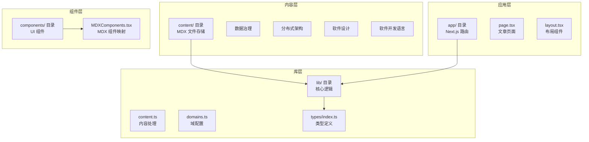
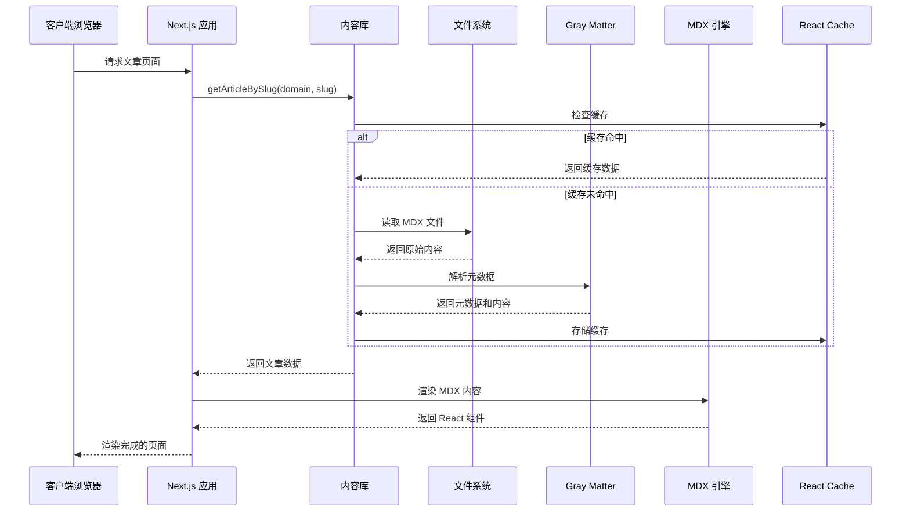
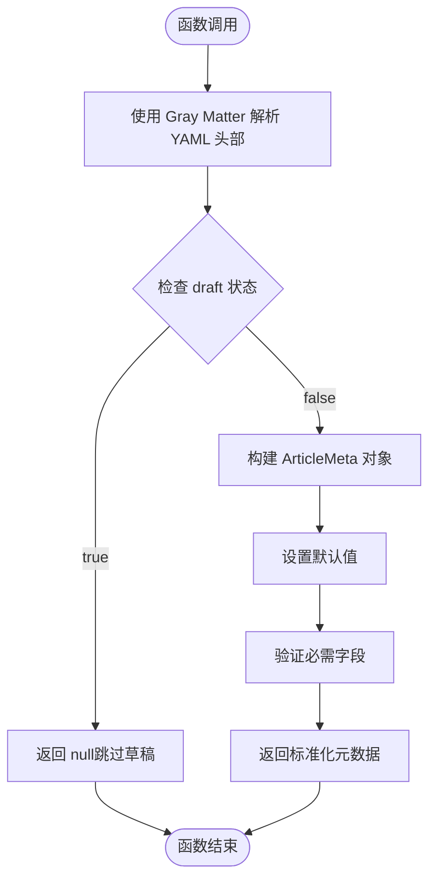
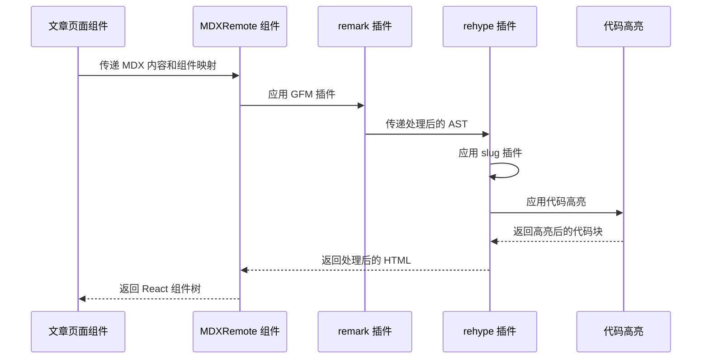
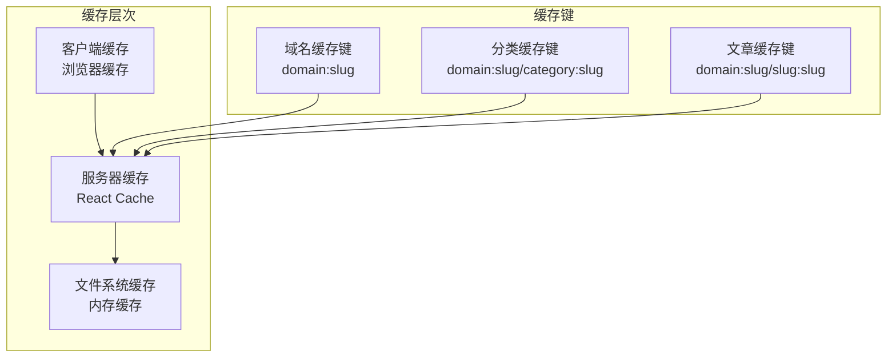

# MDX 内容解析

<cite>
**本文档引用的文件**
- [src/lib/content.ts](file://src/lib/content.ts)
- [src/components/article/MDXComponents.tsx](file://src/components/article/MDXComponents.tsx)
- [src/app/[domain]/[slug]/page.tsx](file://src/app/[domain]/[slug]/page.tsx)
- [src/types/index.ts](file://src/types/index.ts)
- [src/lib/domains.ts](file://src/lib/domains.ts)
- [package.json](file://package.json)
- [content/software-dev-languages/java/spring-boot-intro.mdx](file://content/software-dev-languages/java/spring-boot-intro.mdx)
</cite>

## 目录
1. [简介](#简介)
2. [项目结构](#项目结构)
3. [核心组件](#核心组件)
4. [架构概览](#架构概览)
5. [详细组件分析](#详细组件分析)
6. [依赖关系分析](#依赖关系分析)
7. [性能考虑](#性能考虑)
8. [故障排除指南](#故障排除指南)
9. [结论](#结论)

## 简介

本项目是一个基于 Next.js 16 和 React 19 的现代化博客系统，专门用于解析和渲染 MDX（Markdown + JSX）内容。该系统实现了完整的 MDX 文件读取、解析、缓存和渲染流程，支持多域（domain）和分类（category）的内容组织结构。

系统的核心功能包括：
- MDX 文件的文件系统读取和解析
- Gray Matter 元数据提取和验证
- React Server Components 中的 MDX 内容渲染
- 基于 React Cache 的高性能缓存策略
- 类型安全的 TypeScript 实现

## 项目结构

项目采用模块化架构，主要分为以下几个核心部分：



**图表来源**
- [src/lib/content.ts:1-158](file://src/lib/content.ts#L1-L158)
- [src/app/[domain]/[slug]/page.tsx:1-100](file://src/app/[domain]/[slug]/page.tsx#L1-L100)

**章节来源**
- [src/lib/content.ts:13-158](file://src/lib/content.ts#L13-L158)
- [src/types/index.ts:1-45](file://src/types/index.ts#L1-L45)

## 核心组件

### 内容管理系统

内容管理系统是整个博客系统的核心，负责处理所有 MDX 文件的读取、解析和缓存。主要组件包括：

#### 文件读取器
- 支持递归遍历内容目录
- 自动过滤 .mdx 文件
- 提供统一的文件读取接口

#### 元数据解析器
- 使用 Gray Matter 解析 YAML 头部
- 实现元数据验证和默认值设置
- 支持草稿状态过滤

#### 缓存管理层
- 基于 React Cache 的服务器端缓存
- 避免重复的文件系统操作
- 提升页面渲染性能

**章节来源**
- [src/lib/content.ts:15-43](file://src/lib/content.ts#L15-L43)
- [src/lib/content.ts:45-158](file://src/lib/content.ts#L45-L158)

### MDX 渲染引擎

MDX 渲染引擎负责将解析后的 MDX 内容转换为 React 组件，支持丰富的 Markdown 扩展功能：

#### 插件生态系统
- **remark-gfm**: GitHub Flavored Markdown 支持
- **rehype-slug**: 自动生成标题锚点
- **rehype-pretty-code**: 代码高亮和美化

#### 组件映射系统
- 自定义 HTML 标签渲染
- 响应式设计集成
- 主题化样式系统

**章节来源**
- [src/app/[domain]/[slug]/page.tsx:77-95](file://src/app/[domain]/[slug]/page.tsx#L77-L95)
- [src/components/article/MDXComponents.tsx:3-69](file://src/components/article/MDXComponents.tsx#L3-L69)

## 架构概览

系统采用分层架构设计，确保关注点分离和可维护性：



**图表来源**
- [src/lib/content.ts:102-131](file://src/lib/content.ts#L102-L131)
- [src/app/[domain]/[slug]/page.tsx:34-36](file://src/app/[domain]/[slug]/page.tsx#L34-L36)

## 详细组件分析

### parseArticleMeta 函数详解

parseArticleMeta 函数是元数据解析的核心组件，负责将 MDX 文件的 YAML 头部转换为标准化的 ArticleMeta 对象。

#### 函数工作流程



**图表来源**
- [src/lib/content.ts:29-43](file://src/lib/content.ts#L29-L43)

#### 元数据字段定义

| 字段名 | 类型 | 必需 | 默认值 | 描述 |
|--------|------|------|--------|------|
| slug | string | 是 | 文件名（无扩展名） | 文章唯一标识符 |
| title | string | 否 | slug | 文章标题 |
| date | string | 否 | "1970-01-01" | 发布日期（YYYY-MM-DD） |
| updated | string | 否 | undefined | 更新日期 |
| summary | string | 否 | "" | 文章摘要 |
| tags | string[] | 否 | [] | 标签数组 |
| category | string | 否 | "" | 分类标识符 |
| domain | string | 否 | "" | 域标识符 |
| draft | boolean | 否 | false | 是否为草稿 |

#### 验证规则

1. **草稿过滤**: draft 为 true 的文章会被完全跳过
2. **类型验证**: 确保所有字段具有正确的数据类型
3. **格式验证**: 日期字段必须符合 YYYY-MM-DD 格式
4. **空值处理**: 自动为缺失字段提供合理默认值

**章节来源**
- [src/lib/content.ts:29-43](file://src/lib/content.ts#L29-L43)
- [src/types/index.ts:17-27](file://src/types/index.ts#L17-L27)

### MDX 内容渲染机制

MDX 内容渲染采用 Next.js 的 RSC（React Server Components）架构，实现了高效的 SSR 和静态生成。

#### 渲染流程



**图表来源**
- [src/app/[domain]/[slug]/page.tsx:77-95](file://src/app/[domain]/[slug]/page.tsx#L77-L95)

#### 插件配置详解

| 插件名称 | 功能 | 配置选项 |
|----------|------|----------|
| remark-gfm | GitHub Flavored Markdown | 默认启用 |
| rehype-slug | 自动生成标题锚点 | 自动生成 ID |
| rehype-pretty-code | 代码高亮 | 主题: monokai, keepBackground: true |
| rehype-autolink-headings | 自动链接标题 | 可选配置 |

#### 组件映射系统

系统提供了全面的 HTML 标签到 React 组件的映射：

| HTML 标签 | React 组件 | 特殊属性 |
|-----------|------------|----------|
| h1, h2, h3 | 标题组件 | 字体、间距、颜色 |
| a | 链接组件 | 外链自动添加 target="_blank" |
| blockquote | 引用组件 | 边框、斜体、主题色 |
| pre | 代码容器 | 滚动、背景色、圆角 |
| ul, ol | 列表组件 | 间距、项目符号 |
| table, th, td | 表格组件 | 边框、内边距、主题色 |

**章节来源**
- [src/components/article/MDXComponents.tsx:3-69](file://src/components/article/MDXComponents.tsx#L3-L69)
- [src/app/[domain]/[slug]/page.tsx:77-95](file://src/app/[domain]/[slug]/page.tsx#L77-L95)

### 缓存策略实现

系统采用多层缓存策略，结合 React Cache 和内存缓存，确保最佳性能。

#### 缓存层次结构



**图表来源**
- [src/lib/content.ts:45-158](file://src/lib/content.ts#L45-L158)

#### 缓存函数详解

| 函数名 | 缓存键 | 缓存时长 | 用途 |
|--------|--------|----------|------|
| getAllDomains | domains | 应用启动时 | 获取所有域信息 |
| getDomainWithCategories | domain:slug | 应用启动时 | 获取域及其分类 |
| getArticlesByDomain | domain:slug | 应用启动时 | 获取域内所有文章元数据 |
| getArticlesByCategory | domain:slug/category:slug | 应用启动时 | 获取分类下文章元数据 |
| getArticleBySlug | domain:slug/slug:slug | 应用启动时 | 获取单篇文章详情 |
| getSidebarData | domain:slug | 应用启动时 | 获取侧边栏数据 |
| getAllArticleSlugs | all-slugs | 应用启动时 | 获取所有文章路由参数 |

#### 性能优化策略

1. **预渲染**: 使用 generateStaticParams 预生成所有文章页面
2. **缓存复用**: 相同查询结果在请求间共享
3. **懒加载**: 分类数据按需加载
4. **内存优化**: 合理的缓存大小控制

**章节来源**
- [src/lib/content.ts:45-158](file://src/lib/content.ts#L45-L158)
- [src/app/[domain]/[slug]/page.tsx:10-13](file://src/app/[domain]/[slug]/page.tsx#L10-L13)

## 依赖关系分析

系统依赖关系清晰，遵循单一职责原则：

```mermaid
graph LR
subgraph "外部依赖"
GRAY_MATTER[gray-matter<br/>YAML 解析]
NEXT_MDX_REMOTE[next-mdx-remote<br/>MDX 渲染]
REHYPE_PRETTY_CODE[rehype-pretty-code<br/>代码高亮]
REMARK_GFM[remark-gfm<br/>GitHub Flavored Markdown]
end
subgraph "内部模块"
CONTENT_LIB[src/lib/content.ts<br/>内容处理]
DOMAINS_LIB[src/lib/domains.ts<br/>域配置]
TYPES[src/types/index.ts<br/>类型定义]
MDX_COMP[src/components/article/MDXComponents.tsx<br/>组件映射]
PAGE[src/app/[domain]/[slug]/page.tsx<br/>页面组件]
end
CONTENT_LIB --> GRAY_MATTER
PAGE --> NEXT_MDX_REMOTE
PAGE --> REHYPE_PRETTY_CODE
PAGE --> REMARK_GFM
PAGE --> MDX_COMP
CONTENT_LIB --> DOMAINS_LIB
CONTENT_LIB --> TYPES
MDX_COMP --> TYPES
```

**图表来源**
- [package.json:11-24](file://package.json#L11-L24)
- [src/lib/content.ts:1-12](file://src/lib/content.ts#L1-L12)

**章节来源**
- [package.json:11-24](file://package.json#L11-L24)
- [src/lib/content.ts:1-12](file://src/lib/content.ts#L1-L12)

## 性能考虑

### 缓存策略优化

1. **React Cache 使用**: 所有异步数据获取都使用 React Cache 包装
2. **内存缓存**: 避免重复的文件系统访问
3. **批量操作**: 分类数据通过 Promise.all 并行获取

### 渲染性能优化

1. **静态生成**: 使用 generateStaticParams 预生成所有文章页面
2. **增量更新**: 只在内容变更时重新生成页面
3. **资源优化**: 代码高亮使用主题缓存

### 文件系统优化

1. **路径缓存**: 内容目录路径在应用启动时确定
2. **文件过滤**: 只处理 .mdx 文件，忽略其他文件
3. **编码处理**: 统一使用 UTF-8 编码

## 故障排除指南

### 常见问题及解决方案

#### 1. MDX 文件无法读取

**症状**: 页面显示 404 或空白内容

**可能原因**:
- 文件路径不正确
- 文件权限问题
- 文件编码错误

**解决方案**:
1. 检查文件是否位于正确的目录结构中
2. 验证文件权限设置
3. 确认文件编码为 UTF-8

#### 2. 元数据解析失败

**症状**: 文章列表中缺少元数据或显示异常

**可能原因**:
- YAML 头部格式错误
- 必需字段缺失
- 数据类型不匹配

**解决方案**:
1. 检查 YAML 头部语法
2. 确保必需字段存在
3. 验证数据类型正确性

#### 3. MDX 渲染错误

**症状**: 页面渲染失败或显示代码片段

**可能原因**:
- MDX 语法错误
- 组件映射缺失
- 插件配置问题

**解决方案**:
1. 检查 MDX 语法正确性
2. 验证组件映射完整性
3. 确认插件版本兼容性

#### 4. 缓存问题

**症状**: 内容更新后未反映在页面上

**可能原因**:
- 缓存未正确失效
- 缓存键冲突
- 内存缓存溢出

**解决方案**:
1. 清除应用缓存
2. 检查缓存键生成逻辑
3. 调整缓存策略

### 调试技巧

1. **启用开发模式**: 使用 `npm run dev` 启动开发服务器
2. **检查网络请求**: 使用浏览器开发者工具查看 API 调用
3. **日志输出**: 在关键函数中添加调试日志
4. **单元测试**: 为核心函数编写测试用例

**章节来源**
- [src/lib/content.ts:15-27](file://src/lib/content.ts#L15-L27)
- [src/app/[domain]/[slug]/page.tsx:34-L36](file://src/app/[domain]/[slug]/page.tsx#L34-L36)

## 结论

本 MDX 内容解析系统实现了现代化博客平台所需的核心功能，具有以下特点：

### 技术优势
- **类型安全**: 完整的 TypeScript 类型定义
- **性能优化**: 多层缓存策略和 React Server Components
- **可扩展性**: 模块化架构支持功能扩展
- **易维护性**: 清晰的代码结构和文档

### 架构特色
- **分层设计**: 关注点分离，职责明确
- **插件化**: 支持灵活的 Markdown 扩展
- **响应式**: 完整的移动端适配
- **主题化**: 支持自定义样式系统

### 最佳实践建议
1. **内容组织**: 遵循既定的目录结构和命名规范
2. **元数据管理**: 确保 YAML 头部的完整性和准确性
3. **性能监控**: 定期检查缓存命中率和页面加载时间
4. **版本控制**: 使用 Git 跟踪内容变更历史

该系统为构建高质量的技术博客平台提供了坚实的基础，通过合理的架构设计和性能优化，能够满足现代 Web 应用的需求。