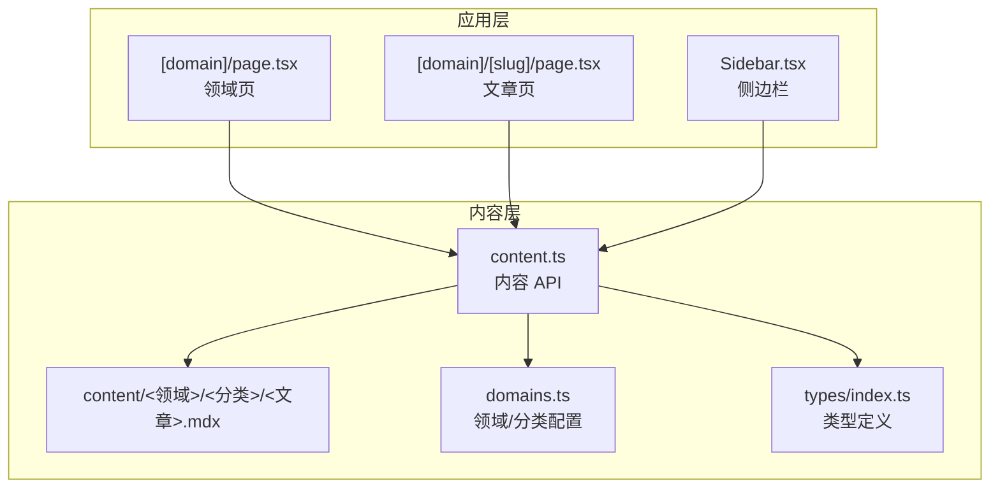
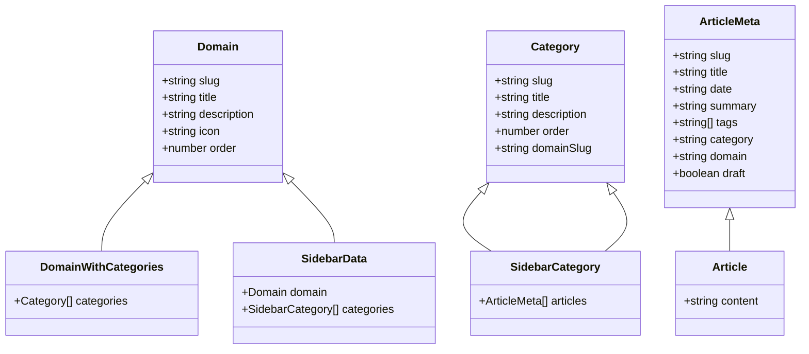
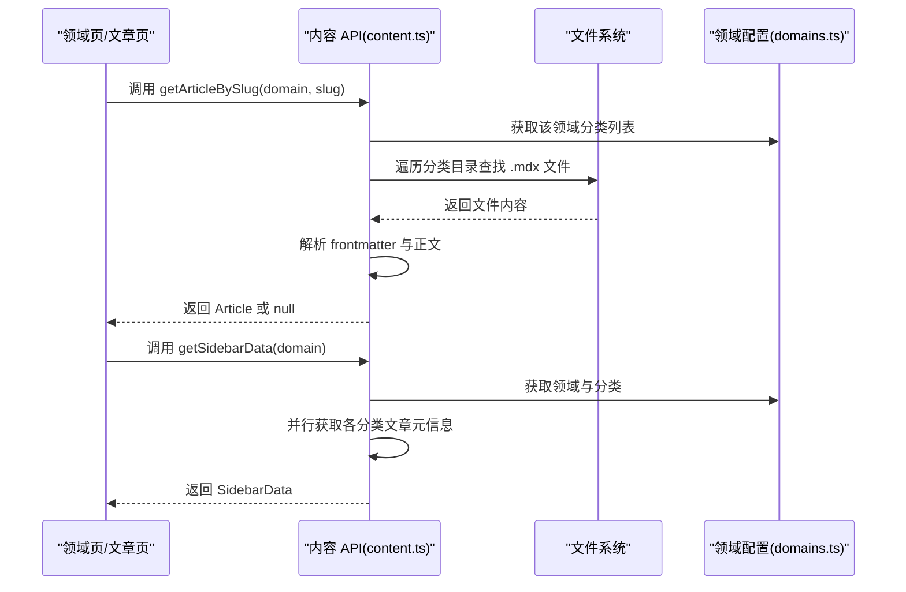
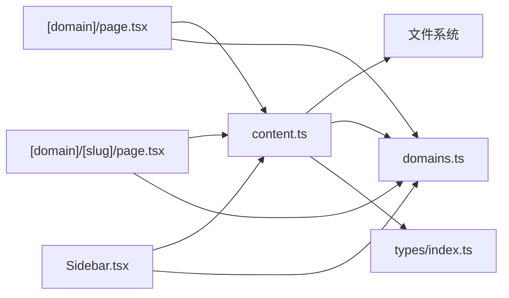

# 内容 API 接口

<cite>
**本文引用的文件**
- [src/lib/content.ts](file://src/lib/content.ts)
- [src/lib/domains.ts](file://src/lib/domains.ts)
- [src/types/index.ts](file://src/types/index.ts)
- [src/app/[domain]/page.tsx](file://src/app/[domain]/page.tsx)
- [src/app/[domain]/[slug]/page.tsx](file://src/app/[domain]/[slug]/page.tsx)
- [src/components/layout/Sidebar.tsx](file://src/components/layout/Sidebar.tsx)
- [src/config/site.ts](file://src/config/site.ts)
- [package.json](file://package.json)
</cite>

## 目录
1. [简介](#简介)
2. [项目结构](#项目结构)
3. [核心组件](#核心组件)
4. [架构总览](#架构总览)
5. [详细组件分析](#详细组件分析)
6. [依赖分析](#依赖分析)
7. [性能考虑](#性能考虑)
8. [故障排查指南](#故障排查指南)
9. [结论](#结论)
10. [附录](#附录)

## 简介
本文件面向内容 API 接口的使用者与维护者，系统化梳理 blog_new 项目中的内容访问接口，包括 getAllDomains、getDomainWithCategories、getArticlesByDomain、getArticlesByCategory、getArticleBySlug、getSidebarData、getAllArticleSlugs 等函数。文档从接口职责、参数与返回值、调用场景、缓存机制、性能优化、错误处理与边界情况、扩展与定制建议等方面进行深入说明，并辅以可视化图示帮助理解。

## 项目结构
该项目采用 Next.js App Router 结构，内容以 MDX 文件形式存储在 content 目录下，按“领域/分类”组织。内容读取与解析逻辑集中在 src/lib/content.ts 中，领域与分类配置位于 src/lib/domains.ts，类型定义位于 src/types/index.ts。页面路由与静态生成在 src/app 下的动态路由中完成，侧边栏组件在 src/components/layout/Sidebar.tsx 中渲染。

图表来源
- [src/app/[domain]/page.tsx](file://src/app/[domain]/page.tsx#L1-L89)
- [src/app/[domain]/[slug]/page.tsx](file://src/app/[domain]/[slug]/page.tsx#L1-L100)
- [src/components/layout/Sidebar.tsx:1-126](file://src/components/layout/Sidebar.tsx#L1-L126)
- [src/lib/content.ts:1-158](file://src/lib/content.ts#L1-L158)
- [src/lib/domains.ts:1-136](file://src/lib/domains.ts#L1-L136)
- [src/types/index.ts:1-45](file://src/types/index.ts#L1-L45)

章节来源
- [src/lib/content.ts:1-158](file://src/lib/content.ts#L1-L158)
- [src/lib/domains.ts:1-136](file://src/lib/domains.ts#L1-L136)
- [src/types/index.ts:1-45](file://src/types/index.ts#L1-L45)
- [src/app/[domain]/page.tsx](file://src/app/[domain]/page.tsx#L1-L89)
- [src/app/[domain]/[slug]/page.tsx](file://src/app/[domain]/[slug]/page.tsx#L1-L100)
- [src/components/layout/Sidebar.tsx:1-126](file://src/components/layout/Sidebar.tsx#L1-L126)

## 核心组件
本节概述内容 API 的七个核心函数及其职责与数据模型关系：

- getAllDomains：返回全部领域信息（带顺序与图标）。
- getDomainWithCategories：根据领域 slug 返回领域及该领域的分类列表。
- getArticlesByDomain：返回某领域下所有文章的元信息（按日期降序）。
- getArticlesByCategory：返回某领域某分类下的文章元信息（按日期降序）。
- getArticleBySlug：根据领域 slug 与文章 slug 返回完整文章（含正文）。
- getSidebarData：为侧边栏生成数据，包含领域、分类与各分类下的文章元信息。
- getAllArticleSlugs：返回全站文章的领域+slug 列表，用于静态生成。

图表来源
- [src/types/index.ts:1-45](file://src/types/index.ts#L1-L45)

章节来源
- [src/types/index.ts:1-45](file://src/types/index.ts#L1-L45)

## 架构总览
内容 API 的调用链路如下：页面组件通过路由参数调用内容 API；内容 API 读取本地 MDX 文件，解析 YAML 头部元数据，组装为统一的数据模型；最终返回给页面组件进行渲染。侧边栏组件消费 getSidebarData 生成导航树。

图表来源
- [src/lib/content.ts:102-146](file://src/lib/content.ts#L102-L146)
- [src/lib/domains.ts:129-136](file://src/lib/domains.ts#L129-L136)
- [src/app/[domain]/[slug]/page.tsx](file://src/app/[domain]/[slug]/page.tsx#L15-L36)
- [src/components/layout/Sidebar.tsx:13-68](file://src/components/layout/Sidebar.tsx#L13-L68)

## 详细组件分析

### getAllDomains
- 职责：返回全部领域列表，包含 slug、标题、描述、图标与排序字段。
- 参数：无。
- 返回值：Domain[]。
- 使用场景：首页展示领域卡片、面包屑、SEO 元数据生成。
- 实现要点：直接返回预置的 domains 数组，经 React 缓存包装后复用。
- 边界情况：若 domains 配置为空或缺失，返回空数组；调用方需确保配置正确。
- 性能：O(1)，无 IO。

章节来源
- [src/lib/content.ts:45-47](file://src/lib/content.ts#L45-L47)
- [src/lib/domains.ts:3-32](file://src/lib/domains.ts#L3-L32)

### getDomainWithCategories
- 职责：返回指定领域及其分类列表。
- 参数：domainSlug: string。
- 返回值：DomainWithCategories | null。
- 使用场景：领域页头部信息与分类导航。
- 实现要点：先获取领域对象，再获取该领域的分类列表，合并返回。
- 边界情况：不存在的领域返回 null。
- 性能：O(1) + 分类查询 O(k)（k 为分类数），经缓存后命中率高。

章节来源
- [src/lib/content.ts:49-56](file://src/lib/content.ts#L49-L56)
- [src/lib/domains.ts:129-136](file://src/lib/domains.ts#L129-L136)

### getArticlesByDomain
- 职责：返回某领域下所有文章的元信息，按发布时间降序排列。
- 参数：domainSlug: string。
- 返回值：ArticleMeta[]。
- 使用场景：领域页按分类聚合展示文章列表。
- 实现要点：遍历该领域下所有分类目录，读取 .mdx 文件，解析 frontmatter，填充 domain 与 category 字段。
- 边界情况：无有效文章时返回空数组；草稿文章被过滤。
- 性能：O(N) 读取文件 + O(M log M) 排序（M 为文章总数）；经缓存显著提升二次访问性能。

章节来源
- [src/lib/content.ts:58-78](file://src/lib/content.ts#L58-L78)

### getArticlesByCategory
- 职责：返回某领域某分类下的文章元信息，按发布时间降序排列。
- 参数：domainSlug: string, categorySlug: string。
- 返回值：ArticleMeta[]。
- 使用场景：分类页展示该分类下的文章列表。
- 实现要点：定位到 content/<domain>/<category> 目录，读取 .mdx 文件并解析。
- 边界情况：目录不存在或无文件时返回空数组；草稿文章被过滤。
- 性能：O(N) 读取文件 + O(M log M) 排序（M 为该分类文章数）；缓存命中可避免重复 IO。

章节来源
- [src/lib/content.ts:80-100](file://src/lib/content.ts#L80-L100)

### getArticleBySlug
- 职责：根据领域与文章 slug 返回完整文章（含正文）。
- 参数：domainSlug: string, slug: string。
- 返回值：Article | null。
- 使用场景：文章详情页渲染。
- 实现要点：遍历该领域所有分类目录，查找匹配的 .mdx 文件，解析 frontmatter 与 content。
- 边界情况：未找到返回 null；调用方需处理 404。
- 性能：最坏情况下需遍历该领域所有分类目录；缓存命中可显著降低 IO。

章节来源
- [src/lib/content.ts:102-131](file://src/lib/content.ts#L102-L131)

### getSidebarData
- 职责：为侧边栏生成导航数据，包含领域、分类与各分类下的文章元信息。
- 参数：domainSlug: string。
- 返回值：SidebarData | null。
- 使用场景：侧边栏展开/折叠、当前文章高亮、移动端导航。
- 实现要点：获取领域与分类，然后并行获取各分类的文章元信息，组装返回。
- 边界情况：不存在的领域返回 null。
- 性能：并行请求各分类文章元信息，减少等待时间；整体受分类数量与文章数量影响。

章节来源
- [src/lib/content.ts:133-146](file://src/lib/content.ts#L133-L146)
- [src/components/layout/Sidebar.tsx:13-68](file://src/components/layout/Sidebar.tsx#L13-L68)

### getAllArticleSlugs
- 职责：返回全站文章的领域+slug 列表，用于静态生成。
- 参数：无。
- 返回值：{ domain: string; slug: string }[]。
- 使用场景：文章页静态生成参数生成。
- 实现要点：遍历所有领域，获取该领域所有文章，拼装 domain 与 slug。
- 边界情况：无文章时返回空数组。
- 性能：O(N) 遍历领域与文章；静态生成仅在构建时执行。

章节来源
- [src/lib/content.ts:148-157](file://src/lib/content.ts#L148-L157)
- [src/app/[domain]/[slug]/page.tsx](file://src/app/[domain]/[slug]/page.tsx#L10-L13)

## 依赖分析
- 内容 API 对文件系统的依赖：读取 content 目录下的 .mdx 文件，解析 YAML frontmatter。
- 内容 API 对领域配置的依赖：通过 domains.ts 与 categoriesByDomain 获取领域与分类元数据。
- 类型系统：统一的 Domain、Category、ArticleMeta、Article、SidebarData、DomainWithCategories 类型保证数据一致性。
- 页面与组件依赖：领域页、文章页、侧边栏均依赖内容 API 返回的数据进行渲染。

图表来源
- [src/lib/content.ts:1-158](file://src/lib/content.ts#L1-L158)
- [src/lib/domains.ts:1-136](file://src/lib/domains.ts#L1-L136)
- [src/types/index.ts:1-45](file://src/types/index.ts#L1-L45)
- [src/app/[domain]/page.tsx](file://src/app/[domain]/page.tsx#L1-L89)
- [src/app/[domain]/[slug]/page.tsx](file://src/app/[domain]/[slug]/page.tsx#L1-L100)
- [src/components/layout/Sidebar.tsx:1-126](file://src/components/layout/Sidebar.tsx#L1-L126)

章节来源
- [src/lib/content.ts:1-158](file://src/lib/content.ts#L1-L158)
- [src/lib/domains.ts:1-136](file://src/lib/domains.ts#L1-L136)
- [src/types/index.ts:1-45](file://src/types/index.ts#L1-L45)
- [src/app/[domain]/page.tsx](file://src/app/[domain]/page.tsx#L1-L89)
- [src/app/[domain]/[slug]/page.tsx](file://src/app/[domain]/[slug]/page.tsx#L1-L100)
- [src/components/layout/Sidebar.tsx:1-126](file://src/components/layout/Sidebar.tsx#L1-L126)

## 性能考虑
- 缓存策略
  - 所有内容 API 均使用 React 缓存包装，键基于函数参数（如 domainSlug、slug）。这使得同一参数的多次调用命中缓存，避免重复 IO 与解析。
  - 建议：在页面渲染周期内复用同一参数调用，充分利用缓存。
- 并发优化
  - getSidebarData 对各分类文章元信息采用并行获取，减少总等待时间。
  - getArticlesByDomain 在遍历分类时逐个读取文件，可在分类较多时考虑分批或懒加载策略。
- I/O 优化
  - 将内容文件按领域/分类组织，减少不必要的目录扫描。
  - 对草稿过滤在解析阶段完成，避免后续渲染阶段的额外判断。
- 构建期优化
  - getAllArticleSlugs 仅在构建时运行，生成静态路由参数，减少运行时计算。
- 前端交互
  - 侧边栏使用客户端状态控制展开/收起，结合路径高亮提升用户体验。

章节来源
- [src/lib/content.ts:45-157](file://src/lib/content.ts#L45-L157)
- [src/app/[domain]/[slug]/page.tsx](file://src/app/[domain]/[slug]/page.tsx#L10-L13)
- [src/components/layout/Sidebar.tsx:13-68](file://src/components/layout/Sidebar.tsx#L13-L68)

## 故障排查指南
- 文章未显示或 404
  - 检查文章是否存在于 content/<domain>/<category>/<slug>.mdx。
  - 确认 frontmatter 中的 domain 与 category 与实际目录一致。
  - 确认 slug 与文件名一致（不含 .mdx 后缀）。
  - 若为草稿，draft 字段为 true 时会被过滤。
- 领域或分类不显示
  - 检查 domains.ts 与 categoriesByDomain 是否包含对应 slug。
  - 确认目录结构与 slug 一致。
- 侧边栏无数据
  - 检查 getSidebarData 返回值是否为 null（领域不存在）。
  - 确认分类下存在文章，否则 categories 中 articles 为空数组属正常。
- 性能问题
  - 观察是否存在大量分类导致 getArticlesByDomain 遍历耗时。
  - 建议在新增分类时控制文章数量，或引入分页/懒加载。
- 构建失败
  - 确保 getAllArticleSlugs 能正确枚举所有文章，避免遗漏 slug 导致静态生成失败。

章节来源
- [src/lib/content.ts:102-157](file://src/lib/content.ts#L102-L157)
- [src/lib/domains.ts:34-127](file://src/lib/domains.ts#L34-L127)
- [src/app/[domain]/[slug]/page.tsx](file://src/app/[domain]/[slug]/page.tsx#L34-L36)

## 结论
本内容 API 通过清晰的领域/分类/文章三层结构与统一的数据模型，提供了稳定、可扩展的内容访问能力。配合 React 缓存与并行请求，能在保证数据一致性的同时获得良好的性能表现。建议在新增内容时严格遵循目录与 frontmatter 约定，并在页面层做好 404 与空数据的兜底处理。

## 附录

### 接口清单与使用示例（路径指引）
- 获取全部领域
  - 路径：[src/lib/content.ts:45-47](file://src/lib/content.ts#L45-L47)
  - 示例用途：首页领域卡片渲染。
- 获取领域与分类
  - 路径：[src/lib/content.ts:49-56](file://src/lib/content.ts#L49-L56)
  - 示例用途：领域页头部信息与分类导航。
- 获取领域下所有文章
  - 路径：[src/lib/content.ts:58-78](file://src/lib/content.ts#L58-L78)
  - 示例用途：领域页按分类聚合展示。
- 获取分类下所有文章
  - 路径：[src/lib/content.ts:80-100](file://src/lib/content.ts#L80-L100)
  - 示例用途：分类页文章列表。
- 获取单篇文章
  - 路径：[src/lib/content.ts:102-131](file://src/lib/content.ts#L102-L131)
  - 示例用途：文章详情页渲染。
- 生成侧边栏数据
  - 路径：[src/lib/content.ts:133-146](file://src/lib/content.ts#L133-L146)
  - 示例用途：侧边栏导航树。
- 生成全站文章 slug 列表
  - 路径：[src/lib/content.ts:148-157](file://src/lib/content.ts#L148-L157)
  - 示例用途：静态生成文章页路由参数。

### 错误处理与边界情况
- 未找到领域/分类：返回 null 或空数组，调用方需进行判空处理。
- 未找到文章：返回 null，页面应跳转 404。
- 草稿文章：解析阶段过滤，不在公开接口中返回。
- 目录不存在：读取函数返回空结果，不抛错。

### 扩展与定制建议
- 新增领域/分类
  - 在 domains.ts 与 categoriesByDomain 中添加条目。
  - 在 content 目录下创建对应目录并放置 .mdx 文件。
- 自定义字段
  - 在 frontmatter 中新增字段并在类型定义中补充，确保类型安全。
- 性能扩展
  - 引入分页或懒加载，减少一次性渲染的文章数量。
  - 对热门领域/文章增加预热缓存策略。
- SEO 优化
  - 在 frontmatter 中完善 title、description、date 等字段，供页面元数据生成使用。
- 安全与校验
  - 对 slug 与路径进行白名单校验，防止路径穿越。
  - 对 frontmatter 进行必填字段校验，保证渲染稳定性。