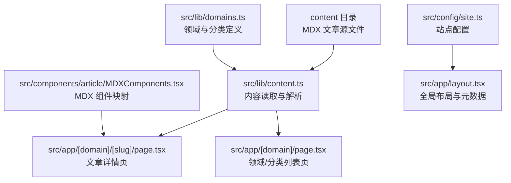
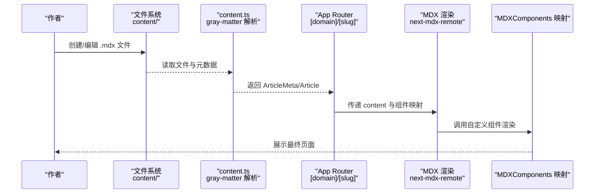
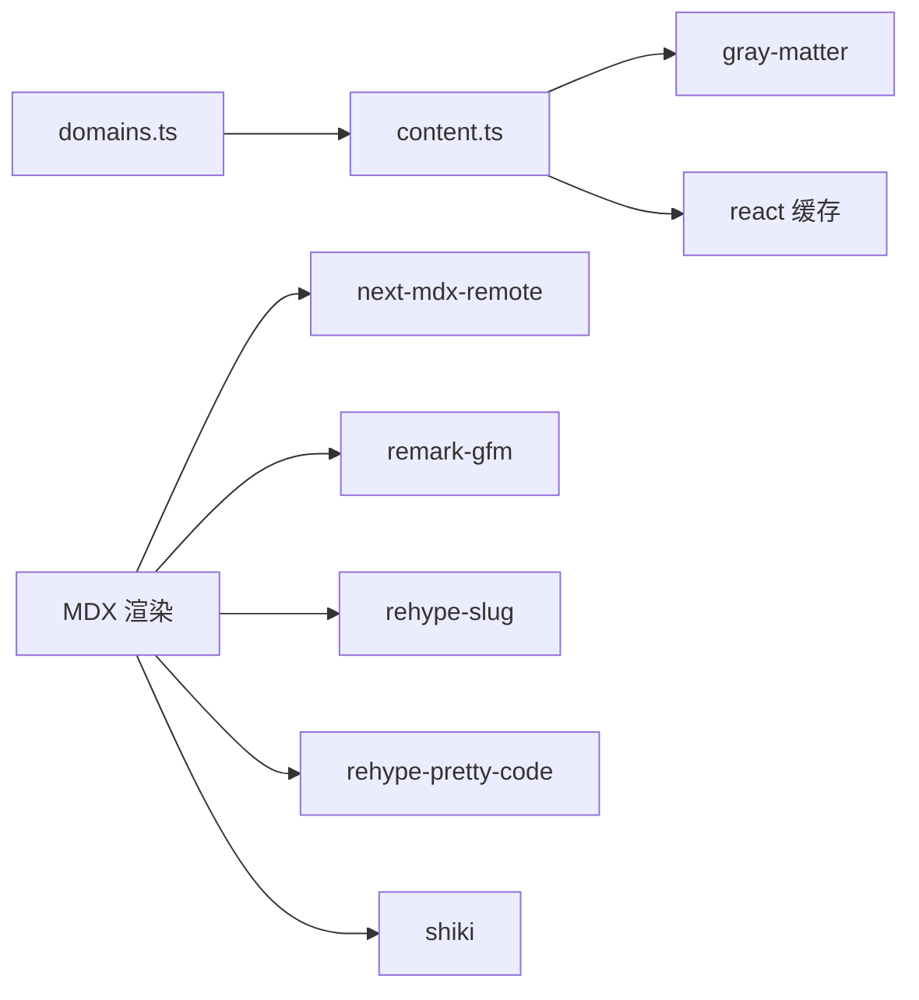

# 内容创作指南

<cite>
**本文引用的文件**
- [README.md](file://README.md)
- [package.json](file://package.json)
- [src/types/index.ts](file://src/types/index.ts)
- [src/lib/domains.ts](file://src/lib/domains.ts)
- [src/lib/content.ts](file://src/lib/content.ts)
- [src/app/[domain]/[slug]/page.tsx](file://src/app/[domain]/[slug]/page.tsx)
- [src/app/[domain]/page.tsx](file://src/app/[domain]/page.tsx)
- [src/app/page.tsx](file://src/app/page.tsx)
- [src/components/article/MDXComponents.tsx](file://src/components/article/MDXComponents.tsx)
- [content/software-dev-languages/java/spring-boot-intro.mdx](file://content/software-dev-languages/java/spring-boot-intro.mdx)
- [content/distributed-architecture/message-queue/kafka-core-concepts.mdx](file://content/distributed-architecture/message-queue/kafka-core-concepts.mdx)
- [content/software-design/ddd/ddd-bounded-context.mdx](file://content/software-design/ddd/ddd-bounded-context.mdx)
- [src/config/site.ts](file://src/config/site.ts)
</cite>

## 目录
1. [简介](#简介)
2. [项目结构](#项目结构)
3. [核心组件](#核心组件)
4. [架构总览](#架构总览)
5. [详细组件分析](#详细组件分析)
6. [依赖分析](#依赖分析)
7. [性能考虑](#性能考虑)
8. [故障排除指南](#故障排除指南)
9. [结论](#结论)
10. [附录](#附录)

## 简介
本指南面向内容创作者，提供 blog_new 项目的完整 MDX 内容编写规范与创作流程。内容涵盖：
- 元数据字段的填写要求与最佳实践
- 标题格式与内容结构规范
- 新文章创建、预览、发布与上线的完整步骤
- 内容版本管理与草稿功能使用
- 内容组织最佳实践（文件命名、目录结构、元数据管理）
- 内容质量控制标准与检查清单
- 常见创作问题解决方案与编辑技巧
- 批量内容管理与迁移指导

## 项目结构
blog_new 基于 Next.js 构建，采用 App Router 结构，内容以 MDX 文件形式存储在 content 目录中，运行时通过灰度解析（gray-matter）提取元数据并渲染为页面。

图表来源
- [src/lib/content.ts:1-158](file://src/lib/content.ts#L1-L158)
- [src/lib/domains.ts:1-136](file://src/lib/domains.ts#L1-L136)
- [src/app/[domain]/[slug]/page.tsx:1-100](file://src/app/[domain]/[slug]/page.tsx#L1-L100)
- [src/app/[domain]/page.tsx:1-89](file://src/app/[domain]/page.tsx#L1-L89)
- [src/components/article/MDXComponents.tsx:1-70](file://src/components/article/MDXComponents.tsx#L1-L70)
- [src/config/site.ts:1-13](file://src/config/site.ts#L1-L13)

章节来源
- [README.md:1-37](file://README.md#L1-L37)
- [package.json:1-36](file://package.json#L1-L36)

## 核心组件
- 内容解析与路由：通过 gray-matter 解析 MDX 元数据，按领域/分类组织文章，支持草稿过滤与静态生成参数。
- MDX 渲染：使用 next-mdx-remote 将 MDX 内容渲染为 HTML，并通过自定义组件映射统一样式。
- 领域与分类：通过 domains.ts 定义领域与分类，content.ts 读取并聚合文章元数据。
- 页面生成：App Router 动态路由根据 slug 与 domain 渲染文章详情页与分类列表页。

章节来源
- [src/lib/content.ts:1-158](file://src/lib/content.ts#L1-L158)
- [src/lib/domains.ts:1-136](file://src/lib/domains.ts#L1-L136)
- [src/components/article/MDXComponents.tsx:1-70](file://src/components/article/MDXComponents.tsx#L1-L70)
- [src/app/[domain]/[slug]/page.tsx:1-100](file://src/app/[domain]/[slug]/page.tsx#L1-L100)
- [src/app/[domain]/page.tsx:1-89](file://src/app/[domain]/page.tsx#L1-L89)

## 架构总览
下面的序列图展示了从创建 MDX 文章到页面渲染的完整流程。

图表来源
- [src/lib/content.ts:102-131](file://src/lib/content.ts#L102-L131)
- [src/app/[domain]/[slug]/page.tsx:38-96](file://src/app/[domain]/[slug]/page.tsx#L38-L96)
- [src/components/article/MDXComponents.tsx:3-69](file://src/components/article/MDXComponents.tsx#L3-L69)

## 详细组件分析

### MDX 元数据规范
- 元数据块必须使用 YAML 三短横线分隔符包裹，字段如下：
  - title：文章标题（必填）
  - date：发布日期（YYYY-MM-DD，必填）
  - summary：摘要（建议填写）
  - tags：标签数组（字符串数组）
  - category：所属分类 slug（与目录一致）
  - domain：所属领域 slug（与目录一致）
  - draft：是否为草稿（布尔值，true 时将被过滤）

- 示例参考：
  - [content/software-dev-languages/java/spring-boot-intro.mdx:1-9](file://content/software-dev-languages/java/spring-boot-intro.mdx#L1-L9)
  - [content/distributed-architecture/message-queue/kafka-core-concepts.mdx:1-9](file://content/distributed-architecture/message-queue/kafka-core-concepts.mdx#L1-L9)
  - [content/software-design/ddd/ddd-bounded-context.mdx:1-9](file://content/software-design/ddd/ddd-bounded-context.mdx#L1-L9)

章节来源
- [src/lib/content.ts:29-43](file://src/lib/content.ts#L29-L43)
- [src/types/index.ts:17-31](file://src/types/index.ts#L17-L31)
- [content/software-dev-languages/java/spring-boot-intro.mdx:1-9](file://content/software-dev-languages/java/spring-boot-intro.mdx#L1-L9)

### 标题格式与内容结构
- 标题层级：使用 #、##、### 表示主标题、二级标题、三级标题；保持层级清晰。
- 内容结构建议：
  - 引言段落概述要点
  - 分点论述，配合代码块与表格
  - 结论总结要点
- 代码块：使用语言标识进行语法高亮（如 java、yaml）。
- 表格与列表：用于对比与要点列举。

章节来源
- [content/software-dev-languages/java/spring-boot-intro.mdx:11-75](file://content/software-dev-languages/java/spring-boot-intro.mdx#L11-L75)
- [content/distributed-architecture/message-queue/kafka-core-concepts.mdx:11-62](file://content/distributed-architecture/message-queue/kafka-core-concepts.mdx#L11-L62)
- [content/software-design/ddd/ddd-bounded-context.mdx:11-42](file://content/software-design/ddd/ddd-bounded-context.mdx#L11-L42)

### 新文章创建流程
- 步骤一：确定领域与分类
  - 领域与分类定义位于 domains.ts，确保选择正确的 domain 与 category。
  - 参考：[src/lib/domains.ts:3-32](file://src/lib/domains.ts#L3-L32)，[src/lib/domains.ts:34-127](file://src/lib/domains.ts#L34-L127)
- 步骤二：创建 MDX 文件
  - 在 content/{domain}/{category}/ 下创建 {slug}.mdx，slug 与文件名需一致。
  - 参考现有文章结构：[content/software-dev-languages/java/spring-boot-intro.mdx:1-75](file://content/software-dev-languages/java/spring-boot-intro.mdx#L1-L75)
- 步骤三：填写元数据
  - 确保 title、date、category、domain、draft 字段正确。
  - 参考：[src/lib/content.ts:29-43](file://src/lib/content.ts#L29-L43)
- 步骤四：本地预览
  - 运行开发服务器，访问 http://localhost:3000/{domain}/{slug}。
  - 参考：[README.md:5-15](file://README.md#L5-L15)
- 步骤五：发布上线
  - 本地确认无误后提交代码，部署至生产环境。
  - 参考：[README.md:32-37](file://README.md#L32-L37)

章节来源
- [src/lib/domains.ts:3-32](file://src/lib/domains.ts#L3-L32)
- [src/lib/domains.ts:34-127](file://src/lib/domains.ts#L34-L127)
- [src/lib/content.ts:102-131](file://src/lib/content.ts#L102-L131)
- [README.md:5-15](file://README.md#L5-L15)

### 内容版本管理与草稿功能
- 草稿管理
  - draft: true 的文章不会出现在公开列表中，仅用于内部草稿。
  - 参考：[src/lib/content.ts:31](file://src/lib/content.ts#L31)
- 版本更新
  - 支持 updated 字段标注更新时间，用于显示“更新于”信息。
  - 参考：[src/app/[domain]/[slug]/page.tsx:53-58](file://src/app/[domain]/[slug]/page.tsx#L53-L58)

章节来源
- [src/lib/content.ts:31](file://src/lib/content.ts#L31)
- [src/app/[domain]/[slug]/page.tsx:53-58](file://src/app/[domain]/[slug]/page.tsx#L53-L58)

### 内容组织最佳实践
- 文件命名
  - 使用小写与连字符，避免空格与特殊字符。
  - 文件名与 slug 保持一致。
- 目录结构
  - content/{domain}/{category}/ 下存放对应文章。
  - domain 与 category 的 slug 必须与 domains.ts 中定义一致。
- 元数据管理
  - 严格维护 domain、category、date、tags、summary 等字段。
  - 参考类型定义：[src/types/index.ts:17-31](file://src/types/index.ts#L17-L31)

章节来源
- [src/lib/domains.ts:34-127](file://src/lib/domains.ts#L34-L127)
- [src/types/index.ts:17-31](file://src/types/index.ts#L17-L31)

### 内容质量控制标准与检查清单
- 元数据完整性
  - [ ] title、date、category、domain 是否填写
  - [ ] draft 是否正确设置
  - [ ] summary 是否简洁准确
  - [ ] tags 是否合理且与内容相关
- 结构与可读性
  - [ ] 标题层级清晰
  - [ ] 代码块语言标识正确
  - [ ] 表格与列表使用恰当
- 技术一致性
  - [ ] 代码风格与项目风格一致
  - [ ] 术语前后一致
  - [ ] 链接有效（外链需新开窗口）
- SEO 与展示
  - [ ] 页面标题与描述符合预期
  - [ ] 文章列表页可正常展示

章节来源
- [src/lib/content.ts:29-43](file://src/lib/content.ts#L29-L43)
- [src/app/[domain]/[slug]/page.tsx:23-26](file://src/app/[domain]/[slug]/page.tsx#L23-L26)

### 常见创作问题与解决方案
- 问题：文章未显示在列表页
  - 排查：确认 draft=false、元数据中的 domain 与 category 与目录一致。
  - 参考：[src/lib/content.ts:31](file://src/lib/content.ts#L31)，[src/lib/content.ts:62-77](file://src/lib/content.ts#L62-L77)
- 问题：页面 404
  - 排查：确认 slug 与文件名一致，路径与域名/分类匹配。
  - 参考：[src/app/[domain]/[slug]/page.tsx:35-36](file://src/app/[domain]/[slug]/page.tsx#L35-L36)
- 问题：代码块未高亮
  - 排查：确保代码块包含语言标识，检查主题与插件配置。
  - 参考：[src/app/[domain]/[slug]/page.tsx:80-94](file://src/app/[domain]/[slug]/page.tsx#L80-L94)
- 问题：链接在新窗口打开
  - 排查：外链会自动添加 target="_blank" 与 rel 属性。
  - 参考：[src/components/article/MDXComponents.tsx:20-29](file://src/components/article/MDXComponents.tsx#L20-L29)

章节来源
- [src/lib/content.ts:31](file://src/lib/content.ts#L31)
- [src/lib/content.ts:62-77](file://src/lib/content.ts#L62-L77)
- [src/app/[domain]/[slug]/page.tsx:35-36](file://src/app/[domain]/[slug]/page.tsx#L35-L36)
- [src/app/[domain]/[slug]/page.tsx:80-94](file://src/app/[domain]/[slug]/page.tsx#L80-L94)
- [src/components/article/MDXComponents.tsx:20-29](file://src/components/article/MDXComponents.tsx#L20-L29)

### 编辑技巧
- 使用标题层级与分节，提升可读性。
- 代码块尽量精简，必要时添加注释说明。
- 使用表格对比相似概念，便于读者理解。
- 合理使用列表与强调，突出重点。

章节来源
- [content/software-dev-languages/java/spring-boot-intro.mdx:11-75](file://content/software-dev-languages/java/spring-boot-intro.mdx#L11-L75)
- [content/distributed-architecture/message-queue/kafka-core-concepts.mdx:11-62](file://content/distributed-architecture/message-queue/kafka-core-concepts.mdx#L11-L62)
- [content/software-design/ddd/ddd-bounded-context.mdx:11-42](file://content/software-design/ddd/ddd-bounded-context.mdx#L11-L42)

### 批量内容管理与迁移
- 批量重命名与迁移
  - 修改 slug 时，需同步更新元数据中的 slug、文件名与目录结构。
  - 参考：[src/lib/content.ts:102-131](file://src/lib/content.ts#L102-L131)
- 批量更新元数据
  - 使用脚本或编辑器批量替换元数据字段，确保与 domains.ts 中定义一致。
  - 参考：[src/lib/domains.ts:34-127](file://src/lib/domains.ts#L34-L127)
- 批量发布
  - 将 draft 字段从 true 改为 false，重新生成静态页面。
  - 参考：[src/lib/content.ts:31](file://src/lib/content.ts#L31)

章节来源
- [src/lib/content.ts:102-131](file://src/lib/content.ts#L102-L131)
- [src/lib/domains.ts:34-127](file://src/lib/domains.ts#L34-L127)
- [src/lib/content.ts:31](file://src/lib/content.ts#L31)

## 依赖分析
- 内容解析依赖 gray-matter 与 react 缓存策略，确保高效读取与缓存。
- MDX 渲染依赖 next-mdx-remote、remark-gfm、rehype-slug、rehype-pretty-code、shiki。
- 领域与分类定义集中于 domains.ts，content.ts 读取并聚合文章元数据。

图表来源
- [src/lib/content.ts:1-158](file://src/lib/content.ts#L1-L158)
- [package.json:11-24](file://package.json#L11-L24)

章节来源
- [package.json:11-24](file://package.json#L11-L24)
- [src/lib/content.ts:1-158](file://src/lib/content.ts#L1-L158)

## 性能考虑
- 使用 React 缓存（cache）减少重复读取与解析成本。
- 静态生成参数基于 getAllArticleSlugs，确保预渲染覆盖所有已发布文章。
- 代码高亮与插件处理在客户端渲染阶段执行，注意代码块数量与复杂度。

章节来源
- [src/lib/content.ts:45-47](file://src/lib/content.ts#L45-L47)
- [src/lib/content.ts:148-157](file://src/lib/content.ts#L148-L157)
- [src/app/[domain]/[slug]/page.tsx:80-94](file://src/app/[domain]/[slug]/page.tsx#L80-L94)

## 故障排除指南
- 开发环境无法启动
  - 检查 Node.js 与包管理器版本，确保依赖安装完成。
  - 参考：[README.md:5-15](file://README.md#L5-L15)，[package.json:5-10](file://package.json#L5-L10)
- 文章未显示
  - 确认 draft=false，元数据与目录一致。
  - 参考：[src/lib/content.ts:31](file://src/lib/content.ts#L31)，[src/lib/domains.ts:34-127](file://src/lib/domains.ts#L34-L127)
- 代码高亮异常
  - 检查代码块语言标识与主题配置。
  - 参考：[src/app/[domain]/[slug]/page.tsx:80-94](file://src/app/[domain]/[slug]/page.tsx#L80-L94)

章节来源
- [README.md:5-15](file://README.md#L5-L15)
- [package.json:5-10](file://package.json#L5-L10)
- [src/lib/content.ts:31](file://src/lib/content.ts#L31)
- [src/lib/domains.ts:34-127](file://src/lib/domains.ts#L34-L127)
- [src/app/[domain]/[slug]/page.tsx:80-94](file://src/app/[domain]/[slug]/page.tsx#L80-L94)

## 结论
本指南提供了 blog_new 项目的完整内容创作规范与操作流程。遵循元数据规范、结构化写作与组织最佳实践，可显著提升内容质量与维护效率。通过草稿与版本管理机制，可安全地进行迭代与发布。遇到问题时，可依据故障排除指南快速定位与修复。

## 附录
- 站点配置与首页展示
  - 参考：[src/config/site.ts:1-13](file://src/config/site.ts#L1-L13)，[src/app/page.tsx:1-48](file://src/app/page.tsx#L1-L48)

章节来源
- [src/config/site.ts:1-13](file://src/config/site.ts#L1-L13)
- [src/app/page.tsx:1-48](file://src/app/page.tsx#L1-L48)