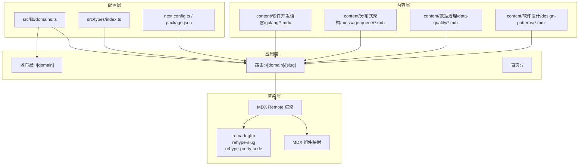
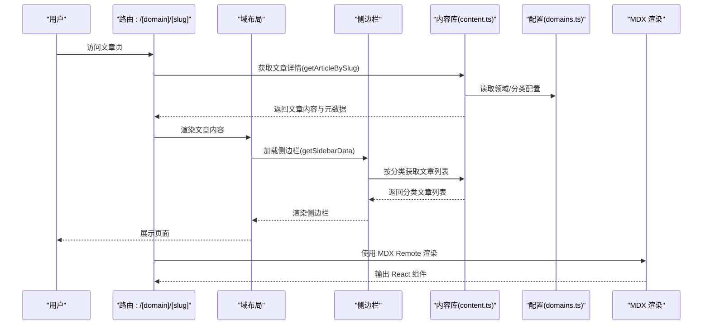
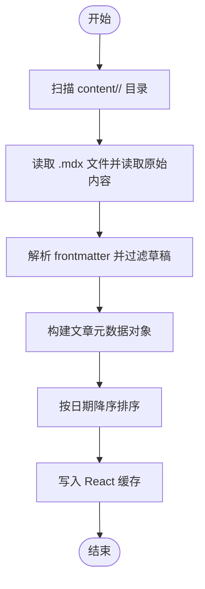
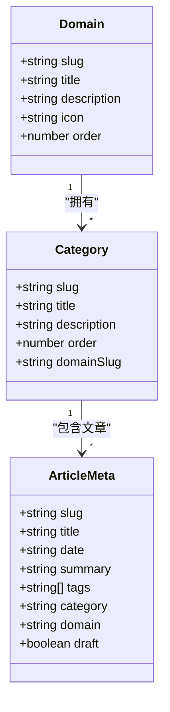
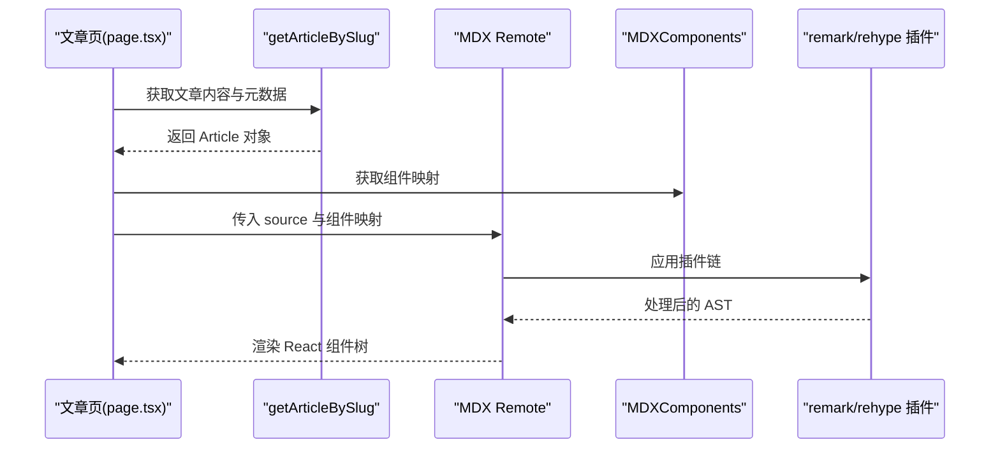
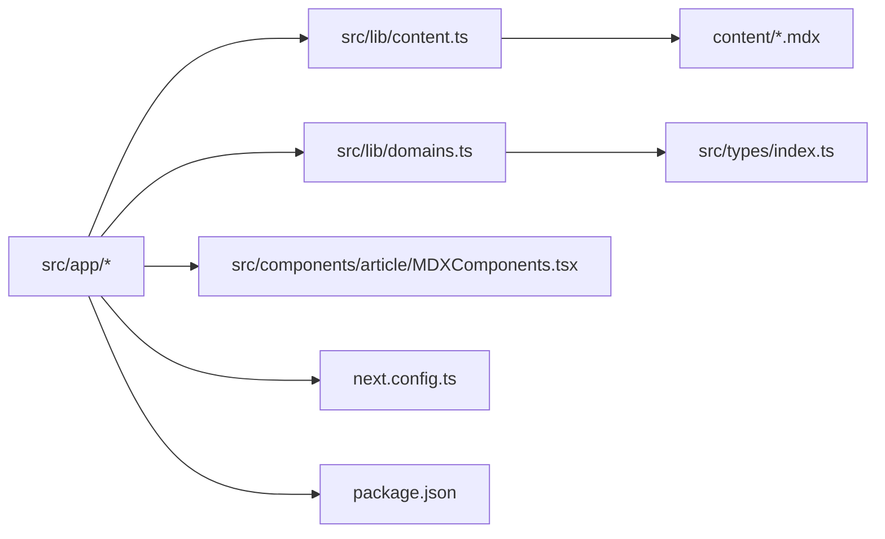

# 内容管理系统

<cite>
**本文引用的文件**
- [README.md](file://README.md)
- [package.json](file://package.json)
- [next.config.ts](file://next.config.ts)
- [src/lib/content.ts](file://src/lib/content.ts)
- [src/lib/domains.ts](file://src/lib/domains.ts)
- [src/types/index.ts](file://src/types/index.ts)
- [src/app/layout.tsx](file://src/app/layout.tsx)
- [src/app/[domain]/layout.tsx](file://src/app/[domain]/layout.tsx)
- [src/app/[domain]/[slug]/page.tsx](file://src/app/[domain]/[slug]/page.tsx)
- [src/components/article/MDXComponents.tsx](file://src/components/article/MDXComponents.tsx)
- [src/components/layout/Sidebar.tsx](file://src/components/layout/Sidebar.tsx)
- [src/app/page.tsx](file://src/app/page.tsx)
- [content/distributed-architecture/message-queue/kafka-core-concepts.mdx](file://content/distributed-architecture/message-queue/kafka-core-concepts.mdx)
</cite>

## 目录
1. [简介](#简介)
2. [项目结构](#项目结构)
3. [核心组件](#核心组件)
4. [架构总览](#架构总览)
5. [详细组件分析](#详细组件分析)
6. [依赖关系分析](#依赖关系分析)
7. [性能考量](#性能考量)
8. [故障排查指南](#故障排查指南)
9. [结论](#结论)
10. [附录](#附录)

## 简介
本项目是一个基于 Next.js App Router 的内容管理系统，采用 MDX 作为内容组织与渲染引擎，围绕“领域-分类-文章”的三层结构进行内容管理。系统通过静态生成与缓存机制提升性能，支持多领域并行扩展与可配置的渲染组件体系。

## 项目结构
- 内容层：content 目录按领域划分，每个领域下再按分类组织 MDX 文章。
- 应用层：Next.js App Router 路由，动态参数 [domain]/[slug] 映射到具体文章页面。
- 渲染层：MDX Remote 将 Markdown + JSX 内容渲染为 React 组件，配合自定义组件映射与语法高亮插件。
- 配置层：站点元信息、字体、主题与构建配置在根目录与 src/config 中统一管理。

图表来源
- [src/app/[domain]/[slug]/page.tsx](file://src/app/[domain]/[slug]/page.tsx#L1-L100)
- [src/lib/content.ts:1-158](file://src/lib/content.ts#L1-L158)
- [src/lib/domains.ts:1-136](file://src/lib/domains.ts#L1-L136)
- [src/components/article/MDXComponents.tsx:1-70](file://src/components/article/MDXComponents.tsx#L1-L70)
- [next.config.ts:1-8](file://next.config.ts#L1-L8)
- [package.json:1-36](file://package.json#L1-L36)

章节来源
- [README.md:1-37](file://README.md#L1-L37)
- [package.json:1-36](file://package.json#L1-L36)
- [next.config.ts:1-8](file://next.config.ts#L1-L8)

## 核心组件
- 内容解析与聚合：负责扫描 content 目录、解析 frontmatter、聚合文章元数据与正文、生成静态路径与侧边栏数据。
- 域与分类配置：集中定义领域与分类的元信息、顺序与归属关系。
- MDX 渲染管线：将 MDX 字符串渲染为 React 组件，注入自定义组件映射与插件链。
- 页面与布局：域名级布局加载侧边栏数据；文章页生成静态参数与 SEO 元数据；首页展示领域卡片。

章节来源
- [src/lib/content.ts:1-158](file://src/lib/content.ts#L1-L158)
- [src/lib/domains.ts:1-136](file://src/lib/domains.ts#L1-L136)
- [src/types/index.ts:1-45](file://src/types/index.ts#L1-L45)
- [src/app/[domain]/[slug]/page.tsx](file://src/app/[domain]/[slug]/page.tsx#L1-L100)
- [src/app/[domain]/layout.tsx](file://src/app/[domain]/layout.tsx#L1-L30)
- [src/app/layout.tsx:1-61](file://src/app/layout.tsx#L1-L61)
- [src/app/page.tsx:1-92](file://src/app/page.tsx#L1-L92)

## 架构总览
系统采用“声明式配置 + 动态渲染”的架构：
- 领域与分类通过配置文件声明，运行时动态加载。
- 文章通过 frontmatter 定义元数据，运行时解析并缓存。
- MDX 内容经由插件链处理后渲染为 React 组件。
- 静态生成与缓存结合，提升首屏与二次访问性能。

图表来源
- [src/app/[domain]/[slug]/page.tsx](file://src/app/[domain]/[slug]/page.tsx#L1-L100)
- [src/app/[domain]/layout.tsx](file://src/app/[domain]/layout.tsx#L1-L30)
- [src/lib/content.ts:102-146](file://src/lib/content.ts#L102-L146)
- [src/lib/domains.ts:1-136](file://src/lib/domains.ts#L1-L136)
- [src/components/article/MDXComponents.tsx:1-70](file://src/components/article/MDXComponents.tsx#L1-L70)

## 详细组件分析

### 内容解析与缓存（content.ts）
职责与流程
- 扫描 content 目录，读取所有 .mdx 文件，提取 slug 与原始内容。
- 使用 gray-matter 解析 frontmatter，过滤草稿，标准化元数据。
- 提供按领域、分类、文章查询的异步接口，并以 React cache 包裹以实现进程内缓存。
- 生成静态参数（getAllArticleSlugs）用于静态生成。

关键点
- 文件读取与遍历：同步读取目录条目，仅处理 .mdx 文件。
- 元数据解析：frontmatter 中必须包含 category 与 domain，否则无法归类。
- 排序规则：按日期降序排列，确保最新文章优先显示。
- 缓存策略：对常用查询（如 getArticlesByDomain、getSidebarData）启用 React cache，避免重复 IO。

图表来源
- [src/lib/content.ts:15-78](file://src/lib/content.ts#L15-L78)

章节来源
- [src/lib/content.ts:1-158](file://src/lib/content.ts#L1-L158)

### 领域与分类配置（domains.ts）
职责与流程
- 定义领域数组与分类映射表，包含 slug、标题、描述、图标、顺序等。
- 提供查询函数：根据领域 slug 获取分类列表，或根据分类 slug 获取所属领域。
- 与内容解析模块协作，确保文章的 domain 与 category 字段与配置一致。

图表来源
- [src/lib/domains.ts:1-136](file://src/lib/domains.ts#L1-L136)
- [src/types/index.ts:1-45](file://src/types/index.ts#L1-L45)

章节来源
- [src/lib/domains.ts:1-136](file://src/lib/domains.ts#L1-L136)
- [src/types/index.ts:1-45](file://src/types/index.ts#L1-L45)

### MDX 渲染与组件映射（page.tsx + MDXComponents.tsx）
职责与流程
- 文章页通过 MDX Remote 将文章正文渲染为 React 组件。
- 注入 remark-gfm 实现 GitHub 风格表格与任务清单；注入 rehype-slug 生成标题锚点；注入 rehype-pretty-code 实现代码高亮。
- 自定义组件映射覆盖默认 HTML 标签，统一标题、链接、块引用、列表、表格等样式。

图表来源
- [src/app/[domain]/[slug]/page.tsx](file://src/app/[domain]/[slug]/page.tsx#L1-L100)
- [src/components/article/MDXComponents.tsx:1-70](file://src/components/article/MDXComponents.tsx#L1-L70)

章节来源
- [src/app/[domain]/[slug]/page.tsx](file://src/app/[domain]/[slug]/page.tsx#L1-L100)
- [src/components/article/MDXComponents.tsx:1-70](file://src/components/article/MDXComponents.tsx#L1-L70)

### 侧边栏与导航（Sidebar.tsx）
职责与流程
- 域布局加载侧边栏数据，渲染领域下的分类与文章列表。
- 支持移动端抽屉式侧边栏，展开/收起切换。
- 根据当前路径高亮对应文章，统计各分类文章数量。

章节来源
- [src/components/layout/Sidebar.tsx:1-126](file://src/components/layout/Sidebar.tsx#L1-L126)
- [src/app/[domain]/layout.tsx](file://src/app/[domain]/layout.tsx#L1-L30)

### 首页与全局布局（page.tsx + layout.tsx）
职责与流程
- 首页展示领域卡片，点击进入相应领域。
- 全局布局加载所有领域及其分类，传递给导航组件。

章节来源
- [src/app/page.tsx:1-92](file://src/app/page.tsx#L1-L92)
- [src/app/layout.tsx:1-61](file://src/app/layout.tsx#L1-L61)

## 依赖关系分析
- 运行时依赖：Next.js、next-mdx-remote、gray-matter、remark/rehype 生态。
- 构建与样式：Tailwind CSS v4、字体优化、PostCSS。
- 类型安全：TypeScript 接口定义领域、分类、文章与侧边栏数据结构。

图表来源
- [src/app/[domain]/[slug]/page.tsx](file://src/app/[domain]/[slug]/page.tsx#L1-L100)
- [src/lib/content.ts:1-158](file://src/lib/content.ts#L1-L158)
- [src/lib/domains.ts:1-136](file://src/lib/domains.ts#L1-L136)
- [src/components/article/MDXComponents.tsx:1-70](file://src/components/article/MDXComponents.tsx#L1-L70)
- [src/types/index.ts:1-45](file://src/types/index.ts#L1-L45)
- [next.config.ts:1-8](file://next.config.ts#L1-L8)
- [package.json:1-36](file://package.json#L1-L36)

章节来源
- [package.json:1-36](file://package.json#L1-L36)
- [next.config.ts:1-8](file://next.config.ts#L1-L8)

## 性能考量
- 进程内缓存：React cache 包裹常用查询，避免重复 IO 与解析。
- 静态生成：generateStaticParams 预渲染所有文章路径，提升首屏性能。
- 插件链优化：仅在必要时启用 rehype-pretty-code，减少构建时间与内存占用。
- 目录扫描限制：仅扫描 .mdx 文件，避免无关文件干扰。
- 分类聚合：按需加载侧边栏数据，避免一次性读取全量内容。

## 故障排查指南
常见问题与定位
- 文章未显示：检查 frontmatter 是否包含 category 与 domain，且与配置一致；确认文件名与 slug 一致。
- 404 页面：确认 generateStaticParams 返回的路径集合是否包含目标文章；检查 getArticleBySlug 是否正确拼接路径。
- 渲染异常：检查 MDX Remote 的 mdxOptions 与组件映射是否正确；确认 remark/rehype 插件版本兼容。
- 侧边栏为空：确认 getSidebarData 是否成功获取分类文章列表；检查 getArticlesByCategory 的目录路径是否正确。

章节来源
- [src/lib/content.ts:102-146](file://src/lib/content.ts#L102-L146)
- [src/app/[domain]/[slug]/page.tsx](file://src/app/[domain]/[slug]/page.tsx#L10-L27)
- [src/components/article/MDXComponents.tsx:1-70](file://src/components/article/MDXComponents.tsx#L1-L70)

## 结论
该系统通过清晰的三层结构（领域-分类-文章）、声明式的配置与强大的 MDX 渲染能力，实现了可扩展、高性能的内容管理方案。借助 React cache 与静态生成，系统在开发体验与运行性能之间取得良好平衡。建议在新增内容时严格遵循 frontmatter 规范与文件命名约定，以确保解析与渲染的稳定性。

## 附录

### 内容文件结构规范
- 文件位置：content/<domain>/<category>/<slug>.mdx
- frontmatter 必填字段：title、date、summary、tags、category、domain、draft
- 文件命名：slug 与 .mdx 文件名保持一致
- 示例参考：[kafka-core-concepts.mdx:1-62](file://content/distributed-architecture/message-queue/kafka-core-concepts.mdx#L1-L62)

章节来源
- [content/distributed-architecture/message-queue/kafka-core-concepts.mdx:1-62](file://content/distributed-architecture/message-queue/kafka-core-concepts.mdx#L1-L62)
- [src/lib/content.ts:29-43](file://src/lib/content.ts#L29-L43)

### 元数据定义与含义
- title：文章标题
- date：发布日期（YYYY-MM-DD）
- updated：更新日期（可选）
- summary：摘要
- tags：标签数组
- category：所属分类 slug
- domain：所属领域 slug
- draft：是否草稿（true 则过滤）

章节来源
- [src/lib/content.ts:29-43](file://src/lib/content.ts#L29-L43)
- [src/types/index.ts:17-31](file://src/types/index.ts#L17-L31)

### 渲染流程详解
- 输入：content/<domain>/<category>/<slug>.mdx
- 解析：gray-matter 提取 frontmatter，保留 raw MDX 作为 content
- 渲染：MDX Remote + 插件链 + 自定义组件映射
- 输出：React 组件树，注入页面布局与侧边栏

章节来源
- [src/app/[domain]/[slug]/page.tsx](file://src/app/[domain]/[slug]/page.tsx#L75-L96)
- [src/components/article/MDXComponents.tsx:1-70](file://src/components/article/MDXComponents.tsx#L1-L70)

### 缓存机制与性能优化
- 缓存位置：React cache 包裹的异步查询函数
- 缓存键：domain、category、slug 等参数组合
- 优化策略：静态生成预渲染、按需加载侧边栏、限制目录扫描范围

章节来源
- [src/lib/content.ts:45-158](file://src/lib/content.ts#L45-L158)

### 内容创作最佳实践
- 文件命名：使用小写与短横线，与 slug 保持一致
- 元数据填写：确保 category 与 domain 正确指向已有配置
- 图片与代码：使用相对路径；代码块建议指定语言以便语法高亮
- 标题层级：合理使用 h1/h2/h3，便于侧边栏与锚点生成

章节来源
- [src/app/[domain]/[slug]/page.tsx](file://src/app/[domain]/[slug]/page.tsx#L75-L96)
- [src/components/article/MDXComponents.tsx:1-70](file://src/components/article/MDXComponents.tsx#L1-L70)

### 内容扩展指南
- 新增领域：在 domains.ts 中添加 Domain 条目，设置 slug、title、description、icon、order
- 新增分类：在 categoriesByDomain 中为对应领域添加 Category 条目
- 新增文章：在 content/<domain>/<category>/ 下创建 <slug>.mdx，填写 frontmatter
- 新增文章类型：可在 frontmatter 中引入新字段并在渲染侧处理（需扩展类型与组件映射）

章节来源
- [src/lib/domains.ts:3-32](file://src/lib/domains.ts#L3-L32)
- [src/lib/domains.ts:34-127](file://src/lib/domains.ts#L34-L127)
- [src/types/index.ts:1-45](file://src/types/index.ts#L1-L45)