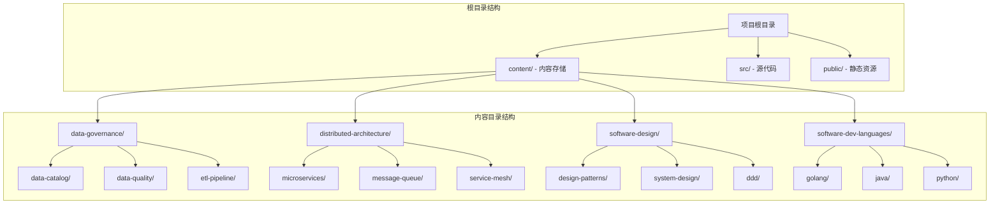
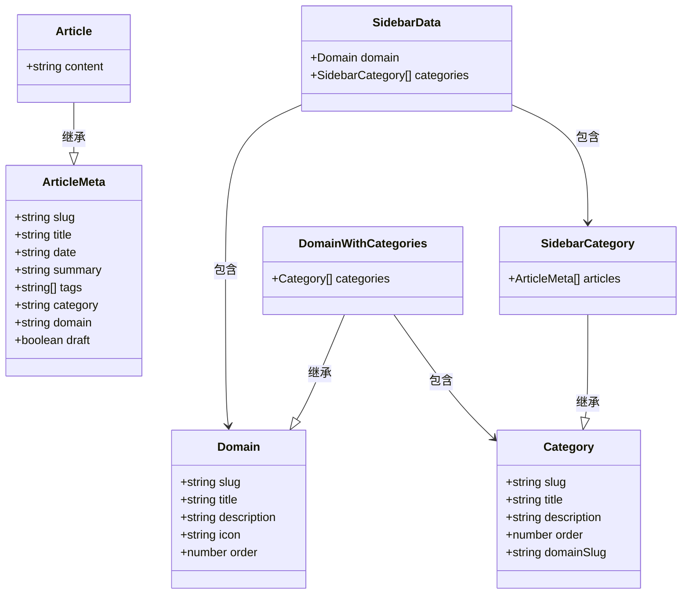
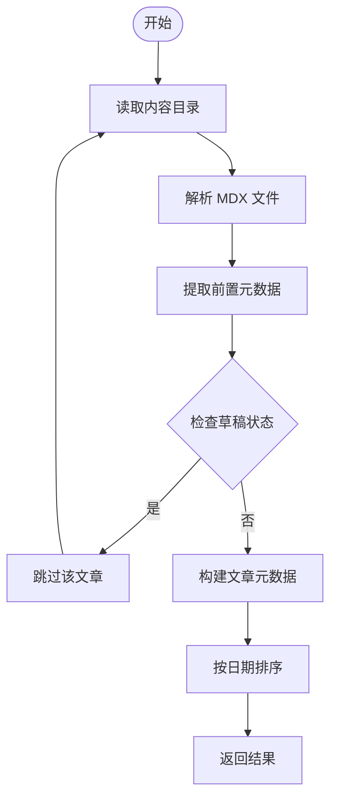
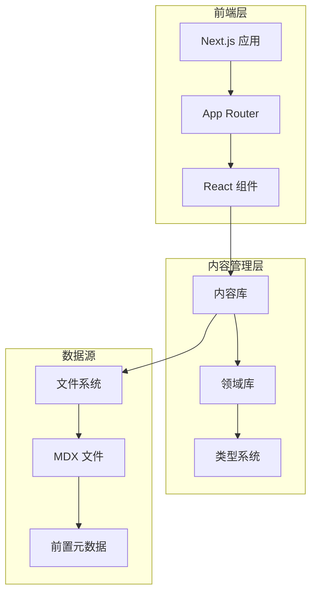
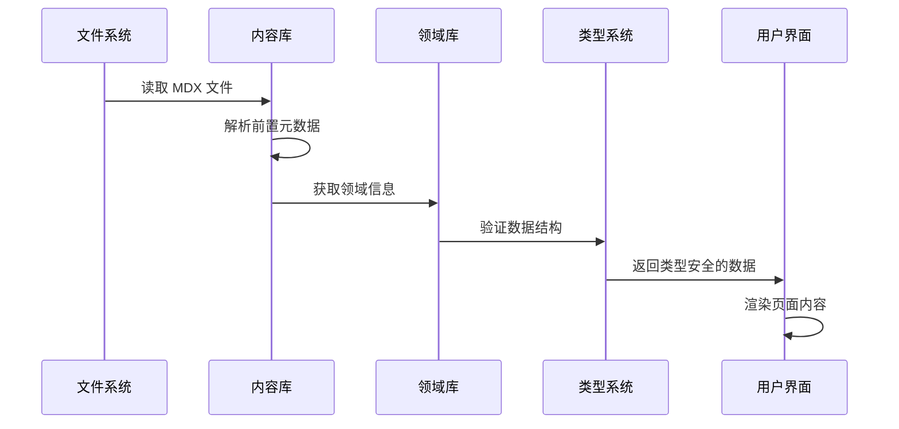
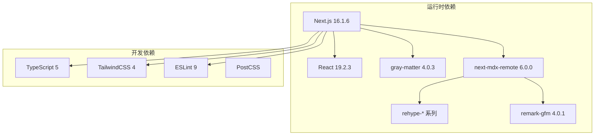
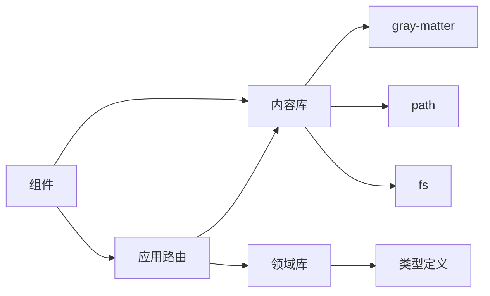

# 内容结构与组织

<cite>
**本文档引用的文件**
- [content/distributed-architecture/message-queue/kafka-core-concepts.mdx](file://content/distributed-architecture/message-queue/kafka-core-concepts.mdx)
- [content/software-design/ddd/ddd-bounded-context.mdx](file://content/software-design/ddd/ddd-bounded-context.mdx)
- [content/software-dev-languages/java/spring-boot-intro.mdx](file://content/software-dev-languages/java/spring-boot-intro.mdx)
- [src/lib/content.ts](file://src/lib/content.ts)
- [src/lib/domains.ts](file://src/lib/domains.ts)
- [src/types/index.ts](file://src/types/index.ts)
- [src/config/site.ts](file://src/config/site.ts)
- [package.json](file://package.json)
</cite>

## 目录
1. [简介](#简介)
2. [项目结构](#项目结构)
3. [核心组件](#核心组件)
4. [架构概览](#架构概览)
5. [详细组件分析](#详细组件分析)
6. [依赖分析](#依赖分析)
7. [性能考虑](#性能考虑)
8. [故障排除指南](#故障排除指南)
9. [结论](#结论)
10. [附录](#附录)

## 简介

blog_new 是一个基于 Next.js 构建的技术博客系统，采用 MDX 内容格式存储技术文章。该项目的核心特色在于其精心设计的内容组织结构，通过领域（Domain）和分类（Category）两级目录体系，实现了技术内容的系统化管理和高效检索。

本项目采用现代化的前端技术栈，包括 React 19、TypeScript、TailwindCSS 和 Next.js App Router，结合 gray-matter 库解析 MDX 文件的前置数据，为读者提供流畅的阅读体验。

## 项目结构

项目采用清晰的层级化目录结构，主要分为以下几个核心部分：



**图表来源**
- [content/distributed-architecture/message-queue/kafka-core-concepts.mdx:1-62](file://content/distributed-architecture/message-queue/kafka-core-concepts.mdx#L1-L62)
- [content/software-design/ddd/ddd-bounded-context.mdx:1-42](file://content/software-design/ddd/ddd-bounded-context.mdx#L1-L42)
- [content/software-dev-languages/java/spring-boot-intro.mdx:1-75](file://content/software-dev-languages/java/spring-boot-intro.mdx#L1-L75)

### 顶级领域目录组织原则

项目目前包含四个顶级领域，每个领域都围绕特定的技术主题进行组织：

1. **软件开发语言** (`software-dev-languages`)
   - 聚焦于各种编程语言的核心概念和实践
   - 支持 Golang、Java、Python 三大主流语言
   - 体现技术栈的多样性和实用性

2. **分布式架构** (`distributed-architecture`)
   - 关注现代分布式系统的架构设计
   - 包含微服务、消息队列、服务网格等核心技术
   - 适应云原生时代的架构需求

3. **数据治理** (`data-governance`)
   - 专注于数据质量管理、目录管理和 ETL 管道
   - 覆盖数据生命周期的各个阶段
   - 满足企业级数据管理需求

4. **软件设计** (`software-design`)
   - 探讨软件设计的理论与实践
   - 包含设计模式、系统设计和领域驱动设计
   - 培养架构思维和设计能力

**章节来源**
- [src/lib/domains.ts:3-32](file://src/lib/domains.ts#L3-L32)

## 核心组件

### 数据模型定义

项目采用 TypeScript 接口定义核心数据结构，确保类型安全和开发体验：



**图表来源**
- [src/types/index.ts:1-45](file://src/types/index.ts#L1-L45)

### 内容解析与管理

内容管理系统通过专门的库函数实现：



**图表来源**
- [src/lib/content.ts:15-43](file://src/lib/content.ts#L15-L43)

**章节来源**
- [src/types/index.ts:1-45](file://src/types/index.ts#L1-L45)
- [src/lib/content.ts:1-158](file://src/lib/content.ts#L1-L158)

## 架构概览

项目采用前后端分离的架构设计，前端负责内容展示，后端负责内容管理：



**图表来源**
- [src/lib/content.ts:1-158](file://src/lib/content.ts#L1-L158)
- [src/lib/domains.ts:1-136](file://src/lib/domains.ts#L1-L136)

### 数据流处理

内容从文件系统到前端展示的完整流程：



**图表来源**
- [src/lib/content.ts:58-100](file://src/lib/content.ts#L58-L100)
- [src/lib/domains.ts:129-135](file://src/lib/domains.ts#L129-L135)

## 详细组件分析

### 领域配置管理

每个领域都有完整的配置信息，包括显示名称、描述、图标和排序权重：

| 领域标识符 | 显示名称 | 描述 | 图标 | 排序权重 |
|-----------|---------|------|------|---------|
| software-dev-languages | 软件开发语言 | 探索各种编程语言的设计哲学与实践 | code | 1 |
| distributed-architecture | 分布式架构 | 分布式系统的设计、实现与最佳实践 | network | 2 |
| data-governance | 数据治理 | 数据质量、数据目录与数据管理 | database | 3 |
| software-design | 软件设计 | 设计模式、系统设计与领域驱动设计 | compass | 4 |

**章节来源**
- [src/lib/domains.ts:3-32](file://src/lib/domains.ts#L3-L32)

### 分类目录结构详解

每个领域下的分类目录都遵循统一的命名和组织原则：

#### 数据治理领域分类
- **数据质量** (`data-quality/`) - 关注数据准确性、完整性、一致性评估
- **数据目录** (`data-catalog/`) - 元数据管理与数据目录建设
- **ETL 管道** (`etl-pipeline/`) - 数据抽取、转换与加载流程

#### 分布式架构分类
- **微服务** (`microservices/`) - 微服务架构设计与实践
- **消息队列** (`message-queue/`) - Kafka、RabbitMQ 等消息中间件
- **服务网格** (`service-mesh/`) - Istio、Envoy 等服务网格技术

#### 软件设计分类
- **设计模式** (`design-patterns/`) - 经典设计模式与实际应用
- **系统设计** (`system-design/`) - 大规模系统的设计与架构
- **领域驱动设计** (`ddd/`) - DDD 战略与战术设计

#### 软件开发语言分类
- **Golang** (`golang/`) - Go 语言核心概念与最佳实践
- **Java** (`java/`) - Java 语言与生态系统
- **Python** (`python/`) - Python 编程与数据科学

**章节来源**
- [src/lib/domains.ts:34-127](file://src/lib/domains.ts#L34-L127)

### 内容文件命名规范

所有内容文件都遵循严格的命名规范：

1. **文件扩展名**: 所有文章必须使用 `.mdx` 扩展名
2. **文件名格式**: 使用短横线分隔的英文小写名称
3. **示例路径**: `content/domain/category/article-title.mdx`

这种命名规范确保了：
- URL 友好的链接生成
- 版本控制系统的兼容性
- 自动化的内容管理

**章节来源**
- [src/lib/content.ts:15-27](file://src/lib/content.ts#L15-L27)

### 元数据字段定义

每篇 MDX 文章都包含标准化的前置元数据：

| 字段名 | 类型 | 必需 | 描述 | 示例值 |
|--------|------|------|------|--------|
| title | string | 是 | 文章标题 | "Kafka 消息队列核心概念" |
| date | string | 是 | 发布日期 | "2026-03-01" |
| summary | string | 否 | 文章摘要 | "深入理解 Apache Kafka 的架构设计与核心概念" |
| tags | string[] | 否 | 标签数组 | ["kafka", "message-queue", "distributed"] |
| category | string | 是 | 分类标识符 | "message-queue" |
| domain | string | 是 | 领域标识符 | "distributed-architecture" |
| draft | boolean | 否 | 是否为草稿 | false |

**章节来源**
- [content/distributed-architecture/message-queue/kafka-core-concepts.mdx:1-9](file://content/distributed-architecture/message-queue/kafka-core-concepts.mdx#L1-L9)
- [content/software-design/ddd/ddd-bounded-context.mdx:1-9](file://content/software-design/ddd/ddd-bounded-context.mdx#L1-L9)
- [content/software-dev-languages/java/spring-boot-intro.mdx:1-9](file://content/software-dev-languages/java/spring-boot-intro.mdx#L1-L9)

## 依赖分析

项目的技术依赖关系体现了现代化的前端开发栈：



**图表来源**
- [package.json:11-34](file://package.json#L11-L34)

### 核心功能依赖

项目的关键功能模块及其依赖关系：



**图表来源**
- [src/lib/content.ts:1-11](file://src/lib/content.ts#L1-L11)
- [src/lib/domains.ts:1](file://src/lib/domains.ts#L1)

**章节来源**
- [package.json:1-36](file://package.json#L1-L36)

## 性能考虑

### 内容缓存策略

项目采用 React 18 的缓存机制优化内容加载性能：

1. **静态缓存**: 使用 `cache` 装饰器缓存计算结果
2. **内存缓存**: 避免重复的文件系统操作
3. **增量更新**: 支持热重载和开发环境的快速迭代

### 文件系统优化

1. **异步读取**: 使用异步文件操作避免阻塞主线程
2. **目录遍历**: 仅读取必要的目录层级
3. **文件过滤**: 严格过滤 .mdx 文件类型

## 故障排除指南

### 常见问题诊断

1. **文章无法显示**
   - 检查 MDX 文件是否包含有效的前置元数据
   - 确认 `category` 和 `domain` 字段与配置匹配
   - 验证文件名是否符合命名规范

2. **分类导航缺失**
   - 确认领域配置中包含相应的分类定义
   - 检查分类目录是否存在且非空
   - 验证 `order` 字段的数值正确性

3. **内容解析错误**
   - 检查 YAML 前置元数据的语法格式
   - 确认必需字段的完整性和类型正确性
   - 验证日期格式的标准化

**章节来源**
- [src/lib/content.ts:29-43](file://src/lib/content.ts#L29-L43)
- [src/lib/domains.ts:129-135](file://src/lib/domains.ts#L129-L135)

## 结论

blog_new 项目通过精心设计的内容结构和类型安全的架构，成功实现了技术博客内容的有效组织和管理。其四级目录结构（领域 → 分类 → 子分类 → 文章）为复杂的技术内容提供了清晰的层次化组织方式。

项目的核心优势包括：
- **类型安全**: 完整的 TypeScript 类型定义确保数据一致性
- **可扩展性**: 模块化的架构支持新领域的轻松添加
- **性能优化**: 智能缓存和异步处理提升用户体验
- **维护友好**: 标准化的命名规范和元数据格式降低维护成本

这种设计模式为技术博客和知识管理系统的开发提供了优秀的参考范例。

## 附录

### 添加新领域操作指南

#### 步骤 1：创建领域目录
```bash
mkdir content/新领域标识符
```

#### 步骤 2：更新领域配置
在 `src/lib/domains.ts` 中添加新的领域定义：
```typescript
{
  slug: "新领域标识符",
  title: "新领域显示名称",
  description: "领域描述",
  icon: "图标名称",
  order: 新的排序权重
}
```

#### 步骤 3：定义分类结构
在 `categoriesByDomain` 对象中添加对应的分类列表：
```typescript
"新领域标识符": [
  {
    slug: "分类标识符",
    title: "分类显示名称",
    description: "分类描述",
    order: 分类排序权重,
    domainSlug: "新领域标识符"
  }
]
```

#### 步骤 4：创建内容文件
在相应目录下创建 `.mdx` 文件，包含标准的前置元数据。

### 添加新分类操作指南

#### 步骤 1：创建分类目录
```bash
mkdir content/领域标识符/新分类标识符
```

#### 步骤 2：更新分类配置
在对应领域的分类数组中添加新分类：
```typescript
{
  slug: "新分类标识符",
  title: "新分类显示名称",
  description: "分类描述",
  order: 分类排序权重,
  domainSlug: "领域标识符"
}
```

#### 步骤 3：验证配置
确保新分类的 `order` 值与其他分类不冲突。

### 最佳实践建议

1. **内容组织**
   - 保持分类的粒度适中，避免过度细分
   - 使用清晰一致的命名约定
   - 定期审查和整理过时内容

2. **元数据管理**
   - 确保所有文章都包含完整的前置元数据
   - 使用准确的标签和分类标识符
   - 维护一致的日期格式

3. **性能优化**
   - 控制单个分类下的文章数量
   - 定期清理未使用的分类和内容
   - 监控构建时间和页面加载性能

4. **版本控制**
   - 使用有意义的提交信息
   - 为重大变更创建分支
   - 定期备份重要的内容文件