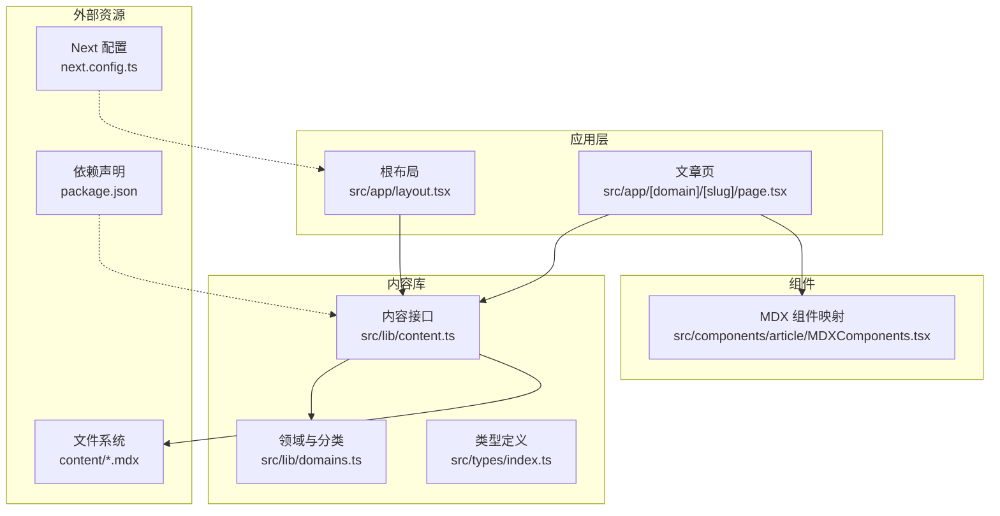
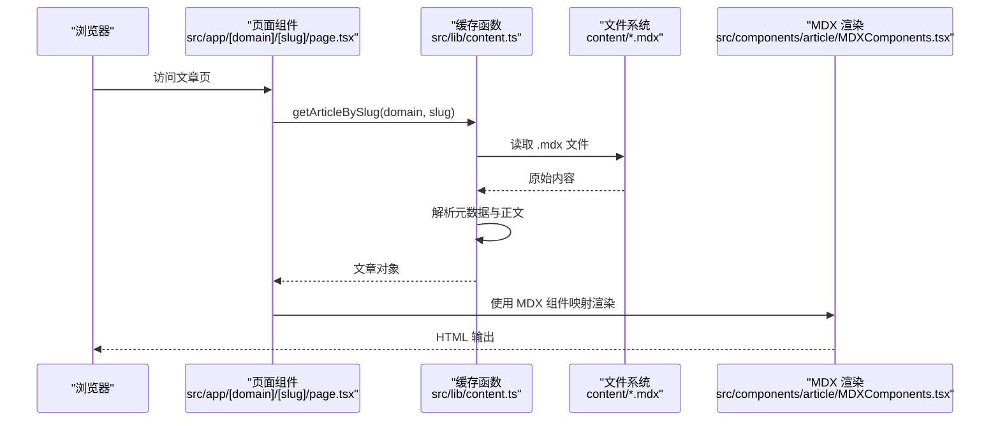
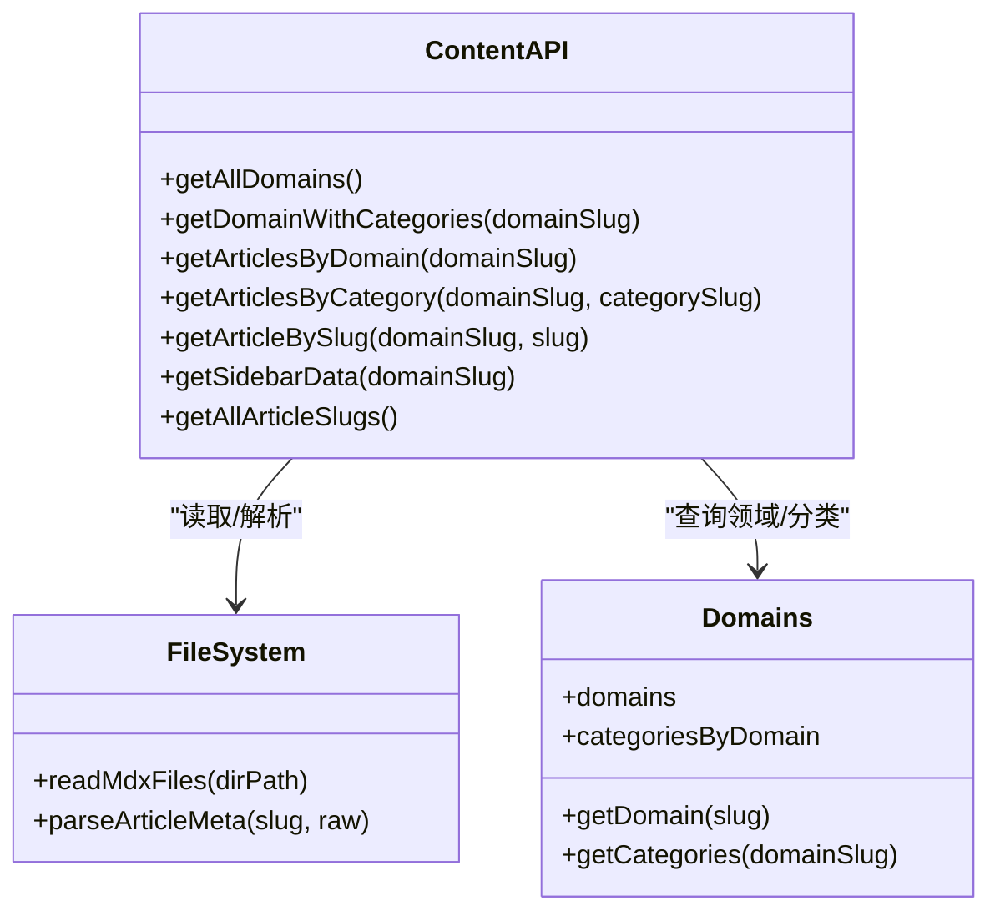
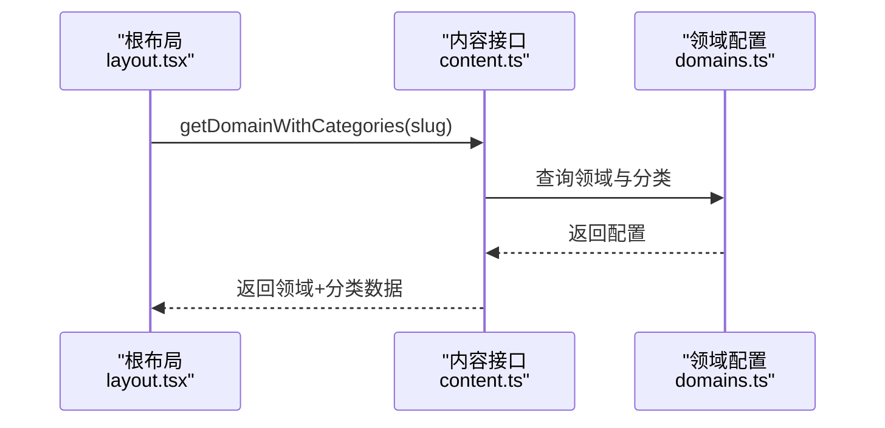
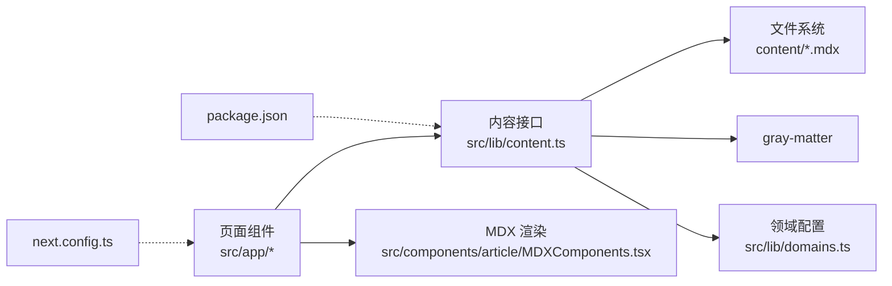

# 内容缓存机制

<cite>
**本文引用的文件**
- [src/lib/content.ts](file://src/lib/content.ts)
- [src/lib/domains.ts](file://src/lib/domains.ts)
- [src/types/index.ts](file://src/types/index.ts)
- [src/app/[domain]/[slug]/page.tsx](file://src/app/[domain]/[slug]/page.tsx)
- [src/app/layout.tsx](file://src/app/layout.tsx)
- [src/components/article/MDXComponents.tsx](file://src/components/article/MDXComponents.tsx)
- [next.config.ts](file://next.config.ts)
- [package.json](file://package.json)
</cite>

## 目录
1. [引言](#引言)
2. [项目结构](#项目结构)
3. [核心组件](#核心组件)
4. [架构总览](#架构总览)
5. [详细组件分析](#详细组件分析)
6. [依赖关系分析](#依赖关系分析)
7. [性能考量](#性能考量)
8. [故障排查指南](#故障排查指南)
9. [结论](#结论)
10. [附录](#附录)

## 引言
本文件围绕 blog_new 的内容缓存机制展开，重点说明 React Cache 在内容管理系统中的应用方式与实现细节。内容来源为本地文件系统（content 目录下的 MDX 文件），通过 React Cache 将读取与解析结果进行缓存，以减少重复 IO 与解析开销。文档涵盖以下主题：
- 缓存策略设计原理与实现位置
- 不同 API 接口的缓存行为与失效策略
- 缓存与文件系统的关联及更新触发条件
- 开发与生产环境差异
- 调试与监控方法
- 可定制化配置与扩展方案

## 项目结构
该项目采用 Next.js App Router 结构，内容读取与缓存集中在 lib 层，页面组件负责调用缓存接口并渲染。

图表来源
- [src/app/layout.tsx:38-60](file://src/app/layout.tsx#L38-L60)
- [src/app/[domain]/[slug]/page.tsx:29-99](file://src/app/[domain]/[slug]/page.tsx#L29-L99)
- [src/lib/content.ts:45-157](file://src/lib/content.ts#L45-L157)
- [src/lib/domains.ts:1-136](file://src/lib/domains.ts#L1-L136)
- [src/types/index.ts:1-45](file://src/types/index.ts#L1-L45)
- [src/components/article/MDXComponents.tsx:1-70](file://src/components/article/MDXComponents.tsx#L1-L70)
- [next.config.ts:1-8](file://next.config.ts#L1-L8)
- [package.json:1-36](file://package.json#L1-L36)

章节来源
- [src/app/layout.tsx:38-60](file://src/app/layout.tsx#L38-L60)
- [src/app/[domain]/[slug]/page.tsx:29-99](file://src/app/[domain]/[slug]/page.tsx#L29-L99)
- [src/lib/content.ts:45-157](file://src/lib/content.ts#L45-L157)
- [src/lib/domains.ts:1-136](file://src/lib/domains.ts#L1-L136)
- [src/types/index.ts:1-45](file://src/types/index.ts#L1-L45)
- [src/components/article/MDXComponents.tsx:1-70](file://src/components/article/MDXComponents.tsx#L1-L70)
- [next.config.ts:1-8](file://next.config.ts#L1-L8)
- [package.json:1-36](file://package.json#L1-L36)

## 核心组件
- 内容接口模块：封装所有与内容读取、解析、聚合相关的缓存函数，统一从文件系统读取并返回结构化数据。
- 领域与分类模块：提供领域与分类的静态配置，供内容接口查询使用。
- 类型定义模块：定义文章元数据、文章全文、侧边栏数据等结构，确保缓存函数返回值类型安全。
- 页面组件：在服务端渲染阶段调用缓存函数，生成静态参数或动态内容，结合 MDX 渲染器展示文章。

章节来源
- [src/lib/content.ts:45-157](file://src/lib/content.ts#L45-L157)
- [src/lib/domains.ts:1-136](file://src/lib/domains.ts#L1-L136)
- [src/types/index.ts:1-45](file://src/types/index.ts#L1-L45)
- [src/app/[domain]/[slug]/page.tsx:29-99](file://src/app/[domain]/[slug]/page.tsx#L29-L99)

## 架构总览
React Cache 在内容接口中被广泛使用，形成“按参数键值”的内存级缓存。其工作流程如下：
- 页面请求到达后，组件调用缓存函数（如获取文章、获取侧边栏、获取域名+分类）。
- 缓存函数内部读取文件系统，解析 MDX 元数据与正文，构造结构化对象。
- React Cache 基于函数名与实参组合生成缓存键，命中则直接返回缓存，未命中则执行函数体并写入缓存。
- 返回的数据用于页面渲染，同时可作为静态生成参数（如文章列表）。

图表来源
- [src/app/[domain]/[slug]/page.tsx:29-99](file://src/app/[domain]/[slug]/page.tsx#L29-L99)
- [src/lib/content.ts:102-131](file://src/lib/content.ts#L102-L131)
- [src/components/article/MDXComponents.tsx:1-70](file://src/components/article/MDXComponents.tsx#L1-L70)

## 详细组件分析

### 内容接口模块（缓存函数族）
该模块通过 React Cache 对多个内容读取函数进行缓存，覆盖“按域名获取文章列表”、“按分类获取文章列表”、“按 slug 获取文章详情”、“侧边栏数据聚合”、“全站文章 slug 列表”等场景。

图表来源
- [src/lib/content.ts:45-157](file://src/lib/content.ts#L45-L157)
- [src/lib/domains.ts:1-136](file://src/lib/domains.ts#L1-L136)

章节来源
- [src/lib/content.ts:45-157](file://src/lib/content.ts#L45-L157)
- [src/lib/domains.ts:1-136](file://src/lib/domains.ts#L1-L136)

#### 缓存策略与实现要点
- 缓存键：由函数名与实参共同决定，相同参数组合共享同一缓存实例。
- 缓存粒度：每个独立函数一个缓存实例；例如按域名、按分类、按 slug 的查询互不干扰。
- 缓存生命周期：默认随请求上下文结束而释放；在服务端渲染期间保持有效，避免重复 IO。
- 并发控制：Promise 并行聚合（如侧边栏数据）可减少等待时间，但需注意缓存命中一致性。

章节来源
- [src/lib/content.ts:45-157](file://src/lib/content.ts#L45-L157)

#### API 行为与缓存特性
- getAllDomains：返回静态领域配置，缓存后复用。
- getDomainWithCategories：组合领域与分类信息，缓存按领域 slug。
- getArticlesByDomain：遍历分类目录读取 MDX，按日期倒序，缓存按领域 slug。
- getArticlesByCategory：读取指定分类目录，按日期倒序，缓存按领域+分类。
- getArticleBySlug：在各分类下查找匹配 slug 的文件，命中即返回，缓存按领域+slug。
- getSidebarData：并发获取分类下的文章列表，再组装侧边栏数据，缓存按领域 slug。
- getAllArticleSlugs：遍历所有领域与分类，生成全站文章 slug 列表，用于静态生成参数。

章节来源
- [src/lib/content.ts:45-157](file://src/lib/content.ts#L45-L157)

#### 缓存失效策略
- 默认无显式失效：React Cache 依赖请求上下文生命周期，页面刷新或重建会自然失效。
- 文件系统变更：新增/删除/修改 MDX 文件不会自动使旧缓存失效，需重启服务或触发新请求上下文。
- 手动清理：可在需要时重新部署或通过构建期预渲染（如静态生成）强制刷新。

章节来源
- [src/lib/content.ts:45-157](file://src/lib/content.ts#L45-L157)

#### 性能优化效果
- 减少重复 IO：同一请求内多次调用同一函数可命中缓存，避免重复读取与解析。
- 减少解析成本：MDX 解析与元数据提取为 CPU 密集操作，缓存显著降低重复计算。
- 并发聚合：侧边栏数据通过 Promise 并行获取，缩短首屏渲染时间。

章节来源
- [src/lib/content.ts:133-146](file://src/lib/content.ts#L133-L146)

#### 与文件系统的关系与更新触发
- 数据源：content 目录下的 MDX 文件是唯一数据源。
- 触发条件：新增/删除/重命名 .mdx 文件、修改 frontmatter 或正文内容。
- 更新生效：需重启开发服务器或触发新的请求上下文；生产环境建议配合静态生成或增量预渲染策略。

章节来源
- [src/lib/content.ts:13-13](file://src/lib/content.ts#L13-L13)

### 页面组件与缓存交互
- 根布局：在服务端渲染阶段逐个获取“领域+分类”数据，用于导航渲染。
- 文章页：根据路由参数调用 getArticleBySlug 获取文章详情，生成页面元数据与内容。

图表来源
- [src/app/layout.tsx:38-60](file://src/app/layout.tsx#L38-L60)
- [src/lib/content.ts:49-56](file://src/lib/content.ts#L49-L56)
- [src/lib/domains.ts:129-135](file://src/lib/domains.ts#L129-L135)

章节来源
- [src/app/layout.tsx:38-60](file://src/app/layout.tsx#L38-L60)
- [src/app/[domain]/[slug]/page.tsx:10-27](file://src/app/[domain]/[slug]/page.tsx#L10-L27)
- [src/lib/content.ts:49-56](file://src/lib/content.ts#L49-L56)

### MDX 渲染与缓存
- MDX 渲染器仅消费缓存函数提供的结构化数据（标题、摘要、标签、正文等），不参与缓存逻辑。
- 组件映射集中定义，保证渲染一致性。

章节来源
- [src/app/[domain]/[slug]/page.tsx:77-96](file://src/app/[domain]/[slug]/page.tsx#L77-L96)
- [src/components/article/MDXComponents.tsx:1-70](file://src/components/article/MDXComponents.tsx#L1-L70)

## 依赖关系分析
- 内容接口依赖文件系统与 gray-matter 解析库，输出结构化数据。
- 页面组件依赖内容接口与 MDX 渲染器。
- 领域与分类模块提供静态配置，被内容接口查询使用。
- Next 配置与依赖声明影响运行时行为与打包策略。

图表来源
- [src/app/[domain]/[slug]/page.tsx:29-99](file://src/app/[domain]/[slug]/page.tsx#L29-L99)
- [src/lib/content.ts:1-11](file://src/lib/content.ts#L1-L11)
- [src/lib/domains.ts:1-136](file://src/lib/domains.ts#L1-L136)
- [src/components/article/MDXComponents.tsx:1-70](file://src/components/article/MDXComponents.tsx#L1-L70)
- [next.config.ts:1-8](file://next.config.ts#L1-L8)
- [package.json:11-24](file://package.json#L11-L24)

章节来源
- [src/app/[domain]/[slug]/page.tsx:29-99](file://src/app/[domain]/[slug]/page.tsx#L29-L99)
- [src/lib/content.ts:1-11](file://src/lib/content.ts#L1-L11)
- [src/lib/domains.ts:1-136](file://src/lib/domains.ts#L1-L136)
- [src/components/article/MDXComponents.tsx:1-70](file://src/components/article/MDXComponents.tsx#L1-L70)
- [next.config.ts:1-8](file://next.config.ts#L1-L8)
- [package.json:11-24](file://package.json#L11-L24)

## 性能考量
- 缓存命中率：同一请求内重复调用同一函数可获得高命中率，跨请求需依赖新上下文。
- IO 与解析成本：MDX 文件读取与解析为瓶颈，缓存显著降低 CPU 与 IO 压力。
- 并发与排序：侧边栏数据聚合使用并发，但排序仍为同步操作，建议在缓存层保持稳定顺序。
- 静态生成：利用 getAllArticleSlugs 生成静态参数，有助于提升首屏性能与 SEO。

章节来源
- [src/lib/content.ts:133-146](file://src/lib/content.ts#L133-L146)
- [src/app/[domain]/[slug]/page.tsx:10-13](file://src/app/[domain]/[slug]/page.tsx#L10-L13)

## 故障排查指南
- 现象：新增文章后页面未显示
  - 排查：确认文件是否位于正确路径且扩展名为 .mdx；检查 frontmatter 是否包含 draft 字段导致过滤。
  - 处理：重启开发服务器或触发新请求上下文；确认缓存键包含正确参数。
- 现象：文章详情页 404
  - 排查：确认 slug 是否存在于对应分类目录；检查 getArticleBySlug 的查找逻辑。
  - 处理：修正文件名或 frontmatter 中的 slug；确保分类 slug 与目录一致。
- 现象：侧边栏数据不完整
  - 排查：确认 getSidebarData 的并发聚合是否成功；检查 getArticlesByCategory 的目录结构。
  - 处理：修复目录结构或 frontmatter；验证 getCategories 返回的分类列表。
- 现象：开发与生产环境显示不一致
  - 排查：确认构建与运行环境差异；检查静态生成参数是否正确。
  - 处理：在生产环境启用静态生成或预渲染；确保内容变更后重新构建。

章节来源
- [src/lib/content.ts:102-131](file://src/lib/content.ts#L102-L131)
- [src/lib/content.ts:133-146](file://src/lib/content.ts#L133-L146)
- [src/lib/domains.ts:34-127](file://src/lib/domains.ts#L34-L127)

## 结论
本项目通过 React Cache 将内容读取与解析过程进行内存级缓存，显著降低了重复 IO 与解析成本，提升了页面渲染性能。缓存以函数名与参数为键，天然支持按领域、分类、slug 等维度隔离缓存。由于缓存生命周期与请求上下文绑定，文件系统变更不会自动失效，需通过重启或新请求上下文生效。结合静态生成与并发聚合，可在开发与生产环境中获得稳定的性能表现。

## 附录

### 开发与生产环境差异
- 开发环境：热重载与缓存按请求上下文管理，适合快速迭代；文件变更后需重启或刷新页面。
- 生产环境：建议启用静态生成（如 generateStaticParams）以提升首屏性能与 SEO；缓存随进程生命周期管理，需配合部署策略。

章节来源
- [src/app/[domain]/[slug]/page.tsx:10-13](file://src/app/[domain]/[slug]/page.tsx#L10-L13)

### 缓存调试与监控
- 日志与计时：在关键缓存函数入口与出口添加日志，记录参数与耗时。
- 命中率统计：对常用函数增加命中/未命中计数器，观察缓存效果。
- 压测与对比：在相同条件下对比启用/禁用缓存的性能指标（TTFB、FCP、渲染时间）。

[本节为通用指导，无需特定文件引用]

### 配置与扩展方案
- 自定义缓存键：若需跨请求复用缓存，可考虑在函数外层包裹自定义缓存容器（需谨慎处理并发与失效）。
- 缓存失效策略：引入版本号或内容哈希，当文件变更时更新缓存键，实现可控失效。
- 预热与预取：在构建期或启动期预热热门内容，减少首次访问延迟。
- 多级缓存：结合内存缓存与持久化缓存（如 Redis），实现跨进程共享与持久化。

[本节为通用指导，无需特定文件引用]