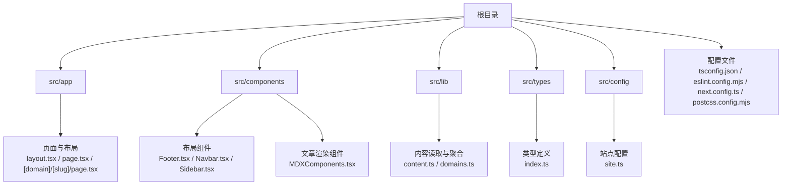
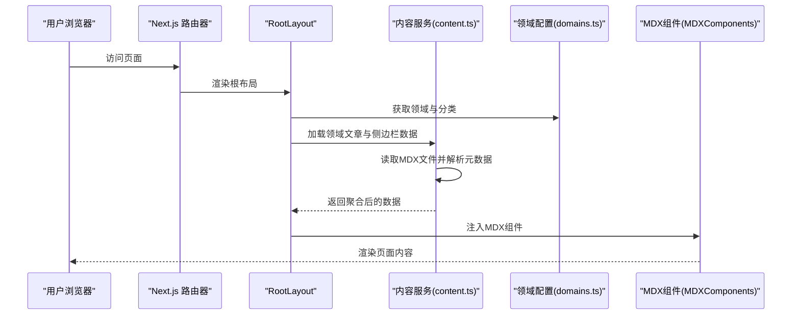
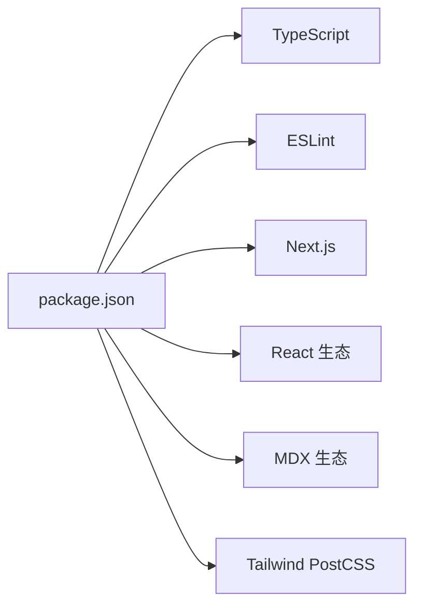

# 代码规范与最佳实践

<cite>
**本文引用的文件**
- [tsconfig.json](file://tsconfig.json)
- [eslint.config.mjs](file://eslint.config.mjs)
- [next.config.ts](file://next.config.ts)
- [package.json](file://package.json)
- [postcss.config.mjs](file://postcss.config.mjs)
- [.gitignore](file://.gitignore)
- [README.md](file://README.md)
- [src/app/layout.tsx](file://src/app/layout.tsx)
- [src/app/globals.css](file://src/app/globals.css)
- [src/components/layout/Footer.tsx](file://src/components/layout/Footer.tsx)
- [src/components/article/MDXComponents.tsx](file://src/components/article/MDXComponents.tsx)
- [src/lib/content.ts](file://src/lib/content.ts)
- [src/lib/domains.ts](file://src/lib/domains.ts)
- [src/config/site.ts](file://src/config/site.ts)
- [src/types/index.ts](file://src/types/index.ts)
</cite>

## 目录
1. [引言](#引言)
2. [项目结构](#项目结构)
3. [核心组件](#核心组件)
4. [架构总览](#架构总览)
5. [详细组件分析](#详细组件分析)
6. [依赖分析](#依赖分析)
7. [性能考虑](#性能考虑)
8. [故障排查指南](#故障排查指南)
9. [结论](#结论)
10. [附录](#附录)

## 引言
本指南面向 blog_new 项目，旨在建立统一的代码规范与最佳实践，覆盖 TypeScript 编译配置与类型安全、ESLint 规则与风格约束、文件命名约定、代码组织原则、注释与文档规范、Git 提交与分支策略，以及代码审查清单与质量保证流程。目标是提升代码一致性、可维护性与协作效率。

## 项目结构
项目采用 Next.js 应用程序目录结构，核心目录与职责如下：
- src/app：页面路由与布局（App Router）
- src/components：UI 组件与业务组件
- src/lib：业务逻辑与数据访问层
- src/types：全局类型定义
- src/config：站点配置
- 根级配置：TypeScript、ESLint、PostCSS、Next.js、包管理脚本等

图表来源
- [src/app/layout.tsx:1-61](file://src/app/layout.tsx#L1-L61)
- [src/components/layout/Footer.tsx:1-21](file://src/components/layout/Footer.tsx#L1-L21)
- [src/components/article/MDXComponents.tsx:1-70](file://src/components/article/MDXComponents.tsx#L1-L70)
- [src/lib/content.ts:1-158](file://src/lib/content.ts#L1-L158)
- [src/lib/domains.ts:1-136](file://src/lib/domains.ts#L1-L136)
- [src/config/site.ts:1-20](file://src/config/site.ts#L1-L20)
- [src/types/index.ts:1-45](file://src/types/index.ts#L1-L45)

章节来源
- [src/app/layout.tsx:1-61](file://src/app/layout.tsx#L1-L61)
- [src/app/globals.css:1-95](file://src/app/globals.css#L1-L95)
- [src/components/layout/Footer.tsx:1-21](file://src/components/layout/Footer.tsx#L1-L21)
- [src/components/article/MDXComponents.tsx:1-70](file://src/components/article/MDXComponents.tsx#L1-L70)
- [src/lib/content.ts:1-158](file://src/lib/content.ts#L1-L158)
- [src/lib/domains.ts:1-136](file://src/lib/domains.ts#L1-L136)
- [src/config/site.ts:1-20](file://src/config/site.ts#L1-L20)
- [src/types/index.ts:1-45](file://src/types/index.ts#L1-L45)

## 核心组件
- 类型系统与编译配置
  - 启用严格模式、增量编译、隔离模块、路径映射，确保类型安全与构建性能。
- 内容与领域模型
  - 使用统一的 Domain/Category/ArticleMeta/Article 类型，配合缓存函数提升性能。
- 布局与样式
  - 全局样式通过 Tailwind 与自定义变量注入，组件内使用语义化类名。
- 文章渲染
  - MDX 组件集中定义，统一标题、链接、列表、表格等渲染行为。
- 站点配置
  - 站点名称、描述、作者、标语与技术栈等集中管理。

章节来源
- [tsconfig.json:1-35](file://tsconfig.json#L1-L35)
- [src/types/index.ts:1-45](file://src/types/index.ts#L1-L45)
- [src/lib/domains.ts:1-136](file://src/lib/domains.ts#L1-L136)
- [src/lib/content.ts:1-158](file://src/lib/content.ts#L1-L158)
- [src/app/globals.css:1-95](file://src/app/globals.css#L1-L95)
- [src/components/article/MDXComponents.tsx:1-70](file://src/components/article/MDXComponents.tsx#L1-L70)
- [src/config/site.ts:1-20](file://src/config/site.ts#L1-L20)

## 架构总览
下图展示从请求到页面渲染的关键路径，包括布局装配、内容加载与 MDX 渲染。

图表来源
- [src/app/layout.tsx:1-61](file://src/app/layout.tsx#L1-L61)
- [src/lib/domains.ts:1-136](file://src/lib/domains.ts#L1-L136)
- [src/lib/content.ts:1-158](file://src/lib/content.ts#L1-L158)
- [src/components/article/MDXComponents.tsx:1-70](file://src/components/article/MDXComponents.tsx#L1-L70)

## 详细组件分析

### TypeScript 编译与类型安全
- 编译选项要点
  - 目标与库：ES2017 与 DOM/迭代器/ESNext 库，适配现代浏览器与 Next.js 运行时。
  - 严格模式：开启严格类型检查，减少隐式类型与未使用变量等问题。
  - 模块策略：ESNext + Bundler 解析，结合路径别名 @/*，提升导入清晰度。
  - 禁止输出：仅进行类型检查，构建由 Next.js 执行。
  - JSX：使用 react-jsx，确保 React 元素类型推断正确。
  - 增量与插件：启用增量编译与 Next 插件，优化开发体验。
- 类型定义与复用
  - 在 src/types/index.ts 中集中声明 Domain、Category、ArticleMeta、Article、SidebarData 等接口，避免重复定义与不一致。
  - 组件间共享类型时，优先使用相对路径别名导入，保持模块边界清晰。

章节来源
- [tsconfig.json:1-35](file://tsconfig.json#L1-L35)
- [src/types/index.ts:1-45](file://src/types/index.ts#L1-L45)

### ESLint 规则与代码风格
- 配置来源
  - 基于 eslint-config-next 的 Core Web Vitals 与 TypeScript 规则，确保性能指标与类型安全。
  - 自定义忽略项覆盖默认忽略，保留必要的源码检查范围。
- 推荐扩展规则（建议）
  - 导入顺序：按外部、同级、相对路径分组，字母序排序。
  - 禁止 console：生产环境禁止调试输出。
  - 函数复杂度：限制单函数行数与圈复杂度。
  - 命名规范：组件使用 PascalCase；常量使用 UPPER_SNAKE_CASE；变量使用 camelCase。
  - 注释与 TODO：TODO/NOTE 明确责任人与截止日期。
- 工作流
  - 在提交前执行 npm run lint，修复可自动修复的问题；对不可自动修复的规则进行人工评审。

章节来源
- [eslint.config.mjs:1-19](file://eslint.config.mjs#L1-L19)
- [package.json:1-36](file://package.json#L1-L36)

### 文件命名约定
- 组件文件
  - 页面组件：page.tsx
  - 布局组件：layout.tsx
  - UI 组件：PascalCase.tsx（如 Navbar.tsx、Footer.tsx）
- 类型定义
  - src/types/index.ts：集中导出所有类型
- 配置文件
  - next.config.ts、tsconfig.json、eslint.config.mjs、postcss.config.mjs、package.json
- 内容文件
  - MDX 文章：小写短横线命名（如 kafka-core-concepts.mdx）

章节来源
- [src/app/layout.tsx:1-61](file://src/app/layout.tsx#L1-L61)
- [src/components/layout/Footer.tsx:1-21](file://src/components/layout/Footer.tsx#L1-L21)
- [src/components/article/MDXComponents.tsx:1-70](file://src/components/article/MDXComponents.tsx#L1-L70)
- [src/types/index.ts:1-45](file://src/types/index.ts#L1-L45)
- [tsconfig.json:1-35](file://tsconfig.json#L1-L35)
- [eslint.config.mjs:1-19](file://eslint.config.mjs#L1-L19)
- [postcss.config.mjs:1-8](file://postcss.config.mjs#L1-L8)
- [next.config.ts:1-8](file://next.config.ts#L1-L8)
- [package.json:1-36](file://package.json#L1-L36)

### 代码组织原则
- 模块化设计
  - 将领域与分类信息集中于 src/lib/domains.ts，内容读取与聚合集中在 src/lib/content.ts，避免跨模块耦合。
  - 组件按功能拆分：布局组件（src/components/layout）、通用 UI（src/components/ui）、业务组件（src/components/article）。
- 组件复用
  - MDX 组件统一在 MDXComponents.tsx 定义，便于主题切换与一致性维护。
  - 布局组件 Footer/Navbar 可在多页面复用。
- 依赖管理
  - 通过 @/* 路径别名统一导入，减少相对路径层级带来的脆弱性。
  - 类型定义集中导出，组件与服务层通过类型接口通信，降低耦合。

章节来源
- [src/lib/domains.ts:1-136](file://src/lib/domains.ts#L1-L136)
- [src/lib/content.ts:1-158](file://src/lib/content.ts#L1-L158)
- [src/components/article/MDXComponents.tsx:1-70](file://src/components/article/MDXComponents.tsx#L1-L70)
- [src/components/layout/Footer.tsx:1-21](file://src/components/layout/Footer.tsx#L1-L21)
- [tsconfig.json:21-23](file://tsconfig.json#L21-L23)

### 注释标准与文档规范
- 文件头部注释
  - 简述模块职责与关键导出。
- 函数/方法注释
  - 参数、返回值、异常与副作用说明；复杂算法需附带步骤说明。
- 类型注释
  - 对外暴露的接口与公共类型必须有明确注释。
- TODO/NOTE
  - 使用 TODO/NOTE 标记待办事项，注明负责人与预期完成时间。
- README
  - 保持与当前版本一致，提供快速启动与部署指引。

章节来源
- [README.md:1-37](file://README.md#L1-L37)

### Git 提交消息格式与分支管理策略
- 提交消息格式（建议）
  - 类型: 简要描述（不超过 50 字）
  - 类型取值：feat、fix、docs、style、refactor、perf、test、chore、revert
  - 例如：feat(types): 添加 Domain 与 Category 类型定义
- 分支管理策略（建议）
  - main：稳定发布分支
  - develop：开发集成分支
  - feature/<name>：新功能开发
  - hotfix/<name>：紧急修复
  - release/<version>：预发布版本
- 提交前检查
  - 运行 npm run lint 与必要测试，确保无严重问题。

章节来源
- [.gitignore:1-42](file://.gitignore#L1-L42)
- [package.json:1-36](file://package.json#L1-L36)

### 代码审查清单与质量保证流程
- 代码审查清单（建议）
  - 类型安全：是否启用严格模式；是否存在 any 或宽泛类型；接口是否完整。
  - 性能：是否使用缓存函数；是否存在不必要的重渲染；异步调用是否合理。
  - 可读性：命名是否清晰；注释是否充分；文件与函数长度是否合理。
  - 安全：输入校验与权限控制；敏感信息是否脱敏。
  - 兼容性：浏览器与 Node 版本支持；第三方库更新风险。
- 质量保证流程（建议）
  - 本地：保存前运行 linter；单元/集成测试通过。
  - CI：自动化 Lint、类型检查、测试与构建；失败阻塞合并。
  - 发布：打标签与变更日志；灰度发布与回滚预案。

章节来源
- [tsconfig.json:7-15](file://tsconfig.json#L7-L15)
- [eslint.config.mjs:1-19](file://eslint.config.mjs#L1-L19)
- [src/lib/content.ts:4-4](file://src/lib/content.ts#L4-L4)
- [src/lib/content.ts:49-56](file://src/lib/content.ts#L49-L56)

## 依赖分析
- 运行时依赖
  - Next.js、React、MDX 渲染链路（next-mdx-remote、rehype-*、remark-gfm、shiki）。
- 开发依赖
  - TypeScript、ESLint、Tailwind PostCSS 插件。
- 构建与运行
  - Next.js 负责打包与运行；ESLint 保障代码质量；Tailwind 生成样式。

图表来源
- [package.json:11-34](file://package.json#L11-L34)

章节来源
- [package.json:1-36](file://package.json#L1-L36)

## 性能考虑
- 类型检查与增量编译
  - 启用严格模式与增量编译，缩短开发时长。
- 缓存与并发
  - 使用 React cache 包裹内容读取函数，避免重复 IO 与计算。
- 样式与字体
  - 使用 next/font 与 CSS 变量，减少首屏阻塞与重排。
- 构建产物
  - 通过 Next.js 构建与 Tree Shaking，减少包体积。

章节来源
- [tsconfig.json:7-15](file://tsconfig.json#L7-L15)
- [src/lib/content.ts:4-4](file://src/lib/content.ts#L4-L4)
- [src/lib/content.ts:49-56](file://src/lib/content.ts#L49-L56)
- [src/app/globals.css:1-95](file://src/app/globals.css#L1-L95)

## 故障排查指南
- 类型错误
  - 症状：编辑器报错或构建失败
  - 处理：对照 src/types/index.ts 的接口定义修正；避免 any；补充缺失字段
- ESLint 报错
  - 症状：提交被拒绝或 CI 失败
  - 处理：根据规则提示修复；必要时调整规则或添加注释豁免
- 构建失败
  - 症状：next build 报错
  - 处理：检查 tsconfig.json 与 next.config.ts；确认路径别名与插件配置
- 样式异常
  - 症状：颜色、字体或布局错乱
  - 处理：检查 src/app/globals.css 与 Tailwind 配置；确认 CSS 变量与类名

章节来源
- [tsconfig.json:1-35](file://tsconfig.json#L1-L35)
- [eslint.config.mjs:1-19](file://eslint.config.mjs#L1-L19)
- [next.config.ts:1-8](file://next.config.ts#L1-L8)
- [src/app/globals.css:1-95](file://src/app/globals.css#L1-L95)

## 结论
通过统一的 TypeScript 配置、ESLint 规则、文件命名与组织原则，并辅以完善的注释与文档规范、Git 提交与分支策略，以及标准化的代码审查与质量保证流程，blog_new 项目能够在保证类型安全与性能的前提下，持续产出高质量、易维护的代码。

## 附录
- 快速开始
  - 运行开发服务器：参考 README 的开发命令
- 配置文件一览
  - TypeScript：tsconfig.json
  - ESLint：eslint.config.mjs
  - Next.js：next.config.ts
  - PostCSS：postcss.config.mjs
  - 包管理：package.json

章节来源
- [README.md:1-37](file://README.md#L1-L37)
- [tsconfig.json:1-35](file://tsconfig.json#L1-L35)
- [eslint.config.mjs:1-19](file://eslint.config.mjs#L1-L19)
- [next.config.ts:1-8](file://next.config.ts#L1-L8)
- [postcss.config.mjs:1-8](file://postcss.config.mjs#L1-L8)
- [package.json:1-36](file://package.json#L1-L36)