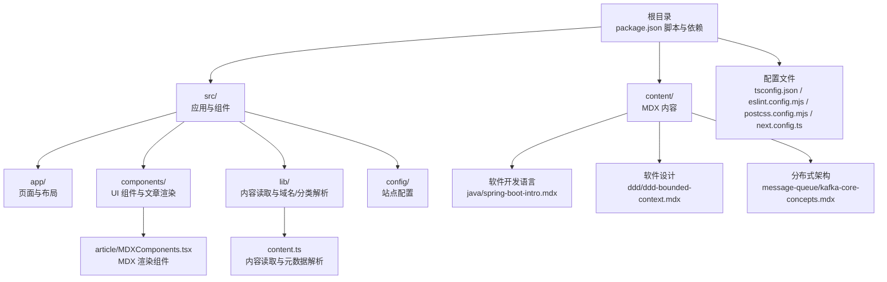
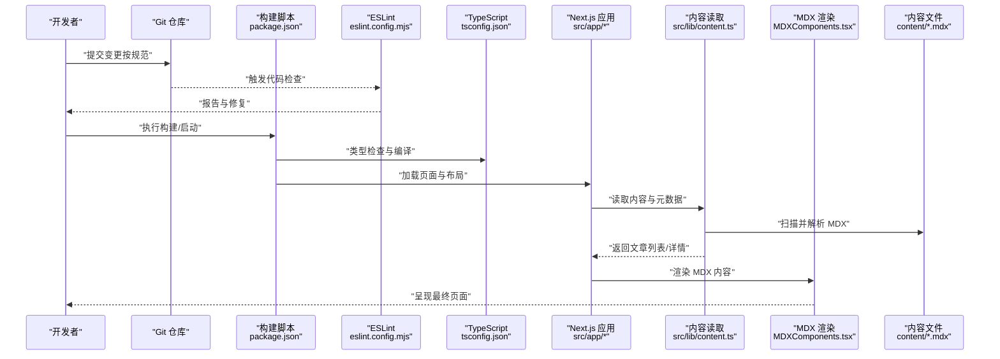
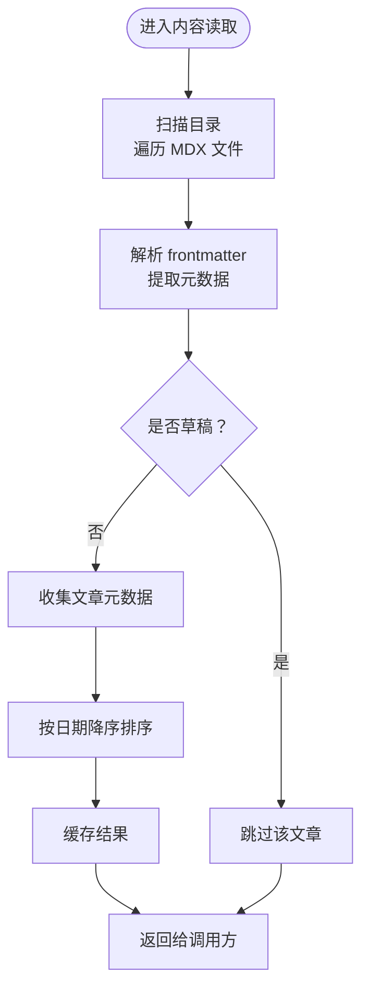
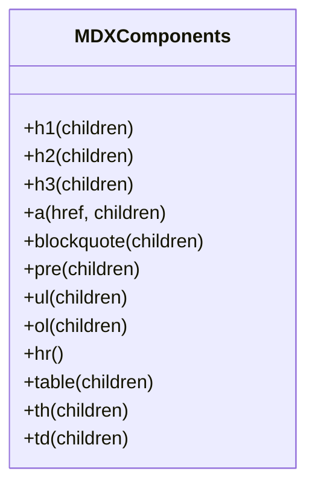
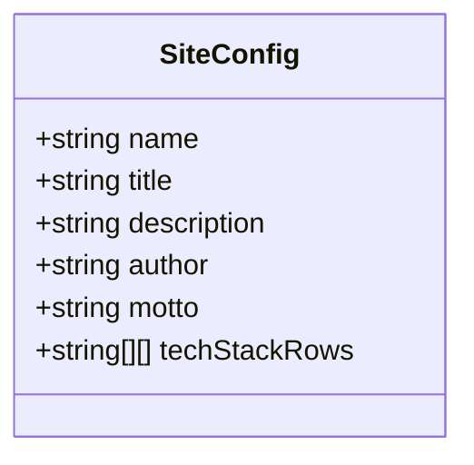
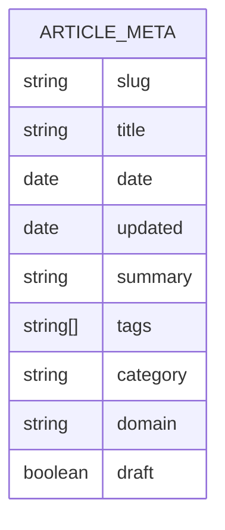
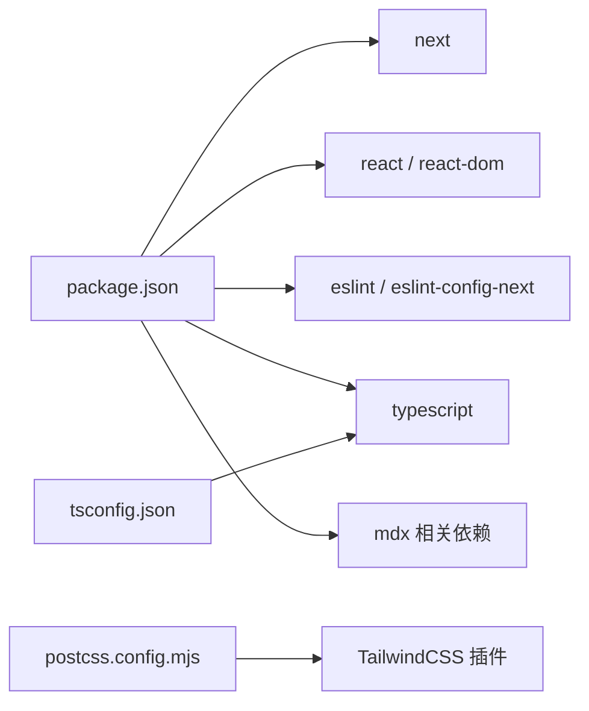

# 协作开发流程

<cite>
**本文引用的文件**
- [README.md](file://README.md)
- [package.json](file://package.json)
- [eslint.config.mjs](file://eslint.config.mjs)
- [postcss.config.mjs](file://postcss.config.mjs)
- [tsconfig.json](file://tsconfig.json)
- [next.config.ts](file://next.config.ts)
- [src/config/site.ts](file://src/config/site.ts)
- [src/lib/content.ts](file://src/lib/content.ts)
- [src/components/article/MDXComponents.tsx](file://src/components/article/MDXComponents.tsx)
- [content/software-dev-languages/java/spring-boot-intro.mdx](file://content/software-dev-languages/java/spring-boot-intro.mdx)
- [content/software-design/ddd/ddd-bounded-context.mdx](file://content/software-design/ddd/ddd-bounded-context.mdx)
- [content/distributed-architecture/message-queue/kafka-core-concepts.mdx](file://content/distributed-architecture/message-queue/kafka-core-concepts.mdx)
</cite>

## 目录
1. [引言](#引言)
2. [项目结构](#项目结构)
3. [核心组件](#核心组件)
4. [架构总览](#架构总览)
5. [详细组件分析](#详细组件分析)
6. [依赖分析](#依赖分析)
7. [性能考虑](#性能考虑)
8. [故障排查指南](#故障排查指南)
9. [结论](#结论)
10. [附录](#附录)

## 引言
本指南面向 blog_new 项目的协作开发与团队协作，围绕 Git 工作流程、分支策略、提交规范、合并流程、代码审查、版本控制最佳实践（含标签与发布）、回滚策略、团队沟通与协作工具、文档维护与更新、新成员入职与知识传递、以及冲突解决与问题跟踪等方面，提供系统化、可落地的流程与规范。  
本项目采用 Next.js 技术栈，内容以 MDX 文档为主，前端渲染与内容读取通过 TypeScript 与 React 组件实现。

## 项目结构
blog_new 项目采用典型的 Next.js App Router 结构，源码位于 src 目录，内容资源位于 content 目录，构建与开发脚本由 package.json 管理，代码质量通过 ESLint 配置保障，样式通过 PostCSS 与 TailwindCSS 集成，类型检查通过 TypeScript 配置启用。

图表来源
- [package.json:1-36](file://package.json#L1-L36)
- [tsconfig.json:1-35](file://tsconfig.json#L1-L35)
- [eslint.config.mjs:1-19](file://eslint.config.mjs#L1-L19)
- [postcss.config.mjs:1-8](file://postcss.config.mjs#L1-L8)
- [next.config.ts:1-8](file://next.config.ts#L1-L8)
- [src/components/article/MDXComponents.tsx:1-70](file://src/components/article/MDXComponents.tsx#L1-L70)
- [src/lib/content.ts:1-158](file://src/lib/content.ts#L1-L158)
- [content/software-dev-languages/java/spring-boot-intro.mdx:1-75](file://content/software-dev-languages/java/spring-boot-intro.mdx#L1-L75)
- [content/software-design/ddd/ddd-bounded-context.mdx:1-42](file://content/software-design/ddd/ddd-bounded-context.mdx#L1-L42)
- [content/distributed-architecture/message-queue/kafka-core-concepts.mdx:1-62](file://content/distributed-architecture/message-queue/kafka-core-concepts.mdx#L1-L62)

章节来源
- [README.md:1-37](file://README.md#L1-L37)
- [package.json:1-36](file://package.json#L1-L36)

## 核心组件
- 构建与运行脚本：通过 package.json 中的 dev/build/start/lint 脚本统一管理，便于本地开发与 CI/CD 集成。
- 内容读取与渲染：src/lib/content.ts 负责扫描 content 目录下的 MDX 文件，解析 frontmatter 元数据，并按域与分类组织文章列表；MDX 渲染通过 src/components/article/MDXComponents.tsx 注入自定义组件。
- 站点配置：src/config/site.ts 提供站点名称、描述、作者、标语及技术栈展示等信息，供页面组件引用。
- 代码质量：eslint.config.mjs 基于 eslint-config-next 提供规则集，并覆盖默认忽略项，确保工程一致性。
- 样式与构建：postcss.config.mjs 集成 TailwindCSS 插件；tsconfig.json 启用严格模式与路径别名；next.config.ts 作为 Next.js 配置入口。

章节来源
- [package.json:5-9](file://package.json#L5-L9)
- [src/lib/content.ts:13-158](file://src/lib/content.ts#L13-L158)
- [src/components/article/MDXComponents.tsx:3-69](file://src/components/article/MDXComponents.tsx#L3-L69)
- [src/config/site.ts:1-13](file://src/config/site.ts#L1-L13)
- [eslint.config.mjs:1-19](file://eslint.config.mjs#L1-L19)
- [postcss.config.mjs:1-8](file://postcss.config.mjs#L1-L8)
- [tsconfig.json:21-23](file://tsconfig.json#L21-L23)
- [next.config.ts:3-5](file://next.config.ts#L3-L5)

## 架构总览
从内容到页面的端到端流程如下：

图表来源
- [package.json:5-9](file://package.json#L5-L9)
- [eslint.config.mjs:1-19](file://eslint.config.mjs#L1-L19)
- [tsconfig.json:7-14](file://tsconfig.json#L7-L14)
- [src/lib/content.ts:13-158](file://src/lib/content.ts#L13-L158)
- [src/components/article/MDXComponents.tsx:3-69](file://src/components/article/MDXComponents.tsx#L3-L69)
- [content/software-dev-languages/java/spring-boot-intro.mdx:1-75](file://content/software-dev-languages/java/spring-boot-intro.mdx#L1-L75)

## 详细组件分析

### 内容读取与渲染组件分析
内容读取与渲染涉及文件系统扫描、frontmatter 解析、缓存与排序、以及 MDX 组件注入。该组件对性能与一致性至关重要。

图表来源
- [src/lib/content.ts:15-27](file://src/lib/content.ts#L15-L27)
- [src/lib/content.ts:29-43](file://src/lib/content.ts#L29-L43)
- [src/lib/content.ts:58-78](file://src/lib/content.ts#L58-L78)
- [src/lib/content.ts:80-100](file://src/lib/content.ts#L80-L100)
- [src/lib/content.ts:102-131](file://src/lib/content.ts#L102-L131)

章节来源
- [src/lib/content.ts:13-158](file://src/lib/content.ts#L13-L158)

### MDX 渲染组件分析
MDX 渲染通过自定义组件覆盖标题、链接、块引用、代码块、列表、表格等元素，确保一致的阅读体验与样式。

图表来源
- [src/components/article/MDXComponents.tsx:3-69](file://src/components/article/MDXComponents.tsx#L3-L69)

章节来源
- [src/components/article/MDXComponents.tsx:1-70](file://src/components/article/MDXComponents.tsx#L1-L70)

### 站点配置分析
站点配置集中于 src/config/site.ts，包含站点名称、标题、描述、作者、标语与技术栈展示，供页面组件统一引用。

图表来源
- [src/config/site.ts:1-13](file://src/config/site.ts#L1-L13)

章节来源
- [src/config/site.ts:1-13](file://src/config/site.ts#L1-L13)

### 内容示例与结构
项目内容采用 MDX，frontmatter 包含标题、日期、摘要、标签、分类、域与草稿标记。示例内容展示了 Java、DDD、Kafka 等主题的文章结构。

图表来源
- [src/lib/content.ts:29-43](file://src/lib/content.ts#L29-L43)
- [content/software-dev-languages/java/spring-boot-intro.mdx:1-9](file://content/software-dev-languages/java/spring-boot-intro.mdx#L1-L9)
- [content/software-design/ddd/ddd-bounded-context.mdx:1-9](file://content/software-design/ddd/ddd-bounded-context.mdx#L1-L9)
- [content/distributed-architecture/message-queue/kafka-core-concepts.mdx:1-9](file://content/distributed-architecture/message-queue/kafka-core-concepts.mdx#L1-L9)

章节来源
- [content/software-dev-languages/java/spring-boot-intro.mdx:1-75](file://content/software-dev-languages/java/spring-boot-intro.mdx#L1-L75)
- [content/software-design/ddd/ddd-bounded-context.mdx:1-42](file://content/software-design/ddd/ddd-bounded-context.mdx#L1-L42)
- [content/distributed-architecture/message-queue/kafka-core-concepts.mdx:1-62](file://content/distributed-architecture/message-queue/kafka-core-concepts.mdx#L1-L62)

## 依赖分析
- 构建与运行：dev/build/start/lint 脚本由 package.json 统一管理，便于本地与 CI 环境一致化。
- 类型与编译：tsconfig.json 启用严格模式、路径别名与增量编译，提升开发体验与构建稳定性。
- 代码质量：eslint.config.mjs 基于 eslint-config-next 并覆盖默认忽略项，确保工程一致性。
- 样式与构建：postcss.config.mjs 集成 TailwindCSS 插件，与 Next.js 配合提供原子化样式能力。

图表来源
- [package.json:11-34](file://package.json#L11-L34)
- [tsconfig.json:21-23](file://tsconfig.json#L21-L23)
- [eslint.config.mjs:1-19](file://eslint.config.mjs#L1-L19)
- [postcss.config.mjs:1-8](file://postcss.config.mjs#L1-L8)

章节来源
- [package.json:1-36](file://package.json#L1-L36)
- [tsconfig.json:1-35](file://tsconfig.json#L1-L35)
- [eslint.config.mjs:1-19](file://eslint.config.mjs#L1-L19)
- [postcss.config.mjs:1-8](file://postcss.config.mjs#L1-L8)

## 性能考虑
- 缓存策略：内容读取函数使用 React 缓存装饰器，避免重复 IO 与解析，提升页面渲染性能。
- 排序与过滤：按日期降序排序与草稿过滤在服务端完成，减少前端渲染负担。
- 构建优化：启用严格类型与增量编译，结合 Next.js 的构建优化，缩短开发时构建时间。
- 样式优化：TailwindCSS 原子化样式减少冗余 CSS，配合 PostCSS 插件进行按需输出。

章节来源
- [src/lib/content.ts:45-47](file://src/lib/content.ts#L45-L47)
- [src/lib/content.ts:58-78](file://src/lib/content.ts#L58-L78)
- [tsconfig.json:7-14](file://tsconfig.json#L7-L14)
- [postcss.config.mjs:1-8](file://postcss.config.mjs#L1-L8)

## 故障排查指南
- 本地启动失败
  - 检查 Node.js 版本与包管理器兼容性，确认 scripts 正常。
  - 查看构建日志与类型错误，优先修复类型问题。
- 内容未显示或排序异常
  - 确认 MDX frontmatter 字段完整且非草稿状态。
  - 检查内容目录结构与 slug 是否匹配。
- 样式异常
  - 清理构建缓存后重试，确认 TailwindCSS 插件已正确加载。
- 代码检查失败
  - 根据 ESLint 报告逐项修复，必要时调整规则或忽略项。

章节来源
- [package.json:5-9](file://package.json#L5-L9)
- [src/lib/content.ts:13-158](file://src/lib/content.ts#L13-L158)
- [eslint.config.mjs:1-19](file://eslint.config.mjs#L1-L19)
- [postcss.config.mjs:1-8](file://postcss.config.mjs#L1-L8)

## 结论
本指南基于 blog_new 项目的技术栈与内容结构，提出了可操作的协作开发流程与团队协作规范。通过统一的 Git 工作流、严格的提交与审查规范、完善的版本控制与发布流程、以及清晰的沟通与文档维护机制，能够有效提升团队协作效率与项目质量。

## 附录

### Git 工作流程与分支策略
- 分支命名规范
  - 功能开发：feature/模块名/简述
  - 修复缺陷：fix/模块名/简述
  - 热修复：hotfix/紧急修复简述
  - 文档更新：docs/主题/简述
- 分支保护
  - 主分支（main/master）受保护，禁止直接推送，必须通过 PR 合并。
  - 开发分支（develop）用于集成，定期同步主分支。
- 提交规范
  - 类型：feat、fix、docs、style、refactor、test、chore、perf、ci、revert
  - 格式：type(scope): subject（正文与脚注可选）
  - 示例：feat(content): 添加 Kafka 核心概念文章
- 合并流程
  - PR 必须通过代码审查与自动化检查。
  - 合并前需 rebase 或 merge 主分支最新变更，保持线性历史。
  - 合并后清理分支，避免垃圾分支堆积。

### 代码审查流程与标准
- PR 模板
  - 摘要：变更目的与影响范围
  - 问题链接：关联 Issue 或需求
  - 测试方案：本地验证与回归测试
  - 风险评估：破坏性变更与回滚预案
- 审查清单
  - 代码风格与 ESLint 通过
  - 类型安全与 tsconfig 规则满足
  - 功能正确性与边界条件覆盖
  - 性能与缓存策略合理
  - 文档与注释完整
  - 安全与隐私合规

### 版本控制最佳实践
- 标签管理
  - 语义化版本：v0.1.0、v1.0.0、v2.1.3
  - 发布前打标签并附带变更日志
- 发布流程
  - 预发布：alpha/beta/rc
  - 正式发布：稳定版本标签与发布说明
- 回滚策略
  - 保留最近一次稳定标签，必要时回退到上一个标签
  - 回滚前进行风险评估与数据备份

### 团队沟通与协作工具
- 任务与问题跟踪：使用 Issue/Project/Timeline 管理需求与进度
- 文档与知识库：Markdown 文档集中存放，遵循统一模板
- 代码评审：PR 审查与讨论闭环，确保知识沉淀
- 持续集成：自动化 lint、类型检查与构建，减少人工干预

### 文档维护与更新流程
- 文档模板：标题、摘要、作者、更新时间、标签
- 更新频率：重大变更同步更新相关文档
- 审阅机制：重要文档双人审阅，确保准确性与一致性

### 新成员入职指导与知识传递
- 环境搭建：安装依赖、运行 dev、查看 README
- 代码结构：介绍 src 与 content 目录职责与关键文件
- 工作流：Git 分支、提交、PR 与审查流程
- 岗位职责：内容贡献、功能开发、文档维护与问题跟踪

### 冲突解决与问题跟踪
- 冲突解决
  - rebase/merge 主分支最新变更
  - 小步提交，减少冲突复杂度
  - 无法解决时发起讨论或寻求资深成员协助
- 问题跟踪
  - Issue 分类：功能、缺陷、优化、文档
  - 优先级：P0-P3，明确 SLA 与责任人
  - 关闭条件：修复验证、文档更新、回归测试通过