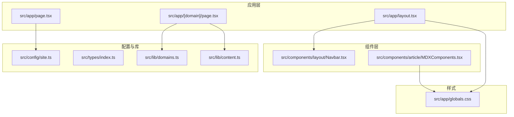
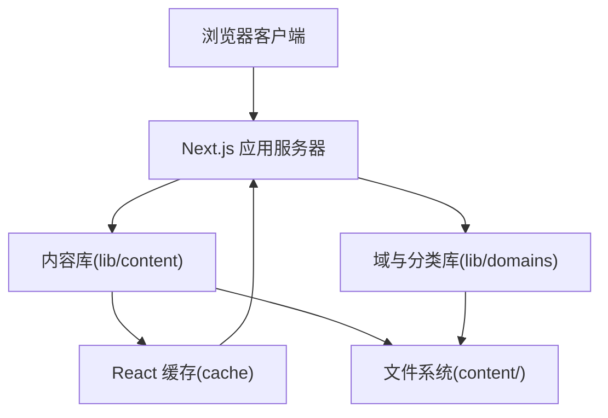
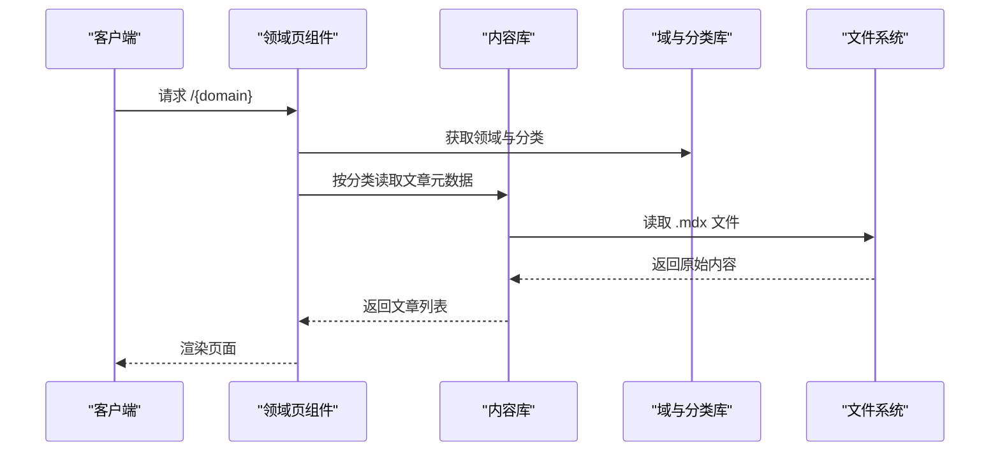
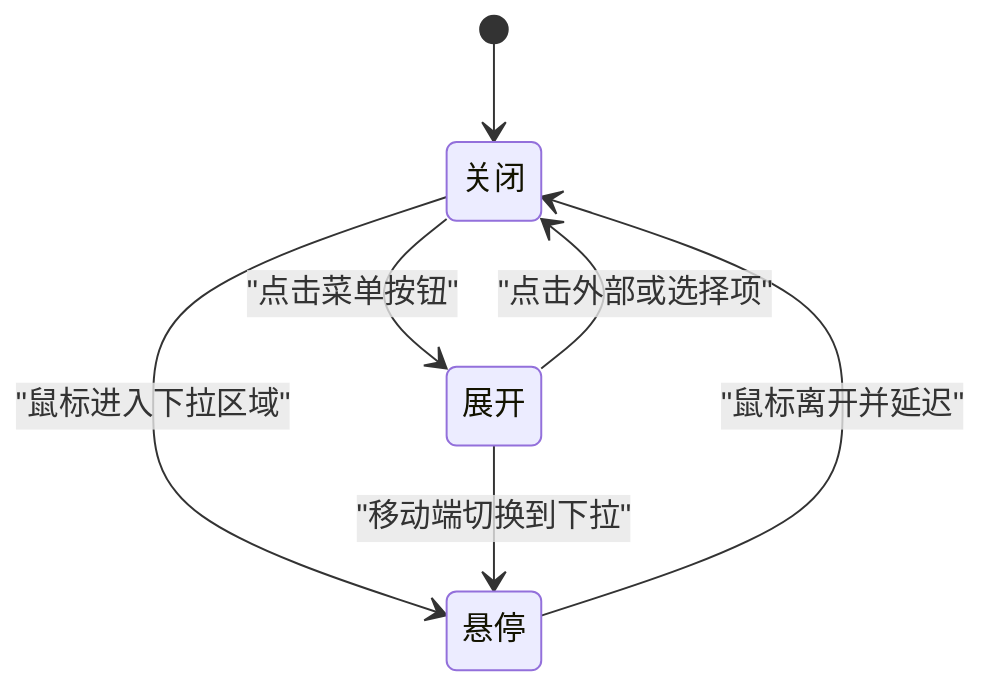
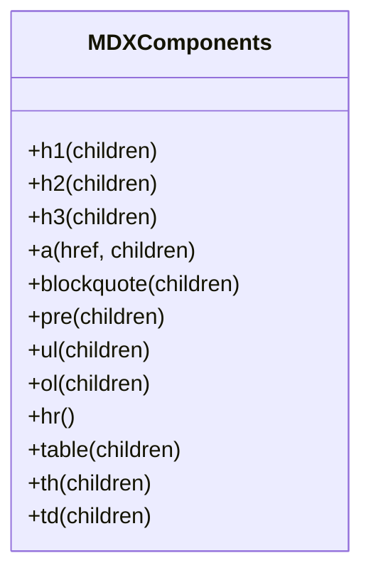
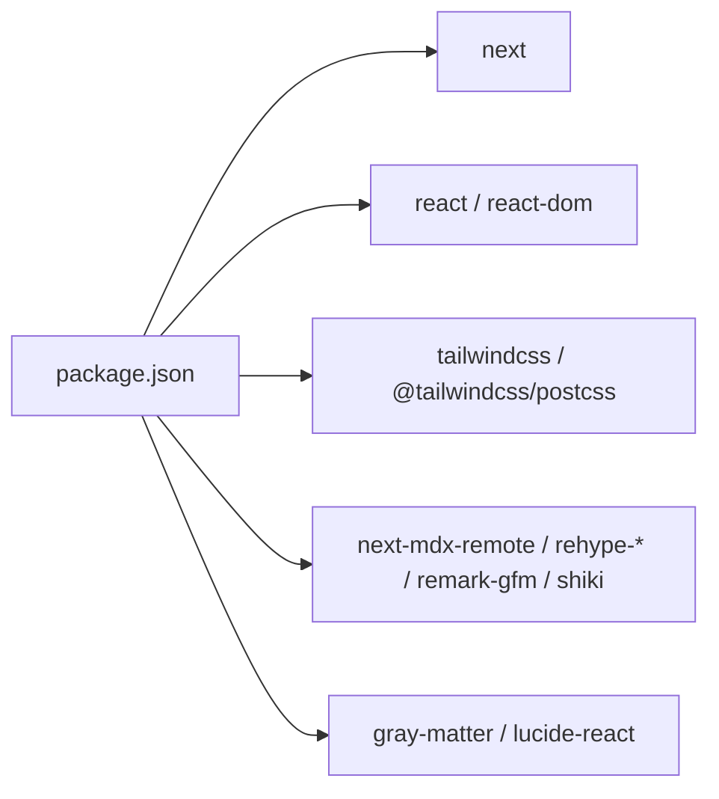

# 开发指南

<cite>
**本文引用的文件**
- [package.json](file://package.json)
- [tsconfig.json](file://tsconfig.json)
- [eslint.config.mjs](file://eslint.config.mjs)
- [postcss.config.mjs](file://postcss.config.mjs)
- [next.config.ts](file://next.config.ts)
- [README.md](file://README.md)
- [src/app/layout.tsx](file://src/app/layout.tsx)
- [src/app/page.tsx](file://src/app/page.tsx)
- [src/app/[domain]/page.tsx](file://src/app/[domain]/page.tsx)
- [src/components/layout/Navbar.tsx](file://src/components/layout/Navbar.tsx)
- [src/components/article/MDXComponents.tsx](file://src/components/article/MDXComponents.tsx)
- [src/lib/content.ts](file://src/lib/content.ts)
- [src/lib/domains.ts](file://src/lib/domains.ts)
- [src/config/site.ts](file://src/config/site.ts)
- [src/types/index.ts](file://src/types/index.ts)
- [src/app/globals.css](file://src/app/globals.css)
</cite>

## 目录
1. [简介](#简介)
2. [项目结构](#项目结构)
3. [核心组件](#核心组件)
4. [架构总览](#架构总览)
5. [详细组件分析](#详细组件分析)
6. [依赖分析](#依赖分析)
7. [性能考虑](#性能考虑)
8. [调试与开发工具](#调试与开发工具)
9. [代码规范与最佳实践](#代码规范与最佳实践)
10. [版本控制与协作开发](#版本控制与协作开发)
11. [故障排除指南](#故障排除指南)
12. [结论](#结论)

## 简介
本指南面向 blog_new 项目的开发者，提供从环境搭建到日常开发、性能优化与团队协作的全流程指引。项目基于 Next.js 应用程序路由，采用 TypeScript、Tailwind CSS 以及 MDX 内容渲染，结合 ESLint 与 PostCSS 工具链，形成现代化的前端工程化体系。

## 项目结构
项目采用按功能域划分的目录组织方式，核心模块包括：
- 应用层：页面与布局逻辑位于 src/app 下，采用 App Router 的嵌套路由与动态段。
- 组件层：可复用 UI 组件位于 src/components，包含布局组件与内容渲染组件。
- 配置层：站点配置、类型定义与内容解析逻辑分别位于 src/config、src/types、src/lib。
- 样式层：全局样式通过 Tailwind 与自定义 CSS 变量实现主题化。

**图表来源**
- [src/app/layout.tsx:1-61](file://src/app/layout.tsx#L1-L61)
- [src/app/page.tsx:1-92](file://src/app/page.tsx#L1-L92)
- [src/app/[domain]/page.tsx](file://src/app/[domain]/page.tsx#L1-L89)
- [src/components/layout/Navbar.tsx:1-141](file://src/components/layout/Navbar.tsx#L1-L141)
- [src/components/article/MDXComponents.tsx:1-70](file://src/components/article/MDXComponents.tsx#L1-L70)
- [src/config/site.ts:1-20](file://src/config/site.ts#L1-L20)
- [src/types/index.ts:1-45](file://src/types/index.ts#L1-L45)
- [src/lib/domains.ts:1-136](file://src/lib/domains.ts#L1-L136)
- [src/lib/content.ts:1-158](file://src/lib/content.ts#L1-L158)
- [src/app/globals.css:1-95](file://src/app/globals.css#L1-L95)

**章节来源**
- [README.md:1-37](file://README.md#L1-L37)
- [src/app/layout.tsx:1-61](file://src/app/layout.tsx#L1-L61)
- [src/app/page.tsx:1-92](file://src/app/page.tsx#L1-L92)
- [src/app/[domain]/page.tsx](file://src/app/[domain]/page.tsx#L1-L89)
- [src/components/layout/Navbar.tsx:1-141](file://src/components/layout/Navbar.tsx#L1-L141)
- [src/components/article/MDXComponents.tsx:1-70](file://src/components/article/MDXComponents.tsx#L1-L70)
- [src/config/site.ts:1-20](file://src/config/site.ts#L1-L20)
- [src/types/index.ts:1-45](file://src/types/index.ts#L1-L45)
- [src/lib/domains.ts:1-136](file://src/lib/domains.ts#L1-L136)
- [src/lib/content.ts:1-158](file://src/lib/content.ts#L1-L158)
- [src/app/globals.css:1-95](file://src/app/globals.css#L1-L95)

## 核心组件
- 应用根布局：负责注入字体变量、站点元数据、全局导航与页脚，并在服务端聚合各领域分类信息。
- 主页：展示作者信息、座右铭、技术栈标签与领域卡片入口。
- 领域页：根据动态参数渲染对应领域的分类与文章列表，支持静态生成与元数据生成。
- 导航栏：响应式导航，支持桌面端下拉与移动端抽屉菜单，具备悬停状态与路径高亮。
- MDX 组件：统一标题、链接、引用块、表格等 Markdown 渲染样式，确保内容一致性。
- 内容库：封装内容读取、元数据解析、文章检索与侧边栏数据聚合，使用 React 缓存提升性能。
- 域与分类：集中定义领域与分类结构，提供查询与排序能力。
- 全局样式：基于 Tailwind 与 CSS 变量的主题系统，覆盖滚动条与 prose 样式。

**章节来源**
- [src/app/layout.tsx:1-61](file://src/app/layout.tsx#L1-L61)
- [src/app/page.tsx:1-92](file://src/app/page.tsx#L1-L92)
- [src/app/[domain]/page.tsx](file://src/app/[domain]/page.tsx#L1-L89)
- [src/components/layout/Navbar.tsx:1-141](file://src/components/layout/Navbar.tsx#L1-L141)
- [src/components/article/MDXComponents.tsx:1-70](file://src/components/article/MDXComponents.tsx#L1-L70)
- [src/lib/content.ts:1-158](file://src/lib/content.ts#L1-L158)
- [src/lib/domains.ts:1-136](file://src/lib/domains.ts#L1-L136)
- [src/app/globals.css:1-95](file://src/app/globals.css#L1-L95)

## 架构总览
整体架构围绕“内容即数据”的理念，通过静态生成与服务端渲染相结合的方式，实现高性能与可维护性的平衡。

**图表来源**
- [src/lib/content.ts:1-158](file://src/lib/content.ts#L1-L158)
- [src/lib/domains.ts:1-136](file://src/lib/domains.ts#L1-L136)
- [src/app/[domain]/page.tsx](file://src/app/[domain]/page.tsx#L1-L89)
- [src/app/layout.tsx:1-61](file://src/app/layout.tsx#L1-L61)

## 详细组件分析

### 内容解析与缓存流程
内容解析采用同步读取与异步聚合相结合的方式，利用 React 缓存避免重复 IO 并提升 SSR 性能。

**图表来源**
- [src/app/[domain]/page.tsx](file://src/app/[domain]/page.tsx#L1-L89)
- [src/lib/content.ts:1-158](file://src/lib/content.ts#L1-L158)
- [src/lib/domains.ts:1-136](file://src/lib/domains.ts#L1-L136)

**章节来源**
- [src/lib/content.ts:1-158](file://src/lib/content.ts#L1-L158)
- [src/app/[domain]/page.tsx](file://src/app/[domain]/page.tsx#L1-L89)

### 导航栏交互状态机
导航栏在桌面端支持下拉菜单，移动端支持抽屉菜单，内部维护展开与悬停状态。

**图表来源**
- [src/components/layout/Navbar.tsx:1-141](file://src/components/layout/Navbar.tsx#L1-L141)

**章节来源**
- [src/components/layout/Navbar.tsx:1-141](file://src/components/layout/Navbar.tsx#L1-L141)

### MDX 组件映射与样式
MDX 组件对常用块级元素进行统一样式化，确保内容在不同设备上的一致性。

**图表来源**
- [src/components/article/MDXComponents.tsx:1-70](file://src/components/article/MDXComponents.tsx#L1-L70)

**章节来源**
- [src/components/article/MDXComponents.tsx:1-70](file://src/components/article/MDXComponents.tsx#L1-L70)
- [src/app/globals.css:1-95](file://src/app/globals.css#L1-L95)

## 依赖分析
项目依赖以 Next.js 生态为核心，结合 Tailwind CSS 与 MDX 生态，形成轻量且高效的前端栈。

**图表来源**
- [package.json:1-36](file://package.json#L1-L36)

**章节来源**
- [package.json:1-36](file://package.json#L1-L36)

## 性能考虑
- 构建与运行时
  - 使用 Next.js 16 默认的 Bundler 与 ES Module 解析，配合 TypeScript 严格模式与 noEmit，减少运行时错误与打包体积。
  - Tailwind 与 PostCSS 配合，启用按需生成与插件化处理，降低 CSS 体积。
- 数据获取与缓存
  - 内容库使用 React 缓存函数对 IO 结果进行缓存，避免重复读取与解析。
  - 首屏渲染优先加载必要资源，次级内容通过并行请求聚合。
- 样式与字体
  - 使用 next/font 提供的字体变量与 swap 显示策略，减少 FOIT/FOUC。
  - CSS 变量集中管理主题色板，便于统一与维护。
- 代码分割与懒加载
  - 动态导入与按需渲染组件，结合 Next.js 的自动代码分割，减少首屏 JS 体积。
- 监控与分析
  - 利用 Next.js 内置的构建报告与分析工具，定期检查包大小与模块依赖。
  - 在生产环境开启 Core Web Vitals 监控，关注 LCP、INP、CLS 等指标。

**章节来源**
- [tsconfig.json:1-35](file://tsconfig.json#L1-L35)
- [postcss.config.mjs:1-8](file://postcss.config.mjs#L1-L8)
- [src/lib/content.ts:1-158](file://src/lib/content.ts#L1-L158)
- [src/app/globals.css:1-95](file://src/app/globals.css#L1-L95)

## 调试与开发工具
- 开发服务器
  - 支持多包管理器启动开发服务器，建议在本地统一使用一种包管理器以避免 lockfile 冲突。
- 类型检查与格式化
  - TypeScript 严格模式与 noEmit 确保编译期错误尽早暴露；结合编辑器的 TS 插件实现实时诊断。
- 代码质量
  - ESLint 配置继承 Next.js 官方规则，覆盖 Core Web Vitals 与 TypeScript 规范；默认忽略构建产物与临时目录。
- 样式调试
  - Tailwind 与 CSS 变量配合，可在浏览器中快速切换主题与定位样式问题。
- 内容调试
  - MDX 文档的 frontmatter 字段用于控制文章状态（草稿）、分类与领域归属；修改后需重新生成静态页面或重启开发服务器。

**章节来源**
- [README.md:1-37](file://README.md#L1-L37)
- [package.json:1-36](file://package.json#L1-L36)
- [eslint.config.mjs:1-19](file://eslint.config.mjs#L1-L19)
- [tsconfig.json:1-35](file://tsconfig.json#L1-L35)

## 代码规范与最佳实践
- 命名约定
  - 文件与目录使用小驼峰或短横线分隔，组件文件以 PascalCase 命名，页面文件使用 page.tsx。
  - 类型接口以大驼峰开头，属性遵循语义化命名。
- 文件组织
  - 页面与布局集中在 src/app，通用组件集中在 src/components，配置与类型集中在 src/config 与 src/types，业务逻辑集中在 src/lib。
- 注释与文档
  - 对外导出的组件与函数提供简要用途说明；复杂逻辑添加步骤注释与边界条件说明。
- 样式与主题
  - 使用 CSS 变量集中管理颜色与字体族，避免硬编码；Tailwind 实用类与自定义样式结合使用。
- 内容管理
  - MDX 文档的 frontmatter 字段保持一致的键名与类型；草稿文章在发布前移除 draft 标记。
- 类型安全
  - 在需要时显式声明类型，避免 any；使用 React 的只读属性与严格模式下的不可变更新。

**章节来源**
- [src/types/index.ts:1-45](file://src/types/index.ts#L1-L45)
- [src/config/site.ts:1-20](file://src/config/site.ts#L1-L20)
- [src/lib/domains.ts:1-136](file://src/lib/domains.ts#L1-L136)
- [src/app/globals.css:1-95](file://src/app/globals.css#L1-L95)

## 版本控制与协作开发
- 分支策略
  - 主分支仅合并已审查的特性分支；hotfix 分支直接从主分支切出并回并主分支与发布分支。
- 提交规范
  - 使用清晰的提交信息描述变更目的与范围；关联相关 Issue 或需求编号。
- 代码审查
  - 所有功能与修复必须通过至少一次审查；审查重点包括：逻辑正确性、性能影响、可维护性与测试覆盖。
- 质量保证
  - 本地运行 lint 与类型检查；在 CI 中执行相同流程，失败则阻断合并。
- 发布流程
  - 在预发布环境验证后再合并至主分支；生产部署通过平台自动化完成。

**章节来源**
- [package.json:1-36](file://package.json#L1-L36)
- [eslint.config.mjs:1-19](file://eslint.config.mjs#L1-L19)

## 故障排除指南
- 开发服务器无法启动
  - 检查 Node.js 版本是否满足 Next.js 最低要求；确认端口未被占用。
- 样式异常
  - 确认 Tailwind 插件与 PostCSS 配置正确；检查 CSS 变量是否被覆盖。
- 内容不显示
  - 检查 MDX 文件扩展名与 frontmatter 字段；确认草稿标记未导致文章被过滤。
- 构建失败
  - 查看 TypeScript 错误与 ESLint 报告；清理缓存后重试构建。

**章节来源**
- [README.md:1-37](file://README.md#L1-L37)
- [postcss.config.mjs:1-8](file://postcss.config.mjs#L1-L8)
- [src/lib/content.ts:1-158](file://src/lib/content.ts#L1-L158)

## 结论
blog_new 项目通过合理的工程化配置与清晰的模块划分，实现了内容驱动的博客站点开发体验。遵循本文档的开发规范与最佳实践，可有效提升开发效率与代码质量，并为后续的功能扩展与性能优化奠定基础。