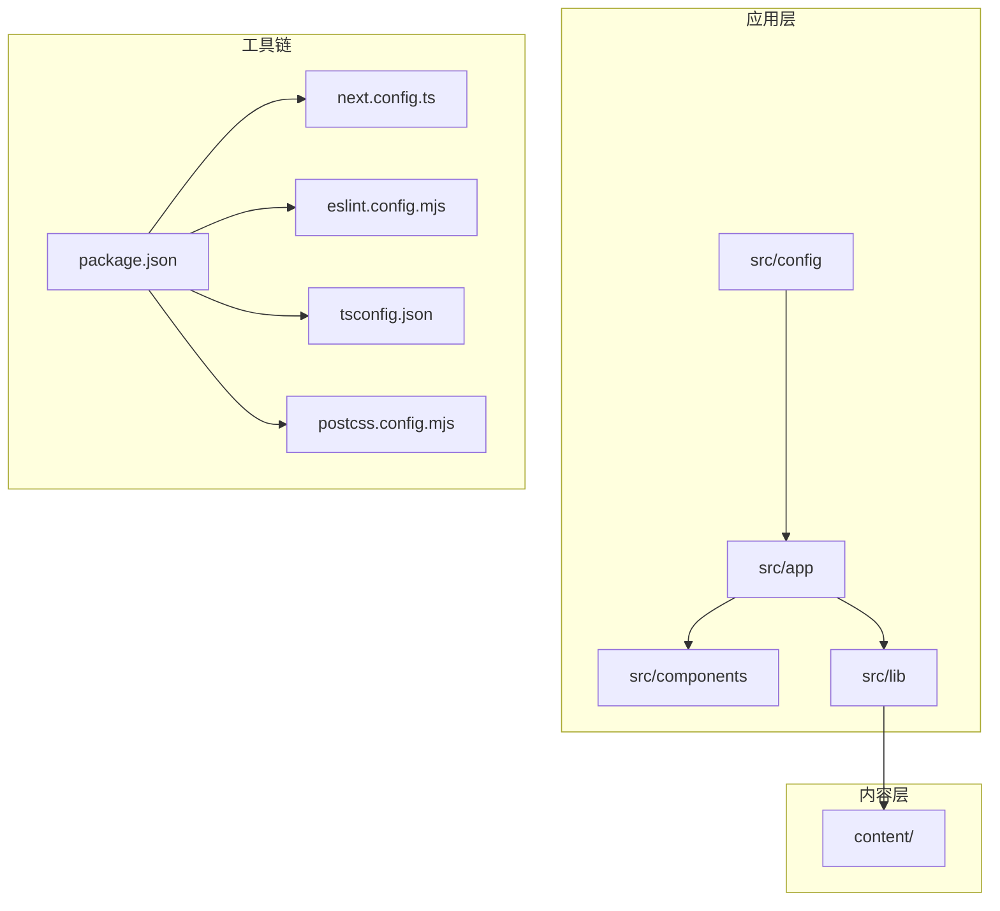
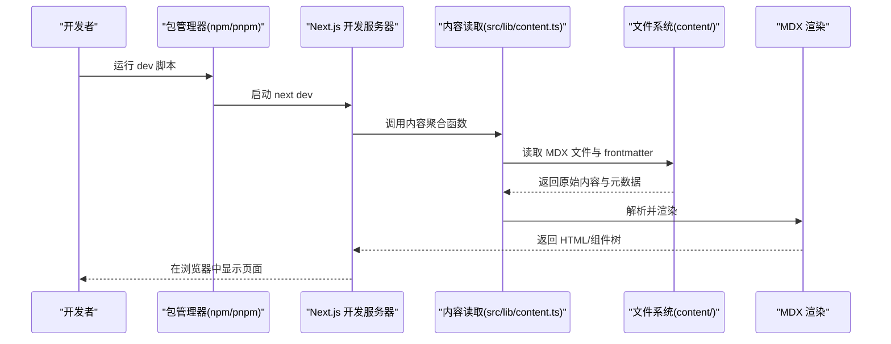
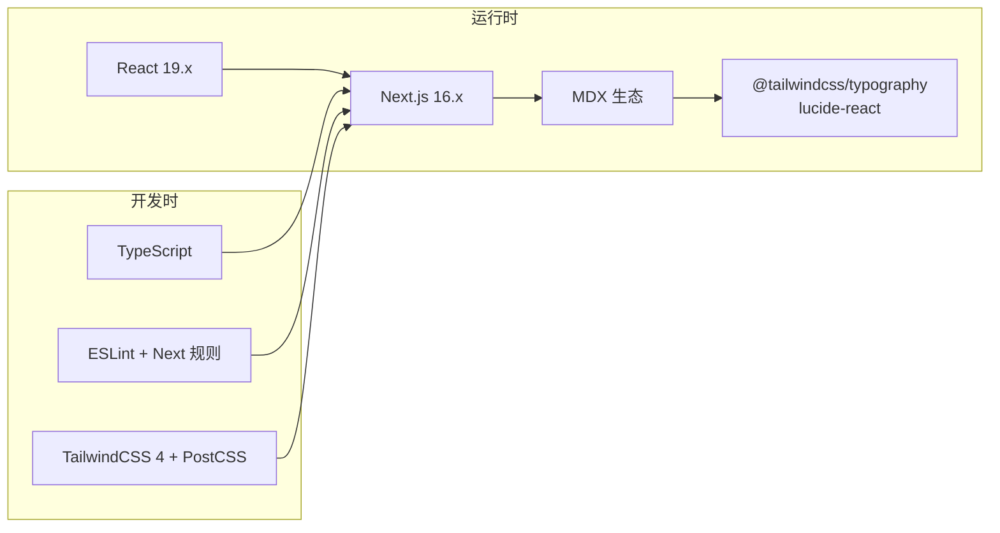

# 开发环境配置

<cite>
**本文引用的文件**
- [package.json](file://package.json)
- [tsconfig.json](file://tsconfig.json)
- [eslint.config.mjs](file://eslint.config.mjs)
- [next.config.ts](file://next.config.ts)
- [postcss.config.mjs](file://postcss.config.mjs)
- [README.md](file://README.md)
- [site.ts](file://src/config/site.ts)
- [content.ts](file://src/lib/content.ts)
- [kafka-core-concepts.mdx](file://content/distributed-architecture/message-queue/kafka-core-concepts.mdx)
</cite>

## 目录
1. [简介](#简介)
2. [项目结构](#项目结构)
3. [核心组件](#核心组件)
4. [架构总览](#架构总览)
5. [详细组件分析](#详细组件分析)
6. [依赖分析](#依赖分析)
7. [性能考虑](#性能考虑)
8. [故障排除指南](#故障排除指南)
9. [结论](#结论)
10. [附录](#附录)

## 简介
本指南面向首次参与 blog_new 项目的开发者，提供从 Node.js 版本到 IDE 推荐、包管理器选择、依赖安装与管理、本地开发服务器启动、环境变量配置以及常见问题排查的完整流程。项目基于 Next.js 应用，采用 TypeScript、ESLint、TailwindCSS 4（PostCSS 集成）与 MDX 内容驱动的静态生成策略。

## 项目结构
blog_new 采用标准 Next.js App Router 结构，核心目录与职责如下：
- src/app：页面与路由层，包含动态路由、布局与页面组件
- src/components：可复用 UI 组件与业务组件
- src/lib：内容读取与领域数据聚合逻辑
- src/config：站点元信息与配置
- content：MDX 文章内容，按领域与分类组织
- 工具链配置：package.json、tsconfig.json、eslint.config.mjs、next.config.ts、postcss.config.mjs

图表来源
- [package.json:1-36](file://package.json#L1-L36)
- [tsconfig.json:1-35](file://tsconfig.json#L1-L35)
- [eslint.config.mjs:1-19](file://eslint.config.mjs#L1-L19)
- [next.config.ts:1-8](file://next.config.ts#L1-L8)
- [postcss.config.mjs:1-8](file://postcss.config.mjs#L1-L8)

章节来源
- [package.json:1-36](file://package.json#L1-L36)
- [tsconfig.json:1-35](file://tsconfig.json#L1-L35)
- [eslint.config.mjs:1-19](file://eslint.config.mjs#L1-L19)
- [next.config.ts:1-8](file://next.config.ts#L1-L8)
- [postcss.config.mjs:1-8](file://postcss.config.mjs#L1-L8)

## 核心组件
- 包管理与脚本：统一通过 package.json 管理 scripts，支持 dev、build、start、lint 等命令
- 类型系统：TypeScript 编译选项启用严格模式、路径映射与 bundler 解析
- Lint 规则：基于 eslint-config-next 的核心 Web Vitals 与 TypeScript 规则，并自定义忽略项
- 构建工具：Next.js 16.1.6；TailwindCSS 4 通过 @tailwindcss/postcss 集成
- 内容系统：基于 gray-matter 解析 MDX frontmatter，结合 rehype/retext 生态渲染代码块与标题锚点

章节来源
- [package.json:5-10](file://package.json#L5-L10)
- [tsconfig.json:2-24](file://tsconfig.json#L2-L24)
- [eslint.config.mjs:1-19](file://eslint.config.mjs#L1-L19)
- [next.config.ts:3-5](file://next.config.ts#L3-L5)
- [postcss.config.mjs:1-8](file://postcss.config.mjs#L1-L8)

## 架构总览
下图展示开发环境从本地启动到内容渲染的关键流程：

图表来源
- [package.json:5-10](file://package.json#L5-L10)
- [content.ts:13-27](file://src/lib/content.ts#L13-L27)
- [kafka-core-concepts.mdx:1-9](file://content/distributed-architecture/message-queue/kafka-core-concepts.mdx#L1-L9)

章节来源
- [package.json:5-10](file://package.json#L5-L10)
- [content.ts:1-158](file://src/lib/content.ts#L1-L158)

## 详细组件分析

### Node.js 版本与兼容性
- 项目使用 Next.js 16.1.6 与 React 19.2.3，建议在满足官方最低版本要求的前提下，优先选择长期支持（LTS）版本的 Node.js，以确保包管理器与构建工具稳定运行
- 若使用 nvm，请在项目根目录执行切换命令，确保当前 shell 使用正确的 Node 版本后再安装依赖与启动开发服务器

章节来源
- [package.json:11-24](file://package.json#L11-L24)
- [package.json:25-34](file://package.json#L25-L34)

### 包管理器选择与配置
- 支持 npm、pnpm、yarn 与 bun（参考 README 中的多方案启动说明）
- 建议团队统一使用 pnpm 以获得更好的磁盘空间利用率与安装速度；若使用 npm，请确保使用与 Node LTS 对应的版本
- 安装依赖后，确认 node_modules 未被提交至版本控制（已配置于 .gitignore）

章节来源
- [README.md:7-15](file://README.md#L7-L15)
- [.gitignore](file://.gitignore)

### IDE 推荐设置
- VS Code 插件建议
  - ESLint：启用 lint 规则即时提示
  - TypeScript Importer：自动导入类型与模块
  - Tailwind CSS IntelliSense：提供类名补全与预览
  - Prettier：统一代码风格（与 ESLint 冲突时建议禁用 Prettier 的 JS/TS 格式化，仅保留 ESLint 处理）
- TypeScript 配置
  - 严格模式开启，路径别名 @/* 指向 src/*
  - 模块解析采用 bundler，避免与传统打包器冲突
- ESLint 设置
  - 基于 eslint-config-next 的 Core Web Vitals 与 TypeScript 规则
  - 自定义忽略项覆盖默认忽略列表，确保 .next、out、build、next-env.d.ts 等目录不被扫描

章节来源
- [tsconfig.json:2-24](file://tsconfig.json#L2-L24)
- [eslint.config.mjs:1-19](file://eslint.config.mjs#L1-L19)

### 依赖安装与管理
- 依赖分类
  - 生产依赖：React、Next.js、MDX 渲染与排版相关库（如 rehype、remark、shiki）
  - 开发依赖：TypeScript、ESLint、TailwindCSS 4 与类型声明
- 安装流程
  - 使用选定包管理器安装依赖后，执行 next dev 启动开发服务器
  - 如需构建生产包，使用 next build；部署时使用 next start
- 注意事项
  - 不要手动修改 package-lock.json 或 yarn.lock；统一通过包管理器进行依赖管理
  - 若升级 Next.js 或 React，请同步更新相关类型与插件版本

章节来源
- [package.json:11-24](file://package.json#L11-L24)
- [package.json:25-34](file://package.json#L25-L34)

### 本地开发服务器启动与常用命令
- 启动开发服务器：执行 dev 脚本，访问 http://localhost:3000
- 构建生产包：执行 build 脚本
- 启动生产服务器：执行 start 脚本
- 代码质量检查：执行 lint 脚本
- 常见启动方式（多包管理器）：参考 README 中的示例命令

章节来源
- [package.json:5-10](file://package.json#L5-L10)
- [README.md:7-15](file://README.md#L7-L15)

### 环境变量配置与管理
- 项目未显式声明环境变量键值，因此无需 .env 文件即可正常启动
- 若后续引入需要的环境变量（如第三方服务密钥），请遵循 Next.js 的环境变量约定：
  - 仅在构建时使用的变量需以 NEXT_PUBLIC_ 前缀声明
  - 运行时敏感变量不带前缀，仅在服务端可用
  - 将环境变量写入 .env.local 并添加到 .gitignore，避免提交到仓库
- 内容读取逻辑依赖 content/ 目录结构，确保该目录存在且权限正确

章节来源
- [content.ts](file://src/lib/content.ts#L13)
- [.gitignore](file://.gitignore)

### 内容与站点配置
- 站点元信息集中于 src/config/site.ts，包含名称、描述、作者、标语与技术栈列表
- 内容读取通过 src/lib/content.ts 实现，支持按领域、分类与文章 slug 查询，并对结果进行缓存优化

章节来源
- [site.ts:1-20](file://src/config/site.ts#L1-L20)
- [content.ts:45-158](file://src/lib/content.ts#L45-L158)

## 依赖分析
- 运行时依赖
  - React 与 React DOM：UI 基础
  - Next.js：应用框架与构建工具
  - MDX 生态：next-mdx-remote、gray-matter、rehype/retext 系列用于渲染与增强
  - UI 与排版：lucide-react、@tailwindcss/typography
- 开发依赖
  - TypeScript、ESLint 与 Next 推荐规则
  - TailwindCSS 4 与 PostCSS 集成插件

图表来源
- [package.json:11-24](file://package.json#L11-L24)
- [package.json:25-34](file://package.json#L25-L34)

章节来源
- [package.json:11-34](file://package.json#L11-L34)

## 性能考虑
- 使用 React.cache 对内容查询进行缓存，减少重复 IO 与解析开销
- 启用严格 TypeScript 检查与增量编译，提升开发体验与构建稳定性
- TailwindCSS 4 与 PostCSS 集成，确保样式按需生成，避免无用样式进入产物
- 通过 Next.js 的 App Router 动态路由与按需加载，降低首屏负载

章节来源
- [content.ts:4-4](file://src/lib/content.ts#L4-L4)
- [tsconfig.json:7-15](file://tsconfig.json#L7-L15)
- [postcss.config.mjs:1-8](file://postcss.config.mjs#L1-L8)

## 故障排除指南
- 开发服务器无法启动
  - 检查 Node.js 版本是否满足 Next.js 与 React 的最低要求
  - 清理 node_modules 与 lockfile 后重新安装依赖
  - 确认 3000 端口未被占用
- Lint 报错
  - 使用 lint 脚本修复可自动修复的问题；对于复杂规则冲突，参考 ESLint 配置文件中的覆盖项
- MDX 内容未显示
  - 确认 content/ 下的 MDX 文件具有正确的 frontmatter 字段（如 title、date、domain、category）
  - 检查内容读取函数是否能正确解析 frontmatter 与正文
- 样式异常
  - 确保 TailwindCSS 4 与 PostCSS 插件已正确安装与配置
  - 检查路径别名 @/* 是否在 TypeScript 与构建工具中一致生效

章节来源
- [README.md:7-15](file://README.md#L7-L15)
- [eslint.config.mjs:1-19](file://eslint.config.mjs#L1-L19)
- [content.ts:29-43](file://src/lib/content.ts#L29-L43)
- [postcss.config.mjs:1-8](file://postcss.config.mjs#L1-L8)

## 结论
本指南提供了 blog_new 项目的开发环境配置与运维要点：统一包管理器、遵循 TypeScript 与 ESLint 规范、利用 Next.js 与 MDX 生态实现内容驱动的静态生成，并通过缓存与 TailwindCSS 4 提升性能与开发体验。建议团队在本地与 CI 环境保持一致的 Node.js 版本与依赖锁版本，确保构建一致性。

## 附录
- 快速启动清单
  - 安装 Node.js LTS
  - 选择包管理器并安装依赖
  - 执行 dev 脚本启动开发服务器
  - 使用 ESLint 与 TypeScript 保持代码质量
  - 如需新增内容，按领域与分类在 content/ 下创建 MDX 文件并补充 frontmatter