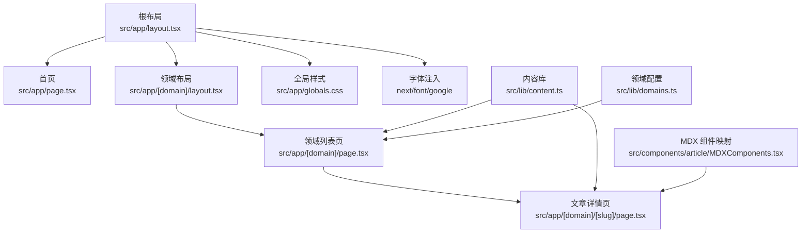
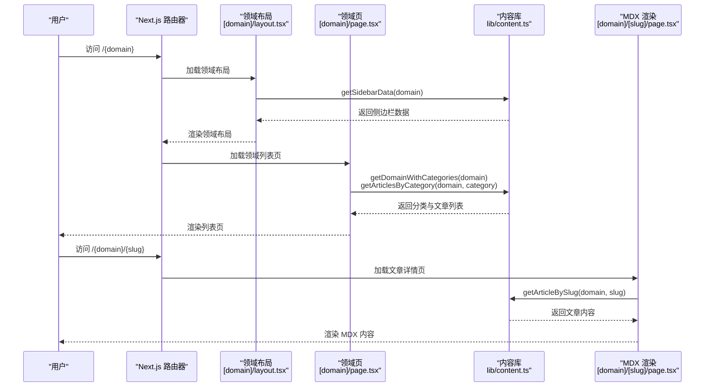
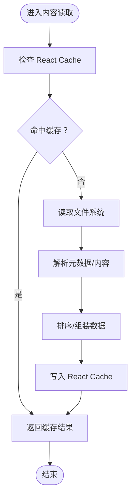
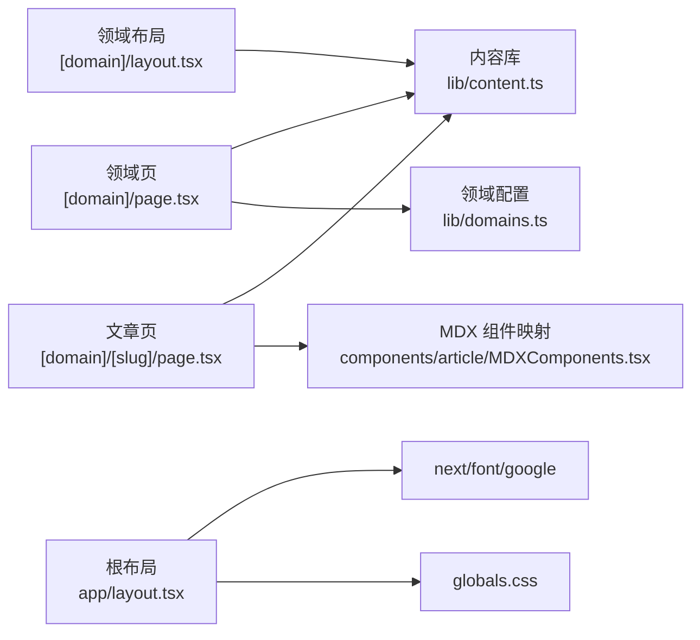

# 性能优化

<cite>
**本文引用的文件**
- [next.config.ts](file://next.config.ts)
- [package.json](file://package.json)
- [tsconfig.json](file://tsconfig.json)
- [postcss.config.mjs](file://postcss.config.mjs)
- [src/app/layout.tsx](file://src/app/layout.tsx)
- [src/app/page.tsx](file://src/app/page.tsx)
- [src/app/[domain]/layout.tsx](file://src/app/[domain]/layout.tsx)
- [src/app/[domain]/page.tsx](file://src/app/[domain]/page.tsx)
- [src/app/[domain]/[slug]/page.tsx](file://src/app/[domain]/[slug]/page.tsx)
- [src/lib/content.ts](file://src/lib/content.ts)
- [src/lib/domains.ts](file://src/lib/domains.ts)
- [src/components/article/MDXComponents.tsx](file://src/components/article/MDXComponents.tsx)
- [src/config/site.ts](file://src/config/site.ts)
</cite>

## 目录
1. [简介](#简介)
2. [项目结构](#项目结构)
3. [核心组件](#核心组件)
4. [架构总览](#架构总览)
5. [详细组件分析](#详细组件分析)
6. [依赖关系分析](#依赖关系分析)
7. [性能考虑](#性能考虑)
8. [故障排查指南](#故障排查指南)
9. [结论](#结论)
10. [附录](#附录)

## 简介
本文件面向 blog_new 项目，提供一套系统性的性能优化策略与实施指南，覆盖 Next.js 配置、静态生成与代码分割、内容缓存（React Cache 与文件系统缓存）、Bundle 分析与体积优化、图片与资源压缩、SSR 与客户端水合优化、性能监控与指标采集、以及性能基准测试与持续监控流程。目标是在不牺牲功能与可维护性的前提下，显著提升首屏渲染速度、交互响应性与整体用户体验。

## 项目结构
项目采用 Next.js App Router 的目录组织方式，页面按动态路由分层：根布局负责全局样式与字体注入；各领域页与文章页通过静态生成（SSG）或服务端渲染（SSR）生成页面；内容读取通过 React Cache 与文件系统缓存结合，减少重复 I/O 与计算开销。

图表来源
- [src/app/layout.tsx:1-61](file://src/app/layout.tsx#L1-L61)
- [src/app/page.tsx:1-92](file://src/app/page.tsx#L1-L92)
- [src/app/[domain]/layout.tsx](file://src/app/[domain]/layout.tsx#L1-L30)
- [src/app/[domain]/page.tsx](file://src/app/[domain]/page.tsx#L1-L89)
- [src/app/[domain]/[slug]/page.tsx](file://src/app/[domain]/[slug]/page.tsx#L1-L100)
- [src/lib/content.ts:1-158](file://src/lib/content.ts#L1-L158)
- [src/lib/domains.ts:1-136](file://src/lib/domains.ts#L1-L136)
- [src/components/article/MDXComponents.tsx:1-70](file://src/components/article/MDXComponents.tsx#L1-L70)

章节来源
- [src/app/layout.tsx:1-61](file://src/app/layout.tsx#L1-L61)
- [src/app/page.tsx:1-92](file://src/app/page.tsx#L1-L92)
- [src/app/[domain]/layout.tsx](file://src/app/[domain]/layout.tsx#L1-L30)
- [src/app/[domain]/page.tsx](file://src/app/[domain]/page.tsx#L1-L89)
- [src/app/[domain]/[slug]/page.tsx](file://src/app/[domain]/[slug]/page.tsx#L1-L100)
- [src/lib/content.ts:1-158](file://src/lib/content.ts#L1-L158)
- [src/lib/domains.ts:1-136](file://src/lib/domains.ts#L1-L136)
- [src/components/article/MDXComponents.tsx:1-70](file://src/components/article/MDXComponents.tsx#L1-L70)

## 核心组件
- 根布局与字体注入：在根布局中使用 next/font/google 注入中英文字体变量，避免字体阻塞与 FOIT，同时设置 display: swap 提升可读性。
- 内容读取与缓存：通过 React Cache 包装的内容读取函数（getAllDomains、getDomainWithCategories、getArticlesByDomain、getArticlesByCategory、getArticleBySlug、getSidebarData、getAllArticleSlugs）实现请求级与渲染级缓存，降低重复 I/O 与解析成本。
- 动态路由与静态生成：领域页与文章页通过 generateStaticParams 生成静态参数，结合 generateMetadata 动态生成 SEO 元数据，最大化利用静态产物与 CDN 缓存。
- MDX 渲染：文章内容通过 next-mdx-remote RSC 渲染，并配置 remarkGfm、rehypeSlug、rehypePrettyCode 等插件，兼顾语法高亮与可访问性。
- 布局与导航：侧边栏数据在领域布局中异步获取并传递给子组件，首页展示技术栈标签，增强信息密度与可发现性。

章节来源
- [src/app/layout.tsx:10-28](file://src/app/layout.tsx#L10-L28)
- [src/lib/content.ts:45-158](file://src/lib/content.ts#L45-L158)
- [src/app/[domain]/layout.tsx](file://src/app/[domain]/layout.tsx#L6-L8)
- [src/app/[domain]/page.tsx](file://src/app/[domain]/page.tsx#L7-L23)
- [src/app/[domain]/[slug]/page.tsx](file://src/app/[domain]/[slug]/page.tsx#L10-L27)
- [src/components/article/MDXComponents.tsx:1-70](file://src/components/article/MDXComponents.tsx#L1-L70)
- [src/app/page.tsx:1-92](file://src/app/page.tsx#L1-L92)

## 架构总览
下图展示了从请求到页面渲染的关键路径，包括静态生成参数生成、内容缓存、MDX 渲染与组件树构建。

图表来源
- [src/app/[domain]/layout.tsx](file://src/app/[domain]/layout.tsx#L10-L19)
- [src/app/[domain]/page.tsx](file://src/app/[domain]/page.tsx#L34-L39)
- [src/lib/content.ts:102-131](file://src/lib/content.ts#L102-L131)
- [src/app/[domain]/[slug]/page.tsx](file://src/app/[domain]/[slug]/page.tsx#L34-L36)

## 详细组件分析

### 内容缓存与文件系统缓存
- React Cache：通过 cache 包装的内容读取函数，确保同一请求内的多次调用共享结果，避免重复解析与排序。
- 文件系统缓存：在 getArticlesByDomain、getArticlesByCategory、getArticleBySlug 中对目录与文件进行同步读取，建议在生产环境配合文件系统缓存（如内存缓存或进程内缓存）以减少磁盘 I/O。
- 并发优化：在领域页中使用 Promise.all 并发获取分类下的文章列表，缩短关键路径时间。

图表来源
- [src/lib/content.ts:45-158](file://src/lib/content.ts#L45-L158)

章节来源
- [src/lib/content.ts:45-158](file://src/lib/content.ts#L45-L158)

### 静态生成与代码分割
- 静态参数生成：领域页与文章页通过 generateStaticParams 生成静态路由参数，结合静态构建可将页面预渲染为 HTML，显著降低首屏延迟。
- 代码分割：App Router 默认按路由自动分割代码，建议保持组件拆分合理，避免单文件过大；对非关键路径的组件使用动态导入（例如侧边栏或评论区）进一步优化首屏包体。
- 字体与样式：根布局中使用 next/font/google 注入字体变量，避免外部字体请求阻塞；Tailwind PostCSS 插件用于样式打包与裁剪。

章节来源
- [src/app/[domain]/layout.tsx](file://src/app/[domain]/layout.tsx#L6-L8)
- [src/app/[domain]/page.tsx](file://src/app/[domain]/page.tsx#L7-L9)
- [src/app/[domain]/[slug]/page.tsx](file://src/app/[domain]/[slug]/page.tsx#L10-L13)
- [src/app/layout.tsx:10-28](file://src/app/layout.tsx#L10-L28)
- [postcss.config.mjs:1-8](file://postcss.config.mjs#L1-L8)

### 图片优化与资源压缩
- 图标与 SVG：使用 lucide-react 提供的图标组件，按需引入，避免整包引入导致体积膨胀。
- 文章配图：当前未见专用图片处理方案。建议引入 next/image 或第三方图片服务（如 Cloudinary），开启自动格式选择、尺寸裁剪与质量压缩，并启用 WebP/JPEG2000 等现代格式。
- 样式与字体：Tailwind 与 next/font 已具备基础裁剪能力，建议结合 Purge/Tree Shaking 与字体子集化，进一步减小体积。

章节来源
- [package.json:11-24](file://package.json#L11-L24)
- [src/app/layout.tsx:10-28](file://src/app/layout.tsx#L10-L28)
- [postcss.config.mjs:1-8](file://postcss.config.mjs#L1-L8)

### SSR 与客户端水合优化
- SSR 与 SSG：领域页与文章页采用静态生成，首页与动态内容较少，适合 SSG；若未来引入用户态数据，可在页面组件中使用“use client”标记客户端边界，仅在必要时进行水合。
- 水合策略：优先保证关键内容（标题、摘要、正文）先渲染，非关键交互组件（如评论、分享）延后加载或懒加载。
- 预加载与预连接：对关键字体与样式资源使用 rel="preload" 与 dns-prefetch/preconnect，缩短首字节时间。

章节来源
- [src/app/[domain]/page.tsx](file://src/app/[domain]/page.tsx#L34-L39)
- [src/app/[domain]/[slug]/page.tsx](file://src/app/[domain]/[slug]/page.tsx#L34-L36)
- [src/app/layout.tsx:10-28](file://src/app/layout.tsx#L10-L28)

### Bundle 分析与体积优化
- 分析工具：使用 next bundle analyzer 或 webpack-bundle-analyzer 对生产包进行可视化分析，识别大体积依赖与重复模块。
- Tree Shaking：确保模块采用 ES Module 导出与按需导入，避免默认导入整包；在 tsconfig 中启用严格模式与隔离模块，提升摇树效果。
- 依赖精简：定期审查依赖版本，移除未使用包；对大型库（如 rehype-pretty-code、shiki）评估是否可通过更轻量替代或按需加载。

章节来源
- [package.json:11-24](file://package.json#L11-L24)
- [tsconfig.json:1-35](file://tsconfig.json#L1-L35)

## 依赖关系分析
- 页面依赖：领域布局依赖内容库与领域配置；领域页依赖内容库与领域配置；文章页依赖内容库与 MDX 组件映射。
- 外部依赖：next、react、react-dom、next-mdx-remote、rehype-*、remark-*、shiki 等，构成渲染与内容处理链路。
- 构建与类型：TypeScript 严格模式、Bundler 解析、PostCSS 插件参与样式打包。

图表来源
- [src/app/[domain]/page.tsx](file://src/app/[domain]/page.tsx#L1-L89)
- [src/app/[domain]/layout.tsx](file://src/app/[domain]/layout.tsx#L1-L30)
- [src/app/[domain]/[slug]/page.tsx](file://src/app/[domain]/[slug]/page.tsx#L1-L100)
- [src/lib/content.ts:1-158](file://src/lib/content.ts#L1-L158)
- [src/lib/domains.ts:1-136](file://src/lib/domains.ts#L1-L136)
- [src/components/article/MDXComponents.tsx:1-70](file://src/components/article/MDXComponents.tsx#L1-L70)
- [src/app/layout.tsx:10-28](file://src/app/layout.tsx#L10-L28)

章节来源
- [src/app/[domain]/page.tsx](file://src/app/[domain]/page.tsx#L1-L89)
- [src/app/[domain]/layout.tsx](file://src/app/[domain]/layout.tsx#L1-L30)
- [src/app/[domain]/[slug]/page.tsx](file://src/app/[domain]/[slug]/page.tsx#L1-L100)
- [src/lib/content.ts:1-158](file://src/lib/content.ts#L1-L158)
- [src/lib/domains.ts:1-136](file://src/lib/domains.ts#L1-L136)
- [src/components/article/MDXComponents.tsx:1-70](file://src/components/article/MDXComponents.tsx#L1-L70)
- [src/app/layout.tsx:10-28](file://src/app/layout.tsx#L10-L28)

## 性能考虑
- 首屏渲染
  - 使用静态生成（SSG）与预渲染，结合 CDN 缓存，降低首屏 TTFB 与 FCP。
  - 通过 next/font/google 的字体变量与 display: swap，避免字体阻塞。
  - 将关键内容（标题、摘要、正文）优先渲染，非关键交互组件延后加载。
- 渲染性能
  - 利用 React Cache 缓存内容读取结果，减少重复解析与排序。
  - 在领域页中并发获取多个分类的文章列表，缩短关键路径。
- 资源体积
  - 使用按需导入与 Tree Shaking，避免引入未使用代码。
  - 对大型依赖（如代码高亮）评估按需加载或服务端渲染。
- 图片与媒体
  - 引入 next/image 或第三方图片服务，自动格式选择与尺寸裁剪。
  - 为关键资源添加预加载与预连接，缩短关键路径。
- 构建与类型
  - 保持 TypeScript 严格模式与模块解析为 bundler，提升类型安全与摇树效果。
  - 使用 Tailwind PostCSS 插件进行样式裁剪与打包。

章节来源
- [src/app/layout.tsx:10-28](file://src/app/layout.tsx#L10-L28)
- [src/lib/content.ts:45-158](file://src/lib/content.ts#L45-L158)
- [src/app/[domain]/page.tsx](file://src/app/[domain]/page.tsx#L34-L39)
- [package.json:11-24](file://package.json#L11-L24)
- [tsconfig.json:1-35](file://tsconfig.json#L1-L35)
- [postcss.config.mjs:1-8](file://postcss.config.mjs#L1-L8)

## 故障排查指南
- 首屏慢
  - 检查静态生成参数是否正确生成，确认 generateStaticParams 是否返回预期值。
  - 核对字体变量与样式是否正确注入，避免 FOIT/FOUC。
  - 使用浏览器性能面板分析关键渲染路径，定位阻塞资源。
- 内容加载慢
  - 检查 React Cache 是否生效，确认相同参数的重复请求是否命中缓存。
  - 评估文件系统读取频率，必要时引入进程内缓存或预热。
- MDX 渲染异常
  - 确认 MDX 插件配置（remarkGfm、rehypeSlug、rehypePrettyCode）是否正确。
  - 检查文章内容是否存在缺失字段或格式错误。
- 构建体积过大
  - 使用 bundle 分析工具定位大体积依赖，评估 Tree Shaking 与按需加载。
  - 审核依赖版本，移除未使用包。

章节来源
- [src/app/[domain]/layout.tsx](file://src/app/[domain]/layout.tsx#L6-L8)
- [src/app/layout.tsx:10-28](file://src/app/layout.tsx#L10-L28)
- [src/lib/content.ts:45-158](file://src/lib/content.ts#L45-L158)
- [src/app/[domain]/[slug]/page.tsx](file://src/app/[domain]/[slug]/page.tsx#L77-L95)
- [package.json:11-24](file://package.json#L11-L24)

## 结论
通过静态生成、React Cache、并发加载与资源优化等手段，blog_new 项目可在保证内容丰富度的同时显著提升性能。建议在现有基础上引入图片优化、更细粒度的代码分割与持续性能监控，形成闭环的性能保障体系。

## 附录

### Next.js 性能优化配置清单
- 静态生成与预渲染
  - 使用 generateStaticParams 生成静态路由参数，最大化利用 SSG。
  - 使用 generateMetadata 动态生成 SEO 元数据，减少运行时计算。
- 代码分割与按需加载
  - 保持组件拆分合理，对非关键组件使用动态导入。
  - 确保依赖采用 ES Module 导出与按需导入。
- 字体与样式
  - 使用 next/font/google 注入字体变量，设置 display: swap。
  - 使用 Tailwind PostCSS 插件进行样式裁剪与打包。
- 内容缓存
  - 使用 React Cache 包装内容读取函数，避免重复解析与排序。
  - 在生产环境引入文件系统缓存或进程内缓存，降低 I/O 开销。
- 图片与资源
  - 引入 next/image 或第三方图片服务，自动格式选择与尺寸裁剪。
  - 为关键资源添加 rel="preload" 与 dns-prefetch/preconnect。
- 构建与类型
  - 保持 TypeScript 严格模式与模块解析为 bundler。
  - 使用 bundle 分析工具定期审查依赖体积。

章节来源
- [src/app/[domain]/layout.tsx](file://src/app/[domain]/layout.tsx#L6-L8)
- [src/app/[domain]/page.tsx](file://src/app/[domain]/page.tsx#L7-L23)
- [src/app/layout.tsx:10-28](file://src/app/layout.tsx#L10-L28)
- [src/lib/content.ts:45-158](file://src/lib/content.ts#L45-L158)
- [package.json:11-24](file://package.json#L11-L24)
- [tsconfig.json:1-35](file://tsconfig.json#L1-L35)
- [postcss.config.mjs:1-8](file://postcss.config.mjs#L1-L8)