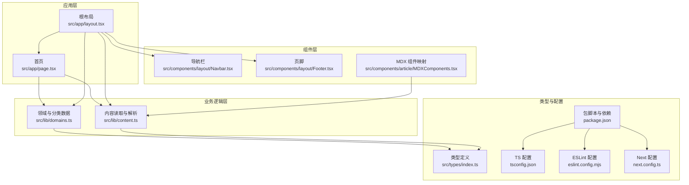
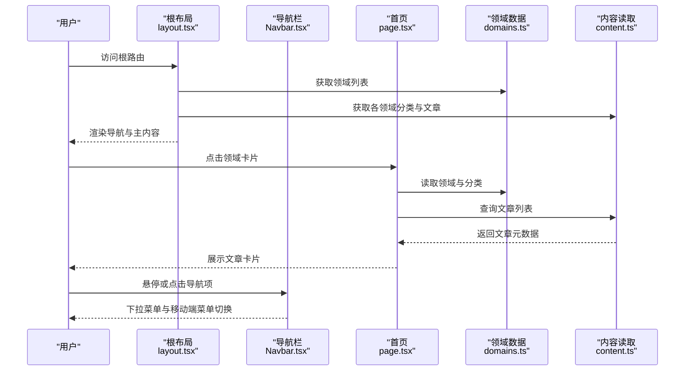
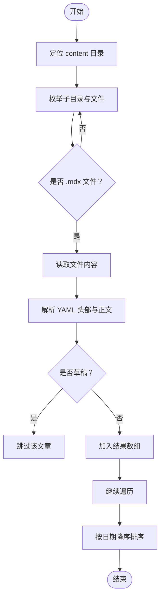
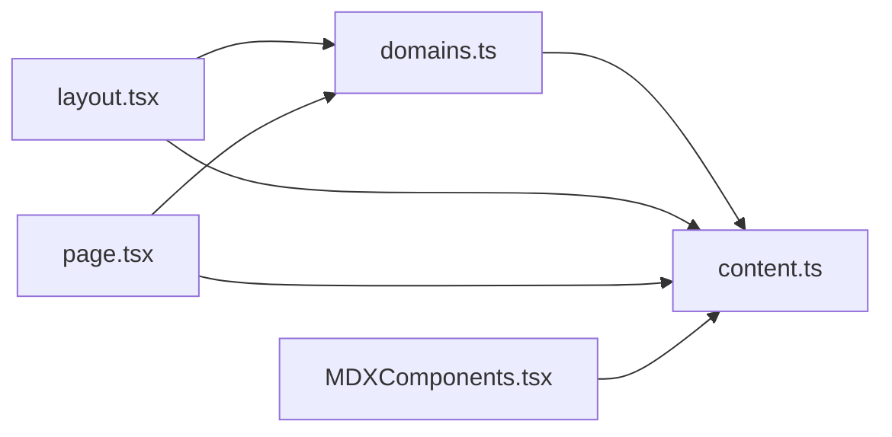

# 调试与测试

<cite>
**本文引用的文件**
- [package.json](file://package.json)
- [next.config.ts](file://next.config.ts)
- [tsconfig.json](file://tsconfig.json)
- [eslint.config.mjs](file://eslint.config.mjs)
- [src/lib/content.ts](file://src/lib/content.ts)
- [src/lib/domains.ts](file://src/lib/domains.ts)
- [src/components/article/MDXComponents.tsx](file://src/components/article/MDXComponents.tsx)
- [src/app/layout.tsx](file://src/app/layout.tsx)
- [src/app/page.tsx](file://src/app/page.tsx)
- [src/components/layout/Navbar.tsx](file://src/components/layout/Navbar.tsx)
- [src/components/layout/Footer.tsx](file://src/components/layout/Footer.tsx)
- [src/types/index.ts](file://src/types/index.ts)
</cite>

## 目录
1. [简介](#简介)
2. [项目结构](#项目结构)
3. [核心组件](#核心组件)
4. [架构总览](#架构总览)
5. [详细组件分析](#详细组件分析)
6. [依赖分析](#依赖分析)
7. [性能考虑](#性能考虑)
8. [故障排查指南](#故障排查指南)
9. [结论](#结论)
10. [附录](#附录)

## 简介
本指南面向 blog_new 项目的开发与维护，聚焦于开发调试与测试实践。内容涵盖：
- 开发环境调试：浏览器开发者工具、React DevTools、Next.js 调试特性
- 单元测试与集成测试：测试工具选型、Jest 配置建议、测试组织方式
- 内容渲染测试：MDX 内容解析与组件映射的验证策略
- 性能调试：React Profiler 使用、网络请求监控与构建产物分析
- 常见问题诊断与解决
- 测试覆盖率目标与持续集成配置建议

## 项目结构
blog_new 采用 Next.js App Router 结构，核心目录与职责如下：
- src/app：页面路由与布局（根布局、首页、错误与 404 页面）
- src/components：可复用 UI 组件（导航栏、侧边栏、文章 MDX 渲染组件等）
- src/lib：业务逻辑与数据访问（内容读取、领域与分类数据）
- src/types：TypeScript 类型定义
- 根目录配置：Next.js、TypeScript、ESLint、包管理脚本

图表来源
- [src/app/layout.tsx:38-60](file://src/app/layout.tsx#L38-L60)
- [src/app/page.tsx:1-92](file://src/app/page.tsx#L1-L92)
- [src/components/layout/Navbar.tsx:1-141](file://src/components/layout/Navbar.tsx#L1-L141)
- [src/components/layout/Footer.tsx:1-21](file://src/components/layout/Footer.tsx#L1-L21)
- [src/components/article/MDXComponents.tsx:1-70](file://src/components/article/MDXComponents.tsx#L1-L70)
- [src/lib/domains.ts:1-136](file://src/lib/domains.ts#L1-L136)
- [src/lib/content.ts:1-158](file://src/lib/content.ts#L1-L158)
- [src/types/index.ts:1-45](file://src/types/index.ts#L1-L45)
- [package.json:1-36](file://package.json#L1-L36)
- [tsconfig.json:1-35](file://tsconfig.json#L1-L35)
- [eslint.config.mjs:1-19](file://eslint.config.mjs#L1-L19)
- [next.config.ts:1-8](file://next.config.ts#L1-L8)

章节来源
- [package.json:1-36](file://package.json#L1-L36)
- [tsconfig.json:1-35](file://tsconfig.json#L1-L35)
- [eslint.config.mjs:1-19](file://eslint.config.mjs#L1-L19)
- [next.config.ts:1-8](file://next.config.ts#L1-L8)

## 核心组件
- 内容读取与解析：负责从 content 目录读取 MDX 文件、解析 YAML 头部元数据、缓存与排序、生成侧边栏数据与文章列表。
- 领域与分类数据：集中定义领域与分类结构，提供查询接口。
- MDX 组件映射：统一定义标题、链接、块引用、代码块、列表、表格等元素的渲染样式与行为。
- 根布局与页面：根布局聚合导航与页脚，并在服务端拉取领域与分类数据；首页展示领域卡片与技术栈标签。

章节来源
- [src/lib/content.ts:1-158](file://src/lib/content.ts#L1-L158)
- [src/lib/domains.ts:1-136](file://src/lib/domains.ts#L1-L136)
- [src/components/article/MDXComponents.tsx:1-70](file://src/components/article/MDXComponents.tsx#L1-L70)
- [src/app/layout.tsx:38-60](file://src/app/layout.tsx#L38-L60)
- [src/app/page.tsx:1-92](file://src/app/page.tsx#L1-L92)

## 架构总览
下图展示了页面渲染到内容加载的关键路径，以及 MDX 渲染与导航交互的协作关系。

图表来源
- [src/app/layout.tsx:38-60](file://src/app/layout.tsx#L38-L60)
- [src/app/page.tsx:1-92](file://src/app/page.tsx#L1-L92)
- [src/components/layout/Navbar.tsx:1-141](file://src/components/layout/Navbar.tsx#L1-L141)
- [src/lib/domains.ts:1-136](file://src/lib/domains.ts#L1-L136)
- [src/lib/content.ts:1-158](file://src/lib/content.ts#L1-L158)

## 详细组件分析

### 内容读取与解析（content.ts）
- 关键点
  - 使用文件系统遍历 content 目录，读取 .mdx 文件并解析头部元数据
  - 提供按领域、按分类、按文章 slug 的查询接口，并对结果进行时间倒序排序
  - 使用 React 缓存装饰器对 IO 密集型函数进行缓存，减少重复读取
  - 生成侧边栏数据，聚合每个分类的文章列表
- 调试要点
  - 在开发模式下，可通过浏览器断点观察文件读取与解析流程
  - 利用 React DevTools 检查缓存命中情况与组件重渲染
  - 对异常路径（不存在的 slug、缺失头部字段）进行边界测试

图表来源
- [src/lib/content.ts:15-78](file://src/lib/content.ts#L15-L78)

章节来源
- [src/lib/content.ts:1-158](file://src/lib/content.ts#L1-L158)

### 领域与分类数据（domains.ts）
- 关键点
  - 定义领域与分类的静态结构，提供查询函数
  - 作为导航与内容查询的输入数据源
- 调试要点
  - 在导航组件中检查传入的领域与分类数据是否完整
  - 对 slug 不一致或缺失的场景进行断言测试

章节来源
- [src/lib/domains.ts:1-136](file://src/lib/domains.ts#L1-L136)

### MDX 组件映射（MDXComponents.tsx）
- 关键点
  - 统一标题、链接、块引用、代码块、列表、表格等元素的渲染样式
  - 链接自动区分外链与站内链接并设置安全属性
- 调试要点
  - 在浏览器中检查渲染后的 HTML 结构与样式类名
  - 使用 React DevTools 检查自定义组件的 props 传递与渲染次数

章节来源
- [src/components/article/MDXComponents.tsx:1-70](file://src/components/article/MDXComponents.tsx#L1-L70)

### 根布局与页面（layout.tsx、page.tsx）
- 关键点
  - 根布局在服务端异步获取领域与分类数据，注入到导航组件
  - 首页展示领域卡片与技术栈标签，点击进入对应领域页面
- 调试要点
  - 在浏览器网络面板观察服务端数据拉取与首屏渲染
  - 使用 React Profiler 分析根布局与导航组件的渲染性能

章节来源
- [src/app/layout.tsx:38-60](file://src/app/layout.tsx#L38-L60)
- [src/app/page.tsx:1-92](file://src/app/page.tsx#L1-L92)

### 导航栏（Navbar.tsx）
- 关键点
  - 支持桌面端下拉菜单与移动端抽屉式菜单
  - 使用状态管理控制菜单开关与悬停下拉
- 调试要点
  - 在移动端设备模拟器中验证菜单行为
  - 使用 React DevTools 检查状态更新与事件绑定

章节来源
- [src/components/layout/Navbar.tsx:1-141](file://src/components/layout/Navbar.tsx#L1-L141)

### 页脚（Footer.tsx）
- 关键点
  - 简洁的版权信息与回到首页链接
- 调试要点
  - 在不同屏幕尺寸下检查布局与可访问性

章节来源
- [src/components/layout/Footer.tsx:1-21](file://src/components/layout/Footer.tsx#L1-L21)

## 依赖分析
- 运行时依赖
  - Next.js、React、MDX 渲染相关库（next-mdx-remote、rehype-*、remark-gfm、shiki 等）
  - UI 图标库 lucide-react
- 开发依赖
  - TypeScript、ESLint（Next 推荐规则）、TailwindCSS
- 关键耦合
  - content.ts 依赖 domains.ts 与文件系统
  - layout.tsx 依赖 domains.ts 与 content.ts
  - page.tsx 依赖 domains.ts 与 content.ts
  - MDXComponents.tsx 依赖 content.ts 的渲染结果

图表来源
- [src/lib/domains.ts:1-136](file://src/lib/domains.ts#L1-L136)
- [src/lib/content.ts:1-158](file://src/lib/content.ts#L1-L158)
- [src/app/layout.tsx:38-60](file://src/app/layout.tsx#L38-L60)
- [src/app/page.tsx:1-92](file://src/app/page.tsx#L1-L92)
- [src/components/article/MDXComponents.tsx:1-70](file://src/components/article/MDXComponents.tsx#L1-L70)

章节来源
- [package.json:11-34](file://package.json#L11-L34)

## 性能考虑
- React Profiler
  - 在本地开发中启用 React DevTools 的 Profiler，录制根布局与导航组件的渲染，识别不必要的重渲染与长任务
  - 关注 content.ts 中缓存装饰器的使用，避免在渲染过程中触发额外 IO
- 网络请求监控
  - 使用浏览器网络面板观察服务端数据拉取与静态资源加载
  - 对首屏渲染时间敏感的页面，优先确保关键数据在服务端获取
- 构建与运行时优化
  - 使用 Next.js 的内置优化（图片、字体、代码分割），结合 TailwindCSS 的按需生成
  - 在 tsconfig.json 中启用严格模式与增量编译，提升开发体验

[本节为通用指导，不直接分析具体文件]

## 故障排查指南
- MDX 内容未显示或样式异常
  - 检查 MDX 头部字段（标题、日期、摘要、标签、分类、领域）是否齐全
  - 确认 MDXComponents.tsx 是否覆盖了所需元素
  - 参考：[src/components/article/MDXComponents.tsx:1-70](file://src/components/article/MDXComponents.tsx#L1-L70)
- 文章列表为空或排序异常
  - 检查 content.ts 的读取与解析逻辑，确认 .mdx 文件存在且头部无 draft 标记
  - 参考：[src/lib/content.ts:15-78](file://src/lib/content.ts#L15-L78)
- 导航菜单不显示或下拉失效
  - 检查 domains.ts 的领域与分类数据是否正确返回
  - 参考：[src/lib/domains.ts:1-136](file://src/lib/domains.ts#L1-L136)
  - 检查 layout.tsx 是否正确调用 getDomainWithCategories 并传入 Navbar
  - 参考：[src/app/layout.tsx:38-60](file://src/app/layout.tsx#L38-L60)
- 链接打开新窗口或安全属性缺失
  - 确认 MDXComponents.tsx 中对外链的判断与 rel 属性设置
  - 参考：[src/components/article/MDXComponents.tsx:20-29](file://src/components/article/MDXComponents.tsx#L20-L29)
- TypeScript 或 ESLint 报错
  - 检查 tsconfig.json 的严格模式与路径别名配置
  - 参考：[tsconfig.json:1-35](file://tsconfig.json#L1-L35)
  - 检查 eslint.config.mjs 的规则继承与忽略项
  - 参考：[eslint.config.mjs:1-19](file://eslint.config.mjs#L1-L19)

章节来源
- [src/components/article/MDXComponents.tsx:1-70](file://src/components/article/MDXComponents.tsx#L1-L70)
- [src/lib/content.ts:15-78](file://src/lib/content.ts#L15-L78)
- [src/lib/domains.ts:1-136](file://src/lib/domains.ts#L1-L136)
- [src/app/layout.tsx:38-60](file://src/app/layout.tsx#L38-L60)
- [tsconfig.json:1-35](file://tsconfig.json#L1-L35)
- [eslint.config.mjs:1-19](file://eslint.config.mjs#L1-L19)

## 结论
通过明确的调试与测试策略，可以有效提升 blog_new 的开发效率与稳定性。建议在开发阶段充分利用浏览器开发者工具、React DevTools 与 Next.js 调试能力；在测试层面建立以内容解析与渲染为核心的测试体系，并结合性能分析工具持续优化用户体验。

[本节为总结性内容，不直接分析具体文件]

## 附录

### 开发环境调试技巧
- 浏览器开发者工具
  - Elements：检查 MDX 渲染后的 DOM 结构与样式类名
  - Network：观察服务端数据拉取与静态资源加载
  - Performance/Profiler：录制渲染过程，识别长任务与重渲染
- React DevTools
  - 使用 Profiler 录制根布局与导航组件的渲染
  - 检查组件树与状态变化，定位不必要的重渲染
- Next.js 调试
  - 使用 next.config.ts 打开实验性功能或日志输出（当前配置为空）
  - 在开发脚本中添加调试参数，观察 SSR 与客户端行为差异

章节来源
- [next.config.ts:1-8](file://next.config.ts#L1-L8)
- [package.json:5-10](file://package.json#L5-L10)

### 单元测试与集成测试（建议方案）
- 测试工具选型
  - 测试运行器：Jest（与 Next.js 生态兼容）
  - 断言库：标准断言或 Jest 内置匹配器
  - 类型支持：@types/jest（已安装）
- Jest 配置建议
  - 执行器：默认 Node 执行器即可满足大多数组件与工具函数测试
  - 模块解析：保持与 tsconfig.json 的路径别名一致
  - 缓存与并发：开启 Jest 默认缓存与并行执行，提升速度
- 测试组织
  - 工具函数与纯函数：放置于 src/lib 下，编写单元测试验证输入输出
  - 组件测试：使用 React Testing Library 或 @testing-library/react，验证渲染与交互
  - 集成测试：围绕页面路由与数据流，验证从内容读取到渲染的完整链路
- 覆盖率目标
  - 建议：函数级覆盖率 ≥ 80%，行级覆盖率 ≥ 80%
  - 重点：content.ts 的解析与排序逻辑、domains.ts 的查询函数、MDXComponents.tsx 的渲染映射

章节来源
- [package.json:25-34](file://package.json#L25-L34)
- [tsconfig.json:21-23](file://tsconfig.json#L21-L23)

### 内容渲染测试（MDX）
- 测试策略
  - 解析测试：构造最小 MDX 片段，验证 gray-matter 解析头部字段
  - 渲染测试：使用 MDXComponents.tsx 将解析后的内容渲染为 React 元素，断言关键节点存在与属性正确
  - 边界测试：空内容、缺失字段、外链、代码块高亮等
- 数据来源
  - 使用 content.ts 的解析函数作为被测对象，确保与真实内容一致

章节来源
- [src/lib/content.ts:29-43](file://src/lib/content.ts#L29-L43)
- [src/components/article/MDXComponents.tsx:1-70](file://src/components/article/MDXComponents.tsx#L1-L70)

### 性能调试方法
- React Profiler
  - 录制根布局与导航组件的渲染，关注渲染耗时与批处理
- 网络请求监控
  - 观察服务端数据拉取与静态资源加载，识别慢请求与重复请求
- 构建产物分析
  - 使用 Next.js 分析报告（如分析构建体积与模块依赖）

章节来源
- [src/app/layout.tsx:38-60](file://src/app/layout.tsx#L38-L60)
- [src/components/layout/Navbar.tsx:1-141](file://src/components/layout/Navbar.tsx#L1-L141)

### 常见问题诊断清单
- MDX 头部缺失导致文章不显示
  - 检查 content.ts 的 parseArticleMeta 逻辑与过滤条件
- 导航菜单数据为空
  - 检查 domains.ts 的数据结构与 layout.tsx 的调用
- 链接安全属性缺失
  - 检查 MDXComponents.tsx 的链接处理逻辑
- TypeScript/ESLint 报错
  - 检查 tsconfig.json 与 eslint.config.mjs 的配置一致性

章节来源
- [src/lib/content.ts:29-43](file://src/lib/content.ts#L29-L43)
- [src/lib/domains.ts:1-136](file://src/lib/domains.ts#L1-L136)
- [src/components/article/MDXComponents.tsx:20-29](file://src/components/article/MDXComponents.tsx#L20-L29)
- [tsconfig.json:1-35](file://tsconfig.json#L1-L35)
- [eslint.config.mjs:1-19](file://eslint.config.mjs#L1-L19)

### 持续集成配置（建议）
- CI 阶段
  - 安装依赖与类型检查：npm ci && npx tsc --noEmit
  - 单元测试与覆盖率：jest --coverage
  - 代码风格检查：npx eslint .
  - 构建验证：npm run build
- 覆盖率阈值
  - 在 CI 中设置覆盖率阈值，失败则阻断合并
- 缓存策略
  - 缓存 node_modules 与 Next.js 构建缓存，提升流水线速度

章节来源
- [package.json:5-10](file://package.json#L5-L10)
- [tsconfig.json:1-35](file://tsconfig.json#L1-L35)
- [eslint.config.mjs:1-19](file://eslint.config.mjs#L1-L19)