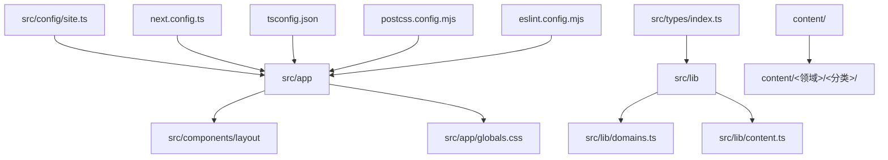
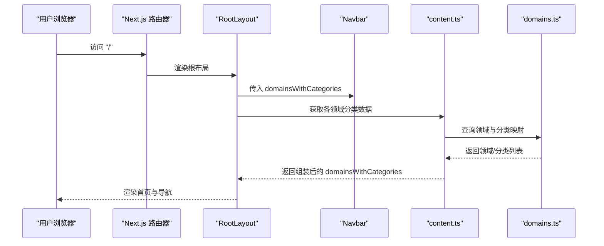
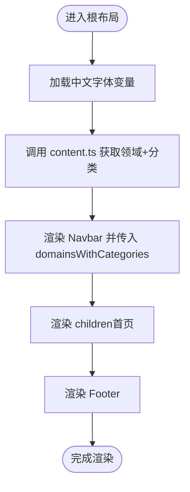
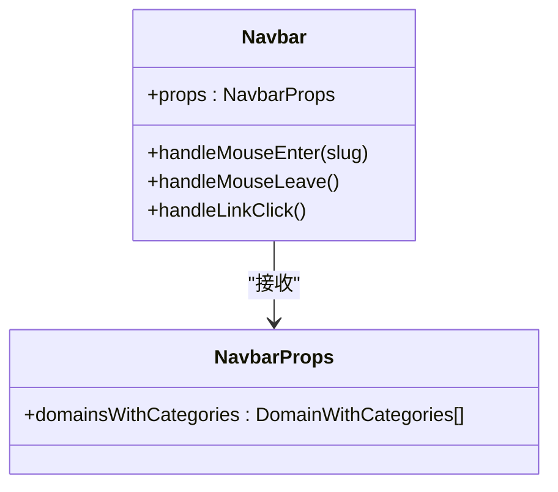
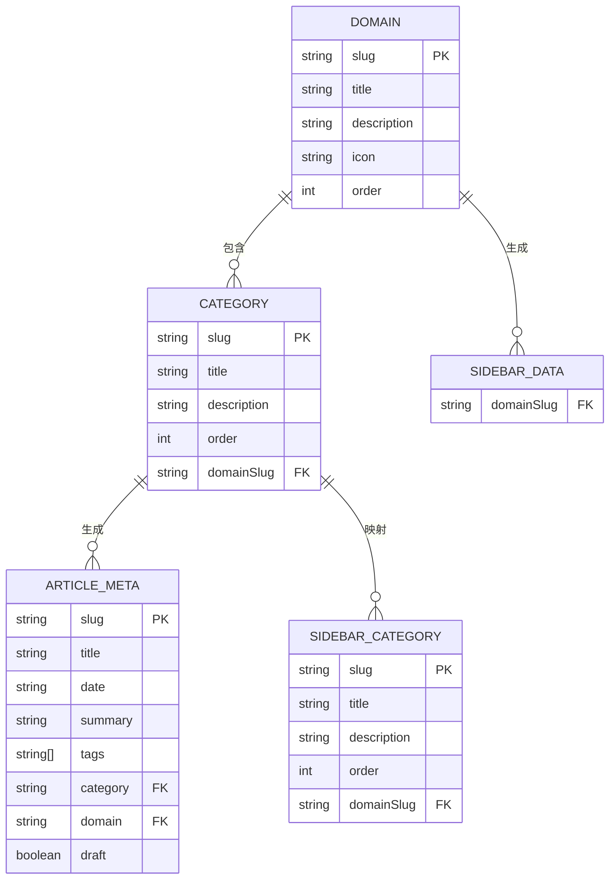
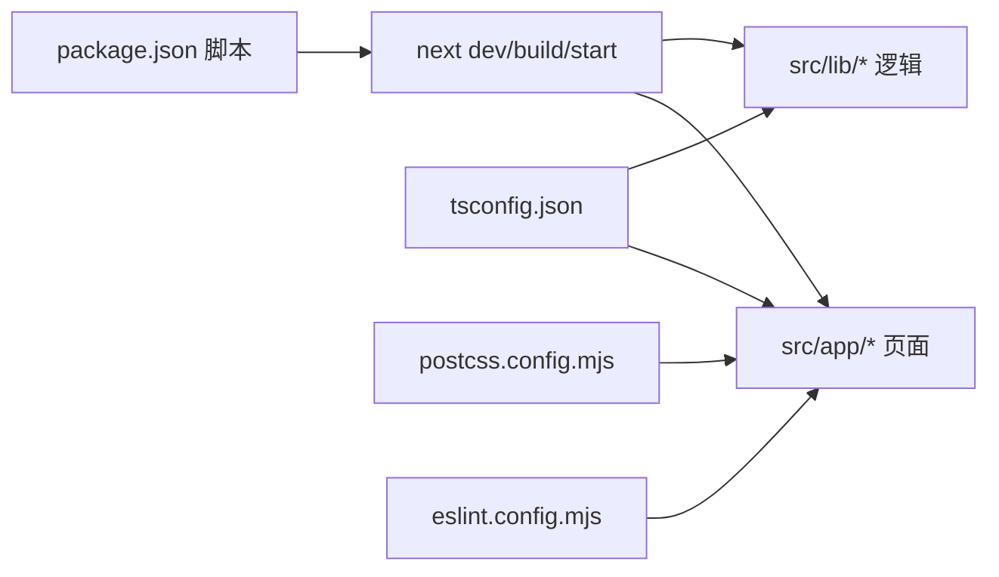

# 快速开始

<cite>
**本文引用的文件**
- [package.json](file://package.json)
- [README.md](file://README.md)
- [next.config.ts](file://next.config.ts)
- [tsconfig.json](file://tsconfig.json)
- [postcss.config.mjs](file://postcss.config.mjs)
- [eslint.config.mjs](file://eslint.config.mjs)
- [src/app/layout.tsx](file://src/app/layout.tsx)
- [src/app/page.tsx](file://src/app/page.tsx)
- [src/config/site.ts](file://src/config/site.ts)
- [src/lib/content.ts](file://src/lib/content.ts)
- [src/lib/domains.ts](file://src/lib/domains.ts)
- [src/types/index.ts](file://src/types/index.ts)
- [src/components/layout/Navbar.tsx](file://src/components/layout/Navbar.tsx)
- [content/software-dev-languages/java/spring-boot-intro.mdx](file://content/software-dev-languages/java/spring-boot-intro.mdx)
- [content/distributed-architecture/message-queue/kafka-core-concepts.mdx](file://content/distributed-architecture/message-queue/kafka-core-concepts.mdx)
</cite>

## 目录
1. [简介](#简介)
2. [项目结构](#项目结构)
3. [核心组件](#核心组件)
4. [架构总览](#架构总览)
5. [详细组件分析](#详细组件分析)
6. [依赖分析](#依赖分析)
7. [性能考虑](#性能考虑)
8. [故障排除指南](#故障排除指南)
9. [结论](#结论)
10. [附录](#附录)

## 简介
本指南面向首次接触 blog_new 项目的开发者，帮助你在最短时间内完成环境准备、项目克隆、依赖安装、开发服务器启动与本地访问，并提供常见开发命令与页面编辑指引。项目基于 Next.js App Router 构建，采用 TypeScript、TailwindCSS 与 MDX 文章内容组织方式，支持多技术领域的文章展示与导航。

## 项目结构
该项目为标准 Next.js App Router 结构，核心目录与职责如下：
- src/app：页面与布局入口，包含全局样式、根布局与首页等
- src/components：可复用 UI 组件，如导航栏、侧边栏、页脚等
- src/lib：内容读取与领域/分类映射逻辑
- src/config：站点配置信息
- src/types：类型定义
- content：MDX 文章内容按领域/分类组织
- 工具配置：next.config.ts、tsconfig.json、postcss.config.mjs、eslint.config.mjs

**图表来源**
- [src/app/layout.tsx:1-61](file://src/app/layout.tsx#L1-L61)
- [src/lib/domains.ts:1-136](file://src/lib/domains.ts#L1-L136)
- [src/lib/content.ts:1-158](file://src/lib/content.ts#L1-L158)
- [src/config/site.ts:1-20](file://src/config/site.ts#L1-L20)
- [next.config.ts:1-8](file://next.config.ts#L1-L8)
- [tsconfig.json:1-35](file://tsconfig.json#L1-L35)
- [postcss.config.mjs:1-8](file://postcss.config.mjs#L1-L8)
- [eslint.config.mjs:1-19](file://eslint.config.mjs#L1-L19)

**章节来源**
- [src/app/layout.tsx:1-61](file://src/app/layout.tsx#L1-L61)
- [src/lib/domains.ts:1-136](file://src/lib/domains.ts#L1-L136)
- [src/lib/content.ts:1-158](file://src/lib/content.ts#L1-L158)
- [src/config/site.ts:1-20](file://src/config/site.ts#L1-L20)
- [next.config.ts:1-8](file://next.config.ts#L1-L8)
- [tsconfig.json:1-35](file://tsconfig.json#L1-L35)
- [postcss.config.mjs:1-8](file://postcss.config.mjs#L1-L8)
- [eslint.config.mjs:1-19](file://eslint.config.mjs#L1-L19)

## 核心组件
- 站点配置：站点名称、标题、描述、作者、座右铭与技术栈列表
- 域与分类：定义四大技术领域及其子分类，用于导航与内容组织
- 内容读取：从 content 目录按领域/分类读取 MDX 文件，解析元数据并生成文章列表与侧边栏数据
- 根布局与首页：根布局负责字体加载、全局样式与导航栏/页脚装配；首页展示作者信息与各领域卡片

**章节来源**
- [src/config/site.ts:1-20](file://src/config/site.ts#L1-L20)
- [src/lib/domains.ts:1-136](file://src/lib/domains.ts#L1-L136)
- [src/lib/content.ts:1-158](file://src/lib/content.ts#L1-L158)
- [src/app/layout.tsx:1-61](file://src/app/layout.tsx#L1-L61)
- [src/app/page.tsx:1-92](file://src/app/page.tsx#L1-L92)

## 架构总览
下图展示了从请求到页面渲染的关键路径，以及内容读取与导航装配的协作关系：

**图表来源**
- [src/app/layout.tsx:38-60](file://src/app/layout.tsx#L38-L60)
- [src/lib/content.ts:49-56](file://src/lib/content.ts#L49-L56)
- [src/lib/domains.ts:129-135](file://src/lib/domains.ts#L129-L135)

## 详细组件分析

### 页面与布局
- 根布局负责设置站点元数据、加载中文字体、装配导航栏与页脚，并将子组件渲染在主体区域
- 首页展示作者信息、座右铭、技术栈标签与四大技术领域卡片，点击进入对应领域页面

**图表来源**
- [src/app/layout.tsx:30-60](file://src/app/layout.tsx#L30-L60)
- [src/app/page.tsx:20-92](file://src/app/page.tsx#L20-L92)

**章节来源**
- [src/app/layout.tsx:1-61](file://src/app/layout.tsx#L1-L61)
- [src/app/page.tsx:1-92](file://src/app/page.tsx#L1-L92)

### 导航栏组件
- 支持桌面端下拉菜单与移动端折叠菜单
- 通过路径匹配高亮当前领域，鼠标悬停显示对应分类列表
- 移动端点击后自动收起菜单

**图表来源**
- [src/components/layout/Navbar.tsx:9-34](file://src/components/layout/Navbar.tsx#L9-L34)

**章节来源**
- [src/components/layout/Navbar.tsx:1-141](file://src/components/layout/Navbar.tsx#L1-L141)

### 内容读取与数据模型
- 数据模型定义了领域、分类、文章元数据与侧边栏数据结构
- 内容读取模块负责扫描 content 目录、解析 MDX 元数据、按领域/分类聚合文章并排序
- 提供缓存以提升 SSR/SSG 场景下的性能

**图表来源**
- [src/types/index.ts:1-45](file://src/types/index.ts#L1-L45)
- [src/lib/domains.ts:3-32](file://src/lib/domains.ts#L3-L32)
- [src/lib/content.ts:49-146](file://src/lib/content.ts#L49-L146)

**章节来源**
- [src/types/index.ts:1-45](file://src/types/index.ts#L1-L45)
- [src/lib/domains.ts:1-136](file://src/lib/domains.ts#L1-L136)
- [src/lib/content.ts:1-158](file://src/lib/content.ts#L1-L158)

## 依赖分析
- 开发脚本：统一通过 Next.js CLI 启动开发服务器、构建与启动
- 运行时依赖：Next.js、React、MDX 处理、主题与排版工具等
- 开发依赖：TypeScript、TailwindCSS v4、ESLint Next 配置等
- 构建配置：Next 配置、TypeScript 路径别名、PostCSS 插件、ESLint 规则

**图表来源**
- [package.json:5-10](file://package.json#L5-L10)
- [next.config.ts:3-5](file://next.config.ts#L3-L5)
- [tsconfig.json:21-23](file://tsconfig.json#L21-L23)
- [postcss.config.mjs:1-8](file://postcss.config.mjs#L1-L8)
- [eslint.config.mjs:1-19](file://eslint.config.mjs#L1-L19)

**章节来源**
- [package.json:1-36](file://package.json#L1-L36)
- [next.config.ts:1-8](file://next.config.ts#L1-L8)
- [tsconfig.json:1-35](file://tsconfig.json#L1-L35)
- [postcss.config.mjs:1-8](file://postcss.config.mjs#L1-L8)
- [eslint.config.mjs:1-19](file://eslint.config.mjs#L1-L19)

## 性能考虑
- 使用 React 缓存函数对内容读取进行缓存，减少重复 IO 与解析开销
- 字体按需加载与变量类名，避免 FOIT/FOIC
- TailwindCSS v4 与 PostCSS 配置优化构建体积
- ESLint 仅检查必要文件，避免不必要的检查开销

[本节为通用建议，无需列出具体文件来源]

## 故障排除指南
- 端口占用（默认 3000）：若启动时报端口被占用，请修改开发服务器监听端口或释放占用进程
- 依赖安装失败：优先尝试更换包管理器；确保网络稳定；必要时清理缓存后重试
- MDX 内容未显示：确认文章文件位于正确领域/分类目录且包含合法 YAML front matter
- 类型错误：确保 TypeScript 配置与项目结构一致，必要时重启语言服务
- 样式异常：检查 TailwindCSS 配置与 PostCSS 插件是否正确加载

[本节为通用建议，无需列出具体文件来源]

## 结论
通过本指南，你已掌握 blog_new 项目的环境准备、启动与访问方法，了解了核心组件与数据流，并具备了基本的页面编辑与内容维护能力。建议在本地开发完成后，参考部署文档将应用上线至 Vercel 或其他平台。

[本节为总结性内容，无需列出具体文件来源]

## 附录

### 环境准备与安装步骤
- 确认 Node.js 版本满足项目需求（Next.js 16 需要较新的 LTS 版本）
- 选择包管理器：npm、yarn、pnpm 或 bun，任选其一即可
- 克隆仓库后安装依赖
- 启动开发服务器并访问本地地址

**章节来源**
- [README.md:3-17](file://README.md#L3-L17)
- [package.json:5-10](file://package.json#L5-L10)

### 常见开发命令
- 开发服务器：运行开发命令后访问本地地址
- 构建：生成生产构建产物
- 启动：使用生产构建启动服务
- 代码检查：运行 ESLint 检查

**章节来源**
- [package.json:5-10](file://package.json#L5-L10)
- [eslint.config.mjs:1-19](file://eslint.config.mjs#L1-L19)

### 浏览器访问与页面编辑
- 访问本地地址并观察首页展示的作者信息与技术领域卡片
- 修改首页文件以验证热更新生效
- 新增或编辑 content 目录下的 MDX 文件以添加文章内容

**章节来源**
- [README.md:17-19](file://README.md#L17-L19)
- [src/app/page.tsx:20-92](file://src/app/page.tsx#L20-L92)
- [src/lib/content.ts:13-27](file://src/lib/content.ts#L13-L27)

### 示例内容与结构
- 示例文章：可在相应领域/分类目录新增 MDX 文件，遵循 YAML front matter 规范
- 示例文章内容：参考现有示例文件的结构与语法

**章节来源**
- [content/software-dev-languages/java/spring-boot-intro.mdx:1-75](file://content/software-dev-languages/java/spring-boot-intro.mdx#L1-L75)
- [content/distributed-architecture/message-queue/kafka-core-concepts.mdx:1-62](file://content/distributed-architecture/message-queue/kafka-core-concepts.mdx#L1-L62)