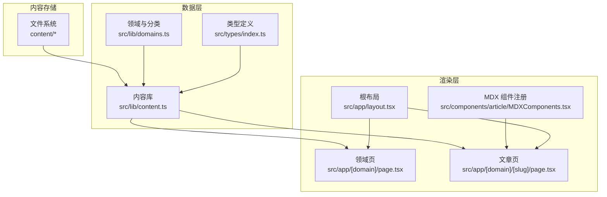
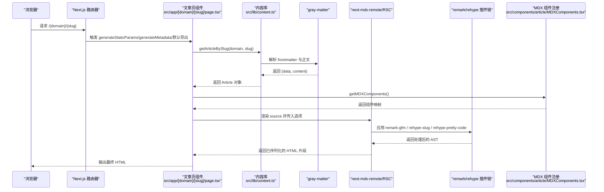
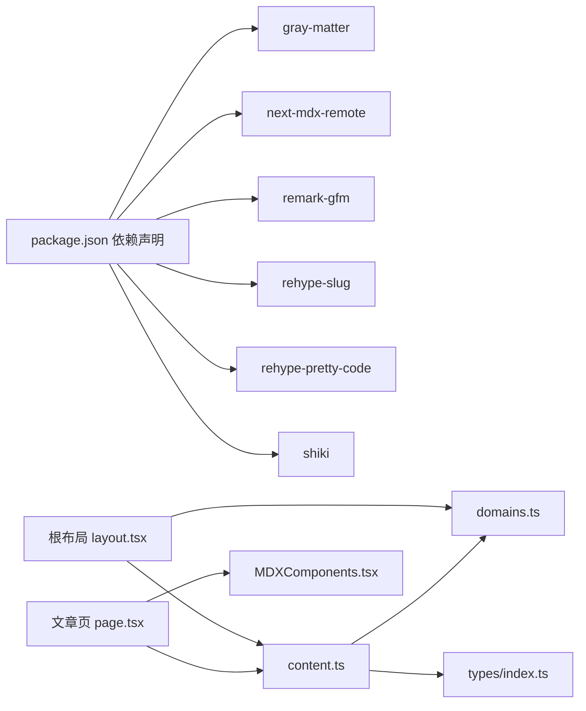

# 内容渲染架构

<cite>
**本文引用的文件列表**
- [content.ts](file://src/lib/content.ts)
- [MDXComponents.tsx](file://src/components/article/MDXComponents.tsx)
- [page.tsx（文章页）](file://src/app/[domain]/[slug]/page.tsx)
- [layout.tsx（根布局）](file://src/app/layout.tsx)
- [page.tsx（领域页）](file://src/app/[domain]/page.tsx)
- [page.tsx（首页）](file://src/app/page.tsx)
- [domains.ts](file://src/lib/domains.ts)
- [index.ts（类型定义）](file://src/types/index.ts)
- [next.config.ts](file://next.config.ts)
- [package.json](file://package.json)
- [spring-boot-intro.mdx](file://content/software-dev-languages/java/spring-boot-intro.mdx)
</cite>

## 目录
1. [简介](#简介)
2. [项目结构](#项目结构)
3. [核心组件](#核心组件)
4. [架构总览](#架构总览)
5. [详细组件分析](#详细组件分析)
6. [依赖关系分析](#依赖关系分析)
7. [性能考量](#性能考量)
8. [故障排查指南](#故障排查指南)
9. [结论](#结论)
10. [附录](#附录)

## 简介
本文件面向 blog_new 的内容渲染架构，系统性梳理从文件系统读取 MDX 内容，到 gray-matter 解析 frontmatter，再到 remark/rehype 处理链与 React Server Components（RSC）结合生成最终 HTML 的完整流程。重点覆盖以下方面：
- MDX 内容读取与解析：文件系统扫描、frontmatter 解析、草稿过滤、元数据标准化
- 处理链配置：remark-gfm、rehype-slug、rehype-pretty-code 等插件的作用与参数
- RSC 在内容渲染中的角色：数据获取与组件渲染的分离、静态预渲染与动态渲染
- MDX 组件注册系统：如何将自定义组件注入到 MDX 渲染过程
- 内容缓存策略：React Cache 的使用与性能优化
- 调试技巧与常见问题定位

## 项目结构
该站点采用 Next.js App Router 结构，内容以 MDX 文件形式存放于 content 目录下，按“领域/分类”组织。渲染层由 RSC 驱动，页面组件负责数据获取与内容渲染，MDX 内容通过 next-mdx-remote/RSC 在服务端进行转换与序列化。

图表来源
- [content.ts:13-158](file://src/lib/content.ts#L13-L158)
- [domains.ts:1-136](file://src/lib/domains.ts#L1-L136)
- [layout.tsx（根布局）:38-60](file://src/app/layout.tsx#L38-L60)
- [page.tsx（领域页）:25-89](file://src/app/[domain]/page.tsx#L25-L89)
- [page.tsx（文章页）:29-99](file://src/app/[domain]/[slug]/page.tsx#L29-L99)
- [MDXComponents.tsx:3-69](file://src/components/article/MDXComponents.tsx#L3-L69)

章节来源
- [content.ts:13-158](file://src/lib/content.ts#L13-L158)
- [domains.ts:1-136](file://src/lib/domains.ts#L1-L136)
- [layout.tsx（根布局）:38-60](file://src/app/layout.tsx#L38-L60)
- [page.tsx（领域页）:25-89](file://src/app/[domain]/page.tsx#L25-L89)
- [page.tsx（文章页）:29-99](file://src/app/[domain]/[slug]/page.tsx#L29-L99)
- [MDXComponents.tsx:3-69](file://src/components/article/MDXComponents.tsx#L3-L69)

## 核心组件
- 内容库（content.ts）
  - 负责扫描 content 目录、读取 MDX 文件、解析 gray-matter frontmatter、过滤草稿、标准化元数据、聚合文章列表与侧边栏数据，并通过 React Cache 实现缓存。
- 领域与分类（domains.ts）
  - 定义领域与分类的静态配置，提供查询接口。
- 类型定义（index.ts）
  - 统一声明 Domain、Category、ArticleMeta、Article、SidebarData 等数据模型。
- 文章页（page.tsx）
  - 使用 RSC 数据获取函数（generateStaticParams、generateMetadata、默认导出组件），调用内容库获取文章内容，通过 next-mdx-remote/RSC 执行 remark/rehype 插件链并渲染自定义组件。
- MDX 组件注册（MDXComponents.tsx）
  - 将自定义组件映射到 MDX 标签（如 h1、h2、a、blockquote、pre、ul、ol、table、th、td 等），统一样式与交互。
- 根布局（layout.tsx）
  - 注入全局字体、导航与页脚，预取各领域及其分类信息用于导航展示。

章节来源
- [content.ts:45-158](file://src/lib/content.ts#L45-L158)
- [domains.ts:3-136](file://src/lib/domains.ts#L3-L136)
- [index.ts（类型定义）:1-45](file://src/types/index.ts#L1-L45)
- [page.tsx（文章页）:10-99](file://src/app/[domain]/[slug]/page.tsx#L10-L99)
- [MDXComponents.tsx:3-69](file://src/components/article/MDXComponents.tsx#L3-L69)
- [layout.tsx（根布局）:38-60](file://src/app/layout.tsx#L38-L60)

## 架构总览
下面的时序图展示了从请求到 HTML 输出的完整流程，包括数据获取、MDX 转换与组件注册。

图表来源
- [page.tsx（文章页）:10-99](file://src/app/[domain]/[slug]/page.tsx#L10-L99)
- [content.ts:102-131](file://src/lib/content.ts#L102-L131)
- [MDXComponents.tsx:3-69](file://src/components/article/MDXComponents.tsx#L3-L69)
- [package.json:11-24](file://package.json#L11-L24)

章节来源
- [page.tsx（文章页）:10-99](file://src/app/[domain]/[slug]/page.tsx#L10-L99)
- [content.ts:102-131](file://src/lib/content.ts#L102-L131)
- [MDXComponents.tsx:3-69](file://src/components/article/MDXComponents.tsx#L3-L69)
- [package.json:11-24](file://package.json#L11-L24)

## 详细组件分析

### 内容库：文件系统读取与 gray-matter 解析
- 文件扫描
  - 递归遍历 content/{domain}/{category} 目录，筛选 .mdx 文件，提取 slug 与原始内容。
- frontmatter 解析
  - 使用 gray-matter 解析每个 MDX 文件，读取标题、日期、摘要、标签、分类、领域、草稿标记等字段；草稿为 true 的条目会被过滤掉。
- 元数据标准化
  - 将解析结果标准化为 ArticleMeta 或 Article 接口，确保后续渲染一致性。
- 缓存策略
  - 使用 React Cache 包裹所有异步数据获取函数，避免重复 IO 与解析，提升 SSR/SSG 性能。
- 关键函数路径
  - [readMdxFiles:15-27](file://src/lib/content.ts#L15-L27)
  - [parseArticleMeta:29-43](file://src/lib/content.ts#L29-L43)
  - [getArticlesByDomain:58-78](file://src/lib/content.ts#L58-L78)
  - [getArticlesByCategory:80-100](file://src/lib/content.ts#L80-L100)
  - [getArticleBySlug:102-131](file://src/lib/content.ts#L102-L131)
  - [getAllArticleSlugs:148-157](file://src/lib/content.ts#L148-L157)

章节来源
- [content.ts:15-158](file://src/lib/content.ts#L15-L158)
- [index.ts（类型定义）:17-31](file://src/types/index.ts#L17-L31)

### 领域与分类：静态配置与查询
- 静态配置
  - domains 定义四大领域及顺序；categoriesByDomain 映射各领域下的分类。
- 查询接口
  - getDomain、getCategories 提供快速查询能力，被内容库与布局使用。
- 关键函数路径
  - [domains:3-32](file://src/lib/domains.ts#L3-L32)
  - [categoriesByDomain:34-127](file://src/lib/domains.ts#L34-L127)
  - [getDomain:129-131](file://src/lib/domains.ts#L129-L131)
  - [getCategories:133-135](file://src/lib/domains.ts#L133-L135)

章节来源
- [domains.ts:1-136](file://src/lib/domains.ts#L1-L136)

### 文章页：RSC 数据获取与 MDX 渲染
- 静态参数生成
  - generateStaticParams 基于 getAllArticleSlugs 生成静态路由参数，支持静态预渲染。
- 动态元数据
  - generateMetadata 读取文章元数据生成 SEO 元信息。
- 内容获取与渲染
  - 默认导出组件中调用 getArticleBySlug 获取文章，然后通过 MDXRemote 执行 remark/rehype 插件链，并注入自定义组件映射。
- 关键函数路径
  - [generateStaticParams:10-13](file://src/app/[domain]/[slug]/page.tsx#L10-L13)
  - [generateMetadata:15-27](file://src/app/[domain]/[slug]/page.tsx#L15-L27)
  - [默认导出组件:29-99](file://src/app/[domain]/[slug]/page.tsx#L29-L99)
  - [MDXRemote 选项:77-95](file://src/app/[domain]/[slug]/page.tsx#L77-L95)

章节来源
- [page.tsx（文章页）:10-99](file://src/app/[domain]/[slug]/page.tsx#L10-L99)

### MDX 组件注册系统：自定义组件注入
- 组件映射
  - getMDXComponents 返回一个 MDXComponents 对象，将 h1/h2/h3/a/blockquote/pre/ul/ol/hr/table/th/td 等标签映射到带样式的 React 组件。
- 注入方式
  - 在文章页组件中调用 getMDXComponents 并作为 MDXRemote 的 components 参数传入，使 MDX 中的对应标签使用自定义组件渲染。
- 关键函数路径
  - [getMDXComponents:3-69](file://src/components/article/MDXComponents.tsx#L3-L69)

章节来源
- [MDXComponents.tsx:3-69](file://src/components/article/MDXComponents.tsx#L3-L69)
- [page.tsx（文章页）:77-95](file://src/app/[domain]/[slug]/page.tsx#L77-L95)

### remark/rehype 处理链：功能与配置
- remark-gfm
  - 支持 GitHub 风格的表格、任务列表、删除线等语法。
- rehype-slug
  - 为标题元素生成锚点 ID，便于链接跳转与自动目录生成。
- rehype-pretty-code
  - 为代码块提供高亮，使用 monokai 主题并保留背景色。
- 配置位置
  - 在文章页组件的 MDXRemote 选项中设置 mdxOptions.remarkPlugins 与 rehypePlugins。
- 关键路径
  - [remarkGfm](file://src/app/[domain]/[slug]/page.tsx#L4)
  - [rehypeSlug](file://src/app/[domain]/[slug]/page.tsx#L5)
  - [rehypePrettyCode](file://src/app/[domain]/[slug]/page.tsx#L6)
  - [MDXRemote 选项:80-94](file://src/app/[domain]/[slug]/page.tsx#L80-L94)

章节来源
- [page.tsx（文章页）:4-95](file://src/app/[domain]/[slug]/page.tsx#L4-L95)
- [package.json:11-24](file://package.json#L11-L24)

### 根布局与导航：预取领域与分类
- 预取策略
  - 在根布局中遍历 domains，调用 getDomainWithCategories 获取每个领域的分类信息，用于导航组件渲染。
- 字体与样式
  - 引入 Noto Serif SC、Noto Sans SC、JetBrains Mono 字体变量，统一排版风格。
- 关键路径
  - [根布局组件:38-60](file://src/app/layout.tsx#L38-L60)
  - [getDomainWithCategories:49-56](file://src/lib/content.ts#L49-L56)

章节来源
- [layout.tsx（根布局）:38-60](file://src/app/layout.tsx#L38-L60)
- [content.ts:49-56](file://src/lib/content.ts#L49-L56)

### 领域页与首页：数据驱动的列表渲染
- 领域页
  - 读取领域信息与分类列表，异步获取每个分类下的文章列表，渲染为卡片式列表。
- 首页
  - 展示作者信息、标语、技术栈标签与领域卡片入口。
- 关键路径
  - [领域页组件:25-89](file://src/app/[domain]/page.tsx#L25-L89)
  - [首页组件:20-92](file://src/app/page.tsx#L20-L92)

章节来源
- [page.tsx（领域页）:25-89](file://src/app/[domain]/page.tsx#L25-L89)
- [page.tsx（首页）:20-92](file://src/app/page.tsx#L20-L92)

## 依赖关系分析
- 外部依赖
  - gray-matter：解析 MDX frontmatter
  - next-mdx-remote：在 RSC 中安全地执行 MDX 转换
  - remark-gfm：增强 Markdown 语法支持
  - rehype-slug：生成标题锚点
  - rehype-pretty-code + shiki：代码高亮
- 内部依赖
  - content.ts 依赖 domains.ts 与 types.ts
  - 页面组件依赖 content.ts 与 MDXComponents.tsx
- 关系图

图表来源
- [package.json:11-24](file://package.json#L11-L24)
- [content.ts:1-12](file://src/lib/content.ts#L1-L12)
- [domains.ts:1-2](file://src/lib/domains.ts#L1-L2)
- [index.ts（类型定义）:1-7](file://src/types/index.ts#L1-L7)
- [page.tsx（文章页）:3-8](file://src/app/[domain]/[slug]/page.tsx#L3-L8)
- [MDXComponents.tsx](file://src/components/article/MDXComponents.tsx#L1)

章节来源
- [package.json:11-24](file://package.json#L11-L24)
- [content.ts:1-12](file://src/lib/content.ts#L1-L12)
- [domains.ts:1-2](file://src/lib/domains.ts#L1-L2)
- [index.ts（类型定义）:1-7](file://src/types/index.ts#L1-L7)
- [page.tsx（文章页）:3-8](file://src/app/[domain]/[slug]/page.tsx#L3-L8)
- [MDXComponents.tsx](file://src/components/article/MDXComponents.tsx#L1)

## 性能考量
- React Cache 的使用
  - 所有内容获取函数均包裹在 React Cache 中，避免重复 IO 与解析，显著降低 SSR/SSG 的冷启动成本。
  - 关键路径：[getAllDomains:45-47](file://src/lib/content.ts#L45-L47)、[getDomainWithCategories:49-56](file://src/lib/content.ts#L49-L56)、[getArticlesByDomain:58-78](file://src/lib/content.ts#L58-L78)、[getArticlesByCategory:80-100](file://src/lib/content.ts#L80-L100)、[getArticleBySlug:102-131](file://src/lib/content.ts#L102-L131)、[getSidebarData:133-146](file://src/lib/content.ts#L133-L146)、[getAllArticleSlugs:148-157](file://src/lib/content.ts#L148-L157)
- 静态预渲染
  - generateStaticParams 基于 getAllArticleSlugs 生成静态路由参数，配合 MDXRemote 的 RSC 渲染，可获得更快的首屏性能。
- 插件链优化
  - rehype-pretty-code 使用主题与背景保留策略，兼顾美观与性能；建议仅在必要时启用，避免过度转换。
- 文件系统访问
  - readMdxFiles 仅在需要时读取文件，且对不存在目录返回空数组，减少异常开销。

章节来源
- [content.ts:45-158](file://src/lib/content.ts#L45-L158)
- [page.tsx（文章页）:10-13](file://src/app/[domain]/[slug]/page.tsx#L10-L13)
- [page.tsx（文章页）:77-95](file://src/app/[domain]/[slug]/page.tsx#L77-L95)

## 故障排查指南
- frontmatter 字段缺失或类型不匹配
  - 症状：文章标题显示为 slug、日期异常、标签为空。
  - 处理：检查 MDX frontmatter 是否包含必需字段；content.ts 已提供默认值，但建议补齐以保证一致性。
  - 参考路径：[parseArticleMeta:29-43](file://src/lib/content.ts#L29-L43)
- 草稿文章未显示
  - 症状：草稿为 true 的文章在列表中消失。
  - 处理：确认草稿状态；草稿不会出现在公开列表中。
  - 参考路径：[parseArticleMeta:30-31](file://src/lib/content.ts#L30-L31)
- MDX 组件未生效
  - 症状：MDX 中的标题、链接、代码块等未按预期样式渲染。
  - 处理：确认 MDXRemote 的 components 参数是否正确传入；检查 getMDXComponents 的映射是否覆盖目标标签。
  - 参考路径：[getMDXComponents:3-69](file://src/components/article/MDXComponents.tsx#L3-L69)、[MDXRemote 选项:77-95](file://src/app/[domain]/[slug]/page.tsx#L77-L95)
- 插件链报错
  - 症状：构建或运行时报 remark/rehype 插件错误。
  - 处理：核对插件版本与配置；确保 remarkGfm、rehypeSlug、rehypePrettyCode 正确安装与导入。
  - 参考路径：[package.json 依赖:11-24](file://package.json#L11-L24)、[MDXRemote 选项:80-94](file://src/app/[domain]/[slug]/page.tsx#L80-L94)
- 路由参数不匹配
  - 症状：访问 /{domain}/{slug} 返回 404。
  - 处理：确认 generateStaticParams 返回的参数与实际内容一致；检查 getAllArticleSlugs 的输出。
  - 参考路径：[generateStaticParams:10-13](file://src/app/[domain]/[slug]/page.tsx#L10-L13)、[getAllArticleSlugs:148-157](file://src/lib/content.ts#L148-L157)

章节来源
- [content.ts:29-43](file://src/lib/content.ts#L29-L43)
- [content.ts:102-131](file://src/lib/content.ts#L102-L131)
- [MDXComponents.tsx:3-69](file://src/components/article/MDXComponents.tsx#L3-L69)
- [page.tsx（文章页）:77-95](file://src/app/[domain]/[slug]/page.tsx#L77-L95)
- [package.json:11-24](file://package.json#L11-L24)
- [page.tsx（文章页）:10-13](file://src/app/[domain]/[slug]/page.tsx#L10-L13)
- [content.ts:148-157](file://src/lib/content.ts#L148-L157)

## 结论
本架构以 React Server Components 为核心，结合 gray-matter、remark/rehype 插件链与 next-mdx-remote/RSC，实现了高性能、可扩展的内容渲染体系。通过 React Cache 与静态预渲染，显著提升了首屏性能与可预测性；通过 MDX 组件注册系统，实现了内容与样式的解耦与统一。整体设计清晰、模块职责明确，适合长期演进与维护。

## 附录
- 示例 MDX 文件结构参考
  - [spring-boot-intro.mdx:1-75](file://content/software-dev-languages/java/spring-boot-intro.mdx#L1-L75)
- 配置文件
  - [next.config.ts:1-8](file://next.config.ts#L1-L8)
  - [package.json:1-36](file://package.json#L1-L36)