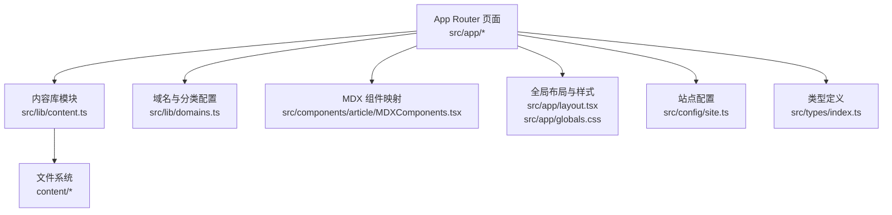
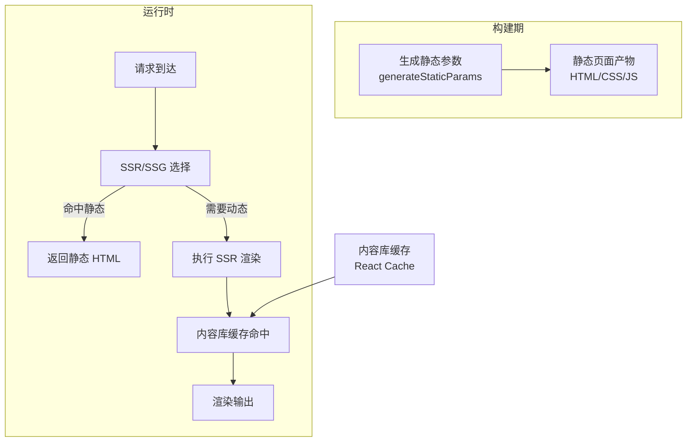
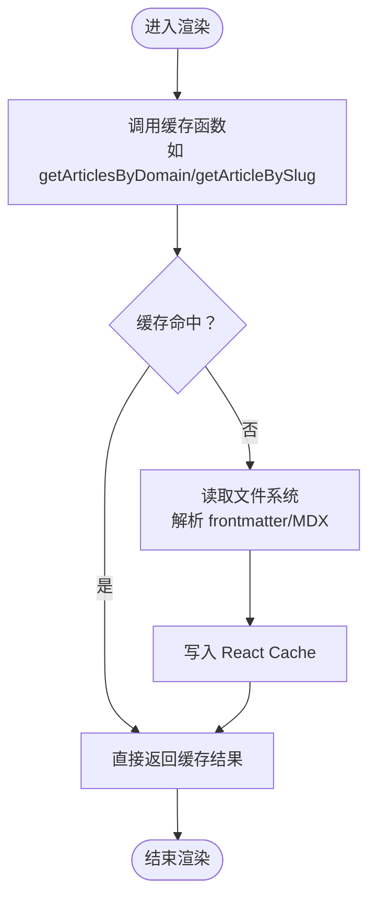
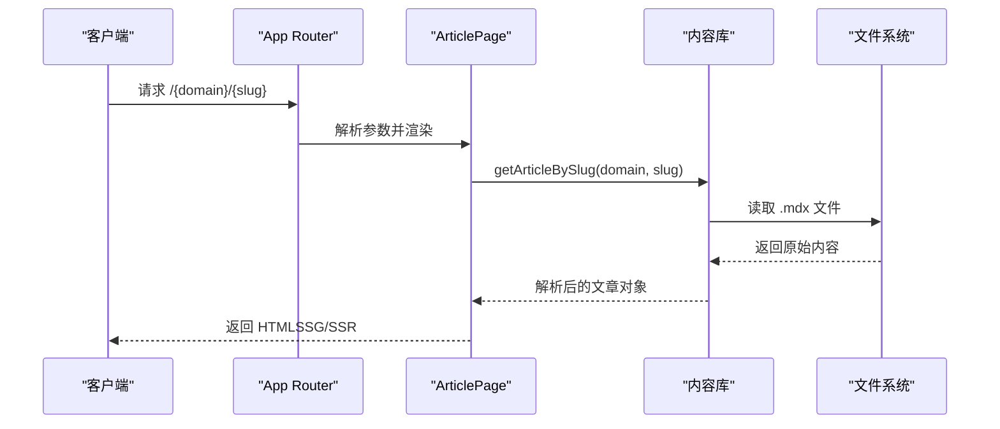
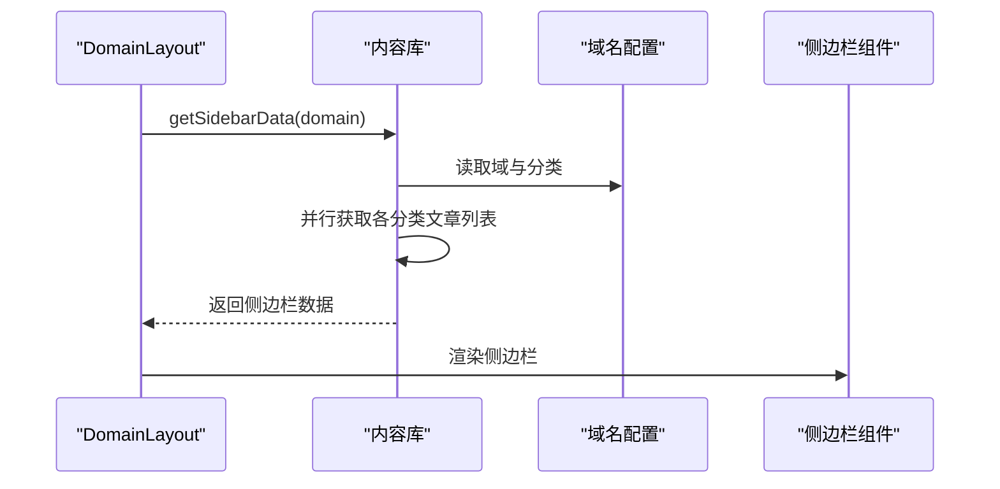
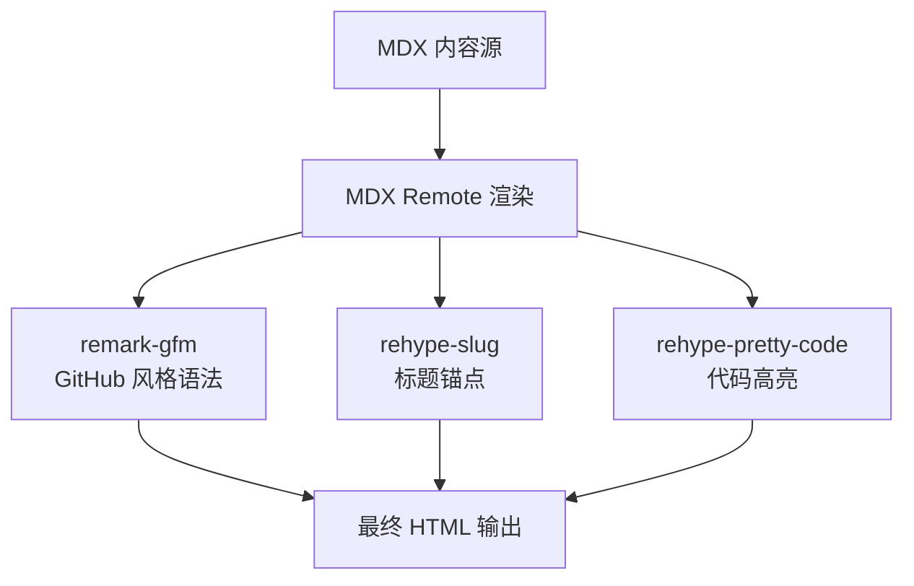
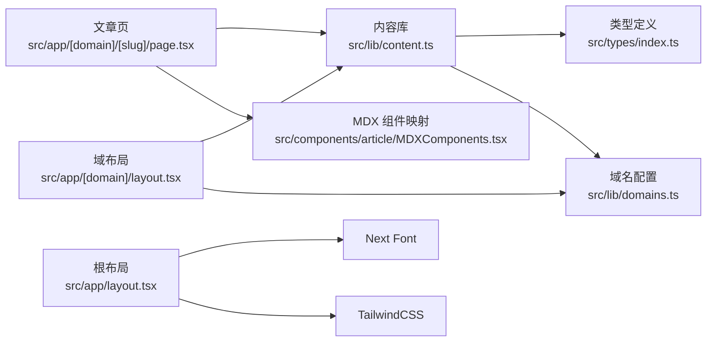

# 性能优化架构

<cite>
**本文引用的文件**
- [package.json](file://package.json)
- [next.config.ts](file://next.config.ts)
- [tsconfig.json](file://tsconfig.json)
- [postcss.config.mjs](file://postcss.config.mjs)
- [src/lib/content.ts](file://src/lib/content.ts)
- [src/lib/domains.ts](file://src/lib/domains.ts)
- [src/types/index.ts](file://src/types/index.ts)
- [src/app/[domain]/[slug]/page.tsx](file://src/app/[domain]/[slug]/page.tsx)
- [src/app/[domain]/layout.tsx](file://src/app/[domain]/layout.tsx)
- [src/app/layout.tsx](file://src/app/layout.tsx)
- [src/app/globals.css](file://src/app/globals.css)
- [src/app/page.tsx](file://src/app/page.tsx)
- [src/app/not-found.tsx](file://src/app/not-found.tsx)
- [src/components/article/MDXComponents.tsx](file://src/components/article/MDXComponents.tsx)
- [src/config/site.ts](file://src/config/site.ts)
</cite>

## 目录
1. [引言](#引言)
2. [项目结构](#项目结构)
3. [核心组件](#核心组件)
4. [架构总览](#架构总览)
5. [详细组件分析](#详细组件分析)
6. [依赖关系分析](#依赖关系分析)
7. [性能考量](#性能考量)
8. [故障排查指南](#故障排查指南)
9. [结论](#结论)
10. [附录](#附录)

## 引言
本技术文档聚焦 blog_new 的性能优化架构，系统性阐述静态生成（SSG）与服务器端渲染（SSR）的结合策略，解析 React Cache 在内容读取中的缓存与失效机制，梳理从文件系统到内存的多层内容缓存路径，并总结代码分割与懒加载的实现方式。同时给出性能监控与分析方法（Lighthouse 指标与 Web Vitals），并提供可落地的优化案例与最佳实践。

## 项目结构
该项目基于 Next.js 应用，采用 App Router 路由约定式结构，内容以 MDX 文档形式存储在 content 目录中，通过自定义内容库模块进行读取与解析。全局样式与字体通过 TailwindCSS 与 Next Font 管理，类型定义集中于 types 目录，组件按功能拆分至 components 子目录。

图表来源
- [src/app/[domain]/[slug]/page.tsx](file://src/app/[domain]/[slug]/page.tsx#L1-L100)
- [src/lib/content.ts:1-158](file://src/lib/content.ts#L1-L158)
- [src/lib/domains.ts:1-136](file://src/lib/domains.ts#L1-L136)
- [src/components/article/MDXComponents.tsx:1-70](file://src/components/article/MDXComponents.tsx#L1-L70)
- [src/app/layout.tsx:1-53](file://src/app/layout.tsx#L1-L53)
- [src/app/globals.css:1-99](file://src/app/globals.css#L1-L99)
- [src/config/site.ts:1-13](file://src/config/site.ts#L1-L13)
- [src/types/index.ts:1-45](file://src/types/index.ts#L1-L45)

章节来源
- [package.json:1-36](file://package.json#L1-L36)
- [next.config.ts:1-8](file://next.config.ts#L1-L8)
- [tsconfig.json:1-35](file://tsconfig.json#L1-L35)
- [postcss.config.mjs:1-8](file://postcss.config.mjs#L1-L8)

## 核心组件
- 内容读取与缓存：通过 React Cache 对多个异步内容查询函数进行缓存，避免重复 IO 与解析开销，提升 SSR/SSG 渲染效率。
- 域与分类：集中定义域与分类信息，供侧边栏与导航使用，减少重复计算。
- MDX 渲染：统一的 MDX 组件映射与插件配置，保证文章渲染一致性与性能。
- 全局布局与样式：通过 Next Font 与 TailwindCSS 提升首屏渲染与样式加载性能。
- 类型系统：严格的类型定义确保内容结构一致性，降低运行时错误与重排风险。

章节来源
- [src/lib/content.ts:1-158](file://src/lib/content.ts#L1-L158)
- [src/lib/domains.ts:1-136](file://src/lib/domains.ts#L1-L136)
- [src/components/article/MDXComponents.tsx:1-70](file://src/components/article/MDXComponents.tsx#L1-L70)
- [src/app/layout.tsx:1-53](file://src/app/layout.tsx#L1-L53)
- [src/app/globals.css:1-99](file://src/app/globals.css#L1-L99)
- [src/types/index.ts:1-45](file://src/types/index.ts#L1-L45)

## 架构总览
该博客采用“静态生成 + 服务器端渲染”的混合策略：
- 首页与通用页面：使用 SSG，构建期生成 HTML，降低运行时负载。
- 文章详情页：使用 SSG + 动态参数生成，提前静态化已知文章；同时保留 SSR 能力以应对未知或动态内容。
- 侧边栏与导航：在布局层通过 SSR 获取最新内容，确保导航与侧边栏实时更新。

图表来源
- [src/app/[domain]/[slug]/page.tsx](file://src/app/[domain]/[slug]/page.tsx#L10-L27)
- [src/app/[domain]/layout.tsx](file://src/app/[domain]/layout.tsx#L6-L8)
- [src/lib/content.ts:45-158](file://src/lib/content.ts#L45-L158)

## 详细组件分析

### 内容读取与 React Cache 使用
- 缓存策略
  - 使用 React Cache 包装所有异步内容读取函数，确保在同一渲染上下文中多次调用同一查询时共享结果，避免重复 IO 与解析。
  - 缓存键由函数入参决定，例如按域、分类、文章 slug 进行区分，确保不同请求间互不污染。
- 失效机制
  - React Cache 的失效与 React 渲染周期绑定：当渲染树重建或上下文切换时，缓存会自然失效并重新计算。
  - 对于需要强制刷新的场景，可在上层触发新的渲染（如路由变更、参数变化）以绕过旧缓存。
- 性能收益
  - 减少文件系统扫描与读取次数，降低 CPU 与 I/O 开销。
  - 在 SSR/SSG 中显著缩短渲染时间，提升并发处理能力。

图表来源
- [src/lib/content.ts:45-158](file://src/lib/content.ts#L45-L158)

章节来源
- [src/lib/content.ts:1-158](file://src/lib/content.ts#L1-L158)

### 文章详情页：静态生成与 SSR 结合
- 静态参数生成
  - 通过 generateStaticParams 预先收集所有文章 slug，构建期生成对应静态页面，降低线上请求压力。
- 动态元数据
  - generateMetadata 在构建期或运行时根据文章内容生成标题与描述，兼顾 SEO 与性能。
- SSR 回退
  - 若文章不存在，使用 notFound 触发 404，保障用户体验与搜索引擎友好性。

图表来源
- [src/app/[domain]/[slug]/page.tsx](file://src/app/[domain]/[slug]/page.tsx#L10-L99)
- [src/lib/content.ts:102-131](file://src/lib/content.ts#L102-L131)

章节来源
- [src/app/[domain]/[slug]/page.tsx](file://src/app/[domain]/[slug]/page.tsx#L1-L100)
- [src/lib/content.ts:102-131](file://src/lib/content.ts#L102-L131)

### 布局与侧边栏：SSR 与缓存协同
- 布局层通过 SSR 获取侧边栏数据，确保导航与分类列表实时更新。
- 侧边栏数据通过 getSidebarData 聚合域、分类与文章列表，内部复用其他缓存函数，减少重复计算。
- 域级静态参数生成，保证每个域的入口页面静态化，提升整体访问速度。

图表来源
- [src/app/[domain]/layout.tsx](file://src/app/[domain]/layout.tsx#L1-L30)
- [src/lib/content.ts:133-146](file://src/lib/content.ts#L133-L146)
- [src/lib/domains.ts:1-136](file://src/lib/domains.ts#L1-L136)

章节来源
- [src/app/[domain]/layout.tsx](file://src/app/[domain]/layout.tsx#L1-L30)
- [src/lib/content.ts:133-146](file://src/lib/content.ts#L133-L146)
- [src/lib/domains.ts:1-136](file://src/lib/domains.ts#L1-L136)

### MDX 渲染与代码高亮
- 组件映射：统一的 MDX 组件映射确保标题、链接、表格等元素的样式一致，减少运行时样式抖动。
- 插件链：启用 remark-gfm 与 rehype-slug/rehype-pretty-code，实现 GitHub 风格表格、标题锚点与代码高亮。
- 主题与背景：保持代码块背景一致性，提升可读性与渲染稳定性。

图表来源
- [src/app/[domain]/[slug]/page.tsx](file://src/app/[domain]/[slug]/page.tsx#L77-L95)
- [src/components/article/MDXComponents.tsx:1-70](file://src/components/article/MDXComponents.tsx#L1-L70)

章节来源
- [src/app/[domain]/[slug]/page.tsx](file://src/app/[domain]/[slug]/page.tsx#L1-L100)
- [src/components/article/MDXComponents.tsx:1-70](file://src/components/article/MDXComponents.tsx#L1-L70)

### 字体与样式：首屏性能优化
- Next Font：通过字体变量与字体显示策略（display: swap）避免阻塞渲染，提升首字节时间。
- TailwindCSS：按需生成样式，减少初始 CSS 体积；主题变量集中管理，便于维护与优化。
- 全局样式：颜色与排版变量集中定义，降低样式重算成本。

章节来源
- [src/app/layout.tsx:8-26](file://src/app/layout.tsx#L8-L26)
- [src/app/globals.css:1-99](file://src/app/globals.css#L1-L99)

## 依赖关系分析
- 内容读取依赖文件系统与 gray-matter 解析器，输出结构化文章元数据与正文。
- 布局依赖内容库与域名配置，形成导航与侧边栏数据流。
- MDX 渲染依赖插件生态，确保内容渲染的一致性与可维护性。
- 全局样式依赖 TailwindCSS 与 Next Font，影响首屏渲染与可读性。

图表来源
- [src/lib/content.ts:1-158](file://src/lib/content.ts#L1-L158)
- [src/lib/domains.ts:1-136](file://src/lib/domains.ts#L1-L136)
- [src/types/index.ts:1-45](file://src/types/index.ts#L1-L45)
- [src/app/[domain]/[slug]/page.tsx](file://src/app/[domain]/[slug]/page.tsx#L1-L100)
- [src/app/[domain]/layout.tsx](file://src/app/[domain]/layout.tsx#L1-L30)
- [src/app/layout.tsx:1-53](file://src/app/layout.tsx#L1-L53)

章节来源
- [src/lib/content.ts:1-158](file://src/lib/content.ts#L1-L158)
- [src/lib/domains.ts:1-136](file://src/lib/domains.ts#L1-L136)
- [src/types/index.ts:1-45](file://src/types/index.ts#L1-L45)
- [src/app/[domain]/[slug]/page.tsx](file://src/app/[domain]/[slug]/page.tsx#L1-L100)
- [src/app/[domain]/layout.tsx](file://src/app/[domain]/layout.tsx#L1-L30)
- [src/app/layout.tsx:1-53](file://src/app/layout.tsx#L1-L53)

## 性能考量
- 静态生成与 SSR 的选择
  - 已知且稳定的页面（如文章详情）优先使用 SSG，构建期生成 HTML，显著降低运行时开销。
  - 需要实时数据的页面（如侧边栏）使用 SSR，确保内容新鲜度。
- React Cache 的使用
  - 将 IO 密集型操作（文件读取、frontmatter 解析）包裹在 React Cache 中，避免重复计算。
  - 对于需要刷新的场景，通过路由参数变化或重新渲染触发缓存失效。
- 内容缓存的多层实现
  - 文件系统缓存：通过 React Cache 缓存解析结果，减少磁盘访问。
  - 内存缓存：利用 React 渲染上下文的缓存生命周期，避免跨请求共享导致的数据污染。
- 代码分割与懒加载
  - 路由级代码分割：Next.js 默认按路由进行代码分割，确保只加载当前页面所需资源。
  - 组件级懒加载：对非首屏组件（如侧边栏、导航）可进一步使用动态导入以减少初始包体积。
- 字体与样式优化
  - 使用 Next Font 的字体交换策略，避免 FOIT/FOUT。
  - TailwindCSS 按需生成，配合 CSS 压缩与分块，降低首屏 CSS 体积。
- 性能监控与分析
  - Lighthouse：定期运行本地或 CI 中的 Lighthouse 分析，关注首次内容绘制（FCP）、最大内容绘制（LCP）、首次输入延迟（FID）、累积布局偏移（CLS）等指标。
  - Web Vitals：在生产环境集成 Web Vitals 收集，持续监控真实用户性能。
  - 构建分析：利用 Next.js 的构建报告与包大小分析工具，识别大体积依赖与重复打包。

## 故障排查指南
- 404 页面
  - 当文章不存在时，使用 notFound 触发 404，确保搜索引擎与用户体验一致。
- 内容未更新
  - 检查 React Cache 是否因渲染上下文未变化而未失效；可通过路由参数变化或触发重新渲染来强制刷新。
- 字体加载异常
  - 确认 Next Font 的 display 策略与变量注入是否正确；检查网络面板中的字体请求状态。
- MDX 渲染异常
  - 检查 MDX 插件链顺序与配置，确保 rehype-slug 在 rehype-pretty-code 之前执行，避免锚点冲突。
- 样式不生效
  - 确认 TailwindCSS 配置与 PostCSS 插件是否正确加载；检查全局样式是否被覆盖。

章节来源
- [src/app/not-found.tsx:1-19](file://src/app/not-found.tsx#L1-L19)
- [src/app/[domain]/[slug]/page.tsx](file://src/app/[domain]/[slug]/page.tsx#L36-L36)
- [src/app/layout.tsx:8-26](file://src/app/layout.tsx#L8-L26)
- [src/app/[domain]/[slug]/page.tsx](file://src/app/[domain]/[slug]/page.tsx#L80-L95)
- [postcss.config.mjs:1-8](file://postcss.config.mjs#L1-L8)

## 结论
本项目通过“静态生成 + 服务器端渲染”的混合策略，结合 React Cache 的内容缓存与多层 I/O 优化，实现了高性能的内容展示。配合路由级代码分割、字体与样式的首屏优化，以及完善的性能监控体系，能够稳定支撑博客的日常访问与 SEO 需求。建议持续关注 Lighthouse 与 Web Vitals 指标，结合业务增长迭代缓存策略与构建优化。

## 附录
- 最佳实践清单
  - 将稳定内容使用 SSG 预渲染，动态内容使用 SSR。
  - 在内容库中广泛使用 React Cache，避免重复 IO 与解析。
  - 保持 MDX 插件链简洁与顺序正确，减少渲染开销。
  - 使用 Next Font 的字体交换策略，优化首屏渲染。
  - 定期运行 Lighthouse 与 Web Vitals 监控，持续改进性能。
- 可落地的优化案例
  - 案例一：为侧边栏数据增加缓存失效策略，结合路由参数变化触发刷新。
  - 案例二：对非首屏组件进行动态导入，减少初始包体积。
  - 案例三：引入构建分析工具，定位大体积依赖并进行拆分或替换。