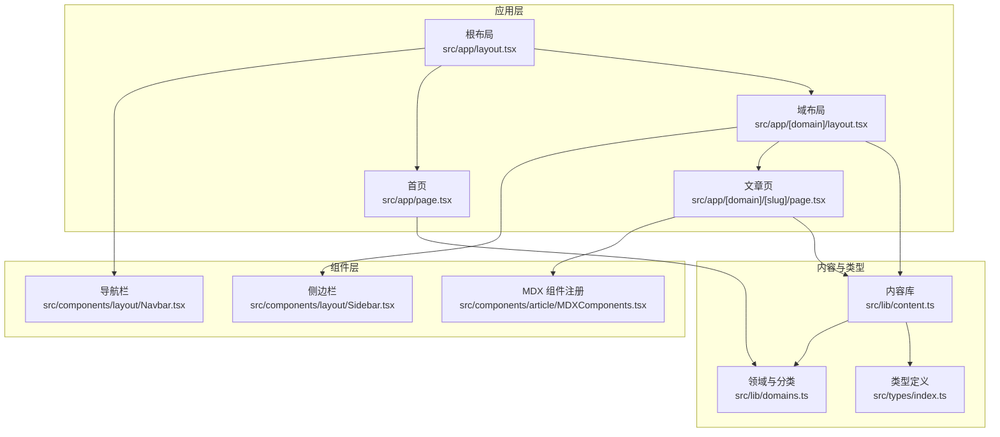
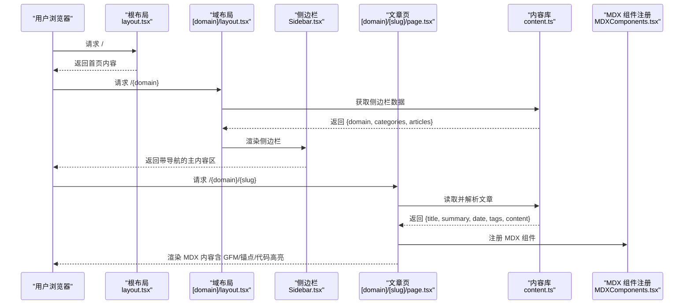
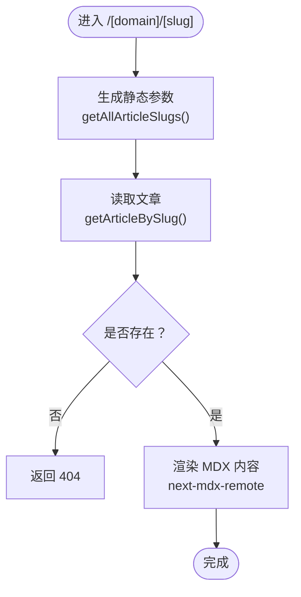
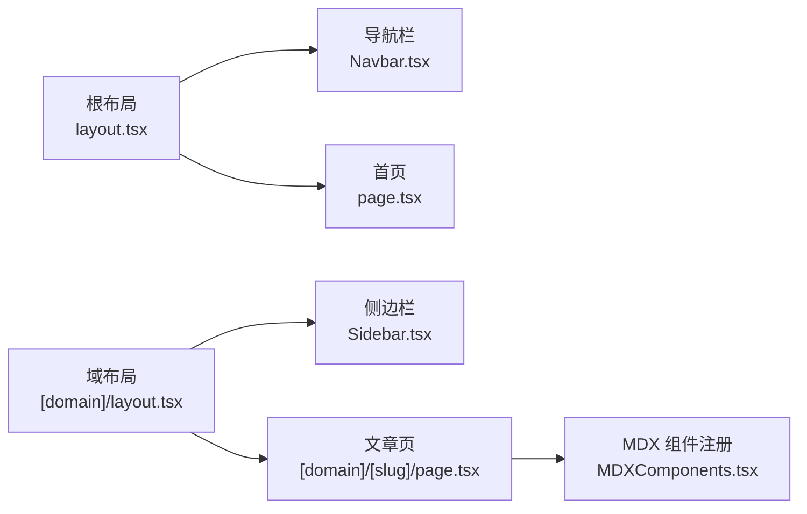
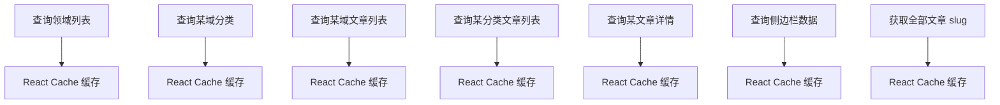
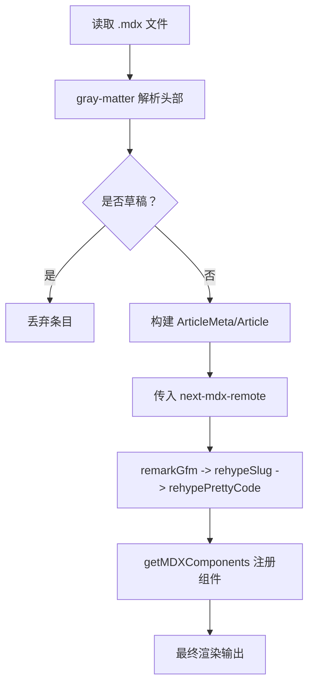
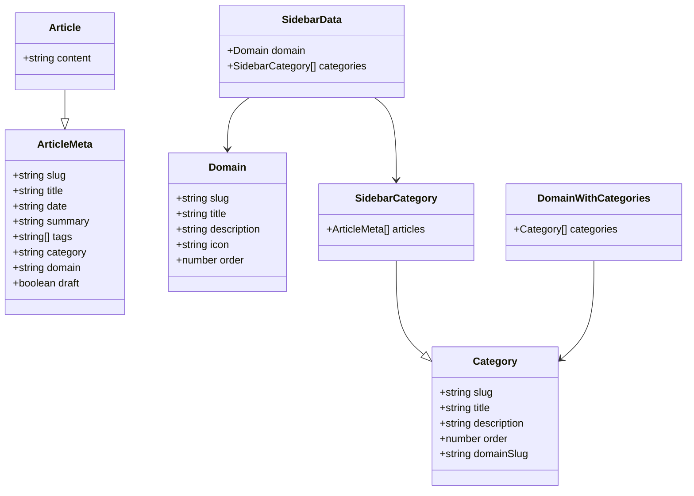
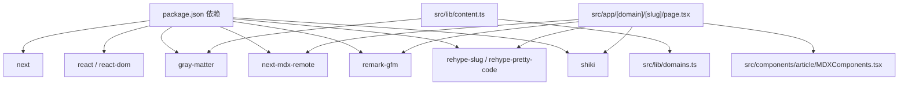

# 技术架构

<cite>
**本文引用的文件**
- [README.md](file://README.md)
- [next.config.ts](file://next.config.ts)
- [package.json](file://package.json)
- [tsconfig.json](file://tsconfig.json)
- [src/app/layout.tsx](file://src/app/layout.tsx)
- [src/app/page.tsx](file://src/app/page.tsx)
- [src/app/[domain]/layout.tsx](file://src/app/[domain]/layout.tsx)
- [src/app/[domain]/[slug]/page.tsx](file://src/app/[domain]/[slug]/page.tsx)
- [src/lib/content.ts](file://src/lib/content.ts)
- [src/lib/domains.ts](file://src/lib/domains.ts)
- [src/types/index.ts](file://src/types/index.ts)
- [src/components/article/MDXComponents.tsx](file://src/components/article/MDXComponents.tsx)
- [src/components/layout/Navbar.tsx](file://src/components/layout/Navbar.tsx)
- [src/components/layout/Sidebar.tsx](file://src/components/layout/Sidebar.tsx)
</cite>

## 目录
1. [引言](#引言)
2. [项目结构](#项目结构)
3. [核心组件](#核心组件)
4. [架构总览](#架构总览)
5. [详细组件分析](#详细组件分析)
6. [依赖关系分析](#依赖关系分析)
7. [性能考量](#性能考量)
8. [故障排查指南](#故障排查指南)
9. [结论](#结论)
10. [附录](#附录)

## 引言
本项目采用 Next.js App Router 架构，围绕“领域-分类-文章”的内容组织方式构建静态生成与服务端渲染相结合的博客站点。内容以 MDX 文档形式存储在 content 目录中，通过灰度解析（gray-matter）提取元数据，再经由 remark/rehype 处理链进行 Markdown/GFM 转换与代码高亮等增强处理，并通过 next-mdx-remote 在 RSC 环境中安全地渲染到页面。React Server Components 与客户端组件按职责分离：根布局与页面使用异步渲染，导航与侧边栏使用客户端交互组件。TypeScript 提供全栈类型约束，确保跨层调用的安全性与可维护性。

## 项目结构
- 应用入口与路由
  - 根布局与全局样式：src/app/layout.tsx
  - 首页：src/app/page.tsx
  - 动态域布局：src/app/[domain]/layout.tsx
  - 文章详情页：src/app/[domain]/[slug]/page.tsx
- 内容与类型
  - 内容读取与解析：src/lib/content.ts
  - 领域与分类配置：src/lib/domains.ts
  - 类型定义：src/types/index.ts
- 组件
  - 布局组件：src/components/layout/Navbar.tsx、src/components/layout/Sidebar.tsx
  - MDX 渲染组件注册：src/components/article/MDXComponents.tsx
- 工程配置
  - Next.js 配置：next.config.ts
  - 包管理与依赖：package.json
  - TypeScript 配置：tsconfig.json

图表来源
- [src/app/layout.tsx:38-60](file://src/app/layout.tsx#L38-L60)
- [src/app/page.tsx:20-92](file://src/app/page.tsx#L20-L92)
- [src/app/[domain]/layout.tsx](file://src/app/[domain]/layout.tsx#L10-L30)
- [src/app/[domain]/[slug]/page.tsx](file://src/app/[domain]/[slug]/page.tsx#L29-L100)
- [src/lib/content.ts:1-158](file://src/lib/content.ts#L1-L158)
- [src/lib/domains.ts:1-136](file://src/lib/domains.ts#L1-L136)
- [src/types/index.ts:1-45](file://src/types/index.ts#L1-L45)
- [src/components/layout/Navbar.tsx:13-141](file://src/components/layout/Navbar.tsx#L13-L141)
- [src/components/layout/Sidebar.tsx:13-126](file://src/components/layout/Sidebar.tsx#L13-L126)
- [src/components/article/MDXComponents.tsx:3-70](file://src/components/article/MDXComponents.tsx#L3-L70)

章节来源
- [README.md:1-37](file://README.md#L1-L37)
- [package.json:1-36](file://package.json#L1-L36)
- [tsconfig.json:1-35](file://tsconfig.json#L1-L35)

## 核心组件
- 根布局与全局元数据
  - 根布局负责注入字体变量、全局样式与顶层导航/页脚；同时在服务端拉取所有领域的分类信息用于导航渲染。
- 首页
  - 展示作者信息、标语与技术栈标签，并提供到各领域的入口卡片。
- 域布局与侧边栏
  - 域级布局负责渲染侧边栏，侧边栏根据当前域聚合文章列表，支持移动端抽屉式交互。
- 文章详情页
  - 使用静态参数生成与动态元数据生成；通过 next-mdx-remote 渲染 MDX 内容，结合 remarkGfm 与 rehype 生态插件链实现 GFM 语法、标题锚点与代码高亮。
- 内容库
  - 封装对 content 目录的读取、MDX 文件扫描、元数据解析与缓存；提供按域、分类、文章查询的统一接口。
- 类型系统
  - 定义 Domain、Category、ArticleMeta、Article、SidebarData 等核心类型，保证跨层数据契约一致。
- MDX 组件注册
  - 统一注册标题、链接、块引用、列表、表格等组件样式，确保渲染一致性与可访问性。

章节来源
- [src/app/layout.tsx:30-60](file://src/app/layout.tsx#L30-L60)
- [src/app/page.tsx:20-92](file://src/app/page.tsx#L20-L92)
- [src/app/[domain]/layout.tsx](file://src/app/[domain]/layout.tsx#L10-L30)
- [src/components/layout/Sidebar.tsx:13-126](file://src/components/layout/Sidebar.tsx#L13-L126)
- [src/app/[domain]/[slug]/page.tsx](file://src/app/[domain]/[slug]/page.tsx#L29-L100)
- [src/lib/content.ts:1-158](file://src/lib/content.ts#L1-L158)
- [src/lib/domains.ts:1-136](file://src/lib/domains.ts#L1-L136)
- [src/types/index.ts:1-45](file://src/types/index.ts#L1-L45)
- [src/components/article/MDXComponents.tsx:3-70](file://src/components/article/MDXComponents.tsx#L3-L70)

## 架构总览
整体采用“文件系统路由 + App Router”的现代 Next.js 架构：
- 路由层级
  - / → 首页
  - /[domain] → 域布局 + 列表/侧边栏
  - /[domain]/[slug] → 文章详情页
- 数据流
  - 服务端在构建期或请求期读取 content 目录，解析 gray-matter 元数据，生成静态参数与页面内容。
- 渲染链
  - MDX 原始内容经 remarkGfm、rehypeSlug、rehypePrettyCode 等插件处理后，通过 next-mdx-remote 在 RSC 中安全渲染。
- 缓存策略
  - 使用 React Cache 对常用查询结果进行缓存，减少重复 IO 与解析开销。

图表来源
- [src/app/layout.tsx:38-60](file://src/app/layout.tsx#L38-L60)
- [src/app/[domain]/layout.tsx](file://src/app/[domain]/layout.tsx#L10-L30)
- [src/components/layout/Sidebar.tsx:13-126](file://src/components/layout/Sidebar.tsx#L13-L126)
- [src/app/[domain]/[slug]/page.tsx](file://src/app/[domain]/[slug]/page.tsx#L29-L100)
- [src/lib/content.ts:102-131](file://src/lib/content.ts#L102-L131)
- [src/components/article/MDXComponents.tsx:3-70](file://src/components/article/MDXComponents.tsx#L3-L70)

## 详细组件分析

### 文件系统路由与动态路由
- 路由约定
  - 首页：src/app/page.tsx
  - 域布局：src/app/[domain]/layout.tsx（包含静态参数生成）
  - 文章页：src/app/[domain]/[slug]/page.tsx（包含静态参数生成与动态元数据生成）
- 参数生成
  - 域布局：基于 domains.ts 生成静态参数
  - 文章页：基于 getAllArticleSlugs() 生成静态参数，确保预渲染所有文章
- 路由职责
  - 域布局负责侧边栏数据与通用容器
  - 文章页负责内容渲染与 SEO 元数据

图表来源
- [src/app/[domain]/[slug]/page.tsx](file://src/app/[domain]/[slug]/page.tsx#L10-L27)
- [src/lib/content.ts:148-157](file://src/lib/content.ts#L148-L157)
- [src/lib/content.ts:102-131](file://src/lib/content.ts#L102-L131)

章节来源
- [src/app/[domain]/layout.tsx](file://src/app/[domain]/layout.tsx#L6-L8)
- [src/app/[domain]/[slug]/page.tsx](file://src/app/[domain]/[slug]/page.tsx#L10-L27)
- [src/lib/content.ts:148-157](file://src/lib/content.ts#L148-L157)

### React Server Components 与客户端组件协作
- 根布局与页面
  - 根布局与首页为异步渲染，负责服务端数据准备与全局样式注入
- 导航与侧边栏
  - 导航栏与侧边栏使用客户端指令，负责交互状态（下拉、移动端抽屉）与路径感知
- 协作模式
  - 服务端负责“数据 + 结构”，客户端负责“状态 + 交互”，避免不必要的客户端包体积与首屏阻塞

图表来源
- [src/app/layout.tsx:38-60](file://src/app/layout.tsx#L38-L60)
- [src/components/layout/Navbar.tsx:13-141](file://src/components/layout/Navbar.tsx#L13-L141)
- [src/app/[domain]/layout.tsx](file://src/app/[domain]/layout.tsx#L10-L30)
- [src/components/layout/Sidebar.tsx:13-126](file://src/components/layout/Sidebar.tsx#L13-L126)
- [src/app/[domain]/[slug]/page.tsx](file://src/app/[domain]/[slug]/page.tsx#L29-L100)
- [src/components/article/MDXComponents.tsx:3-70](file://src/components/article/MDXComponents.tsx#L3-L70)

章节来源
- [src/app/layout.tsx:38-60](file://src/app/layout.tsx#L38-L60)
- [src/components/layout/Navbar.tsx:13-141](file://src/components/layout/Navbar.tsx#L13-L141)
- [src/app/[domain]/layout.tsx](file://src/app/[domain]/layout.tsx#L10-L30)
- [src/components/layout/Sidebar.tsx:13-126](file://src/components/layout/Sidebar.tsx#L13-L126)

### React Cache 缓存策略
- 缓存范围
  - getAllDomains、getDomainWithCategories、getArticlesByDomain、getArticlesByCategory、getArticleBySlug、getSidebarData、getAllArticleSlugs
- 缓存目标
  - 减少重复文件系统扫描与内容解析，提升构建与 SSR 性能
- 使用场景
  - 根布局一次性拉取所有领域分类，域布局按需获取侧边栏数据，文章页按 slug 查询单篇文章

图表来源
- [src/lib/content.ts:45-56](file://src/lib/content.ts#L45-L56)
- [src/lib/content.ts:58-78](file://src/lib/content.ts#L58-L78)
- [src/lib/content.ts:80-100](file://src/lib/content.ts#L80-L100)
- [src/lib/content.ts:102-131](file://src/lib/content.ts#L102-L131)
- [src/lib/content.ts:133-146](file://src/lib/content.ts#L133-L146)
- [src/lib/content.ts:148-157](file://src/lib/content.ts#L148-L157)

章节来源
- [src/lib/content.ts:45-157](file://src/lib/content.ts#L45-L157)

### MDX 内容渲染架构
- 解析与元数据
  - gray-matter 解析 YAML 头部，过滤草稿条目，生成 ArticleMeta/Article
- 处理链
  - remarkGfm：支持任务列表、表格等 GFM 语法
  - rehypeSlug：为标题添加锚点 id
  - rehypePrettyCode：代码块主题与背景保持
- 组件注册
  - 统一注册 h1/h2/h3/a/blockquote/pre/ul/ol/hr/table/th/td 等元素的样式化组件
- 渲染
  - next-mdx-remote 在 RSC 环境中安全渲染，避免客户端注入风险

图表来源
- [src/lib/content.ts:15-43](file://src/lib/content.ts#L15-L43)
- [src/lib/content.ts:102-131](file://src/lib/content.ts#L102-L131)
- [src/app/[domain]/[slug]/page.tsx](file://src/app/[domain]/[slug]/page.tsx#L77-L95)
- [src/components/article/MDXComponents.tsx:3-70](file://src/components/article/MDXComponents.tsx#L3-L70)

章节来源
- [src/lib/content.ts:15-43](file://src/lib/content.ts#L15-L43)
- [src/app/[domain]/[slug]/page.tsx](file://src/app/[domain]/[slug]/page.tsx#L77-L95)
- [src/components/article/MDXComponents.tsx:3-70](file://src/components/article/MDXComponents.tsx#L3-L70)

### TypeScript 类型系统
- 类型边界
  - Domain/Category/ArticleMeta/Article/SidebarData/DomainWithCategories 明确数据结构
- 跨层约束
  - 内容库函数返回值与组件 props 严格对齐，避免运行时错误
- 路由参数
  - 动态路由参数类型在页面与布局中显式声明，保障类型安全

图表来源
- [src/types/index.ts:1-45](file://src/types/index.ts#L1-L45)

章节来源
- [src/types/index.ts:1-45](file://src/types/index.ts#L1-L45)

### 组件化架构设计原则
- 布局组件
  - 负责全局容器、导航与页脚，根布局在服务端渲染，确保首屏性能
- 业务组件
  - 域布局与侧边栏负责内容聚合与导航，按需加载与交互
- UI 组件
  - MDX 组件注册集中管理，确保渲染一致性与可维护性

章节来源
- [src/app/layout.tsx:38-60](file://src/app/layout.tsx#L38-L60)
- [src/app/[domain]/layout.tsx](file://src/app/[domain]/layout.tsx#L10-L30)
- [src/components/layout/Sidebar.tsx:13-126](file://src/components/layout/Sidebar.tsx#L13-L126)
- [src/components/article/MDXComponents.tsx:3-70](file://src/components/article/MDXComponents.tsx#L3-L70)

## 依赖关系分析
- 外部依赖
  - next、react、react-dom：框架与运行时
  - gray-matter、next-mdx-remote：MDX 内容解析与渲染
  - remark-gfm、rehype-slug、rehype-pretty-code、shiki：Markdown/GFM 与代码高亮处理
  - lucide-react：图标库
- 内部依赖
  - src/lib/domains.ts 为 src/lib/content.ts 提供领域/分类配置
  - src/lib/content.ts 为页面与布局提供数据查询能力
  - src/components/article/MDXComponents.tsx 为文章页提供组件注册

图表来源
- [package.json:11-24](file://package.json#L11-L24)
- [src/lib/content.ts:1-158](file://src/lib/content.ts#L1-L158)
- [src/lib/domains.ts:1-136](file://src/lib/domains.ts#L1-L136)
- [src/app/[domain]/[slug]/page.tsx](file://src/app/[domain]/[slug]/page.tsx#L3-L95)
- [src/components/article/MDXComponents.tsx:1-70](file://src/components/article/MDXComponents.tsx#L1-L70)

章节来源
- [package.json:11-24](file://package.json#L11-L24)

## 性能考量
- 静态生成与增量更新
  - 使用 generateStaticParams 预渲染所有文章与域页面，降低 SSR 压力
- 缓存优化
  - React Cache 对高频查询进行缓存，减少 IO 与解析成本
- 渲染优化
  - next-mdx-remote 在服务端渲染，避免客户端首屏阻塞
  - rehype-pretty-code 主题与背景保持，兼顾美观与性能
- 资源优化
  - next/font 注入字体变量，减少 FOIT/FOIC
- 可扩展性
  - 内容库抽象清晰，新增领域/分类只需修改配置与目录结构

## 故障排查指南
- 页面 404
  - 文章不存在或草稿未发布：检查 gray-matter 头部 draft 字段与文件路径
- 导航异常
  - 域/分类配置缺失：确认 domains.ts 与 categoriesByDomain 是否正确
- MDX 渲染异常
  - 插件链顺序与配置：确保 remarkGfm 在 rehypeSlug 前，rehypePrettyCode 正确设置主题
- 性能问题
  - 缓存未生效：确认 React Cache 使用位置与参数稳定性

章节来源
- [src/lib/content.ts:15-43](file://src/lib/content.ts#L15-L43)
- [src/lib/domains.ts:1-136](file://src/lib/domains.ts#L1-L136)
- [src/app/[domain]/[slug]/page.tsx](file://src/app/[domain]/[slug]/page.tsx#L77-L95)

## 结论
该架构以 Next.js App Router 为核心，结合 React Server Components 与 React Cache，实现了高性能、可维护的内容型站点。MDX 渲染链路清晰，类型系统贯穿全栈，组件化设计明确了职责边界。通过静态参数生成与缓存策略，兼顾了首屏性能与可扩展性。未来可在以下方面持续演进：引入更细粒度的增量预渲染、增强内容版本控制与多语言支持、完善内容搜索与标签体系。

## 附录
- 开发与部署
  - 开发服务器启动与部署参考项目自述文件
- 工程配置
  - TypeScript 严格模式与路径别名配置确保类型安全与模块化

章节来源
- [README.md:3-37](file://README.md#L3-L37)
- [tsconfig.json:21-23](file://tsconfig.json#L21-L23)