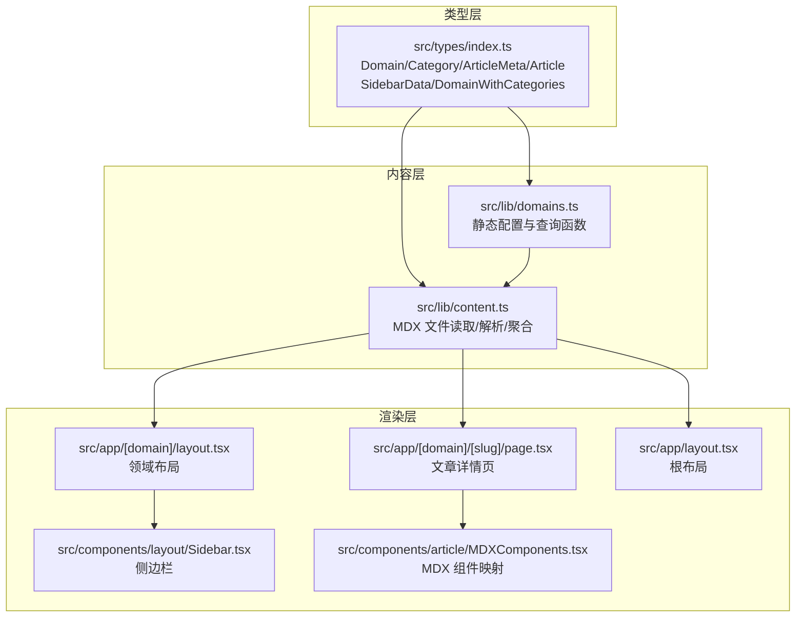
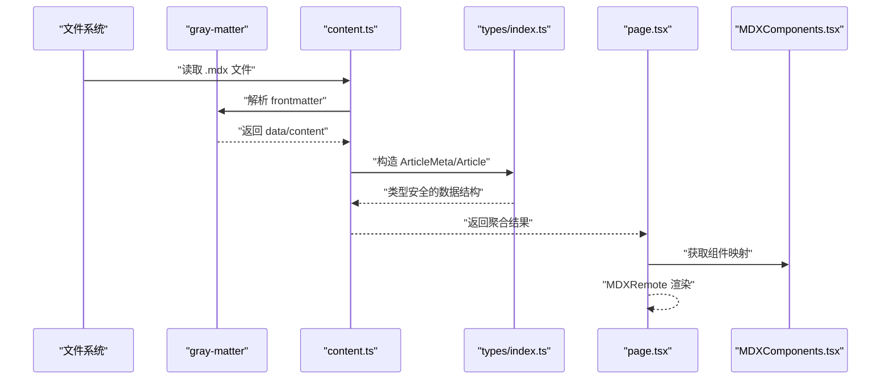
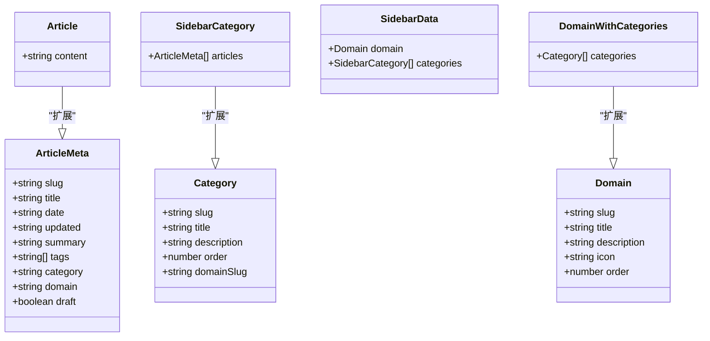
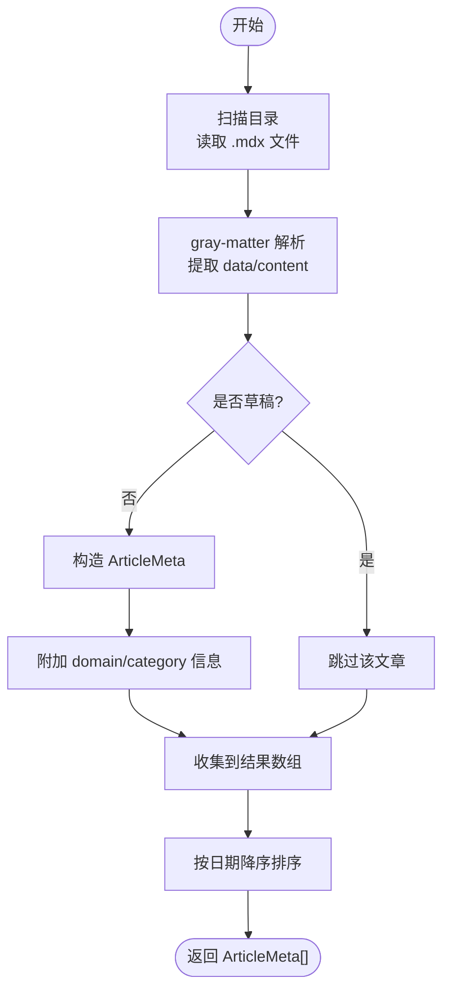
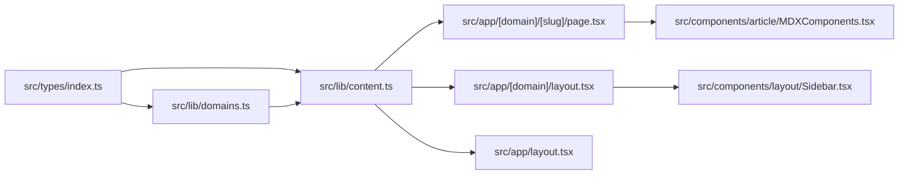

# 类型系统架构

<cite>
**本文引用的文件**
- [src/types/index.ts](file://src/types/index.ts)
- [src/lib/content.ts](file://src/lib/content.ts)
- [src/lib/domains.ts](file://src/lib/domains.ts)
- [src/components/article/MDXComponents.tsx](file://src/components/article/MDXComponents.tsx)
- [src/app/[domain]/[slug]/page.tsx](file://src/app/[domain]/[slug]/page.tsx)
- [src/app/[domain]/layout.tsx](file://src/app/[domain]/layout.tsx)
- [src/app/layout.tsx](file://src/app/layout.tsx)
- [src/components/layout/Sidebar.tsx](file://src/components/layout/Sidebar.tsx)
- [content/distributed-architecture/message-queue/kafka-core-concepts.mdx](file://content/distributed-architecture/message-queue/kafka-core-concepts.mdx)
- [tsconfig.json](file://tsconfig.json)
</cite>

## 目录
1. [引言](#引言)
2. [项目结构](#项目结构)
3. [核心组件](#核心组件)
4. [架构总览](#架构总览)
5. [详细组件分析](#详细组件分析)
6. [依赖分析](#依赖分析)
7. [性能考虑](#性能考虑)
8. [故障排除指南](#故障排除指南)
9. [结论](#结论)
10. [附录](#附录)

## 引言
本文件系统化梳理 blog_new 项目的 TypeScript 类型系统，重点覆盖 Domain、Category、ArticleMeta、Article 等核心类型的设计原则与层次关系；阐述内容管理中的类型安全保证、泛型使用场景、MDX 内容处理中的类型推导与断言策略；并总结接口设计、类型约束与错误处理的最佳实践。文档同时提供可视化图示与具体文件路径指引，帮助读者快速定位实现细节。

## 项目结构
项目采用按功能域划分的组织方式：类型定义集中在 src/types，内容读取与聚合逻辑位于 src/lib，页面路由与组件渲染位于 src/app 与 src/components。MDX 内容以 frontmatter 元信息驱动类型系统，通过 gray-matter 解析生成 ArticleMeta/Article 结构。

图表来源
- [src/types/index.ts:1-45](file://src/types/index.ts#L1-L45)
- [src/lib/domains.ts:1-136](file://src/lib/domains.ts#L1-L136)
- [src/lib/content.ts:1-158](file://src/lib/content.ts#L1-L158)
- [src/app/[domain]/[slug]/page.tsx:1-100](file://src/app/[domain]/[slug]/page.tsx#L1-L100)
- [src/app/[domain]/layout.tsx:1-30](file://src/app/[domain]/layout.tsx#L1-L30)
- [src/app/layout.tsx:1-61](file://src/app/layout.tsx#L1-L61)
- [src/components/layout/Sidebar.tsx:1-126](file://src/components/layout/Sidebar.tsx#L1-L126)
- [src/components/article/MDXComponents.tsx:1-70](file://src/components/article/MDXComponents.tsx#L1-L70)

章节来源
- [src/types/index.ts:1-45](file://src/types/index.ts#L1-L45)
- [src/lib/domains.ts:1-136](file://src/lib/domains.ts#L1-L136)
- [src/lib/content.ts:1-158](file://src/lib/content.ts#L1-L158)
- [src/app/[domain]/[slug]/page.tsx:1-100](file://src/app/[domain]/[slug]/page.tsx#L1-L100)
- [src/app/[domain]/layout.tsx:1-30](file://src/app/[domain]/layout.tsx#L1-L30)
- [src/app/layout.tsx:1-61](file://src/app/layout.tsx#L1-L61)
- [src/components/layout/Sidebar.tsx:1-126](file://src/components/layout/Sidebar.tsx#L1-L126)
- [src/components/article/MDXComponents.tsx:1-70](file://src/components/article/MDXComponents.tsx#L1-L70)

## 核心组件
本节聚焦核心类型定义及其职责边界，说明从基础类型到复合类型的构建方式与约束条件。

- Domain：领域元信息，包含标识、标题、描述、图标与排序字段，用于导航与展示。
- Category：分类元信息，包含标识、标题、描述、排序与 domainSlug 关联，确保分类归属明确。
- ArticleMeta：文章摘要信息，包含 slug、title、date、updated、summary、tags、category、domain、draft 等字段，作为列表与索引的基础数据结构。
- Article：在 ArticleMeta 基础上扩展 content 字段，承载原始 MDX 源码，用于渲染。
- SidebarCategory：在 Category 基础上扩展 articles 数组，用于侧边栏展示。
- SidebarData：组合 Domain 与 SidebarCategory 列表，作为侧边栏渲染的数据源。
- DomainWithCategories：在 Domain 基础上扩展 categories 数组，用于首页或导航展示。

章节来源
- [src/types/index.ts:1-45](file://src/types/index.ts#L1-L45)

## 架构总览
类型系统贯穿“内容读取—数据聚合—页面渲染”的全链路。灰度解析 gray-matter 将 frontmatter 转换为 ArticleMeta，再结合领域与分类配置生成 SidebarData/DomainWithCategories 等复合类型，最终在 Next.js RSC 环境中通过 MDXRemote 渲染。

图表来源
- [src/lib/content.ts:15-43](file://src/lib/content.ts#L15-L43)
- [src/lib/content.ts:102-131](file://src/lib/content.ts#L102-L131)
- [src/types/index.ts:17-31](file://src/types/index.ts#L17-L31)
- [src/app/[domain]/[slug]/page.tsx:29-99](file://src/app/[domain]/[slug]/page.tsx#L29-L99)
- [src/components/article/MDXComponents.tsx:3-69](file://src/components/article/MDXComponents.tsx#L3-L69)

## 详细组件分析

### 类型定义与继承关系
核心类型通过接口继承与扩展构建层级清晰的类型体系，确保数据结构的一致性与可维护性。

图表来源
- [src/types/index.ts:1-45](file://src/types/index.ts#L1-L45)

章节来源
- [src/types/index.ts:1-45](file://src/types/index.ts#L1-L45)

### 内容读取与类型推导流程
内容读取模块负责扫描目录、解析 frontmatter、过滤草稿并排序，最终产出类型安全的数据结构。

图表来源
- [src/lib/content.ts:15-27](file://src/lib/content.ts#L15-L27)
- [src/lib/content.ts:29-43](file://src/lib/content.ts#L29-L43)
- [src/lib/content.ts:58-78](file://src/lib/content.ts#L58-L78)
- [src/lib/content.ts:80-100](file://src/lib/content.ts#L80-L100)

章节来源
- [src/lib/content.ts:15-27](file://src/lib/content.ts#L15-L27)
- [src/lib/content.ts:29-43](file://src/lib/content.ts#L29-L43)
- [src/lib/content.ts:58-78](file://src/lib/content.ts#L58-L78)
- [src/lib/content.ts:80-100](file://src/lib/content.ts#L80-L100)

### MDX 内容处理与类型断言
- 类型断言：在解析 frontmatter 后，content 字段被断言为 string，作为 MDX 源码传入渲染器。
- 类型推导：Next.js RSC 的 MDXRemote 接收 source 与 components，其中 source 的类型由 Article.content 推导而来。
- 组件映射：MDXComponents.tsx 返回 MDXComponents 映射，确保渲染时的类型一致性。

章节来源
- [src/lib/content.ts:114-126](file://src/lib/content.ts#L114-L126)
- [src/app/[domain]/[slug]/page.tsx:77-95](file://src/app/[domain]/[slug]/page.tsx#L77-L95)
- [src/components/article/MDXComponents.tsx:1-70](file://src/components/article/MDXComponents.tsx#L1-L70)

### 页面渲染与类型约束
- 文章详情页：通过 generateStaticParams 预渲染，generateMetadata 动态设置 SEO 元数据；Article 参数由 getArticleBySlug 返回，类型为 Article 或 null。
- 领域布局：根据 domainSlug 获取 SidebarData，若不存在则 notFound。
- 根布局：聚合 DomainWithCategories 列表，传递给 Navbar 组件。

章节来源
- [src/app/[domain]/[slug]/page.tsx:10-27](file://src/app/[domain]/[slug]/page.tsx#L10-L27)
- [src/app/[domain]/[slug]/page.tsx:29-99](file://src/app/[domain]/[slug]/page.tsx#L29-L99)
- [src/app/[domain]/layout.tsx:6-19](file://src/app/[domain]/layout.tsx#L6-L19)
- [src/app/layout.tsx:38-60](file://src/app/layout.tsx#L38-L60)

### 侧边栏数据结构与渲染
- SidebarData 由 getSidebarData 生成，包含 Domain 与 Category 列表，每个 Category 扩展为 SidebarCategory 并注入 articles。
- Sidebar 组件消费 SidebarData，渲染导航树与当前激活项。

章节来源
- [src/lib/content.ts:133-146](file://src/lib/content.ts#L133-L146)
- [src/components/layout/Sidebar.tsx:13-68](file://src/components/layout/Sidebar.tsx#L13-L68)

## 依赖分析
类型系统与业务模块的耦合关系清晰：类型定义独立于实现，内容读取模块依赖类型定义，页面与组件依赖内容读取模块的结果。

图表来源
- [src/types/index.ts:1-45](file://src/types/index.ts#L1-L45)
- [src/lib/domains.ts:1-136](file://src/lib/domains.ts#L1-L136)
- [src/lib/content.ts:1-158](file://src/lib/content.ts#L1-L158)
- [src/app/[domain]/[slug]/page.tsx:1-100](file://src/app/[domain]/[slug]/page.tsx#L1-L100)
- [src/app/[domain]/layout.tsx:1-30](file://src/app/[domain]/layout.tsx#L1-L30)
- [src/app/layout.tsx:1-61](file://src/app/layout.tsx#L1-L61)
- [src/components/article/MDXComponents.tsx:1-70](file://src/components/article/MDXComponents.tsx#L1-L70)
- [src/components/layout/Sidebar.tsx:1-126](file://src/components/layout/Sidebar.tsx#L1-L126)

章节来源
- [src/types/index.ts:1-45](file://src/types/index.ts#L1-L45)
- [src/lib/domains.ts:1-136](file://src/lib/domains.ts#L1-L136)
- [src/lib/content.ts:1-158](file://src/lib/content.ts#L1-L158)
- [src/app/[domain]/[slug]/page.tsx:1-100](file://src/app/[domain]/[slug]/page.tsx#L1-L100)
- [src/app/[domain]/layout.tsx:1-30](file://src/app/[domain]/layout.tsx#L1-L30)
- [src/app/layout.tsx:1-61](file://src/app/layout.tsx#L1-L61)
- [src/components/article/MDXComponents.tsx:1-70](file://src/components/article/MDXComponents.tsx#L1-L70)
- [src/components/layout/Sidebar.tsx:1-126](file://src/components/layout/Sidebar.tsx#L1-L126)

## 性能考虑
- 缓存策略：content.ts 中大量异步函数使用 React cache 包装，避免重复 IO 与解析，提升 SSR/SSG 性能。
- 目录扫描：readMdxFiles 仅遍历 .mdx 文件，减少无关文件处理开销。
- 排序优化：按日期排序在内存完成，建议在数据量较大时考虑数据库索引或预计算。
- MDX 渲染：MDXRemote 在服务端渲染，配合 rehype-pretty-code 进行代码高亮，注意主题与背景配置对首屏的影响。

章节来源
- [src/lib/content.ts:45-47](file://src/lib/content.ts#L45-L47)
- [src/lib/content.ts:58-78](file://src/lib/content.ts#L58-L78)
- [src/lib/content.ts:80-100](file://src/lib/content.ts#L80-L100)
- [src/lib/content.ts:102-131](file://src/lib/content.ts#L102-L131)
- [src/lib/content.ts:133-146](file://src/lib/content.ts#L133-L146)
- [src/lib/content.ts:148-158](file://src/lib/content.ts#L148-L158)

## 故障排除指南
- frontmatter 缺失字段：ArticleMeta 构造时对缺失字段提供默认值，确保类型安全与渲染健壮性。
- 草稿过滤：parseArticleMeta 对 draft=true 的文章直接返回 null，避免渲染无效内容。
- 文件不存在：getArticleBySlug 在找不到对应文件时返回 null，页面层需处理 notFound。
- 类型不匹配：确保 gray-matter 解析后的 data 字段与 ArticleMeta 定义一致，必要时在解析后进行字段校验与断言。

章节来源
- [src/lib/content.ts:29-43](file://src/lib/content.ts#L29-L43)
- [src/lib/content.ts:30-32](file://src/lib/content.ts#L30-L32)
- [src/lib/content.ts:112-129](file://src/lib/content.ts#L112-L129)
- [src/app/[domain]/[slug]/page.tsx:34-36](file://src/app/[domain]/[slug]/page.tsx#L34-L36)

## 结论
本类型系统以 Domain/Category/ArticleMeta/Article 为核心，通过继承与扩展构建清晰的层次结构；结合 gray-matter 的 frontmatter 解析与 React cache 的缓存策略，在 Next.js 生态中实现了高效、类型安全的内容管理与渲染。建议在扩展新领域或分类时遵循现有接口契约，保持类型一致性与可维护性。

## 附录

### 类型定义最佳实践
- 接口设计：优先使用只读属性与明确的标量类型，避免 any/unknown 的滥用。
- 可选字段：合理使用可选属性（如 updated），并在解析时提供默认值。
- 继承与扩展：通过接口扩展复用结构，减少重复定义。
- 泛型使用：在通用工具函数中引入泛型参数，提升复用性与类型约束能力。
- 错误处理：在解析阶段尽早失败（如 draft 过滤），并在调用方处理 null/undefined。

章节来源
- [src/types/index.ts:17-31](file://src/types/index.ts#L17-L31)
- [src/lib/content.ts:29-43](file://src/lib/content.ts#L29-L43)
- [src/lib/content.ts:30-32](file://src/lib/content.ts#L30-L32)

### MDX 内容处理要点
- 类型断言：在确定 source 为字符串时进行断言，确保 MDXRemote 输入类型正确。
- 组件映射：统一在 MDXComponents.tsx 中集中管理，便于样式与行为的一致性。
- 插件链：remarkGfm/rehypeSlug/rehypePrettyCode 的组合应与 ArticleMeta 的 tags/summary 等字段协同，提升可读性与可搜索性。

章节来源
- [src/lib/content.ts:114-126](file://src/lib/content.ts#L114-L126)
- [src/app/[domain]/[slug]/page.tsx:77-95](file://src/app/[domain]/[slug]/page.tsx#L77-L95)
- [src/components/article/MDXComponents.tsx:3-69](file://src/components/article/MDXComponents.tsx#L3-L69)

### 示例文件参考
- MDX frontmatter 示例：[content/distributed-architecture/message-queue/kafka-core-concepts.mdx:1-9](file://content/distributed-architecture/message-queue/kafka-core-concepts.mdx#L1-L9)

章节来源
- [content/distributed-architecture/message-queue/kafka-core-concepts.mdx:1-9](file://content/distributed-architecture/message-queue/kafka-core-concepts.mdx#L1-L9)