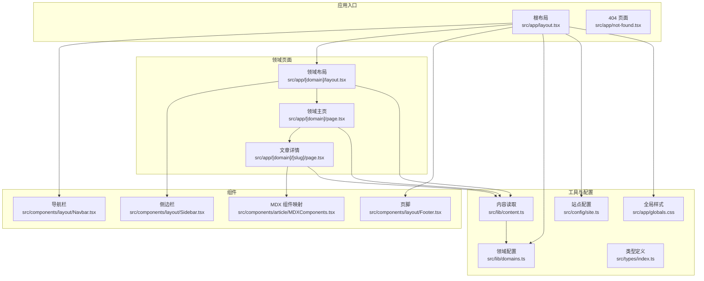
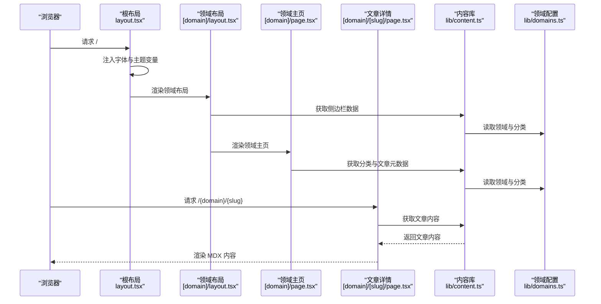
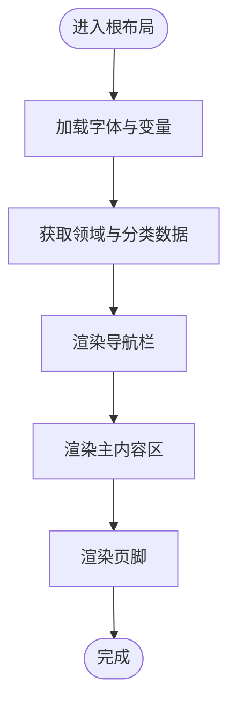
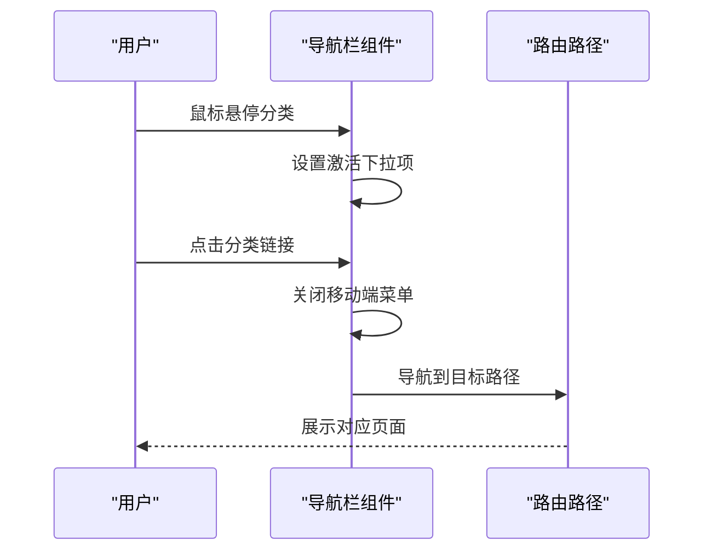
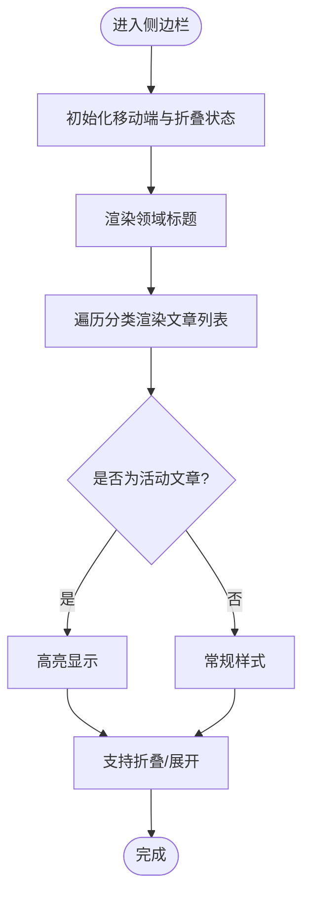
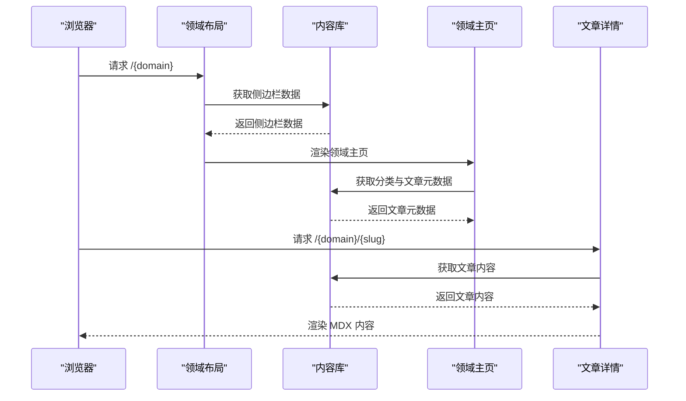
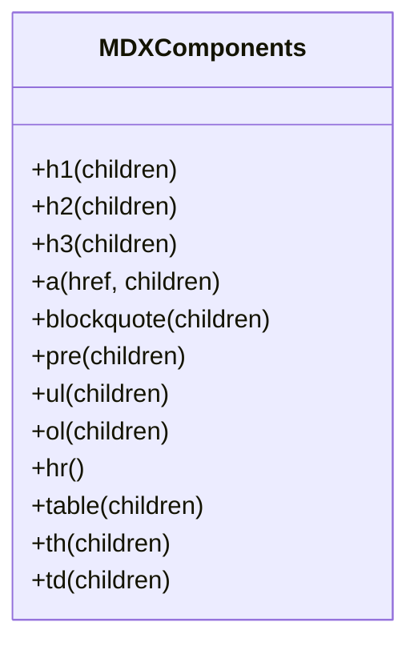
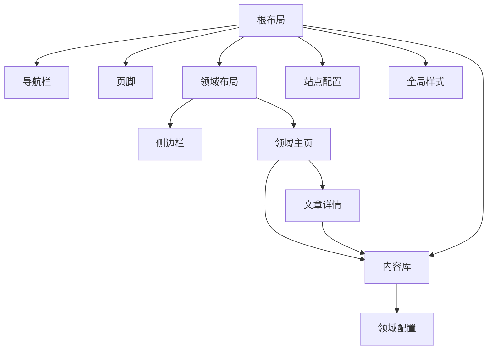

# 组件架构设计

<cite>
**本文档引用的文件**
- [README.md](file://README.md)
- [package.json](file://package.json)
- [src/app/layout.tsx](file://src/app/layout.tsx)
- [src/app/[domain]/layout.tsx](file://src/app/[domain]/layout.tsx)
- [src/app/[domain]/page.tsx](file://src/app/[domain]/page.tsx)
- [src/app/[domain]/[slug]/page.tsx](file://src/app/[domain]/[slug]/page.tsx)
- [src/app/not-found.tsx](file://src/app/not-found.tsx)
- [src/components/layout/Navbar.tsx](file://src/components/layout/Navbar.tsx)
- [src/components/layout/Footer.tsx](file://src/components/layout/Footer.tsx)
- [src/components/layout/Sidebar.tsx](file://src/components/layout/Sidebar.tsx)
- [src/components/article/MDXComponents.tsx](file://src/components/article/MDXComponents.tsx)
- [src/lib/domains.ts](file://src/lib/domains.ts)
- [src/lib/content.ts](file://src/lib/content.ts)
- [src/types/index.ts](file://src/types/index.ts)
- [src/config/site.ts](file://src/config/site.ts)
- [src/app/globals.css](file://src/app/globals.css)
</cite>

## 目录
1. [引言](#引言)
2. [项目结构](#项目结构)
3. [核心组件](#核心组件)
4. [架构总览](#架构总览)
5. [详细组件分析](#详细组件分析)
6. [依赖关系分析](#依赖关系分析)
7. [性能考量](#性能考量)
8. [故障排查指南](#故障排查指南)
9. [结论](#结论)
10. [附录](#附录)

## 引言
本项目采用 Next.js App Router 架构，围绕“布局组件、业务组件、UI 组件”的职责分离进行组件化设计。通过根布局统一注入全局样式与导航栏、页脚，业务页面按领域（domain）拆分并在子路由中渲染内容；UI 组件负责可复用的视觉与交互元素；MDX 文章内容通过专门的组件映射实现一致的排版风格。整体遵循响应式设计原则，在桌面端与移动端提供差异化体验，并通过缓存与静态生成提升性能。

## 项目结构
项目采用功能域驱动的目录组织方式：
- 根布局：统一注入字体、主题变量与全局样式，承载导航与页脚。
- 页面层：按领域与文章 slug 的动态路由组织，分别渲染领域主页与文章详情。
- 组件层：布局组件（导航、侧边栏、页脚）、文章渲染组件（MDX 组件映射）。
- 工具层：类型定义、内容读取与领域配置、站点配置。
- 样式层：全局 CSS 变量与 Tailwind 主题定制。

图表来源
- [src/app/layout.tsx:38-60](file://src/app/layout.tsx#L38-L60)
- [src/app/[domain]/layout.tsx](file://src/app/[domain]/layout.tsx#L10-L29)
- [src/app/[domain]/page.tsx](file://src/app/[domain]/page.tsx#L25-L88)
- [src/app/[domain]/[slug]/page.tsx](file://src/app/[domain]/[slug]/page.tsx#L29-L99)
- [src/components/layout/Navbar.tsx:13-140](file://src/components/layout/Navbar.tsx#L13-L140)
- [src/components/layout/Sidebar.tsx:13-125](file://src/components/layout/Sidebar.tsx#L13-L125)
- [src/components/layout/Footer.tsx:3-20](file://src/components/layout/Footer.tsx#L3-L20)
- [src/components/article/MDXComponents.tsx:3-69](file://src/components/article/MDXComponents.tsx#L3-L69)
- [src/lib/domains.ts:1-136](file://src/lib/domains.ts#L1-L136)
- [src/lib/content.ts:1-158](file://src/lib/content.ts#L1-L158)
- [src/types/index.ts:1-45](file://src/types/index.ts#L1-L45)
- [src/config/site.ts:1-20](file://src/config/site.ts#L1-L20)
- [src/app/globals.css:1-95](file://src/app/globals.css#L1-L95)

章节来源
- [src/app/layout.tsx:1-61](file://src/app/layout.tsx#L1-L61)
- [src/app/[domain]/layout.tsx](file://src/app/[domain]/layout.tsx#L1-L30)
- [src/app/[domain]/page.tsx](file://src/app/[domain]/page.tsx#L1-L89)
- [src/app/[domain]/[slug]/page.tsx](file://src/app/[domain]/[slug]/page.tsx#L1-L100)
- [src/components/layout/Navbar.tsx:1-141](file://src/components/layout/Navbar.tsx#L1-L141)
- [src/components/layout/Sidebar.tsx:1-126](file://src/components/layout/Sidebar.tsx#L1-L126)
- [src/components/layout/Footer.tsx:1-21](file://src/components/layout/Footer.tsx#L1-L21)
- [src/components/article/MDXComponents.tsx:1-70](file://src/components/article/MDXComponents.tsx#L1-L70)
- [src/lib/domains.ts:1-136](file://src/lib/domains.ts#L1-L136)
- [src/lib/content.ts:1-158](file://src/lib/content.ts#L1-L158)
- [src/types/index.ts:1-45](file://src/types/index.ts#L1-L45)
- [src/config/site.ts:1-20](file://src/config/site.ts#L1-L20)
- [src/app/globals.css:1-95](file://src/app/globals.css#L1-L95)

## 核心组件
- 布局组件
  - 根布局：注入字体与主题变量，渲染导航与页脚，作为所有页面的容器。
  - 领域布局：在领域页面中渲染侧边栏与主内容区，承载领域级导航与文章列表。
- 业务组件
  - 领域主页：聚合分类与文章元数据，渲染卡片式列表。
  - 文章详情：解析并渲染 MDX 内容，提供标题、摘要、标签、时间等信息。
- UI 组件
  - 导航栏：支持桌面端下拉菜单与移动端抽屉菜单，状态由客户端控制。
  - 侧边栏：根据当前路径高亮活动文章，支持移动端抽屉与折叠展开。
  - 页脚：展示站点标语与版权信息。
- 文章渲染组件
  - MDX 组件映射：统一 h1/h2/h3、链接、引用块、代码块、表格等元素的样式与行为。

章节来源
- [src/app/layout.tsx:38-60](file://src/app/layout.tsx#L38-L60)
- [src/app/[domain]/layout.tsx](file://src/app/[domain]/layout.tsx#L10-L29)
- [src/app/[domain]/page.tsx](file://src/app/[domain]/page.tsx#L25-L88)
- [src/app/[domain]/[slug]/page.tsx](file://src/app/[domain]/[slug]/page.tsx#L29-L99)
- [src/components/layout/Navbar.tsx:13-140](file://src/components/layout/Navbar.tsx#L13-L140)
- [src/components/layout/Sidebar.tsx:13-125](file://src/components/layout/Sidebar.tsx#L13-L125)
- [src/components/layout/Footer.tsx:3-20](file://src/components/layout/Footer.tsx#L3-L20)
- [src/components/article/MDXComponents.tsx:3-69](file://src/components/article/MDXComponents.tsx#L3-L69)

## 架构总览
系统采用“根布局 + 动态路由 + 组件组合”的三层架构：
- 根布局负责全局样式与导航/页脚注入。
- 动态路由按领域与文章 slug 渲染页面，页面内调用内容库读取数据。
- 组件层通过 props 注入数据，使用客户端状态实现交互（如导航栏下拉、侧边栏抽屉）。

图表来源
- [src/app/layout.tsx:38-60](file://src/app/layout.tsx#L38-L60)
- [src/app/[domain]/layout.tsx](file://src/app/[domain]/layout.tsx#L10-L29)
- [src/app/[domain]/page.tsx](file://src/app/[domain]/page.tsx#L25-L88)
- [src/app/[domain]/[slug]/page.tsx](file://src/app/[domain]/[slug]/page.tsx#L29-L99)
- [src/lib/content.ts:133-146](file://src/lib/content.ts#L133-L146)
- [src/lib/domains.ts:1-136](file://src/lib/domains.ts#L1-L136)

## 详细组件分析

### 根布局与全局样式
- 职责：注入字体、主题变量与全局样式，渲染导航与页脚。
- 数据流：从领域配置读取数据，传递给导航组件；全局样式通过 CSS 变量与 Tailwind 定制。
- 响应式：通过 CSS 变量与 Tailwind 类名实现桌面端与移动端的统一风格。

图表来源
- [src/app/layout.tsx:38-60](file://src/app/layout.tsx#L38-L60)
- [src/lib/domains.ts:1-136](file://src/lib/domains.ts#L1-L136)
- [src/app/globals.css:1-95](file://src/app/globals.css#L1-L95)

章节来源
- [src/app/layout.tsx:1-61](file://src/app/layout.tsx#L1-L61)
- [src/app/globals.css:1-95](file://src/app/globals.css#L1-L95)

### 导航栏组件
- 职责：提供桌面端下拉菜单与移动端抽屉菜单，支持鼠标悬停与点击切换。
- 状态：使用客户端状态管理移动端展开状态与下拉激活项，防抖处理鼠标离开事件。
- 交互：根据当前路径高亮活动项，支持点击后关闭移动端菜单。

图表来源
- [src/components/layout/Navbar.tsx:13-140](file://src/components/layout/Navbar.tsx#L13-L140)

章节来源
- [src/components/layout/Navbar.tsx:1-141](file://src/components/layout/Navbar.tsx#L1-L141)

### 侧边栏组件
- 职责：在领域页面左侧渲染分类与文章列表，支持移动端抽屉与折叠展开。
- 状态：移动端抽屉开关与分类折叠状态均为客户端状态。
- 交互：根据当前路径高亮活动文章，支持点击跳转。

图表来源
- [src/components/layout/Sidebar.tsx:13-125](file://src/components/layout/Sidebar.tsx#L13-L125)

章节来源
- [src/components/layout/Sidebar.tsx:1-126](file://src/components/layout/Sidebar.tsx#L1-L126)

### 领域布局与页面
- 领域布局：注入侧边栏数据，渲染主内容区，承载领域级导航与文章列表。
- 领域主页：聚合分类与文章元数据，渲染卡片式列表，支持空状态提示。
- 文章详情：解析并渲染 MDX 内容，提供标题、摘要、标签、时间等信息。

图表来源
- [src/app/[domain]/layout.tsx](file://src/app/[domain]/layout.tsx#L10-L29)
- [src/app/[domain]/page.tsx](file://src/app/[domain]/page.tsx#L25-L88)
- [src/app/[domain]/[slug]/page.tsx](file://src/app/[domain]/[slug]/page.tsx#L29-L99)
- [src/lib/content.ts:133-146](file://src/lib/content.ts#L133-L146)

章节来源
- [src/app/[domain]/layout.tsx](file://src/app/[domain]/layout.tsx#L1-L30)
- [src/app/[domain]/page.tsx](file://src/app/[domain]/page.tsx#L1-L89)
- [src/app/[domain]/[slug]/page.tsx](file://src/app/[domain]/[slug]/page.tsx#L1-L100)

### MDX 组件映射
- 职责：统一 MDX 元素的渲染样式，确保文章内容排版一致性。
- 实现：通过返回 MDX 组件映射对象，覆盖标题、链接、引用块、代码块、表格等元素。

图表来源
- [src/components/article/MDXComponents.tsx:3-69](file://src/components/article/MDXComponents.tsx#L3-L69)

章节来源
- [src/components/article/MDXComponents.tsx:1-70](file://src/components/article/MDXComponents.tsx#L1-L70)

### 错误处理与 404 页面
- 职责：当请求不存在的领域或文章时，返回 404 页面并引导用户回到首页。
- 实现：在领域与文章页面中使用 notFound 触发 404，404 页面提供返回首页的按钮。

章节来源
- [src/app/[domain]/page.tsx](file://src/app/[domain]/page.tsx#L31-L32)
- [src/app/[domain]/[slug]/page.tsx](file://src/app/[domain]/[slug]/page.tsx#L35-L36)
- [src/app/not-found.tsx:4-18](file://src/app/not-found.tsx#L4-L18)

## 依赖关系分析
- 组件耦合
  - 根布局依赖导航与页脚组件，以及内容库提供的领域数据。
  - 领域布局依赖侧边栏组件与内容库提供的侧边栏数据。
  - 页面组件依赖内容库进行数据读取，类型定义贯穿全链路。
- 外部依赖
  - Next.js 提供 App Router、SSG/SSR 与动态路由能力。
  - Tailwind CSS 与 Typography 插件提供样式与排版能力。
  - MDX 生态（next-mdx-remote、remark/rehype 插件）提供内容渲染。

图表来源
- [src/app/layout.tsx:3-8](file://src/app/layout.tsx#L3-L8)
- [src/app/[domain]/layout.tsx](file://src/app/[domain]/layout.tsx#L2-L4)
- [src/lib/content.ts:1-11](file://src/lib/content.ts#L1-L11)
- [src/lib/domains.ts:1-136](file://src/lib/domains.ts#L1-L136)
- [src/config/site.ts:1-20](file://src/config/site.ts#L1-L20)
- [src/app/globals.css:1-95](file://src/app/globals.css#L1-L95)

章节来源
- [src/app/layout.tsx:1-61](file://src/app/layout.tsx#L1-L61)
- [src/app/[domain]/layout.tsx](file://src/app/[domain]/layout.tsx#L1-L30)
- [src/lib/content.ts:1-158](file://src/lib/content.ts#L1-L158)
- [src/lib/domains.ts:1-136](file://src/lib/domains.ts#L1-L136)
- [src/config/site.ts:1-20](file://src/config/site.ts#L1-L20)
- [src/app/globals.css:1-95](file://src/app/globals.css#L1-L95)

## 性能考量
- 静态生成与预渲染
  - 领域与文章页面通过 generateStaticParams 生成静态路由参数，结合 getDomainWithCategories、getSidebarData、getArticleBySlug 等缓存函数，减少运行时计算与 IO。
- 缓存策略
  - 使用 React cache 包装的内容读取函数，避免重复读取文件系统与重复解析元数据。
- 资源优化
  - 字体通过 Next/font 按需加载，CSS 变量与 Tailwind 类名减少重复样式。
- 交互性能
  - 导航栏与侧边栏的状态仅在客户端维护，避免不必要的服务端渲染开销。

章节来源
- [src/app/[domain]/page.tsx](file://src/app/[domain]/page.tsx#L7-L9)
- [src/app/[domain]/[slug]/page.tsx](file://src/app/[domain]/[slug]/page.tsx#L10-L13)
- [src/app/[domain]/layout.tsx](file://src/app/[domain]/layout.tsx#L6-L8)
- [src/lib/content.ts:45-146](file://src/lib/content.ts#L45-L146)
- [src/app/layout.tsx:10-28](file://src/app/layout.tsx#L10-L28)

## 故障排查指南
- 页面 404
  - 现象：访问不存在的领域或文章时出现 404 页面。
  - 排查：确认 generateStaticParams 是否包含对应参数；检查内容目录结构与文件命名是否符合约定。
- 导航异常
  - 现象：移动端菜单无法打开或下拉菜单不消失。
  - 排查：检查客户端状态逻辑与事件绑定；确认移动端断点与类名是否正确。
- 文章渲染异常
  - 现象：MDX 内容未按预期渲染或样式错乱。
  - 排查：确认 MDX 组件映射是否完整；检查 remark/rehype 插件配置与主题设置。

章节来源
- [src/app/not-found.tsx:4-18](file://src/app/not-found.tsx#L4-L18)
- [src/components/layout/Navbar.tsx:13-140](file://src/components/layout/Navbar.tsx#L13-L140)
- [src/components/article/MDXComponents.tsx:3-69](file://src/components/article/MDXComponents.tsx#L3-L69)
- [src/app/[domain]/[slug]/page.tsx](file://src/app/[domain]/[slug]/page.tsx#L77-L95)

## 结论
该组件架构清晰地实现了布局组件、业务组件与 UI 组件的职责分离，通过根布局统一注入全局样式与导航，业务页面按领域与文章 slug 组织，UI 组件提供可复用的交互与视觉元素。配合缓存与静态生成策略，系统在性能与可维护性之间取得良好平衡。建议后续持续完善测试策略与组件文档，进一步提升团队协作效率与代码质量。

## 附录
- 代码规范与测试策略（建议）
  - 规范
    - 组件命名采用帕斯卡命名法，文件名与组件名一致。
    - Props 明确类型，优先使用只读属性与严格类型约束。
    - 客户端逻辑集中于 “use client” 组件，服务端逻辑集中在页面与工具模块。
  - 测试
    - 单元测试：对内容读取函数与工具函数进行断言测试。
    - 集成测试：对页面渲染与路由行为进行端到端验证。
    - 可访问性测试：确保导航与交互满足 WCAG 基本要求。

章节来源
- [src/types/index.ts:1-45](file://src/types/index.ts#L1-L45)
- [src/lib/content.ts:1-158](file://src/lib/content.ts#L1-L158)
- [package.json:5-10](file://package.json#L5-L10)