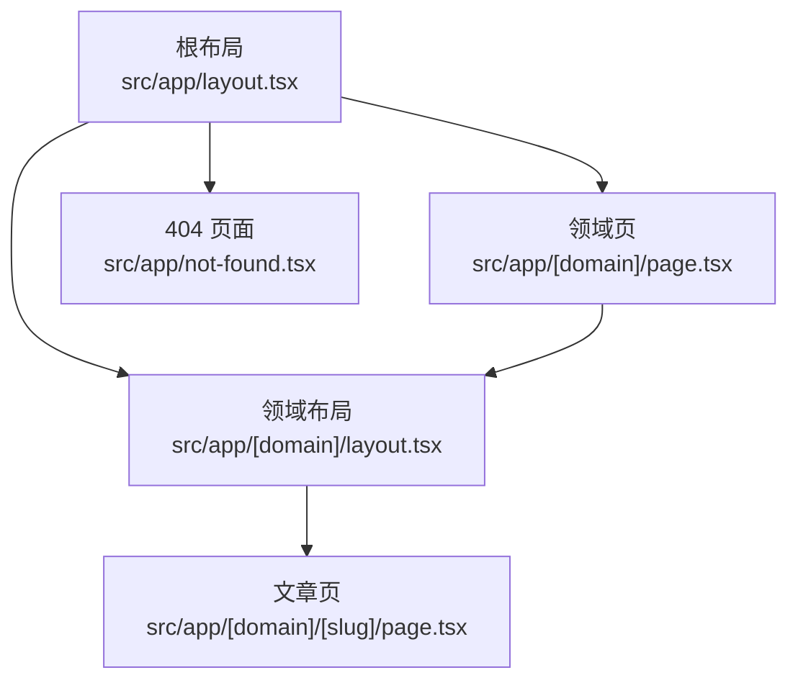
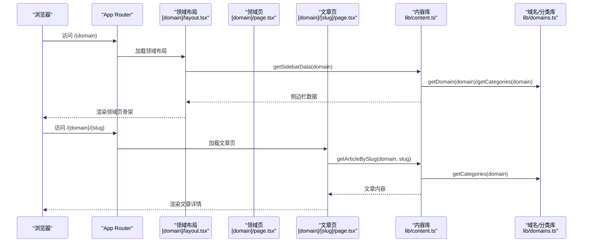
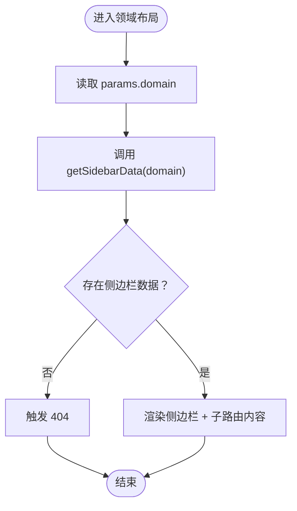
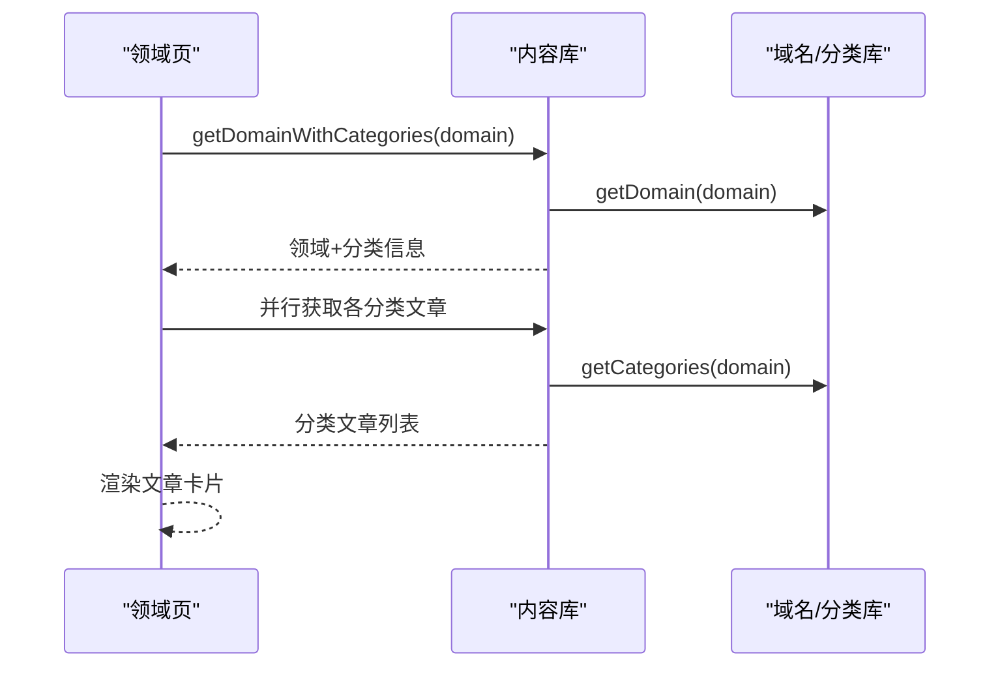
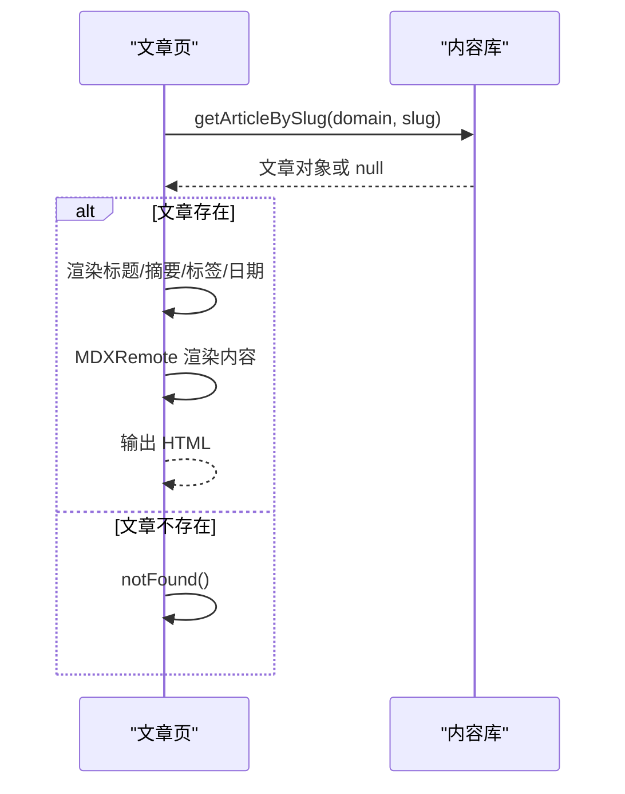
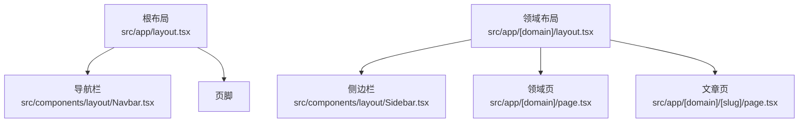
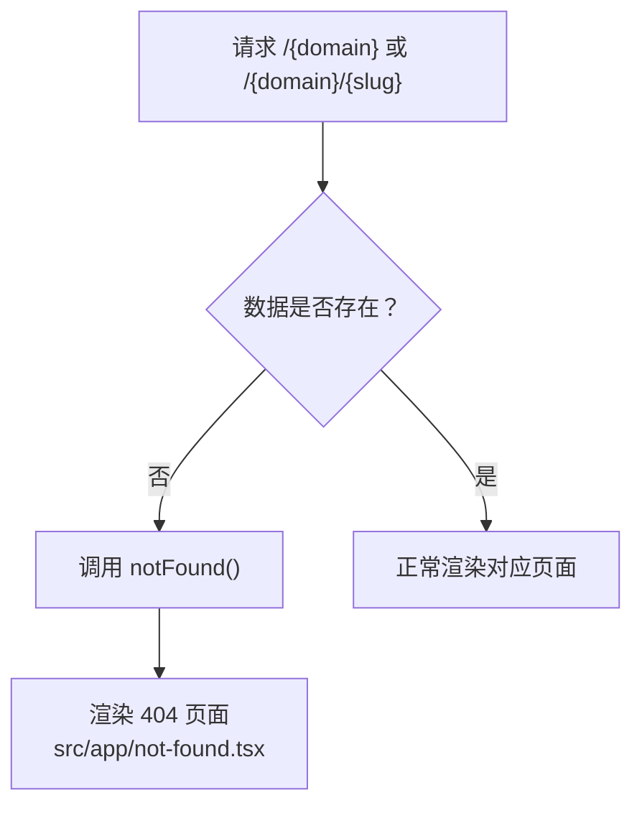
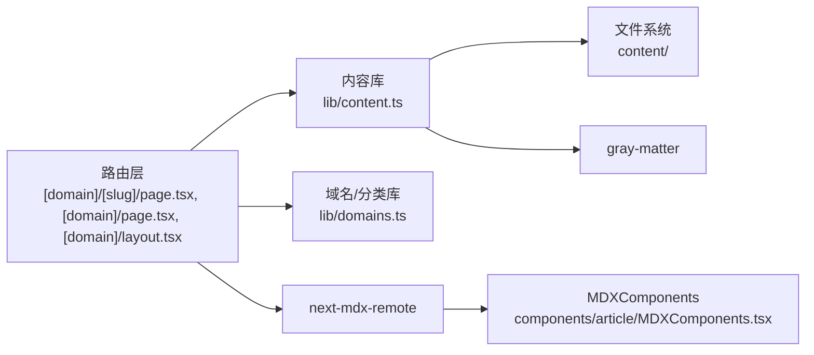

# 路由系统架构

<cite>
**本文引用的文件**
- [src/app/[domain]/[slug]/page.tsx](file://src/app/[domain]/[slug]/page.tsx)
- [src/app/[domain]/layout.tsx](file://src/app/[domain]/layout.tsx)
- [src/app/[domain]/page.tsx](file://src/app/[domain]/page.tsx)
- [src/app/layout.tsx](file://src/app/layout.tsx)
- [src/app/not-found.tsx](file://src/app/not-found.tsx)
- [src/lib/content.ts](file://src/lib/content.ts)
- [src/lib/domains.ts](file://src/lib/domains.ts)
- [src/components/article/MDXComponents.tsx](file://src/components/article/MDXComponents.tsx)
- [src/types/index.ts](file://src/types/index.ts)
- [src/components/layout/Navbar.tsx](file://src/components/layout/Navbar.tsx)
- [src/components/layout/Sidebar.tsx](file://src/components/layout/Sidebar.tsx)
- [next.config.ts](file://next.config.ts)
- [package.json](file://package.json)
</cite>

## 目录
1. [简介](#简介)
2. [项目结构](#项目结构)
3. [核心组件](#核心组件)
4. [架构总览](#架构总览)
5. [详细组件分析](#详细组件分析)
6. [依赖关系分析](#依赖关系分析)
7. [性能考量](#性能考量)
8. [故障排查指南](#故障排查指南)
9. [结论](#结论)
10. [附录](#附录)

## 简介
本文件面向 blog_new 的路由系统，基于 Next.js App Router 的文件系统路由机制，系统性解析动态路由参数（[domain]、[slug]）的处理方式、嵌套路由的实现、领域路由与文章路由的设计原理，并说明路由参数如何映射到内容管理系统。同时，文档覆盖路由组件的生命周期与数据加载策略（SSR/SGP 结合）、错误处理与 404 页面、重定向规则以及性能优化建议与最佳实践。

## 项目结构
blog_new 采用 Next.js App Router 的文件系统路由组织方式，路由层级清晰：
- 根布局负责全局样式与导航栏、页脚等通用结构
- 领域级路由 [domain] 提供领域主页与侧边栏数据
- 文章级路由 [domain]/[slug] 展示具体文章内容
- 全局 404 页面用于兜底

图表来源
- [src/app/layout.tsx:38-60](file://src/app/layout.tsx#L38-L60)
- [src/app/[domain]/page.tsx](file://src/app/[domain]/page.tsx#L25-L88)
- [src/app/[domain]/layout.tsx](file://src/app/[domain]/layout.tsx#L10-L29)
- [src/app/[domain]/[slug]/page.tsx](file://src/app/[domain]/[slug]/page.tsx#L29-L99)
- [src/app/not-found.tsx:4-18](file://src/app/not-found.tsx#L4-L18)

章节来源
- [src/app/layout.tsx:38-60](file://src/app/layout.tsx#L38-L60)
- [src/app/[domain]/layout.tsx](file://src/app/[domain]/layout.tsx#L10-L29)
- [src/app/[domain]/page.tsx](file://src/app/[domain]/page.tsx#L25-L88)
- [src/app/[domain]/[slug]/page.tsx](file://src/app/[domain]/[slug]/page.tsx#L29-L99)
- [src/app/not-found.tsx:4-18](file://src/app/not-found.tsx#L4-L18)

## 核心组件
- 动态路由参数
  - [domain]: 领域标识符，对应内容域与分类体系
  - [slug]: 文章标识符，对应具体文章
- 数据层
  - 内容读取：通过内容目录扫描与 frontmatter 解析，构建文章元数据与正文
  - 域与分类：集中定义在域名与分类表中，提供查询接口
- 渲染层
  - 文章页：异步获取文章并渲染 MDX 内容
  - 领域页：聚合分类与文章列表
  - 领域布局：注入侧边栏数据
  - 根布局：提供全局导航与字体资源
  - 404 页面：统一错误兜底

章节来源
- [src/lib/content.ts:102-131](file://src/lib/content.ts#L102-L131)
- [src/lib/domains.ts:3-32](file://src/lib/domains.ts#L3-L32)
- [src/app/[domain]/[slug]/page.tsx](file://src/app/[domain]/[slug]/page.tsx#L29-L99)
- [src/app/[domain]/page.tsx](file://src/app/[domain]/page.tsx#L25-L88)
- [src/app/[domain]/layout.tsx](file://src/app/[domain]/layout.tsx#L10-L29)
- [src/app/layout.tsx:38-60](file://src/app/layout.tsx#L38-L60)
- [src/app/not-found.tsx:4-18](file://src/app/not-found.tsx#L4-L18)

## 架构总览
Next.js App Router 将文件系统路径映射为路由，动态段以方括号表示。本项目通过 generateStaticParams 预渲染静态可枚举的路由参数，结合 SSR 获取实时数据，形成“静态预渲染 + 动态 SSR”的混合策略。

图表来源
- [src/app/[domain]/layout.tsx](file://src/app/[domain]/layout.tsx#L10-L29)
- [src/app/[domain]/page.tsx](file://src/app/[domain]/page.tsx#L25-L88)
- [src/app/[domain]/[slug]/page.tsx](file://src/app/[domain]/[slug]/page.tsx#L29-L99)
- [src/lib/content.ts:133-146](file://src/lib/content.ts#L133-L146)
- [src/lib/domains.ts:129-135](file://src/lib/domains.ts#L129-L135)

## 详细组件分析

### 领域布局 [domain]/layout.tsx
- 功能
  - 通过 generateStaticParams 预渲染所有领域参数
  - 从内容库获取侧边栏数据，若不存在则触发 404
  - 注入侧边栏并渲染子路由内容
- 关键点
  - 参数校验与 notFound() 组合确保无效领域不进入渲染
  - 与根布局配合，提供统一的导航与容器结构

图表来源
- [src/app/[domain]/layout.tsx](file://src/app/[domain]/layout.tsx#L10-L29)
- [src/lib/content.ts:133-146](file://src/lib/content.ts#L133-L146)

章节来源
- [src/app/[domain]/layout.tsx](file://src/app/[domain]/layout.tsx#L10-L29)
- [src/lib/content.ts:133-146](file://src/lib/content.ts#L133-L146)

### 领域页 [domain]/page.tsx
- 功能
  - 通过 generateStaticParams 预渲染所有领域参数
  - 生成领域级 SEO 元数据
  - 聚合分类与文章列表，渲染文章卡片
- 关键点
  - 使用 Promise.all 并行加载各分类的文章，提升性能
  - 通过 Link 组件生成文章链接，保持客户端导航体验

图表来源
- [src/app/[domain]/page.tsx](file://src/app/[domain]/page.tsx#L25-L88)
- [src/lib/content.ts:49-56](file://src/lib/content.ts#L49-L56)
- [src/lib/domains.ts:129-135](file://src/lib/domains.ts#L129-L135)

章节来源
- [src/app/[domain]/page.tsx](file://src/app/[domain]/page.tsx#L25-L88)
- [src/lib/content.ts:49-56](file://src/lib/content.ts#L49-L56)
- [src/lib/domains.ts:129-135](file://src/lib/domains.ts#L129-L135)

### 文章页 [domain]/[slug]/page.tsx
- 功能
  - 通过 generateStaticParams 预渲染所有文章参数
  - 生成文章级 SEO 元数据
  - 读取文章内容并渲染 MDX
- 关键点
  - 参数解包后调用 getArticleBySlug(domain, slug)
  - 若文章不存在，调用 notFound() 触发 404
  - 使用 MDXRemote 进行服务端渲染，支持语法高亮与表格等扩展

图表来源
- [src/app/[domain]/[slug]/page.tsx](file://src/app/[domain]/[slug]/page.tsx#L29-L99)
- [src/lib/content.ts:102-131](file://src/lib/content.ts#L102-L131)

章节来源
- [src/app/[domain]/[slug]/page.tsx](file://src/app/[domain]/[slug]/page.tsx#L29-L99)
- [src/lib/content.ts:102-131](file://src/lib/content.ts#L102-L131)

### 根布局与全局导航
- 根布局负责全局样式、字体资源与全局导航栏
- 导航栏根据已知域名集合预渲染导航项，支持桌面与移动端交互
- 侧边栏在领域布局内渲染，展示当前领域的分类与文章列表

图表来源
- [src/app/layout.tsx:38-60](file://src/app/layout.tsx#L38-L60)
- [src/components/layout/Navbar.tsx:13-140](file://src/components/layout/Navbar.tsx#L13-L140)
- [src/components/layout/Sidebar.tsx:13-125](file://src/components/layout/Sidebar.tsx#L13-L125)
- [src/app/[domain]/layout.tsx](file://src/app/[domain]/layout.tsx#L10-L29)

章节来源
- [src/app/layout.tsx:38-60](file://src/app/layout.tsx#L38-L60)
- [src/components/layout/Navbar.tsx:13-140](file://src/components/layout/Navbar.tsx#L13-L140)
- [src/components/layout/Sidebar.tsx:13-125](file://src/components/layout/Sidebar.tsx#L13-L125)
- [src/app/[domain]/layout.tsx](file://src/app/[domain]/layout.tsx#L10-L29)

### 错误处理与 404 页面
- 领域布局与领域页在数据缺失时调用 notFound()，触发全局 404 页面
- 404 页面提供返回首页的链接，保持一致的用户体验

图表来源
- [src/app/[domain]/layout.tsx](file://src/app/[domain]/layout.tsx#L17-L19)
- [src/app/[domain]/page.tsx](file://src/app/[domain]/page.tsx#L31-L32)
- [src/app/[domain]/[slug]/page.tsx](file://src/app/[domain]/[slug]/page.tsx#L34-L36)
- [src/app/not-found.tsx:4-18](file://src/app/not-found.tsx#L4-L18)

章节来源
- [src/app/[domain]/layout.tsx](file://src/app/[domain]/layout.tsx#L17-L19)
- [src/app/[domain]/page.tsx](file://src/app/[domain]/page.tsx#L31-L32)
- [src/app/[domain]/[slug]/page.tsx](file://src/app/[domain]/[slug]/page.tsx#L34-L36)
- [src/app/not-found.tsx:4-18](file://src/app/not-found.tsx#L4-L18)

## 依赖关系分析
- 路由层依赖内容库与域名/分类库进行数据获取
- 内容库负责文件系统扫描、frontmatter 解析与缓存
- 域名/分类库提供结构化数据与查询方法
- 渲染层依赖 MDX 组件库进行内容渲染

图表来源
- [src/app/[domain]/[slug]/page.tsx](file://src/app/[domain]/[slug]/page.tsx#L7-L8)
- [src/app/[domain]/page.tsx](file://src/app/[domain]/page.tsx#L4-L5)
- [src/app/[domain]/layout.tsx](file://src/app/[domain]/layout.tsx#L3-L4)
- [src/lib/content.ts:1-11](file://src/lib/content.ts#L1-L11)
- [src/lib/domains.ts:1-1](file://src/lib/domains.ts#L1-L1)
- [src/components/article/MDXComponents.tsx:3-69](file://src/components/article/MDXComponents.tsx#L3-L69)
- [package.json:11-24](file://package.json#L11-L24)

章节来源
- [src/lib/content.ts:1-11](file://src/lib/content.ts#L1-L11)
- [src/lib/domains.ts:1-1](file://src/lib/domains.ts#L1-L1)
- [src/components/article/MDXComponents.tsx:3-69](file://src/components/article/MDXComponents.tsx#L3-L69)
- [package.json:11-24](file://package.json#L11-L24)

## 性能考量
- 静态预渲染（SGP）
  - 在领域页与领域布局中使用 generateStaticParams，预渲染所有领域参数，减少运行时计算
  - 在文章页使用 generateStaticParams 预渲染所有文章参数，提升首屏性能
- 数据缓存
  - 内容库对常用查询使用 React cache 包装，避免重复 IO 与解析
- 并行加载
  - 领域页对各分类文章采用 Promise.all 并行获取，缩短等待时间
- MDX 渲染
  - 使用 next-mdx-remote 进行服务端渲染，减少客户端负担；启用语法高亮与 slug 插件提升阅读体验
- 字体与资源
  - 根布局预加载字体变量，避免 FOIT/FOFT

章节来源
- [src/app/[domain]/page.tsx](file://src/app/[domain]/page.tsx#L34-L39)
- [src/lib/content.ts:45-47](file://src/lib/content.ts#L45-L47)
- [src/lib/content.ts:148-157](file://src/lib/content.ts#L148-L157)
- [src/app/[domain]/[slug]/page.tsx](file://src/app/[domain]/[slug]/page.tsx#L7-L8)
- [src/app/layout.tsx:10-28](file://src/app/layout.tsx#L10-L28)

## 故障排查指南
- 404 问题
  - 检查领域 slug 是否存在于域名配置中
  - 检查文章 slug 是否存在于对应领域的分类目录下
  - 确认文章 frontmatter 中 draft 字段未设为 true
- SEO 元数据异常
  - 确认 generateMetadata 返回值正确映射到文章或领域数据
- MDX 渲染异常
  - 检查 MDX 组件注册是否完整
  - 确认 remark/rehype 插件配置正确
- 性能问题
  - 检查是否遗漏 generateStaticParams
  - 确认 cache 包装是否覆盖高频查询
  - 避免在渲染函数中执行阻塞 IO

章节来源
- [src/app/[domain]/layout.tsx](file://src/app/[domain]/layout.tsx#L17-L19)
- [src/app/[domain]/page.tsx](file://src/app/[domain]/page.tsx#L11-L23)
- [src/app/[domain]/[slug]/page.tsx](file://src/app/[domain]/[slug]/page.tsx#L15-L27)
- [src/lib/content.ts:102-131](file://src/lib/content.ts#L102-L131)
- [src/components/article/MDXComponents.tsx:3-69](file://src/components/article/MDXComponents.tsx#L3-L69)

## 结论
本路由系统以 Next.js App Router 的文件系统路由为核心，结合 generateStaticParams 与 SSR，实现了高效、可维护的内容路由架构。通过明确的动态参数映射、清晰的嵌套布局与完善的错误处理，系统在性能与可扩展性之间取得了良好平衡。建议在新增内容时同步更新域名/分类配置与 frontmatter 字段，确保路由与内容的一致性。

## 附录
- 最佳实践清单
  - 为所有可枚举的动态参数添加 generateStaticParams
  - 对高频查询使用 React cache 包装
  - 在 generateMetadata 中返回准确的 SEO 元数据
  - 使用 notFound() 处理无效路由
  - 为 MDX 渲染配置必要的 remark/rehype 插件
  - 在导航与侧边栏中保持路由一致性