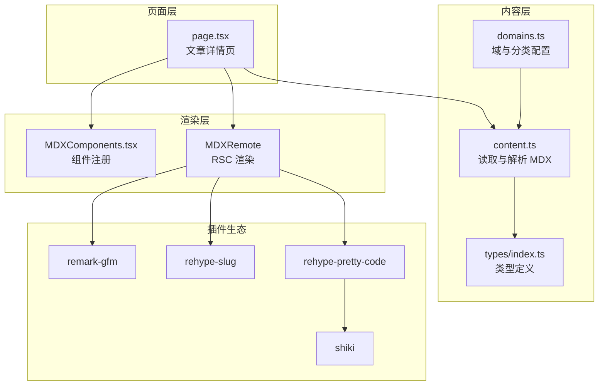
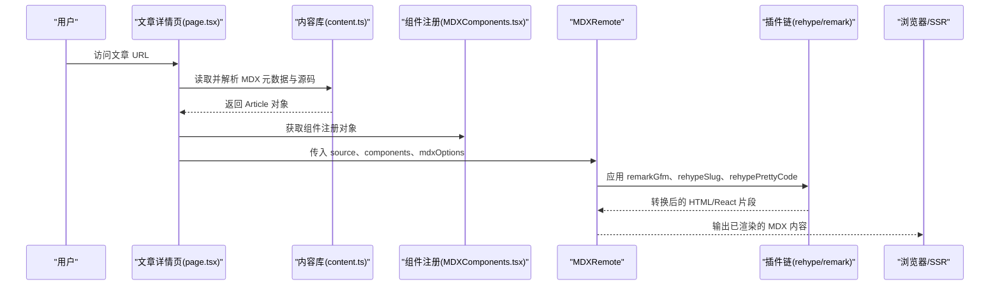
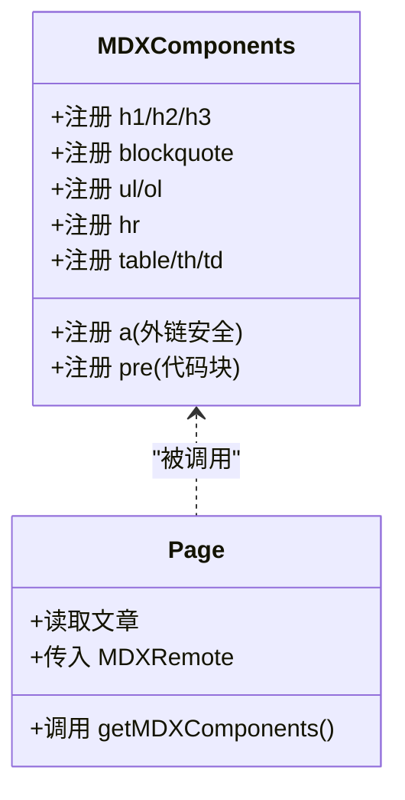
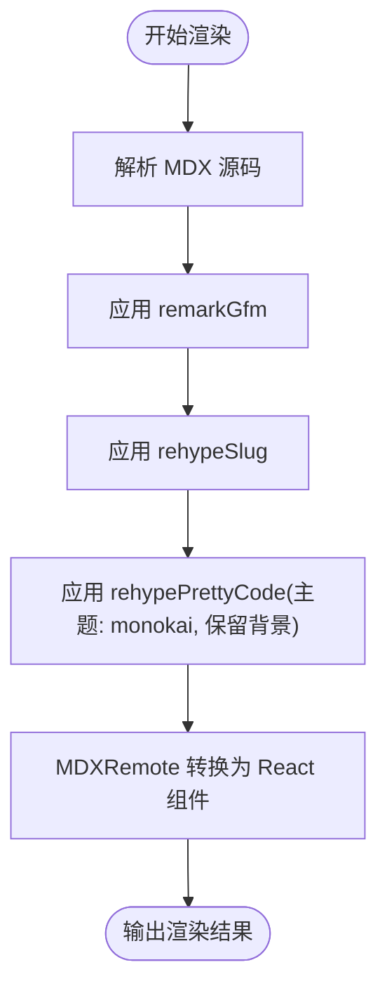
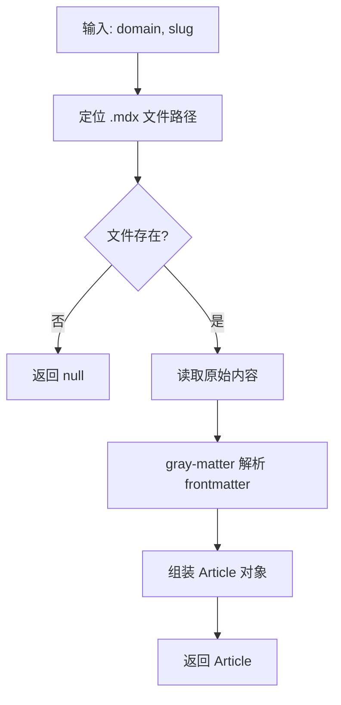
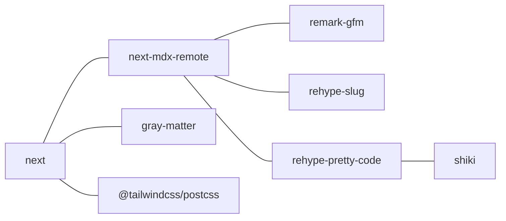

# MDX 渲染组件

<cite>
**本文引用的文件**
- [MDXComponents.tsx](file://src/components/article/MDXComponents.tsx)
- [page.tsx](file://src/app/[domain]/[slug]/page.tsx)
- [content.ts](file://src/lib/content.ts)
- [domains.ts](file://src/lib/domains.ts)
- [index.ts](file://src/types/index.ts)
- [package.json](file://package.json)
- [next.config.ts](file://next.config.ts)
- [postcss.config.mjs](file://postcss.config.mjs)
- [spring-boot-intro.mdx](file://content/software-dev-languages/java/spring-boot-intro.mdx)
- [kafka-core-concepts.mdx](file://content/distributed-architecture/message-queue/kafka-core-concepts.mdx)
- [ddd-bounded-context.mdx](file://content/software-design/ddd/ddd-bounded-context.mdx)
</cite>

## 目录
1. [简介](#简介)
2. [项目结构](#项目结构)
3. [核心组件](#核心组件)
4. [架构总览](#架构总览)
5. [详细组件分析](#详细组件分析)
6. [依赖分析](#依赖分析)
7. [性能考虑](#性能考虑)
8. [故障排除指南](#故障排除指南)
9. [结论](#结论)
10. [附录](#附录)

## 简介
本文件面向 blog_new 项目的 MDX 渲染组件，系统性阐述从内容解析到 React 组件转换的完整流程，重点覆盖以下方面：
- MDX 组件注册机制与配置方法：包括标题、链接、列表、表格、代码块等默认组件的自定义渲染，以及如何扩展自定义组件。
- 插件链路与渲染管线：Remark/GFM、Rehype Slug、Rehype Pretty Code 等插件的作用与参数。
- 代码高亮：主题选择、背景保留、语法支持来源（Shiki）与可定制项。
- 自定义组件：注册方式、属性传递、事件处理与最佳实践。
- 性能优化：缓存策略、静态生成、按需渲染与资源加载。
- 错误处理：空内容、未找到文章、插件异常的兜底方案。
- 常见场景与排障：代码块高亮问题、外链安全、表格溢出、链接跳转行为等。

## 项目结构
本项目采用 Next.js App Router 结构，MDX 文章内容位于 content 目录，页面通过 RSC 的 MDXRemote 进行服务端渲染。关键路径如下：
- 页面入口：src/app/[domain]/[slug]/page.tsx
- MDX 组件注册：src/components/article/MDXComponents.tsx
- 内容读取与元数据解析：src/lib/content.ts
- 域与分类配置：src/lib/domains.ts
- 类型定义：src/types/index.ts
- 依赖与插件：package.json
- 构建配置：next.config.ts、postcss.config.mjs

图表来源
- [page.tsx:1-100](file://src/app/[domain]/[slug]/page.tsx#L1-L100)
- [content.ts:1-158](file://src/lib/content.ts#L1-L158)
- [domains.ts:1-136](file://src/lib/domains.ts#L1-L136)
- [index.ts:1-45](file://src/types/index.ts#L1-L45)
- [MDXComponents.tsx:1-70](file://src/components/article/MDXComponents.tsx#L1-L70)
- [package.json:1-36](file://package.json#L1-L36)

章节来源
- [page.tsx:1-100](file://src/app/[domain]/[slug]/page.tsx#L1-L100)
- [content.ts:1-158](file://src/lib/content.ts#L1-L158)
- [domains.ts:1-136](file://src/lib/domains.ts#L1-L136)
- [index.ts:1-45](file://src/types/index.ts#L1-L45)
- [MDXComponents.tsx:1-70](file://src/components/article/MDXComponents.tsx#L1-L70)
- [package.json:1-36](file://package.json#L1-L36)
- [next.config.ts:1-8](file://next.config.ts#L1-L8)
- [postcss.config.mjs:1-8](file://postcss.config.mjs#L1-L8)

## 核心组件
本节聚焦 MDX 渲染的核心组件与配置要点，涵盖组件注册、插件链路与渲染选项。

- 组件注册与样式
  - 标题 h1/h2/h3：统一字体、间距与颜色，确保层级清晰。
  - 链接 a：自动识别外链并设置 target 与 rel；内链保持原窗口打开。
  - 引用块 blockquote：带边框与斜体，强调引用语境。
  - 列表 ul/ol：缩进与间距一致，文本颜色与正文协调。
  - 分隔线 hr：统一边框样式。
  - 表格 table/th/td：容器包裹以支持横向滚动，单元格边框与背景区分层级。
  - 代码块 pre：固定背景色与滚动容器，便于长代码阅读。

- 插件链路与渲染选项
  - remarkGfm：启用 GitHub 风格的表格、任务列表等语法。
  - rehypeSlug：为标题生成锚点，便于导航与分享。
  - rehypePrettyCode：代码高亮，基于 Shiki 语法包，支持 monokai 主题与背景保留。
  - MDXRemote：服务端渲染 MDX，传入组件注册对象与 mdxOptions。

- 内容解析与元数据
  - gray-matter 解析 frontmatter，提取标题、日期、摘要、标签、分类、域等信息。
  - React 缓存装饰器用于静态生成与 SSR 的性能优化。

章节来源
- [MDXComponents.tsx:1-70](file://src/components/article/MDXComponents.tsx#L1-L70)
- [page.tsx:1-100](file://src/app/[domain]/[slug]/page.tsx#L1-L100)
- [content.ts:1-158](file://src/lib/content.ts#L1-L158)
- [package.json:1-36](file://package.json#L1-L36)

## 架构总览
MDX 渲染从“内容解析”到“React 组件”的完整流程如下：

图表来源
- [page.tsx:1-100](file://src/app/[domain]/[slug]/page.tsx#L1-L100)
- [content.ts:102-131](file://src/lib/content.ts#L102-L131)
- [MDXComponents.tsx:3-69](file://src/components/article/MDXComponents.tsx#L3-L69)
- [package.json:11-24](file://package.json#L11-L24)

## 详细组件分析

### 组件注册机制与配置
- 注册入口
  - getMDXComponents 返回一个 MDXComponents 映射，键为 HTML 标签名，值为 React 组件工厂函数。
  - 支持 h1/h2/h3、a、blockquote、pre、ul/ol、hr、table/th/td 等。
- 链接处理
  - 外链自动添加 target="_blank" 与 rel="noopener noreferrer"，提升安全性。
  - 内链保持原窗口打开，避免不必要的跳转。
- 表格与列表
  - 表格外层包裹滚动容器，避免超宽导致布局破坏。
  - 列表缩进与间距统一，文本颜色与正文一致。
- 代码块
  - 固定背景色与滚动容器，提升可读性。
  - 与 rehype-pretty-code 配合实现高亮。

图表来源
- [MDXComponents.tsx:3-69](file://src/components/article/MDXComponents.tsx#L3-L69)
- [page.tsx:38-95](file://src/app/[domain]/[slug]/page.tsx#L38-L95)

章节来源
- [MDXComponents.tsx:1-70](file://src/components/article/MDXComponents.tsx#L1-L70)
- [page.tsx:20-95](file://src/app/[domain]/[slug]/page.tsx#L20-L95)

### 渲染流程与插件链路
- 插件作用
  - remark-gfm：增强 Markdown 语法，如表格、任务列表。
  - rehypeSlug：为标题生成锚点，便于导航。
  - rehypePrettyCode：基于 Shiki 的代码高亮，支持主题与背景保留。
- 渲染选项
  - mdxOptions 中配置 remarkPlugins 与 rehypePlugins 数组。
  - rehypePrettyCode 的主题与背景可通过对象参数配置。
- 代码高亮配置
  - 主题：monokai
  - 背景：keepBackground=true
  - 语法支持：由 shiki 提供，无需额外配置

图表来源
- [page.tsx:80-94](file://src/app/[domain]/[slug]/page.tsx#L80-L94)
- [package.json:19-24](file://package.json#L19-L24)

章节来源
- [page.tsx:1-100](file://src/app/[domain]/[slug]/page.tsx#L1-L100)
- [package.json:1-36](file://package.json#L1-L36)

### 内容解析与元数据
- 文件读取
  - 遍历 content 目录下的 .mdx 文件，读取原始内容。
- Frontmatter 解析
  - 使用 gray-matter 提取标题、日期、摘要、标签、分类、域、草稿标记等。
- 缓存策略
  - 使用 React 缓存装饰器对查询函数进行缓存，减少重复 IO 与解析成本。
- 静态生成
  - generateStaticParams 与 getAllArticleSlugs 支持静态预渲染。

图表来源
- [content.ts:102-131](file://src/lib/content.ts#L102-L131)

章节来源
- [content.ts:1-158](file://src/lib/content.ts#L1-L158)
- [domains.ts:1-136](file://src/lib/domains.ts#L1-L136)
- [index.ts:1-45](file://src/types/index.ts#L1-L45)

### 自定义组件注册与使用规范
- 注册方式
  - 在 getMDXComponents 中新增键值对，键为组件名（如 my-component），值为 React 组件工厂函数。
  - 组件工厂函数接收 children 与属性，并返回 JSX。
- 属性传递
  - MDXRemote 将属性透传给注册组件，可在组件内部解构使用。
  - 注意属性命名与 HTML 标签差异，避免冲突。
- 事件处理
  - 在组件工厂函数中绑定事件处理器，确保事件在客户端生效。
  - 对于交互式组件，建议在客户端组件中实现，避免在纯服务端组件中使用 DOM API。
- 最佳实践
  - 组件职责单一，避免过度复杂。
  - 保持与现有样式体系一致，避免破坏排版。
  - 对外链、图片等资源进行安全校验与懒加载优化。

章节来源
- [MDXComponents.tsx:1-70](file://src/components/article/MDXComponents.tsx#L1-L70)
- [page.tsx:38-95](file://src/app/[domain]/[slug]/page.tsx#L38-L95)

### 常见使用场景与示例
- 代码块高亮
  - 示例：Java/Spring Boot、YAML 配置、Kafka 示例代码片段。
  - 高亮主题：monokai；背景保留：开启。
- 外链安全
  - 自动识别 http 开头的链接，设置 target 与 rel。
- 表格溢出
  - 表格外层包裹滚动容器，避免布局破坏。
- 标题锚点
  - 通过 rehypeSlug 生成锚点，便于复制链接与导航。

章节来源
- [spring-boot-intro.mdx:1-75](file://content/software-dev-languages/java/spring-boot-intro.mdx#L1-L75)
- [kafka-core-concepts.mdx:1-62](file://content/distributed-architecture/message-queue/kafka-core-concepts.mdx#L1-L62)
- [ddd-bounded-context.mdx:1-42](file://content/software-design/ddd/ddd-bounded-context.mdx#L1-L42)
- [page.tsx:80-94](file://src/app/[domain]/[slug]/page.tsx#L80-L94)

## 依赖分析
- 核心依赖
  - next-mdx-remote：服务端渲染 MDX。
  - remark-gfm：Markdown 扩展语法。
  - rehype-slug：标题锚点生成。
  - rehype-pretty-code：代码高亮。
  - shiki：语法高亮引擎。
  - gray-matter：frontmatter 解析。
- 构建与样式
  - next：Next.js 框架。
  - @tailwindcss/postcss：Tailwind CSS 集成。
  - lucide-react：图标库。

图表来源
- [package.json:11-24](file://package.json#L11-L24)
- [postcss.config.mjs:1-8](file://postcss.config.mjs#L1-L8)

章节来源
- [package.json:1-36](file://package.json#L1-L36)
- [postcss.config.mjs:1-8](file://postcss.config.mjs#L1-L8)

## 性能考虑
- 缓存策略
  - 使用 React 缓存装饰器对内容查询函数进行缓存，减少重复解析与 IO。
  - 静态生成：generateStaticParams 与 getAllArticleSlugs 支持预渲染。
- 渲染优化
  - 仅在必要时启用高亮与锚点插件，避免不必要的转换。
  - 表格与代码块容器使用滚动，减少布局抖动。
- 资源加载
  - 代码高亮主题与语法包由 Shiki 提供，无需额外打包体积。
  - 图标与样式通过 Tailwind CSS 与 Next.js 优化。

章节来源
- [content.ts:45-158](file://src/lib/content.ts#L45-L158)
- [page.tsx:10-13](file://src/app/[domain]/[slug]/page.tsx#L10-L13)

## 故障排除指南
- 未找到文章
  - 现象：返回 404。
  - 排查：确认 domain 与 slug 是否正确，frontmatter 是否包含 domain 与 category。
- 外链安全问题
  - 现象：外链未设置 target 与 rel。
  - 排查：检查链接是否以 http 开头，组件注册中是否正确判断。
- 代码高亮异常
  - 现象：代码块无高亮或主题不生效。
  - 排查：确认 rehypePrettyCode 已启用且主题配置正确；检查 Shiki 语法包是否可用。
- 表格溢出
  - 现象：表格超出屏幕宽度。
  - 排查：确认表格外层容器已包裹滚动容器。
- 插件冲突
  - 现象：渲染报错或输出异常。
  - 排查：逐项禁用插件定位问题；确保插件版本兼容。

章节来源
- [page.tsx:36-37](file://src/app/[domain]/[slug]/page.tsx#L36-L37)
- [MDXComponents.tsx:20-29](file://src/components/article/MDXComponents.tsx#L20-L29)
- [page.tsx:80-94](file://src/app/[domain]/[slug]/page.tsx#L80-L94)

## 结论
本项目通过清晰的组件注册机制与插件链路，实现了从 Markdown 到 React 组件的高效转换。借助缓存与静态生成，提升了性能与 SEO；通过外链安全、表格滚动与代码高亮等细节优化，增强了用户体验。未来可在以下方向持续演进：
- 扩展自定义组件生态，完善交互与可访问性。
- 优化高亮主题与语法包，支持更多语言与主题。
- 加强错误监控与日志记录，提升可观测性。

## 附录
- 关键配置参考
  - MDXRemote 渲染选项：mdxOptions.remarkPlugins、mdxOptions.rehypePlugins
  - rehypePrettyCode 主题与背景：theme、keepBackground
  - 链接安全：外链自动 target 与 rel
- 常用文件路径
  - 文章内容：content/{domain}/{category}/{slug}.mdx
  - 页面入口：src/app/[domain]/[slug]/page.tsx
  - 组件注册：src/components/article/MDXComponents.tsx
  - 内容解析：src/lib/content.ts
  - 域与分类：src/lib/domains.ts
  - 类型定义：src/types/index.ts