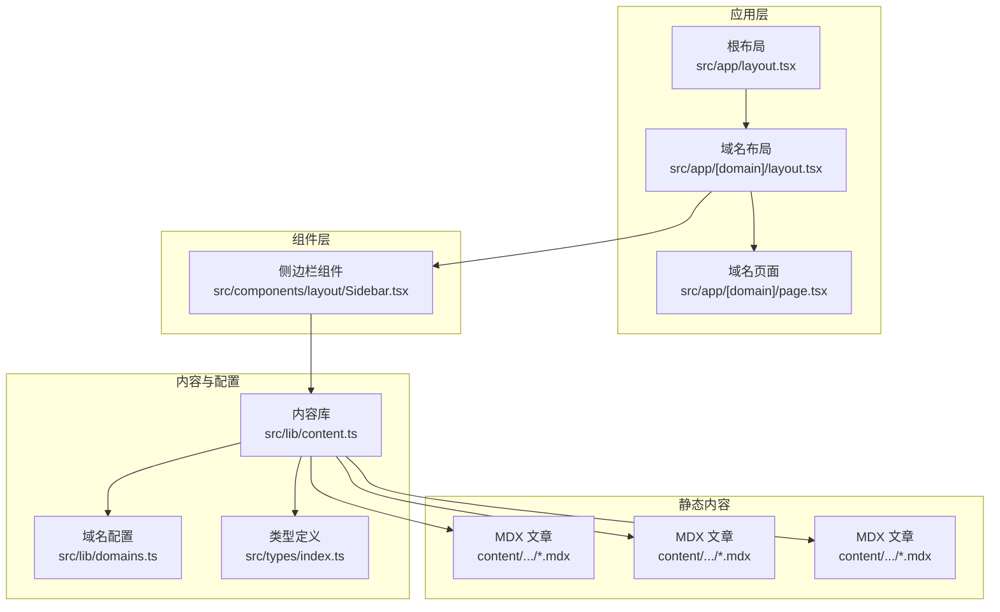
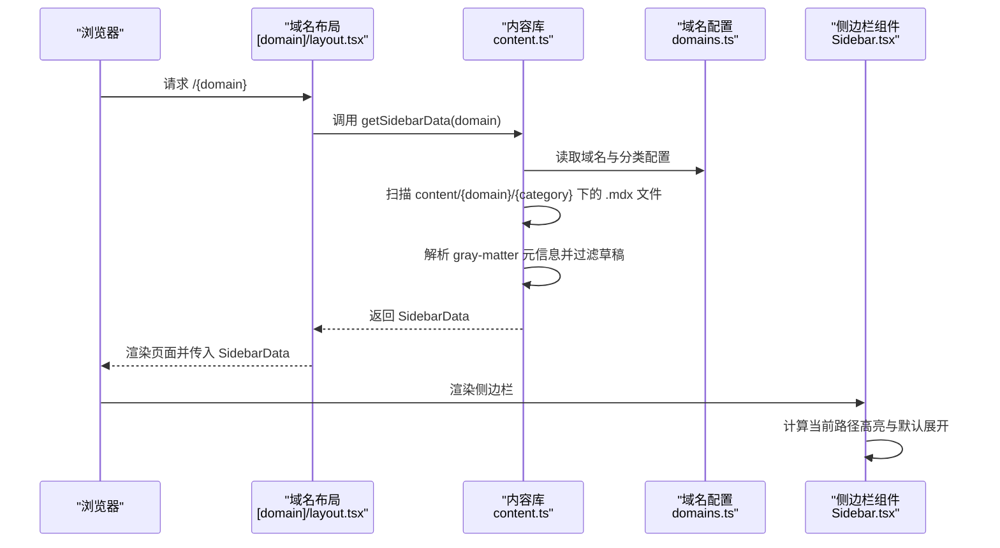
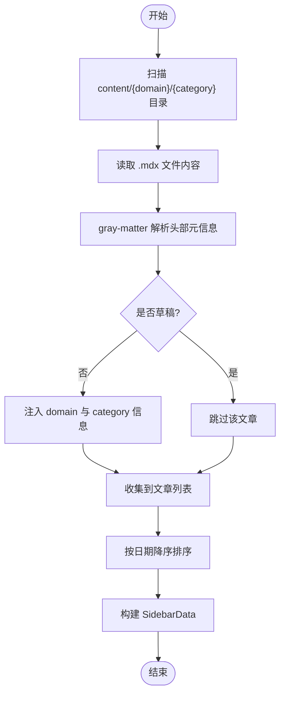
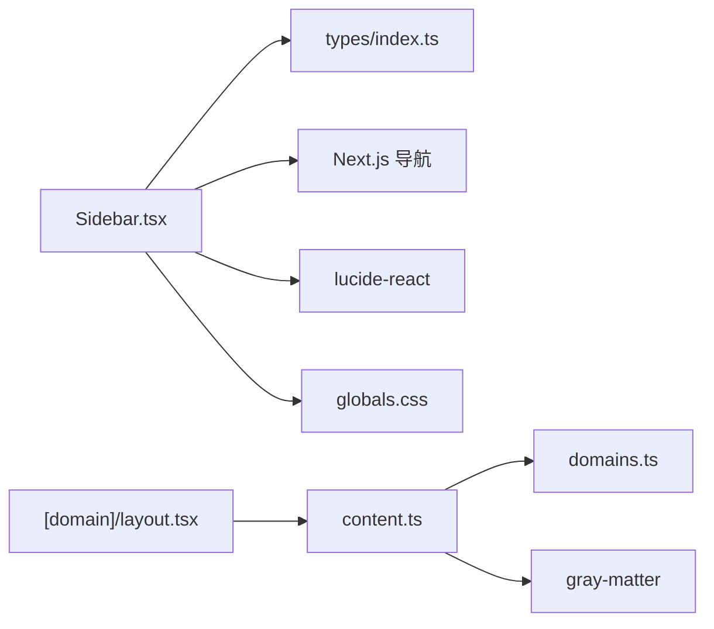

# 侧边栏组件

<cite>
**本文档引用的文件**
- [src/components/layout/Sidebar.tsx](file://src/components/layout/Sidebar.tsx)
- [src/lib/content.ts](file://src/lib/content.ts)
- [src/lib/domains.ts](file://src/lib/domains.ts)
- [src/types/index.ts](file://src/types/index.ts)
- [src/app/[domain]/layout.tsx](file://src/app/[domain]/layout.tsx)
- [src/app/[domain]/page.tsx](file://src/app/[domain]/page.tsx)
- [src/app/layout.tsx](file://src/app/layout.tsx)
- [src/app/globals.css](file://src/app/globals.css)
- [content/software-dev-languages/java/spring-boot-intro.mdx](file://content/software-dev-languages/java/spring-boot-intro.mdx)
- [content/distributed-architecture/message-queue/kafka-core-concepts.mdx](file://content/distributed-architecture/message-queue/kafka-core-concepts.mdx)
- [content/software-design/ddd/ddd-bounded-context.mdx](file://content/software-design/ddd/ddd-bounded-context.mdx)
</cite>

## 目录
1. [简介](#简介)
2. [项目结构](#项目结构)
3. [核心组件](#核心组件)
4. [架构总览](#架构总览)
5. [详细组件分析](#详细组件分析)
6. [依赖分析](#依赖分析)
7. [性能考虑](#性能考虑)
8. [故障排除指南](#故障排除指南)
9. [结论](#结论)
10. [附录](#附录)

## 简介
本文件为 blog_new 项目的侧边栏组件提供全面的技术文档。侧边栏负责展示当前域名下的分类与文章列表，并具备移动端切换、当前页面高亮、折叠展开、响应式适配等功能。其自动生成机制基于文件系统中的 MDX 内容，通过内容解析与类型化数据结构进行渲染。

## 项目结构
侧边栏组件位于布局层，与内容库、域名配置、类型定义共同协作，形成“内容采集 -> 数据聚合 -> 组件渲染”的完整链路。



图表来源
- [src/app/layout.tsx:38-60](file://src/app/layout.tsx#L38-L60)
- [src/app/[domain]/layout.tsx:10-29](file://src/app/[domain]/layout.tsx#L10-L29)
- [src/components/layout/Sidebar.tsx:13-68](file://src/components/layout/Sidebar.tsx#L13-L68)
- [src/lib/content.ts:133-146](file://src/lib/content.ts#L133-L146)
- [src/lib/domains.ts:34-136](file://src/lib/domains.ts#L34-L136)
- [src/types/index.ts:1-45](file://src/types/index.ts#L1-L45)

章节来源
- [src/app/layout.tsx:38-60](file://src/app/layout.tsx#L38-L60)
- [src/app/[domain]/layout.tsx:10-29](file://src/app/[domain]/layout.tsx#L10-L29)
- [src/components/layout/Sidebar.tsx:13-68](file://src/components/layout/Sidebar.tsx#L13-L68)
- [src/lib/content.ts:133-146](file://src/lib/content.ts#L133-L146)
- [src/lib/domains.ts:34-136](file://src/lib/domains.ts#L34-L136)
- [src/types/index.ts:1-45](file://src/types/index.ts#L1-L45)

## 核心组件
- 侧边栏组件：接收类型化的侧边栏数据，渲染域名标题、分类标题、文章列表，并处理移动端开关、折叠展开、当前页高亮。
- 内容库：负责从文件系统读取 MDX 文件、解析 YAML 头部元信息、按域名/分类聚合文章、生成侧边栏所需数据结构。
- 域名配置：声明域名与分类的元数据及顺序，作为内容扫描与导航的基础。
- 类型定义：统一 Domain、Category、ArticleMeta、SidebarData 等数据模型，确保组件与内容库之间的契约清晰。

章节来源
- [src/components/layout/Sidebar.tsx:9-11](file://src/components/layout/Sidebar.tsx#L9-L11)
- [src/lib/content.ts:133-146](file://src/lib/content.ts#L133-L146)
- [src/lib/domains.ts:3-32](file://src/lib/domains.ts#L3-L32)
- [src/types/index.ts:37-44](file://src/types/index.ts#L37-L44)

## 架构总览
侧边栏的自动生成流程如下：



图表来源
- [src/app/[domain]/layout.tsx:17-L18](file://src/app/[domain]/layout.tsx#L17-L18)
- [src/lib/content.ts:133-146](file://src/lib/content.ts#L133-L146)
- [src/lib/domains.ts:34-136](file://src/lib/domains.ts#L34-L136)
- [src/components/layout/Sidebar.tsx:46-63](file://src/components/layout/Sidebar.tsx#L46-L63)

## 详细组件分析

### 侧边栏组件（Sidebar.tsx）
- 功能职责
  - 移动端切换：底部悬浮按钮控制侧边栏显隐，点击遮罩层关闭。
  - 分类渲染：遍历 SidebarData.categories，为每个分类渲染标题与文章列表。
  - 折叠展开：根据当前页面是否属于该分类内的文章，决定默认展开状态；点击分类标题切换展开/收起。
  - 当前页高亮：计算当前路由与文章链接的匹配关系，为当前页设置强调样式。
  - 响应式适配：在桌面端使用 sticky 定位，移动端使用固定定位与平移过渡。

- 关键交互
  - 移动端开关：通过本地状态控制显示隐藏。
  - 折叠切换：每个分类维护独立的展开状态。
  - 链接跳转：使用 Next.js Link，生成形如 /{domain}/{slug} 的绝对路径。

- 样式与主题
  - 使用 Tailwind 类名控制布局、边框、背景色与过渡动画。
  - 主题变量来自全局 CSS，侧边栏背景色通过 --sidebar-bg 控制。

```mermaid
classDiagram
class Sidebar {
+props : SidebarProps
+usePathname()
+useState(mobileOpen)
+render()
}
class SidebarCategory {
+props : SidebarCategoryProps
+useState(open)
+render()
}
class SidebarProps {
+data : SidebarData
}
class SidebarCategoryProps {
+domainSlug : string
+title : string
+articles : {slug,title}[]
+defaultOpen : boolean
+currentPath : string
}
Sidebar --> SidebarCategory : "渲染多个分类"
```

图表来源
- [src/components/layout/Sidebar.tsx:13-68](file://src/components/layout/Sidebar.tsx#L13-L68)
- [src/components/layout/Sidebar.tsx:70-125](file://src/components/layout/Sidebar.tsx#L70-L125)

章节来源
- [src/components/layout/Sidebar.tsx:13-68](file://src/components/layout/Sidebar.tsx#L13-L68)
- [src/components/layout/Sidebar.tsx:70-125](file://src/components/layout/Sidebar.tsx#L70-L125)
- [src/app/globals.css:22](file://src/app/globals.css#L22)

### 数据获取流程（content.ts）
- 文件系统扫描
  - 以 CONTENT_DIR 为根，按 domain/category 结构扫描 .mdx 文件。
  - 读取文件名作为 slug，读取原始内容用于解析元信息。

- 元信息解析
  - 使用 gray-matter 解析 YAML 头部，过滤 draft=true 的文章。
  - 将 domain、category 注入到文章元信息中，确保后续渲染一致性。

- 数据聚合
  - getSidebarData：组合 Domain、Category 与对应文章列表，形成 SidebarData。
  - getArticlesByCategory：按分类返回已按日期排序的文章列表。
  - getDomainWithCategories：返回带分类的域名对象，供页面与布局使用。



图表来源
- [src/lib/content.ts:15-27](file://src/lib/content.ts#L15-L27)
- [src/lib/content.ts:29-43](file://src/lib/content.ts#L29-L43)
- [src/lib/content.ts:80-100](file://src/lib/content.ts#L80-L100)
- [src/lib/content.ts:133-146](file://src/lib/content.ts#L133-L146)

章节来源
- [src/lib/content.ts:13-158](file://src/lib/content.ts#L13-L158)

### 域名与分类配置（domains.ts）
- 域名定义：包含 slug、title、description、icon、order 等字段。
- 分类映射：按域名组织分类数组，每个分类包含 slug、title、description、order、domainSlug。
- 查询工具：提供 getDomain 与 getCategories，供内容库与布局使用。

章节来源
- [src/lib/domains.ts:3-32](file://src/lib/domains.ts#L3-L32)
- [src/lib/domains.ts:34-136](file://src/lib/domains.ts#L34-L136)

### 类型定义（index.ts）
- Domain：域名元数据。
- Category：分类元数据。
- ArticleMeta：文章元信息（不含内容）。
- Article：扩展 ArticleMeta，包含 raw MDX 内容。
- SidebarCategory：在 Category 基础上附加 articles 字段。
- SidebarData：在 Domain 基础上附加 categories 字段，作为侧边栏渲染输入。

章节来源
- [src/types/index.ts:1-45](file://src/types/index.ts#L1-L45)

### 页面集成（[domain]/layout.tsx 与 [domain]/page.tsx）
- 域名布局：调用 getSidebarData 获取 SidebarData 并传递给 Sidebar；同时为主内容区提供自适应留白。
- 域名页面：展示域名标题、描述与各分类的文章列表（非侧边栏）。

章节来源
- [src/app/[domain]/layout.tsx:10-L29](file://src/app/[domain]/layout.tsx#L10-L29)
- [src/app/[domain]/page.tsx:25-L88](file://src/app/[domain]/page.tsx#L25-L88)

### 内容示例（MDX）
- 示例文章包含 YAML 头部元信息，如 title、date、summary、tags、category、domain、draft 等，这些字段被内容库解析并参与侧边栏构建。

章节来源
- [content/software-dev-languages/java/spring-boot-intro.mdx:1-9](file://content/software-dev-languages/java/spring-boot-intro.mdx#L1-L9)
- [content/distributed-architecture/message-queue/kafka-core-concepts.mdx:1-9](file://content/distributed-architecture/message-queue/kafka-core-concepts.mdx#L1-L9)
- [content/software-design/ddd/ddd-bounded-context.mdx:1-9](file://content/software-design/ddd/ddd-bounded-context.mdx#L1-L9)

## 依赖分析
- 组件耦合
  - Sidebar 依赖 SidebarData 类型与 Next.js 导航能力（usePathname、Link）。
  - 布局层通过 getSidebarData 依赖内容库，内容库依赖域名配置与文件系统。
- 外部依赖
  - gray-matter：解析 MDX 头部元信息。
  - lucide-react：图标组件（ChevronRight、FileText、Menu、X）。
  - Tailwind CSS：样式与主题变量。



图表来源
- [src/components/layout/Sidebar.tsx:3-7](file://src/components/layout/Sidebar.tsx#L3-L7)
- [src/app/[domain]/layout.tsx:3](file://src/app/[domain]/layout.tsx#L3)
- [src/lib/content.ts:3](file://src/lib/content.ts#L3)
- [src/lib/domains.ts:1-2](file://src/lib/domains.ts#L1-L2)
- [src/app/globals.css:12-26](file://src/app/globals.css#L12-L26)

章节来源
- [src/components/layout/Sidebar.tsx:3-7](file://src/components/layout/Sidebar.tsx#L3-L7)
- [src/app/[domain]/layout.tsx:3](file://src/app/[domain]/layout.tsx#L3)
- [src/lib/content.ts:3](file://src/lib/content.ts#L3)
- [src/lib/domains.ts:1-2](file://src/lib/domains.ts#L1-L2)
- [src/app/globals.css:12-26](file://src/app/globals.css#L12-L26)

## 性能考虑
- 数据缓存
  - 内容库函数普遍使用 React 缓存装饰器，避免重复 IO 与解析，提升 SSR/SSG 性能。
- 异步聚合
  - 侧边栏数据通过 Promise.all 并行获取各分类的文章列表，减少等待时间。
- 文件系统扫描
  - 仅扫描 .mdx 文件，过滤草稿，降低无效处理。
- 样式与渲染
  - 使用 CSS 变量与 Tailwind 类名，避免运行时复杂计算；移动端过渡使用 transform，利用 GPU 加速。

章节来源
- [src/lib/content.ts:45-78](file://src/lib/content.ts#L45-L78)
- [src/lib/content.ts:133-146](file://src/lib/content.ts#L133-L146)

## 故障排除指南
- 侧边栏为空
  - 检查域名与分类配置是否正确，确认 content/{domain}/{category} 目录存在且包含 .mdx 文件。
  - 确认 MDX 头部包含有效的 category 与 domain 字段。
- 当前页未高亮
  - 确认当前路径与文章链接格式一致（/domain/slug），检查 usePathname 返回值。
- 折叠状态异常
  - 确认 hasActiveArticle 判断逻辑基于 pathname 与 /{domain}/{slug} 的匹配。
- 移动端无法关闭
  - 检查遮罩层点击事件与 mobileOpen 状态切换逻辑。
- 样式异常
  - 检查 --sidebar-bg 等主题变量是否在全局 CSS 中定义。

章节来源
- [src/lib/domains.ts:34-136](file://src/lib/domains.ts#L34-L136)
- [src/lib/content.ts:13-158](file://src/lib/content.ts#L13-L158)
- [src/components/layout/Sidebar.tsx:46-63](file://src/components/layout/Sidebar.tsx#L46-L63)
- [src/app/globals.css:12-26](file://src/app/globals.css#L12-L26)

## 结论
侧边栏组件通过“内容库 + 域名配置 + 类型定义”的协作，实现了从文件系统到 UI 的自动化渲染。其交互与样式设计兼顾可用性与性能，适合在多域名、多分类的内容站点中稳定运行。建议在新增内容时遵循 MDX 头部字段规范，并在新增域名或分类时同步更新配置，以确保侧边栏数据的完整性与一致性。

## 附录
- 配置选项
  - 域名与分类：在域名配置中添加新的 domain 或 category，即可自动出现在侧边栏。
  - 主题定制：通过修改 CSS 变量（如 --sidebar-bg、--accent）调整侧边栏外观。
- 交互行为
  - 移动端：点击悬浮按钮打开/关闭侧边栏，点击遮罩层关闭。
  - 折叠展开：点击分类标题切换子项显示；若当前页属于该分类，则默认展开。
  - 高亮策略：当前路径与文章链接完全匹配时高亮。
- 协调机制
  - 布局层负责数据准备与传递，侧边栏专注渲染与交互；主内容区由域名页面负责展示分类与文章列表，二者互不干扰。

章节来源
- [src/lib/domains.ts:3-32](file://src/lib/domains.ts#L3-L32)
- [src/app/globals.css:12-26](file://src/app/globals.css#L12-L26)
- [src/components/layout/Sidebar.tsx:19-65](file://src/components/layout/Sidebar.tsx#L19-L65)
- [src/app/[domain]/layout.tsx:22-L28](file://src/app/[domain]/layout.tsx#L22-L28)