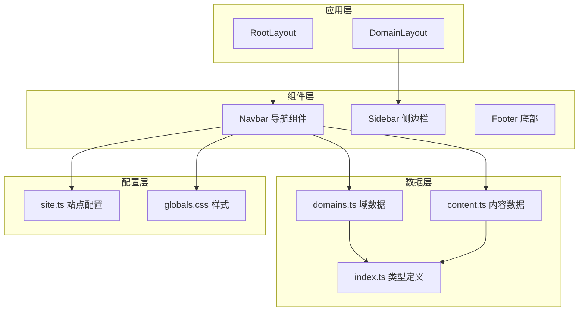
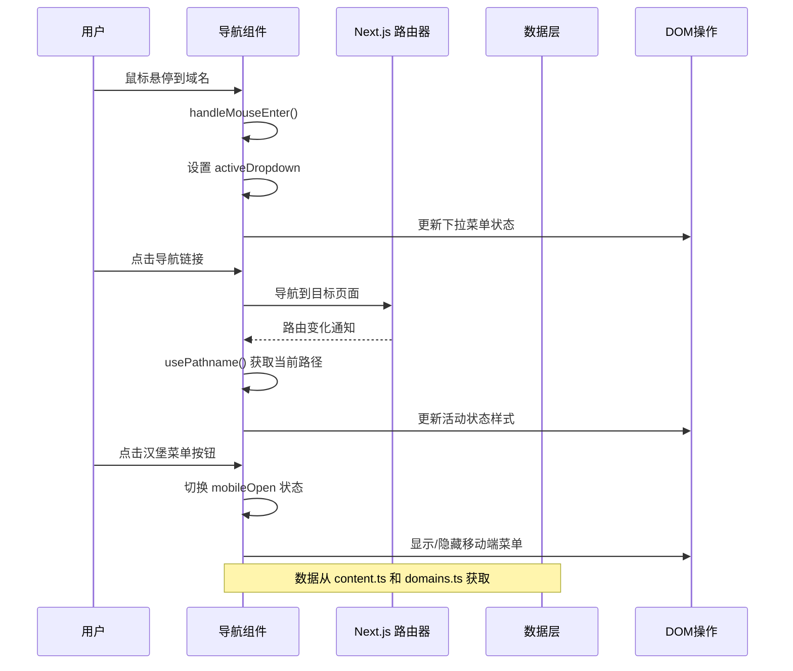
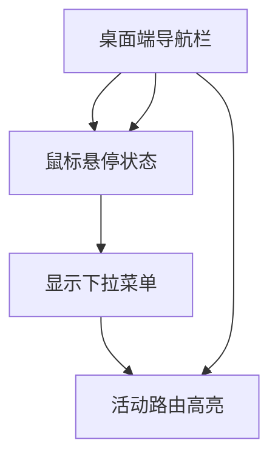
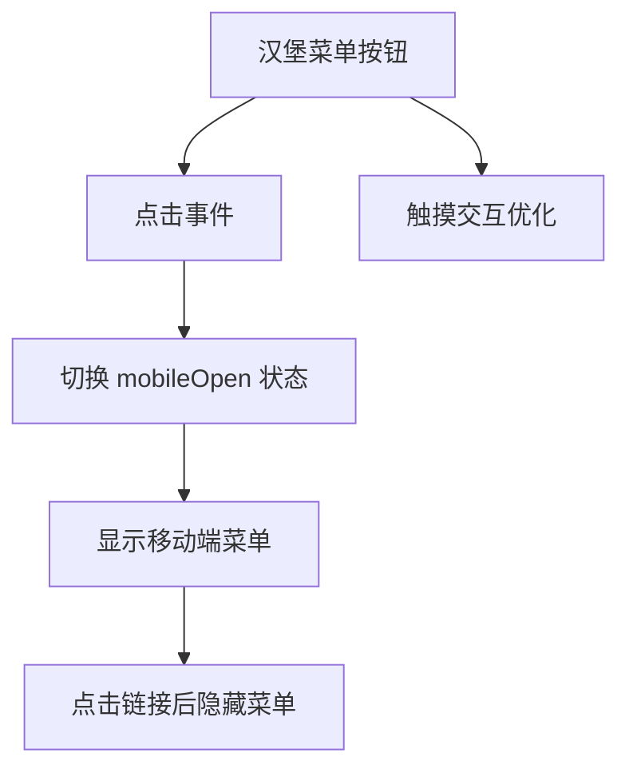
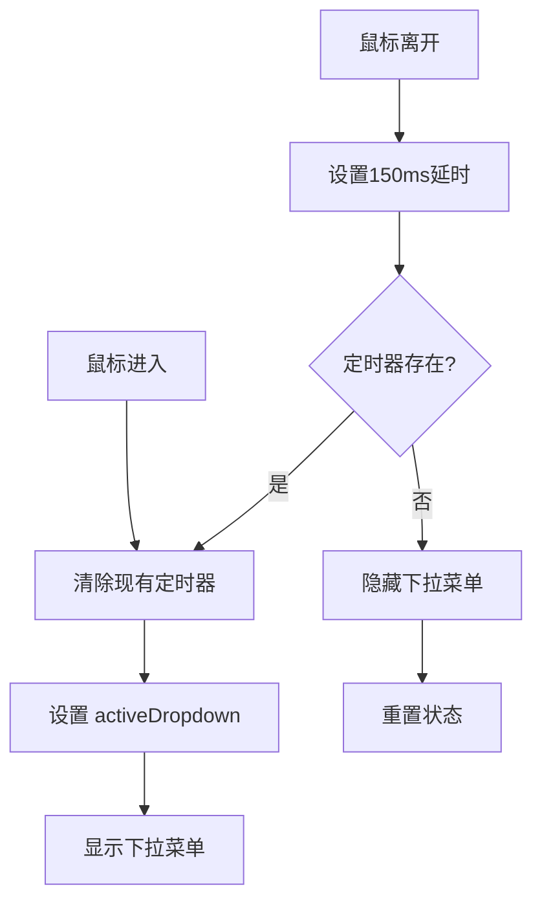
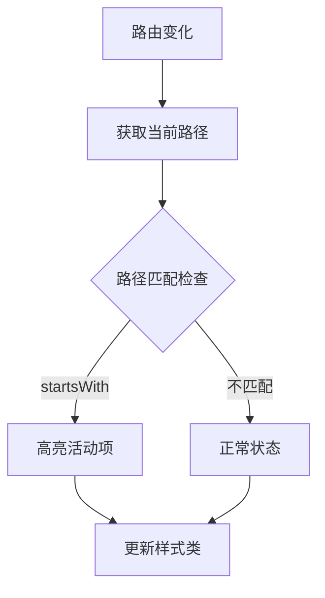
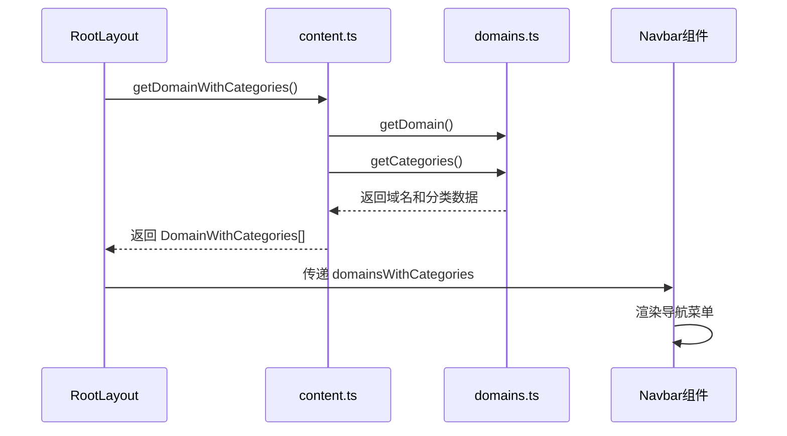
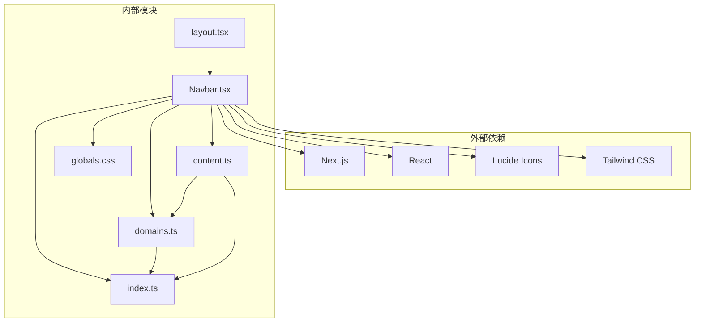

# 导航组件

<cite>
**本文档引用的文件**
- [Navbar.tsx](file://src/components/layout/Navbar.tsx)
- [domains.ts](file://src/lib/domains.ts)
- [content.ts](file://src/lib/content.ts)
- [index.ts](file://src/types/index.ts)
- [layout.tsx](file://src/app/layout.tsx)
- [globals.css](file://src/app/globals.css)
</cite>

## 目录
1. [简介](#简介)
2. [项目结构](#项目结构)
3. [核心组件](#核心组件)
4. [架构概览](#架构概览)
5. [详细组件分析](#详细组件分析)
6. [依赖关系分析](#依赖关系分析)
7. [性能考虑](#性能考虑)
8. [故障排除指南](#故障排除指南)
9. [结论](#结论)

## 简介

导航组件是 blog_new 博客系统的核心界面元素，负责提供用户在不同技术领域之间的导航。该组件实现了响应式设计，支持桌面端的下拉菜单和移动端的汉堡菜单两种交互模式。组件通过 Next.js 的客户端组件特性实现动态状态管理，包括鼠标悬停状态控制、活动路由检测和动画过渡效果。

## 项目结构

导航组件位于项目的组件层中，采用模块化设计，与其他组件形成清晰的层次结构：



**图表来源**
- [layout.tsx:38-60](file://src/app/layout.tsx#L38-L60)
- [Navbar.tsx:13-141](file://src/components/layout/Navbar.tsx#L13-L141)

**章节来源**
- [layout.tsx:1-61](file://src/app/layout.tsx#L1-L61)
- [Navbar.tsx:1-141](file://src/components/layout/Navbar.tsx#L1-L141)

## 核心组件

导航组件采用函数式组件设计，使用 React Hooks 实现状态管理。组件接收 `domainsWithCategories` 作为 props，这是一个包含域名及其分类信息的数组。

### 属性接口定义

导航组件的属性接口定义如下：

```typescript
interface NavbarProps {
  domainsWithCategories: DomainWithCategories[];
}
```

其中 `DomainWithCategories` 接口继承自 `Domain` 接口，并添加了 `categories` 属性：

```typescript
interface DomainWithCategories extends Domain {
  categories: Category[];
}

interface Domain {
  slug: string;
  title: string;
  description: string;
  icon: string;
  order: number;
}

interface Category {
  slug: string;
  title: string;
  description: string;
  order: number;
  domainSlug: string;
}
```

### 状态管理机制

组件内部维护三个关键状态：
- `mobileOpen`: 控制移动端菜单的显示/隐藏状态
- `activeDropdown`: 跟踪当前激活的下拉菜单项
- `timeoutRef`: 存储定时器引用，用于处理鼠标悬停的延迟逻辑

**章节来源**
- [Navbar.tsx:9-11](file://src/components/layout/Navbar.tsx#L9-L11)
- [index.ts:1-45](file://src/types/index.ts#L1-L45)

## 架构概览

导航组件的架构设计体现了清晰的关注点分离和数据流管理：



**图表来源**
- [Navbar.tsx:13-141](file://src/components/layout/Navbar.tsx#L13-L141)
- [content.ts:49-56](file://src/lib/content.ts#L49-L56)
- [domains.ts:129-135](file://src/lib/domains.ts#L129-L135)

## 详细组件分析

### 响应式设计实现

导航组件实现了完整的响应式设计，针对不同屏幕尺寸提供优化的用户体验：

#### 桌面端布局
桌面端使用水平导航栏，每个域名项包含下拉菜单功能：



**图表来源**
- [Navbar.tsx:48-94](file://src/components/layout/Navbar.tsx#L48-L94)

#### 移动端布局
移动端采用汉堡菜单设计，点击按钮展开完整导航菜单：



**图表来源**
- [Navbar.tsx:96-137](file://src/components/layout/Navbar.tsx#L96-L137)

### 鼠标悬停状态管理

组件实现了精细的鼠标悬停状态管理，通过防抖机制避免频繁的状态切换：



**图表来源**
- [Navbar.tsx:19-28](file://src/components/layout/Navbar.tsx#L19-L28)

### 活动路由检测

组件使用 Next.js 的 `usePathname` Hook 实现智能的活动路由检测：



**图表来源**
- [Navbar.tsx:14](file://src/components/layout/Navbar.tsx#L14)
- [Navbar.tsx:59-63](file://src/components/layout/Navbar.tsx#L59-L63)

### 动画过渡效果

组件实现了多种动画过渡效果，提升用户体验：

#### 下拉菜单动画
- 使用 `transition-transform` 实现箭头旋转动画
- 通过 `transition-opacity` 控制菜单显示/隐藏
- 结合 `transform` 属性实现平滑的展开效果

#### 链接悬停动画
- 背景色渐变过渡
- 文字颜色变化动画
- 阴影效果的平滑切换

**章节来源**
- [Navbar.tsx:68-71](file://src/components/layout/Navbar.tsx#L68-L71)
- [Navbar.tsx:59-63](file://src/components/layout/Navbar.tsx#L59-L63)

### 数据结构使用方式

导航组件通过以下数据结构实现灵活的内容组织：

#### 域名数据结构
```typescript
interface Domain {
  slug: string;
  title: string;
  description: string;
  icon: string;
  order: number;
}
```

#### 分类数据结构
```typescript
interface Category {
  slug: string;
  title: string;
  description: string;
  order: number;
  domainSlug: string;
}
```

#### 组合数据结构
```typescript
interface DomainWithCategories extends Domain {
  categories: Category[];
}
```

**章节来源**
- [index.ts:1-45](file://src/types/index.ts#L1-L45)
- [domains.ts:3-32](file://src/lib/domains.ts#L3-L32)

### Props 接收和处理流程

导航组件的数据流处理流程如下：



**图表来源**
- [layout.tsx:43-47](file://src/app/layout.tsx#L43-L47)
- [content.ts:49-56](file://src/lib/content.ts#L49-L56)
- [domains.ts:129-135](file://src/lib/domains.ts#L129-L135)

**章节来源**
- [layout.tsx:43-47](file://src/app/layout.tsx#L43-L47)
- [content.ts:49-56](file://src/lib/content.ts#L49-L56)

### 事件处理函数

导航组件实现了多个事件处理函数来管理用户交互：

#### 鼠标事件处理
- `handleMouseEnter(slug)`: 处理鼠标悬停事件，设置激活的下拉菜单
- `handleMouseLeave()`: 处理鼠标离开事件，延迟隐藏下拉菜单

#### 点击事件处理
- `handleLinkClick()`: 处理导航链接点击，关闭移动端菜单并重置下拉状态

#### 菜单切换处理
- `setMobileOpen(!mobileOpen)`: 切换移动端菜单的显示状态

**章节来源**
- [Navbar.tsx:19-33](file://src/components/layout/Navbar.tsx#L19-L33)

### 可复用性设计

导航组件采用了多项设计原则确保其可复用性和可扩展性：

#### 组件解耦
- 通过 props 接收数据，避免硬编码依赖
- 使用类型安全的接口定义，确保数据结构一致性

#### 状态隔离
- 将 UI 状态与业务逻辑分离
- 使用 React Hooks 管理组件本地状态

#### 样式抽象
- 使用 CSS 变量和 Tailwind 类名实现主题化
- 支持通过全局样式定制外观

### 扩展方法

导航组件提供了多种扩展途径：

#### 新增导航项
通过修改 `domains.ts` 文件中的 `domains` 数组即可添加新的技术领域。

#### 自定义样式
通过修改 `globals.css` 中的主题变量可以轻松调整导航组件的外观。

#### 功能增强
可以扩展组件以支持搜索功能、用户认证状态显示等高级特性。

**章节来源**
- [domains.ts:3-32](file://src/lib/domains.ts#L3-L32)
- [globals.css:12-45](file://src/app/globals.css#L12-L45)

## 依赖关系分析

导航组件的依赖关系体现了清晰的分层架构：



**图表来源**
- [Navbar.tsx:3-7](file://src/components/layout/Navbar.tsx#L3-L7)
- [layout.tsx:3-7](file://src/app/layout.tsx#L3-L7)

### 直接依赖分析

导航组件的直接依赖包括：
- **React**: 提供组件基础框架和 Hooks
- **Next.js**: 提供路由和导航功能
- **Lucide Icons**: 提供图标组件
- **Tailwind CSS**: 提供样式系统

### 间接依赖分析

组件通过数据层间接依赖：
- **domains.ts**: 提供静态域名配置
- **content.ts**: 提供动态内容数据
- **types.ts**: 提供类型定义

**章节来源**
- [Navbar.tsx:3-7](file://src/components/layout/Navbar.tsx#L3-L7)
- [layout.tsx:3-7](file://src/app/layout.tsx#L3-L7)

## 性能考虑

导航组件在设计时充分考虑了性能优化：

### 渲染优化
- 使用 React 的 `usePathname` Hook 实现精确的路由状态更新
- 通过条件渲染避免不必要的 DOM 更新
- 使用 CSS 过渡而非 JavaScript 动画减少计算开销

### 数据缓存
- 使用 `cache` 装饰器缓存异步数据获取结果
- 避免重复的数据请求和解析操作

### 内存管理
- 合理使用定时器，避免内存泄漏
- 在组件卸载时清理定时器引用

## 故障排除指南

### 常见问题及解决方案

#### 下拉菜单不显示
**症状**: 鼠标悬停时下拉菜单不出现
**可能原因**: 
- CSS 样式冲突
- JavaScript 错误阻止状态更新
- 路由配置问题

**解决方案**:
- 检查 CSS 类名是否正确应用
- 查看浏览器控制台是否有错误信息
- 验证路由路径配置

#### 移动端菜单无法打开
**症状**: 点击汉堡菜单按钮无反应
**可能原因**:
- 事件处理器绑定失败
- CSS 媒体查询问题
- JavaScript 错误

**解决方案**:
- 检查按钮的 `onClick` 事件绑定
- 验证移动端断点设置
- 确认 `mobileOpen` 状态正确更新

#### 活动路由高亮异常
**症状**: 当前页面的导航项未正确高亮
**可能原因**:
- 路由路径匹配逻辑错误
- `usePathname` Hook 返回值异常
- CSS 样式覆盖问题

**解决方案**:
- 检查 `pathname.startsWith()` 匹配逻辑
- 验证路由参数传递
- 确认样式优先级设置

**章节来源**
- [Navbar.tsx:19-33](file://src/components/layout/Navbar.tsx#L19-L33)
- [Navbar.tsx:59-63](file://src/components/layout/Navbar.tsx#L59-L63)

## 结论

导航组件是 blog_new 博客系统中设计精良的 UI 组件，成功实现了响应式设计、状态管理和数据驱动的架构模式。组件通过清晰的接口定义、完善的事件处理机制和优雅的动画效果，为用户提供了优秀的导航体验。

组件的主要优势包括：
- **响应式设计**: 完美适配桌面端和移动端设备
- **状态管理**: 通过 React Hooks 实现高效的状态控制
- **数据驱动**: 基于类型安全的数据结构实现灵活的内容组织
- **可扩展性**: 模块化的架构设计便于功能扩展和维护

未来可以考虑的改进方向：
- 添加搜索功能支持
- 实现用户个性化配置
- 增强无障碍访问支持
- 优化移动端触摸交互体验