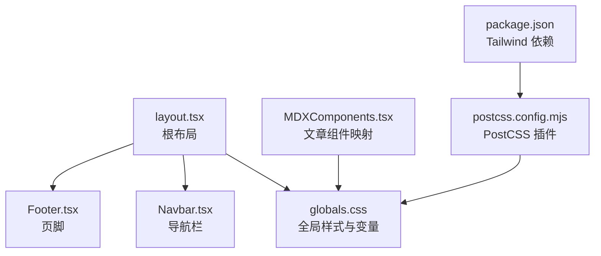
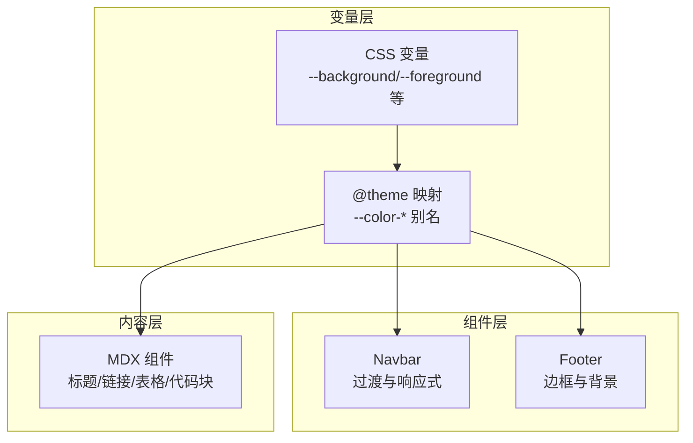
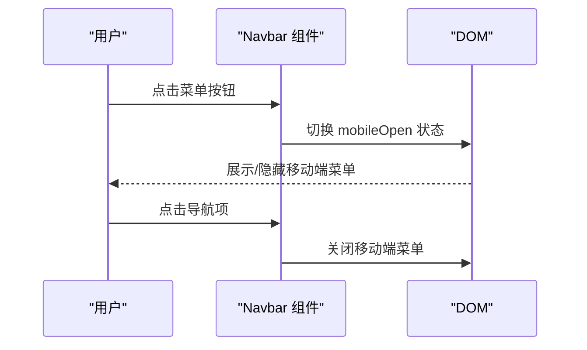
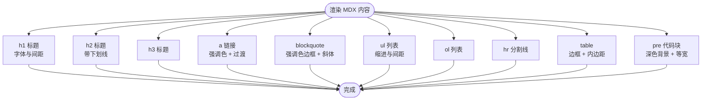
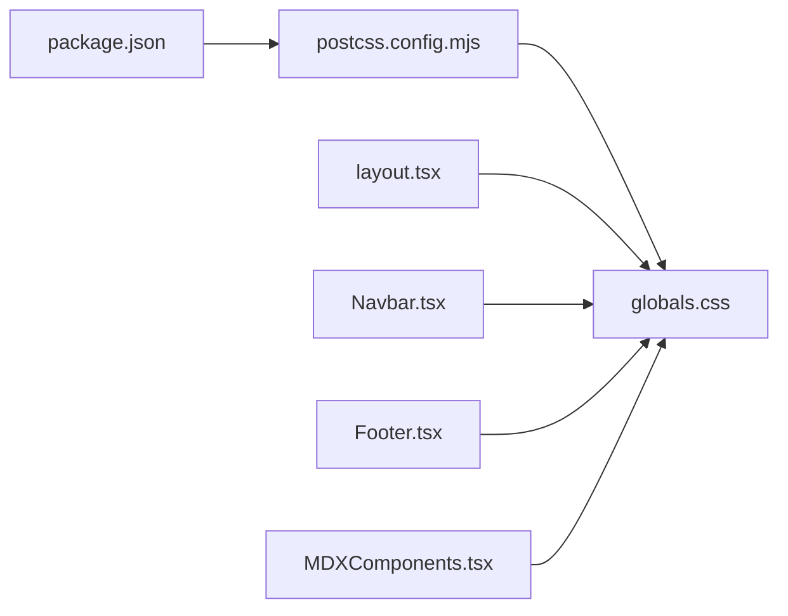

# 样式系统

<cite>
**本文引用的文件**
- [src/app/globals.css](file://src/app/globals.css)
- [postcss.config.mjs](file://postcss.config.mjs)
- [package.json](file://package.json)
- [src/app/layout.tsx](file://src/app/layout.tsx)
- [src/components/layout/Navbar.tsx](file://src/components/layout/Navbar.tsx)
- [src/components/layout/Footer.tsx](file://src/components/layout/Footer.tsx)
- [src/components/article/MDXComponents.tsx](file://src/components/article/MDXComponents.tsx)
- [src/lib/domains.ts](file://src/lib/domains.ts)
</cite>

## 目录
1. [简介](#简介)
2. [项目结构](#项目结构)
3. [核心组件](#核心组件)
4. [架构总览](#架构总览)
5. [详细组件分析](#详细组件分析)
6. [依赖关系分析](#依赖关系分析)
7. [性能考量](#性能考量)
8. [故障排查指南](#故障排查指南)
9. [结论](#结论)
10. [附录](#附录)

## 简介
本项目采用 Tailwind CSS 作为主要样式框架，并通过 PostCSS 插件链路进行构建。样式系统以“变量驱动 + 组件化”为核心理念：在全局 CSS 中集中定义主题变量与字体族，结合 Tailwind 的原子类与过渡动效，实现一致的视觉语言与良好的响应式体验。同时，MDX 文章内容通过组件化封装，确保正文排版风格统一。

## 项目结构
样式系统的关键文件分布如下：
- 全局样式入口：src/app/globals.css
- 布局与根节点：src/app/layout.tsx
- 导航与页脚：src/components/layout/Navbar.tsx、src/components/layout/Footer.tsx
- 文章内容组件：src/components/article/MDXComponents.tsx
- PostCSS 配置：postcss.config.mjs
- 依赖声明：package.json

图表来源
- [src/app/layout.tsx:1-53](file://src/app/layout.tsx#L1-L53)
- [src/app/globals.css:1-99](file://src/app/globals.css#L1-L99)
- [src/components/layout/Navbar.tsx:1-78](file://src/components/layout/Navbar.tsx#L1-L78)
- [src/components/layout/Footer.tsx:1-21](file://src/components/layout/Footer.tsx#L1-L21)
- [src/components/article/MDXComponents.tsx:1-70](file://src/components/article/MDXComponents.tsx#L1-L70)
- [postcss.config.mjs:1-8](file://postcss.config.mjs#L1-L8)
- [package.json:1-36](file://package.json#L1-L36)

章节来源
- [src/app/globals.css:1-99](file://src/app/globals.css#L1-L99)
- [src/app/layout.tsx:1-53](file://src/app/layout.tsx#L1-L53)
- [postcss.config.mjs:1-8](file://postcss.config.mjs#L1-L8)
- [package.json:1-36](file://package.json#L1-L36)

## 核心组件
- 主题变量与字体族
  - 在全局 CSS 中定义了丰富的 CSS 变量（背景、前景、强调色、边框、卡片、导航等），并通过 @theme 将其映射为 Tailwind 可用的主题变量，实现“变量驱动”的样式体系。
  - 字体族通过 Next Font Google 注入变量，分别用于无衬线、衬线与等宽字体，配合全局 body 使用。
- 导航栏
  - 使用响应式断点控制桌面端与移动端菜单显示；交互态通过 transition-colors 实现平滑过渡。
- 页脚
  - 使用边框与背景变量，保持与整体风格一致。
- 文章内容组件
  - 对标题、链接、引用、表格、代码块等元素进行统一样式封装，确保 Markdown 渲染结果的一致性。

章节来源
- [src/app/globals.css:12-49](file://src/app/globals.css#L12-L49)
- [src/app/layout.tsx:8-26](file://src/app/layout.tsx#L8-L26)
- [src/components/layout/Navbar.tsx:18-76](file://src/components/layout/Navbar.tsx#L18-L76)
- [src/components/layout/Footer.tsx:5-18](file://src/components/layout/Footer.tsx#L5-L18)
- [src/components/article/MDXComponents.tsx:3-68](file://src/components/article/MDXComponents.tsx#L3-L68)

## 架构总览
样式系统由“变量层 → 组件层 → 内容层”三层构成：
- 变量层：在 globals.css 中集中定义 CSS 变量与 @theme 映射，供全站使用。
- 组件层：通过原子类组合与过渡动效，实现导航、页脚等 UI 组件的样式与交互。
- 内容层：MDX 组件对标题、链接、表格等进行统一样式封装，保证文章排版一致性。

图表来源
- [src/app/globals.css:12-49](file://src/app/globals.css#L12-L49)
- [src/components/layout/Navbar.tsx:18-76](file://src/components/layout/Navbar.tsx#L18-L76)
- [src/components/layout/Footer.tsx:5-18](file://src/components/layout/Footer.tsx#L5-L18)
- [src/components/article/MDXComponents.tsx:3-68](file://src/components/article/MDXComponents.tsx#L3-L68)

## 详细组件分析

### 全局样式与主题变量
- CSS 变量定义
  - 背景、前景、强调色、链接、边框、辅助色、卡片与导航背景等均以变量形式集中管理，便于主题切换与品牌色统一。
- @theme 映射
  - 将变量映射为 --color-* 形式的主题别名，使 Tailwind 类可直接消费。
- 字体与滚动条
  - 引入中文字体资源并通过 @font-face 定义；为滚动条提供统一的样式覆盖。
- prose 样式覆盖
  - 针对文章内容（prose）设置文本、链接、代码块、引用等的颜色与背景，形成温暖色调的阅读体验。

章节来源
- [src/app/globals.css:12-99](file://src/app/globals.css#L12-L99)

### PostCSS 与 Tailwind 集成
- PostCSS 插件
  - 通过 @tailwindcss/postcss 插件启用 Tailwind 功能，实现从源码到产物的自动处理。
- 依赖版本
  - package.json 中声明 tailwindcss 与 @tailwindcss/postcss 版本，确保构建稳定性。

章节来源
- [postcss.config.mjs:1-8](file://postcss.config.mjs#L1-L8)
- [package.json:11-34](file://package.json#L11-L34)

### 根布局与字体注入
- 字体变量注入
  - 通过 Next Font Google 将 Noto Serif SC、Noto Sans SC、JetBrains Mono 注入为 CSS 变量，供全局使用。
- 根节点类名
  - 在 html 上挂载字体变量类名，确保全局字体生效。

章节来源
- [src/app/layout.tsx:8-26](file://src/app/layout.tsx#L8-L26)
- [src/app/layout.tsx:43-44](file://src/app/layout.tsx#L43-L44)

### 导航栏组件
- 结构与交互
  - 桌面端使用 flex 布局展示分类链接，移动端通过按钮切换抽屉式菜单。
  - 使用 transition-colors 实现悬停过渡，突出强调色与前景色的动态变化。
- 响应式策略
  - 使用 md 断点控制桌面与移动端显示差异，移动端菜单在抽屉中呈现。

图表来源
- [src/components/layout/Navbar.tsx:14-15](file://src/components/layout/Navbar.tsx#L14-L15)
- [src/components/layout/Navbar.tsx:47-53](file://src/components/layout/Navbar.tsx#L47-L53)
- [src/components/layout/Navbar.tsx:57-74](file://src/components/layout/Navbar.tsx#L57-L74)

章节来源
- [src/components/layout/Navbar.tsx:18-76](file://src/components/layout/Navbar.tsx#L18-L76)

### 页脚组件
- 统一风格
  - 使用边框与背景变量，配合居中与间距类，形成简洁一致的页脚样式。
- 交互提示
  - 链接使用过渡类实现悬停颜色变化，提升交互反馈。

章节来源
- [src/components/layout/Footer.tsx:5-18](file://src/components/layout/Footer.tsx#L5-L18)

### 文章内容组件（MDX）
- 标题层级
  - h1/h2/h3 使用统一的字体族与间距，确保层级清晰。
- 链接样式
  - 默认链接使用主题强调色，悬停时颜色加深，具备下划线装饰与过渡效果。
- 引用与列表
  - 引用块使用强调色边框与斜体，列表项具备缩进与间距。
- 表格与代码块
  - 表格使用边框与内边距，代码块使用等宽字体与深色背景，提升可读性。

图表来源
- [src/components/article/MDXComponents.tsx:3-68](file://src/components/article/MDXComponents.tsx#L3-L68)

章节来源
- [src/components/article/MDXComponents.tsx:3-68](file://src/components/article/MDXComponents.tsx#L3-L68)

## 依赖关系分析
- 构建链路
  - package.json 声明 tailwindcss 与 @tailwindcss/postcss，postcss.config.mjs 启用插件，最终在 globals.css 中通过 @import 与 @plugin 引入 Tailwind。
- 字体链路
  - layout.tsx 注入字体变量，globals.css 使用变量控制全局字体族。
- 组件链路
  - Navbar/Footer 通过原子类消费变量；MDX 组件在内容层面复用变量与类名。

图表来源
- [package.json:11-34](file://package.json#L11-L34)
- [postcss.config.mjs:1-8](file://postcss.config.mjs#L1-L8)
- [src/app/globals.css:1-2](file://src/app/globals.css#L1-L2)
- [src/app/layout.tsx:6](file://src/app/layout.tsx#L6)
- [src/components/layout/Navbar.tsx:3](file://src/components/layout/Navbar.tsx#L3)
- [src/components/layout/Footer.tsx:3](file://src/components/layout/Footer.tsx#L3)
- [src/components/article/MDXComponents.tsx:1](file://src/components/article/MDXComponents.tsx#L1)

章节来源
- [package.json:11-34](file://package.json#L11-L34)
- [postcss.config.mjs:1-8](file://postcss.config.mjs#L1-L8)
- [src/app/globals.css:1-2](file://src/app/globals.css#L1-L2)
- [src/app/layout.tsx:6](file://src/app/layout.tsx#L6)

## 性能考量
- 字体优化
  - 字体加载采用 Next Font Google 并设置 display: swap，减少阻塞，提升首屏渲染速度。
- CSS 变量与原子类
  - 通过变量与原子类减少重复样式，降低 CSS 体积与选择器复杂度。
- 构建工具
  - 使用官方 PostCSS 插件链路，确保按需生成与压缩输出。

## 故障排查指南
- 样式未生效
  - 确认 globals.css 已在根布局中引入；检查 @import 与 @plugin 是否正确。
- 字体不生效
  - 确认 layout.tsx 中字体变量类已挂载到 body；检查字体变量是否被正确消费。
- 导航或页脚颜色异常
  - 检查 CSS 变量定义与 @theme 映射；确认组件中使用的类名与变量一致。
- MDX 内容样式不一致
  - 检查 MDXComponents.tsx 的映射是否覆盖目标标签；确认 prose 样式覆盖未被意外重写。

章节来源
- [src/app/globals.css:1-2](file://src/app/globals.css#L1-L2)
- [src/app/layout.tsx:43-44](file://src/app/layout.tsx#L43-L44)
- [src/components/layout/Navbar.tsx:18-76](file://src/components/layout/Navbar.tsx#L18-L76)
- [src/components/layout/Footer.tsx:5-18](file://src/components/layout/Footer.tsx#L5-L18)
- [src/components/article/MDXComponents.tsx:3-68](file://src/components/article/MDXComponents.tsx#L3-L68)

## 结论
本项目的样式系统以“变量驱动 + 组件化 + 内容统一封装”为核心，结合 Tailwind CSS 与 PostCSS 插件链路，实现了统一、可维护且具有良好响应式表现的视觉体系。通过 CSS 变量集中管理主题色彩与排版参数，配合原子类与过渡动效，既保证了开发效率，也提升了用户体验。

## 附录
- 响应式断点参考
  - 在全局样式中定义了 sm: 40rem、md: 48rem、lg: 64rem、xl: 80rem、2xl: 96rem，组件中通过 md 等断点控制桌面与移动端显示差异。
- 主题变量清单（节选）
  - 背景与前景：--background、--foreground
  - 强调色：--accent、--accent-hover
  - 链接：--link、--link-hover
  - 边框与辅助：--border、--muted
  - 卡片与导航：--card-bg、--card-shadow、--nav-bg
  - 标签激活态：--tag-active-bg、--tag-active-text

章节来源
- [src/app/globals.css:12-49](file://src/app/globals.css#L12-L49)
- [src/app/globals.css:72-99](file://src/app/globals.css#L72-L99)