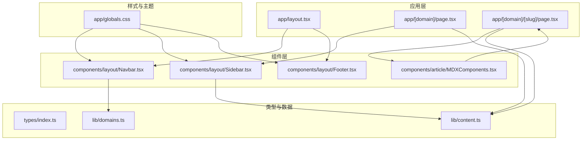
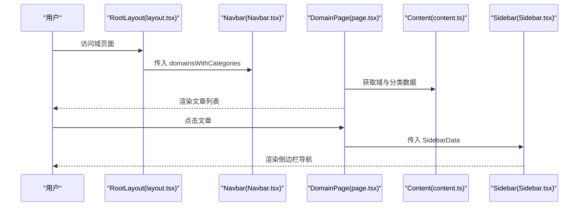
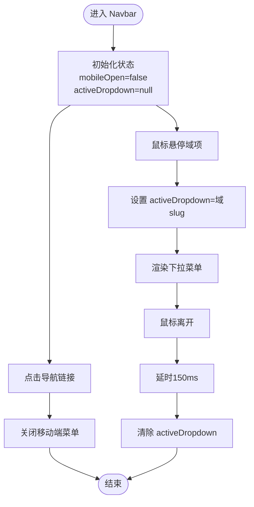
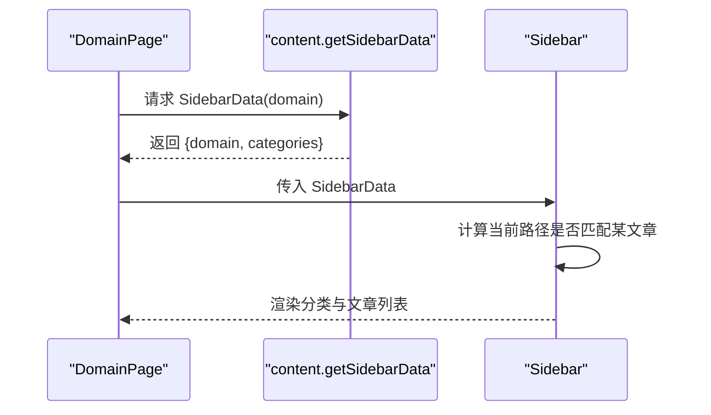
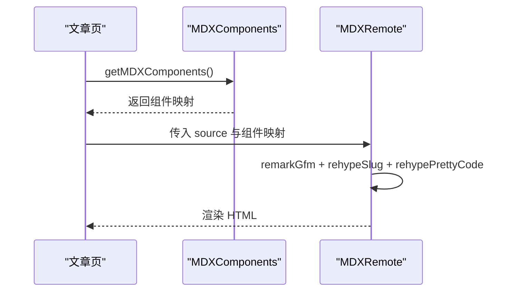
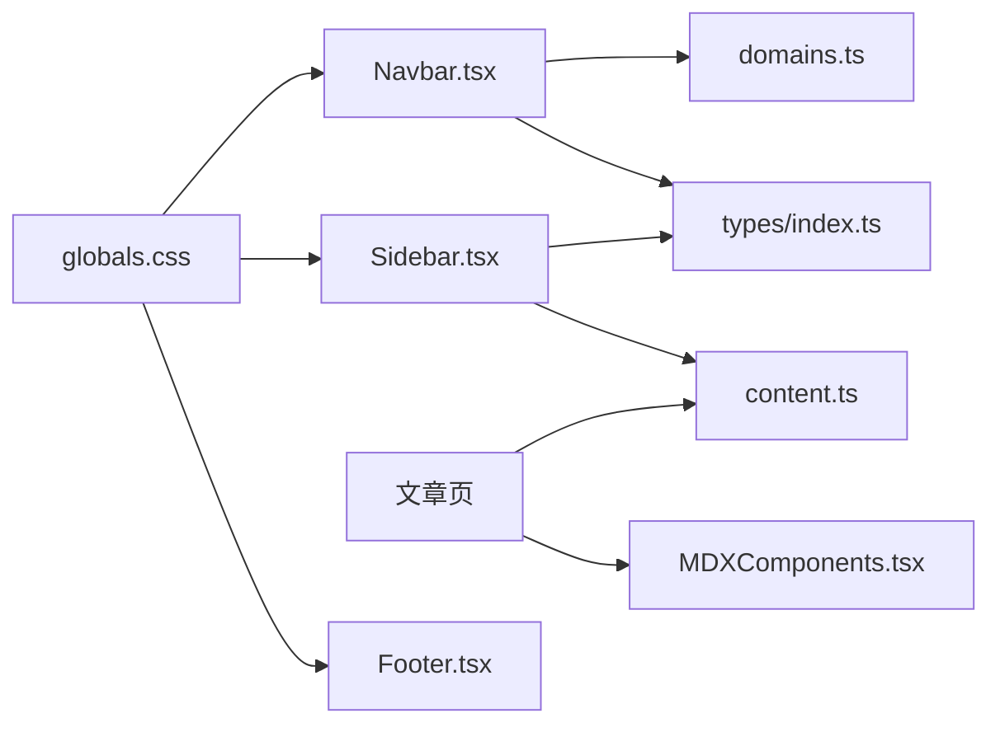

# 用户界面组件

<cite>
**本文引用的文件**
- [Navbar.tsx](file://src/components/layout/Navbar.tsx)
- [Sidebar.tsx](file://src/components/layout/Sidebar.tsx)
- [Footer.tsx](file://src/components/layout/Footer.tsx)
- [MDXComponents.tsx](file://src/components/article/MDXComponents.tsx)
- [globals.css](file://src/app/globals.css)
- [layout.tsx](file://src/app/layout.tsx)
- [index.ts](file://src/types/index.ts)
- [domains.ts](file://src/lib/domains.ts)
- [content.ts](file://src/lib/content.ts)
- [page.tsx（文章页）](file://src/app/[domain]/[slug]/page.tsx)
- [page.tsx（域页）](file://src/app/[domain]/page.tsx)
- [package.json](file://package.json)
</cite>

## 目录
1. [简介](#简介)
2. [项目结构](#项目结构)
3. [核心组件](#核心组件)
4. [架构总览](#架构总览)
5. [详细组件分析](#详细组件分析)
6. [依赖关系分析](#依赖关系分析)
7. [性能考量](#性能考量)
8. [故障排查指南](#故障排查指南)
9. [结论](#结论)
10. [附录](#附录)

## 简介
本文件面向 blog_new 的用户界面组件，重点覆盖以下方面：
- 导航栏组件：响应式设计、下拉菜单、活动状态管理
- 侧边栏组件：自动生成机制、文章分类导航
- 页脚组件：设计与内容组织
- MDX 渲染组件：注册与配置（代码高亮、链接处理、自定义组件）
- Tailwind CSS 样式系统与主题定制
- 组件属性接口、事件处理与状态管理
- 可复用性设计原则与最佳实践
- 扩展与定制指导

## 项目结构
项目采用 Next.js App Router 结构，UI 组件集中在 src/components 下，样式通过全局 CSS 与 Tailwind v4 主题变量统一管理；内容通过 src/lib/content.ts 与 src/lib/domains.ts 提供静态生成与数据聚合。

图表来源
- [layout.tsx:38-60](file://src/app/layout.tsx#L38-L60)
- [page.tsx（域页）:25-88](file://src/app/[domain]/page.tsx#L25-L88)
- [page.tsx（文章页）:29-99](file://src/app/[domain]/[slug]/page.tsx#L29-L99)
- [globals.css:1-95](file://src/app/globals.css#L1-L95)
- [index.ts:1-45](file://src/types/index.ts#L1-L45)
- [domains.ts:1-136](file://src/lib/domains.ts#L1-L136)
- [content.ts:1-158](file://src/lib/content.ts#L1-L158)

章节来源
- [layout.tsx:1-61](file://src/app/layout.tsx#L1-L61)
- [globals.css:1-95](file://src/app/globals.css#L1-L95)
- [index.ts:1-45](file://src/types/index.ts#L1-L45)
- [domains.ts:1-136](file://src/lib/domains.ts#L1-L136)
- [content.ts:1-158](file://src/lib/content.ts#L1-L158)

## 核心组件
- 导航栏 Navbar：响应式布局、桌面端下拉菜单、移动端抽屉菜单、活动状态高亮
- 侧边栏 Sidebar：按域自动聚合分类与文章，支持折叠展开、移动端遮罩层、当前文章高亮
- 页脚 Footer：简洁信息展示与基础导航
- MDX 渲染组件 MDXComponents：标题、链接、块引用、列表、表格等默认渲染器注册，以及代码块高亮配置

章节来源
- [Navbar.tsx:13-141](file://src/components/layout/Navbar.tsx#L13-L141)
- [Sidebar.tsx:13-126](file://src/components/layout/Sidebar.tsx#L13-L126)
- [Footer.tsx:3-21](file://src/components/layout/Footer.tsx#L3-L21)
- [MDXComponents.tsx:3-70](file://src/components/article/MDXComponents.tsx#L3-L70)

## 架构总览
组件间协作与数据流如下：
- 应用根布局负责注入全局样式与导航栏、页脚
- 域页面从内容库读取域与分类数据，渲染文章列表
- 文章页面从内容库读取文章内容，使用 MDX Remote 进行渲染
- 侧边栏根据当前域的数据动态生成分类与文章导航

图表来源
- [layout.tsx:38-60](file://src/app/layout.tsx#L38-L60)
- [page.tsx（域页）:25-88](file://src/app/[domain]/page.tsx#L25-L88)
- [content.ts:133-146](file://src/lib/content.ts#L133-L146)
- [Sidebar.tsx:13-68](file://src/components/layout/Sidebar.tsx#L13-L68)

## 详细组件分析

### 导航栏组件（Navbar）
- 职责
  - 展示站点 Logo 与主菜单
  - 桌面端：鼠标悬停触发下拉菜单，显示分类列表
  - 移动端：点击按钮切换抽屉式导航
  - 活动状态：根据路径高亮当前域或分类
- 关键特性
  - 使用 usePathname 判断当前路径
  - 使用 useRef 和 setTimeout 实现下拉菜单延时关闭
  - 使用 Lucide 图标实现菜单按钮与下拉指示
- 状态与事件
  - mobileOpen：控制移动端抽屉开关
  - activeDropdown：控制桌面端下拉菜单激活项
  - handleMouseEnter/handleMouseLeave：管理下拉菜单显示/隐藏
  - handleLinkClick：点击导航后收起移动端菜单
- 样式与主题
  - 使用主题变量：--nav-bg、--card-bg、--accent 等
  - 桌面端使用绝对定位下拉框，移动端使用垂直堆叠
- 可扩展点
  - 支持更多导航层级（如二级分类）
  - 添加搜索框或用户入口
  - 自定义下拉动画与过渡效果

图表来源
- [Navbar.tsx:13-141](file://src/components/layout/Navbar.tsx#L13-L141)

章节来源
- [Navbar.tsx:13-141](file://src/components/layout/Navbar.tsx#L13-L141)
- [layout.tsx:43-47](file://src/app/layout.tsx#L43-L47)
- [domains.ts:3-32](file://src/lib/domains.ts#L3-L32)

### 侧边栏组件（Sidebar）
- 职责
  - 基于 SidebarData 动态生成域内分类与文章列表
  - 支持移动端抽屉与遮罩层
  - 折叠/展开分类，当前文章高亮
- 数据来源
  - SidebarData：包含 domain、categories（每个分类含 articles）
  - 通过 content.ts 的 getSidebarData 生成
- 交互逻辑
  - mobileOpen 控制抽屉显示
  - overlay 点击关闭抽屉
  - 分类项默认展开若存在当前激活文章
  - 当前文章链接高亮
- 样式与主题
  - 使用 --sidebar-bg、--card-bg、--accent 等主题变量
  - 固定定位与 translate-x 控制移动端滑出效果
- 可扩展点
  - 支持多级分类
  - 添加“最近阅读”或“书签”功能
  - 增加搜索过滤

图表来源
- [page.tsx（域页）:34-39](file://src/app/[domain]/page.tsx#L34-L39)
- [content.ts:133-146](file://src/lib/content.ts#L133-L146)
- [Sidebar.tsx:13-68](file://src/components/layout/Sidebar.tsx#L13-L68)

章节来源
- [Sidebar.tsx:13-126](file://src/components/layout/Sidebar.tsx#L13-L126)
- [content.ts:133-146](file://src/lib/content.ts#L133-L146)
- [page.tsx（域页）:34-39](file://src/app/[domain]/page.tsx#L34-L39)

### 页脚组件（Footer）
- 职责
  - 展示站点标语、版权信息与基础导航
- 设计要点
  - 使用语境化字体与颜色，保持简洁一致性
  - 与全局主题变量保持一致
- 可扩展点
  - 添加社交链接、站点地图
  - 多语言支持

章节来源
- [Footer.tsx:3-21](file://src/components/layout/Footer.tsx#L3-L21)
- [globals.css:12-45](file://src/app/globals.css#L12-L45)

### MDX 渲染组件（MDXComponents）
- 职责
  - 注册默认渲染器：标题、链接、块引用、列表、表格等
  - 为代码块提供高亮样式容器
- 配置与插件
  - 在文章页通过 next-mdx-remote 的 MDXRemote 渲染
  - remarkGfm：支持 GitHub 风格表格等
  - rehypeSlug：为标题生成锚点
  - rehypePrettyCode：代码高亮（主题与背景保留）
- 自定义组件支持
  - 可在 getMDXComponents 中扩展更多标签映射
  - 与文章内容中的自定义组件配合使用
- 样式与主题
  - 使用 .prose 类与主题变量统一排版
  - 代码块背景色与文本色由主题变量控制

图表来源
- [page.tsx（文章页）:38-95](file://src/app/[domain]/[slug]/page.tsx#L38-L95)
- [MDXComponents.tsx:3-70](file://src/components/article/MDXComponents.tsx#L3-L70)

章节来源
- [MDXComponents.tsx:3-70](file://src/components/article/MDXComponents.tsx#L3-L70)
- [page.tsx（文章页）:38-95](file://src/app/[domain]/[slug]/page.tsx#L38-L95)

## 依赖关系分析
- 组件依赖
  - Navbar 依赖 domains.ts 与 types 中的 DomainWithCategories
  - Sidebar 依赖 content.ts 的 getSidebarData 与 types 中的 SidebarData
  - 文章页依赖 content.ts 的 getArticleBySlug 与 MDXComponents
- 样式依赖
  - 全局样式通过 globals.css 定义主题变量与字体
  - 组件通过 CSS 类名引用主题变量
- 外部依赖
  - next-mdx-remote、remark-gfm、rehype-slug、rehype-pretty-code、shiki

图表来源
- [Navbar.tsx:1-11](file://src/components/layout/Navbar.tsx#L1-L11)
- [Sidebar.tsx:1-11](file://src/components/layout/Sidebar.tsx#L1-L11)
- [MDXComponents.tsx:1-1](file://src/components/article/MDXComponents.tsx#L1-L1)
- [globals.css:1-45](file://src/app/globals.css#L1-L45)
- [domains.ts:1-136](file://src/lib/domains.ts#L1-L136)
- [content.ts:1-158](file://src/lib/content.ts#L1-L158)
- [index.ts:1-45](file://src/types/index.ts#L1-L45)

章节来源
- [package.json:11-24](file://package.json#L11-L24)

## 性能考量
- 静态生成与缓存
  - content.ts 中大量函数使用 React cache 包裹，减少重复 IO 与解析
  - getSidebarData 并行获取各分类文章，提升渲染速度
- 路由参数预渲染
  - generateStaticParams 预生成所有文章与域的路由参数，降低首屏延迟
- 样式体积
  - 仅引入必要插件，避免过度样式层叠
- 交互性能
  - 下拉菜单延时关闭使用 setTimeout，避免频繁重绘
  - 移动端抽屉使用 transform 与 fixed 定位，减少布局抖动

章节来源
- [content.ts:45-158](file://src/lib/content.ts#L45-L158)
- [page.tsx（文章页）:10-13](file://src/app/[domain]/[slug]/page.tsx#L10-L13)
- [page.tsx（域页）:7-9](file://src/app/[domain]/page.tsx#L7-L9)
- [Navbar.tsx:24-28](file://src/components/layout/Navbar.tsx#L24-L28)

## 故障排查指南
- 导航栏下拉不消失
  - 检查 handleMouseLeave 是否被正确调用，确认 timeoutRef 是否被清理
- 侧边栏无法打开/关闭
  - 检查 mobileOpen 状态与 overlay 点击事件绑定
  - 确认移动端 translate-x 样式生效
- MDX 内容未渲染或样式异常
  - 确认 MDXRemote 的 components 传入 getMDXComponents 返回值
  - 检查 remarkGfm、rehypeSlug、rehypePrettyCode 插件是否正确配置
  - 确认主题变量与 .prose 样式未被覆盖
- 文章页 404
  - 检查 generateStaticParams 是否返回正确的 domain/slug 参数
  - 确认 getArticleBySlug 能找到对应文件

章节来源
- [Navbar.tsx:19-33](file://src/components/layout/Navbar.tsx#L19-L33)
- [Sidebar.tsx:19-41](file://src/components/layout/Sidebar.tsx#L19-L41)
- [page.tsx（文章页）:38-95](file://src/app/[domain]/[slug]/page.tsx#L38-L95)
- [content.ts:102-131](file://src/lib/content.ts#L102-L131)

## 结论
本项目通过清晰的组件分层与类型约束，实现了可维护的 UI 架构。导航栏、侧边栏与页脚围绕主题变量与 Tailwind v4 进行统一设计，MDX 渲染链路结合 remark/rehype 插件提供了良好的内容体验。建议在后续迭代中进一步增强导航与侧边栏的交互细节，并扩展 MDX 自定义组件生态以满足更丰富的写作需求。

## 附录

### 组件属性接口与事件
- Navbar
  - Props: domainsWithCategories: DomainWithCategories[]
  - 事件: handleMouseEnter(handleMouseLeave), handleLinkClick
- Sidebar
  - Props: data: SidebarData
  - 事件: 点击按钮切换 open，overlay 点击关闭抽屉
- Footer
  - Props: 无
  - 事件: 链接点击跳转首页
- MDXComponents
  - 返回: MDXComponents 映射对象
  - 插件: remarkGfm, rehypeSlug, rehypePrettyCode

章节来源
- [Navbar.tsx:9-11](file://src/components/layout/Navbar.tsx#L9-L11)
- [Sidebar.tsx:9-11](file://src/components/layout/Sidebar.tsx#L9-L11)
- [Footer.tsx:3-21](file://src/components/layout/Footer.tsx#L3-L21)
- [MDXComponents.tsx:3-70](file://src/components/article/MDXComponents.tsx#L3-L70)

### Tailwind CSS 样式系统与主题定制
- 主题变量
  - 背景色、前景色、强调色、边框色、辅助色、卡片背景、导航背景、侧边栏背景等
- 字体
  - Noto Serif SC（衬线）、Noto Sans SC（无衬线）、JetBrains Mono（等宽）
- Prose 样式
  - .prose 与 .prose a:hover 的颜色覆盖，确保内容阅读体验
- 滚动条
  - 自定义滚动条宽度与颜色，适配暖色主题

章节来源
- [globals.css:12-45](file://src/app/globals.css#L12-L45)
- [globals.css:68-95](file://src/app/globals.css#L68-L95)

### 可复用性设计原则与最佳实践
- 单一职责：每个组件聚焦一个 UI 职责（导航、侧边栏、页脚）
- 类型安全：通过 types/index.ts 统一接口定义
- 数据驱动：通过 content.ts 与 domains.ts 提供数据，组件只负责渲染
- 主题一致：通过 CSS 变量与 Tailwind v4 主题保持视觉统一
- 可扩展：MDXComponents 与 SidebarData 为扩展预留空间

### 扩展与定制指导
- 新增域与分类
  - 在 domains.ts 中添加 Domain 与 categoriesByDomain 条目
  - content.ts 会自动扫描 content 目录下的 .mdx 文件并生成文章元数据
- 自定义 MDX 组件
  - 在 MDXComponents.tsx 中新增标签映射，或在文章页传入额外组件
- 样式定制
  - 修改 globals.css 中的主题变量，或在组件内局部覆盖类名
- 交互增强
  - 在 Navbar 与 Sidebar 中增加更多状态与过渡效果，注意性能影响

章节来源
- [domains.ts:3-32](file://src/lib/domains.ts#L3-L32)
- [domains.ts:34-127](file://src/lib/domains.ts#L34-L127)
- [content.ts:13-27](file://src/lib/content.ts#L13-L27)
- [MDXComponents.tsx:3-70](file://src/components/article/MDXComponents.tsx#L3-L70)
- [globals.css:12-45](file://src/app/globals.css#L12-L45)