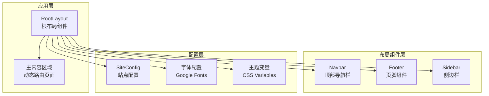
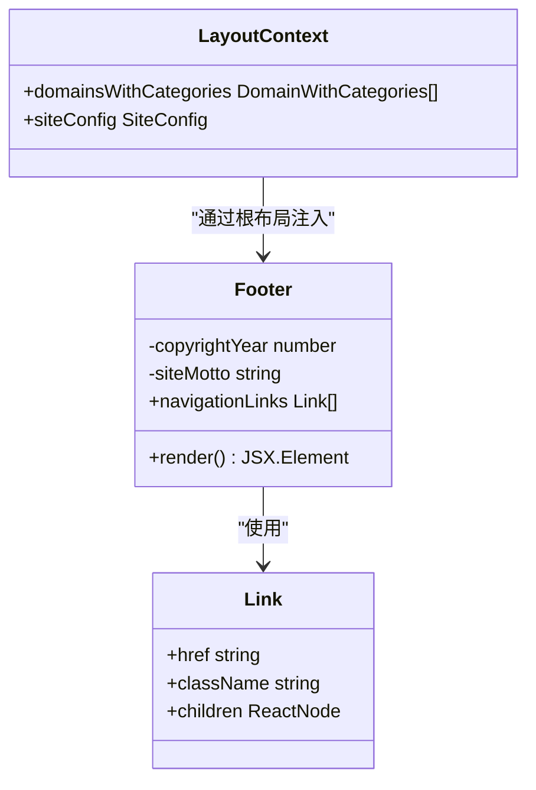
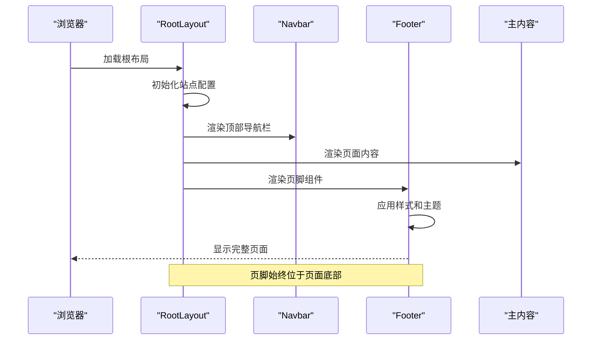
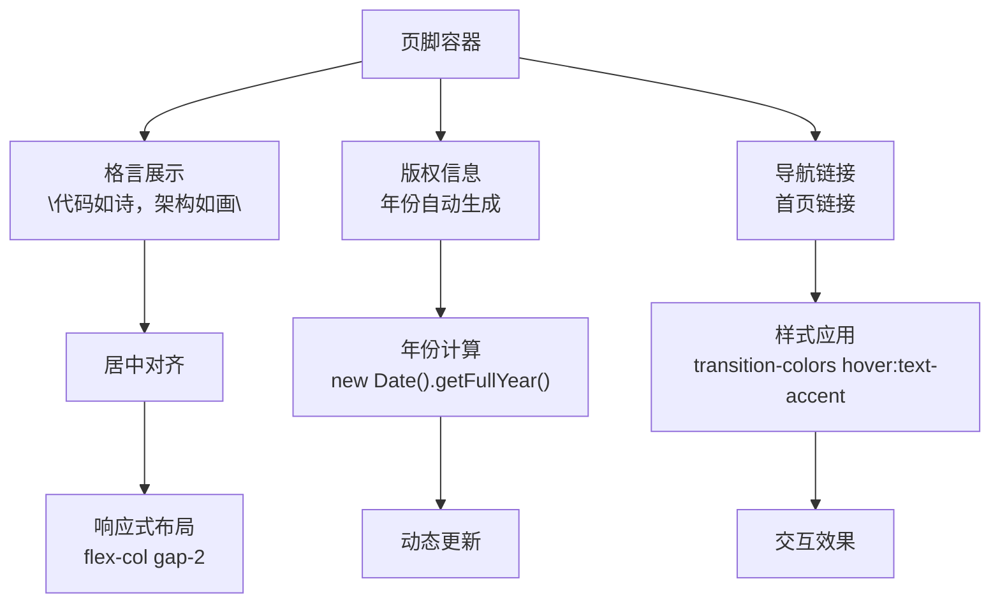
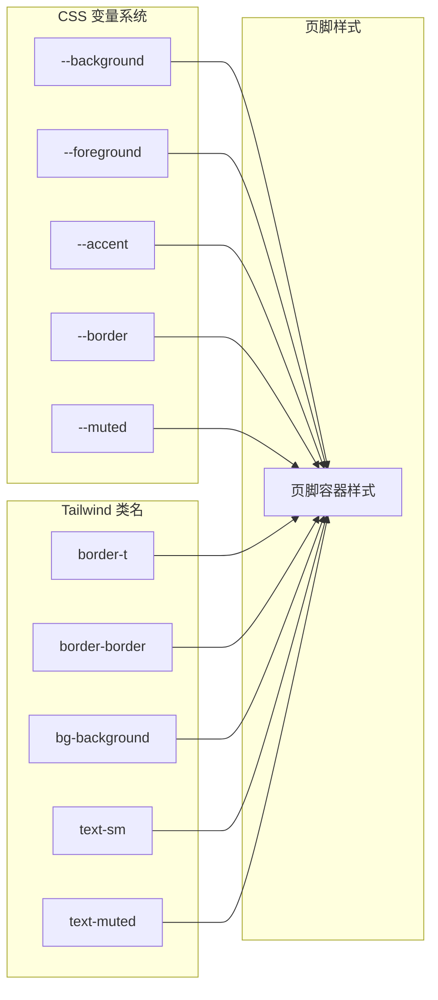
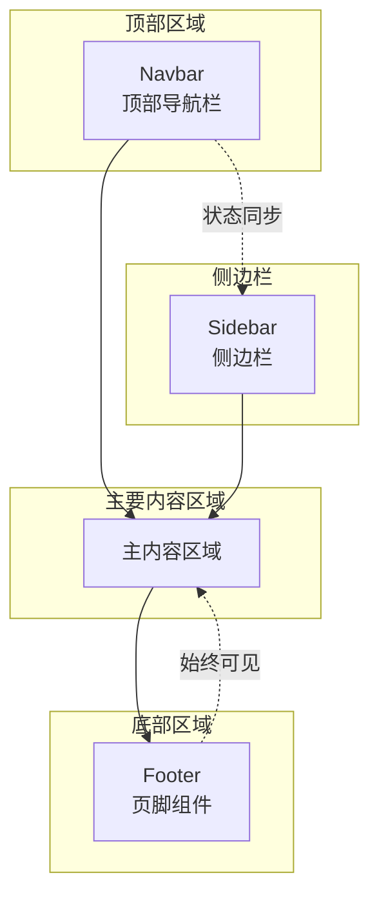
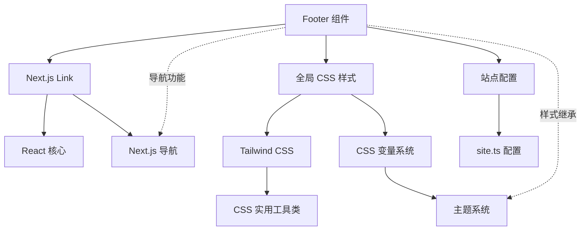

# 页脚组件

<cite>
**本文档引用的文件**
- [Footer.tsx](file://src/components/layout/Footer.tsx)
- [layout.tsx](file://src/app/layout.tsx)
- [site.ts](file://src/config/site.ts)
- [globals.css](file://src/app/globals.css)
- [Navbar.tsx](file://src/components/layout/Navbar.tsx)
- [Sidebar.tsx](file://src/components/layout/Sidebar.tsx)
- [domains.ts](file://src/lib/domains.ts)
- [index.ts](file://src/types/index.ts)
</cite>

## 目录
1. [简介](#简介)
2. [项目结构](#项目结构)
3. [核心组件](#核心组件)
4. [架构概览](#架构概览)
5. [详细组件分析](#详细组件分析)
6. [依赖关系分析](#依赖关系分析)
7. [性能考虑](#性能考虑)
8. [故障排除指南](#故障排除指南)
9. [结论](#结论)

## 简介

blog_new 项目的页脚组件是一个简洁而功能完整的底部导航区域，负责展示网站的核心信息和用户导航元素。该组件采用现代化的设计理念，结合了响应式布局和主题化样式系统，为用户提供一致且美观的浏览体验。

页脚组件目前包含以下核心功能：
- 版权信息显示（年份自动生成）
- 个人格言展示
- 基础导航链接
- 响应式布局适配
- 主题化样式支持

## 项目结构

页脚组件位于项目的组件层次结构中，与导航栏、侧边栏等其他布局组件协同工作，形成完整的页面布局体系。

**图表来源**
- [layout.tsx:38-60](file://src/app/layout.tsx#L38-L60)
- [Footer.tsx:3-20](file://src/components/layout/Footer.tsx#L3-L20)

**章节来源**
- [layout.tsx:1-61](file://src/app/layout.tsx#L1-L61)
- [Footer.tsx:1-21](file://src/components/layout/Footer.tsx#L1-L21)

## 核心组件

### 页脚组件架构

页脚组件采用函数式组件设计，使用 Next.js 的 Link 组件进行页面导航，结合 Tailwind CSS 类名实现响应式布局。

**图表来源**
- [Footer.tsx:3-20](file://src/components/layout/Footer.tsx#L3-L20)
- [layout.tsx:38-60](file://src/app/layout.tsx#L38-L60)

### 核心特性

1. **响应式设计**：使用 Flexbox 和 Gap 属性实现自适应布局
2. **主题集成**：完全集成到全局主题系统中
3. **语义化结构**：使用语义化的 footer 元素
4. **无障碍访问**：支持键盘导航和屏幕阅读器

**章节来源**
- [Footer.tsx:3-20](file://src/components/layout/Footer.tsx#L3-L20)
- [globals.css:12-45](file://src/app/globals.css#L12-L45)

## 架构概览

页脚组件在整个应用架构中扮演着重要的角色，它与根布局组件紧密集成，并通过全局样式系统实现统一的视觉体验。

**图表来源**
- [layout.tsx:38-60](file://src/app/layout.tsx#L38-L60)
- [Footer.tsx:3-20](file://src/components/layout/Footer.tsx#L3-L20)

## 详细组件分析

### 设计理念

页脚组件体现了简约而不简单的设计哲学，通过最少的元素传达最重要的信息。设计要点包括：

1. **信息层次清晰**：从上到下依次为格言、版权信息、导航链接
2. **视觉平衡**：居中对齐创造稳定的视觉效果
3. **留白艺术**：适当的间距营造呼吸感
4. **品牌一致性**：与整体设计语言保持统一

### 内容组织结构

页脚的内容按照重要性和用户需求进行组织：

**图表来源**
- [Footer.tsx:6-16](file://src/components/layout/Footer.tsx#L6-L16)

### 响应式布局实现

页脚组件采用移动优先的设计策略，确保在各种设备上都能提供良好的用户体验：

| 断点 | 屏幕宽度 | 布局特征 |
|------|----------|----------|
| 移动端 | < 768px | 单列垂直布局，紧凑间距 |
| 平板端 | 768px - 1024px | 保持单列布局，适度增大间距 |
| 桌面端 | > 1024px | 最大宽度限制，居中对齐 |

**章节来源**
- [Footer.tsx:5-7](file://src/components/layout/Footer.tsx#L5-L7)
- [globals.css:12-45](file://src/app/globals.css#L12-L45)

### 样式系统集成

页脚组件完全集成到全局样式系统中，使用 CSS 变量和 Tailwind CSS 类名：

**图表来源**
- [globals.css:12-45](file://src/app/globals.css#L12-L45)
- [Footer.tsx:5-6](file://src/components/layout/Footer.tsx#L5-L6)

**章节来源**
- [globals.css:12-45](file://src/app/globals.css#L12-L45)
- [Footer.tsx:5-6](file://src/components/layout/Footer.tsx#L5-L6)

### 可配置性分析

当前页脚组件具有有限但实用的可配置性：

#### 内容定制选项

| 配置项 | 当前值 | 可定制性 | 建议改进 |
|--------|--------|----------|----------|
| 格言内容 | "代码如诗，架构如画" | ✗ 固定值 | ✓ 从配置文件读取 |
| 版权信息 | 自动年份 | ✓ 部分可定制 | ✓ 支持自定义作者名 |
| 导航链接 | 首页链接 | ✗ 固定 | ✓ 支持多链接配置 |
| 社交媒体 | 无 | ✗ 不支持 | ✓ 添加社交图标链接 |

#### 样式调整选项

| 样式属性 | 当前实现 | 可扩展性 | 使用场景 |
|----------|----------|----------|----------|
| 字体大小 | text-sm | ✓ 可调整 | ✓ 小型设备优化 |
| 边框样式 | border-t + border-border | ✓ 可定制 | ✓ 不同主题风格 |
| 背景颜色 | bg-background | ✓ 可替换 | ✓ 夜间模式支持 |
| 文本颜色 | text-muted | ✓ 可调整 | ✓ 品牌色彩集成 |

**章节来源**
- [Footer.tsx:7-16](file://src/components/layout/Footer.tsx#L7-L16)
- [site.ts:1-20](file://src/config/site.ts#L1-L20)

### 与其他布局组件的协作

页脚组件与导航栏和侧边栏形成完整的布局生态：

**图表来源**
- [layout.tsx:54-56](file://src/app/layout.tsx#L54-L56)
- [Navbar.tsx:36](file://src/components/layout/Navbar.tsx#L36)

**章节来源**
- [layout.tsx:54-56](file://src/app/layout.tsx#L54-L56)
- [Navbar.tsx:36](file://src/components/layout/Navbar.tsx#L36)

## 依赖关系分析

页脚组件的依赖关系相对简单，主要依赖于全局样式系统和 Next.js 的导航功能。

**图表来源**
- [Footer.tsx:1](file://src/components/layout/Footer.tsx#L1)
- [globals.css:12-45](file://src/app/globals.css#L12-L45)
- [site.ts:1-20](file://src/config/site.ts#L1-L20)

### 直接依赖

- **Next.js Link**：用于页面内导航
- **Tailwind CSS 类名**：用于样式定义
- **CSS 变量**：用于主题化支持

### 间接依赖

- **全局样式系统**：通过 CSS 变量继承
- **站点配置**：未来可能用于内容定制
- **类型定义**：确保类型安全

**章节来源**
- [Footer.tsx:1](file://src/components/layout/Footer.tsx#L1)
- [globals.css:12-45](file://src/app/globals.css#L12-L45)

## 性能考虑

页脚组件在性能方面表现出色，具有以下特点：

### 渲染性能
- **轻量级组件**：仅包含少量静态元素
- **无状态设计**：无需维护复杂的状态
- **纯函数组件**：避免不必要的重渲染

### 样式性能
- **CSS 变量**：减少重复的样式定义
- **Tailwind 实用类**：编译时优化
- **最小化选择器**：降低样式计算成本

### 交互性能
- **事件委托**：导航链接使用原生事件处理
- **CSS 过渡**：硬件加速的动画效果
- **内存效率**：无持久化状态占用

## 故障排除指南

### 常见问题及解决方案

#### 问题：页脚不显示
**症状**：页面底部空白，看不到页脚内容
**可能原因**：
- 根布局未正确渲染页脚组件
- 样式被其他组件覆盖
- 浏览器缓存问题

**解决步骤**：
1. 检查根布局是否包含页脚渲染调用
2. 验证 CSS 样式是否正确加载
3. 清除浏览器缓存重新加载

#### 问题：样式显示异常
**症状**：页脚颜色或布局不符合预期
**可能原因**：
- CSS 变量未正确设置
- Tailwind CSS 配置问题
- 主题切换冲突

**解决步骤**：
1. 检查全局 CSS 变量定义
2. 验证 Tailwind 配置文件
3. 确认主题切换逻辑

#### 问题：导航链接无效
**症状**：点击页脚链接无法跳转
**可能原因**：
- Link 组件配置错误
- 路由路径不正确
- Next.js 配置问题

**解决步骤**：
1. 检查 Link 组件的 href 属性
2. 验证路由配置
3. 确认页面存在

**章节来源**
- [layout.tsx:54-56](file://src/app/layout.tsx#L54-L56)
- [Footer.tsx:10-16](file://src/components/layout/Footer.tsx#L10-L16)

## 结论

blog_new 项目的页脚组件展现了现代 Web 开发的最佳实践，通过简洁的设计和强大的功能实现了优秀的用户体验。组件具有以下优势：

### 已实现的功能
- **响应式设计**：完美适配各种设备尺寸
- **主题集成**：无缝融入整体设计系统
- **性能优化**：轻量级实现确保快速加载
- **可维护性**：清晰的代码结构便于后续扩展

### 改进建议
1. **增强可配置性**：添加更多配置选项支持
2. **扩展社交功能**：集成社交媒体链接
3. **国际化支持**：添加多语言内容支持
4. **增强交互性**：添加更多用户交互元素

### 未来发展
随着项目的发展，页脚组件可以进一步演进为一个更加丰富和智能的组件，为用户提供更好的导航体验和信息获取途径。通过合理的架构设计和持续的优化，页脚组件将成为整个博客平台的重要组成部分。