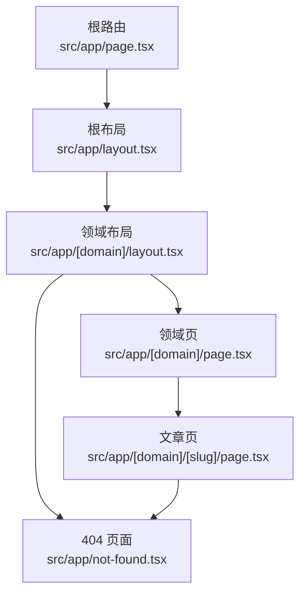
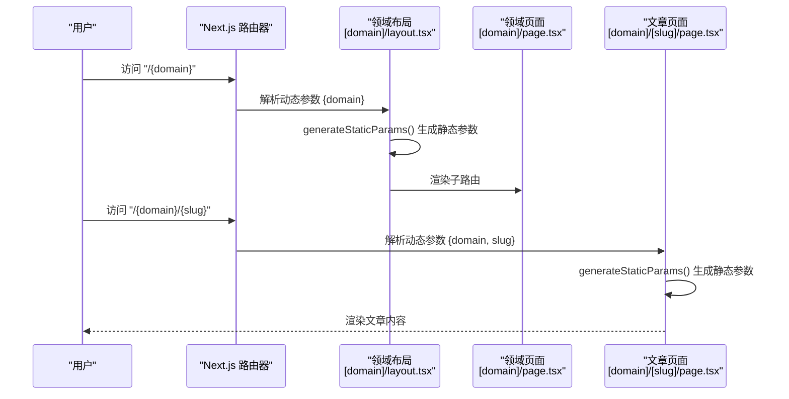
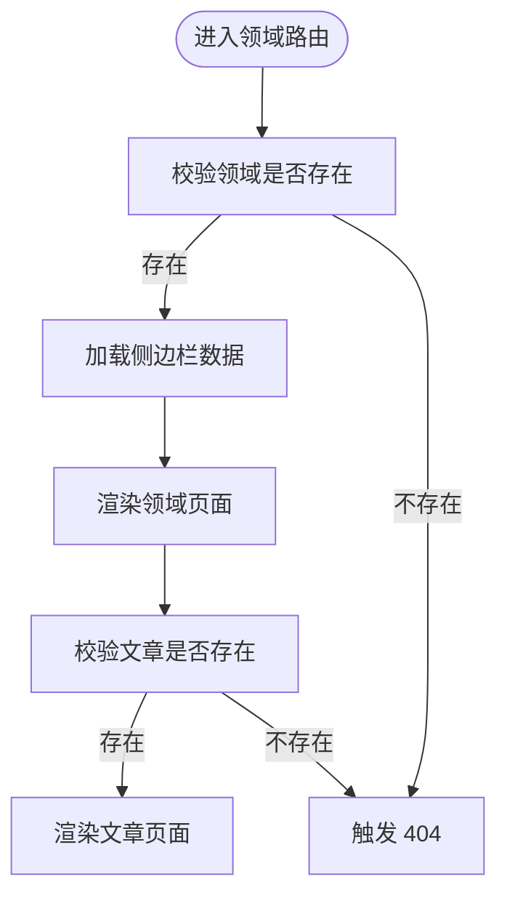
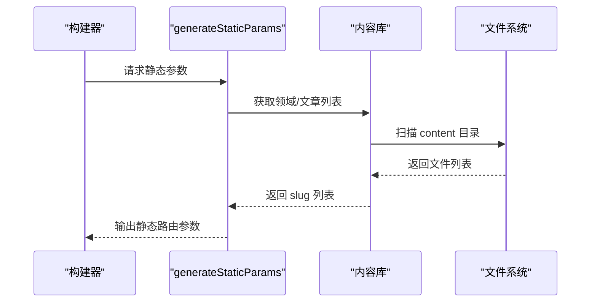
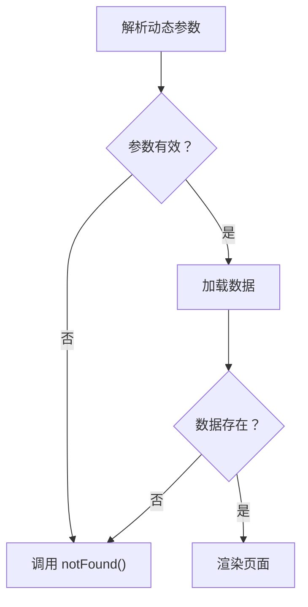
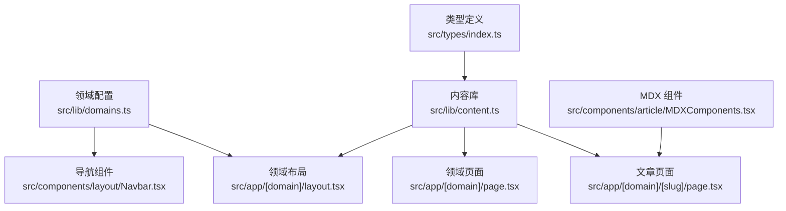

# Next.js 路由机制

<cite>
**本文引用的文件**
- [src/app/layout.tsx](file://src/app/layout.tsx)
- [src/app/[domain]/layout.tsx](file://src/app/[domain]/layout.tsx)
- [src/app/[domain]/page.tsx](file://src/app/[domain]/page.tsx)
- [src/app/[domain]/[slug]/page.tsx](file://src/app/[domain]/[slug]/page.tsx)
- [src/app/not-found.tsx](file://src/app/not-found.tsx)
- [src/lib/content.ts](file://src/lib/content.ts)
- [src/lib/domains.ts](file://src/lib/domains.ts)
- [src/types/index.ts](file://src/types/index.ts)
- [src/components/layout/Navbar.tsx](file://src/components/layout/Navbar.tsx)
- [src/components/layout/Sidebar.tsx](file://src/components/layout/Sidebar.tsx)
- [src/components/article/MDXComponents.tsx](file://src/components/article/MDXComponents.tsx)
- [content/distributed-architecture/message-queue/kafka-core-concepts.mdx](file://content/distributed-architecture/message-queue/kafka-core-concepts.mdx)
- [content/software-dev-languages/java/spring-boot-intro.mdx](file://content/software-dev-languages/java/spring-boot-intro.mdx)
- [content/software-design/ddd/ddd-bounded-context.mdx](file://content/software-design/ddd/ddd-bounded-context.mdx)
</cite>

## 目录
1. [引言](#引言)
2. [项目结构](#项目结构)
3. [核心组件](#核心组件)
4. [架构总览](#架构总览)
5. [详细组件分析](#详细组件分析)
6. [依赖分析](#依赖分析)
7. [性能考虑](#性能考虑)
8. [故障排除指南](#故障排除指南)
9. [结论](#结论)
10. [附录](#附录)

## 引言
本文件系统化梳理该 Next.js 应用的 App Router 路由机制，重点覆盖：
- 文件系统路由与动态路由参数（[domain]、[slug]）的提取与处理
- 嵌套路由的实现：根路由 → 领域路由 → 文章路由
- generateStaticParams 的作用与静态生成策略
- 路由组件生命周期：服务端渲染、客户端渲染与水合
- 路由参数验证、错误处理与 404 页面
- 路由扩展最佳实践：新增路由与修改既有路由

## 项目结构
该应用采用 Next.js App Router 的文件系统路由约定，路由层级清晰，参数化路径明确：
- 根布局与全局样式：src/app/layout.tsx
- 动态领域路由：src/app/[domain]/（包含 layout.tsx 与 page.tsx）
- 动态文章路由：src/app/[domain]/[slug]/page.tsx
- 全局 404 页面：src/app/not-found.tsx
- 内容与领域配置：src/lib/content.ts、src/lib/domains.ts、src/types/index.ts
- 导航与侧边栏：src/components/layout/Navbar.tsx、src/components/layout/Sidebar.tsx
- 文章渲染组件：src/components/article/MDXComponents.tsx
- 示例内容：content 下按领域/分类组织的 MDX 文件

图表来源
- [src/app/layout.tsx:38-60](file://src/app/layout.tsx#L38-L60)
- [src/app/[domain]/layout.tsx](file://src/app/[domain]/layout.tsx#L10-L29)
- [src/app/[domain]/page.tsx](file://src/app/[domain]/page.tsx#L25-L88)
- [src/app/[domain]/[slug]/page.tsx](file://src/app/[domain]/[slug]/page.tsx#L29-L99)
- [src/app/not-found.tsx:4-18](file://src/app/not-found.tsx#L4-L18)

章节来源
- [src/app/layout.tsx:1-61](file://src/app/layout.tsx#L1-L61)
- [src/app/[domain]/layout.tsx](file://src/app/[domain]/layout.tsx#L1-L30)
- [src/app/[domain]/page.tsx](file://src/app/[domain]/page.tsx#L1-L89)
- [src/app/[domain]/[slug]/page.tsx](file://src/app/[domain]/[slug]/page.tsx#L1-L100)
- [src/app/not-found.tsx:1-19](file://src/app/not-found.tsx#L1-L19)

## 核心组件
- 根布局与导航
  - 根布局负责注入字体、全局样式与全局导航栏、页脚；同时在服务端拉取所有领域的分类信息以供导航使用。
  - 导航组件基于当前路径高亮，支持桌面端下拉与移动端抽屉式菜单。
- 领域布局与页面
  - 领域布局通过 generateStaticParams 生成静态参数，确保每个领域在构建时预渲染；若领域不存在则触发 404。
  - 领域页面聚合各分类的文章列表，生成页面元数据。
- 文章页面
  - 文章页面同样通过 generateStaticParams 生成静态参数，结合 MDX 渲染引擎展示文章内容。
- 内容与领域配置
  - 内容读取函数负责扫描 content 目录、解析 MDX frontmatter、缓存查询结果。
  - 领域与分类配置集中定义，便于扩展与维护。

章节来源
- [src/app/layout.tsx:38-60](file://src/app/layout.tsx#L38-L60)
- [src/components/layout/Navbar.tsx:13-140](file://src/components/layout/Navbar.tsx#L13-L140)
- [src/app/[domain]/layout.tsx](file://src/app/[domain]/layout.tsx#L6-L8)
- [src/app/[domain]/page.tsx](file://src/app/[domain]/page.tsx#L7-L9)
- [src/app/[domain]/[slug]/page.tsx](file://src/app/[domain]/[slug]/page.tsx#L10-L13)
- [src/lib/content.ts:45-157](file://src/lib/content.ts#L45-L157)
- [src/lib/domains.ts:3-32](file://src/lib/domains.ts#L3-L32)

## 架构总览
该应用采用“领域-分类-文章”的三层嵌套路由：
- 根路由：展示全局概览或重定向至首个领域
- 领域路由：根据领域 slug 展示该领域的分类与文章列表
- 文章路由：根据领域 slug 与文章 slug 展示具体文章内容

图表来源
- [src/app/[domain]/layout.tsx](file://src/app/[domain]/layout.tsx#L6-L8)
- [src/app/[domain]/page.tsx](file://src/app/[domain]/page.tsx#L7-L9)
- [src/app/[domain]/[slug]/page.tsx](file://src/app/[domain]/[slug]/page.tsx#L10-L13)

## 详细组件分析

### 文件系统路由与动态参数
- 参数提取
  - 领域参数：通过 [domain] 动态段提取，用于定位领域配置与内容目录。
  - 文章参数：通过 [slug] 动态段提取，用于定位具体文章文件。
- 参数来源
  - generateStaticParams：在构建阶段生成静态路由参数，提升首屏性能与 SEO。
  - 运行时参数：params Promise 在运行时解析，确保 SSR 期间能获取最新参数值。

章节来源
- [src/app/[domain]/layout.tsx](file://src/app/[domain]/layout.tsx#L10-L16)
- [src/app/[domain]/page.tsx](file://src/app/[domain]/page.tsx#L25-L29)
- [src/app/[domain]/[slug]/page.tsx](file://src/app/[domain]/[slug]/page.tsx#L29-L33)

### 嵌套路由实现：根 → 领域 → 文章
- 根布局与导航
  - 根布局在服务端拉取所有领域及其分类，注入到导航组件，形成全局导航树。
- 领域布局
  - 通过 generateStaticParams 预渲染每个领域页面；若领域不存在则触发 404。
  - 布局内渲染侧边栏，侧边栏根据当前领域聚合分类与文章列表。
- 文章页面
  - 通过 generateStaticParams 预渲染每篇文章；若文章不存在则触发 404。
  - 使用 MDX Remote 渲染文章内容，配合自定义组件与语法高亮插件。

图表来源
- [src/app/[domain]/layout.tsx](file://src/app/[domain]/layout.tsx#L17-L19)
- [src/app/[domain]/page.tsx](file://src/app/[domain]/page.tsx#L30-L32)
- [src/app/[domain]/[slug]/page.tsx](file://src/app/[domain]/[slug]/page.tsx#L34-L36)

章节来源
- [src/app/layout.tsx:43-47](file://src/app/layout.tsx#L43-L47)
- [src/components/layout/Navbar.tsx:48-94](file://src/components/layout/Navbar.tsx#L48-L94)
- [src/app/[domain]/layout.tsx](file://src/app/[domain]/layout.tsx#L17-L19)
- [src/app/[domain]/page.tsx](file://src/app/[domain]/page.tsx#L30-L32)
- [src/app/[domain]/[slug]/page.tsx](file://src/app/[domain]/[slug]/page.tsx#L34-L36)

### generateStaticParams 与静态生成策略
- 领域路由
  - generateStaticParams 返回 domains 的 slug 数组，使每个领域在构建时生成静态页面。
- 文章路由
  - generateStaticParams 调用 getAllArticleSlugs，遍历所有领域与分类，收集所有文章 slug，生成静态文章页面。
- 优势
  - 提升首屏性能、SEO 友好、减少运行时 IO。
- 注意事项
  - 新增内容后需重新构建以生成新路由；可通过 CI 自动化。

图表来源
- [src/app/[domain]/layout.tsx](file://src/app/[domain]/layout.tsx#L6-L8)
- [src/app/[domain]/[slug]/page.tsx](file://src/app/[domain]/[slug]/page.tsx#L10-L13)
- [src/lib/content.ts:148-157](file://src/lib/content.ts#L148-L157)

章节来源
- [src/app/[domain]/layout.tsx](file://src/app/[domain]/layout.tsx#L6-L8)
- [src/app/[domain]/[slug]/page.tsx](file://src/app/[domain]/[slug]/page.tsx#L10-L13)
- [src/lib/content.ts:148-157](file://src/lib/content.ts#L148-L157)

### 路由组件生命周期：SSR、CSR 与水合
- 服务端渲染（SSR）
  - 领域布局与页面、文章页面均导出异步函数以在服务端渲染；params 作为 Promise 在 SSR 期间解析。
- 客户端渲染（CSR）
  - 导航与侧边栏组件标记为客户端组件，使用 usePathname 与状态控制交互行为。
- 水合
  - Next.js 默认在浏览器端对已 SSR 的 HTML 进行水合，保持交互一致性。

章节来源
- [src/app/[domain]/layout.tsx](file://src/app/[domain]/layout.tsx#L10-L16)
- [src/app/[domain]/page.tsx](file://src/app/[domain]/page.tsx#L25-L29)
- [src/app/[domain]/[slug]/page.tsx](file://src/app/[domain]/[slug]/page.tsx#L29-L33)
- [src/components/layout/Navbar.tsx:1-1](file://src/components/layout/Navbar.tsx#L1-L1)
- [src/components/layout/Sidebar.tsx:1-1](file://src/components/layout/Sidebar.tsx#L1-L1)

### 路由参数验证、错误处理与 404 页面
- 参数验证
  - 领域布局与页面在获取数据失败时调用 notFound，触发 404。
  - 文章页面同样在找不到文章时调用 notFound。
- 错误处理
  - 全局 404 页面提供友好的提示与返回首页链接。
- 404 触发时机
  - 领域不存在、文章不存在、内容被标记为草稿等情况。

图表来源
- [src/app/[domain]/layout.tsx](file://src/app/[domain]/layout.tsx#L17-L19)
- [src/app/[domain]/page.tsx](file://src/app/[domain]/page.tsx#L30-L32)
- [src/app/[domain]/[slug]/page.tsx](file://src/app/[domain]/[slug]/page.tsx#L34-L36)
- [src/app/not-found.tsx:4-18](file://src/app/not-found.tsx#L4-L18)

章节来源
- [src/app/[domain]/layout.tsx](file://src/app/[domain]/layout.tsx#L17-L19)
- [src/app/[domain]/page.tsx](file://src/app/[domain]/page.tsx#L30-L32)
- [src/app/[domain]/[slug]/page.tsx](file://src/app/[domain]/[slug]/page.tsx#L34-L36)
- [src/app/not-found.tsx:4-18](file://src/app/not-found.tsx#L4-L18)

### 路由扩展最佳实践
- 新增领域
  - 在领域配置中添加新的 Domain 条目。
  - 在 content 目录下创建对应领域的分类目录与文章文件。
  - generateStaticParams 会自动为新领域生成静态路由。
- 新增分类
  - 在领域配置中添加新的 Category 条目。
  - 在 content/{domain} 下创建对应分类目录与文章文件。
  - generateStaticParams 会自动为新文章生成静态路由。
- 修改既有路由
  - 若修改领域或文章的 slug，需同步更新导航与链接；否则可能导致 404。
  - 若删除内容，需清理旧路由或保留占位以防 404。
- 内容规范
  - MDX frontmatter 中必须包含有效的 domain、category、title、date 等字段。
  - draft 字段为 true 的文章不会被索引或渲染。

章节来源
- [src/lib/domains.ts:3-32](file://src/lib/domains.ts#L3-L32)
- [src/lib/domains.ts:34-127](file://src/lib/domains.ts#L34-L127)
- [src/lib/content.ts:29-43](file://src/lib/content.ts#L29-L43)
- [src/lib/content.ts:102-131](file://src/lib/content.ts#L102-L131)
- [content/distributed-architecture/message-queue/kafka-core-concepts.mdx:1-9](file://content/distributed-architecture/message-queue/kafka-core-concepts.mdx#L1-L9)
- [content/software-dev-languages/java/spring-boot-intro.mdx:1-9](file://content/software-dev-languages/java/spring-boot-intro.mdx#L1-L9)
- [content/software-design/ddd/ddd-bounded-context.mdx:1-9](file://content/software-design/ddd/ddd-bounded-context.mdx#L1-L9)

## 依赖分析
- 组件耦合
  - 根布局依赖导航组件与领域配置；导航组件依赖领域数据。
  - 领域布局依赖侧边栏组件与内容库；侧边栏依赖路径状态。
  - 文章页面依赖 MDX 组件与内容库。
- 外部依赖
  - MDX 渲染：next-mdx-remote、remark、rehype 插件链。
  - 样式与字体：Next.js 字体与全局样式。
- 数据流
  - 领域数据 → 导航与侧边栏 → 页面渲染。
  - 文章元数据 → 文章页面 → MDX 内容渲染。

图表来源
- [src/lib/domains.ts:3-32](file://src/lib/domains.ts#L3-L32)
- [src/components/layout/Navbar.tsx:13-140](file://src/components/layout/Navbar.tsx#L13-L140)
- [src/app/[domain]/layout.tsx](file://src/app/[domain]/layout.tsx#L10-L16)
- [src/lib/content.ts:45-157](file://src/lib/content.ts#L45-L157)
- [src/app/[domain]/page.tsx](file://src/app/[domain]/page.tsx#L25-L88)
- [src/app/[domain]/[slug]/page.tsx](file://src/app/[domain]/[slug]/page.tsx#L29-L99)
- [src/components/article/MDXComponents.tsx:3-69](file://src/components/article/MDXComponents.tsx#L3-L69)
- [src/types/index.ts:1-45](file://src/types/index.ts#L1-L45)

章节来源
- [src/lib/domains.ts:3-32](file://src/lib/domains.ts#L3-L32)
- [src/lib/content.ts:45-157](file://src/lib/content.ts#L45-L157)
- [src/components/layout/Navbar.tsx:13-140](file://src/components/layout/Navbar.tsx#L13-L140)
- [src/components/layout/Sidebar.tsx:13-68](file://src/components/layout/Sidebar.tsx#L13-L68)
- [src/components/article/MDXComponents.tsx:3-69](file://src/components/article/MDXComponents.tsx#L3-L69)
- [src/types/index.ts:1-45](file://src/types/index.ts#L1-L45)

## 性能考虑
- 静态生成
  - generateStaticParams 生成静态路由，减少运行时 IO 与数据库查询。
- 缓存策略
  - 内容读取函数使用 React 缓存装饰器，避免重复读取与解析。
- 并发加载
  - 领域页面并发获取各分类的文章列表，缩短渲染时间。
- MDX 渲染
  - 使用代码高亮与 GFM 插件，平衡可读性与渲染性能。

章节来源
- [src/app/[domain]/page.tsx](file://src/app/[domain]/page.tsx#L34-L39)
- [src/lib/content.ts:45-47](file://src/lib/content.ts#L45-L47)
- [src/lib/content.ts:133-146](file://src/lib/content.ts#L133-L146)
- [src/app/[domain]/[slug]/page.tsx](file://src/app/[domain]/[slug]/page.tsx#L77-L95)

## 故障排除指南
- 404 页面未显示
  - 检查领域或文章是否存在；确认 frontmatter 中 domain 与 category 是否正确。
  - 确认 generateStaticParams 已包含相关 slug。
- 导航高亮异常
  - 检查 usePathname 的使用与路径前缀匹配逻辑。
- 文章内容空白
  - 检查 MDX 文件是否存在且 frontmatter 完整；确认 MDX 组件注册正确。
- 构建失败或路由缺失
  - 新增内容后需重新构建；检查 CI 是否执行了构建步骤。

章节来源
- [src/app/not-found.tsx:4-18](file://src/app/not-found.tsx#L4-L18)
- [src/components/layout/Navbar.tsx:14-14](file://src/components/layout/Navbar.tsx#L14-L14)
- [src/app/[domain]/[slug]/page.tsx](file://src/app/[domain]/[slug]/page.tsx#L77-L95)
- [src/lib/content.ts:148-157](file://src/lib/content.ts#L148-L157)

## 结论
该应用通过清晰的文件系统路由与 generateStaticParams 的静态生成策略，实现了高性能、可扩展的博客路由体系。动态参数提取与嵌套路由设计使得从领域到文章的导航自然流畅；全局 404 与参数校验保障了用户体验与健壮性。遵循本文的扩展与维护建议，可安全地新增内容与路由，持续优化性能与可维护性。

## 附录
- 类型定义概览
  - Domain、Category、ArticleMeta、Article、SidebarData、DomainWithCategories 等类型定义，支撑路由与内容的数据契约。

章节来源
- [src/types/index.ts:1-45](file://src/types/index.ts#L1-L45)