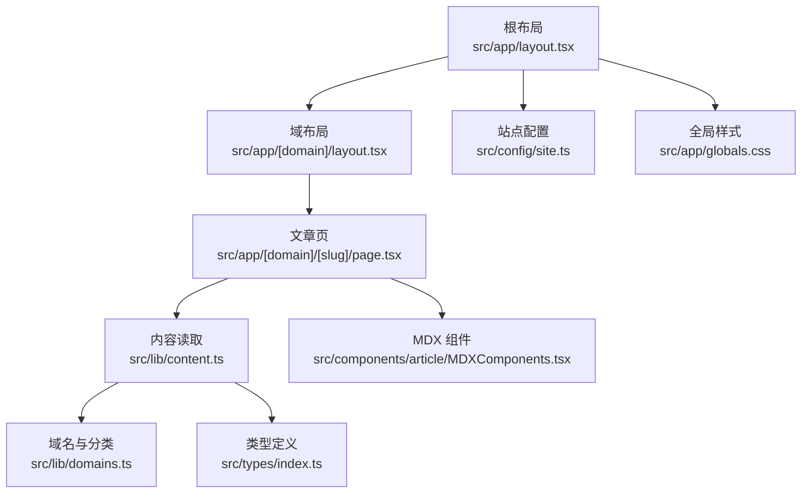
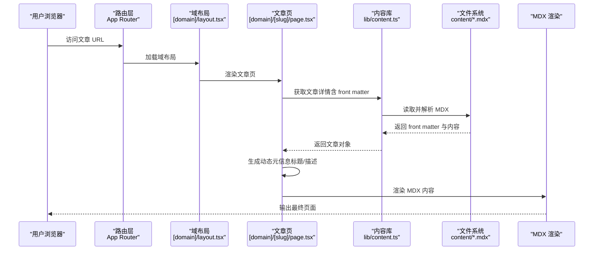
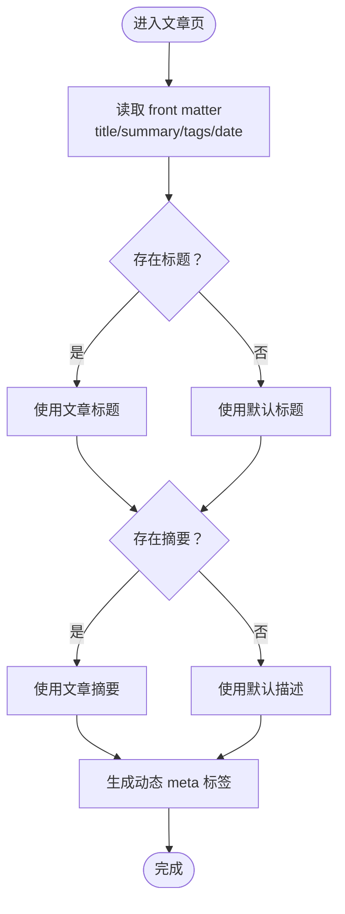
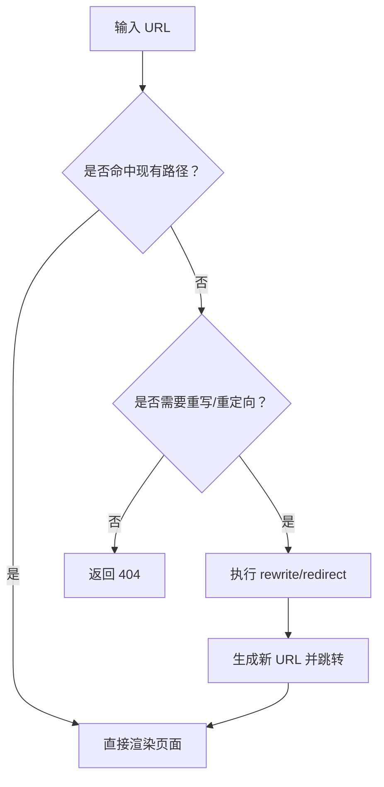
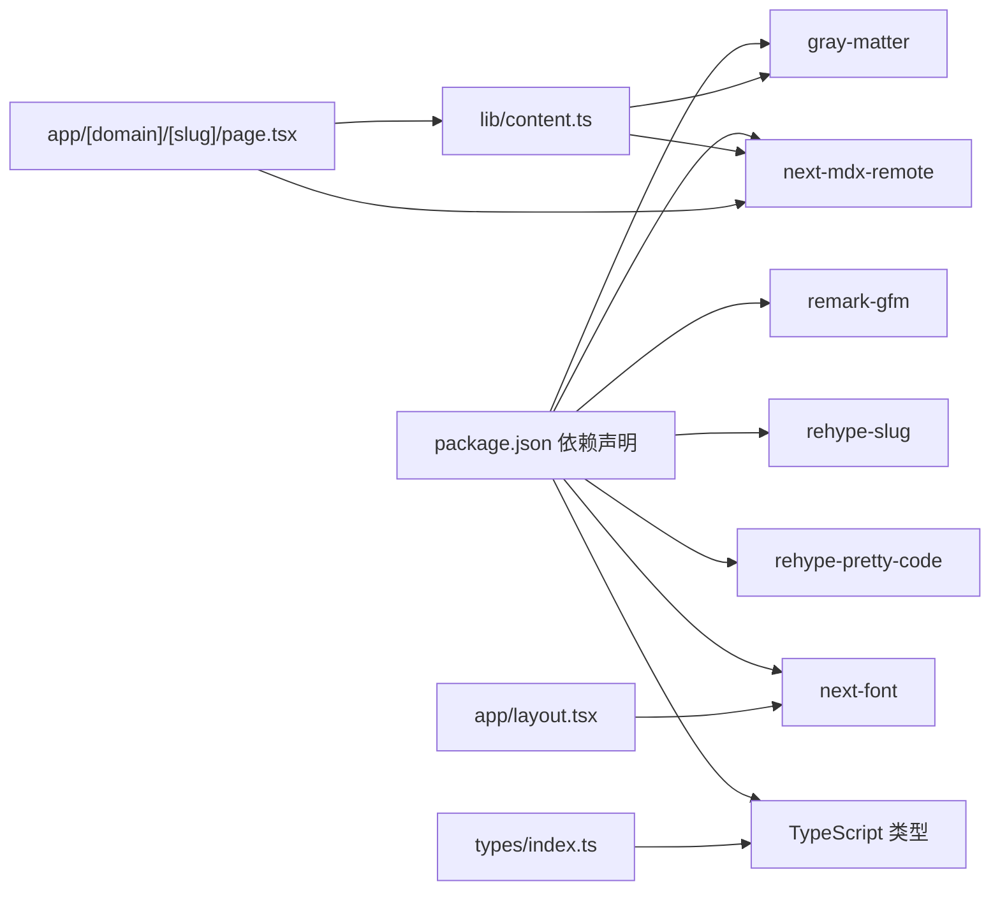

# SEO 优化策略

<cite>
**本文引用的文件**
- [README.md](file://README.md)
- [next.config.ts](file://next.config.ts)
- [package.json](file://package.json)
- [src/config/site.ts](file://src/config/site.ts)
- [src/app/layout.tsx](file://src/app/layout.tsx)
- [src/app/[domain]/layout.tsx](file://src/app/[domain]/layout.tsx)
- [src/app/[domain]/[slug]/page.tsx](file://src/app/[domain]/[slug]/page.tsx)
- [src/lib/content.ts](file://src/lib/content.ts)
- [src/lib/domains.ts](file://src/lib/domains.ts)
- [src/types/index.ts](file://src/types/index.ts)
- [src/components/article/MDXComponents.tsx](file://src/components/article/MDXComponents.tsx)
- [content/software-dev-languages/java/spring-boot-intro.mdx](file://content/software-dev-languages/java/spring-boot-intro.mdx)
</cite>

## 目录
1. [引言](#引言)
2. [项目结构](#项目结构)
3. [核心组件](#核心组件)
4. [架构总览](#架构总览)
5. [详细组件分析](#详细组件分析)
6. [依赖分析](#依赖分析)
7. [性能考虑](#性能考虑)
8. [故障排查指南](#故障排查指南)
9. [结论](#结论)
10. [附录](#附录)

## 引言
本文件面向 SEO 优化策略，结合当前代码库的实际实现，系统性阐述以下主题：
- 动态 meta 标签生成机制（标题、描述等）
- 结构化数据（Schema.org）的实现现状与扩展建议
- Open Graph 与 Twitter Card 元标签的配置与使用
- URL 结构优化（友好路径设计与重定向策略）
- 页面速度优化（静态生成、代码分割与资源优化）
- SEO 监控与分析工具的集成方案

## 项目结构
该博客采用 Next.js App Router 架构，内容以 MDX 文档形式存储于 content 目录，运行时通过自定义的 content 读取与解析模块生成页面元信息与内容。

图表来源
- [src/app/layout.tsx:38-60](file://src/app/layout.tsx#L38-L60)
- [src/app/[domain]/layout.tsx](file://src/app/[domain]/layout.tsx#L10-L29)
- [src/app/[domain]/[slug]/page.tsx](file://src/app/[domain]/[slug]/page.tsx#L15-L27)
- [src/lib/content.ts:102-131](file://src/lib/content.ts#L102-L131)
- [src/lib/domains.ts:1-136](file://src/lib/domains.ts#L1-L136)
- [src/types/index.ts:1-45](file://src/types/index.ts#L1-L45)
- [src/components/article/MDXComponents.tsx:1-70](file://src/components/article/MDXComponents.tsx#L1-L70)
- [src/config/site.ts:1-20](file://src/config/site.ts#L1-L20)

章节来源
- [README.md:1-37](file://README.md#L1-L37)
- [src/app/layout.tsx:1-61](file://src/app/layout.tsx#L1-L61)
- [src/app/[domain]/layout.tsx](file://src/app/[domain]/layout.tsx#L1-L30)
- [src/app/[domain]/[slug]/page.tsx](file://src/app/[domain]/[slug]/page.tsx#L1-L100)
- [src/lib/content.ts:1-158](file://src/lib/content.ts#L1-L158)
- [src/lib/domains.ts:1-136](file://src/lib/domains.ts#L1-L136)
- [src/types/index.ts:1-45](file://src/types/index.ts#L1-L45)
- [src/config/site.ts:1-20](file://src/config/site.ts#L1-L20)

## 核心组件
- 全局布局与默认元信息：根布局负责设置站点标题模板与基础描述，并注入导航与页脚。
- 域布局：按域渲染侧边栏与内容区域，支持静态参数生成。
- 文章页：动态生成文章级元信息（标题、描述），并渲染 MDX 内容。
- 内容读取：基于 gray-matter 解析 MDX front matter，提取标题、摘要、标签、日期等字段。
- 域与分类：集中定义域与分类结构，为文章归类与导航提供依据。
- MDX 组件：统一标题、链接、列表、表格等元素的样式与行为。

章节来源
- [src/app/layout.tsx:30-36](file://src/app/layout.tsx#L30-L36)
- [src/app/[domain]/layout.tsx](file://src/app/[domain]/layout.tsx#L6-L8)
- [src/app/[domain]/[slug]/page.tsx](file://src/app/[domain]/[slug]/page.tsx#L15-L27)
- [src/lib/content.ts:29-43](file://src/lib/content.ts#L29-L43)
- [src/lib/domains.ts:3-32](file://src/lib/domains.ts#L3-L32)
- [src/components/article/MDXComponents.tsx:1-70](file://src/components/article/MDXComponents.tsx#L1-L70)

## 架构总览
下图展示从请求到页面渲染的关键路径，以及元信息生成与内容解析的协作关系：

图表来源
- [src/app/[domain]/layout.tsx](file://src/app/[domain]/layout.tsx#L10-L29)
- [src/app/[domain]/[slug]/page.tsx](file://src/app/[domain]/[slug]/page.tsx#L15-L27)
- [src/lib/content.ts:102-131](file://src/lib/content.ts#L102-L131)
- [content/software-dev-languages/java/spring-boot-intro.mdx:1-9](file://content/software-dev-languages/java/spring-boot-intro.mdx#L1-L9)

## 详细组件分析

### 动态 meta 标签生成机制
- 全局默认元信息：根布局设置标题模板与默认描述，确保所有页面具备一致的品牌信息。
- 文章级动态元信息：文章页通过 generateMetadata 动态返回文章标题与摘要，作为页面的标题与描述。
- 关键字段来源：front matter 中的 title、summary 字段用于生成 meta 标签；若缺失则回退至安全值。
- 可扩展点：可在此基础上增加 keywords、author、publisher、robots 等字段，或根据文章标签生成关键词列表。

图表来源
- [src/app/[domain]/[slug]/page.tsx](file://src/app/[domain]/[slug]/page.tsx#L15-L27)
- [src/lib/content.ts:29-43](file://src/lib/content.ts#L29-L43)
- [content/software-dev-languages/java/spring-boot-intro.mdx:1-9](file://content/software-dev-languages/java/spring-boot-intro.mdx#L1-L9)

章节来源
- [src/app/layout.tsx:30-36](file://src/app/layout.tsx#L30-L36)
- [src/app/[domain]/[slug]/page.tsx](file://src/app/[domain]/[slug]/page.tsx#L15-L27)
- [src/lib/content.ts:29-43](file://src/lib/content.ts#L29-L43)
- [content/software-dev-languages/java/spring-boot-intro.mdx:1-9](file://content/software-dev-languages/java/spring-boot-intro.mdx#L1-L9)

### 结构化数据（Schema.org）实现现状与扩展
- 当前实现：未在页面中直接输出结构化数据（如 Article、BreadcrumbList 等）。
- 扩展建议：
  - 在文章页 generateMetadata 中，除返回标准 meta 外，还可返回 structuredData 或通过自定义属性传递 JSON-LD。
  - 对于 Article，可包含 headline、datePublished、dateModified、author、publisher、description、image 等字段。
  - 对于 BreadcrumbList，可基于 URL 路径与域/分类层级动态生成 breadcrumbList。
- 注意事项：确保 JSON-LD 的结构与 Schema.org 规范一致，避免重复标记与字段冲突。

章节来源
- [src/app/[domain]/[slug]/page.tsx](file://src/app/[domain]/[slug]/page.tsx#L15-L27)
- [src/lib/domains.ts:3-32](file://src/lib/domains.ts#L3-L32)
- [src/types/index.ts:1-45](file://src/types/index.ts#L1-L45)

### Open Graph 与 Twitter Card 元标签
- 当前实现：未显式配置 Open Graph 或 Twitter Card 的 meta 标签。
- 推荐配置（可在 generateMetadata 中返回）：
  - og:title、og:description、og:url、og:image、og:type
  - twitter:card、twitter:title、twitter:description、twitter:image
- 图片建议：使用固定尺寸的封面图（如 1200x630），并确保图片可被搜索引擎抓取。
- 动态生成：可从文章 front matter 中读取 image 字段，若无则回退至站点默认图。

章节来源
- [src/app/[domain]/[slug]/page.tsx](file://src/app/[domain]/[slug]/page.tsx#L15-L27)
- [src/lib/content.ts:29-43](file://src/lib/content.ts#L29-L43)
- [content/software-dev-languages/java/spring-boot-intro.mdx:1-9](file://content/software-dev-languages/java/spring-boot-intro.mdx#L1-L9)

### URL 结构优化
- 友好路径设计：
  - 域/分类/文章三级路径：[domain]/[category]/[slug]，便于语义化与可读性。
  - 使用 generateStaticParams 预渲染所有文章，提升首屏性能与 SEO 抓取效率。
- 重定向策略：
  - 若未来调整路径结构，可通过 Next.js 重写（rewrite）或重定向（redirect）规则进行平滑迁移。
  - 对历史外链，建议保留 301 永久重定向，确保权重传递。

图表来源
- [src/app/[domain]/[slug]/page.tsx](file://src/app/[domain]/[slug]/page.tsx#L10-L13)
- [src/app/[domain]/layout.tsx](file://src/app/[domain]/layout.tsx#L6-L8)

章节来源
- [src/app/[domain]/[slug]/page.tsx](file://src/app/[domain]/[slug]/page.tsx#L10-L13)
- [src/app/[domain]/layout.tsx](file://src/app/[domain]/layout.tsx#L6-L8)

### 页面速度优化
- 静态生成与预渲染：
  - generateStaticParams 预渲染所有文章，减少 SSR 压力，提升首屏速度。
- 代码分割：
  - App Router 默认按路由拆分包，保持页面体积最小化。
- 资源优化：
  - 图片与媒体资源建议使用现代格式（WebP）与合适的尺寸，配合懒加载。
  - CSS 与字体加载优化：已使用 next/font 的 display: swap，避免阻塞渲染。
- 分析与监控：
  - 使用 Lighthouse、PageSpeed Insights、Core Web Vitals 等工具定期评估性能指标。

章节来源
- [src/app/[domain]/[slug]/page.tsx](file://src/app/[domain]/[slug]/page.tsx#L10-L13)
- [src/app/layout.tsx:10-28](file://src/app/layout.tsx#L10-L28)
- [package.json:11-24](file://package.json#L11-L24)

### SEO 监控与分析工具集成
- 工具选择：
  - Google Search Console：验证站点所有权、提交 sitemap、查看索引状态与抓取错误。
  - Google Analytics 4 / Google Ads：跟踪流量、转化与用户行为。
  - 第三方工具：Ahrefs、SEMrush、Screaming Frog 等进行深度 SEO 审核。
- 集成步骤（通用建议）：
  - 在根布局或公共组件中插入必要的 meta 标签与脚本。
  - 生成并提交 sitemap.xml 至 Search Console。
  - 设置 robots.txt 与结构化数据校验。
- 代码层面注意事项：
  - 确保 generateMetadata 返回的标题与描述符合搜索引擎偏好长度。
  - 避免在动态 meta 中注入过多 JavaScript，以免影响爬虫解析。

章节来源
- [src/app/[domain]/[slug]/page.tsx](file://src/app/[domain]/[slug]/page.tsx#L15-L27)
- [src/app/layout.tsx:30-36](file://src/app/layout.tsx#L30-L36)

## 依赖分析
- 内容解析依赖 gray-matter 与 MDX 生态（next-mdx-remote、remark-gfm、rehype-slug、rehype-pretty-code）。
- 布局与字体依赖 next/font，提升字体加载性能。
- 类型系统由 TypeScript 提供，确保 front matter 字段与类型一致。

图表来源
- [package.json:11-24](file://package.json#L11-L24)
- [src/lib/content.ts:1-158](file://src/lib/content.ts#L1-L158)
- [src/app/[domain]/[slug]/page.tsx](file://src/app/[domain]/[slug]/page.tsx#L3-L9)
- [src/app/layout.tsx:10-28](file://src/app/layout.tsx#L10-L28)
- [src/types/index.ts:1-45](file://src/types/index.ts#L1-L45)

章节来源
- [package.json:11-24](file://package.json#L11-L24)
- [src/lib/content.ts:1-158](file://src/lib/content.ts#L1-L158)
- [src/app/[domain]/[slug]/page.tsx](file://src/app/[domain]/[slug]/page.tsx#L1-L100)
- [src/app/layout.tsx:1-61](file://src/app/layout.tsx#L1-L61)
- [src/types/index.ts:1-45](file://src/types/index.ts#L1-L45)

## 性能考虑
- 首屏性能：通过静态生成与字体 swap 减少阻塞，提升 CLS 与 LCP。
- 内容渲染：MDX 渲染在服务器端完成，避免客户端复杂计算。
- 资源体积：合理裁剪第三方库与按需加载，避免不必要的依赖。
- 索引效率：为每个文章生成独立静态页面，利于搜索引擎快速抓取与索引。

章节来源
- [src/app/[domain]/[slug]/page.tsx](file://src/app/[domain]/[slug]/page.tsx#L76-L96)
- [src/app/layout.tsx:10-28](file://src/app/layout.tsx#L10-L28)
- [package.json:11-24](file://package.json#L11-L24)

## 故障排查指南
- 文章未显示或 404：
  - 检查文章 front matter 是否包含必需字段（title、summary 等）。
  - 确认 generateStaticParams 返回的 slug 列表包含该文章。
- 元信息异常：
  - 若标题或描述为空，检查 generateMetadata 返回逻辑与 front matter 数据。
- 字体或样式问题：
  - 确认 next/font 的变量类名正确应用到 body 根节点。
- MDX 渲染异常：
  - 检查 remark/rehype 插件配置与 MDX 组件映射。

章节来源
- [src/app/[domain]/[slug]/page.tsx](file://src/app/[domain]/[slug]/page.tsx#L102-L131)
- [src/lib/content.ts:29-43](file://src/lib/content.ts#L29-L43)
- [src/app/layout.tsx:50-58](file://src/app/layout.tsx#L50-L58)
- [src/components/article/MDXComponents.tsx:1-70](file://src/components/article/MDXComponents.tsx#L1-L70)

## 结论
本项目已具备良好的 SEO 基础：统一的元信息模板、按文章预渲染的 URL 结构、以及完善的 MDX 内容体系。后续可在以下方面进一步强化：
- 补充结构化数据（Article、BreadcrumbList 等）与 Open Graph/Twitter Card。
- 增强动态 meta 标签的丰富度（keywords、author、publisher 等）。
- 建立持续的 SEO 监控与性能评估流程，确保长期稳定表现。

## 附录
- 站点基础信息：名称、标题、描述、作者、标语与技术栈，可用于统一品牌 meta 输出。
- 域与分类结构：为面包屑与内容导航提供数据支撑。

章节来源
- [src/config/site.ts:1-20](file://src/config/site.ts#L1-L20)
- [src/lib/domains.ts:3-32](file://src/lib/domains.ts#L3-L32)
- [src/types/index.ts:1-45](file://src/types/index.ts#L1-L45)