# 导航状态管理

<cite>
**本文档引用的文件**
- [Navbar.tsx](file://src/components/layout/Navbar.tsx)
- [Sidebar.tsx](file://src/components/layout/Sidebar.tsx)
- [content.ts](file://src/lib/content.ts)
- [domains.ts](file://src/lib/domains.ts)
- [layout.tsx](file://src/app/layout.tsx)
- [index.ts](file://src/types/index.ts)
- [page.tsx](file://src/app/[domain]/[slug]/page.tsx)
- [layout.tsx](file://src/app/[domain]/layout.tsx)
- [package.json](file://package.json)
</cite>

## 目录
1. [简介](#简介)
2. [项目结构](#项目结构)
3. [核心组件](#核心组件)
4. [架构概览](#架构概览)
5. [详细组件分析](#详细组件分析)
6. [依赖关系分析](#依赖关系分析)
7. [性能考虑](#性能考虑)
8. [故障排除指南](#故障排除指南)
9. [结论](#结论)

## 简介

本项目是一个基于 Next.js 的技术博客系统，采用现代化的导航状态管理模式。导航系统通过 React Hooks 实现状态管理，支持桌面端下拉菜单和移动端汉堡菜单的响应式设计。系统实现了完整的导航状态跟踪机制，包括当前激活状态的实时更新、面包屑导航的智能生成、侧边栏导航的状态同步，以及基于内容数据的动态导航条目生成。

## 项目结构

导航系统主要分布在以下目录结构中：

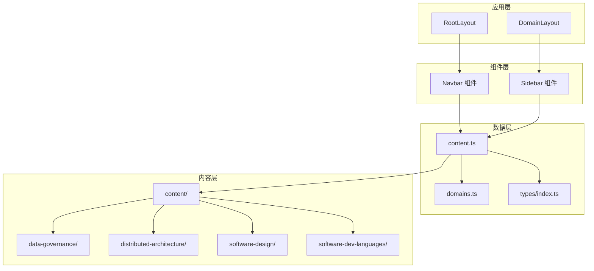

**图表来源**
- [layout.tsx:38-60](file://src/app/layout.tsx#L38-L60)
- [layout.tsx:10-29](file://src/app/[domain]/layout.tsx#L10-L29)

**章节来源**
- [layout.tsx:1-61](file://src/app/layout.tsx#L1-L61)
- [layout.tsx:1-30](file://src/app/[domain]/layout.tsx#L1-L30)

## 核心组件

导航系统由三个核心组件构成：顶部导航栏、侧边栏导航和内容管理系统。每个组件都实现了独立的状态管理机制，同时通过共享的数据层保持状态同步。

### 状态管理架构

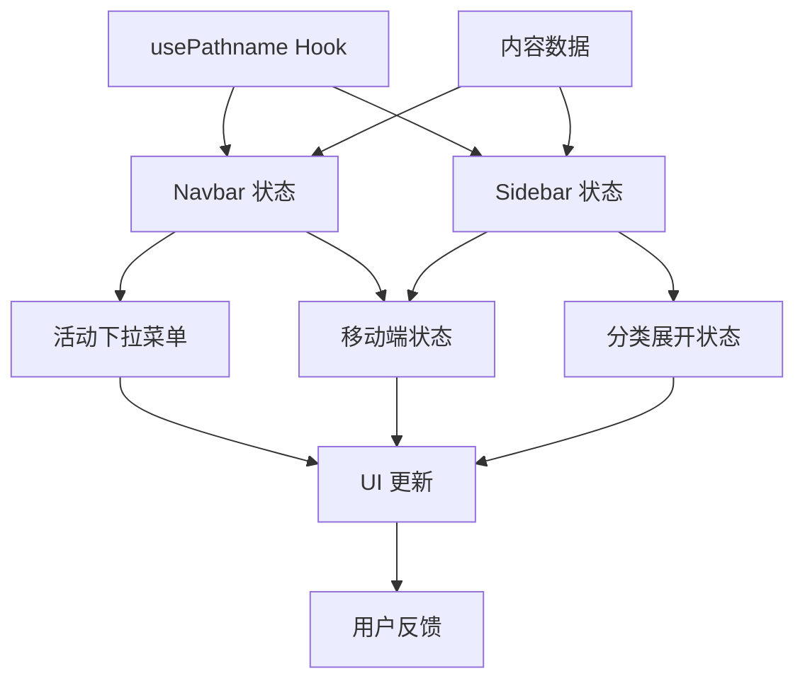

**图表来源**
- [Navbar.tsx:14-33](file://src/components/layout/Navbar.tsx#L14-L33)
- [Sidebar.tsx:14-15](file://src/components/layout/Sidebar.tsx#L14-L15)

**章节来源**
- [Navbar.tsx:1-141](file://src/components/layout/Navbar.tsx#L1-L141)
- [Sidebar.tsx:1-126](file://src/components/layout/Sidebar.tsx#L1-L126)

## 架构概览

导航系统的整体架构采用分层设计，实现了清晰的关注点分离：

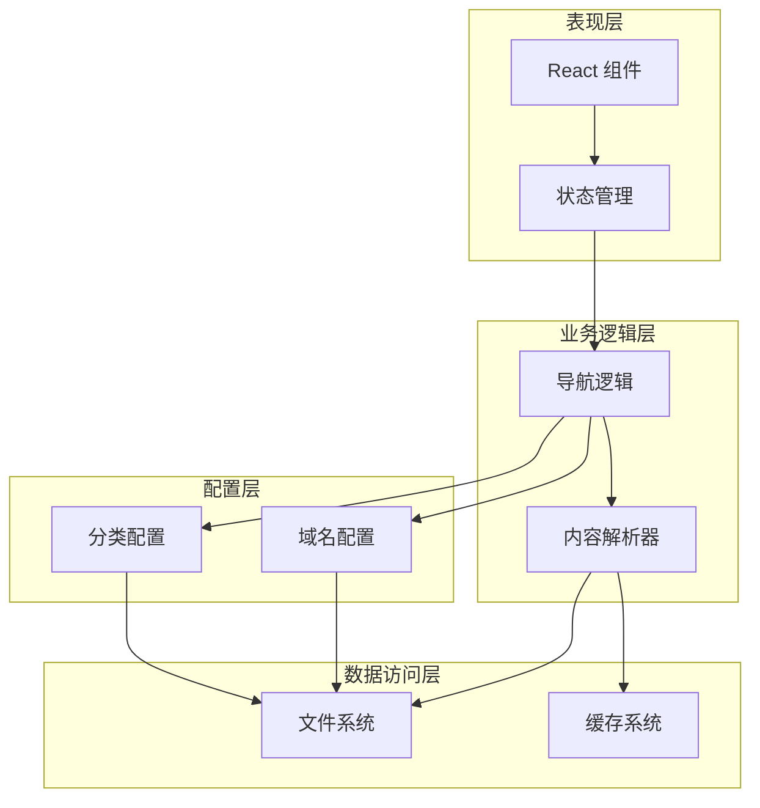

**图表来源**
- [content.ts:45-56](file://src/lib/content.ts#L45-L56)
- [domains.ts:3-32](file://src/lib/domains.ts#L3-L32)

## 详细组件分析

### 顶部导航栏组件

顶部导航栏实现了复杂的交互状态管理，包括桌面端下拉菜单和移动端汉堡菜单的协调工作。

#### 状态管理机制

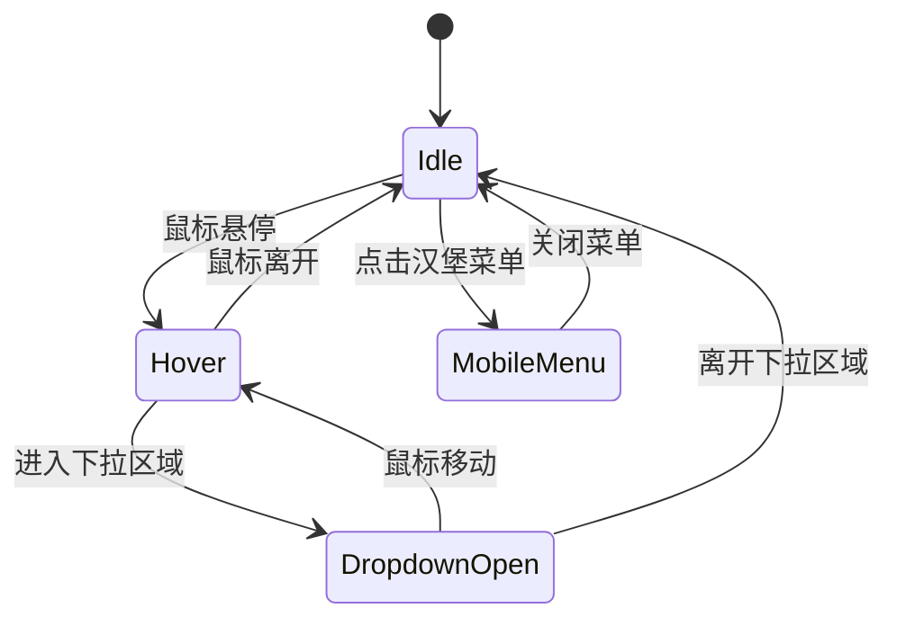

**图表来源**
- [Navbar.tsx:19-28](file://src/components/layout/Navbar.tsx#L19-L28)

#### 激活状态跟踪

导航栏使用 `usePathname` Hook 实时跟踪当前路由状态，并根据路径前缀判断激活状态：

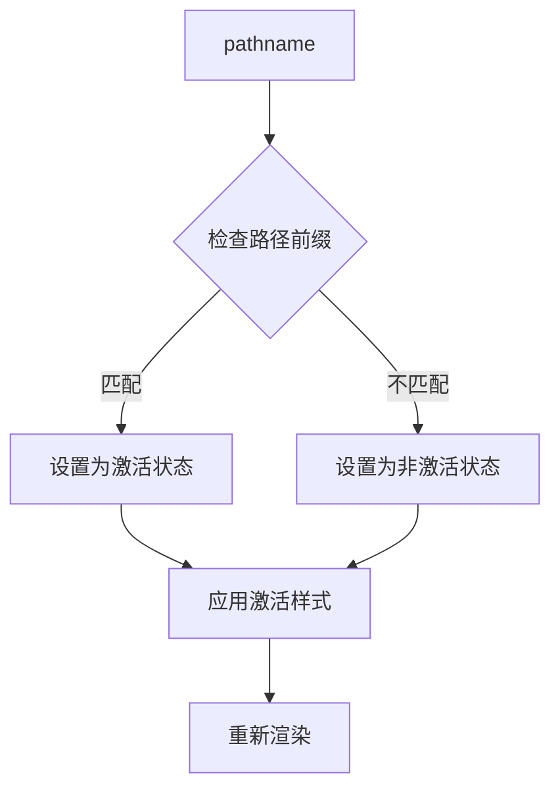

**图表来源**
- [Navbar.tsx:59-63](file://src/components/layout/Navbar.tsx#L59-L63)

**章节来源**
- [Navbar.tsx:1-141](file://src/components/layout/Navbar.tsx#L1-L141)

### 侧边栏导航组件

侧边栏导航实现了更复杂的状态管理，包括分类展开状态、文章激活状态和移动端响应式行为。

#### 分类状态管理

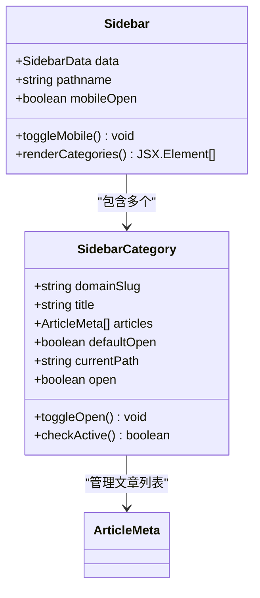

**图表来源**
- [Sidebar.tsx:70-125](file://src/components/layout/Sidebar.tsx#L70-L125)

#### 文章激活检测算法

侧边栏实现了智能的文章激活检测机制：

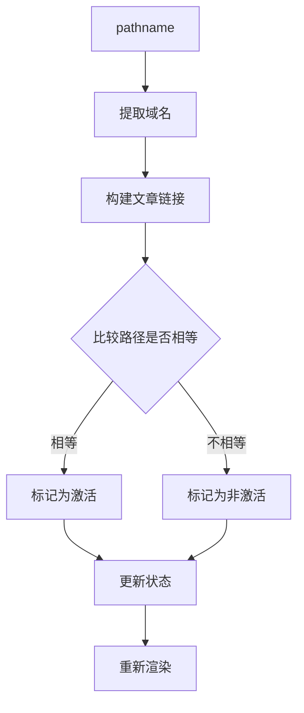

**图表来源**
- [Sidebar.tsx:103-114](file://src/components/layout/Sidebar.tsx#L103-L114)

**章节来源**
- [Sidebar.tsx:1-126](file://src/components/layout/Sidebar.tsx#L1-L126)

### 内容数据管理系统

内容管理系统负责从文件系统中提取导航数据，并提供缓存机制以优化性能。

#### 数据提取流程

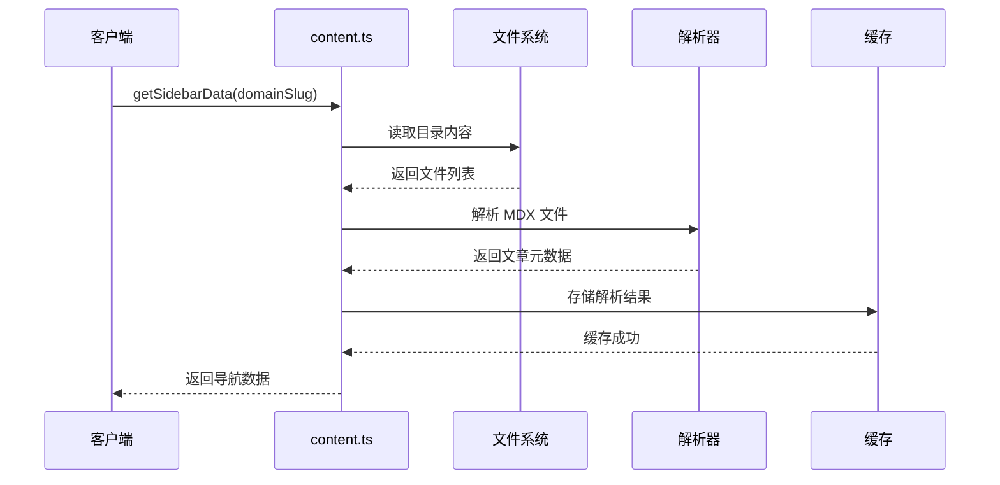

**图表来源**
- [content.ts:133-146](file://src/lib/content.ts#L133-L146)

#### 缓存策略

系统使用 React 的 `cache` 函数实现智能缓存：

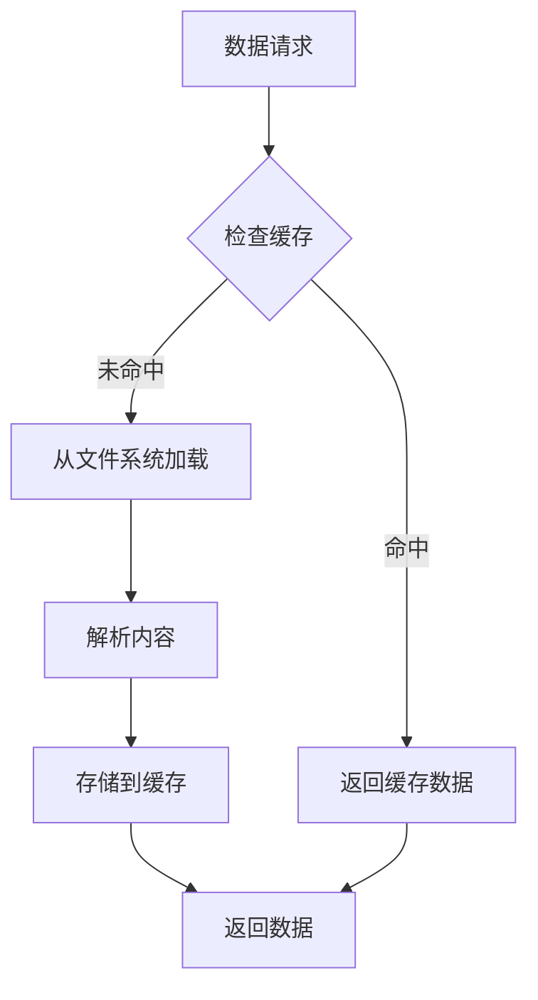

**图表来源**
- [content.ts:45-56](file://src/lib/content.ts#L45-L56)

**章节来源**
- [content.ts:1-158](file://src/lib/content.ts#L1-L158)
- [domains.ts:1-136](file://src/lib/domains.ts#L1-L136)

### 响应式导航设计

导航系统实现了完整的响应式设计，支持桌面端和移动端的不同交互模式。

#### 响应式状态同步

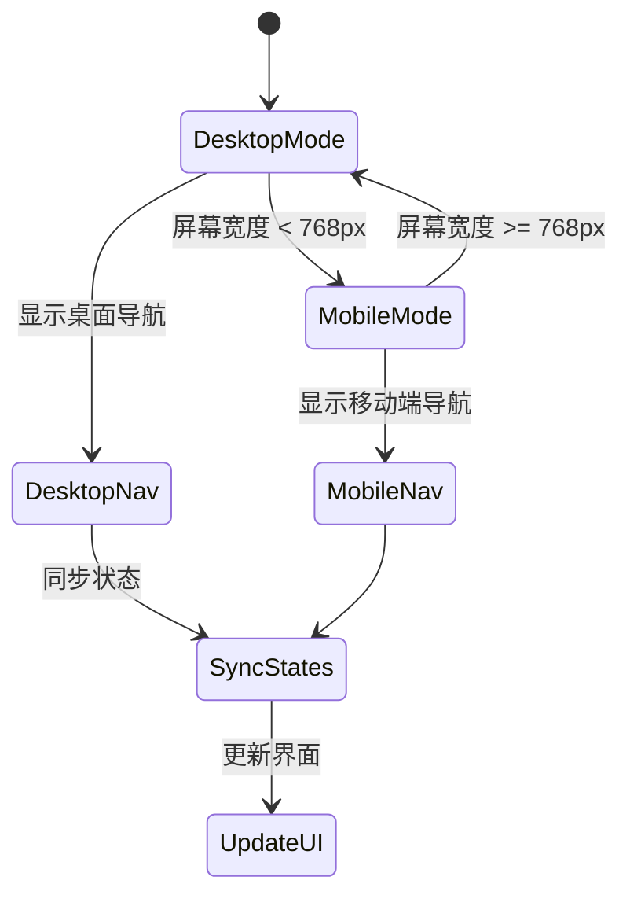

**图表来源**
- [Navbar.tsx:96-103](file://src/components/layout/Navbar.tsx#L96-L103)
- [Sidebar.tsx:19-26](file://src/components/layout/Sidebar.tsx#L19-L26)

#### 移动端交互模式

移动端导航实现了手势友好的交互设计：

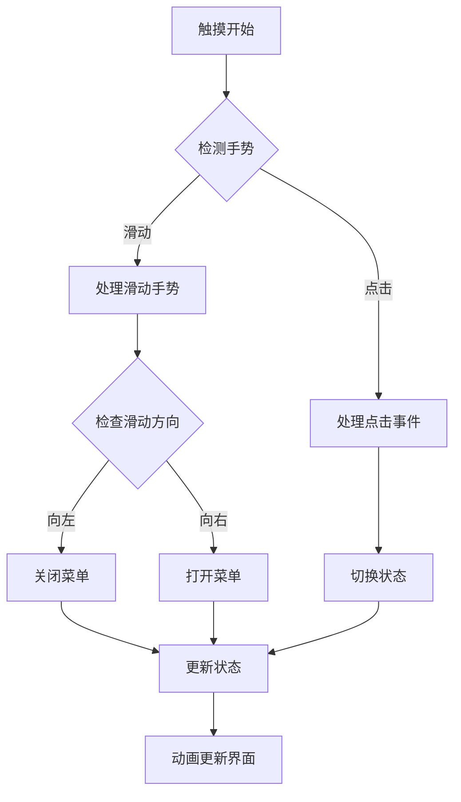

**图表来源**
- [Sidebar.tsx:29-40](file://src/components/layout/Sidebar.tsx#L29-L40)

**章节来源**
- [Navbar.tsx:1-141](file://src/components/layout/Navbar.tsx#L1-L141)
- [Sidebar.tsx:1-126](file://src/components/layout/Sidebar.tsx#L1-L126)

## 依赖关系分析

导航系统的依赖关系体现了清晰的分层架构：

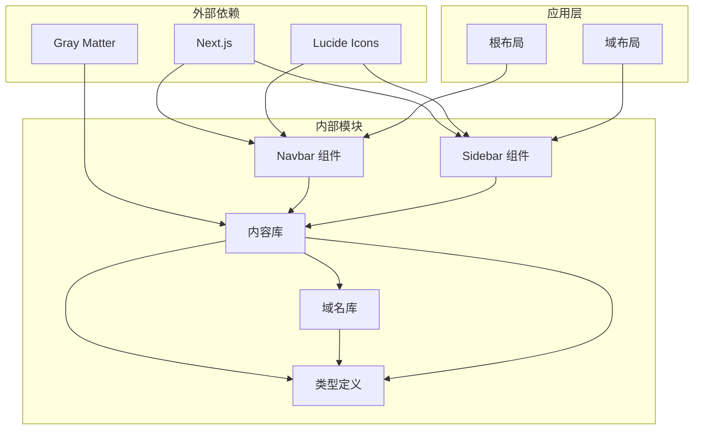

**图表来源**
- [package.json:11-24](file://package.json#L11-L24)
- [layout.tsx:3-6](file://src/app/layout.tsx#L3-L6)

**章节来源**
- [package.json:1-36](file://package.json#L1-L36)
- [index.ts:1-45](file://src/types/index.ts#L1-L45)

## 性能考虑

导航系统在设计时充分考虑了性能优化，采用了多种策略来提升用户体验。

### 缓存优化策略

系统实现了多层次的缓存机制：

1. **React Cache**: 使用 `cache` 函数缓存异步数据操作
2. **内存缓存**: 缓存已解析的内容数据
3. **浏览器缓存**: 利用 Next.js 的静态生成特性

### 渲染优化技巧

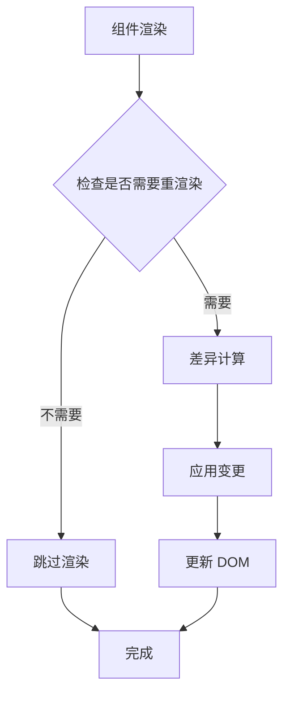

**图表来源**
- [content.ts:45-56](file://src/lib/content.ts#L45-L56)

### 状态更新优化

导航状态更新采用了防抖和节流机制：

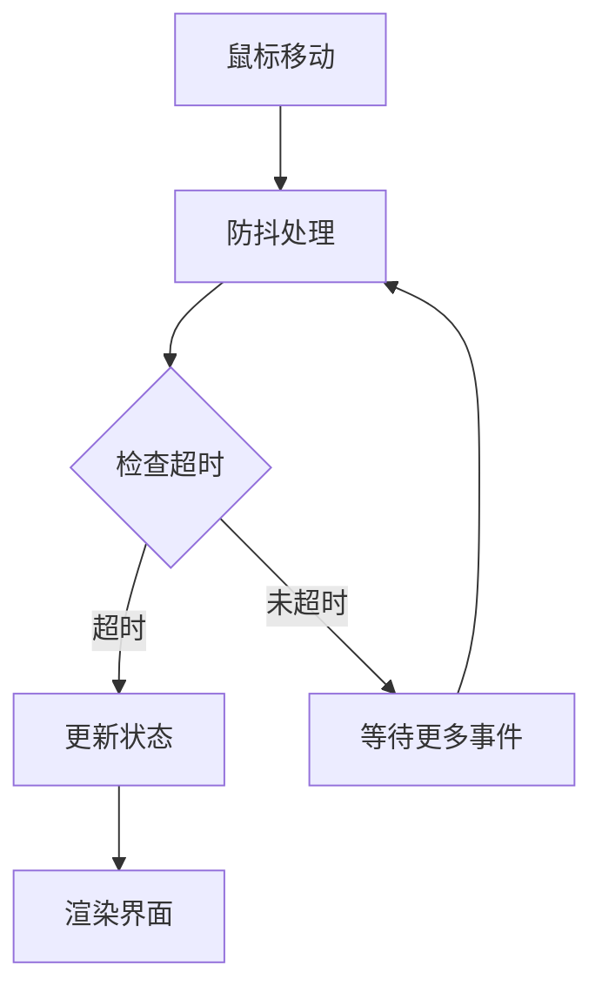

**图表来源**
- [Navbar.tsx:19-28](file://src/components/layout/Navbar.tsx#L19-L28)

## 故障排除指南

### 常见问题诊断

#### 导航状态不同步

**症状**: 桌面端和移动端显示不同的激活状态

**解决方案**:
1. 检查 `usePathname` Hook 的使用
2. 确认状态更新逻辑的一致性
3. 验证响应式断点的正确配置

#### 下拉菜单不显示

**症状**: 桌面端下拉菜单无法正常显示

**解决方案**:
1. 检查 `activeDropdown` 状态的设置
2. 验证鼠标事件处理器的绑定
3. 确认 CSS 样式的正确性

#### 移动端菜单无法关闭

**症状**: 移动端汉堡菜单无法正常关闭

**解决方案**:
1. 检查 `mobileOpen` 状态的切换逻辑
2. 验证点击事件的处理
3. 确认 overlay 背景层的事件绑定

### 性能问题排查

#### 页面加载缓慢

**可能原因**:
1. 内容数据解析过于频繁
2. 缓存机制失效
3. 大量的 DOM 操作

**解决建议**:
1. 检查缓存配置
2. 优化数据加载策略
3. 减少不必要的重渲染

#### 内存泄漏

**症状**: 长时间使用后内存占用持续增长

**解决方案**:
1. 检查定时器的清理
2. 验证事件监听器的移除
3. 确认组件卸载时的状态清理

**章节来源**
- [Navbar.tsx:19-28](file://src/components/layout/Navbar.tsx#L19-L28)
- [Sidebar.tsx:29-40](file://src/components/layout/Sidebar.tsx#L29-L40)

## 结论

本导航状态管理系统展现了现代前端开发的最佳实践，通过合理的架构设计和状态管理策略，实现了高性能、响应式的导航体验。系统的核心优势包括：

1. **状态管理**: 采用 React Hooks 实现了简洁而强大的状态管理机制
2. **响应式设计**: 完整支持桌面端和移动端的不同交互模式
3. **性能优化**: 多层次缓存和渲染优化确保了良好的用户体验
4. **可扩展性**: 清晰的分层架构便于功能扩展和维护

该系统为类似的技术博客或文档网站提供了优秀的导航解决方案，其设计理念和实现细节值得其他项目借鉴和参考。