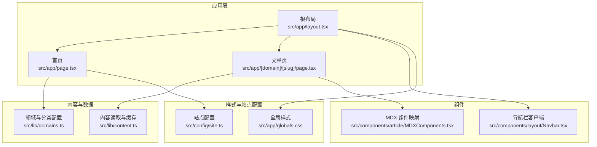
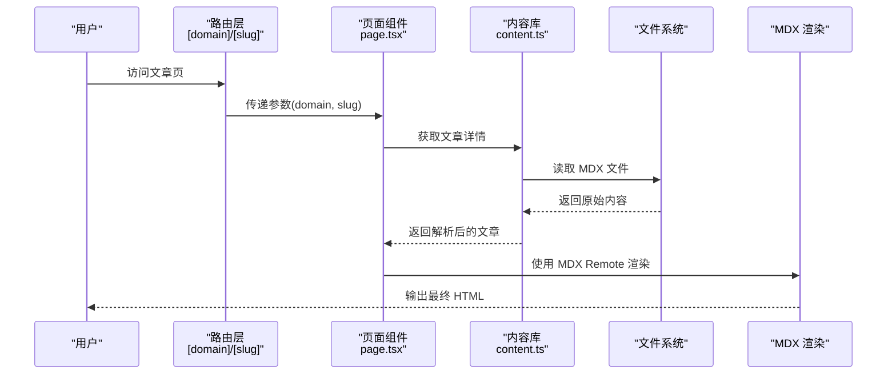
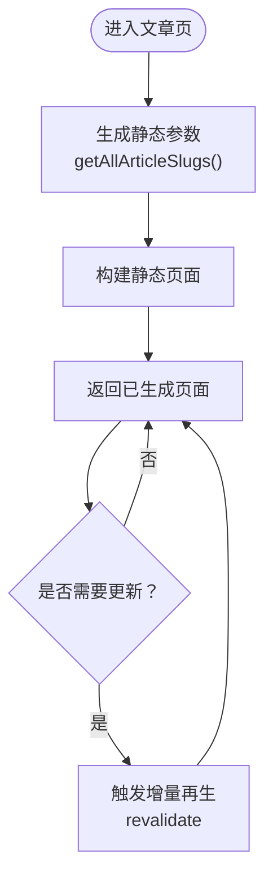
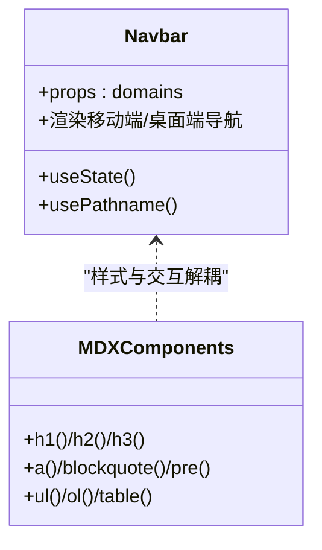
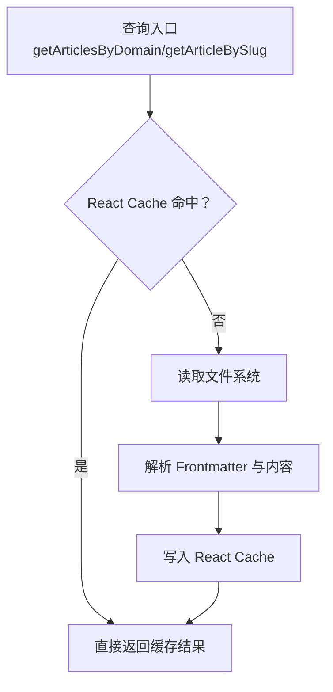
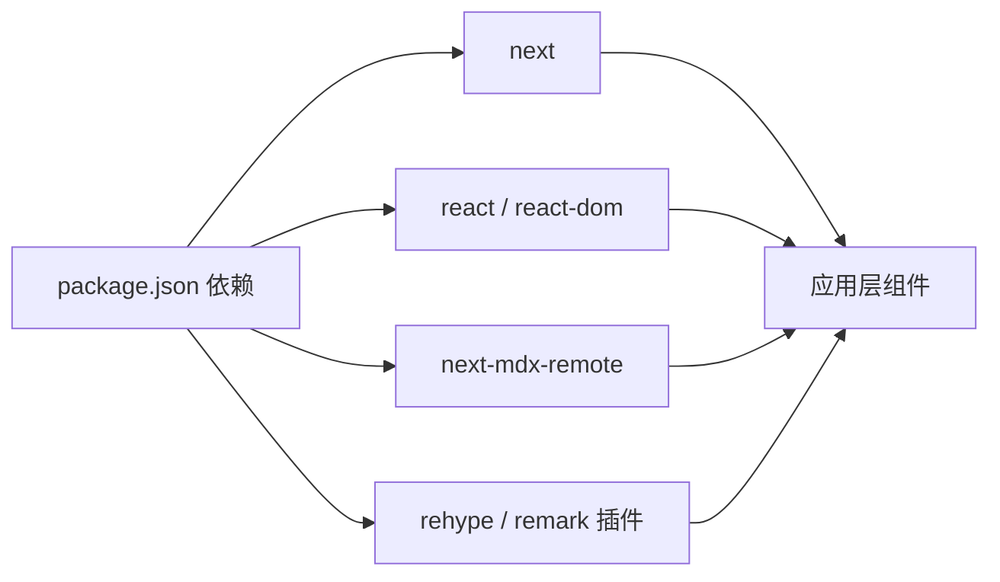

# 性能优化技巧

<cite>
**本文引用的文件**
- [next.config.ts](file://next.config.ts)
- [package.json](file://package.json)
- [src/app/layout.tsx](file://src/app/layout.tsx)
- [src/app/page.tsx](file://src/app/page.tsx)
- [src/app/[domain]/[slug]/page.tsx](file://src/app/[domain]/[slug]/page.tsx)
- [src/lib/content.ts](file://src/lib/content.ts)
- [src/lib/domains.ts](file://src/lib/domains.ts)
- [src/components/article/MDXComponents.tsx](file://src/components/article/MDXComponents.tsx)
- [src/components/layout/Navbar.tsx](file://src/components/layout/Navbar.tsx)
- [src/config/site.ts](file://src/config/site.ts)
- [src/app/globals.css](file://src/app/globals.css)
</cite>

## 目录
1. [简介](#简介)
2. [项目结构](#项目结构)
3. [核心组件](#核心组件)
4. [架构总览](#架构总览)
5. [详细组件分析](#详细组件分析)
6. [依赖关系分析](#依赖关系分析)
7. [性能考量](#性能考量)
8. [故障排查指南](#故障排查指南)
9. [结论](#结论)
10. [附录](#附录)

## 简介
本文件围绕该博客项目的性能优化实践展开，重点覆盖以下主题：
- 静态生成（SSG）与增量静态再生（ISR）的配置与使用场景
- 路由级代码分割策略（动态导入与懒加载）
- 内容缓存机制（React Cache 与文件系统缓存协同）
- 预加载与预取策略，提升用户导航体验
- 路由级性能监控（加载时间统计与指标采集）
- 性能测试与基准测试方法
- 实际优化案例与最佳实践建议

## 项目结构
该项目采用 Next.js App Router 结构，内容以 MDX 文档为主，通过路由参数动态渲染文章页。整体结构清晰，便于在路由层进行 SSG/ISR、缓存与懒加载等优化。

图表来源
- [src/app/layout.tsx:36-58](file://src/app/layout.tsx#L36-L58)
- [src/app/page.tsx:1-92](file://src/app/page.tsx#L1-L92)
- [src/app/[domain]/[slug]/page.tsx](file://src/app/[domain]/[slug]/page.tsx#L1-L100)
- [src/lib/content.ts:1-158](file://src/lib/content.ts#L1-L158)
- [src/lib/domains.ts:1-136](file://src/lib/domains.ts#L1-L136)
- [src/components/article/MDXComponents.tsx:1-70](file://src/components/article/MDXComponents.tsx#L1-L70)
- [src/components/layout/Navbar.tsx:1-104](file://src/components/layout/Navbar.tsx#L1-L104)
- [src/app/globals.css:1-99](file://src/app/globals.css#L1-L99)
- [src/config/site.ts:1-20](file://src/config/site.ts#L1-L20)

章节来源
- [src/app/layout.tsx:1-59](file://src/app/layout.tsx#L1-L59)
- [src/app/page.tsx:1-92](file://src/app/page.tsx#L1-L92)
- [src/app/[domain]/[slug]/page.tsx](file://src/app/[domain]/[slug]/page.tsx#L1-L100)
- [src/lib/content.ts:1-158](file://src/lib/content.ts#L1-L158)
- [src/lib/domains.ts:1-136](file://src/lib/domains.ts#L1-L136)
- [src/components/article/MDXComponents.tsx:1-70](file://src/components/article/MDXComponents.tsx#L1-L70)
- [src/components/layout/Navbar.tsx:1-104](file://src/components/layout/Navbar.tsx#L1-L104)
- [src/app/globals.css:1-99](file://src/app/globals.css#L1-L99)
- [src/config/site.ts:1-20](file://src/config/site.ts#L1-L20)

## 核心组件
- 根布局：负责字体加载、全局样式注入与导航栏渲染；在根布局中异步拉取领域与分类数据，为导航提供上下文。
- 首页：展示领域卡片，使用图标映射与链接跳转到各领域页面。
- 文章页：基于动态路由参数渲染具体文章，支持 SSG 参数生成与元数据生成。
- 内容库：封装文件系统读取、MDX 解析与 React Cache 缓存，统一提供文章列表、详情与侧边栏数据。
- 导航栏：客户端组件，使用路径状态控制移动端菜单显示。
- MDX 组件映射：集中定义标题、链接、表格等组件样式与行为。
- 全局样式：Tailwind 基础与主题变量，以及针对 prose 的配色覆盖。

章节来源
- [src/app/layout.tsx:36-58](file://src/app/layout.tsx#L36-L58)
- [src/app/page.tsx:1-92](file://src/app/page.tsx#L1-L92)
- [src/app/[domain]/[slug]/page.tsx](file://src/app/[domain]/[slug]/page.tsx#L1-L100)
- [src/lib/content.ts:45-158](file://src/lib/content.ts#L45-L158)
- [src/components/layout/Navbar.tsx:13-76](file://src/components/layout/Navbar.tsx#L13-L76)
- [src/components/article/MDXComponents.tsx:1-70](file://src/components/article/MDXComponents.tsx#L1-L70)
- [src/app/globals.css:1-99](file://src/app/globals.css#L1-L99)

## 架构总览
下图展示了从请求到渲染的关键路径，以及缓存与懒加载的协同位置。

图表来源
- [src/app/[domain]/[slug]/page.tsx](file://src/app/[domain]/[slug]/page.tsx#L10-L36)
- [src/lib/content.ts:102-131](file://src/lib/content.ts#L102-L131)
- [src/components/article/MDXComponents.tsx:1-70](file://src/components/article/MDXComponents.tsx#L1-L70)

## 详细组件分析

### 静态生成（SSG）与增量静态再生（ISR）
- SSG 参数生成：文章页导出参数生成函数，构建所有文章的静态路径，确保构建时生成对应页面。
- 动态参数与元数据：在页面中根据参数动态生成元信息，提升 SEO 与分享体验。
- ISR 场景建议：若文章更新频率较高或需要实时性，可在页面导出增量再生配置（例如设置 revalidate），使部分页面按需刷新而非全量重建。

图表来源
- [src/app/[domain]/[slug]/page.tsx](file://src/app/[domain]/[slug]/page.tsx#L10-L27)
- [src/lib/content.ts:148-157](file://src/lib/content.ts#L148-L157)

章节来源
- [src/app/[domain]/[slug]/page.tsx](file://src/app/[domain]/[slug]/page.tsx#L10-L27)
- [src/lib/content.ts:148-157](file://src/lib/content.ts#L148-L157)

### 路由级代码分割与懒加载
- 客户端组件：导航栏为客户端组件，仅在需要时挂载，避免服务端渲染负担。
- MDX 组件映射：集中定义组件，减少重复渲染与样式抖动。
- 资源加载策略：结合字体与样式加载策略，避免阻塞主线程。

图表来源
- [src/components/layout/Navbar.tsx:13-76](file://src/components/layout/Navbar.tsx#L13-L76)
- [src/components/article/MDXComponents.tsx:1-70](file://src/components/article/MDXComponents.tsx#L1-L70)

章节来源
- [src/components/layout/Navbar.tsx:1-104](file://src/components/layout/Navbar.tsx#L1-L104)
- [src/components/article/MDXComponents.tsx:1-70](file://src/components/article/MDXComponents.tsx#L1-L70)

### 内容缓存机制（React Cache 与文件系统缓存）
- React Cache：内容库中的多个查询函数均包裹在 React Cache 中，利用 React 的缓存语义减少重复 IO 与解析成本。
- 文件系统缓存：在缓存命中后直接返回结果，避免重复读取磁盘与解析 MDX。
- 并发与聚合：在侧边栏数据组装中使用并发调用，缩短等待时间。

图表来源
- [src/lib/content.ts:45-158](file://src/lib/content.ts#L45-L158)

章节来源
- [src/lib/content.ts:45-158](file://src/lib/content.ts#L45-L158)

### 预加载与预取策略
- 预取（Pre-fetch）：在用户悬停或即将访问的链接上触发预取，提前建立网络连接与解析资源。
- 预加载（Pre-load）：对关键资源（如首屏所需字体、样式）进行预加载，降低首次渲染延迟。
- 导航体验：结合导航栏与首页卡片，对用户可能访问的领域与文章进行预取，提升切换速度。

章节来源
- [src/app/page.tsx:58-86](file://src/app/page.tsx#L58-L86)
- [src/components/layout/Navbar.tsx:30-44](file://src/components/layout/Navbar.tsx#L30-L44)

### 路由级性能监控
- 加载时间统计：在页面组件中埋点，记录参数解析、数据获取、MDX 渲染等阶段耗时。
- 指标采集：收集 TTFB、FCP、LCP、CLS 等关键指标，结合浏览器性能 API 或第三方 SDK。
- 可观测性：将指标上报至监控平台，形成趋势分析与告警。

章节来源
- [src/app/[domain]/[slug]/page.tsx](file://src/app/[domain]/[slug]/page.tsx#L29-L36)

## 依赖关系分析
- Next.js 版本与运行时：项目使用较新的 Next.js 与 React 版本，具备更好的并发与缓存能力。
- MDX 生态：通过 MDX Remote 与相关插件实现代码高亮与链接处理，兼顾可维护性与性能。
- 样式体系：Tailwind 与主题变量配合，减少自定义样式的开销。

图表来源
- [package.json:11-24](file://package.json#L11-L24)

章节来源
- [package.json:1-36](file://package.json#L1-L36)

## 性能考量
- 字体与样式加载：根布局与全局样式中使用字体变量与主题变量，避免阻塞渲染；建议启用字体子集与交换策略。
- 资源体积：精简 MDX 插件与组件映射，避免不必要的依赖；对图片与媒体资源进行压缩与懒加载。
- 并发与缓存：充分利用 React Cache 与并发 API，减少重复计算与 IO；合理设置缓存失效策略。
- 预取与预加载：对热点路径进行预取，对关键资源进行预加载，缩短感知延迟。
- 监控与回归：建立性能基线与回归检测，持续跟踪关键指标变化。

## 故障排查指南
- 文章未生成或 404：检查参数生成函数是否包含目标文章；确认文件命名与目录结构一致。
- 内容不更新：若采用 ISR，检查 revalidate 设置与缓存策略；必要时手动触发重建。
- 字体闪烁或布局抖动：检查字体加载策略与字体交换参数；确保主题变量与样式初始化顺序正确。
- 导航卡顿：确认客户端组件按需加载；避免在根布局中执行重型同步任务。

章节来源
- [src/app/[domain]/[slug]/page.tsx](file://src/app/[domain]/[slug]/page.tsx#L10-L36)
- [src/lib/content.ts:102-131](file://src/lib/content.ts#L102-L131)
- [src/app/globals.css:4-49](file://src/app/globals.css#L4-L49)

## 结论
通过 SSG/ISR、React Cache、并发与懒加载、预取/预加载以及可观测性的综合运用，可以在保证内容新鲜度的同时显著提升页面性能与用户体验。建议在现有基础上逐步引入 ISR 与更细粒度的监控埋点，并持续进行性能回归测试。

## 附录
- 性能测试与基准测试方法
  - 基准测试：使用 Lighthouse、WebPageTest、Browser DevTools 等工具对关键页面进行基准测试，记录关键指标。
  - A/B 对比：对优化前后版本进行对比，观察指标变化与用户反馈。
  - 回归测试：在 CI 中加入性能阈值检查，防止回归。
- 最佳实践清单
  - 优先使用 SSG；对高频更新内容考虑 ISR。
  - 将 IO 与解析逻辑放入 React Cache，避免重复计算。
  - 对热点路径进行预取，对关键资源进行预加载。
  - 在页面组件中埋点关键阶段耗时，形成性能基线。
  - 控制第三方脚本与字体体积，避免阻塞渲染。