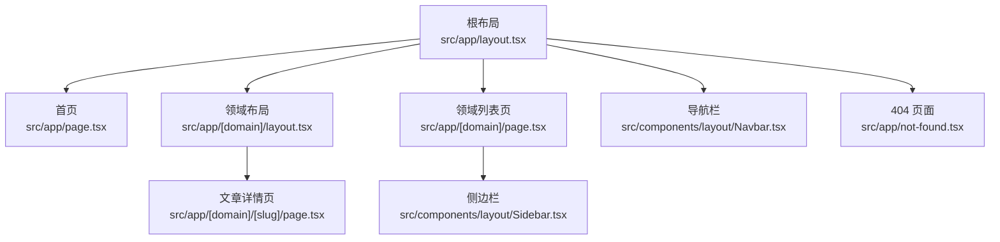
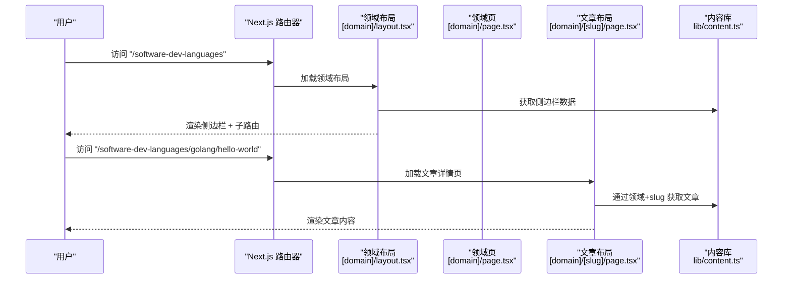
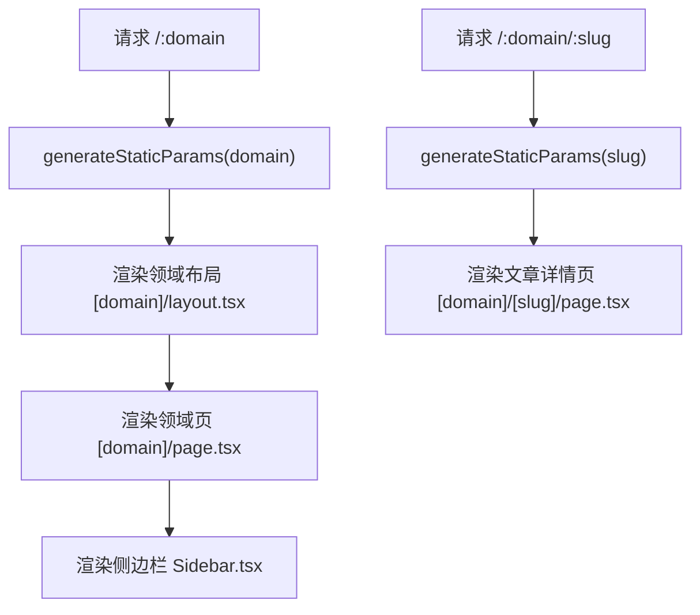
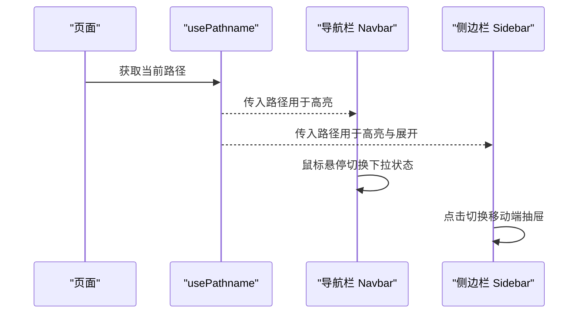
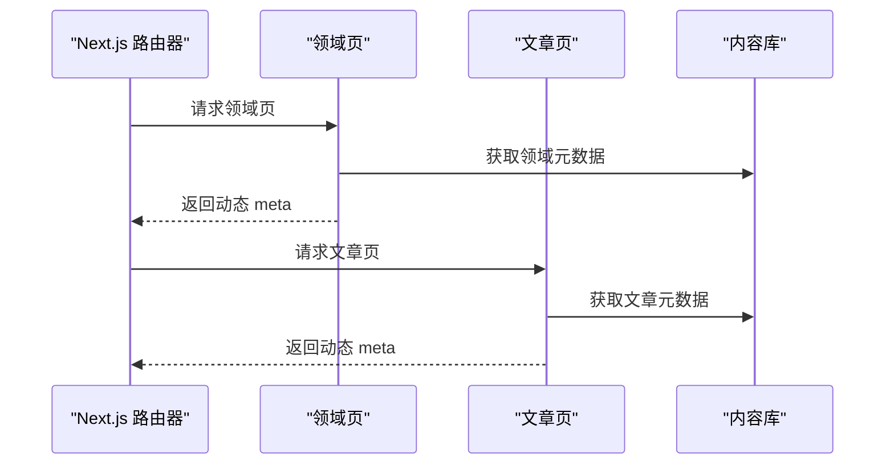
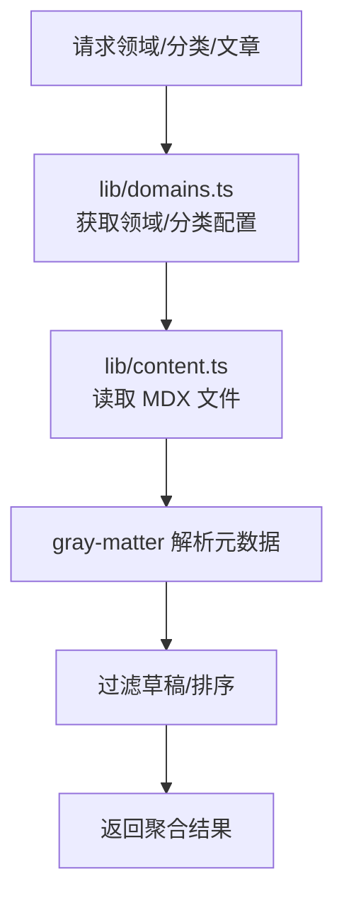
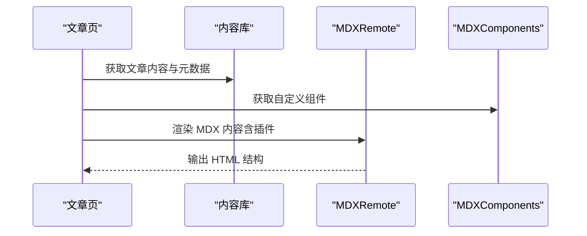
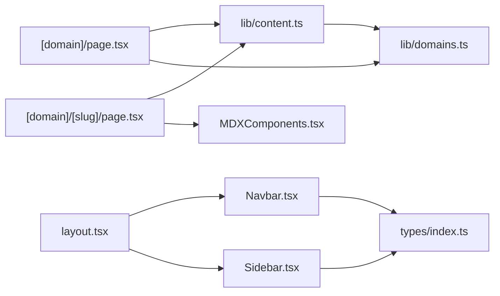

# 路由与导航系统

<cite>
**本文档引用的文件**
- [src/app/layout.tsx](file://src/app/layout.tsx)
- [src/app/[domain]/layout.tsx](file://src/app/[domain]/layout.tsx)
- [src/app/[domain]/page.tsx](file://src/app/[domain]/page.tsx)
- [src/app/[domain]/[slug]/page.tsx](file://src/app/[domain]/[slug]/page.tsx)
- [src/components/layout/Navbar.tsx](file://src/components/layout/Navbar.tsx)
- [src/components/layout/Sidebar.tsx](file://src/components/layout/Sidebar.tsx)
- [src/lib/content.ts](file://src/lib/content.ts)
- [src/lib/domains.ts](file://src/lib/domains.ts)
- [src/types/index.ts](file://src/types/index.ts)
- [src/components/article/MDXComponents.tsx](file://src/components/article/MDXComponents.tsx)
- [src/app/not-found.tsx](file://src/app/not-found.tsx)
- [src/app/page.tsx](file://src/app/page.tsx)
- [src/config/site.ts](file://src/config/site.ts)
- [src/app/globals.css](file://src/app/globals.css)
- [package.json](file://package.json)
- [next.config.ts](file://next.config.ts)
</cite>

## 目录
1. [简介](#简介)
2. [项目结构](#项目结构)
3. [核心组件](#核心组件)
4. [架构总览](#架构总览)
5. [详细组件分析](#详细组件分析)
6. [依赖分析](#依赖分析)
7. [性能考虑](#性能考虑)
8. [故障排除指南](#故障排除指南)
9. [结论](#结论)
10. [附录：路由扩展指南](#附录路由扩展指南)

## 简介
本文件系统路由与导航系统文档聚焦于 blog_new 项目中的 Next.js App Router 文件系统路由机制，涵盖动态路由参数处理、嵌套路由实现、领域/分类/文章三层路由层级关系、页面与布局组件协作模式、导航状态管理与面包屑生成、SEO 动态 meta 标签策略、以及可扩展的路由规则与性能优化建议。读者无需深入源码即可理解系统工作原理，并能据此进行扩展与维护。

## 项目结构
项目采用 Next.js App Router 的文件系统路由约定，通过目录层级表达路由结构：
- 根布局与全局样式：根级 layout.tsx 提供全局字体、主题与导航栏/页脚容器；全局样式在 globals.css 中定义。
- 首页：app/page.tsx 展示领域卡片入口。
- 领域路由：app/[domain]/ 目录下包含领域级布局与列表页。
- 分类路由：app/[domain]/[slug]/ 目录下为具体文章页。
- 通用错误页：app/not-found.tsx 处理 404 场景。

图表来源
- [src/app/layout.tsx:38-60](file://src/app/layout.tsx#L38-L60)
- [src/app/page.tsx:20-91](file://src/app/page.tsx#L20-L91)
- [src/app/[domain]/layout.tsx](file://src/app/[domain]/layout.tsx#L10-L29)
- [src/app/[domain]/page.tsx](file://src/app/[domain]/page.tsx#L25-L88)
- [src/app/[domain]/[slug]/page.tsx](file://src/app/[domain]/[slug]/page.tsx#L29-L99)
- [src/components/layout/Navbar.tsx:13-140](file://src/components/layout/Navbar.tsx#L13-L140)
- [src/components/layout/Sidebar.tsx:13-125](file://src/components/layout/Sidebar.tsx#L13-L125)
- [src/app/not-found.tsx:4-18](file://src/app/not-found.tsx#L4-L18)

章节来源
- [src/app/layout.tsx:1-61](file://src/app/layout.tsx#L1-L61)
- [src/app/page.tsx:1-92](file://src/app/page.tsx#L1-L92)

## 核心组件
- 根布局与全局元数据：根布局负责注入字体变量、全局样式与全局导航栏/页脚容器；同时设置默认站点元数据。
- 领域布局与静态参数生成：领域布局使用 generateStaticParams 预渲染所有领域路由，确保首屏性能与 SEO 友好。
- 领域列表页：异步获取领域信息与分类下的文章列表，渲染分类区块与文章卡片链接。
- 文章详情页：异步获取文章内容，使用 MDX Remote 渲染，配置 remark/rehype 插件以支持 GFM、标题锚点与代码高亮。
- 导航栏与侧边栏：导航栏基于当前路径高亮当前领域；侧边栏根据当前路径高亮对应文章条目。
- 内容读取与缓存：lib/content.ts 封装内容读取、元数据解析与缓存，提供按领域/分类/文章的查询接口。
- 类型系统：types/index.ts 定义 Domain、Category、ArticleMeta、Article、SidebarData 等核心类型。

章节来源
- [src/app/layout.tsx:30-60](file://src/app/layout.tsx#L30-L60)
- [src/app/[domain]/layout.tsx](file://src/app/[domain]/layout.tsx#L6-L8)
- [src/app/[domain]/page.tsx](file://src/app/[domain]/page.tsx#L7-L23)
- [src/app/[domain]/[slug]/page.tsx](file://src/app/[domain]/[slug]/page.tsx#L10-L27)
- [src/components/layout/Navbar.tsx:13-140](file://src/components/layout/Navbar.tsx#L13-L140)
- [src/components/layout/Sidebar.tsx:13-125](file://src/components/layout/Sidebar.tsx#L13-L125)
- [src/lib/content.ts:45-157](file://src/lib/content.ts#L45-L157)
- [src/types/index.ts:1-45](file://src/types/index.ts#L1-L45)

## 架构总览
系统采用“领域-分类-文章”的三层嵌套路由，结合布局组件与内容库协同工作，形成清晰的导航与内容组织方式。

图表来源
- [src/app/[domain]/layout.tsx](file://src/app/[domain]/layout.tsx#L10-L29)
- [src/app/[domain]/page.tsx](file://src/app/[domain]/page.tsx#L25-L88)
- [src/app/[domain]/[slug]/page.tsx](file://src/app/[domain]/[slug]/page.tsx#L29-L99)
- [src/lib/content.ts:133-157](file://src/lib/content.ts#L133-L157)

## 详细组件分析

### 领域路由与嵌套路由
- 动态路由参数：领域路由使用 [domain]，文章路由使用 [domain]/[slug]，参数通过 params Promise 注入到页面与布局组件。
- 静态参数生成：领域布局与领域页均实现 generateStaticParams，返回 domains 或文章 slugs，用于构建静态产物。
- 嵌套关系：领域布局包裹文章详情页，形成父-子关系；侧边栏在领域布局内渲染，承载分类与文章导航。

图表来源
- [src/app/[domain]/layout.tsx](file://src/app/[domain]/layout.tsx#L6-L8)
- [src/app/[domain]/page.tsx](file://src/app/[domain]/page.tsx#L7-L9)
- [src/app/[domain]/[slug]/page.tsx](file://src/app/[domain]/[slug]/page.tsx#L10-L13)

章节来源
- [src/app/[domain]/layout.tsx](file://src/app/[domain]/layout.tsx#L1-L30)
- [src/app/[domain]/page.tsx](file://src/app/[domain]/page.tsx#L1-L89)
- [src/app/[domain]/[slug]/page.tsx](file://src/app/[domain]/[slug]/page.tsx#L1-L100)

### 导航状态管理与面包屑生成
- 导航栏高亮：导航栏使用 usePathname 判断当前路径前缀，高亮对应领域；下拉菜单展示分类项。
- 侧边栏高亮：侧边栏根据当前路径判断是否展开分类与高亮当前文章条目，支持移动端抽屉式交互。
- 面包屑：当前实现未显式生成面包屑组件，但可通过当前路径与领域/分类/文章映射逻辑推导面包屑链路（领域 -> 分类 -> 文章）。

图表来源
- [src/components/layout/Navbar.tsx:14-33](file://src/components/layout/Navbar.tsx#L14-L33)
- [src/components/layout/Sidebar.tsx:14-67](file://src/components/layout/Sidebar.tsx#L14-L67)

章节来源
- [src/components/layout/Navbar.tsx:1-141](file://src/components/layout/Navbar.tsx#L1-L141)
- [src/components/layout/Sidebar.tsx:1-126](file://src/components/layout/Sidebar.tsx#L1-L126)

### SEO 优化策略
- 全局元数据：根布局设置默认标题模板与站点描述，统一品牌识别。
- 动态 meta 标签：领域页与文章页分别在 generateMetadata 中根据领域/文章元数据动态生成 title 与 description。
- 结构化数据：当前未集成结构化数据（如 JSON-LD），可在文章页或领域页中扩展以提升搜索可见性。

图表来源
- [src/app/layout.tsx:30-36](file://src/app/layout.tsx#L30-L36)
- [src/app/[domain]/page.tsx](file://src/app/[domain]/page.tsx#L11-L23)
- [src/app/[domain]/[slug]/page.tsx](file://src/app/[domain]/[slug]/page.tsx#L15-L27)
- [src/lib/content.ts:49-56](file://src/lib/content.ts#L49-L56)
- [src/lib/content.ts:102-131](file://src/lib/content.ts#L102-L131)

章节来源
- [src/app/layout.tsx:30-36](file://src/app/layout.tsx#L30-L36)
- [src/app/[domain]/page.tsx](file://src/app/[domain]/page.tsx#L11-L23)
- [src/app/[domain]/[slug]/page.tsx](file://src/app/[domain]/[slug]/page.tsx#L15-L27)

### 内容读取与缓存机制
- 文件扫描：遍历 content 目录下的领域/分类/文章 MDX 文件，读取原始内容。
- 元数据解析：使用 gray-matter 解析 YAML front matter，过滤草稿条目。
- 缓存策略：使用 React cache 包裹查询函数，避免重复 IO 并提升 SSR/SSG 性能。
- 数据聚合：提供按领域、按分类、按 slug 获取文章的接口，支撑页面渲染。

图表来源
- [src/lib/domains.ts:3-32](file://src/lib/domains.ts#L3-L32)
- [src/lib/domains.ts:129-135](file://src/lib/domains.ts#L129-L135)
- [src/lib/content.ts:15-43](file://src/lib/content.ts#L15-L43)
- [src/lib/content.ts:45-157](file://src/lib/content.ts#L45-L157)

章节来源
- [src/lib/domains.ts:1-136](file://src/lib/domains.ts#L1-L136)
- [src/lib/content.ts:1-158](file://src/lib/content.ts#L1-L158)

### 文章渲染与 MDX 组件
- MDX 渲染：文章详情页使用 next-mdx-remote 的 RSC 版本渲染 MDX 内容。
- 插件配置：启用 remark-gfm 支持 GitHub 风格表格等；rehype-slug 自动生成标题锚点；rehype-pretty-code 高亮代码块。
- 自定义组件：MDXComponents.tsx 提供标题、链接、引用、表格、代码块等组件样式覆盖。

图表来源
- [src/app/[domain]/[slug]/page.tsx](file://src/app/[domain]/[slug]/page.tsx#L37-L99)
- [src/components/article/MDXComponents.tsx:3-69](file://src/components/article/MDXComponents.tsx#L3-L69)
- [src/lib/content.ts:102-131](file://src/lib/content.ts#L102-L131)

章节来源
- [src/app/[domain]/[slug]/page.tsx](file://src/app/[domain]/[slug]/page.tsx#L1-L100)
- [src/components/article/MDXComponents.tsx:1-70](file://src/components/article/MDXComponents.tsx#L1-L70)

### 错误处理与 404 页面
- notFound 触发：当领域或文章不存在时，调用 notFound 触发 404 渲染。
- 404 页面：提供简洁的 404 提示与返回首页按钮，改善用户体验。

章节来源
- [src/app/[domain]/layout.tsx](file://src/app/[domain]/layout.tsx#L17-L19)
- [src/app/[domain]/page.tsx](file://src/app/[domain]/page.tsx#L31-L32)
- [src/app/[domain]/[slug]/page.tsx](file://src/app/[domain]/[slug]/page.tsx#L35-L36)
- [src/app/not-found.tsx:4-18](file://src/app/not-found.tsx#L4-L18)

## 依赖分析
- 组件耦合：导航栏与侧边栏依赖当前路径与领域配置；页面组件依赖内容库；MDX 渲染依赖插件生态。
- 外部依赖：next、next-mdx-remote、gray-matter、remark/rehype 生态、lucide-react 图标库。
- 配置：next.config.ts 当前为空配置，package.json 定义了运行时与开发时依赖。

图表来源
- [src/components/layout/Navbar.tsx:1-141](file://src/components/layout/Navbar.tsx#L1-L141)
- [src/components/layout/Sidebar.tsx:1-126](file://src/components/layout/Sidebar.tsx#L1-L126)
- [src/app/[domain]/page.tsx](file://src/app/[domain]/page.tsx#L1-L89)
- [src/app/[domain]/[slug]/page.tsx](file://src/app/[domain]/[slug]/page.tsx#L1-L100)
- [src/lib/content.ts:1-158](file://src/lib/content.ts#L1-L158)
- [src/lib/domains.ts:1-136](file://src/lib/domains.ts#L1-L136)
- [src/types/index.ts:1-45](file://src/types/index.ts#L1-L45)
- [src/components/article/MDXComponents.tsx:1-70](file://src/components/article/MDXComponents.tsx#L1-L70)
- [src/app/layout.tsx:1-61](file://src/app/layout.tsx#L1-L61)

章节来源
- [package.json:11-24](file://package.json#L11-L24)
- [next.config.ts:3-5](file://next.config.ts#L3-L5)

## 性能考虑
- 预渲染与静态参数：领域布局与领域页使用 generateStaticParams，提前生成静态产物，降低首屏延迟。
- 内容缓存：React cache 包裹内容查询，避免重复 IO，提升 SSR/SSG 性能。
- MDX 渲染优化：仅在需要时渲染，避免不必要的重渲染；代码高亮使用服务端渲染，减少客户端负担。
- 字体与样式：全局字体变量与 Tailwind 主题变量减少样式计算开销；滚动条与排版样式在全局 CSS 中集中管理。
- 图标与资源：lucide-react 作为轻量图标库，按需引入；图片资源建议使用 next/image 优化（当前项目未使用图片资源）。

## 故障排除指南
- 404 页面：当领域或文章不存在时触发 notFound，检查领域/分类/文章 slug 是否正确，确认 content 目录结构与 front matter 配置。
- 导航高亮异常：若导航栏或侧边栏未正确高亮，请检查 usePathname 返回值与路径匹配逻辑，确保路径前缀一致。
- MDX 渲染问题：若文章内容未正确渲染，检查 MDX 文件是否存在、front matter 是否完整、MDX 插件配置是否正确。
- SEO 元数据缺失：若动态 meta 标签未生效，检查 generateMetadata 返回值与内容库返回的元数据字段是否一致。

章节来源
- [src/app/not-found.tsx:4-18](file://src/app/not-found.tsx#L4-L18)
- [src/components/layout/Navbar.tsx:14-33](file://src/components/layout/Navbar.tsx#L14-L33)
- [src/components/layout/Sidebar.tsx:47-61](file://src/components/layout/Sidebar.tsx#L47-L61)
- [src/app/[domain]/[slug]/page.tsx](file://src/app/[domain]/[slug]/page.tsx#L77-L95)
- [src/app/[domain]/page.tsx](file://src/app/[domain]/page.tsx#L11-L23)

## 结论
该路由与导航系统通过清晰的文件系统路由约定与布局嵌套，实现了领域-分类-文章的三层导航体系；结合静态参数生成、内容缓存与 MDX 渲染，兼顾了性能与可维护性。导航栏与侧边栏的状态管理直观高效，SEO 通过动态 meta 标签得到良好支持。未来可在面包屑生成、结构化数据与图片优化等方面进一步增强。

## 附录：路由扩展指南
- 新增领域
  - 在 domains.ts 中新增领域条目，包含 slug、title、description、icon、order。
  - 在 content 目录下创建对应领域的目录结构，准备分类与文章 MDX 文件。
  - 领域布局与领域页会自动通过 generateStaticParams 生成静态路由。
- 新增分类
  - 在 domains.ts 的 categoriesByDomain 对应领域下新增分类条目。
  - 在 content/领域/分类 下创建文章 MDX 文件，确保 front matter 字段完整。
- 新增文章
  - 在 content/领域/分类 下新增 .mdx 文件，front matter 包含 title、date、summary、tags、category、domain 等字段。
  - 文章详情页会自动通过 generateStaticParams 生成静态路由。
- 扩展导航入口
  - 若需在首页或其他位置增加入口，可在相应页面组件中引入领域卡片或链接，保持与现有导航风格一致。
- SEO 与结构化数据
  - 可在文章页 generateMetadata 中扩展 JSON-LD 结构化数据，提升搜索可见性。
- 性能优化建议
  - 使用 React.cache 包裹热点查询；合理拆分内容模块，避免一次性加载过多数据。
  - 对于大体量文章，可考虑分页或懒加载策略；MDX 渲染时注意插件数量与体积。

章节来源
- [src/lib/domains.ts:3-32](file://src/lib/domains.ts#L3-L32)
- [src/lib/domains.ts:34-127](file://src/lib/domains.ts#L34-L127)
- [src/lib/content.ts:148-157](file://src/lib/content.ts#L148-L157)
- [src/app/[domain]/layout.tsx](file://src/app/[domain]/layout.tsx#L6-L8)
- [src/app/[domain]/page.tsx](file://src/app/[domain]/page.tsx#L7-L9)
- [src/app/[domain]/[slug]/page.tsx](file://src/app/[domain]/[slug]/page.tsx#L10-L13)
- [src/app/page.tsx:58-86](file://src/app/page.tsx#L58-L86)
- [src/app/[domain]/[slug]/page.tsx](file://src/app/[domain]/[slug]/page.tsx#L15-L27)