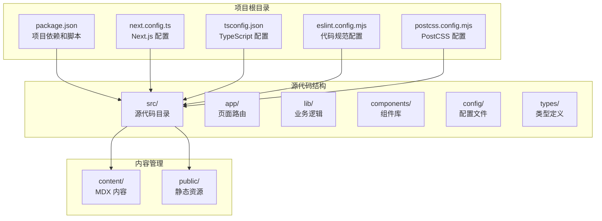
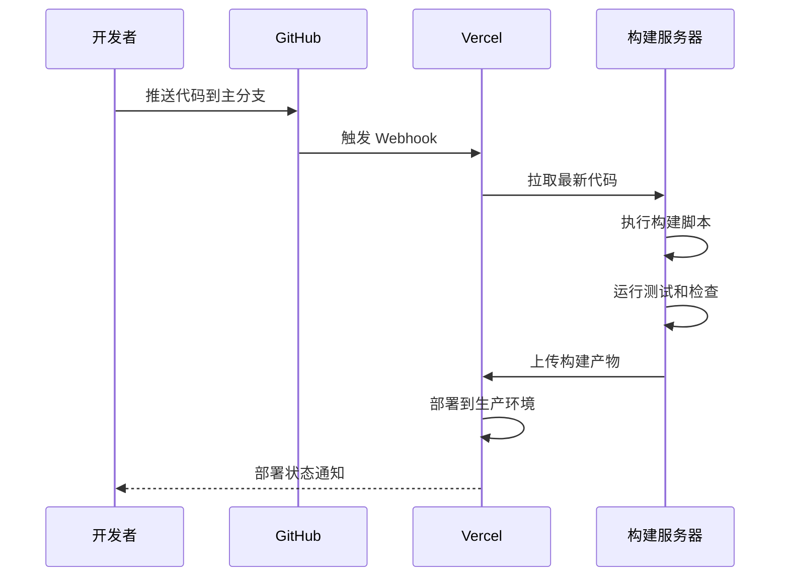
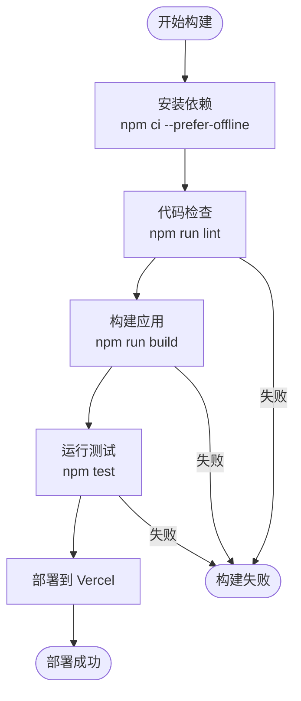
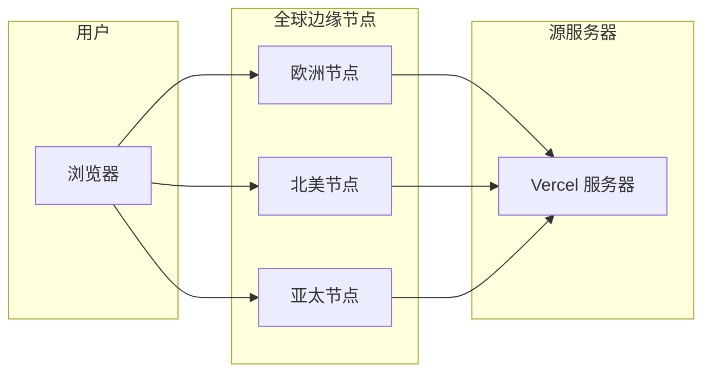
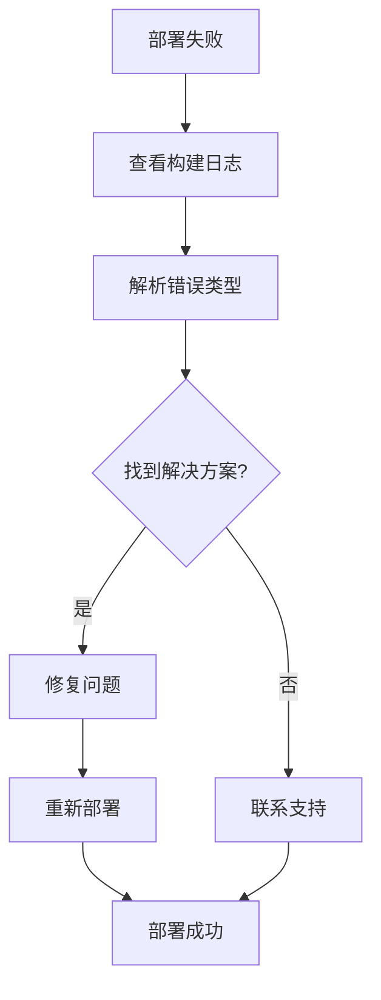
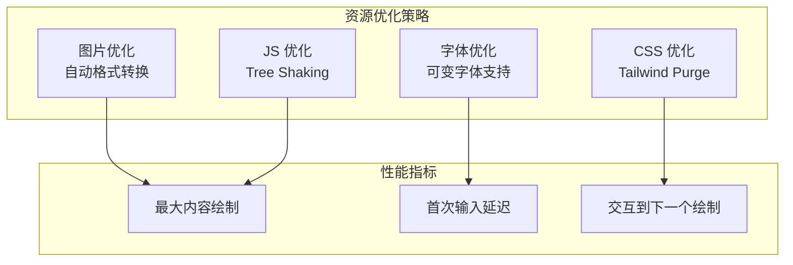
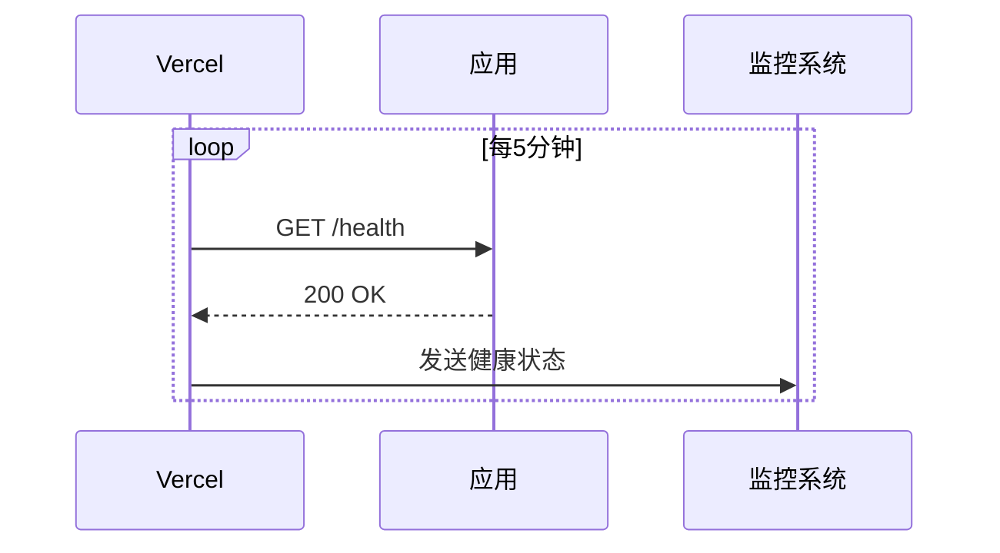
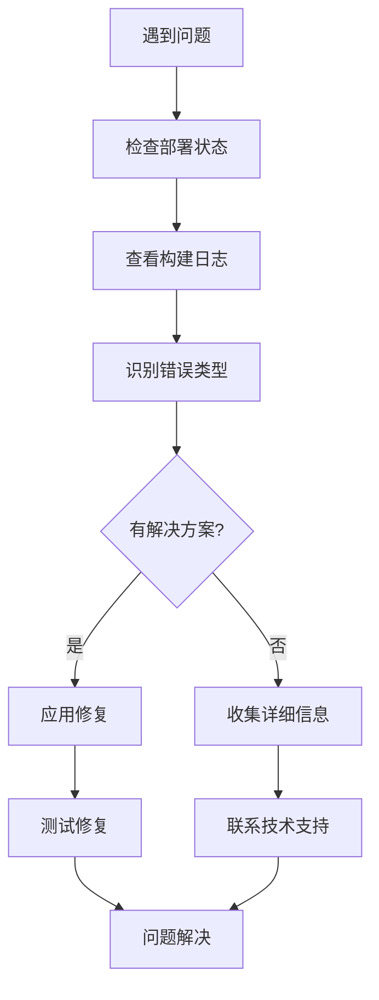

# Vercel 平台部署

<cite>
**本文档引用的文件**
- [package.json](file://package.json)
- [next.config.ts](file://next.config.ts)
- [README.md](file://README.md)
- [src/config/site.ts](file://src/config/site.ts)
- [src/lib/content.ts](file://src/lib/content.ts)
- [src/lib/domains.ts](file://src/lib/domains.ts)
- [tsconfig.json](file://tsconfig.json)
- [postcss.config.mjs](file://postcss.config.mjs)
- [eslint.config.mjs](file://eslint.config.mjs)
- [next-env.d.ts](file://next-env.d.ts)
</cite>

## 目录
1. [简介](#简介)
2. [项目结构概览](#项目结构概览)
3. [Vercel 部署前准备](#vercel-部署前准备)
4. [Vercel 项目初始化](#vercel-项目初始化)
5. [环境变量配置](#环境变量配置)
6. [构建设置配置](#构建设置配置)
7. [自动部署流程详解](#自动部署流程详解)
8. [域名绑定与 SSL 配置](#域名绑定与-ssl-配置)
9. [Vercel 特有配置选项](#vercel-特有配置选项)
10. [部署失败排查](#部署失败排查)
11. [性能优化建议](#性能优化建议)
12. [生产环境最佳实践](#生产环境最佳实践)
13. [故障排除指南](#故障排除指南)
14. [总结](#总结)

## 简介

本指南详细介绍了如何将 blog_new 项目部署到 Vercel 平台。blog_new 是一个基于 Next.js 16.1.6 构建的技术博客网站，采用 TypeScript 开发，使用 TailwindCSS 进行样式设计，并集成了 MDX 内容管理系统。该项目支持多领域内容组织，包括软件开发语言、分布式架构、数据治理和软件设计等领域。

## 项目结构概览

blog_new 项目采用标准的 Next.js 应用程序结构，主要包含以下关键组件：



**图表来源**
- [package.json:1-36](file://package.json#L1-L36)
- [next.config.ts:1-8](file://next.config.ts#L1-L8)
- [tsconfig.json:1-35](file://tsconfig.json#L1-L35)

**章节来源**
- [package.json:1-36](file://package.json#L1-L36)
- [next.config.ts:1-8](file://next.config.ts#L1-L8)
- [tsconfig.json:1-35](file://tsconfig.json#L1-L35)

## Vercel 部署前准备

在开始 Vercel 部署之前，需要完成以下准备工作：

### 1. 本地环境验证

确保本地开发环境正常运行：
- 安装 Node.js LTS 版本
- 克隆项目到本地
- 安装依赖：`npm install`
- 启动开发服务器：`npm run dev`
- 访问 `http://localhost:3000` 验证应用功能

### 2. 代码质量检查

运行代码检查工具确保代码质量：
```bash
npm run lint
```

### 3. 构建测试

执行构建命令验证生产环境构建：
```bash
npm run build
```

**章节来源**
- [README.md:1-37](file://README.md#L1-L37)
- [eslint.config.mjs:1-19](file://eslint.config.mjs#L1-L19)

## Vercel 项目初始化

### 1. 创建 Vercel 账户

访问 [Vercel 官网](https://vercel.com/) 创建免费账户或使用 GitHub 账户登录。

### 2. 连接 GitHub 仓库

- 在 Vercel 仪表板中点击 "New Project"
- 选择 "Import Git Repository"
- 授权 Vercel 访问 GitHub
- 选择 blog_new 仓库
- 点击 "Deploy"

### 3. 项目配置向导

Vercel 会自动检测项目类型为 Next.js，并应用默认配置。对于 blog_new 项目，需要进行以下自定义配置：

**章节来源**
- [README.md:32-37](file://README.md#L32-L37)

## 环境变量配置

### 1. 当前项目状态

经过分析，blog_new 项目目前没有使用任何环境变量。项目配置集中在 `src/config/site.ts` 中的静态配置。

### 2. 可能的环境变量需求

如果未来需要添加功能，可能需要以下环境变量：

| 环境变量名称 | 用途 | 默认值 |
|------------|------|--------|
| `NEXT_PUBLIC_SITE_NAME` | 网站名称 | "Canaan's Blog" |
| `NEXT_PUBLIC_SITE_DESCRIPTION` | 网站描述 | "技术学习与项目实践博客" |
| `NEXT_PUBLIC_GA_TRACKING_ID` | Google Analytics ID | 无 |
| `NEXT_PUBLIC_SENTRY_DSN` | Sentry 错误监控 DSN | 无 |

### 3. Vercel 环境变量设置

在 Vercel 项目设置中：
1. 进入 "Settings" > "Environment Variables"
2. 添加环境变量
3. 对于敏感信息勾选 "Production" 或 "Preview" 作用域

**章节来源**
- [src/config/site.ts:1-20](file://src/config/site.ts#L1-L20)

## 构建设置配置

### 1. 默认构建配置

Vercel 自动检测到 Next.js 项目，使用以下默认设置：
- **框架预设**: Next.js
- **Node.js 版本**: 最新 LTS
- **构建目录**: 根目录
- **输出目录**: `.next`

### 2. 自定义构建配置

对于 blog_new 项目，建议保持默认配置，因为项目结构简单且无需特殊处理。

### 3. 构建脚本验证

确保 package.json 中的构建脚本正确：

**章节来源**
- [package.json:5-10](file://package.json#L5-L10)

## 自动部署流程详解

### 1. Git 连接机制

Vercel 通过 GitHub Webhook 实现自动部署：



**图表来源**
- [package.json:5-10](file://package.json#L5-L10)

### 2. 构建钩子流程

Vercel 执行的标准构建流程：



**图表来源**
- [package.json:5-10](file://package.json#L5-L10)
- [eslint.config.mjs:1-19](file://eslint.config.mjs#L1-L19)

### 3. 预览部署机制

每次推送新分支时，Vercel 自动创建预览部署：

1. **分支触发**: 新分支推送到 GitHub
2. **Webhook 触发**: Vercel 收到 GitHub Webhook
3. **独立部署**: 为该分支创建独立的预览环境
4. **URL 分配**: 生成唯一的预览 URL
5. **状态反馈**: 在 PR 中显示部署状态

**章节来源**
- [package.json:5-10](file://package.json#L5-L10)

## 域名绑定与 SSL 配置

### 1. 域名添加流程

1. 在 Vercel 项目设置中进入 "Domains"
2. 输入自定义域名（如 `blog.example.com`）
3. Vercel 显示 DNS 记录要求
4. 在域名注册商处配置 CNAME 记录

### 2. DNS 配置示例

| 记录类型 | 主机名 | 值 | TTL |
|---------|--------|-----|-----|
| CNAME | blog | vercel.com | 1小时 |
| TXT | @ | vercel-dns-verification=... | 1小时 |

### 3. SSL 证书配置

Vercel 自动为所有域名提供免费的 SSL 证书：
- **自动申请**: 无需手动配置
- **自动续期**: 证书到期前自动更新
- **HTTPS 强制**: 所有请求自动重定向到 HTTPS

### 4. 多域名支持

支持同时配置多个域名：
- 主域名: `www.example.com`
- 非 www 域名: `example.com`
- 子域名: `blog.example.com`

**章节来源**
- [README.md:32-37](file://README.md#L32-L37)

## Vercel 特有配置选项

### 1. 函数部署

blog_new 项目是静态 Next.js 应用，不涉及 Serverless Functions。但 Vercel 支持以下函数类型：

- **API Routes**: `/pages/api/*` 路径下的 API 端点
- **Edge Functions**: 使用 Vercel Edge Network 的高性能函数
- **Middleware**: 请求拦截和重写逻辑

### 2. 边缘网络配置

Vercel Edge Network 提供全球 CDN 加速：



**图表来源**
- [next.config.ts:1-8](file://next.config.ts#L1-L8)

### 3. 智能缓存策略

Vercel 自动优化缓存策略：

| 资源类型 | 缓存策略 | 有效期 |
|---------|----------|--------|
| HTML 页面 | 0秒 | 每次请求重新验证 |
| 静态资源 | 1年 | 长期缓存 |
| 图片资源 | 1年 | 长期缓存 |
| 字体文件 | 1年 | 长期缓存 |

### 4. 预渲染优化

Next.js 的静态生成在 Vercel 上得到增强：
- **增量静态再生 (ISR)**: 动态更新内容
- **客户端水合**: 提升交互性能
- **自动代码分割**: 优化加载速度

**章节来源**
- [next.config.ts:1-8](file://next.config.ts#L1-L8)

## 部署失败排查

### 1. 常见部署错误及解决方案

#### A. 依赖安装失败

**错误症状**:
```
npm ERR! peer dep missing
npm ERR! ERESOLVE unable to resolve dependency
```

**解决方案**:
1. 清理缓存: `npm ci --prefer-offline`
2. 检查 Node.js 版本兼容性
3. 更新 package.json 中的版本冲突

#### B. 构建失败

**错误症状**:
```
Failed building static pages
ReferenceError: window is not defined
```

**解决方案**:
1. 检查客户端代码是否在 SSR 环境中使用
2. 使用动态导入或条件渲染
3. 确保所有组件都是客户端安全的

#### C. 内容读取错误

**错误症状**:
```
Error: ENOENT: no such file or directory
```

**解决方案**:
1. 验证 content 目录结构
2. 检查文件权限
3. 确保所有 MDX 文件格式正确

### 2. 日志查看方法

#### A. 控制台日志

在 Vercel 仪表板中：
1. 进入项目 "Logs"
2. 查看实时构建日志
3. 滚动查看完整日志输出

#### B. 详细错误信息



**图表来源**
- [package.json:5-10](file://package.json#L5-L10)

### 3. 性能监控

Vercel 提供内置性能监控：
- **构建时间**: 显示每次构建耗时
- **部署大小**: 统计最终包大小
- **CDN 性能**: 监控全球访问延迟

**章节来源**
- [package.json:5-10](file://package.json#L5-L10)

## 性能优化建议

### 1. 构建优化

#### A. 代码分割

确保使用 Next.js 的自动代码分割：
- 将大型组件拆分为独立模块
- 使用动态导入优化首屏加载
- 避免不必要的全局样式

#### B. 资源优化



**图表来源**
- [postcss.config.mjs:1-8](file://postcss.config.mjs#L1-L8)

### 2. 缓存策略

#### A. 静态资源缓存

- 图片: 1年缓存
- 字体: 1年缓存  
- CSS/JS: 1年缓存
- HTML: 0秒缓存

#### B. API 缓存

对于未来的 API 端点：
- 使用适当的缓存头
- 实现 ETag 支持
- 设置合理的缓存失效时间

**章节来源**
- [postcss.config.mjs:1-8](file://postcss.config.mjs#L1-L8)

## 生产环境最佳实践

### 1. 安全配置

#### A. HTTPS 强制


#### B. CORS 配置

对于 API 端点：
- 限制允许的源
- 设置适当的头部
- 启用预检请求处理

### 2. 监控和告警

#### A. 健康检查



#### B. 错误监控

- 集成 Sentry 或类似服务
- 监控 5xx 错误率
- 设置异常告警阈值

### 3. 备份和恢复

- 定期备份数据库（如有）
- 保留最近 30 天的部署历史
- 准备回滚计划

**章节来源**
- [README.md:32-37](file://README.md#L32-L37)

## 故障排除指南

### 1. 快速诊断步骤



### 2. 常见问题解答

#### A. 为什么我的页面显示空白？

**可能原因**:
- 客户端代码在 SSR 环境中执行
- 缺少必要的 polyfill
- 样式加载失败

**解决方法**:
1. 检查组件的客户端安全性
2. 添加必要的 polyfill
3. 验证样式文件路径

#### B. 如何调试内容加载问题？

**解决步骤**:
1. 检查 content 目录结构
2. 验证 MDX 文件格式
3. 确认文件权限
4. 查看服务器端日志

#### C. 如何优化构建时间？

**优化策略**:
1. 减少依赖数量
2. 使用更精确的版本范围
3. 启用构建缓存
4. 优化大型组件

**章节来源**
- [src/lib/content.ts:1-158](file://src/lib/content.ts#L1-L158)

## 总结

通过本指南，您已经了解了如何将 blog_new 项目成功部署到 Vercel 平台。blog_new 项目作为基于 Next.js 的静态博客应用，具有以下特点：

### 关键优势

1. **零配置部署**: Vercel 自动检测和配置 Next.js 应用
2. **全球 CDN**: Edge Network 提供全球加速
3. **自动 SSL**: 免费的 HTTPS 和自动证书管理
4. **智能缓存**: 自动优化的缓存策略
5. **持续集成**: Git 驱动的自动化部署流程

### 最佳实践要点

- 保持代码简洁和模块化
- 利用 Vercel 的自动优化功能
- 定期监控部署状态和性能指标
- 建立完善的错误监控和告警机制

### 未来发展建议

随着博客内容的增长，可以考虑：
- 添加搜索功能
- 实现评论系统
- 集成社交媒体分享
- 优化 SEO 设置
- 添加多语言支持

通过遵循本指南中的配置和最佳实践，您的 blog_new 博客将在 Vercel 平台上获得稳定、快速和可靠的运行体验。