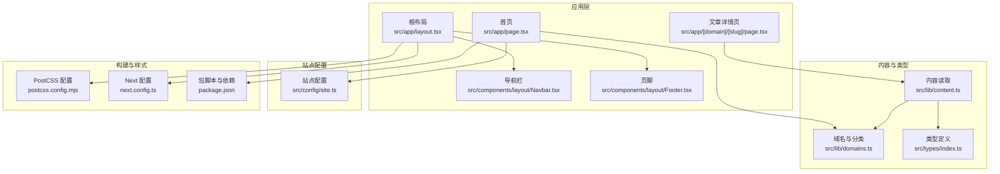
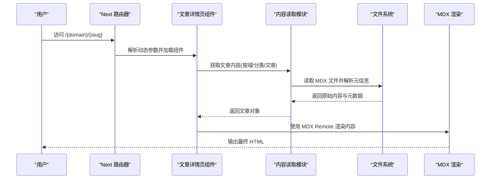
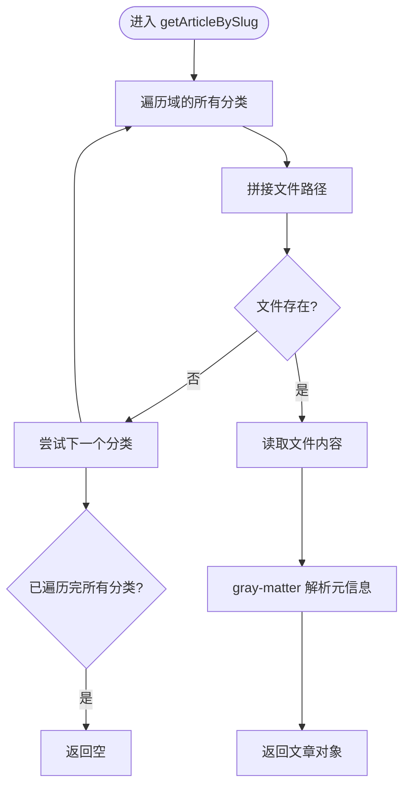
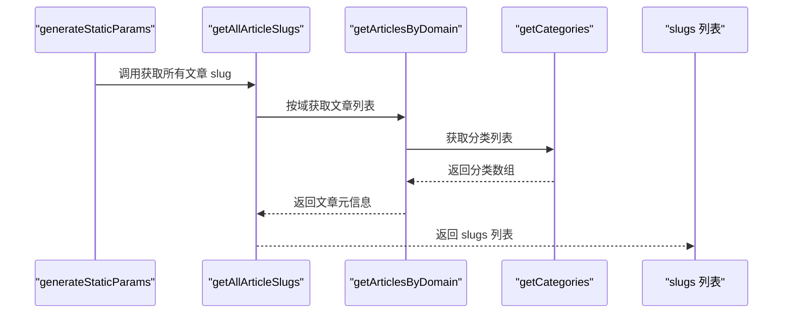
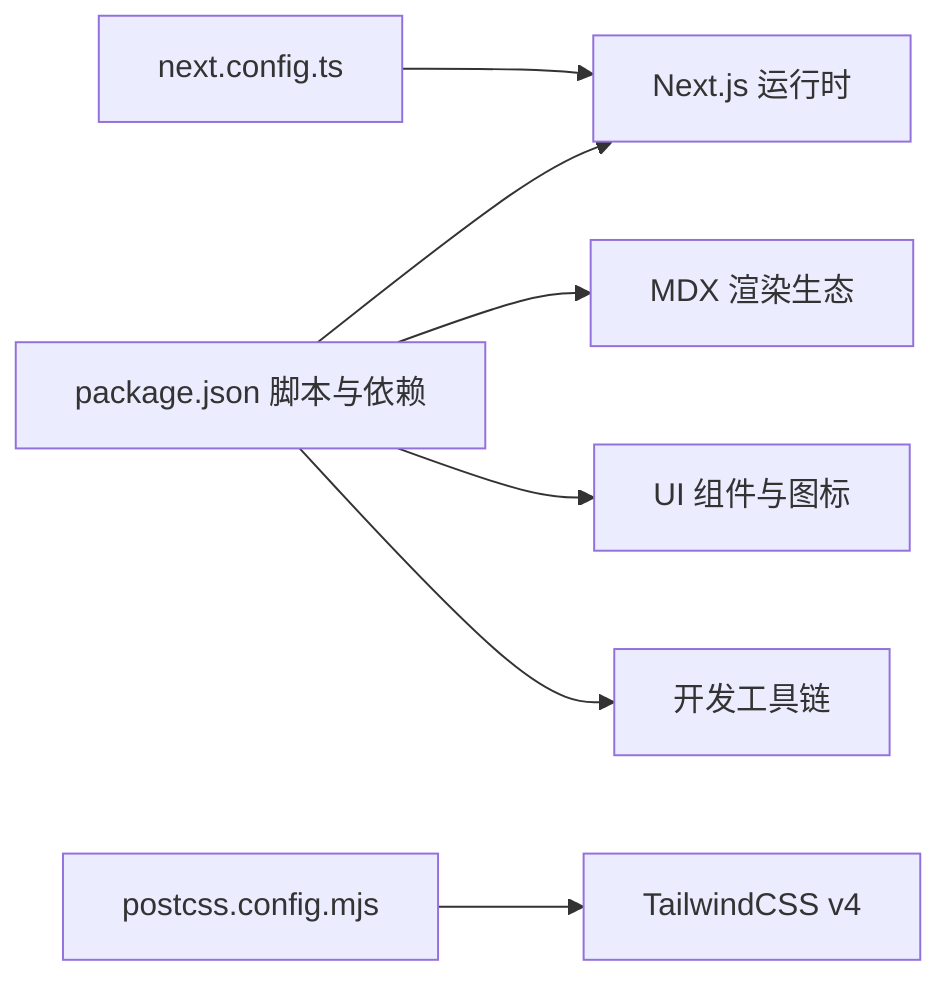

# 故障排除指南

<cite>
**本文引用的文件**
- [package.json](file://package.json)
- [next.config.ts](file://next.config.ts)
- [README.md](file://README.md)
- [postcss.config.mjs](file://postcss.config.mjs)
- [src/app/layout.tsx](file://src/app/layout.tsx)
- [src/app/page.tsx](file://src/app/page.tsx)
- [src/app/[domain]/[slug]/page.tsx](file://src/app/[domain]/[slug]/page.tsx)
- [src/lib/content.ts](file://src/lib/content.ts)
- [src/lib/domains.ts](file://src/lib/domains.ts)
- [src/types/index.ts](file://src/types/index.ts)
- [src/components/layout/Navbar.tsx](file://src/components/layout/Navbar.tsx)
- [src/components/layout/Footer.tsx](file://src/components/layout/Footer.tsx)
- [src/components/article/MDXComponents.tsx](file://src/components/article/MDXComponents.tsx)
- [src/config/site.ts](file://src/config/site.ts)
</cite>

## 目录
1. [简介](#简介)
2. [项目结构](#项目结构)
3. [核心组件](#核心组件)
4. [架构总览](#架构总览)
5. [详细组件分析](#详细组件分析)
6. [依赖分析](#依赖分析)
7. [性能考虑](#性能考虑)
8. [故障排除指南](#故障排除指南)
9. [结论](#结论)
10. [附录](#附录)

## 简介
本指南面向 blog_new 项目的运维与开发团队，提供系统化、可操作的故障排除方法。内容覆盖构建失败、运行时错误、性能问题、网络与第三方服务问题、数据库连接问题（若涉及）、以及跨环境（开发/测试/生产）的排查流程，并给出应急响应与回滚策略、调试工具使用建议及预防性维护清单。

## 项目结构
blog_new 基于 Next.js App Router 架构，采用 TypeScript 与 TailwindCSS，内容以 MDX 文件组织并通过服务端渲染生成页面。核心模块包括：
- 应用布局与路由：根布局、首页、文章详情页
- 内容读取与解析：从 content 目录读取 MDX，解析元信息
- 导航与页脚：基于域名与分类的数据驱动导航
- MDX 组件：自定义标题、链接、表格等渲染组件
- 站点配置：作者、标语、技术栈等静态配置

**图表来源**
- [src/app/layout.tsx:1-61](file://src/app/layout.tsx#L1-L61)
- [src/app/page.tsx:1-92](file://src/app/page.tsx#L1-L92)
- [src/app/[domain]/[slug]/page.tsx](file://src/app/[domain]/[slug]/page.tsx#L1-L100)
- [src/lib/content.ts:1-158](file://src/lib/content.ts#L1-L158)
- [src/lib/domains.ts:1-136](file://src/lib/domains.ts#L1-L136)
- [src/types/index.ts:1-45](file://src/types/index.ts#L1-L45)
- [src/config/site.ts:1-20](file://src/config/site.ts#L1-L20)
- [postcss.config.mjs:1-8](file://postcss.config.mjs#L1-L8)
- [next.config.ts:1-8](file://next.config.ts#L1-L8)
- [package.json:1-36](file://package.json#L1-L36)

**章节来源**
- [package.json:1-36](file://package.json#L1-L36)
- [next.config.ts:1-8](file://next.config.ts#L1-L8)
- [postcss.config.mjs:1-8](file://postcss.config.mjs#L1-L8)
- [README.md:1-37](file://README.md#L1-L37)

## 核心组件
- 根布局与字体加载：负责全局样式、字体变量注入与导航/页脚挂载；异常通常表现为首屏空白或字体闪烁。
- 内容读取与缓存：通过 React cache 包装的异步函数读取 content 目录下的 MDX 文件，解析 gray-matter 元信息；异常多为路径不存在、权限不足或磁盘 IO 错误。
- 文章详情页：动态路由生成静态参数，调用内容读取函数渲染 MDX；异常包括 404、MDX 渲染错误、插件配置问题。
- 导航与页脚：导航根据域名列表渲染；页脚展示版权信息。
- MDX 组件：统一标题、链接、表格等渲染风格；异常多为组件缺失或样式冲突。
- 站点配置：作者、标语、技术栈等静态信息，影响 SEO 与展示。

**章节来源**
- [src/app/layout.tsx:1-61](file://src/app/layout.tsx#L1-L61)
- [src/lib/content.ts:1-158](file://src/lib/content.ts#L1-L158)
- [src/app/[domain]/[slug]/page.tsx](file://src/app/[domain]/[slug]/page.tsx#L1-L100)
- [src/components/layout/Navbar.tsx:1-78](file://src/components/layout/Navbar.tsx#L1-L78)
- [src/components/layout/Footer.tsx:1-21](file://src/components/layout/Footer.tsx#L1-L21)
- [src/components/article/MDXComponents.tsx:1-70](file://src/components/article/MDXComponents.tsx#L1-L70)
- [src/config/site.ts:1-20](file://src/config/site.ts#L1-L20)

## 架构总览
下图展示了从请求到页面渲染的关键路径，以及内容读取与 MDX 渲染的交互关系。

**图表来源**
- [src/app/[domain]/[slug]/page.tsx](file://src/app/[domain]/[slug]/page.tsx#L10-L27)
- [src/lib/content.ts:102-131](file://src/lib/content.ts#L102-L131)
- [src/components/article/MDXComponents.tsx:1-70](file://src/components/article/MDXComponents.tsx#L1-L70)

## 详细组件分析

### 内容读取与缓存机制
- 读取策略：遍历 content 目录，按域/分类子目录读取 .mdx 文件，使用 gray-matter 解析元信息，过滤草稿条目。
- 缓存策略：使用 React cache 包装异步函数，提升重复访问性能。
- 异常点：目录不存在、文件权限不足、磁盘 IO 失败、MDX 语法错误、元信息字段缺失。

**图表来源**
- [src/lib/content.ts:102-131](file://src/lib/content.ts#L102-L131)

**章节来源**
- [src/lib/content.ts:1-158](file://src/lib/content.ts#L1-L158)
- [src/lib/domains.ts:1-136](file://src/lib/domains.ts#L1-L136)
- [src/types/index.ts:1-45](file://src/types/index.ts#L1-L45)

### 文章详情页渲染流程
- 动态参数生成：通过 getAllArticleSlugs 生成静态参数，支持静态预渲染。
- 元数据生成：根据文章标题与摘要生成 SEO 元数据。
- MDX 渲染：使用 next-mdx-remote 的 RSC 版本，启用 remark-gfm 与 rehype 插件链。

**图表来源**
- [src/app/[domain]/[slug]/page.tsx](file://src/app/[domain]/[slug]/page.tsx#L10-L13)
- [src/lib/content.ts:148-157](file://src/lib/content.ts#L148-L157)
- [src/lib/domains.ts:129-135](file://src/lib/domains.ts#L129-L135)

**章节来源**
- [src/app/[domain]/[slug]/page.tsx](file://src/app/[domain]/[slug]/page.tsx#L1-L100)
- [src/lib/content.ts:148-158](file://src/lib/content.ts#L148-L158)

### 导航与页脚
- 导航：根据域名列表渲染主导航，移动端支持折叠菜单。
- 页脚：展示标语与版权信息，提供基础链接。

**章节来源**
- [src/components/layout/Navbar.tsx:1-78](file://src/components/layout/Navbar.tsx#L1-L78)
- [src/components/layout/Footer.tsx:1-21](file://src/components/layout/Footer.tsx#L1-L21)
- [src/lib/domains.ts:3-32](file://src/lib/domains.ts#L3-L32)

### MDX 组件与样式
- 自定义组件：标题、链接、块引用、代码块、列表、表格等。
- 样式：统一的排版与配色，确保代码高亮与可读性。

**章节来源**
- [src/components/article/MDXComponents.tsx:1-70](file://src/components/article/MDXComponents.tsx#L1-L70)

## 依赖分析
- 运行时依赖：Next.js、React、MDX 渲染相关库、图标库等。
- 开发依赖：ESLint、TailwindCSS v4、TypeScript。
- 构建配置：PostCSS 插件、Next 配置占位。

**图表来源**
- [package.json:1-36](file://package.json#L1-L36)
- [postcss.config.mjs:1-8](file://postcss.config.mjs#L1-L8)
- [next.config.ts:1-8](file://next.config.ts#L1-L8)

**章节来源**
- [package.json:1-36](file://package.json#L1-L36)
- [postcss.config.mjs:1-8](file://postcss.config.mjs#L1-L8)
- [next.config.ts:1-8](file://next.config.ts#L1-L8)

## 性能考虑
- 静态预渲染：通过 generateStaticParams 与 getAllArticleSlugs 生成静态页面，降低运行时负载。
- 内容缓存：React cache 包装的内容读取函数减少重复 IO。
- 字体优化：Next.js 字体变量注入，避免 FOIT/FOIC。
- MDX 渲染：在服务端完成，减少客户端计算压力。
- CSS 构建：PostCSS 插件按需处理，避免冗余样式。

[本节为通用指导，无需特定文件引用]

## 故障排除指南

### 一、构建失败
常见症状
- npm/yarn/pnpm/bun install 失败
- Next 构建阶段报错（如样式、类型、MDX）
- PostCSS/Tailwind 相关错误

排查步骤
1. 环境一致性
   - 确认 Node.js 版本与项目要求一致。
   - 清理缓存后重装依赖：删除 lockfile 与 node_modules 后重新安装。
2. 依赖版本
   - 对照 package.json 中的依赖版本，确认无冲突。
3. 构建配置
   - 检查 next.config.ts 是否有未生效的配置项。
   - 确认 postcss.config.mjs 中的插件可用且版本兼容。
4. 类型与 ESLint
   - 运行类型检查与 ESLint，修复类型错误与规则违规。
5. MDX 语法
   - 检查 content 目录下 .mdx 文件的 frontmatter 与语法是否正确。

应急措施
- 回退到上一个稳定构建产物。
- 临时移除可疑插件或降级版本进行对比定位。

**章节来源**
- [package.json:1-36](file://package.json#L1-L36)
- [next.config.ts:1-8](file://next.config.ts#L1-L8)
- [postcss.config.mjs:1-8](file://postcss.config.mjs#L1-L8)
- [README.md:1-37](file://README.md#L1-L37)

### 二、运行时错误

#### 1. 首屏白屏或字体闪烁
可能原因
- 字体资源加载失败或阻塞渲染
- 根布局中样式未正确注入

排查步骤
- 检查根布局中的字体变量与类名注入是否生效。
- 在浏览器网络面板查看字体资源加载状态。
- 确认字体加载策略与 display 设置。

**章节来源**
- [src/app/layout.tsx:10-28](file://src/app/layout.tsx#L10-L28)

#### 2. 文章 404 或内容为空
可能原因
- 文章路径不匹配（域/分类/文章 slug 不正确）
- content 目录结构缺失或权限不足
- MDX 文件缺失或被删除

排查步骤
- 确认动态路由参数与内容目录结构一致。
- 检查 getArticleBySlug 的路径拼接逻辑与文件存在性判断。
- 验证 gray-matter 解析是否成功，frontmatter 字段是否齐全。

**章节来源**
- [src/app/[domain]/[slug]/page.tsx](file://src/app/[domain]/[slug]/page.tsx#L34-L36)
- [src/lib/content.ts:102-131](file://src/lib/content.ts#L102-L131)

#### 3. MDX 渲染异常
可能原因
- MDX 语法错误
- 插件链配置问题（remark/rehype）
- 自定义组件缺失或样式冲突

排查步骤
- 在本地最小化复现，逐步注释插件验证。
- 检查 getMDXComponents 返回的组件映射是否完整。
- 查看浏览器控制台与构建日志中的具体错误位置。

**章节来源**
- [src/app/[domain]/[slug]/page.tsx](file://src/app/[domain]/[slug]/page.tsx#L77-L95)
- [src/components/article/MDXComponents.tsx:1-70](file://src/components/article/MDXComponents.tsx#L1-L70)

#### 4. 导航与页脚异常
可能原因
- 域名列表为空或格式错误
- 路由路径不匹配导致高亮失效

排查步骤
- 检查 domains.ts 中的域名与分类配置。
- 确认导航链接的 href 与实际路由一致。

**章节来源**
- [src/components/layout/Navbar.tsx:13-44](file://src/components/layout/Navbar.tsx#L13-L44)
- [src/lib/domains.ts:3-32](file://src/lib/domains.ts#L3-L32)

### 三、性能问题

常见症状
- 首屏加载慢
- SSR 渲染时间过长
- 内容读取频繁导致 IO 压力大

排查步骤
1. 静态预渲染
   - 确认 generateStaticParams 与 getAllArticleSlugs 正常工作，避免运行时大量 IO。
2. 缓存与并发
   - 检查 React cache 的使用是否覆盖高频访问路径。
   - 控制并发读取数量，避免同时打开过多文件句柄。
3. 字体与资源
   - 确保字体资源可缓存，避免重复下载。
4. 分析工具
   - 使用浏览器性能面板与 Next.js Profiler（如可用）定位瓶颈。

**章节来源**
- [src/app/[domain]/[slug]/page.tsx](file://src/app/[domain]/[slug]/page.tsx#L10-L13)
- [src/lib/content.ts:45-56](file://src/lib/content.ts#L45-L56)

### 四、跨环境排查流程

#### 开发环境
- 症状：热更新失败、本地样式异常、MDX 语法错误
- 排查：检查本地依赖安装、TS/ESLint 规则、PostCSS 插件
- 工具：浏览器开发者工具、Next.js 日志

#### 测试环境
- 症状：与生产差异（字体、CDN、缓存）
- 排查：镜像生产配置、验证静态导出与预渲染
- 工具：网络面板、性能面板、构建产物对比

#### 生产环境
- 症状：首屏慢、404、MDX 渲染失败
- 排查：检查 content 目录权限、文件完整性、日志输出
- 工具：服务器日志、浏览器性能面板、APM（如接入）

[本节为通用流程，无需特定文件引用]

### 五、网络问题
- DNS 解析失败：检查域名与 CDN 配置
- 资源加载超时：CDN 缓存、带宽限制
- CORS 问题：静态资源跨域策略
- 排查工具：浏览器网络面板、curl/wget、dig/nslookup

[本节为通用指导，无需特定文件引用]

### 六、数据库连接问题
当前项目为静态内容博客，未直接使用数据库。若后续引入外部数据源：
- 连接池与超时设置
- 网络连通性与防火墙
- 凭据与密钥管理
- 健康检查与熔断

[本节为通用指导，无需特定文件引用]

### 七、第三方服务集成问题
- Markdown/代码高亮：确认 shiki 主题与 rehype 插件配置
- 图标与字体：检查 CDN 可达性与缓存
- SEO 元数据：确认 generateMetadata 返回值正确

**章节来源**
- [src/app/[domain]/[slug]/page.tsx](file://src/app/[domain]/[slug]/page.tsx#L15-L27)
- [src/components/article/MDXComponents.tsx:35-38](file://src/components/article/MDXComponents.tsx#L35-L38)

### 八、应急响应与回滚策略
- 快速回滚：使用最近一次稳定构建产物替换线上文件
- 降级方案：关闭非关键功能（如代码高亮），保留核心内容渲染
- 通知与监控：建立告警与日志聚合，明确责任人与沟通渠道
- 复盘：记录根因、修复过程与改进措施

[本节为通用流程，无需特定文件引用]

### 九、调试工具与技术
- 浏览器开发者工具
  - Elements：检查 DOM 结构与类名
  - Network：定位资源加载问题
  - Performance：分析渲染与 JS 执行
- Node.js 调试器
  - 在本地启动 Next 开发服务器，结合断点与日志定位服务端渲染问题
- 性能分析
  - 使用浏览器性能面板与构建产物分析工具
  - 关注首屏时间、TTFB、资源体积

[本节为通用指导，无需特定文件引用]

### 十、预防性维护与检查清单
- 依赖更新：定期审查依赖版本，优先安全补丁
- 内容校验：定期扫描 content 目录，修复缺失或损坏的 .mdx 文件
- 构建检查：在 CI 中执行构建、类型检查与 ESLint
- 性能监控：建立关键指标（首屏、TTFB、资源体积）阈值
- 备份与回滚：确保可快速回滚的发布流程与备份策略

[本节为通用指导，无需特定文件引用]

## 结论
本指南提供了从构建到运行、从开发到生产的全链路故障排除方法。通过结构化排查、跨环境验证与预防性维护，可显著降低故障率与恢复时间。建议团队将本指南纳入日常运维手册，并结合实际环境持续优化。

## 附录

### A. 常见错误与定位要点
- 构建期：依赖冲突、类型错误、PostCSS 插件异常
- 运行期：404、MDX 渲染、字体加载、导航路径
- 性能期：IO 并发、缓存命中、首屏时间

[本节为汇总，无需特定文件引用]