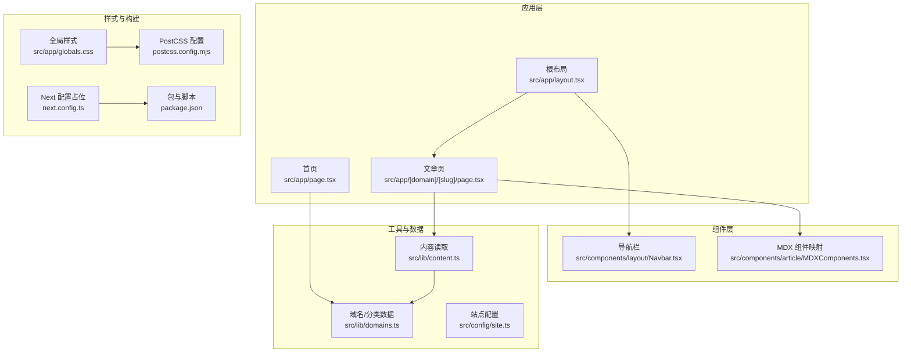
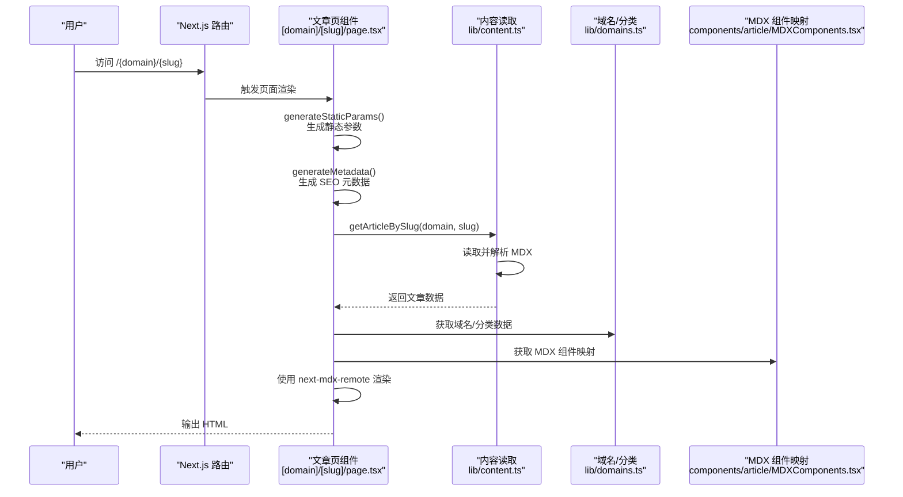
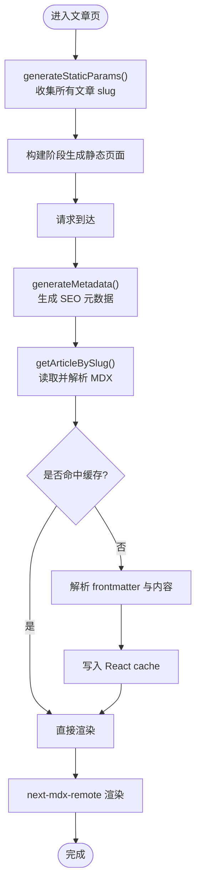
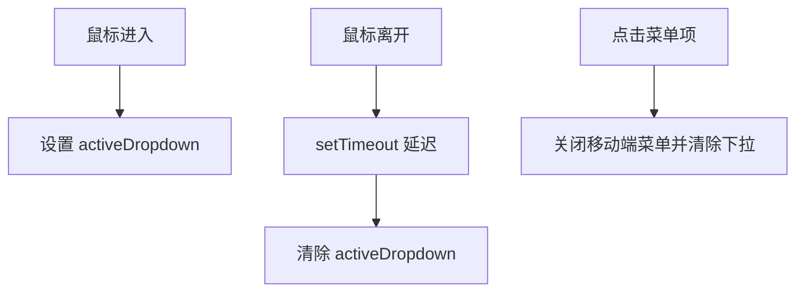
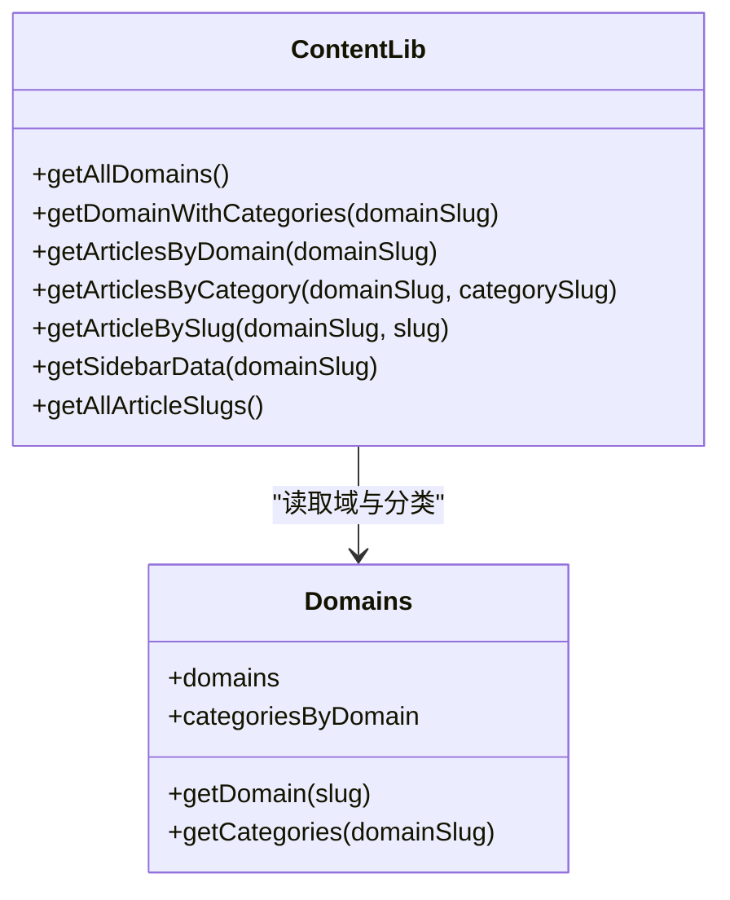
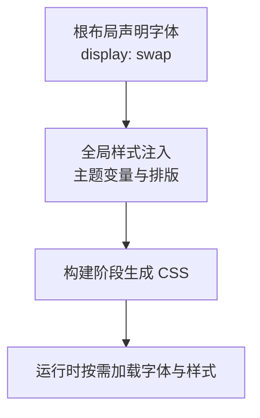
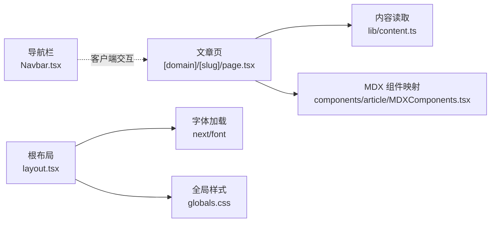

# 生产环境性能优化

<cite>
**本文引用的文件**
- [next.config.ts](file://next.config.ts)
- [package.json](file://package.json)
- [postcss.config.mjs](file://postcss.config.mjs)
- [src/app/layout.tsx](file://src/app/layout.tsx)
- [src/app/globals.css](file://src/app/globals.css)
- [src/app/page.tsx](file://src/app/page.tsx)
- [src/app/[domain]/[slug]/page.tsx](file://src/app/[domain]/[slug]/page.tsx)
- [src/components/article/MDXComponents.tsx](file://src/components/article/MDXComponents.tsx)
- [src/components/layout/Navbar.tsx](file://src/components/layout/Navbar.tsx)
- [src/lib/content.ts](file://src/lib/content.ts)
- [src/lib/domains.ts](file://src/lib/domains.ts)
- [src/config/site.ts](file://src/config/site.ts)
- [src/types/index.ts](file://src/types/index.ts)
</cite>

## 目录
1. [简介](#简介)
2. [项目结构](#项目结构)
3. [核心组件](#核心组件)
4. [架构总览](#架构总览)
5. [详细组件分析](#详细组件分析)
6. [依赖分析](#依赖分析)
7. [性能考量](#性能考量)
8. [故障排查指南](#故障排查指南)
9. [结论](#结论)
10. [附录](#附录)

## 简介
本指南面向 blog_new 项目在生产环境中的性能优化，围绕 Next.js 静态生成与增量静态再生（ISR）配置、缓存策略（浏览器、CDN、服务器端）、代码分割与懒加载、图片与字体优化、资源压缩、性能监控工具（Lighthouse、Web Vitals、Next.js 指标）以及基准测试方法展开，并结合当前仓库的实际实现进行落地建议与权衡说明。

## 项目结构
项目采用 Next.js App Router 结构，内容以本地 MDX 文件为主，通过服务端函数读取并渲染。关键目录与文件如下：
- 内容层：content 目录存放多域、多分类的 MDX 文章
- 应用层：src/app 下的路由页面与布局
- 组件层：src/components 下的可复用 UI 组件
- 工具层：src/lib 下的内容读取与域名/分类数据
- 样式层：src/app/globals.css 与 Tailwind 配置
- 构建配置：next.config.ts、postcss.config.mjs、package.json

图表来源
- [src/app/layout.tsx:1-61](file://src/app/layout.tsx#L1-L61)
- [src/app/page.tsx:1-92](file://src/app/page.tsx#L1-L92)
- [src/app/[domain]/[slug]/page.tsx](file://src/app/[domain]/[slug]/page.tsx#L1-L100)
- [src/components/layout/Navbar.tsx:1-141](file://src/components/layout/Navbar.tsx#L1-L141)
- [src/components/article/MDXComponents.tsx:1-70](file://src/components/article/MDXComponents.tsx#L1-L70)
- [src/lib/content.ts:1-158](file://src/lib/content.ts#L1-L158)
- [src/lib/domains.ts:1-136](file://src/lib/domains.ts#L1-L136)
- [src/app/globals.css:1-95](file://src/app/globals.css#L1-L95)
- [postcss.config.mjs:1-8](file://postcss.config.mjs#L1-L8)
- [next.config.ts:1-8](file://next.config.ts#L1-L8)
- [package.json:1-36](file://package.json#L1-L36)

章节来源
- [src/app/layout.tsx:1-61](file://src/app/layout.tsx#L1-L61)
- [src/app/page.tsx:1-92](file://src/app/page.tsx#L1-L92)
- [src/app/[domain]/[slug]/page.tsx](file://src/app/[domain]/[slug]/page.tsx#L1-L100)
- [src/lib/content.ts:1-158](file://src/lib/content.ts#L1-L158)
- [src/lib/domains.ts:1-136](file://src/lib/domains.ts#L1-L136)
- [src/app/globals.css:1-95](file://src/app/globals.css#L1-L95)
- [postcss.config.mjs:1-8](file://postcss.config.mjs#L1-L8)
- [next.config.ts:1-8](file://next.config.ts#L1-L8)
- [package.json:1-36](file://package.json#L1-L36)

## 核心组件
- 根布局与字体加载：根布局中使用 next/font 加载中英文字体，设置字体显示策略，减少阻塞渲染；同时在全局样式中定义主题变量与排版。
- 导航栏：客户端组件，支持桌面端下拉与移动端菜单，交互逻辑轻量，避免不必要的重渲染。
- 文章页：基于 App Router 的动态路由，使用 generateStaticParams 与 generateMetadata 实现静态预渲染与 SEO 元数据生成；MDX 内容通过 next-mdx-remote RSC 渲染。
- 内容读取：使用 React cache 包装的异步函数，缓存 IO 与解析结果，降低重复读取成本。
- 域与分类：集中定义领域与分类，供页面与侧边栏使用。

章节来源
- [src/app/layout.tsx:10-28](file://src/app/layout.tsx#L10-L28)
- [src/app/globals.css:12-45](file://src/app/globals.css#L12-L45)
- [src/components/layout/Navbar.tsx:13-141](file://src/components/layout/Navbar.tsx#L13-L141)
- [src/app/[domain]/[slug]/page.tsx](file://src/app/[domain]/[slug]/page.tsx#L10-L27)
- [src/lib/content.ts:45-158](file://src/lib/content.ts#L45-L158)
- [src/lib/domains.ts:3-32](file://src/lib/domains.ts#L3-L32)

## 架构总览
下图展示从请求到渲染的关键路径，包括静态参数生成、内容读取、MDX 渲染与样式注入。

图表来源
- [src/app/[domain]/[slug]/page.tsx](file://src/app/[domain]/[slug]/page.tsx#L10-L27)
- [src/lib/content.ts:102-131](file://src/lib/content.ts#L102-L131)
- [src/lib/domains.ts:129-136](file://src/lib/domains.ts#L129-L136)
- [src/components/article/MDXComponents.tsx:3-69](file://src/components/article/MDXComponents.tsx#L3-L69)

## 详细组件分析

### 文章页（静态生成与 ISR）
- 静态参数生成：通过 generateStaticParams 读取所有文章 slug 并在构建时生成静态页面，减少运行时 IO。
- 动态路由与元数据：generateMetadata 在构建时或按需生成 SEO 元数据，提升首屏可见性与搜索引擎收录质量。
- 内容读取：getArticleBySlug 使用 React cache 缓存解析结果，避免重复读取与解析。
- MDX 渲染：使用 next-mdx-remote RSC 渲染，支持语法高亮与链接等组件化处理。

图表来源
- [src/app/[domain]/[slug]/page.tsx](file://src/app/[domain]/[slug]/page.tsx#L10-L27)
- [src/lib/content.ts:102-131](file://src/lib/content.ts#L102-L131)

章节来源
- [src/app/[domain]/[slug]/page.tsx](file://src/app/[domain]/[slug]/page.tsx#L10-L27)
- [src/lib/content.ts:102-131](file://src/lib/content.ts#L102-L131)

### 导航栏（交互与性能）
- 客户端状态：使用 useState 与 useRef 控制移动端菜单与下拉，避免服务端渲染负担。
- 鼠标悬停控制：通过定时器延迟关闭下拉，改善交互体验。
- 轻量渲染：仅在需要时更新 DOM，减少不必要的重绘。

图表来源
- [src/components/layout/Navbar.tsx:19-33](file://src/components/layout/Navbar.tsx#L19-L33)

章节来源
- [src/components/layout/Navbar.tsx:13-141](file://src/components/layout/Navbar.tsx#L13-L141)

### 内容读取与缓存（IO 与解析）
- React cache：对 getArticleBySlug、getAllArticleSlugs 等函数包裹 cache，避免重复 IO 与解析。
- 并行加载：getSidebarData 中对多个分类并行获取文章列表，缩短等待时间。
- 文件系统访问：按域与分类拼接路径，定位 MDX 文件，读取后解析 frontmatter 与内容。

图表来源
- [src/lib/content.ts:45-158](file://src/lib/content.ts#L45-L158)
- [src/lib/domains.ts:3-136](file://src/lib/domains.ts#L3-L136)

章节来源
- [src/lib/content.ts:45-158](file://src/lib/content.ts#L45-L158)
- [src/lib/domains.ts:3-136](file://src/lib/domains.ts#L3-L136)

### 字体与样式（渲染与加载）
- next/font：在根布局中声明字体变量，设置 display: swap，避免 FOIT/FOUT，提升可读性与 CLS 表现。
- 全局样式：定义主题变量与 Tailwind 所需的字体族，确保排版一致性。
- PostCSS：集成 Tailwind 插件，保证样式按需生成与最小化输出。

图表来源
- [src/app/layout.tsx:10-28](file://src/app/layout.tsx#L10-L28)
- [src/app/globals.css:12-45](file://src/app/globals.css#L12-L45)
- [postcss.config.mjs:1-8](file://postcss.config.mjs#L1-L8)

章节来源
- [src/app/layout.tsx:10-28](file://src/app/layout.tsx#L10-L28)
- [src/app/globals.css:12-45](file://src/app/globals.css#L12-L45)
- [postcss.config.mjs:1-8](file://postcss.config.mjs#L1-L8)

## 依赖分析
- 依赖关系：文章页依赖内容读取模块与 MDX 组件映射；根布局依赖字体与全局样式；导航栏为客户端组件，不引入服务端 IO。
- 外部依赖：next、react、next-mdx-remote、shiki（用于代码高亮）、Tailwind 及其插件。

图表来源
- [src/app/[domain]/[slug]/page.tsx](file://src/app/[domain]/[slug]/page.tsx#L1-L100)
- [src/lib/content.ts:1-158](file://src/lib/content.ts#L1-L158)
- [src/components/article/MDXComponents.tsx:1-70](file://src/components/article/MDXComponents.tsx#L1-L70)
- [src/app/layout.tsx:1-61](file://src/app/layout.tsx#L1-L61)
- [src/app/globals.css:1-95](file://src/app/globals.css#L1-L95)
- [src/components/layout/Navbar.tsx:1-141](file://src/components/layout/Navbar.tsx#L1-L141)

章节来源
- [src/app/[domain]/[slug]/page.tsx](file://src/app/[domain]/[slug]/page.tsx#L1-L100)
- [src/lib/content.ts:1-158](file://src/lib/content.ts#L1-L158)
- [src/components/article/MDXComponents.tsx:1-70](file://src/components/article/MDXComponents.tsx#L1-L70)
- [src/app/layout.tsx:1-61](file://src/app/layout.tsx#L1-L61)
- [src/app/globals.css:1-95](file://src/app/globals.css#L1-L95)
- [src/components/layout/Navbar.tsx:1-141](file://src/components/layout/Navbar.tsx#L1-L141)

## 性能考量

### 静态生成与 ISR（增量静态再生）
- 当前实现：文章页已使用 generateStaticParams 与 generateMetadata，构建时生成静态页面，有利于首屏性能与 SEO。
- 建议增强：
  - 为文章页启用 ISR：在页面导出对象中添加 revalidate 配置，使热点文章在后台刷新，保持新鲜度与性能平衡。
  - 对首页与分类页：若内容变化频繁，可考虑按需 revalidate 或使用动态生成，避免全量重建。
  - 缓存失效策略：结合 CDN 与边缘缓存，合理设置 TTL 与缓存标签，确保 ISR 刷新与缓存命中率的平衡。

章节来源
- [src/app/[domain]/[slug]/page.tsx](file://src/app/[domain]/[slug]/page.tsx#L10-L27)
- [src/lib/content.ts:148-158](file://src/lib/content.ts#L148-L158)

### 缓存策略
- 浏览器缓存：静态资源（CSS/JS）通过 Next.js 构建产物与哈希命名实现强缓存；字体与图片建议单独配置长缓存策略。
- CDN 缓存：在部署层配置 CDN，针对不同资源类型设置缓存头与压缩；对动态内容设置短 TTL 或缓存标签。
- 服务器端缓存：利用 React cache 缓存 IO 与解析结果；对数据库或外部 API 可增加内存缓存层（如 Redis）以降低延迟。

章节来源
- [src/lib/content.ts:45-158](file://src/lib/content.ts#L45-L158)

### 代码分割与懒加载
- 路由级分割：App Router 默认按路由拆分包，文章页与首页分别打包，减少初始包体积。
- 组件懒加载：导航栏为客户端组件，可在需要时再加载；MDX 组件映射按需渲染。
- 图片懒加载：使用 next/image（如引入）自动实现懒加载与格式优化；当前项目未引入图片组件，建议在新增图片时统一采用该方案。

章节来源
- [src/components/layout/Navbar.tsx:1-141](file://src/components/layout/Navbar.tsx#L1-L141)
- [src/components/article/MDXComponents.tsx:1-70](file://src/components/article/MDXComponents.tsx#L1-L70)

### 图片优化、字体优化与资源压缩
- 字体优化：next/font 已在根布局中使用，设置 display: swap；建议在生产环境固定字体子集与字重，减少字体包大小。
- 图片优化：建议引入 next/image 并使用现代格式（WebP/AVIF），配合尺寸裁剪与懒加载。
- 资源压缩：构建阶段由 Next.js 与 PostCSS/Tailwind 生成压缩后的 CSS；建议开启 gzip/br 压缩与 HTTP/2 多路复用。

章节来源
- [src/app/layout.tsx:10-28](file://src/app/layout.tsx#L10-L28)
- [src/app/globals.css:1-95](file://src/app/globals.css#L1-L95)
- [postcss.config.mjs:1-8](file://postcss.config.mjs#L1-L8)

### 性能监控与指标
- Lighthouse：在 CI 中集成 Lighthouse 任务，定期扫描关键指标（CLS、LCP、INP、TTI）。
- Web Vitals：在生产环境集成 Web Vitals 上报，关注真实用户性能表现。
- Next.js 指标：利用 Next.js Profiler 与构建报告，识别慢查询与大包；结合 React DevTools Profiler 分析组件渲染开销。

章节来源
- [package.json:5-10](file://package.json#L5-L10)

### 基准测试方法
- 基准场景：模拟真实用户访问路径（首页 → 域页 → 文章页），测量 TTFB、LCP、CLS、INP。
- 工具链：使用 Lighthouse CLI、WebPageTest、Browser Timing API、Next.js Profiler。
- 回归基线：建立每日/每周性能基线，发现回归及时告警。

章节来源
- [package.json:5-10](file://package.json#L5-L10)

### 用户体验影响与权衡
- 静态优先 vs 新鲜度：静态生成带来更快的首屏，但内容更新有延迟；ISR 提升新鲜度但增加边缘刷新成本。
- 字体加载：display: swap 改善感知性能，但可能产生轻微跳变；可通过字体子集与预加载缓解。
- 缓存策略：长缓存提升命中率，但可能返回过期内容；短缓存提升新鲜度但增加带宽与延迟。

章节来源
- [src/app/layout.tsx:10-28](file://src/app/layout.tsx#L10-L28)
- [src/lib/content.ts:45-158](file://src/lib/content.ts#L45-L158)

## 故障排查指南
- 首屏缓慢：检查 generateStaticParams 是否覆盖全部文章；确认 ISR 配置与 CDN TTL；验证字体与 CSS 加载。
- 内容未更新：确认 revalidate 设置与缓存标签；检查 ISR 刷新队列与边缘缓存状态。
- 交互卡顿：检查导航栏与下拉的事件绑定与定时器清理；避免在服务端执行过多计算。
- 构建失败或体积异常：审查 PostCSS 插件与 Tailwind 配置；确认无未使用的样式类。

章节来源
- [src/app/[domain]/[slug]/page.tsx](file://src/app/[domain]/[slug]/page.tsx#L10-L27)
- [src/components/layout/Navbar.tsx:19-33](file://src/components/layout/Navbar.tsx#L19-L33)
- [postcss.config.mjs:1-8](file://postcss.config.mjs#L1-L8)

## 结论
通过静态生成与 ISR 的组合、合理的缓存策略、字体与资源优化、以及完善的性能监控体系，blog_new 可在保证内容新鲜度的同时显著提升首屏性能与用户体验。建议在现有基础上逐步引入 ISR、图片优化与 Web Vitals 上报，并建立持续的性能基线与回归测试流程。

## 附录
- 配置参考位置（不展示具体代码内容）：
  - Next.js 配置占位：[next.config.ts:1-8](file://next.config.ts#L1-L8)
  - 构建与脚本：[package.json:5-10](file://package.json#L5-L10)
  - PostCSS 配置：[postcss.config.mjs:1-8](file://postcss.config.mjs#L1-L8)
  - 全局样式与主题变量：[src/app/globals.css:12-45](file://src/app/globals.css#L12-L45)
  - 字体加载与布局：[src/app/layout.tsx:10-28](file://src/app/layout.tsx#L10-L28)
  - 文章页静态参数与元数据：[src/app/[domain]/[slug]/page.tsx](file://src/app/[domain]/[slug]/page.tsx#L10-L27)
  - 内容读取与缓存：[src/lib/content.ts:45-158](file://src/lib/content.ts#L45-L158)
  - 域与分类数据：[src/lib/domains.ts:3-136](file://src/lib/domains.ts#L3-L136)
  - 站点配置：[src/config/site.ts:1-20](file://src/config/site.ts#L1-L20)
  - 类型定义：[src/types/index.ts:1-45](file://src/types/index.ts#L1-L45)