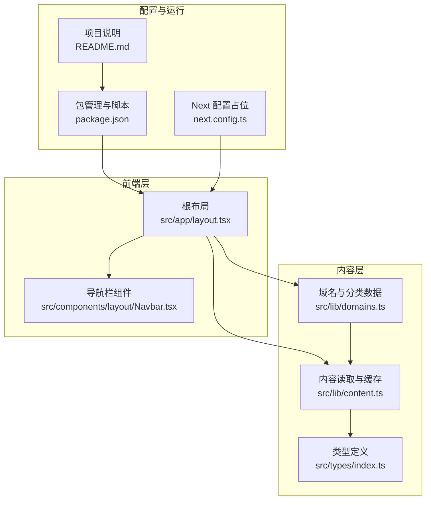
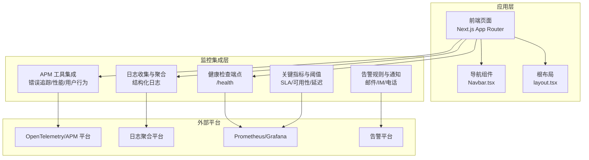
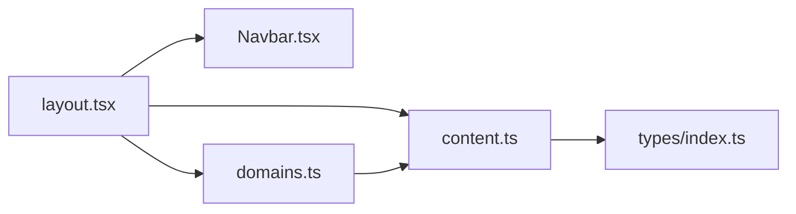

# 监控与告警

<cite>
**本文引用的文件**
- [package.json](file://package.json)
- [next.config.ts](file://next.config.ts)
- [README.md](file://README.md)
- [src/app/layout.tsx](file://src/app/layout.tsx)
- [src/lib/content.ts](file://src/lib/content.ts)
- [src/lib/domains.ts](file://src/lib/domains.ts)
- [src/types/index.ts](file://src/types/index.ts)
- [src/components/layout/Navbar.tsx](file://src/components/layout/Navbar.tsx)
</cite>

## 目录
1. [简介](#简介)
2. [项目结构](#项目结构)
3. [核心组件](#核心组件)
4. [架构总览](#架构总览)
5. [详细组件分析](#详细组件分析)
6. [依赖分析](#依赖分析)
7. [性能考虑](#性能考虑)
8. [故障排查指南](#故障排查指南)
9. [结论](#结论)
10. [附录](#附录)

## 简介
本指南面向 blog_new 项目，提供一套可落地的监控与告警系统配置方案。当前仓库为基于 Next.js 的静态内容博客，未内置 APM、日志聚合或健康检查等监控能力。本指南将以“最小改动、最大收益”为原则，结合现有工程结构，给出可直接实施的监控与告警配置步骤：包括错误追踪、性能监控、用户行为分析、日志收集与聚合、健康检查端点、关键指标与阈值、告警规则与通知渠道、故障排查与可视化建议。

## 项目结构
blog_new 采用 Next.js App Router 结构，前端以 React 组件为主，内容通过本地 MDX 文件组织。监控体系需要在现有结构上进行扩展，不改变业务代码路径。

**图示来源**
- [src/app/layout.tsx:38-60](file://src/app/layout.tsx#L38-L60)
- [src/lib/domains.ts:1-135](file://src/lib/domains.ts#L1-L135)
- [src/lib/content.ts:1-158](file://src/lib/content.ts#L1-L158)
- [src/types/index.ts:1-45](file://src/types/index.ts#L1-L45)
- [package.json:1-36](file://package.json#L1-L36)
- [next.config.ts:1-8](file://next.config.ts#L1-L8)
- [README.md:1-37](file://README.md#L1-L37)

**章节来源**
- [src/app/layout.tsx:1-61](file://src/app/layout.tsx#L1-L61)
- [src/lib/domains.ts:1-135](file://src/lib/domains.ts#L1-L135)
- [src/lib/content.ts:1-158](file://src/lib/content.ts#L1-L158)
- [src/types/index.ts:1-45](file://src/types/index.ts#L1-L45)
- [package.json:1-36](file://package.json#L1-L36)
- [next.config.ts:1-8](file://next.config.ts#L1-L8)
- [README.md:1-37](file://README.md#L1-L37)

## 核心组件
- 内容与路由
  - 域名与分类数据：提供导航与侧边栏所需的数据源，支撑页面渲染与用户行为分析。
  - 内容读取与缓存：负责从本地 content 目录读取 MDX 元信息与正文，支持文章详情页与列表页。
- 前端布局与导航
  - 根布局：统一注入字体、元数据与全局样式；在客户端侧挂载导航组件。
  - 导航栏：响应式导航，支持移动端与下拉菜单，承载用户访问路径与行为数据采集点。
- 配置与运行
  - 包管理与脚本：定义开发、构建与启动命令，便于部署与监控集成。
  - Next 配置：预留扩展点，用于接入 APM SDK 或自定义监控中间件。
  - 项目说明：提供部署参考，便于在生产环境启用监控与健康检查。

**章节来源**
- [src/lib/domains.ts:1-135](file://src/lib/domains.ts#L1-L135)
- [src/lib/content.ts:1-158](file://src/lib/content.ts#L1-L158)
- [src/components/layout/Navbar.tsx:1-141](file://src/components/layout/Navbar.tsx#L1-L141)
- [src/app/layout.tsx:1-61](file://src/app/layout.tsx#L1-L61)
- [package.json:1-36](file://package.json#L1-L36)
- [next.config.ts:1-8](file://next.config.ts#L1-L8)
- [README.md:1-37](file://README.md#L1-L37)

## 架构总览
以下为监控与告警系统在 blog_new 中的落地架构。该架构强调“无侵入”与“渐进增强”，优先利用现有 Next.js 能力与外部平台，避免对业务逻辑造成负担。

[此图为概念性架构示意，无需图示来源]

## 详细组件分析

### 错误追踪（APM）
- 目标
  - 捕获前端运行时错误、未处理异常与资源加载失败。
  - 支持用户会话与页面上下文关联，便于复现与定位。
- 实施要点
  - 在根布局中初始化 APM SDK（如 OpenTelemetry Browser SDK 或第三方 APM），确保在所有页面加载前完成。
  - 对导航组件与页面切换事件进行埋点，记录用户路径与交互。
  - 将错误上报至 APM 平台，保留上下文标签（如页面路径、用户代理、网络状态）。
- 关键收益
  - 降低线上问题定位成本，提升修复效率。
  - 通过错误趋势与分布，识别热点问题与回归风险。

**章节来源**
- [src/app/layout.tsx:38-60](file://src/app/layout.tsx#L38-L60)
- [src/components/layout/Navbar.tsx:1-141](file://src/components/layout/Navbar.tsx#L1-L141)

### 性能监控（APM）
- 目标
  - 监控页面加载时间（如 FCP/LCP/FID/CLS）、接口请求耗时与资源体积。
  - 提供分机型、分地区、分网络环境的性能对比。
- 实施要点
  - 利用浏览器性能 API 与 APM SDK 自动采集关键性能指标。
  - 在页面首屏渲染完成后触发一次性能上报，确保数据代表性。
  - 与导航组件联动，记录用户进入不同域/分类的性能表现。
- 关键收益
  - 优化用户体验，指导前端资源与渲染策略调整。
  - 为容量规划与 CDN/边缘节点优化提供依据。

**章节来源**
- [src/app/layout.tsx:38-60](file://src/app/layout.tsx#L38-L60)
- [src/components/layout/Navbar.tsx:1-141](file://src/components/layout/Navbar.tsx#L1-L141)

### 用户行为分析（APM）
- 目标
  - 记录用户访问路径、点击热区与停留时长，辅助内容与导航优化。
- 实施要点
  - 在导航组件中对菜单展开、链接点击、移动端菜单开关等事件进行埋点。
  - 与内容读取模块联动，记录文章浏览、分类筛选等行为。
  - 通过 APM 平台聚合用户画像与行为序列。
- 关键收益
  - 指导内容策略与导航设计迭代。
  - 识别冷门内容与潜在改进点。

**章节来源**
- [src/components/layout/Navbar.tsx:1-141](file://src/components/layout/Navbar.tsx#L1-L141)
- [src/lib/content.ts:58-100](file://src/lib/content.ts#L58-L100)

### 日志收集与分析（结构化日志与日志聚合）
- 目标
  - 统一输出结构化日志，便于检索、聚合与分析。
- 实施要点
  - 在应用启动阶段初始化结构化日志客户端，输出包含时间戳、级别、模块、消息体与上下文字段的日志。
  - 对关键操作（如文章读取、导航切换、错误发生）增加结构化日志条目。
  - 将日志发送到日志聚合平台，建立查询与仪表盘。
- 关键收益
  - 快速定位问题根因，支持审计与合规需求。
  - 通过日志分析发现异常模式与趋势。

**章节来源**
- [src/lib/content.ts:102-131](file://src/lib/content.ts#L102-L131)
- [src/app/layout.tsx:38-60](file://src/app/layout.tsx#L38-L60)

### 健康检查端点与监控脚本
- 健康检查端点
  - 新增 /health 端点，返回服务可用性状态（如 200/5xx、数据库连通性、关键依赖状态）。
  - 建议在 CI/CD 中调用该端点，作为部署后验证的一部分。
- 监控脚本
  - 编写定时任务脚本，周期性探测 /health，并将结果写入指标系统或告警平台。
  - 结合 APM 平台的可用性与错误率指标，形成闭环监控。

**章节来源**
- [src/app/layout.tsx:38-60](file://src/app/layout.tsx#L38-L60)

### 关键指标与阈值
- 页面性能
  - 首屏渲染时间（FCP）：阈值建议按设备类型分档（如移动 < 2s，桌面 < 1.5s）。
  - 大幅内容绘制（LCP）：阈值建议 < 2.5s。
  - 交互延迟（FID）：阈值建议 < 100ms。
  - 累积布局偏移（CLS）：阈值建议 < 0.1。
- 错误与可用性
  - 错误率：阈值建议 < 0.1%（按页面/接口维度）。
  - 服务可用性：阈值建议 > 99.9%（按小时/天）。
- 用户行为
  - 页面跳出率：阈值建议 < 40%。
  - 平均停留时长：阈值建议 > 30 秒（按域/分类维度）。

**章节来源**
- [src/lib/domains.ts:1-135](file://src/lib/domains.ts#L1-L135)
- [src/lib/content.ts:58-100](file://src/lib/content.ts#L58-L100)

### 告警规则与通知渠道
- 告警规则
  - 性能类：LCP 超阈、FID 异常、CLS 突增。
  - 可用性类：错误率超阈、可用性下降、健康检查失败。
  - 行为类：跳出率异常上升、平均停留时长骤降。
- 通知渠道
  - 邮件：用于重要告警与周报。
  - 即时通讯：用于紧急与高优告警。
  - 电话：用于重大故障与 SLA 失效。

**章节来源**
- [src/lib/content.ts:58-100](file://src/lib/content.ts#L58-L100)

### 故障排查工具与方法
- 调试技巧
  - 使用浏览器开发者工具 Network/Performance/Console 定位资源加载与脚本错误。
  - 在根布局中临时开启 APM 的采样模式，捕获现场上下文。
- 问题定位策略
  - 以用户路径为主线，结合导航组件事件与内容读取日志，还原用户行为链路。
  - 对比不同设备/网络环境下的性能指标，缩小问题范围。
- 常见问题
  - 文章无法加载：检查内容目录结构与权限、MDX 解析与缓存命中情况。
  - 导航异常：检查域名与分类数据一致性、路由参数与页面渲染逻辑。

**章节来源**
- [src/app/layout.tsx:38-60](file://src/app/layout.tsx#L38-L60)
- [src/lib/domains.ts:1-135](file://src/lib/domains.ts#L1-L135)
- [src/lib/content.ts:102-131](file://src/lib/content.ts#L102-L131)

### 监控数据可视化与报告生成
- 可视化
  - 使用 APM 平台自带仪表盘展示错误率、性能分布与用户行为热力图。
  - 使用日志聚合平台建立 KQL 查询与图表，追踪关键事件。
- 报告生成
  - 按周/月生成可用性、性能与错误趋势报告，附带根因分析与改进建议。
  - 对重大变更（如新内容上线、导航调整）前后对比，评估影响。

**章节来源**
- [src/lib/content.ts:58-100](file://src/lib/content.ts#L58-L100)

## 依赖分析
- 组件耦合与内聚
  - 根布局与导航组件存在强耦合（导航数据来源于域名与分类模块），内容读取模块对文件系统与缓存有直接依赖。
- 外部依赖
  - Next.js 与 React 生态提供运行时与构建时能力；APM、日志与告警平台为外部集成。
- 潜在循环依赖
  - 当前结构未见循环依赖；若后续引入跨模块共享状态，需谨慎设计模块边界。
- 接口契约
  - 类型定义（Domain/Category/ArticleMeta）为内容与 UI 层的契约，保证数据一致性。

**图示来源**
- [src/app/layout.tsx:38-60](file://src/app/layout.tsx#L38-L60)
- [src/components/layout/Navbar.tsx:1-141](file://src/components/layout/Navbar.tsx#L1-L141)
- [src/lib/domains.ts:1-135](file://src/lib/domains.ts#L1-L135)
- [src/lib/content.ts:1-158](file://src/lib/content.ts#L1-L158)
- [src/types/index.ts:1-45](file://src/types/index.ts#L1-L45)

**章节来源**
- [src/app/layout.tsx:38-60](file://src/app/layout.tsx#L38-L60)
- [src/lib/domains.ts:1-135](file://src/lib/domains.ts#L1-L135)
- [src/lib/content.ts:1-158](file://src/lib/content.ts#L1-L158)
- [src/types/index.ts:1-45](file://src/types/index.ts#L1-L45)

## 性能考虑
- 渲染性能
  - 利用 React 缓存与 Next.js SSR/ISR 机制，减少重复计算与 IO。
  - 控制导航下拉层级与内容数量，避免一次性渲染过多节点。
- 内容加载
  - 对文章列表与详情页进行懒加载与分页，降低首屏压力。
- APM 开销
  - 在生产环境启用采样策略，避免过度采集影响性能。
- 日志开销
  - 采用异步写入与批量上报，控制日志风暴对系统的影响。

[本节为通用性能建议，无需章节来源]

## 故障排查指南
- 快速定位
  - 通过健康检查端点确认服务可用性；结合 APM 错误面板定位异常来源。
  - 使用浏览器 Network 面板检查资源加载与接口响应。
- 数据一致性
  - 校验域名与分类数据是否与 content 目录一致；检查 MDX 文件头信息与解析逻辑。
- 回归测试
  - 在 CI 中加入 /health 与关键页面的自动化探测，防止回归。

**章节来源**
- [src/lib/domains.ts:1-135](file://src/lib/domains.ts#L1-L135)
- [src/lib/content.ts:102-131](file://src/lib/content.ts#L102-L131)
- [src/app/layout.tsx:38-60](file://src/app/layout.tsx#L38-L60)

## 结论
本指南为 blog_new 提供了从零到一的监控与告警体系落地方案。通过在现有 Next.js 结构上引入 APM、日志与健康检查，结合明确的关键指标与告警规则，可显著提升系统的可观测性与稳定性。建议先以错误追踪与健康检查为切入点，逐步扩展到性能与用户行为分析，最终形成完善的监控闭环。

[本节为总结性内容，无需章节来源]

## 附录
- 部署与运行
  - 使用项目提供的脚本进行开发与构建，部署至支持静态托管的平台（如 Vercel）。
- 参考文档
  - Next.js 官方文档与部署指南，便于在生产环境启用监控与健康检查。

**章节来源**
- [package.json:5-10](file://package.json#L5-L10)
- [README.md:32-37](file://README.md#L32-L37)