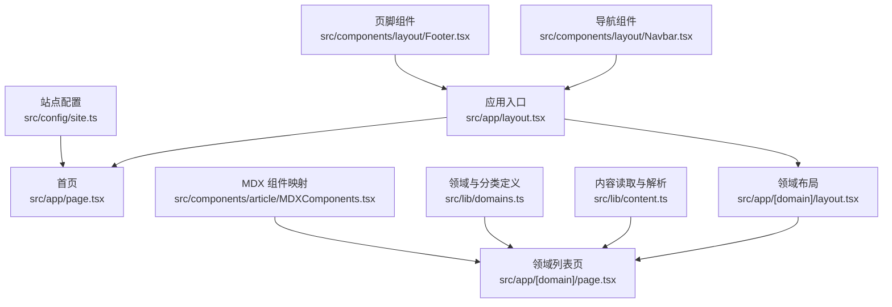
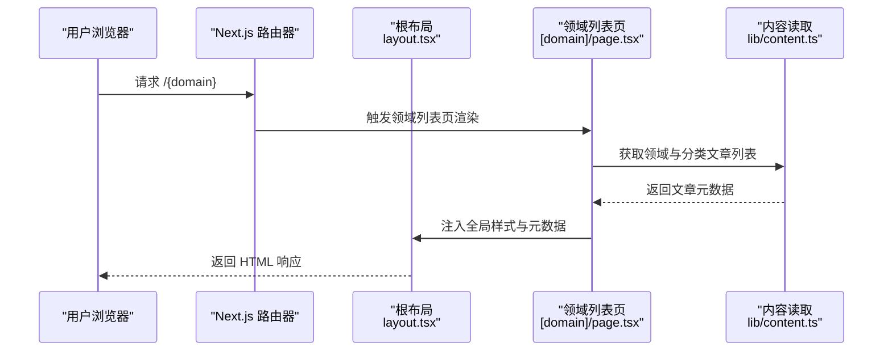
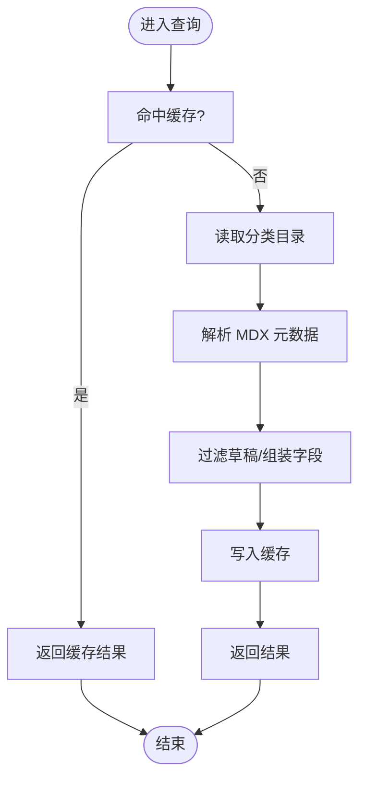
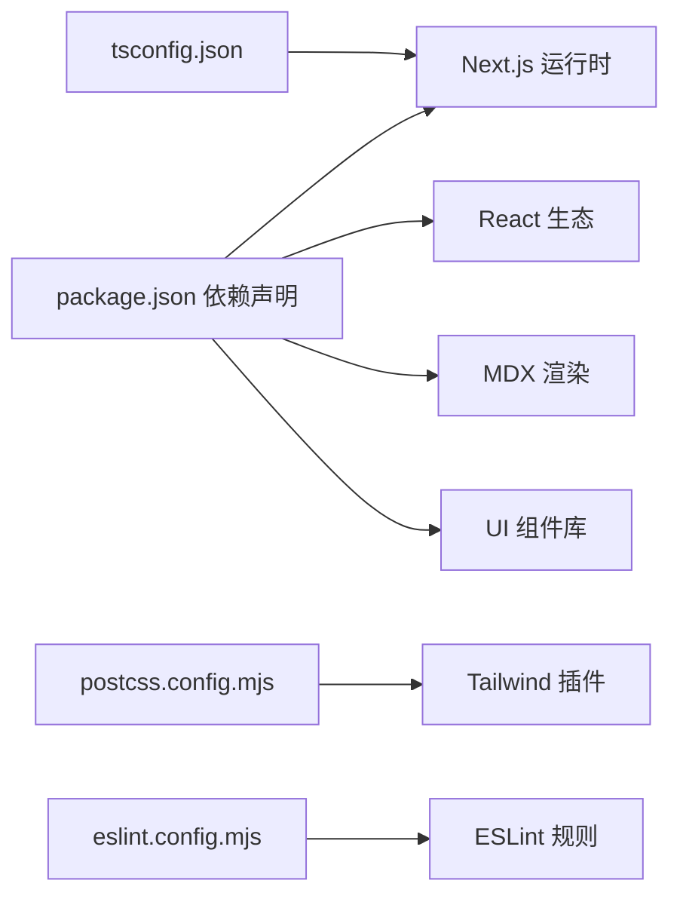

# 部署与运维

<cite>
**本文引用的文件**
- [package.json](file://package.json)
- [next.config.ts](file://next.config.ts)
- [README.md](file://README.md)
- [tsconfig.json](file://tsconfig.json)
- [postcss.config.mjs](file://postcss.config.mjs)
- [eslint.config.mjs](file://eslint.config.mjs)
- [src/config/site.ts](file://src/config/site.ts)
- [src/lib/content.ts](file://src/lib/content.ts)
- [src/lib/domains.ts](file://src/lib/domains.ts)
- [src/types/index.ts](file://src/types/index.ts)
- [src/app/layout.tsx](file://src/app/layout.tsx)
- [src/app/page.tsx](file://src/app/page.tsx)
- [src/app/[domain]/layout.tsx](file://src/app/[domain]/layout.tsx)
- [src/app/[domain]/page.tsx](file://src/app/[domain]/page.tsx)
- [src/components/layout/Navbar.tsx](file://src/components/layout/Navbar.tsx)
- [src/components/layout/Footer.tsx](file://src/components/layout/Footer.tsx)
- [src/components/article/MDXComponents.tsx](file://src/components/article/MDXComponents.tsx)
</cite>

## 目录
1. [简介](#简介)
2. [项目结构](#项目结构)
3. [核心组件](#核心组件)
4. [架构总览](#架构总览)
5. [详细组件分析](#详细组件分析)
6. [依赖分析](#依赖分析)
7. [性能考虑](#性能考虑)
8. [CI/CD 流程](#cicd-流程)
9. [故障排除指南](#故障排除指南)
10. [结论](#结论)
11. [附录：部署环境配置参考](#附录部署环境配置参考)

## 简介
本项目是一个基于 Next.js App Router 的静态内容博客，采用 Markdown（MDX）作为文章内容源，通过动态路由与静态生成相结合的方式组织多领域、多分类的文章内容。项目已具备在 Vercel 平台一键部署的基础能力，并可扩展至自托管或云平台部署。

## 项目结构
- 应用入口与布局：根布局负责注入站点元数据与全局样式，首页展示领域卡片导航。
- 动态路由与内容加载：按领域分组的动态路由，结合内容读取与解析逻辑，生成静态参数与页面内容。
- 组件层：导航栏、侧边栏、页脚等 UI 组件；MDX 渲染组件用于文章内容展示。
- 配置层：Next.js、TypeScript、PostCSS、ESLint 等工具链配置。

图表来源
- [src/app/layout.tsx:38-60](file://src/app/layout.tsx#L38-L60)
- [src/app/page.tsx:20-91](file://src/app/page.tsx#L20-L91)
- [src/app/[domain]/layout.tsx](file://src/app/[domain]/layout.tsx#L10-L29)
- [src/app/[domain]/page.tsx](file://src/app/[domain]/page.tsx#L25-L88)
- [src/lib/content.ts:45-158](file://src/lib/content.ts#L45-L158)
- [src/lib/domains.ts:3-136](file://src/lib/domains.ts#L3-L136)
- [src/config/site.ts:1-20](file://src/config/site.ts#L1-L20)
- [src/components/layout/Navbar.tsx:13-141](file://src/components/layout/Navbar.tsx#L13-L141)
- [src/components/layout/Footer.tsx:3-21](file://src/components/layout/Footer.tsx#L3-L21)
- [src/components/article/MDXComponents.tsx:3-70](file://src/components/article/MDXComponents.tsx#L3-L70)

章节来源
- [package.json:1-36](file://package.json#L1-L36)
- [next.config.ts:1-8](file://next.config.ts#L1-L8)
- [tsconfig.json:1-35](file://tsconfig.json#L1-L35)
- [postcss.config.mjs:1-8](file://postcss.config.mjs#L1-L8)
- [eslint.config.mjs:1-19](file://eslint.config.mjs#L1-L19)

## 核心组件
- 内容读取与缓存：通过 React 缓存与文件系统读取，解析 gray-matter 提取的元信息，支持按领域、分类、文章 slug 查询。
- 领域与分类：集中定义领域与分类结构，供页面与导航使用。
- 页面与布局：根布局注入字体与元数据；领域布局负责侧边栏与子路由内容；首页聚合领域卡片。
- MDX 渲染：提供标题、链接、块引用、代码块、表格等组件映射，保证文章渲染一致性。

章节来源
- [src/lib/content.ts:45-158](file://src/lib/content.ts#L45-L158)
- [src/lib/domains.ts:3-136](file://src/lib/domains.ts#L3-L136)
- [src/app/layout.tsx:30-60](file://src/app/layout.tsx#L30-L60)
- [src/app/[domain]/layout.tsx](file://src/app/[domain]/layout.tsx#L10-L29)
- [src/app/[domain]/page.tsx](file://src/app/[domain]/page.tsx#L25-L88)
- [src/components/article/MDXComponents.tsx:3-70](file://src/components/article/MDXComponents.tsx#L3-L70)

## 架构总览
应用采用 Next.js App Router 的服务端渲染与静态生成混合模式：
- 首页与领域列表页在构建时生成静态参数与页面内容，提升首屏性能与 SEO。
- 文章详情页通过动态路由按需渲染，结合内容缓存减少重复 IO。
- 全局布局与导航在服务端完成，确保首屏稳定与一致。

图表来源
- [src/app/[domain]/page.tsx](file://src/app/[domain]/page.tsx#L25-L88)
- [src/lib/content.ts:58-100](file://src/lib/content.ts#L58-L100)
- [src/app/layout.tsx:38-60](file://src/app/layout.tsx#L38-L60)

## 详细组件分析

### 内容读取与缓存（content.ts）
- 数据来源：本地 content 目录下的 MDX 文件，使用 gray-matter 解析元数据。
- 缓存策略：对常用查询使用 React 缓存，降低重复读取与解析成本。
- 查询接口：
  - 获取所有领域与分类
  - 按领域获取文章列表
  - 按领域+分类获取文章列表
  - 按领域+slug 获取单篇文章
  - 获取侧边栏数据（领域+分类+文章）

图表来源
- [src/lib/content.ts:15-27](file://src/lib/content.ts#L15-L27)
- [src/lib/content.ts:29-43](file://src/lib/content.ts#L29-L43)
- [src/lib/content.ts:58-100](file://src/lib/content.ts#L58-L100)

章节来源
- [src/lib/content.ts:1-158](file://src/lib/content.ts#L1-L158)

### 领域与分类（domains.ts）
- 定义领域与分类的结构、顺序与描述。
- 提供查询函数以供页面与导航使用。

章节来源
- [src/lib/domains.ts:3-136](file://src/lib/domains.ts#L3-L136)

### 页面与布局（layout.tsx、page.tsx）
- 根布局负责注入字体变量、元数据与全局样式，渲染导航与页脚。
- 首页聚合领域卡片，点击跳转到对应领域路由。
- 领域列表页根据领域与分类动态生成文章列表，支持 SEO 元数据生成。

章节来源
- [src/app/layout.tsx:30-60](file://src/app/layout.tsx#L30-L60)
- [src/app/page.tsx:20-91](file://src/app/page.tsx#L20-L91)
- [src/app/[domain]/layout.tsx](file://src/app/[domain]/layout.tsx#L10-L29)
- [src/app/[domain]/page.tsx](file://src/app/[domain]/page.tsx#L25-L88)

### 导航与页脚（Navbar.tsx、Footer.tsx）
- 导航组件支持桌面端下拉与移动端菜单，路径变化时高亮当前领域。
- 页脚展示站点标语与版权信息。

章节来源
- [src/components/layout/Navbar.tsx:13-141](file://src/components/layout/Navbar.tsx#L13-L141)
- [src/components/layout/Footer.tsx:3-21](file://src/components/layout/Footer.tsx#L3-L21)

### MDX 渲染组件（MDXComponents.tsx）
- 提供标题、链接、块引用、代码块、列表、表格等组件映射，统一文章渲染风格。

章节来源
- [src/components/article/MDXComponents.tsx:3-70](file://src/components/article/MDXComponents.tsx#L3-L70)

## 依赖分析
- 运行时依赖：Next.js、React、MDX 渲染相关库、UI 图标库等。
- 开发依赖：TypeScript、Tailwind PostCSS 插件、ESLint Next 配置等。
- 工具链：Next.js 配置、TypeScript 路径别名、PostCSS 插件、ESLint 规则。

图表来源
- [package.json:11-34](file://package.json#L11-L34)
- [tsconfig.json:21-23](file://tsconfig.json#L21-L23)
- [postcss.config.mjs:1-8](file://postcss.config.mjs#L1-L8)
- [eslint.config.mjs:1-19](file://eslint.config.mjs#L1-L19)

章节来源
- [package.json:1-36](file://package.json#L1-L36)
- [tsconfig.json:1-35](file://tsconfig.json#L1-L35)
- [postcss.config.mjs:1-8](file://postcss.config.mjs#L1-L8)
- [eslint.config.mjs:1-19](file://eslint.config.mjs#L1-L19)

## 性能考虑
- 静态生成与缓存
  - 首页与领域列表页在构建期生成，减少运行时计算。
  - 使用 React 缓存避免重复读取与解析内容文件。
- 资源优化
  - 使用 Next.js 自动字体优化与延迟加载。
  - Tailwind CSS 按需生成样式，减少体积。
- 构建与类型检查
  - TypeScript 严格模式与增量编译提升开发体验。
  - ESLint 集成 Next.js 最佳实践，保障代码质量。

章节来源
- [src/app/[domain]/layout.tsx](file://src/app/[domain]/layout.tsx#L6-L8)
- [src/app/[domain]/page.tsx](file://src/app/[domain]/page.tsx#L11-L23)
- [src/lib/content.ts:45-158](file://src/lib/content.ts#L45-L158)
- [tsconfig.json:2-23](file://tsconfig.json#L2-L23)
- [postcss.config.mjs:1-8](file://postcss.config.mjs#L1-L8)
- [eslint.config.mjs:1-19](file://eslint.config.mjs#L1-L19)

## CI/CD 流程
- 代码检查与测试
  - 使用 ESLint Next 配置进行静态检查，建议在 CI 中执行并报告违规。
  - 可选添加单元/集成测试任务，确保关键逻辑（内容读取、分类查询）稳定。
- 构建与部署
  - 在 Vercel 上直接连接 Git 仓库，平台自动识别 Next.js 并执行构建与部署。
  - 若使用自托管或云平台，可将构建产物部署至静态服务器或容器化运行。
- 发布策略
  - 建议采用分支保护与 PR 审查，主分支合并后触发部署。
  - 对于重大变更，可启用预览部署与回滚策略。

章节来源
- [eslint.config.mjs:1-19](file://eslint.config.mjs#L1-L19)
- [README.md:32-37](file://README.md#L32-L37)

## 故障排除指南
- 构建失败（依赖缺失或版本不兼容）
  - 检查 package.json 依赖与 Next.js 版本是否匹配。
  - 清理 node_modules 与缓存后重试安装。
- 内容未显示或 404
  - 确认 content 目录结构与文件命名符合预期，MDX 文件包含有效元数据。
  - 检查动态路由参数与生成静态参数的逻辑是否覆盖所有领域。
- 字体或样式异常
  - 确认 Next.js 字体配置与全局样式加载顺序正确。
  - 检查 Tailwind 插件与 PostCSS 配置是否生效。
- 部署到 Vercel 后访问异常
  - 确认构建命令与输出目录符合 Next.js 默认设置。
  - 检查环境变量与域名绑定是否正确配置。

章节来源
- [package.json:11-34](file://package.json#L11-L34)
- [src/lib/content.ts:13-27](file://src/lib/content.ts#L13-L27)
- [src/app/[domain]/layout.tsx](file://src/app/[domain]/layout.tsx#L6-L8)
- [src/app/[domain]/page.tsx](file://src/app/[domain]/page.tsx#L11-L23)
- [postcss.config.mjs:1-8](file://postcss.config.mjs#L1-L8)
- [README.md:32-37](file://README.md#L32-L37)

## 结论
本项目基于 Next.js App Router 实现了清晰的静态生成与服务端渲染组合，配合内容缓存与工具链配置，具备良好的性能与可维护性。在 Vercel 上可实现零配置部署，同时保留扩展到自托管或云平台的能力。建议在 CI/CD 中加入代码检查与测试，持续优化构建与缓存策略，以提升发布效率与用户体验。

## 附录：部署环境配置参考

### Vercel 平台部署
- 连接仓库并启用自动部署
- 构建与输出
  - 构建命令：使用默认 Next.js 构建脚本
  - 输出目录：默认 out
- 环境变量
  - 无需敏感变量时可留空；若涉及第三方集成，可在平台控制台配置
- 域名绑定
  - 在平台绑定自定义域名并配置 DNS 记录
- 备注
  - 项目已内置 Next.js 配置与构建脚本，适合平台一键部署

章节来源
- [README.md:32-37](file://README.md#L32-L37)
- [package.json:5-10](file://package.json#L5-L10)

### 自托管服务器（Nginx + PM2）
- 构建与静态化
  - 在本地或 CI 生成静态构建产物
  - 将构建产物部署至 Web 服务器根目录
- 反向代理与缓存
  - Nginx 提供静态资源服务与缓存头设置
  - 可配置 gzip/br 压缩与 HTTPS
- 进程管理
  - 使用 PM2 管理 Node.js 进程（如需 SSR 场景）
- 注意事项
  - 确保静态资源路径与构建配置一致
  - 配置健康检查与日志轮转

### 云平台（Docker + Kubernetes）
- 容器化
  - 使用多阶段构建产出最小镜像
  - 将静态构建产物放入只读镜像层
- 编排与伸缩
  - Kubernetes 部署无状态副本，暴露 Ingress
  - 配置 HPA 根据 CPU/内存或 QPS 自动扩缩
- CDN 与边缘缓存
  - 使用平台 CDN 或反向代理缓存静态资源
  - 设置合理的缓存头与压缩策略
- 监控与日志
  - 收集容器标准输出与错误日志
  - 集成指标采集与告警