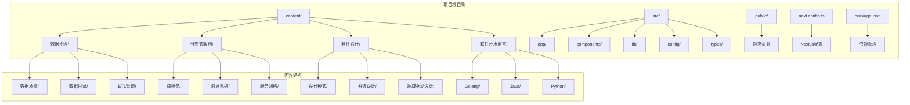
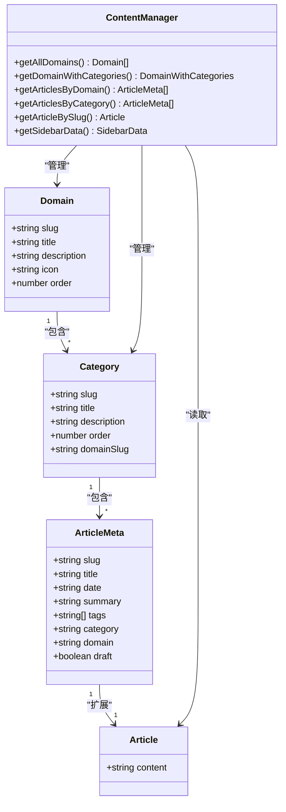
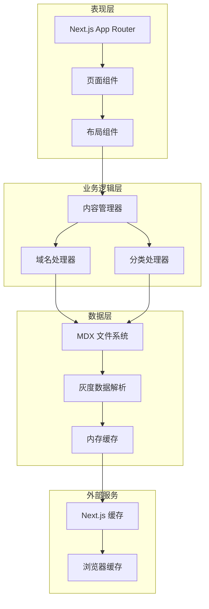
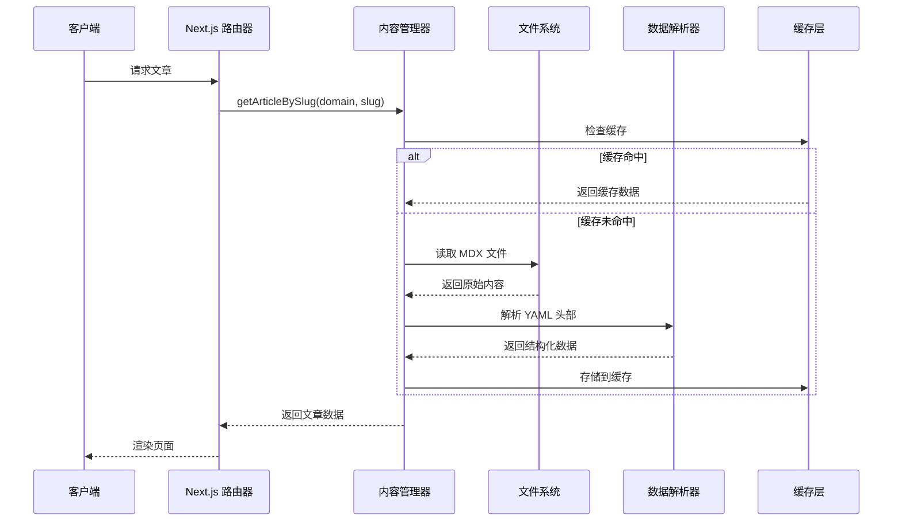
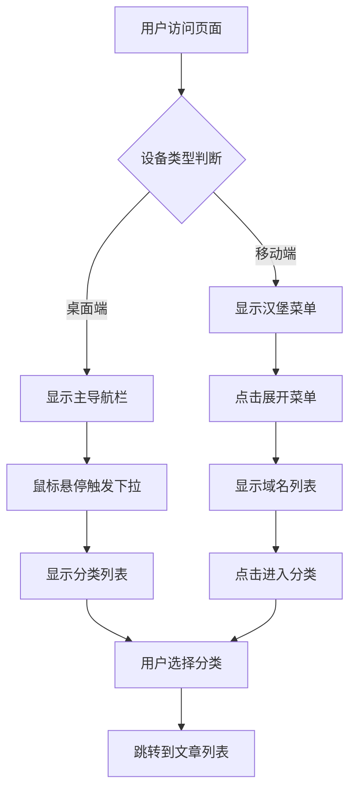
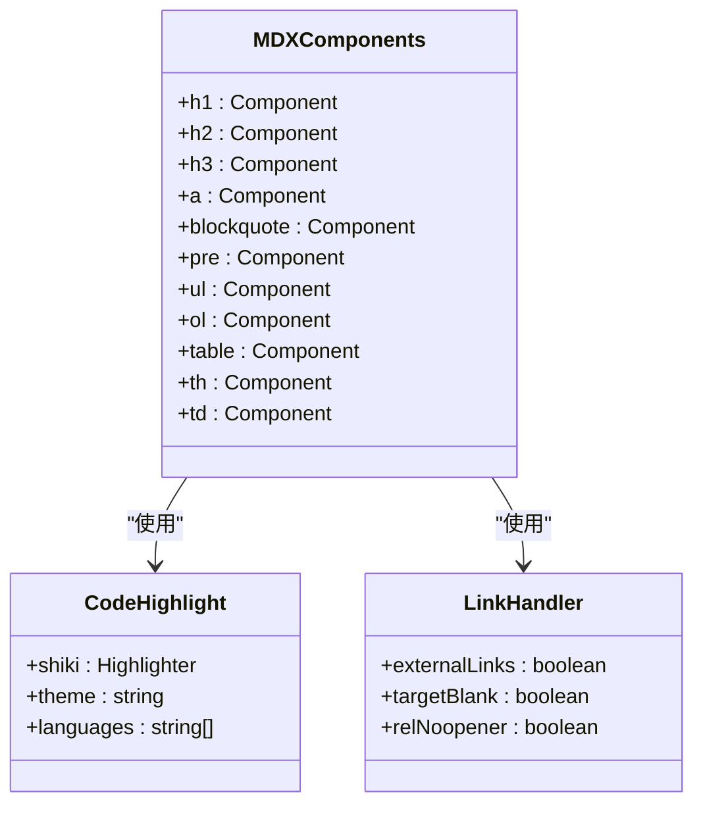

# 项目概述

<cite>
**本文档引用的文件**
- [README.md](file://README.md)
- [package.json](file://package.json)
- [next.config.ts](file://next.config.ts)
- [src/config/site.ts](file://src/config/site.ts)
- [src/lib/domains.ts](file://src/lib/domains.ts)
- [src/lib/content.ts](file://src/lib/content.ts)
- [src/types/index.ts](file://src/types/index.ts)
- [src/components/layout/Navbar.tsx](file://src/components/layout/Navbar.tsx)
- [src/components/layout/Footer.tsx](file://src/components/layout/Footer.tsx)
- [src/components/article/MDXComponents.tsx](file://src/components/article/MDXComponents.tsx)
- [content/distributed-architecture/message-queue/kafka-core-concepts.mdx](file://content/distributed-architecture/message-queue/kafka-core-concepts.mdx)
- [content/software-design/ddd/ddd-bounded-context.mdx](file://content/software-design/ddd/ddd-bounded-context.mdx)
- [content/software-dev-languages/java/spring-boot-intro.mdx](file://content/software-dev-languages/java/spring-boot-intro.mdx)
</cite>

## 目录
1. [引言](#引言)
2. [项目结构](#项目结构)
3. [核心组件](#核心组件)
4. [架构总览](#架构总览)
5. [详细组件分析](#详细组件分析)
6. [依赖分析](#依赖分析)
7. [性能考虑](#性能考虑)
8. [故障排除指南](#故障排除指南)
9. [结论](#结论)

## 引言

blog_new 是一个基于 Next.js 16 的现代化技术博客应用，专注于展示后端开发、分布式系统、数据治理和软件架构等技术领域的知识。该项目的核心使命是为开发者提供一个高质量的技术内容分享平台，通过精心组织的技术文章和清晰的分类体系，帮助不同层次的开发者提升技术能力。

### 项目特色

- **技术深度与广度并重**：涵盖从编程语言到系统架构的完整技术栈
- **内容组织严谨**：采用领域-分类-文章的三层结构化内容管理
- **现代化技术栈**：基于 React 19、TypeScript、Tailwind CSS 和 MDX 生态系统
- **响应式设计**：支持桌面和移动端的无缝浏览体验
- **高性能渲染**：利用 Next.js 的静态生成和缓存机制

### 目标受众

- **初学者**：提供循序渐进的技术学习路径
- **中级开发者**：深入理解系统设计和架构原理
- **高级工程师**：掌握分布式系统和数据治理的最佳实践
- **技术管理者**：了解前沿技术趋势和实施策略

### 核心价值主张

- **知识体系化**：将零散的技术知识点整合成完整的知识体系
- **实践导向**：结合真实案例和代码示例，注重实用性
- **持续更新**：紧跟技术发展趋势，保持内容的时效性
- **社区驱动**：鼓励开发者参与讨论和贡献

## 项目结构

项目采用基于功能域的组织方式，将不同类型的技术内容按照逻辑领域进行分类管理：



**图表来源**
- [src/lib/domains.ts:1-136](file://src/lib/domains.ts#L1-L136)
- [content/distributed-architecture/message-queue/kafka-core-concepts.mdx:1-62](file://content/distributed-architecture/message-queue/kafka-core-concepts.mdx#L1-L62)

**章节来源**
- [src/lib/domains.ts:1-136](file://src/lib/domains.ts#L1-L136)
- [src/types/index.ts:1-45](file://src/types/index.ts#L1-L45)

## 核心组件

### 技术栈概览

项目采用现代化的全栈技术栈，确保开发效率和运行性能：

- **前端框架**：Next.js 16（App Router + Server Components）
- **UI 框架**：React 19 + Tailwind CSS 4
- **类型系统**：TypeScript 5
- **内容管理**：MDX 生态系统（next-mdx-remote + rehype/retext 插件）
- **样式系统**：Tailwind CSS + 自定义主题变量
- **构建工具**：Next.js 内置构建系统

### 核心架构组件



**图表来源**
- [src/types/index.ts:1-45](file://src/types/index.ts#L1-L45)
- [src/lib/content.ts:1-158](file://src/lib/content.ts#L1-L158)

**章节来源**
- [package.json:11-34](file://package.json#L11-L34)
- [src/config/site.ts:1-20](file://src/config/site.ts#L1-L20)

## 架构总览

项目采用分层架构设计，将内容管理、数据处理和界面展示分离，确保系统的可维护性和扩展性：



**图表来源**
- [src/lib/content.ts:45-158](file://src/lib/content.ts#L45-L158)
- [src/lib/domains.ts:129-136](file://src/lib/domains.ts#L129-L136)

### 数据流处理

系统的数据流遵循以下模式：

1. **请求接收**：Next.js App Router 接收用户请求
2. **路由解析**：根据 URL 解析域名和分类信息
3. **内容检索**：通过内容管理器从 MDX 文件系统读取数据
4. **数据处理**：使用 gray-matter 解析 YAML 头部信息
5. **缓存存储**：利用 React cache 和 Next.js 缓存机制
6. **渲染输出**：生成 HTML 并返回给客户端

**章节来源**
- [src/lib/content.ts:15-158](file://src/lib/content.ts#L15-L158)

## 详细组件分析

### 内容管理系统

内容管理系统是整个博客的核心，负责管理所有技术文章的内容结构和数据流：



**图表来源**
- [src/lib/content.ts:102-131](file://src/lib/content.ts#L102-L131)
- [src/lib/content.ts:29-43](file://src/lib/content.ts#L29-L43)

#### 域名和分类结构

项目采用四层内容结构：域名 → 分类 → 文章，这种设计提供了清晰的知识组织方式：

- **域名级别**：软件开发语言、分布式架构、数据治理、软件设计
- **分类级别**：每个域名下的具体技术领域
- **文章级别**：具体的实现细节和技术要点

**章节来源**
- [src/lib/domains.ts:3-32](file://src/lib/domains.ts#L3-L32)
- [src/lib/domains.ts:34-127](file://src/lib/domains.ts#L34-L127)

### 导航系统

导航系统采用响应式设计，支持桌面端的下拉菜单和移动端的手风琴式菜单：



**图表来源**
- [src/components/layout/Navbar.tsx:13-141](file://src/components/layout/Navbar.tsx#L13-L141)

**章节来源**
- [src/components/layout/Navbar.tsx:13-141](file://src/components/layout/Navbar.tsx#L13-L141)

### MDX 内容渲染

MDX 组件系统提供了丰富的文档渲染能力，支持代码高亮、表格、链接等常见元素：



**图表来源**
- [src/components/article/MDXComponents.tsx:1-70](file://src/components/article/MDXComponents.tsx#L1-L70)

**章节来源**
- [src/components/article/MDXComponents.tsx:1-70](file://src/components/article/MDXComponents.tsx#L1-L70)

### 主题和样式系统

项目采用 Tailwind CSS 4 的原子化样式设计，配合自定义主题变量实现一致的视觉体验：

- **颜色系统**：基于 CSS 变量的主题色板
- **字体系统**：Serif 字体用于标题，Sans-serif 用于正文
- **间距系统**：统一的间距规范确保视觉一致性
- **响应式设计**：移动优先的断点设计

**章节来源**
- [src/components/layout/Navbar.tsx:36-139](file://src/components/layout/Navbar.tsx#L36-L139)

## 依赖分析

### 核心依赖关系

```mermaid
graph TB
subgraph "运行时依赖"
A[next] --> A1[Next.js 16.1.6]
B[react] --> B1[React 19.2.3]
C[react-dom] --> C1[React DOM 19.2.3]
D[next-mdx-remote] --> D1[MDX 渲染]
E[gray-matter] --> E1[YAML 解析]
F[lucide-react] --> F1[图标库]
end
subgraph "开发依赖"
G[typescript] --> G1[TypeScript 5]
H[tailwindcss] --> H1[Tailwind CSS 4]
I[eslint] --> I1[ESLint 9]
J[@types/react] --> J1[React 类型]
end
subgraph "MDX 生态"
K[rehype-*] --> K1[HTML 处理]
L[remark-gfm] --> L1[GFM 支持]
M[shiki] --> M1[语法高亮]
end
A --> D
D --> K
D --> L
D --> M
B --> J
C --> J
H --> G
```

**图表来源**
- [package.json:11-34](file://package.json#L11-L34)

### 性能优化策略

项目采用了多层次的性能优化策略：

- **静态生成**：利用 Next.js 的静态生成能力
- **缓存机制**：React cache + Next.js 缓存
- **代码分割**：按需加载组件和页面
- **资源优化**：图片懒加载和字体优化
- **CDN 加速**：利用 Vercel 的全球 CDN

**章节来源**
- [package.json:11-34](file://package.json#L11-L34)

## 性能考虑

### 内容加载性能

系统通过以下机制优化内容加载性能：

- **文件系统缓存**：避免重复的文件系统访问
- **内存缓存**：使用 React cache 缓存解析后的数据
- **并行处理**：异步加载多个分类的文章数据
- **增量预渲染**：按需生成静态页面

### 渲染性能

- **组件复用**：高度复用的组件设计减少渲染开销
- **虚拟滚动**：长列表的虚拟化处理
- **懒加载**：非关键资源的延迟加载
- **服务端渲染**：首屏内容的服务端渲染

## 故障排除指南

### 常见问题诊断

1. **文章无法显示**
   - 检查 MDX 文件的 YAML 头部格式
   - 确认文件路径与域名/分类结构匹配
   - 验证 draft 标志设置

2. **导航异常**
   - 检查域名配置是否正确
   - 确认分类 slug 的唯一性
   - 验证路由参数传递

3. **样式问题**
   - 检查 Tailwind CSS 配置
   - 确认 CSS 变量定义
   - 验证响应式断点设置

### 开发环境调试

- 使用 Next.js 的开发服务器进行实时调试
- 利用浏览器开发者工具检查网络请求
- 通过控制台日志跟踪数据流
- 使用 React DevTools 分析组件性能

**章节来源**
- [src/lib/content.ts:29-43](file://src/lib/content.ts#L29-L43)
- [src/lib/domains.ts:129-136](file://src/lib/domains.ts#L129-L136)

## 结论

blog_new 博客项目成功地将现代 Web 技术与高质量技术内容相结合，为开发者提供了一个结构清晰、易于使用的知识分享平台。项目的核心优势在于：

- **技术深度**：覆盖从基础到高级的完整技术栈
- **架构清晰**：合理的分层设计便于维护和扩展
- **用户体验**：现代化的界面设计和良好的交互体验
- **性能优异**：充分利用 Next.js 的性能优化特性

未来的发展方向包括增强搜索功能、添加评论系统、支持多语言内容以及集成更多的技术主题。这个项目为技术博客的开发提供了优秀的参考模板，展示了如何将技术热情转化为有价值的产品。