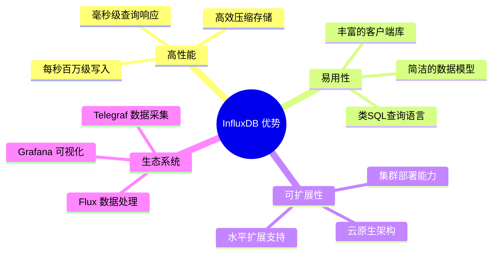
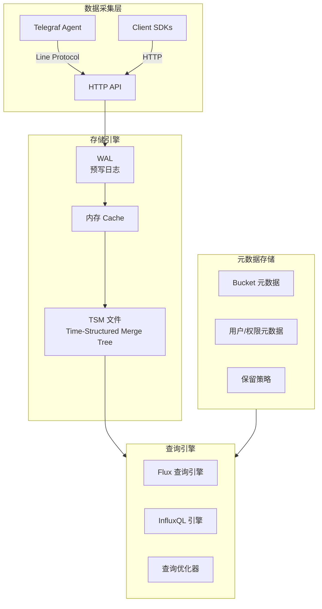
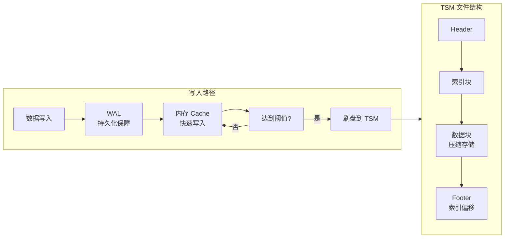
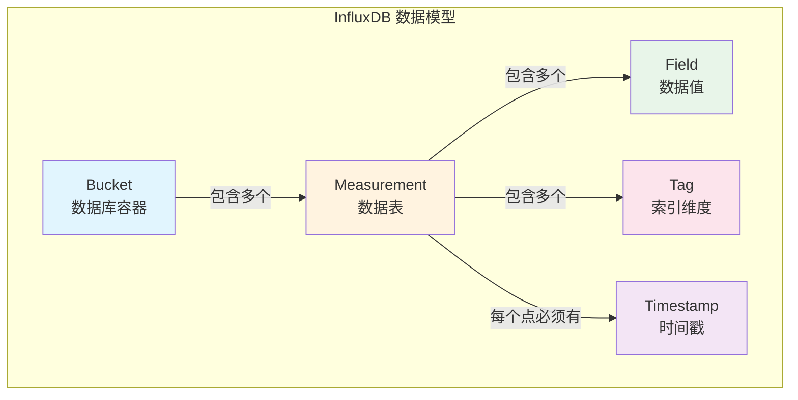
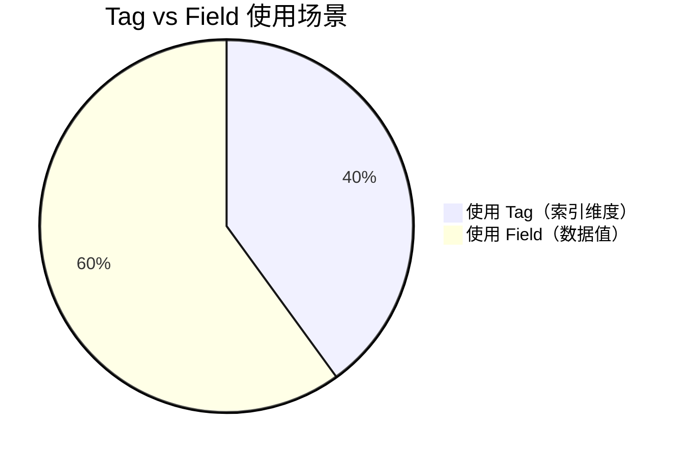
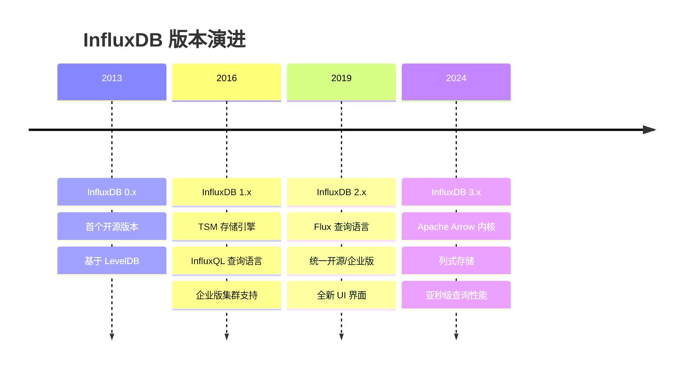
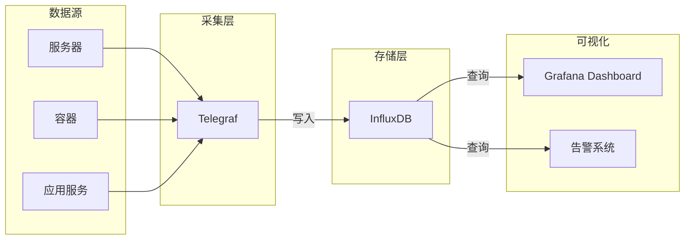
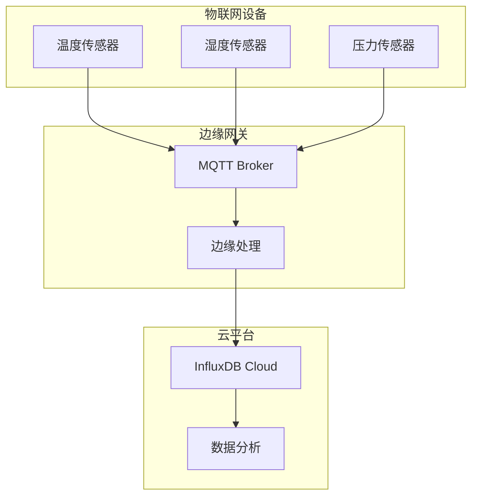

# InfluxDB 入门介绍

## 什么是 InfluxDB

**InfluxDB** 是一个由 InfluxData 开发的开源**时序数据库（Time Series Database, TSDB）**，专门设计用于处理高写入和查询负载的时间序列数据。

### 时序数据的特点

时序数据是指按时间顺序索引的数据点序列，具有以下特点：

| 特性 | 说明 |
|------|------|
| **时间戳为核心** | 每个数据点都与一个时间戳关联 |
| **高写入频率** | 通常每秒写入数千至数百万个数据点 |
| **极少更新** | 数据一旦写入，很少修改或删除 |
| **时间范围查询** | 查询通常基于时间范围（最近1小时、1天等） |
| **数据价值递减** | 越新的数据价值越高，旧数据常需聚合降采样 |

### InfluxDB 核心优势



## InfluxDB 架构概览

### 系统架构图



### 存储引擎详解

InfluxDB 使用自定义的 **TSM（Time-Structured Merge Tree）** 存储引擎：



## 核心概念

### 数据模型

InfluxDB 的数据模型由四个核心概念组成：



#### 1. Bucket（存储桶）

Bucket 是数据的逻辑容器，相当于传统数据库中的 database：

```
┌─────────────────────────────────────────┐
│              Bucket: "monitoring"       │
│  ┌─────────────┐  ┌─────────────┐      │
│  │ Measurement │  │ Measurement │      │
│  │   "cpu"     │  │  "memory"   │      │
│  └─────────────┘  └─────────────┘      │
│  ┌─────────────┐  ┌─────────────┐      │
│  │ Measurement │  │ Measurement │      │
│  │   "disk"    │  │  "network"  │      │
│  └─────────────┘  └─────────────┘      │
└─────────────────────────────────────────┘
```

#### 2. Measurement（测量值）

Measurement 是对相关数据的逻辑分组，相当于表：

```sql
-- 创建 measurement 的示例
-- 不需要显式创建，写入数据时自动创建

-- cpu measurement 示例数据
name: cpu
time                host        region  usage_user  usage_system
----                ----        ------  ----------  ------------
1705315200000000000 server01    us-west  65.2        12.3
1705315260000000000 server01    us-west  68.1        11.8
1705315320000000000 server02    eu-east  42.5        15.6
```

#### 3. Field（字段）

Field 是实际的数据值，**不会被索引**：

| 属性 | 说明 |
|------|------|
| 数据类型 | Float、Integer、String、Boolean |
| 索引 | ❌ 无索引 |
| 必需 | ✅ 每个点至少一个 field |
| 数量 | 一个点可以有多个 fields |

#### 4. Tag（标签）

Tag 是元数据维度，**会被索引**，用于快速过滤和分组：

| 属性 | 说明 |
|------|------|
| 数据类型 | String（只能是字符串） |
| 索引 | ✅ 有索引 |
| 必需 | ❌ 可选 |
| 最佳实践 | 控制基数（cardinality） |



### 数据点（Point）结构

一个完整的数据点示例：

```
┌─────────────────────────────────────────────────────────────────┐
│                         Data Point                              │
├─────────────────────────────────────────────────────────────────┤
│  Measurement: cpu                                               │
├──────────┬──────────┬─────────────┬──────────────┬──────────────┤
│   Time   │   Host   │   Region    │  usage_user  │ usage_system │
├──────────┼──────────┼─────────────┼──────────────┼──────────────┤
│  Tag     │   Tag    │    Tag      │    Field     │    Field     │
│          │          │             │    65.2      │    12.3      │
├──────────┴──────────┴─────────────┴──────────────┴──────────────┤
│  Timestamp: 1705315200000000000 (Unix nanoseconds)              │
└─────────────────────────────────────────────────────────────────┘
```

## InfluxDB 版本对比



### 版本选择建议

| 场景 | 推荐版本 | 理由 |
|------|----------|------|
| 新项目开发 | 2.x | 功能完善，生态成熟 |
| 大规模生产 | 2.x 企业版 / 3.x | 集群支持，更高性能 |
| 现有 1.x 维护 | 1.x | 平滑升级路径 |
| 边缘计算 | 2.x OSS | 轻量，易部署 |

## 典型应用场景

### 场景 1：DevOps 监控



**监控指标示例：**
- CPU 使用率、内存占用
- 磁盘 I/O、网络流量
- 应用响应时间、错误率

### 场景 2：IoT 传感器数据



**IoT 数据特点：**
- 高频率采集（每秒/每分钟）
- 海量设备接入
- 地理位置分布
- 边缘预处理需求

### 场景 3：金融实时分析

| 应用 | 数据类型 | 延迟要求 |
|------|----------|----------|
| 股票行情 | 价格、成交量 | < 100ms |
| 风控监测 | 交易异常检测 | < 1s |
| 量化策略 | 历史回测 | 批量查询 |

## 快速体验

### 使用 Docker 启动

```bash
# 拉取并运行 InfluxDB 2.x
docker run -d \
  --name influxdb \
  -p 8086:8086 \
  -v influxdb-data:/var/lib/influxdb2 \
  influxdb:2.7

# 查看容器状态
docker ps

# 获取初始 Token
docker exec influxdb influx auth list
```

### 第一条数据写入

```bash
# 使用 influx CLI 写入测试数据
influx write \
  --bucket my-bucket \
  --precision s \
  'temperature,location=room1,device=sensor01 value=23.5'

# 查询数据
influx query '
from(bucket: "my-bucket")
  |> range(start: -1h)
  |> filter(fn: (r) => r._measurement == "temperature")
'
```

## 总结

InfluxDB 作为专业的时序数据库，通过以下特性解决时序数据挑战：

1. **高效存储** - TSM 引擎实现高压缩比和快速写入
2. **灵活查询** - 支持 InfluxQL 和 Flux 两种查询语言
3. **丰富生态** - 与 Telegraf、Grafana 无缝集成
4. **水平扩展** - 支持分布式部署应对海量数据

在下一篇文章中，我们将详细介绍 InfluxDB 的安装和部署方法。

---

## 参考资源

- [InfluxDB 官方文档](https://docs.influxdata.com/)
- [InfluxDB GitHub](https://github.com/influxdata/influxdb)
- [Time Series Database 选型指南](https://www.influxdata.com/time-series-database/)
