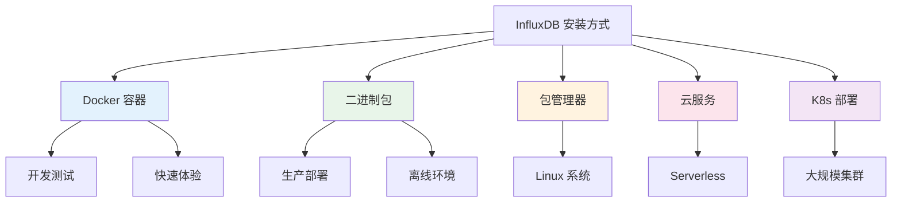
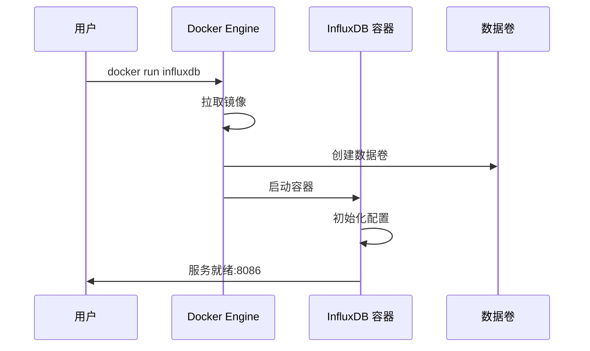
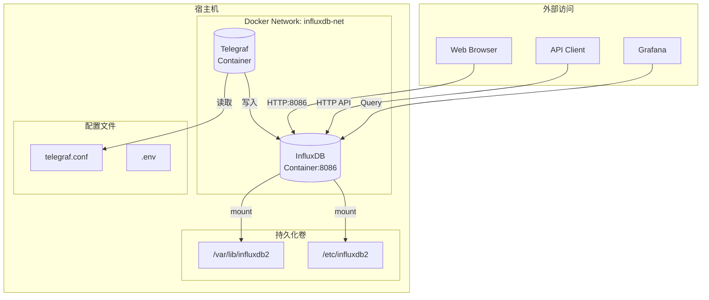
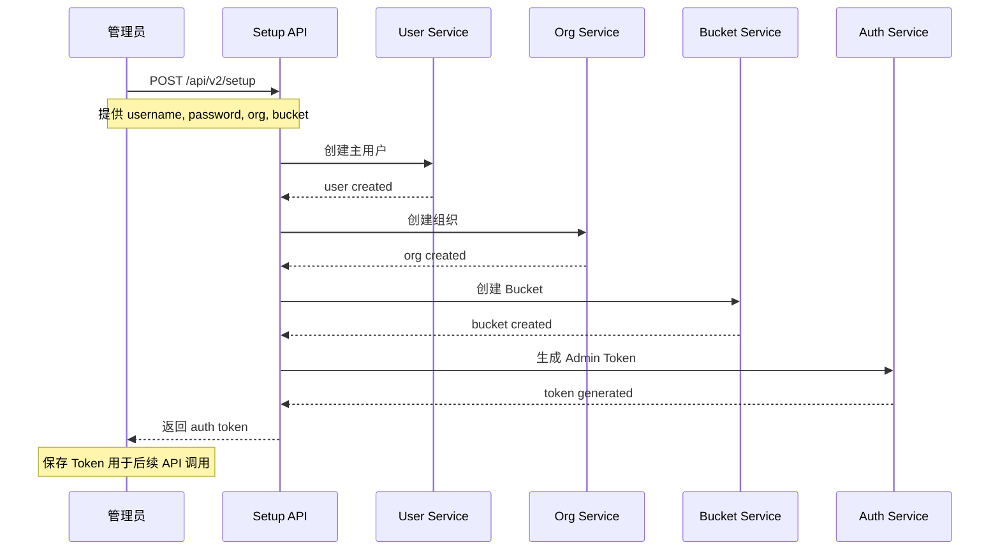
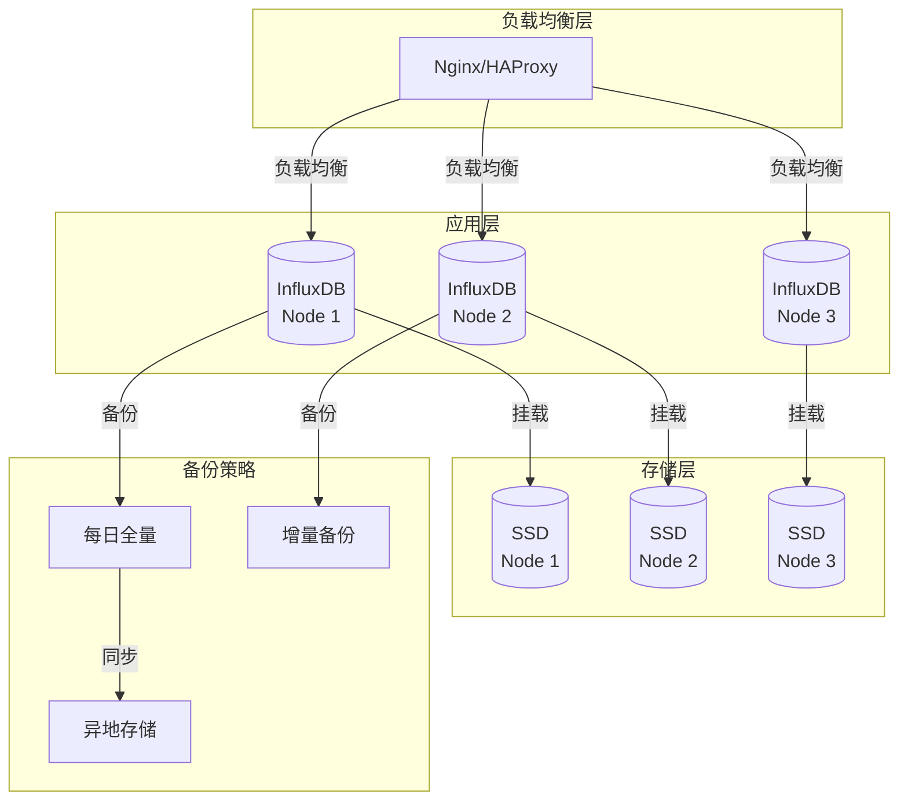

# InfluxDB 安装与部署指南

## 安装方式概览



## 方式一：Docker 安装（推荐）

Docker 是最快捷的部署方式，适合开发和测试环境。

### 基础部署



```bash
# 1. 创建持久化数据卷
docker volume create influxdb-data

# 2. 运行 InfluxDB 容器
docker run -d \
  --name influxdb \
  --restart unless-stopped \
  -p 8086:8086 \
  -v influxdb-data:/var/lib/influxdb2 \
  -e DOCKER_INFLUXDB_INIT_MODE=setup \
  -e DOCKER_INFLUXDB_INIT_USERNAME=admin \
  -e DOCKER_INFLUXDB_INIT_PASSWORD=YourStrongPassword \
  -e DOCKER_INFLUXDB_INIT_ORG=my-org \
  -e DOCKER_INFLUXDB_INIT_BUCKET=my-bucket \
  influxdb:2.7

# 3. 查看容器状态
docker ps -a | grep influxdb

# 4. 查看日志
docker logs -f influxdb
```

### 使用 Docker Compose（推荐）

创建 `docker-compose.yml`：

```yaml
version: '3.8'

services:
  influxdb:
    image: influxdb:2.7
    container_name: influxdb
    restart: unless-stopped
    ports:
      - "8086:8086"
    environment:
      - DOCKER_INFLUXDB_INIT_MODE=setup
      - DOCKER_INFLUXDB_INIT_USERNAME=${INFLUXDB_USERNAME:-admin}
      - DOCKER_INFLUXDB_INIT_PASSWORD=${INFLUXDB_PASSWORD:-changeme}
      - DOCKER_INFLUXDB_INIT_ORG=${INFLUXDB_ORG:-my-org}
      - DOCKER_INFLUXDB_INIT_BUCKET=${INFLUXDB_BUCKET:-my-bucket}
      - DOCKER_INFLUXDB_INIT_RETENTION=${INFLUXDB_RETENTION:-7d}
      - DOCKER_INFLUXDB_INIT_ADMIN_TOKEN=${INFLUXDB_TOKEN:-}
    volumes:
      - influxdb-data:/var/lib/influxdb2
      - ./config:/etc/influxdb2
    healthcheck:
      test: ["CMD", "influx", "ping"]
      interval: 30s
      timeout: 10s
      retries: 3
      start_period: 40s

  # 可选：搭配 Telegraf 使用
  telegraf:
    image: telegraf:1.28
    container_name: telegraf
    restart: unless-stopped
    volumes:
      - ./telegraf.conf:/etc/telegraf/telegraf.conf:ro
      - /var/run/docker.sock:/var/run/docker.sock:ro
    depends_on:
      influxdb:
        condition: service_healthy
    environment:
      - INFLUX_TOKEN=${INFLUXDB_TOKEN}
      - INFLUX_ORG=${INFLUXDB_ORG}
      - INFLUX_BUCKET=${INFLUXDB_BUCKET}
      - INFLUX_URL=http://influxdb:8086

volumes:
  influxdb-data:
    driver: local
```

启动命令：

```bash
# 创建环境变量文件
cat > .env << EOF
INFLUXDB_USERNAME=admin
INFLUXDB_PASSWORD=YourSecurePassword123
INFLUXDB_ORG=my-org
INFLUXDB_BUCKET=default-bucket
INFLUXDB_RETENTION=30d
INFLUXDB_TOKEN=my-super-secret-token
EOF

# 启动服务
docker-compose up -d

# 查看状态
docker-compose ps

# 查看日志
docker-compose logs -f influxdb
```

### Docker 部署架构图



## 方式二：包管理器安装

### Ubuntu/Debian

```bash
# 添加 InfluxData 仓库
curl -s https://repos.influxdata.com/influxdata-archive.key | \
  gpg --dearmor | \
  sudo tee /usr/share/keyrings/influxdb-archive-keyring.gpg > /dev/null

echo "deb [signed-by=/usr/share/keyrings/influxdb-archive-keyring.gpg] \
  https://repos.influxdata.com/debian stable main" | \
  sudo tee /etc/apt/sources.list.d/influxdb.list

# 安装 InfluxDB
sudo apt-get update
sudo apt-get install -y influxdb2

# 启动服务
sudo systemctl enable --now influxdb

# 验证安装
influx version

# 查看服务状态
sudo systemctl status influxdb
```

### CentOS/RHEL/Fedora

```bash
# 添加仓库
cat <<EOF | sudo tee /etc/yum.repos.d/influxdb.repo
[influxdb]
name = InfluxDB Repository - RHEL \$releasever
baseurl = https://repos.influxdata.com/rhel/\$releasever/\$basearch/stable
enabled = 1
gpgcheck = 1
gpgkey = https://repos.influxdata.com/influxdata-archive.key
EOF

# 安装
sudo yum install -y influxdb2

# 启动服务
sudo systemctl enable --now influxdb

# 验证
influx version
```

### macOS

```bash
# 使用 Homebrew 安装
brew install influxdb

# 启动服务
brew services start influxdb

# 或手动启动
influxd
```

## 方式三：二进制包安装

适用于离线环境或需要特定版本的场景。

```bash
# 下载二进制包（以 Linux AMD64 为例）
wget https://dl.influxdata.com/influxdb/releases/influxdb2-2.7.5-linux-amd64.tar.gz

# 解压
tar xzf influxdb2-2.7.5-linux-amd64.tar.gz

# 移动到系统目录
sudo cp influxdb2-2.7.5-linux-amd64/{influx,influxd} /usr/local/bin/

# 验证
influx version
influxd version

# 创建数据目录
sudo mkdir -p /var/lib/influxdb
sudo mkdir -p /etc/influxdb

# 创建 systemd 服务
sudo tee /etc/systemd/system/influxdb.service > /dev/null <> EOF
[Unit]
Description=InfluxDB 2.x
Documentation=https://docs.influxdata.com/
After=network-online.target

[Service]
User=influxdb
Group=influxdb
ExecStart=/usr/local/bin/influxd \
  --bolt-path=/var/lib/influxdb/influxd.bolt \
  --engine-path=/var/lib/influxdb/engine \
  --http-bind-address=:8086
Restart=on-failure

[Install]
WantedBy=multi-user.target
EOF

# 创建用户
sudo useradd -r -s /bin/false influxdb
sudo chown -R influxdb:influxdb /var/lib/influxdb

# 启动服务
sudo systemctl daemon-reload
sudo systemctl enable --now influxdb
```

## 初始配置

### 启动初始化流程



### 命令行初始化

```bash
# 方式 1：交互式设置
influx setup

# 方式 2：非交互式设置
influx setup \
  --username admin \
  --password SecurePassword123 \
  --org my-org \
  --bucket default-bucket \
  --retention 7d \
  --force

# 方式 3：使用已生成的 token
influx setup \
  --username admin \
  --password SecurePassword123 \
  --org my-org \
  --bucket default-bucket \
  --token my-custom-token \
  --force
```

### 配置文件详解

创建 `/etc/influxdb/config.yml`：

```yaml
# InfluxDB 配置文件示例

# HTTP 服务配置
http-bind-address: ":8086"

# 存储路径配置
bolt-path: /var/lib/influxdb/influxd.bolt
engine-path: /var/lib/influxdb/engine

# 日志配置
log-level: info
checking-interval: "5m"

# 查询配置
query-concurrency: 1024
query-initial-memory-bytes: 0
query-max-memory-bytes: 0
query-memory-bytes: 9223372036854775807

# 保留配置
storage-retention-check-interval: "30m"

# 备份配置
storage-wal-fsync-delay: "0s"
storage-cache-max-memory-size: "1g"
storage-cache-snapshot-memory-size: "25m"
storage-cache-snapshot-write-cold-duration: "10m"

# 安全相关（生产环境启用）
# tls-cert: /etc/ssl/certs/influxdb.crt
# tls-key: /etc/ssl/private/influxdb.key
# tls-strict-ciphers: true
```

## 方式四：Kubernetes 部署

### 单实例部署

```yaml
# influxdb-deployment.yaml
apiVersion: v1
kind: Namespace
metadata:
  name: monitoring
---
apiVersion: v1
kind: PersistentVolumeClaim
metadata:
  name: influxdb-pvc
  namespace: monitoring
spec:
  accessModes:
    - ReadWriteOnce
  resources:
    requests:
      storage: 20Gi
  storageClassName: standard
---
apiVersion: apps/v1
kind: Deployment
metadata:
  name: influxdb
  namespace: monitoring
spec:
  replicas: 1
  selector:
    matchLabels:
      app: influxdb
  template:
    metadata:
      labels:
        app: influxdb
    spec:
      containers:
        - name: influxdb
          image: influxdb:2.7
          ports:
            - containerPort: 8086
          env:
            - name: DOCKER_INFLUXDB_INIT_MODE
              value: "setup"
            - name: DOCKER_INFLUXDB_INIT_USERNAME
              valueFrom:
                secretKeyRef:
                  name: influxdb-secrets
                  key: username
            - name: DOCKER_INFLUXDB_INIT_PASSWORD
              valueFrom:
                secretKeyRef:
                  name: influxdb-secrets
                  key: password
            - name: DOCKER_INFLUXDB_INIT_ORG
              value: "my-org"
            - name: DOCKER_INFLUXDB_INIT_BUCKET
              value: "default-bucket"
          volumeMounts:
            - name: influxdb-storage
              mountPath: /var/lib/influxdb2
          resources:
            requests:
              memory: "512Mi"
              cpu: "500m"
            limits:
              memory: "2Gi"
              cpu: "2000m"
          livenessProbe:
            httpGet:
              path: /health
              port: 8086
            initialDelaySeconds: 30
            periodSeconds: 10
          readinessProbe:
            httpGet:
              path: /health
              port: 8086
            initialDelaySeconds: 5
            periodSeconds: 5
      volumes:
        - name: influxdb-storage
          persistentVolumeClaim:
            claimName: influxdb-pvc
---
apiVersion: v1
kind: Service
metadata:
  name: influxdb
  namespace: monitoring
spec:
  selector:
    app: influxdb
  ports:
    - port: 8086
      targetPort: 8086
  type: ClusterIP
---
apiVersion: networking.k8s.io/v1
kind: Ingress
metadata:
  name: influxdb-ingress
  namespace: monitoring
  annotations:
    nginx.ingress.kubernetes.io/ssl-redirect: "true"
spec:
  rules:
    - host: influxdb.example.com
      http:
        paths:
          - path: /
            pathType: Prefix
            backend:
              service:
                name: influxdb
                port:
                  number: 8086
```

部署命令：

```bash
# 创建 Secret
kubectl create namespace monitoring
kubectl create secret generic influxdb-secrets \
  --namespace=monitoring \
  --from-literal=username=admin \
  --from-literal=password=SecurePassword123

# 部署
kubectl apply -f influxdb-deployment.yaml

# 查看状态
kubectl get pods -n monitoring
kubectl get svc -n monitoring
```

## 生产环境最佳实践

### 部署架构图



### 系统优化

```bash
# /etc/sysctl.conf - InfluxDB 性能优化

# 增加文件描述符限制
echo "fs.file-max = 65536" >> /etc/sysctl.conf

# 内存优化
echo "vm.swappiness = 10" >> /etc/sysctl.conf
echo "vm.dirty_ratio = 40" >> /etc/sysctl.conf
echo "vm.dirty_background_ratio = 10" >> /etc/sysctl.conf

# 网络优化
echo "net.core.somaxconn = 65535" >> /etc/sysctl.conf
echo "net.ipv4.tcp_max_syn_backlog = 65535" >> /etc/sysctl.conf

# 应用配置
sysctl -p
```

### 资源规划参考

| 数据规模 | 写入 QPS | CPU | 内存 | 磁盘 | 磁盘类型 |
|----------|----------|-----|------|------|----------|
| 小型 < 100GB | < 10K/s | 2核 | 4GB | 100GB | SSD |
| 中型 100GB-1TB | 10K-50K/s | 4核 | 8GB | 500GB | NVMe SSD |
| 大型 1TB-10TB | 50K-100K/s | 8核 | 16GB | 2TB | NVMe SSD |
| 超大型 > 10TB | > 100K/s | 16核+ | 32GB+ | 10TB+ | 分布式存储 |

## 常见问题排查

### 问题 1：无法启动

```bash
# 检查端口占用
sudo lsof -i :8086

# 检查权限
sudo ls -la /var/lib/influxdb/
sudo chown -R influxdb:influxdb /var/lib/influxdb

# 查看详细日志
sudo journalctl -u influxdb -f
```

### 问题 2：内存占用过高

```bash
# 查看内存使用
influx query '
import "profiler"
profiler.enabledProfilers: ["heap"]

from(bucket: "_monitoring")
  |> range(start: -1h)
  |> filter(fn: (r) => r._measurement == "influxdb_memory")
'

# 调整缓存大小
# 在 config.yml 中修改：
# storage-cache-max-memory-size: "512m"
```

### 问题 3：磁盘空间不足

```bash
# 查看存储使用
du -sh /var/lib/influxdb/engine/*

# 检查保留策略
influx bucket list
influx bucket update --id <bucket-id> --retention 7d
```

## 验证安装

```bash
# 1. 检查版本
influx version

# 2. 检查服务状态
sudo systemctl is-active influxdb

# 3. 测试 HTTP API
curl -s http://localhost:8086/health | jq

# 4. 测试写入
curl -X POST http://localhost:8086/api/v2/write \
  --header "Authorization: Token YOUR_TOKEN" \
  --header "Content-Type: text/plain" \
  --data-binary "test,location=test value=100"

# 5. 测试查询
influx query 'from(bucket:"my-bucket") |> range(start:-1h)'
```

---

完成安装后，下一篇文章将介绍 InfluxDB 的数据模型设计。
