# InfluxDB 数据模型详解

## 数据模型核心组件

InfluxDB 的数据模型经过专门优化，适用于时间序列数据的存储和查询。

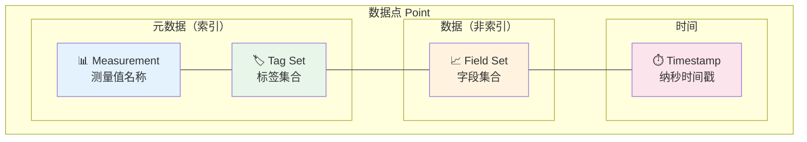

## 核心概念详解

### 1. Measurement（测量值）

Measurement 是对相关数据的逻辑分组，相当于关系型数据库中的表名。

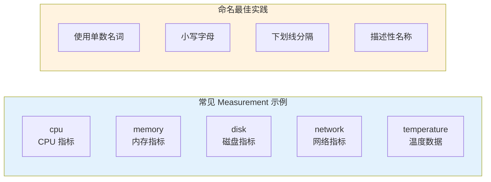

**命名规范：**

| ✅ 推荐 | ❌ 避免 |
|--------|--------|
| `cpu` | `CPU` (大写) |
| `disk_io` | `diskIO` (驼峰) |
| `network_traffic` | `networkTraffic` |
| `temperature` | `temp` (缩写) |

```sql
-- 示例：不同的 measurements
-- CPU 使用率的 measurement
cpu,host=server01,region=us-west usage_user=65.2,usage_system=12.3 1705315200000000000

-- 内存使用情况的 measurement  
memory,host=server01,region=us-west used_percent=78.5,available=2048000 1705315200000000000

-- 磁盘 I/O 的 measurement
diskio,host=server01,name=sda1 reads=12345,writes=6789 1705315200000000000
```

### 2. Tag（标签）- 索引维度

Tag 是**字符串类型**的元数据，用于数据过滤和分组，会被**自动索引**。

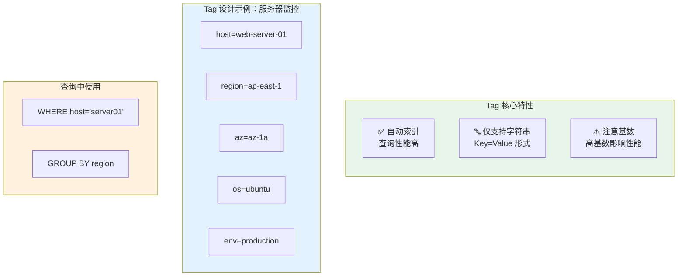

**Tag vs Field 决策树：**

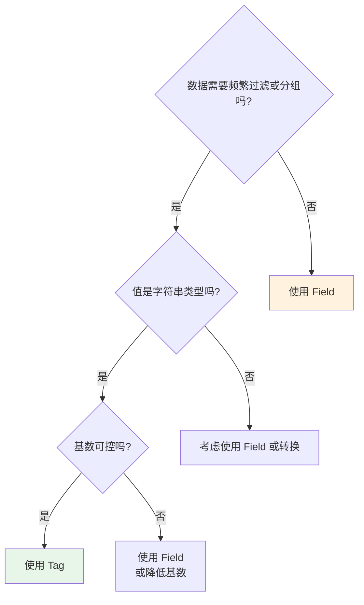

**Tag 设计示例：**

```
┌─────────────────────────────────────────────────────────────┐
│  场景：电商平台订单监控                                        │
├─────────────────────────────────────────────────────────────┤
│                                                             │
│  ✅ 适合作为 Tag（维度）：                                    │
│     - status: pending/completed/cancelled                   │
│     - region: cn-east/cn-west/us-east                       │
│     - platform: web/ios/android                             │
│     - payment_method: alipay/wechat/card                    │
│                                                             │
│  ✅ 适合作为 Field（数值）：                                  │
│     - order_amount: 199.50                                  │
│     - item_count: 3                                         │
│     - processing_time_ms: 245                               │
│                                                             │
│  ⚠️ 需要谨慎的设计：                                         │
│     - user_id: 100万用户 → 高基数，考虑哈希或分桶            │
│     - order_id: 每个订单唯一 → 不应该作为 tag                │
│                                                             │
└─────────────────────────────────────────────────────────────┘
```

### 3. Field（字段）- 数据值

Field 是实际的数据值，**不会被索引**，支持多种数据类型。

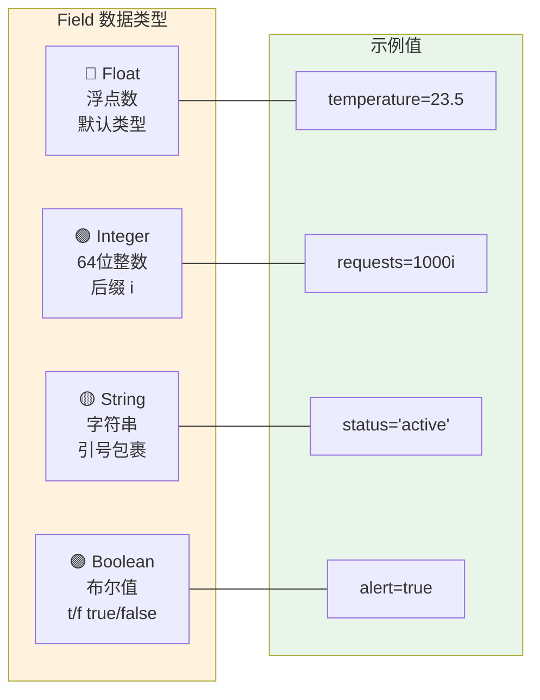

**Field 类型详解：**

| 类型 | 语法示例 | 说明 | 适用场景 |
|------|----------|------|----------|
| **Float** | `value=42.5` | 默认类型，IEEE-754 64位浮点 | 温度、百分比、小数 |
| **Integer** | `count=100i` | 64位有符号整数，后缀 `i` | 计数、ID（小范围）|
| **String** | `message="error"` | UTF-8 字符串，需引号 | 日志消息、状态描述 |
| **Boolean** | `active=true` | true/false, t/f, T/F | 开关状态、标志位 |
| **UInteger** | `id=123u` | 无符号整数，后缀 `u` | 大规模 ID |

```sql
-- 同类型 Field 合并示例
cpu,host=server01 usage_idle=80.5,usage_user=15.2,usage_system=4.3 1705315200000000000

-- 不同类型混合
server_status,host=server01 
  cpu_percent=65.5,
  memory_bytes=8589934592i,
  status="healthy",
  is_active=true
  1705315200000000000
```

### 4. Timestamp（时间戳）

时间戳是时序数据的核心，InfluxDB 使用**纳秒精度**的 Unix 时间戳。

```mermaid
gantt
    title 时间精度对比
    dateFormat x
    axisFormat %H:%M:%S.%L
    
    section 秒
    1 second    :0, 1000
    
    section 毫秒
    1 ms        :0, 1
    
    section 微秒
    1 μs        :0, 0.001
    
    section 纳秒
    1 ns        :0, 0.000001
```

**时间精度选择：**

| 精度 | 应用场景 | 示例 |
|------|----------|------|
| `s` (秒) | 低频监控、日志 | 系统指标每分钟采集 |
| `ms` (毫秒) | 应用性能监控 | API 响应时间 |
| `us` (微秒) | 高精度测量 | 传感器数据 |
| `ns` (纳秒) | 金融高频交易 | 股票价格变动 |

```python
# Python 示例：生成不同精度的时间戳
import time

# 秒级
seconds = int(time.time())
print(f"Seconds: {seconds}")          # 1705315200

# 毫秒级
milliseconds = int(time.time() * 1000)
print(f"Milliseconds: {milliseconds}")  # 1705315200000

# 纳秒级 (InfluxDB 默认)
nanoseconds = int(time.time() * 1e9)
print(f"Nanoseconds: {nanoseconds}")    # 1705315200000000000

# 自动转换示例
from datetime import datetime

def to_nanoseconds(dt: datetime) -> int:
    return int(dt.timestamp() * 1e9)

dt = datetime(2024, 1, 15, 12, 0, 0)
print(to_nanoseconds(dt))  # 1705315200000000000
```

## 完整数据点示例

### 示例 1：服务器监控

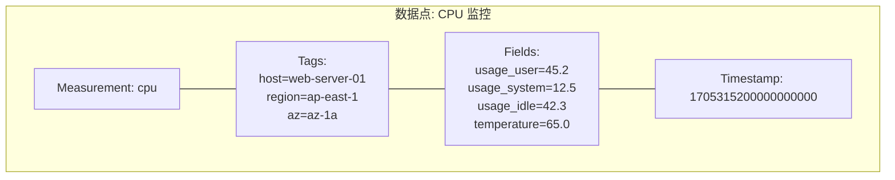

**Line Protocol 格式：**

```
cpu,host=web-server-01,region=ap-east-1,az=az-1a usage_user=45.2,usage_system=12.5,usage_idle=42.3,temperature=65.0 1705315200000000000

# 分解说明：
# ├─ measurement: cpu
# ├─ tags: host=web-server-01, region=ap-east-1, az=az-1a
# ├─ fields: usage_user=45.2, usage_system=12.5, usage_idle=42.3, temperature=65.0
# └─ timestamp: 1705315200000000000 (纳秒)
```

### 示例 2：IoT 传感器

```
temperature,device_id=temp_001,location=factory_floor_1,sensor_type=ds18b20 value=23.5,unit="celsius",battery=89i 1705315200000000000
humidity,device_id=hum_003,location=warehouse_a,sensor_type=dht22 value=65.0,unit="percent",battery=92i 1705315200000000000
pressure,device_id=baro_001,location=outdoor,sensor_type=bmp280 value=1013.25,unit="hPa",battery=78i 1705315200000000000
```

### 示例 3：应用性能监控 (APM)

```
http_request,service=user-api,endpoint=/api/v1/users,method=GET,status=200 
  duration_ms=45.2,
  request_size_bytes=1024i,
  response_size_bytes=2048i,
  trace_id="abc123def456"
  1705315200000000000
```

## Series（序列）概念

Series 是 InfluxDB 的核心概念，指具有**相同 measurement + tag set** 的数据点序列。

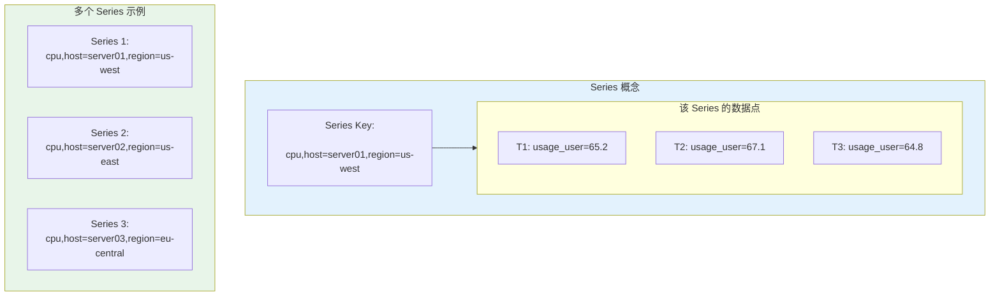

**Series Cardinality（序列基数）**

```
基数 = measurement 数量 × 每个 measurement 的 tag 组合数

示例：
  measurement: cpu
  tags: 
    - host: 100 台服务器
    - region: 3 个区域
    - env: 2 种环境 (prod/staging)
  
  理论基数 = 1 × 100 × 3 × 2 = 600 series

⚠️ 警告：
- 基数 < 10万：性能良好
- 基数 10万-100万：需要监控
- 基数 > 100万：性能问题，需要重新设计
```

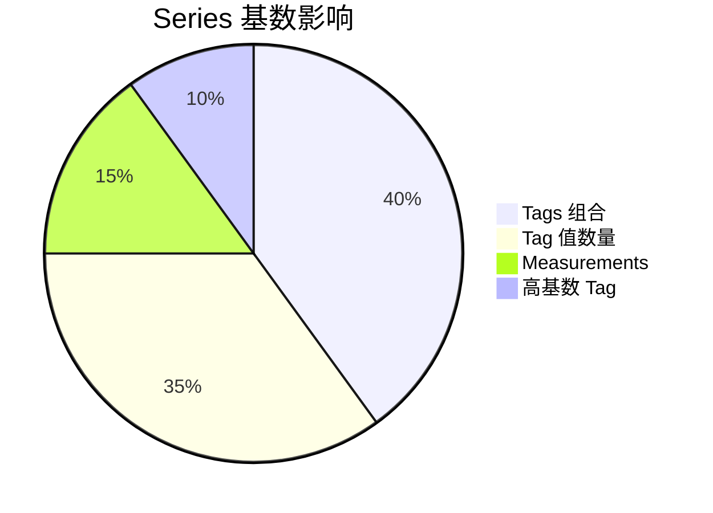

## Schema 设计最佳实践

### 设计原则

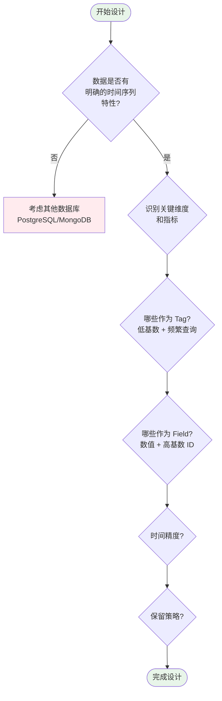

### 示例：电商平台监控系统

```
┌─────────────────────────────────────────────────────────────────────┐
│                    电商监控 Schema 设计                              │
├─────────────────────────────────────────────────────────────────────┤
│                                                                     │
│  📊 Measurement: order_metrics                                      │
│  ─────────────────────────────────────                              │
│  🏷️ Tags (维度):                                                    │
│     - region: cn-north/cn-south/cn-east (低基数: 3)                 │
│     - platform: web/ios/android/miniapp (低基数: 4)                 │
│     - payment_type: alipay/wechat/card (低基数: 3)                  │
│     - status: success/failed/pending (低基数: 3)                    │
│     - hour_bucket: 00-01/01-02/.../23-00 (低基数: 24)               │
│                                                                     │
│  📈 Fields (数值):                                                  │
│     - order_count: 订单数量 (integer)                               │
│     - total_amount: 订单总金额 (float)                              │
│     - avg_order_value: 客单价 (float)                               │
│     - user_count: 用户数 (integer)                                  │
│                                                                     │
│  ⚠️ 注意：user_id 和 order_id 不作为 tag（高基数）                  │
│                                                                     │
├─────────────────────────────────────────────────────────────────────┤
│                                                                     │
│  📊 Measurement: api_latency                                        │
│  ─────────────────────────────────────                              │
│  🏷️ Tags:                                                           │
│     - service: user-service/order-service/pay-service               │
│     - endpoint: /api/v1/users/GET /api/v1/orders/POST               │
│     - status_code: 200/400/500                                      │
│                                                                     │
│  📈 Fields:                                                         │
│     - latency_ms: 响应时间 (float)                                  │
│     - request_count: 请求数 (integer)                               │
│     - error_count: 错误数 (integer)                                 │
│     - trace_id: 追踪ID (string, field不是tag!)                      │
│                                                                     │
└─────────────────────────────────────────────────────────────────────┘
```

### 反模式与避免方法

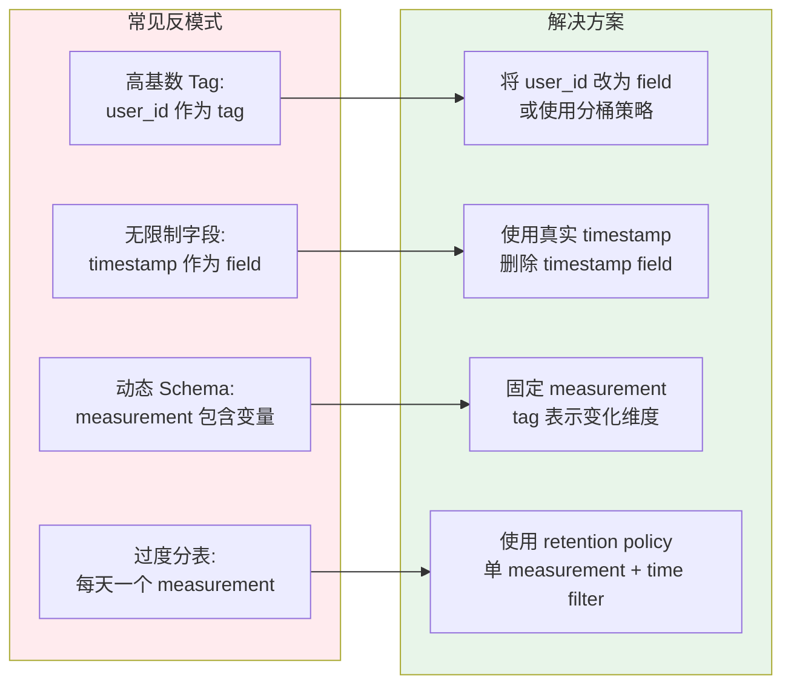

## 数据模型对比

### InfluxDB vs 关系型数据库

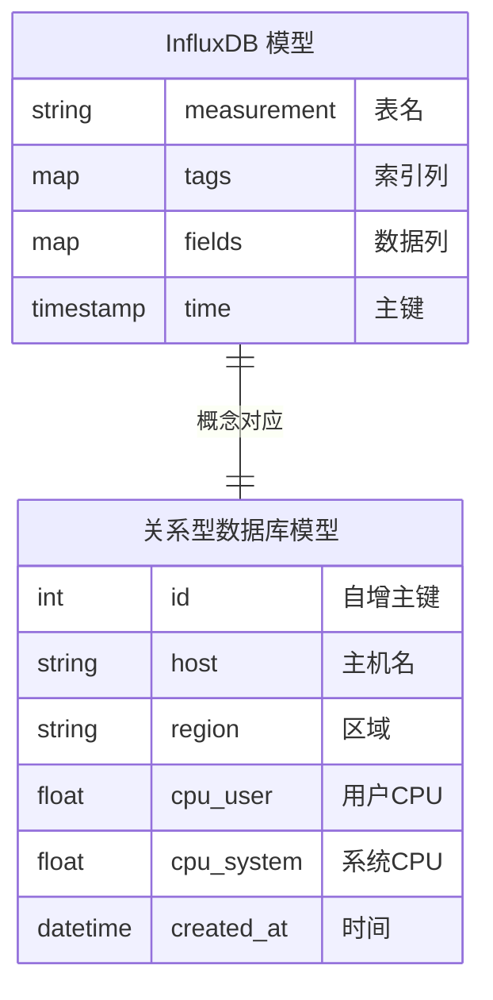

| 特性 | InfluxDB | MySQL/PostgreSQL |
|------|----------|------------------|
| 主键 | 时间戳（自动） | 需要定义 |
| 索引 | Tag 自动索引 | 需手动创建 |
| Schema | 灵活（schemaless） | 严格定义 |
| 时间处理 | 原生支持 | 需额外处理 |
| 聚合查询 | 高效内置函数 | 相对较慢 |
| 数据压缩 | 高压缩比 | 一般 |

## 实践练习

### 练习 1：设计一个智能家居 Schema

```markdown
需求：
- 监控多个房间的温湿度
- 设备类型：温度传感器、湿度传感器、空调控制器
- 房间：客厅、卧室、厨房、卫生间
- 用户：100个家庭

你的设计：
```

**参考答案：**

```
# 好的设计：
temperature,home_id=home_001,room=living_room,device_type=temp_sensor 
  value=23.5,battery=85i,is_online=true 1705315200000000000

# ⚠️ 不好的设计（高基数问题）：
temperature,home_id=home_001,device_id=temp_001_abc123_xyz 
  value=23.5 1705315200000000000
# device_id 包含 UUID，会产生数百万 series
```

### 练习 2：计算 Series 基数

```markdown
Scenario: 应用程序监控
- 5 个微服务
- 每个服务 20 个 API 端点
- 3 个环境 (dev/staging/prod)
- 5 个 HTTP 状态码组 (2xx/3xx/4xx/5xx/error)

计算基数：
```

**答案：**
```
基数 = 5 (services) × 20 (endpoints) × 3 (environments) × 5 (status) 
     = 1,500 series

✅ 良好：基数远低于 10 万阈值
```

---

掌握数据模型设计后，下一篇将介绍 Line Protocol 数据写入格式。
