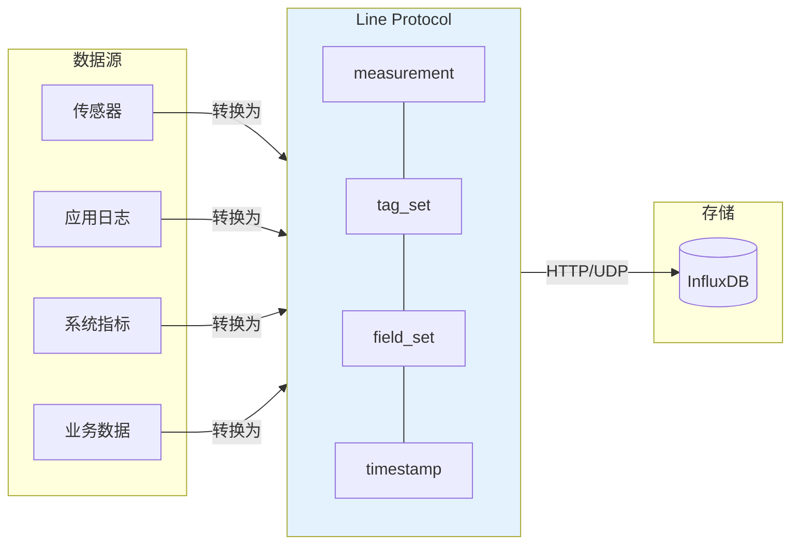
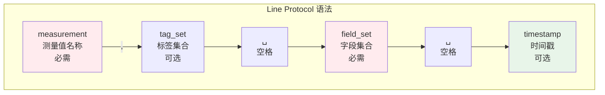
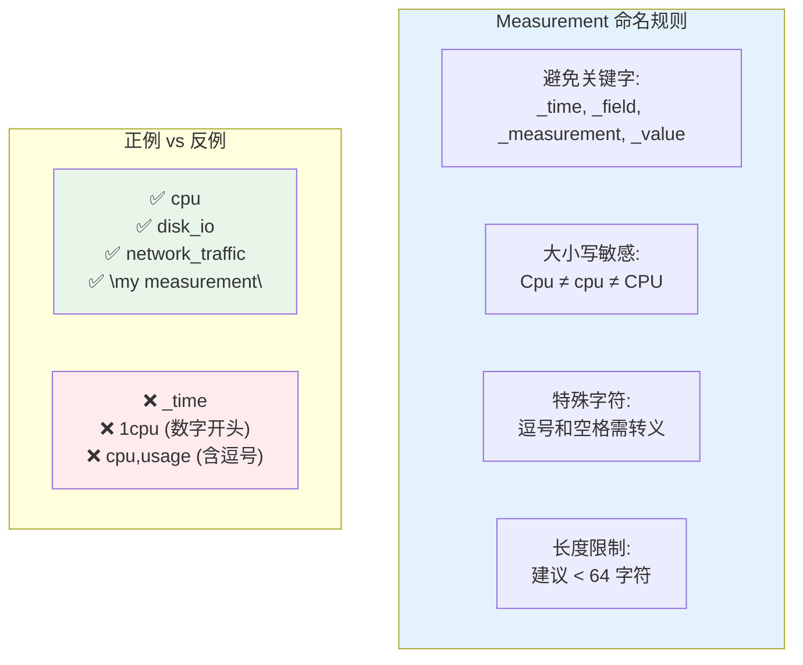
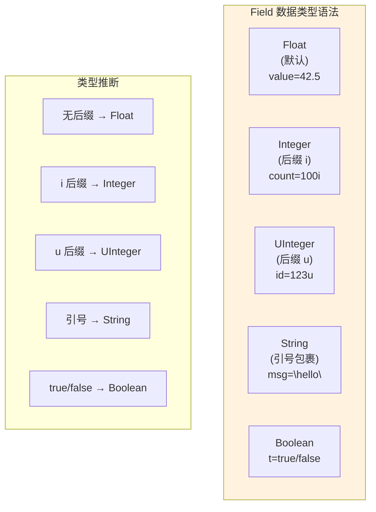
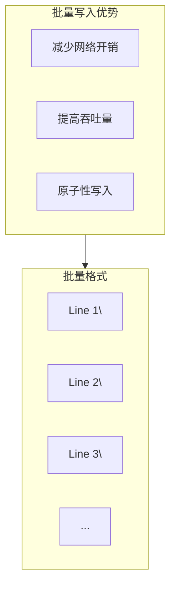
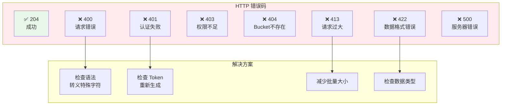

# InfluxDB Line Protocol 详解

## Line Protocol 概述

Line Protocol 是 InfluxDB 的**文本格式数据协议**，设计简洁高效，专为高吞吐量的时序数据写入优化。



## 语法结构

### 基本格式

```
<measurement>[,<tag_key>=<tag_value>[,<tag_key>=<tag_value>]] <field_key>=<field_value>[,<field_key>=<field_value>] [<timestamp>]

# 视觉分解：
├─────────────────────────────────────┤
│  measurement                        │  ← 必需
│  ,tag1=value1,tag2=value2          │  ← 可选，逗号开头
│  field1=100,field2="text"          │  ← 必需，空格开头
│  1705315200000000000               │  ← 可选，空格开头
└─────────────────────────────────────┘
```



### 完整示例解析

```
原始数据行：
cpu,host=server01,region=us-west usage_user=65.2,usage_system=12.3 1705315200000000000

解析结果：
┌─────────────────────────────────────────────────────────────────┐
│  Measurement                                                    │
│  ├─ name: "cpu"                                                 │
│                                                                 │
│  Tags                                                           │
│  ├─ host: "server01"                                            │
│  └─ region: "us-west"                                           │
│                                                                 │
│  Fields                                                         │
│  ├─ usage_user: 65.2 (float)                                    │
│  └─ usage_system: 12.3 (float)                                  │
│                                                                 │
│  Timestamp                                                      │
│  └─ 1705315200000000000 (2024-01-15 12:00:00 UTC)               │
└─────────────────────────────────────────────────────────────────┘
```

## 各组件详解

### 1. Measurement（测量值）



```python
# Python 示例：转义特殊字符
def escape_measurement(name):
    """转义 measurement 名称中的特殊字符"""
    # 转义逗号和空格
    escaped = name.replace(',', '\\,').replace(' ', '\\ ')
    return escaped

# 示例
print(escape_measurement("my measurement"))  # my\ measurement
print(escape_measurement("cpu,usage"))       # cpu\,usage
```

### 2. Tag Set（标签集）

```mermaid
flowchart LR
    subgraph TagFormat["Tag 格式"]
        Key["key\n(标识符)"]
        Eq["="]
        Val["value\n(字符串)"]
        Comma[","]
    end
    
    Key --> Eq --> Val -->|可选下一个| Comma --> Key
    
    subgraph Escaping["特殊字符转义"]
        E1["空格 → \\ "
    comma → \\,"]
        E2["= → \\=\n    \" → \\\"
    "]
    end
    
    style TagFormat fill:#e8f5e9
```

**Tag 转义规则：**

| 字符 | 转义方式 | 示例 |
|------|----------|------|
| 逗号 `,` | `\,` | `location=New\,York` |
| 等号 `=` | `\=` | `key=val\=ue` |
| 空格 ` ` | `\ ` | `location=San\ Francisco` |

```python
# Tag 转义函数
def escape_tag_value(value):
    """转义 tag value 中的特殊字符"""
    return (value
        .replace('\\', '\\\\')  # 先转义反斜杠
        .replace(',', '\\,')
        .replace('=', '\\=')
        .replace(' ', '\\ '))

# 实际示例
tag_value = "US West, Region=1"
escaped = escape_tag_value(tag_value)
print(f"location={escaped}")
# 输出: location=US\ West\,\ Region\=1
```

### 3. Field Set（字段集）



**Field 类型完整示例：**

```
# Float (默认)
temperature value=23.5
temperature value=-10.8
temperature value=0.0
temperature value=.5        # 有效: 0.5
temperature value=5.        # 有效: 5.0

# Integer (必须加 i 后缀)
counter value=100i
counter value=-50i
counter value=0i

# UInteger (必须加 u 后缀)
ids value=4294967295u

# String (双引号包裹，内部引号转义)
logs message="Server started"
logs message="Error: \"Connection refused\""
logs message="Path: C:\\\\Users\\\\Admin"  # Windows 路径转义

# Boolean
events alert=true
events enabled=false
events flag=T    # 也支持 T/F
events ok=f      # 也支持 t/f
```

**String 转义规则：**

```mermaid
flowchart LR
    subgraph StringEscaping["String 转义"]
        Backslash["\\\\ → \\\\n反斜杠"]
        Quote["\\\" → \"
双引号"]
        NL["\\n → 换行
不推荐"]
    end
    
    subgraph Examples["示例"]
        E1['"line1\\\\nline2"']
        E2['"He said \\\"Hi\\\""']
        E3['"C:\\\\Program Files\\\\App"']
    end
    
    StringEscaping --- Examples
```

### 4. Timestamp（时间戳）

```mermaid
gantt
    title 时间戳精度对比
    dateFormat x
    axisFormat %H:%M:%S
    
    section 秒 (s)
    1705315200 :a1, 0, 1s
    
    section 毫秒 (ms)  
    1705315200000 :a2, 0, 1ms
    
    section 微秒 (μs)
    1705315200000000 :a3, 0, 1μs
    
    section 纳秒 (ns) - 默认
    1705315200000000000 :a4, 0, 1ns
```



**Timestamp 精度说明：**

| 精度 | 长度 | 示例 | 应用场景 |
|------|------|------|----------|
| `s` | 10位 | `1705315200` | 低频日志 |
| `ms` | 13位 | `1705315200000` | 应用监控 |
| `μs` | 16位 | `1705315200000000` | 高精度传感器 |
| `ns` | 19位 | `1705315200000000000` | 默认，金融数据 |

```python
# Python 生成不同精度时间戳
from datetime import datetime
import time

def get_timestamps():
    now = datetime.now()
    unix_time = now.timestamp()
    
    return {
        'seconds': int(unix_time),
        'milliseconds': int(unix_time * 1000),
        'microseconds': int(unix_time * 1_000_000),
        'nanoseconds': int(unix_time * 1_000_000_000),
        'iso': now.isoformat()
    }

timestamps = get_timestamps()
for precision, ts in timestamps.items():
    print(f"{precision:12}: {ts}")

# 输出：
# seconds     : 1705315200
# milliseconds: 1705315200000
# microseconds: 1705315200000000
# nanoseconds : 1705315200000000000
# iso         : 2024-01-15T12:00:00.123456
```

## 完整写入示例

### 单条数据写入

```bash
# 使用 curl 写入单条数据
curl -X POST http://localhost:8086/api/v2/write \
  --header "Authorization: Token YOUR_TOKEN" \
  --header "Content-Type: text/plain; charset=utf-8" \
  --data-binary 'cpu,host=server01,region=us-west usage_user=65.2,usage_system=12.3 1705315200000000000'
```

### 批量数据写入



```bash
# 批量写入多条数据
curl -X POST http://localhost:8086/api/v2/write \
  --header "Authorization: Token YOUR_TOKEN" \
  --header "Content-Type: text/plain" \
  --data-binary '
cpu,host=server01,region=us-west usage_user=65.2,usage_system=12.3 1705315200000000000
cpu,host=server01,region=us-west usage_user=67.1,usage_system=11.8 1705315260000000000
cpu,host=server01,region=us-west usage_user=64.8,usage_system=13.2 1705315320000000000
memory,host=server01,region=us-west used_percent=78.5,available=2048000i 1705315200000000000
memory,host=server01,region=us-west used_percent=79.2,available=1984000i 1705315260000000000
'
```

### Python 写入示例

```python
import requests
from datetime import datetime
import time

class InfluxDBWriter:
    def __init__(self, url, token, org, bucket):
        self.url = f"{url}/api/v2/write"
        self.token = token
        self.org = org
        self.bucket = bucket
        self.headers = {
            "Authorization": f"Token {token}",
            "Content-Type": "text/plain; charset=utf-8"
        }
    
    def escape_measurement(self, name):
        """转义 measurement 名称"""
        return name.replace(',', '\\,').replace(' ', '\\ ')
    
    def escape_tag(self, key, value):
        """转义 tag key 和 value"""
        key = key.replace('\\', '\\\\').replace(',', '\\,').replace('=', '\\=').replace(' ', '\\ ')
        value = value.replace('\\', '\\\\').replace(',', '\\,').replace('=', '\\=').replace(' ', '\\ ')
        return f"{key}={value}"
    
    def escape_field(self, key, value):
        """格式化 field，根据类型处理"""
        key = key.replace('\\', '\\\\').replace(',', '\\,').replace('=', '\\=').replace(' ', '\\ ')
        
        if isinstance(value, bool):
            return f"{key}={'t' if value else 'f'}"
        elif isinstance(value, int):
            return f"{key}={value}i"
        elif isinstance(value, str):
            escaped = value.replace('\\', '\\\\').replace('"', '\\"')
            return f'{key}="{escaped}"'
        else:  # float
            return f"{key}={value}"
    
    def create_line(self, measurement, tags, fields, timestamp_ns=None):
        """创建 Line Protocol 格式的数据行"""
        if timestamp_ns is None:
            timestamp_ns = int(time.time() * 1e9)
        
        # Measurement
        line = self.escape_measurement(measurement)
        
        # Tags
        if tags:
            tag_str = ','.join([self.escape_tag(k, str(v)) for k, v in tags.items()])
            line += f",{tag_str}"
        
        # Fields
        field_str = ','.join([self.escape_field(k, v) for k, v in fields.items()])
        line += f" {field_str}"
        
        # Timestamp
        line += f" {timestamp_ns}"
        
        return line
    
    def write(self, lines):
        """写入数据到 InfluxDB"""
        if isinstance(lines, list):
            data = '\n'.join(lines)
        else:
            data = lines
        
        params = {
            'org': self.org,
            'bucket': self.bucket,
            'precision': 'ns'
        }
        
        response = requests.post(
            self.url,
            headers=self.headers,
            params=params,
            data=data
        )
        
        if response.status_code == 204:
            print(f"✅ 写入成功: {len(lines) if isinstance(lines, list) else 1} 条数据")
        else:
            print(f"❌ 写入失败: {response.status_code}")
            print(response.text)
        
        return response.status_code == 204


# 使用示例
writer = InfluxDBWriter(
    url="http://localhost:8086",
    token="your-token-here",
    org="my-org",
    bucket="my-bucket"
)

# 单条写入
line = writer.create_line(
    measurement="cpu",
    tags={"host": "server01", "region": "us-west"},
    fields={"usage_user": 65.2, "usage_system": 12.3}
)
writer.write(line)

# 批量写入
lines = []
for i in range(10):
    line = writer.create_line(
        measurement="cpu",
        tags={"host": f"server{i:02d}", "region": "us-west"},
        fields={"usage_user": 60.0 + i, "usage_system": 10.0 + i/2}
    )
    lines.append(line)

writer.write(lines)
```

## 性能优化

### 批量大小优化

```mermaid
xychart-beta
    title "批量大小 vs 写入性能"
    x-axis [100, 500, 1000, 5000, 10000, 50000]
    y-axis "吞吐量 (points/sec)" 0 -> 1000000
    line [50000, 150000, 300000, 600000, 800000, 950000]
    line [50000, 150000, 300000, 500000, 550000, 400000]
```

**推荐批量大小：**

| 场景 | 推荐批量 | 说明 |
|------|----------|------|
| 低延迟要求 | 100-500 | 快速响应，较低吞吐 |
| 平衡模式 | 1000-5000 | 推荐默认值 |
| 高吞吐模式 | 5000-10000 | 延迟可接受时使用 |
| 离线批处理 | 10000-50000 | 最大吞吐，高延迟 |

### 压缩传输

```bash
# 启用 Gzip 压缩（减少网络传输）
curl -X POST http://localhost:8086/api/v2/write \
  --header "Authorization: Token YOUR_TOKEN" \
  --header "Content-Encoding: gzip" \
  --header "Content-Type: text/plain" \
  --data-binary @data.gz

# Python 示例
import gzip
import requests

data = "cpu,host=server01 value=65.2"
compressed = gzip.compress(data.encode('utf-8'))

requests.post(
    "http://localhost:8086/api/v2/write",
    headers={
        "Authorization": "Token YOUR_TOKEN",
        "Content-Encoding": "gzip",
        "Content-Type": "text/plain"
    },
    params={"org": "my-org", "bucket": "my-bucket"},
    data=compressed
)
```

### 异步批量写入

```python
import asyncio
import aiohttp
from collections import deque
import time

class AsyncInfluxDBWriter:
    def __init__(self, url, token, org, bucket, batch_size=1000, flush_interval=5):
        self.url = f"{url}/api/v2/write"
        self.token = token
        self.org = org
        self.bucket = bucket
        self.batch_size = batch_size
        self.flush_interval = flush_interval
        
        self.buffer = deque()
        self.last_flush = time.time()
        self.session = None
    
    async def __aenter__(self):
        self.session = aiohttp.ClientSession(
            headers={"Authorization": f"Token {self.token}"}
        )
        return self
    
    async def __aexit__(self, exc_type, exc_val, exc_tb):
        await self.flush()
        await self.session.close()
    
    async def write(self, line):
        """异步写入单条数据"""
        self.buffer.append(line)
        
        # 触发条件：缓冲区满 或 超时
        if (len(self.buffer) >= self.batch_size or 
            time.time() - self.last_flush >= self.flush_interval):
            await self.flush()
    
    async def flush(self):
        """刷新缓冲区"""
        if not self.buffer:
            return
        
        lines = list(self.buffer)
        self.buffer.clear()
        self.last_flush = time.time()
        
        data = '\n'.join(lines)
        
        params = {
            'org': self.org,
            'bucket': self.bucket,
            'precision': 'ns'
        }
        
        try:
            async with self.session.post(
                self.url,
                params=params,
                data=data,
                headers={"Content-Type": "text/plain"}
            ) as response:
                if response.status == 204:
                    print(f"✅ 批量写入 {len(lines)} 条数据")
                else:
                    text = await response.text()
                    print(f"❌ 写入失败: {response.status} - {text}")
        except Exception as e:
            print(f"❌ 网络错误: {e}")


# 使用示例
async def main():
    async with AsyncInfluxDBWriter(
        url="http://localhost:8086",
        token="your-token",
        org="my-org",
        bucket="my-bucket",
        batch_size=1000,
        flush_interval=5
    ) as writer:
        
        # 模拟高频写入
        for i in range(10000):
            line = f"cpu,host=server{i%100:02d} usage_user={60+i%40}.0 {int(time.time()*1e9)}"
            await writer.write(line)
            
            if i % 1000 == 0:
                await asyncio.sleep(0.01)  # 避免阻塞

asyncio.run(main())
```

## 错误处理

### 常见错误码



### 错误重试策略

```python
import time
from functools import wraps

def retry_on_error(max_retries=3, delay=1, backoff=2):
    """指数退避重试装饰器"""
    def decorator(func):
        @wraps(func)
        def wrapper(*args, **kwargs):
            retries = 0
            current_delay = delay
            
            while retries < max_retries:
                try:
                    result = func(*args, **kwargs)
                    if result:  # 成功
                        return True
                except Exception as e:
                    print(f"❌ 错误: {e}")
                
                retries += 1
                if retries < max_retries:
                    print(f"🔄 重试 {retries}/{max_retries}，等待 {current_delay}s...")
                    time.sleep(current_delay)
                    current_delay *= backoff
            
            print("❌ 达到最大重试次数，写入失败")
            return False
        
        return wrapper
    return decorator


@retry_on_error(max_retries=3, delay=1, backoff=2)
def write_with_retry(writer, lines):
    return writer.write(lines)
```

## 调试技巧

### 验证数据格式

```python
def validate_line_protocol(line):
    """验证 Line Protocol 格式是否正确"""
    errors = []
    
    # 基本结构检查
    parts = line.split(' ')
    if len(parts) < 2:
        errors.append("缺少 field set")
        return errors
    
    # 检查 measurement + tags
    measurement_tags = parts[0].split(',')
    measurement = measurement_tags[0]
    
    if not measurement:
        errors.append("measurement 不能为空")
    
    # 检查 tags
    for tag in measurement_tags[1:]:
        if '=' not in tag:
            errors.append(f"tag 格式错误: {tag}")
    
    # 检查 fields
    fields_part = parts[1]
    fields = fields_part.split(',')
    
    if not fields:
        errors.append("至少需要一个 field")
    
    for field in fields:
        if '=' not in field:
            errors.append(f"field 格式错误: {field}")
    
    # 检查时间戳（如果有）
    if len(parts) >= 3:
        timestamp = parts[2]
        if not timestamp.isdigit():
            errors.append(f"timestamp 必须是数字: {timestamp}")
    
    return errors


# 测试
lines = [
    "cpu,host=server01 usage_user=65.2 1705315200000000000",  # 正确
    "cpu,host=server01",  # 错误：缺少 fields
    "cpu usage_user",  # 错误：field 缺少值
]

for line in lines:
    errors = validate_line_protocol(line)
    if errors:
        print(f"❌ {line}")
        for error in errors:
            print(f"   - {error}")
    else:
        print(f"✅ {line}")
```

---

掌握 Line Protocol 后，下一篇将介绍 Flux 查询语言。
