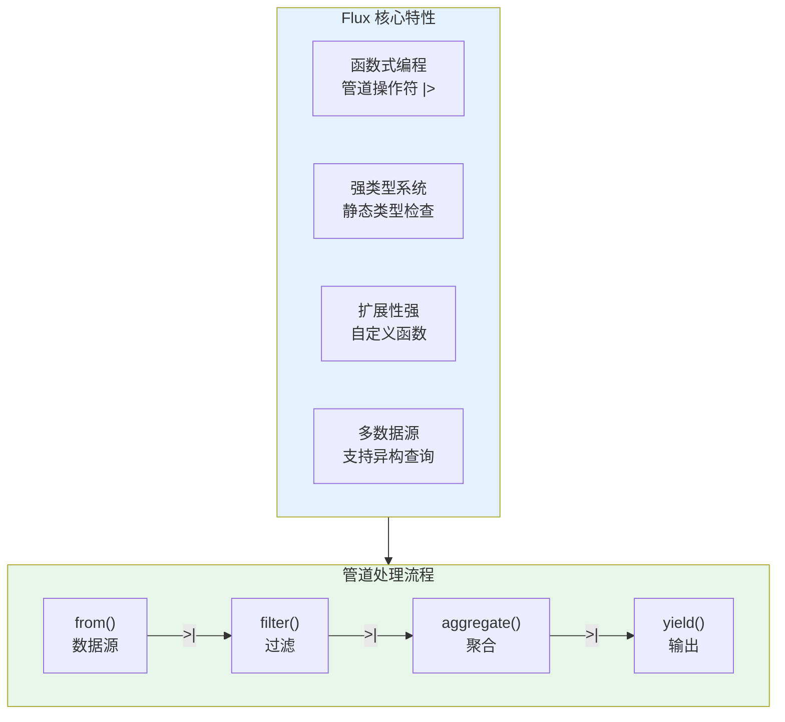
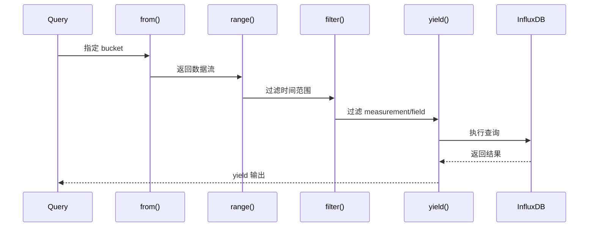
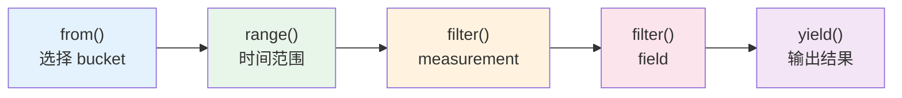
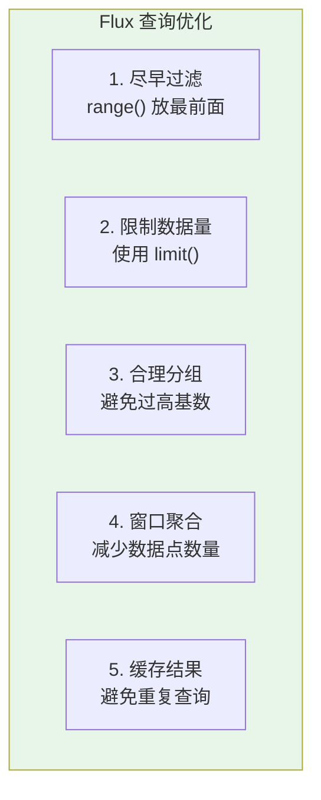

# Flux 查询语言完全指南

## Flux 概述

Flux 是 InfluxDB 2.x 引入的**函数式数据脚本语言**，专为查询、转换和处理时序数据设计。



## 基础语法

### 查询结构

```flux
// Flux 查询基本结构
from(bucket: "my-bucket")
    |> range(start: -1h)
    |> filter(fn: (r) => r._measurement == "cpu")
    |> filter(fn: (r) => r._field == "usage_user")
    |> yield(name: "result")
```



### 核心函数

#### 1. from() - 数据源

```flux
// 从指定 bucket 读取数据
from(bucket: "my-bucket")

// 或指定多个 buckets（需要 join）
from(bucket: "bucket1")
    |> union(tables: [from(bucket: "bucket2")])
```

#### 2. range() - 时间范围

```flux
// 相对时间
from(bucket: "my-bucket")
    |> range(start: -1h)      // 最近1小时
    |> range(start: -24h)     // 最近24小时
    |> range(start: -7d)      // 最近7天
    |> range(start: -1mo)     // 最近1个月

// 绝对时间
from(bucket: "my-bucket")
    |> range(start: 2024-01-01T00:00:00Z, stop: 2024-01-02T00:00:00Z)

// 使用变量
startTime = 2024-01-15T08:00:00Z
stopTime = 2024-01-15T18:00:00Z

from(bucket: "my-bucket")
    |> range(start: startTime, stop: stopTime)
```

#### 3. filter() - 数据过滤

```flux
// 基本过滤
from(bucket: "my-bucket")
    |> range(start: -1h)
    |> filter(fn: (r) => r._measurement == "cpu")
    |> filter(fn: (r) => r._field == "usage_user")

// 多条件过滤
from(bucket: "my-bucket")
    |> range(start: -1h)
    |> filter(fn: (r) => 
        r._measurement == "cpu" and 
        r.host == "server01" and
        (r._field == "usage_user" or r._field == "usage_system")
    )

// 使用正则表达式
from(bucket: "my-bucket")
    |> range(start: -1h)
    |> filter(fn: (r) => r.host =~ /^server\d{2}$/)  // 匹配 server01, server02...
    |> filter(fn: (r) => r._measurement !~ /_test$/)  // 排除以 _test 结尾
```

## 常用查询模式

### 模式 1：基本时序查询



```flux
// 查询最近1小时的 CPU 使用率
from(bucket: "monitoring")
    |> range(start: -1h)
    |> filter(fn: (r) => r._measurement == "cpu")
    |> filter(fn: (r) => r._field == "usage_user")
    |> filter(fn: (r) => r.host == "server01")
```

### 模式 2：分组聚合

```flux
// 按 host 分组，计算平均值
from(bucket: "monitoring")
    |> range(start: -1h)
    |> filter(fn: (r) => r._measurement == "cpu")
    |> filter(fn: (r) => r._field == "usage_user")
    |> group(columns: ["host"])
    |> mean()
```

```mermaid
flowchart TB
    subgraph Raw["原始数据"]
        R1["host=server01, value=65"]
        R2["host=server01, value=70"]
        R3["host=server02, value=55"]
        R4["host=server02, value=60"]
    end
    
    subgraph Grouped["按 host 分组"]
        G1["server01: [65, 70]"]
        G2["server02: [55, 60]"]
    end
    
    subgraph Aggregated["聚合结果"]
        A1["server01: mean=67.5"]
        A2["server02: mean=57.5"]
    end
    
    Raw -->|group()| Grouped
    Grouped -->|mean()| Aggregated
```

### 模式 3：时间窗口聚合

```flux
// 每5分钟计算平均 CPU 使用率
from(bucket: "monitoring")
    |> range(start: -1h)
    |> filter(fn: (r) => r._measurement == "cpu")
    |> filter(fn: (r) => r._field == "usage_user")
    |> aggregateWindow(every: 5m, fn: mean)

// 其他窗口函数
from(bucket: "monitoring")
    |> range(start: -24h)
    |> filter(fn: (r) => r._measurement == "cpu")
    |> aggregateWindow(every: 1h, fn: max)       // 每小时最大值
    |> aggregateWindow(every: 1h, fn: min)       // 每小时最小值
    |> aggregateWindow(every: 1h, fn: sum)       // 每小时求和
    |> aggregateWindow(every: 1h, fn: count)     // 每小时计数
    |> aggregateWindow(every: 1h, fn: first)     // 每小时第一个值
    |> aggregateWindow(every: 1h, fn: last)      // 每小时最后一个值
```



```mermaid
gantt
    title 时间窗口聚合示例
    dateFormat HH:mm
    axisFormat %H:%M
    
    section 原始数据
    P1 :10:01, 10:02
    P2 :10:03, 10:04
    P3 :10:06, 10:07
    P4 :10:08, 10:09
    
    section 5分钟窗口
    W1 :10:00, 10:05
    W2 :10:05, 10:10
```

## 聚合函数

### 数学聚合

```flux
// 基础统计
from(bucket: "monitoring")
    |> range(start: -1h)
    |> filter(fn: (r) => r._measurement == "cpu")
    |> filter(fn: (r) => r._field == "usage_user")
    |> mean()           // 平均值
    |> median()         // 中位数
    |> stddev()         // 标准差
    |> variance()       // 方差
    |> mode()           // 众数
    |> spread()         // 最大值-最小值
```

### 选择器函数

```flux
// 极值查询
from(bucket: "monitoring")
    |> range(start: -1h)
    |> filter(fn: (r) => r._measurement == "cpu")
    |> filter(fn: (r) => r._field == "usage_user")
    |> max()            // 最大值
    |> min()            // 最小值
    |> top(n: 10)       // 前10大值
    |> bottom(n: 10)    // 前10小值
    |> first()          // 第一个值
    |> last()           // 最后一个值
    |> unique(column: "host")  // 去重
```

### 百分位数

```flux
// 计算百分位数
from(bucket: "monitoring")
    |> range(start: -24h)
    |> filter(fn: (r) => r._measurement == "response_time")
    |> filter(fn: (r) => r._field == "latency_ms")
    |> quantile(q: 0.50)  // P50 - 中位数
    |> quantile(q: 0.90)  // P90
    |> quantile(q: 0.95)  // P95
    |> quantile(q: 0.99)  // P99
```

```mermaid
xychart-beta
    title "响应时间分布与百分位数"
    x-axis [0, 10, 20, 30, 40, 50, 60, 70, 80, 90, 100]
    y-axis "累计百分比 %"
    line [0, 5, 15, 35, 60, 75, 85, 92, 97, 99, 100]
    
    annotation P50: 30
    annotation P90: 80
    annotation P95: 90
    annotation P99: 95
```

## 数据转换

### 列操作

```flux
// 选择特定列
from(bucket: "monitoring")
    |> range(start: -1h)
    |> filter(fn: (r) => r._measurement == "cpu")
    |> keep(columns: ["_time", "_value", "host"])

// 删除列
from(bucket: "monitoring")
    |> range(start: -1h)
    |> drop(columns: ["region", "zone"])

// 重命名列
from(bucket: "monitoring")
    |> range(start: -1h)
    |> rename(columns: {usage_user: "cpu_user", usage_system: "cpu_system"})

// 创建新列
from(bucket: "monitoring")
    |> range(start: -1h)
    |> filter(fn: (r) => r._measurement == "cpu")
    |> map(fn: (r) => ({r with total_usage: r.usage_user + r.usage_system}))
```

### 数据类型转换

```flux
// 类型转换函数
from(bucket: "monitoring")
    |> range(start: -1h)
    |> toFloat()      // 转换为浮点数
    |> toInt()        // 转换为整数
    |> toString()     // 转换为字符串
    |> toBool()       // 转换为布尔值
    |> toUInt()       // 转换为无符号整数
```

### 数学运算

```flux
// 基本运算
from(bucket: "monitoring")
    |> range(start: -1h)
    |> filter(fn: (r) => r._measurement == "cpu")
    |> map(fn: (r) => ({r with 
        // 计算总 CPU 使用率
        total_usage: r.usage_user + r.usage_system + r.usage_iowait,
        
        // 转换为百分比
        usage_percent: r._value * 100.0,
        
        // 条件运算
        is_high: if r._value > 80.0 then true else false
    }))
```

## 高级功能

### 1. 多表 Join

```flux
// 将 CPU 和内存数据 join 在一起
cpu = from(bucket: "monitoring")
    |> range(start: -1h)
    |> filter(fn: (r) => r._measurement == "cpu")
    |> filter(fn: (r) => r._field == "usage_user")
    |> aggregateWindow(every: 1m, fn: mean)
    |> set(key: "_field", value: "cpu_usage")

memory = from(bucket: "monitoring")
    |> range(start: -1h)
    |> filter(fn: (r) => r._measurement == "memory")
    |> filter(fn: (r) => r._field == "used_percent")
    |> aggregateWindow(every: 1m, fn: mean)
    |> set(key: "_field", value: "mem_usage")

// 按时间和 host join
join(tables: {cpu: cpu, mem: memory}, on: ["_time", "host"])
    |> map(fn: (r) => ({r with 
        combined_load: r.cpu_usage + r.mem_usage
    }))
```

```mermaid
flowchart TB
    subgraph Table1["CPU Table"]
        C1["time=T1, host=A, cpu=60"]
        C2["time=T2, host=A, cpu=65"]
    end
    
    subgraph Table2["Memory Table"]
        M1["time=T1, host=A, mem=70"]
        M2["time=T2, host=A, mem=75"]
    end
    
    subgraph Joined["Join Result"]
        J1["time=T1, host=A, cpu=60, mem=70"]
        J2["time=T2, host=A, cpu=65, mem=75"]
    end
    
    Table1 -->|join on [time, host]| Joined
    Table2 -->|join on [time, host]| Joined
```

### 2. Union 合并

```flux
// 合并多个 bucket 的数据
prod = from(bucket: "production")
    |> range(start: -1h)
    |> set(key: "env", value: "production")

staging = from(bucket: "staging")
    |> range(start: -1h)
    |> set(key: "env", value: "staging")

union(tables: [prod, staging])
    |> group(columns: ["env"])
    |> mean()
```

### 3. 条件逻辑

```flux
// if/else 条件
from(bucket: "monitoring")
    |> range(start: -1h)
    |> filter(fn: (r) => r._measurement == "cpu")
    |> map(fn: (r) => ({r with 
        status: if r._value < 50 then "normal"
                else if r._value < 80 then "warning"
                else "critical"
    }))

// 条件过滤
from(bucket: "monitoring")
    |> range(start: -1h)
    |> filter(fn: (r) => 
        if r.env == "production" then r._value > 90
        else r._value > 95
    )
```

### 4. 窗口函数

```flux
// 滑动窗口
from(bucket: "monitoring")
    |> range(start: -1h)
    |> filter(fn: (r) => r._measurement == "cpu")
    |> movingAverage(n: 5)           // 5点移动平均
    |> exponentialMovingAverage(n: 5) // 指数移动平均
    |> derivative(unit: 1s)            // 求导（变化率）
    |> difference()                    // 差分
    |> cumulativeSum()                 // 累计求和
```

## 自定义函数

### 定义可复用函数

```flux
// 定义一个函数：计算 CPU 负载状态
loadStatus = (table=<-, warning=80.0, critical=95.0) => {
    table
        |> map(fn: (r) => ({r with 
            load_status: if r._value >= critical then "critical"
                        else if r._value >= warning then "warning"
                        else "normal"
        }))
}

// 使用自定义函数
from(bucket: "monitoring")
    |> range(start: -1h)
    |> filter(fn: (r) => r._measurement == "cpu")
    |> filter(fn: (r) => r._field == "usage_user")
    |> loadStatus(warning: 75.0, critical: 90.0)
```

### 高级自定义函数

```flux
// 计算同比环比
compareMetrics = (table=<-, offset=duration(v: "1w")) => {
    current = table
    
    previous = table
        |> timeShift(duration: offset)
        |> set(key: "_field", value: "previous")
    
    join(tables: {current: current, previous: previous}, on: ["_time", "host"])
        |> map(fn: (r) => ({r with 
            change: r._value - r.previous,
            change_percent: (r._value - r.previous) / r.previous * 100.0
        }))
}

// 使用
from(bucket: "monitoring")
    |> range(start: -24h)
    |> filter(fn: (r) => r._measurement == "cpu")
    |> compareMetrics(offset: duration(v: "1w"))
```

## 变量与参数

### 查询参数

```flux
// 定义变量
bucket = "monitoring"
measurement = "cpu"
field = "usage_user"
host = "server01"
timeRange = -1h

// 使用变量
from(bucket: bucket)
    |> range(start: timeRange)
    |> filter(fn: (r) => r._measurement == measurement)
    |> filter(fn: (r) => r._field == field)
    |> filter(fn: (r) => r.host == host)
```

### 动态参数（Dashboard 用）

```flux
// 使用 v: 语法引用外部参数（如 Grafana 变量）
from(bucket: v.bucket)
    |> range(start: v.timeRangeStart, stop: v.timeRangeStop)
    |> filter(fn: (r) => r._measurement == v.measurement)
    |> filter(fn: (r) => r.host =~ /${host:regex}/)
```

## 实际应用案例

### 案例 1：服务器资源监控大盘

```flux
// 最近1小时各服务器的平均资源使用率
from(bucket: "monitoring")
    |> range(start: -1h)
    |> filter(fn: (r) => r._measurement == "cpu" or r._measurement == "memory" or r._measurement == "disk")
    |> filter(fn: (r) => r._field == "usage_user" or r._field == "used_percent")
    |> group(columns: ["host", "_measurement"])
    |> aggregateWindow(every: 5m, fn: mean)
    |> pivot(rowKey:["_time"], columnKey: ["_measurement"], valueColumn: "_value")
```

### 案例 2：SLI/SLO 计算

```flux
// 计算过去30天的可用性SLI
from(bucket: "monitoring")
    |> range(start: -30d)
    |> filter(fn: (r) => r._measurement == "http_requests")
    |> filter(fn: (r) => r._field == "request_count")
    |> group()
    |> aggregateWindow(every: 1h, fn: sum)
    |> map(fn: (r) => ({r with 
        is_available: if r.status == "200" then 1 else 0
    }))
    |> cumulativeSum(columns: ["is_available"])
    |> map(fn: (r) => ({r with 
        availability: float(v: r.is_available) / float(v: r.request_count) * 100.0
    }))
```

### 案例 3：异常检测

```flux
// 使用标准差检测异常值
from(bucket: "monitoring")
    |> range(start: -7d)
    |> filter(fn: (r) => r._measurement == "cpu")
    |> filter(fn: (r) => r._field == "usage_user")
    |> group(columns: ["host"])
    |> aggregateWindow(every: 1h, fn: mean)
    |> stddev()
    |> map(fn: (r) => ({r with 
        threshold_high: r._value + 2.0 * r.stddev,
        threshold_low: r._value - 2.0 * r.stddev
    }))
```

## 性能优化

### 查询优化建议



```flux
// 优化前：低效查询
from(bucket: "monitoring")
    |> filter(fn: (r) => r._measurement == "cpu")  // 先过滤
    |> range(start: -1h)                           // 后限制时间

// 优化后：高效查询
from(bucket: "monitoring")
    |> range(start: -1h)                           // 先限制时间范围
    |> filter(fn: (r) => r._measurement == "cpu")  // 再过滤
    |> limit(n: 1000)                              // 限制返回数量
```

---

掌握 Flux 后，下一篇将介绍传统的 InfluxQL 查询语言。
