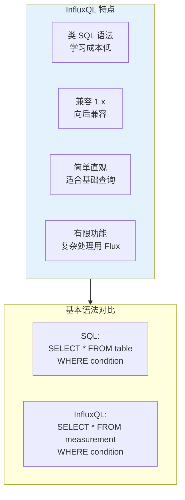
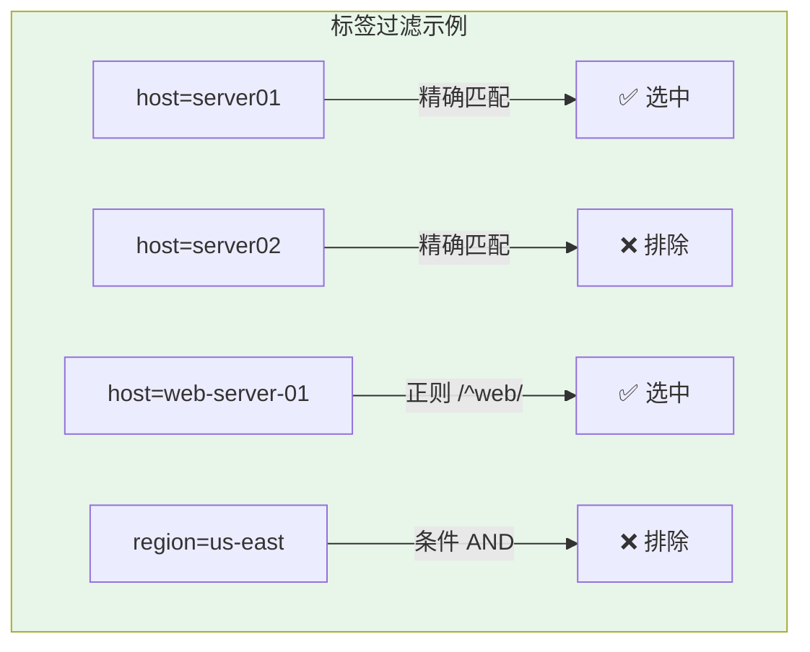
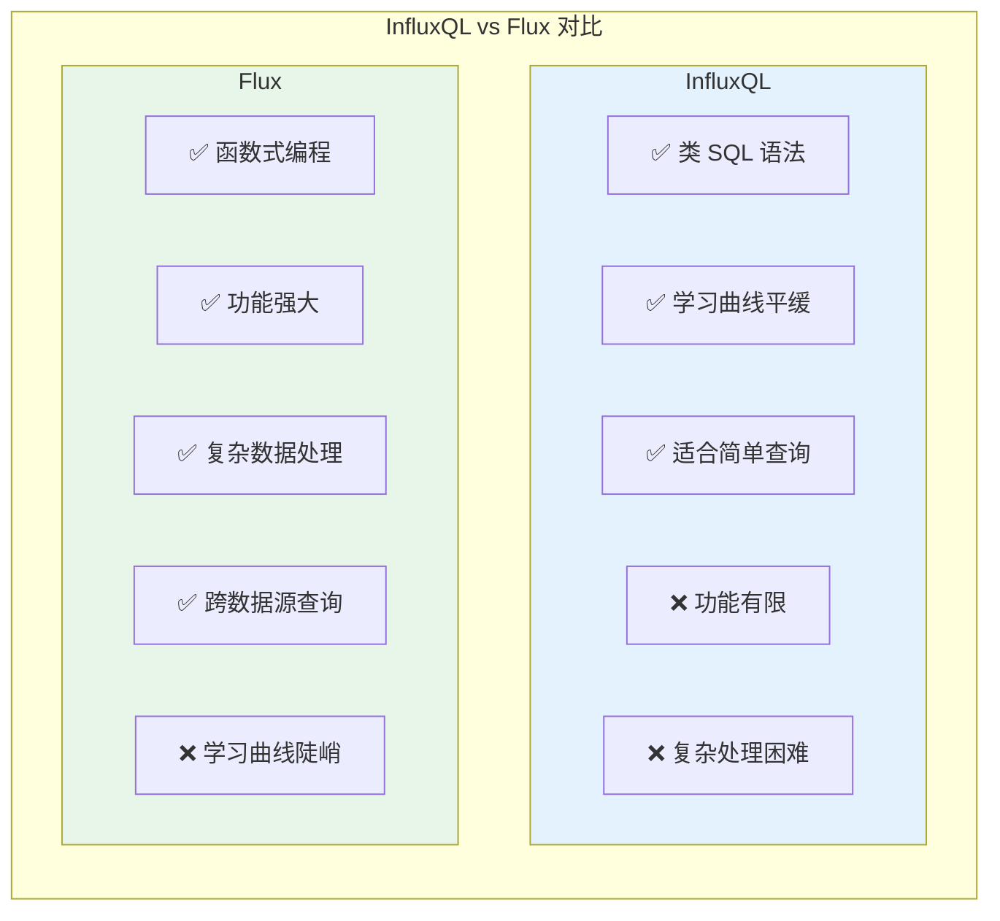
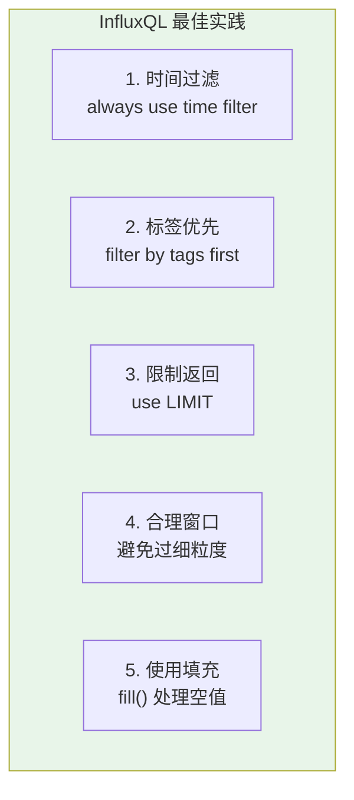

# InfluxQL 查询语言指南

## InfluxQL 概述

InfluxQL 是 InfluxDB 的**类 SQL 查询语言**，语法类似于传统关系型数据库的 SQL，易于上手。



## 基础查询语法

### SELECT 语句

```sql
-- 基本查询
SELECT * FROM cpu

-- 查询特定字段
SELECT usage_user, usage_system FROM cpu

-- 带条件查询
SELECT * FROM cpu WHERE host = 'server01'

-- 时间范围查询
SELECT * FROM cpu WHERE time > now() - 1h

-- 限制返回数量
SELECT * FROM cpu LIMIT 100
```


### 时间处理

```sql
-- 相对时间
SELECT * FROM cpu WHERE time > now() - 1h      -- 最近1小时
SELECT * FROM cpu WHERE time > now() - 24h     -- 最近24小时
SELECT * FROM cpu WHERE time > now() - 7d      -- 最近7天
SELECT * FROM cpu WHERE time > now() - 30d     -- 最近30天

-- 绝对时间
SELECT * FROM cpu 
WHERE time >= '2024-01-15T00:00:00Z' 
  AND time <= '2024-01-16T00:00:00Z'

-- 使用时间戳
SELECT * FROM cpu 
WHERE time > 1705276800000000000 
  AND time < 1705363200000000000

-- 时间单位
SELECT * FROM cpu WHERE time > now() - 5m     -- 5分钟
SELECT * FROM cpu WHERE time > now() - 1h     -- 1小时
SELECT * FROM cpu WHERE time > now() - 1d     -- 1天
SELECT * FROM cpu WHERE time > now() - 1w     -- 1周
```

## 数据过滤

### 标签过滤

```sql
-- 单标签过滤
SELECT * FROM cpu WHERE host = 'server01'
SELECT * FROM cpu WHERE region = 'us-west'

-- 多标签过滤
SELECT * FROM cpu 
WHERE host = 'server01' 
  AND region = 'us-west'

SELECT * FROM cpu 
WHERE host = 'server01' 
   OR host = 'server02'

-- 使用正则表达式
SELECT * FROM cpu WHERE host =~ /server\d+/      -- 匹配 server1, server2...
SELECT * FROM cpu WHERE host =~ /^web/           -- 以 web 开头
SELECT * FROM cpu WHERE host !~ /test$/         -- 不以 test 结尾
```



### 字段过滤

```sql
-- 注意：Field 不能被 WHERE 索引，效率较低
SELECT * FROM cpu WHERE usage_user > 80
SELECT * FROM cpu WHERE usage_user >= 50 AND usage_user <= 90

-- 推荐：先用标签过滤，再过滤字段
SELECT * FROM cpu 
WHERE host = 'server01'           -- 标签过滤（高效）
  AND usage_user > 80             -- 字段过滤
```

## 聚合查询

### 基本聚合函数

```sql
-- 计算平均值
SELECT MEAN(usage_user) FROM cpu

-- 计算最大值
SELECT MAX(usage_user) FROM cpu

-- 计算最小值
SELECT MIN(usage_user) FROM cpu

-- 求和
SELECT SUM(requests) FROM http

-- 计数
SELECT COUNT(requests) FROM http

-- 标准差
SELECT STDDEV(usage_user) FROM cpu

-- 方差
SELECT VARIANCE(usage_user) FROM cpu

-- 百分位数
SELECT PERCENTILE(usage_user, 95) FROM cpu
```

### 分组聚合

```sql
-- 按标签分组
SELECT MEAN(usage_user) FROM cpu GROUP BY host
SELECT MEAN(usage_user) FROM cpu GROUP BY region
SELECT MEAN(usage_user) FROM cpu GROUP BY host, region

-- 按时间分组（时间窗口）
SELECT MEAN(usage_user) FROM cpu 
WHERE time > now() - 1h
GROUP BY time(5m)

-- 复合分组
SELECT MEAN(usage_user) FROM cpu 
WHERE time > now() - 1h
GROUP BY time(5m), host
```



```mermaid
gantt
    title 时间窗口聚合 (GROUP BY time(5m))
    dateFormat HH:mm
    axisFormat %H:%M
    
    section 原始数据
    D1 :10:01, 10:02
    D2 :10:03, 10:04
    D3 :10:06, 10:07
    D4 :10:08, 10:09
    
    section 聚合结果
    W1 :10:00, 10:05
    W2 :10:05, 10:10
```

### 填充策略

```sql
-- fill() 处理空值
SELECT MEAN(usage_user) FROM cpu 
WHERE time > now() - 1h
GROUP BY time(5m) fill(null)       -- 空值填充 NULL

SELECT MEAN(usage_user) FROM cpu 
WHERE time > now() - 1h
GROUP BY time(5m) fill(0)          -- 空值填充 0

SELECT MEAN(usage_user) FROM cpu 
WHERE time > now() - 1h
GROUP BY time(5m) fill(previous)   -- 用前值填充

SELECT MEAN(usage_user) FROM cpu 
WHERE time > now() - 1h
GROUP BY time(5m) fill(linear)     -- 线性插值

SELECT MEAN(usage_user) FROM cpu 
WHERE time > now() - 1h
GROUP BY time(5m) fill(none)       -- 不填充，跳过
```

## 高级查询

### 嵌套查询

```sql
-- 子查询
SELECT MEAN(avg_usage) FROM (
    SELECT MEAN(usage_user) AS avg_usage 
    FROM cpu 
    WHERE time > now() - 1h
    GROUP BY time(5m), host
)

-- 多层嵌套
SELECT MAX(usage) FROM (
    SELECT MEAN(usage_user) AS usage
    FROM cpu
    WHERE time > now() - 24h
    GROUP BY time(1h), host
)
```

### 数学运算

```sql
-- 基本运算
SELECT usage_user + usage_system FROM cpu
SELECT usage_user * 100 FROM cpu                   -- 转百分比
SELECT usage_user / (usage_user + usage_idle) FROM cpu

-- 复杂计算
SELECT 
    (usage_user + usage_system + usage_iowait) AS total_usage
FROM cpu

-- 使用函数
SELECT 
    ABS(usage_user - usage_system) AS usage_diff,
    POW(usage_user, 2) AS usage_squared,
    SQRT(usage_user) AS usage_sqrt
FROM cpu
```

### 选择器函数

```sql
-- 选择特定值
SELECT TOP(usage_user, 10) FROM cpu               -- 前10大值
SELECT BOTTOM(usage_user, 10) FROM cpu            -- 前10小值
SELECT FIRST(usage_user) FROM cpu                 -- 第一个值
SELECT LAST(usage_user) FROM cpu                  -- 最后一个值

-- 带标签的 TOP/BOTTOM
SELECT TOP(usage_user, 3), host FROM cpu          -- 返回前3及对应 host
SELECT BOTTOM(usage_user, 5), host, region FROM cpu
```

## 数据管理

### 写入数据

```sql
-- 基本插入（InfluxDB 2.x 通过 API 写入，InfluxQL 主要用于查询）
-- 以下语法适用于 InfluxDB 1.x

INSERT cpu,host=server01,region=us-west usage_user=65.2,usage_system=12.3

-- 带时间戳
INSERT cpu,host=server01,region=us-west usage_user=65.2 1705315200000000000
```

### 删除数据

```sql
-- 删除时间范围内的数据（InfluxDB 2.x 限制较多）
DELETE FROM cpu WHERE time < '2024-01-01T00:00:00Z'
DELETE FROM cpu WHERE host = 'server01' AND time < now() - 30d

-- 删除整个 measurement（谨慎使用）
DROP MEASUREMENT cpu
DROP MEASUREMENT "my measurement"  -- 特殊名称加引号
```

### 元数据查询

```sql
-- 查看所有 measurements
SHOW MEASUREMENTS

-- 查看特定 measurement 的字段
SHOW FIELD KEYS FROM cpu

-- 查看标签
SHOW TAG KEYS FROM cpu
SHOW TAG VALUES FROM cpu WITH KEY = "host"
SHOW TAG VALUES FROM cpu WITH KEY IN ("host", "region")

-- 查看保留策略
SHOW RETENTION POLICIES ON mydb

-- 查看连续查询
SHOW CONTINUOUS QUERIES

-- 查看用户（1.x）
SHOW USERS
SHOW GRANTS FOR "username"
```

## InfluxQL vs Flux 对比



| 特性 | InfluxQL | Flux |
|------|----------|------|
| **语法风格** | 类 SQL | 函数式/管道 |
| **学习难度** | 低 | 中等 |
| **复杂转换** | 困难 | 容易 |
| **多表 Join** | 不支持 | 支持 |
| **数学运算** | 基础 | 丰富 |
| **自定义函数** | 不支持 | 支持 |
| **跨 Bucket** | 不支持 | 支持 |
| **InfluxDB 2.x** | 兼容模式 | 原生支持 |

### 相同功能对比

```sql
-- InfluxQL: 查询最近1小时的 CPU 使用率
SELECT MEAN(usage_user) FROM cpu 
WHERE time > now() - 1h 
GROUP BY time(5m)
```

```flux
-- Flux: 相同功能
from(bucket: "my-bucket")
    |> range(start: -1h)
    |> filter(fn: (r) => r._measurement == "cpu")
    |> filter(fn: (r) => r._field == "usage_user")
    |> aggregateWindow(every: 5m, fn: mean)
```

### 复杂查询对比

```sql
-- InfluxQL: 难以实现的多表关联
-- 需要多次查询 + 应用层处理
```

```flux
-- Flux: 轻松实现 Join
cpu = from(bucket: "monitoring")
    |> range(start: -1h)
    |> filter(fn: (r) => r._measurement == "cpu")

mem = from(bucket: "monitoring")
    |> range(start: -1h)
    |> filter(fn: (r) => r._measurement == "memory")

join(tables: {cpu: cpu, mem: mem}, on: ["_time", "host"])
```

## InfluxDB 2.x 中使用 InfluxQL

### 启用 InfluxQL 兼容接口

```bash
# 1. 使用 v1 认证数据库创建映射
influx v1 dbrp create \
  --bucket-id YOUR_BUCKET_ID \
  --db mydb \
  --rp autogen \
  --default

# 2. 创建 v1 用户（用于 InfluxQL 认证）
influx v1 auth create \
  --username myuser \
  --password mypassword \
  --read-bucket YOUR_BUCKET_ID \
  --write-bucket YOUR_BUCKET_ID
```

### 通过 API 执行 InfluxQL

```bash
# 使用 InfluxQL 查询
curl -X POST http://localhost:8086/query \
  --data-urlencode "q=SELECT * FROM cpu WHERE time > now() - 1h" \
  --data-urlencode "db=mydb" \
  -u myuser:mypassword
```

### 编程语言示例

```python
# Python 使用 InfluxQL
from influxdb_client import InfluxDBClient

client = InfluxDBClient(
    url="http://localhost:8086",
    token="your-token",
    org="my-org"
)

# 通过 v1 API 执行 InfluxQL
query_api = client.query_api()

# 使用 Flux 模拟 InfluxQL 功能
query = '''
from(bucket: "my-bucket")
    |> range(start: -1h)
    |> filter(fn: (r) => r._measurement == "cpu")
    |> filter(fn: (r) => r._field == "usage_user")
    |> mean()
'''

tables = query_api.query(query)
for table in tables:
    for record in table.records:
        print(f"{record.get_time()}: {record.get_value()}")
```

## 最佳实践

### 查询优化



```sql
-- ❌ 不推荐：全表扫描
SELECT * FROM cpu

-- ✅ 推荐：加时间限制
SELECT * FROM cpu WHERE time > now() - 1h

-- ❌ 不推荐：直接字段过滤
SELECT * FROM cpu WHERE usage_user > 80

-- ✅ 推荐：先标签后字段
SELECT * FROM cpu 
WHERE host = 'server01' 
  AND time > now() - 1h 
  AND usage_user > 80

-- ❌ 不推荐：返回所有数据
SELECT * FROM cpu WHERE time > now() - 24h

-- ✅ 推荐：聚合后再返回
SELECT MEAN(usage_user) FROM cpu 
WHERE time > now() - 24h 
GROUP BY time(1h)
```

### 常见错误

```sql
-- ❌ 错误：字段不能用 = 过滤时序
SELECT * FROM cpu WHERE time = now()

-- ✅ 正确：使用时间范围
SELECT * FROM cpu WHERE time > now() - 1h

-- ❌ 错误：区分引号使用
SELECT * FROM "cpu" WHERE "host" = 'server01'
-- 双引号用于标识符（measurement, field, tag）
-- 单引号用于字符串值

-- ✅ 正确
SELECT * FROM cpu WHERE host = 'server01'
SELECT "usage_user" FROM cpu

-- ❌ 错误：多个 measurement 直接查询
SELECT * FROM cpu, memory

-- ✅ 正确：使用正则或单独查询
SELECT * FROM /^(cpu|memory)$/
```

## 实用查询模板

### 模板 1：服务器资源概览

```sql
-- 各服务器最近1小时的平均负载
SELECT MEAN(usage_user) AS avg_cpu, 
       MEAN(usage_system) AS avg_system
FROM cpu 
WHERE time > now() - 1h 
GROUP BY host

-- 峰值查询
SELECT MAX(usage_user) AS peak_cpu
FROM cpu 
WHERE time > now() - 24h 
GROUP BY host
```

### 模板 2：服务可用性

```sql
-- 每小时请求数
SELECT COUNT(request_time) 
FROM http_requests 
WHERE time > now() - 24h 
GROUP BY time(1h)

-- 错误率统计
SELECT COUNT(status) 
FROM http_requests 
WHERE status >= 500 AND time > now() - 1h
```

### 模板 3：容量规划

```sql
-- 磁盘使用趋势
SELECT MEAN(used_percent) 
FROM disk 
WHERE time > now() - 7d 
GROUP BY time(1d), path

-- 预测高负载时段
SELECT PERCENTILE(usage_user, 95) 
FROM cpu 
WHERE time > now() - 30d 
GROUP BY time(1d), host
```

---

掌握 InfluxQL 后，下一篇将介绍保留策略（Retention Policies）。
