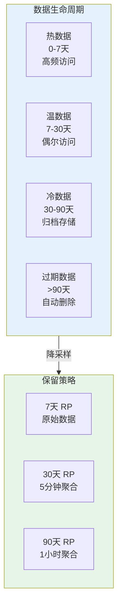
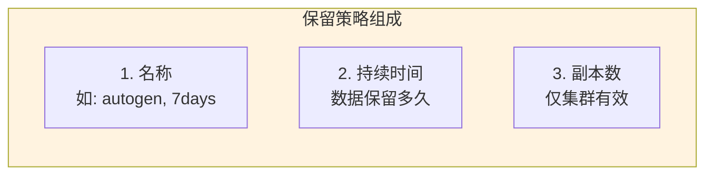
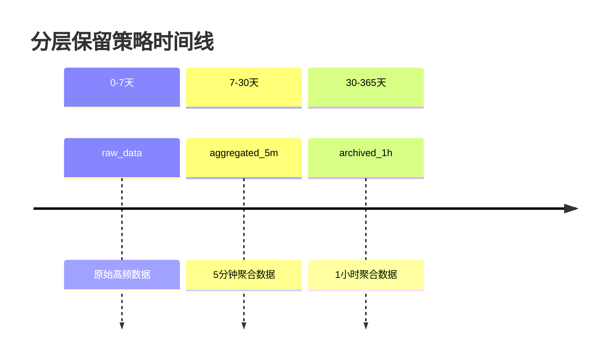
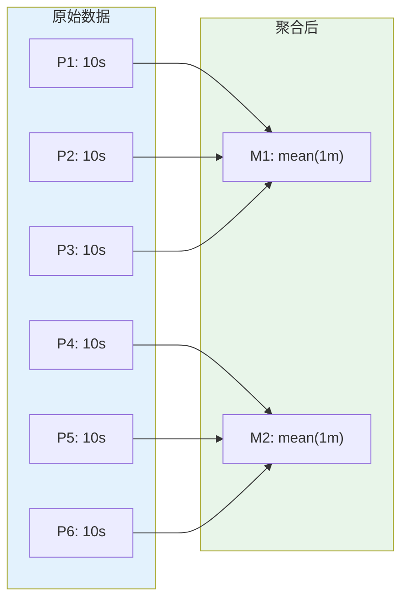
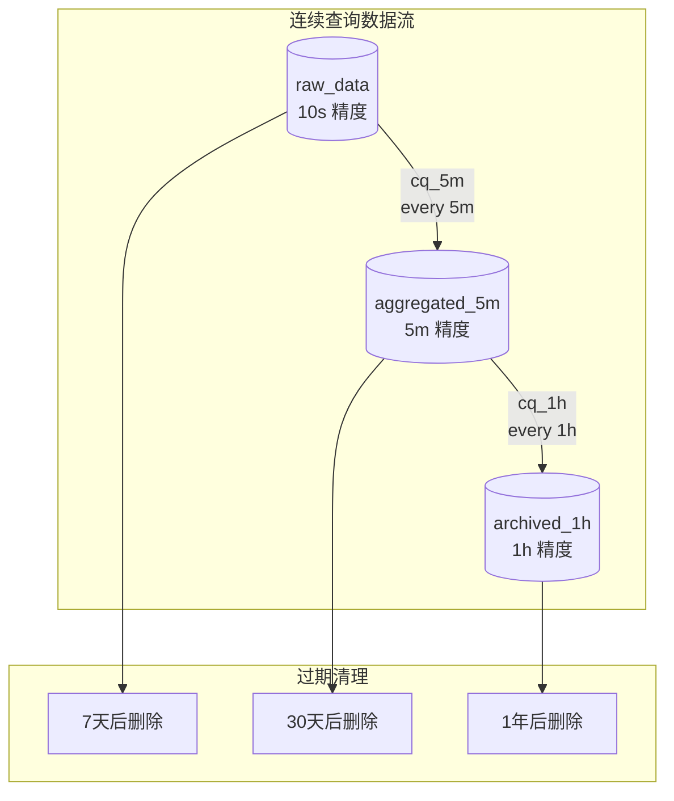
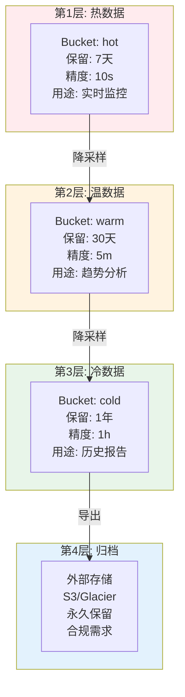
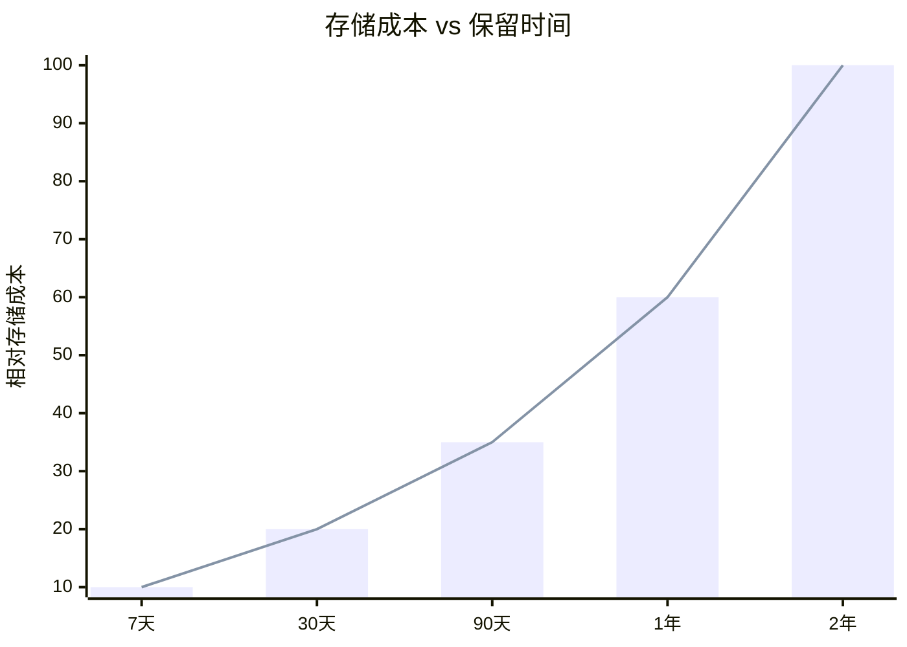
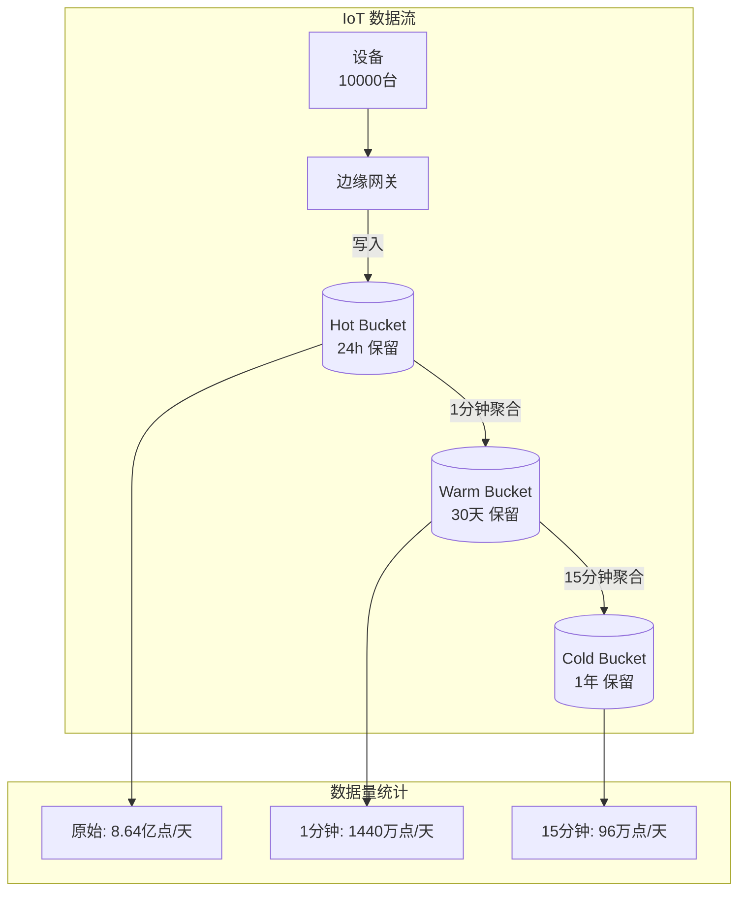
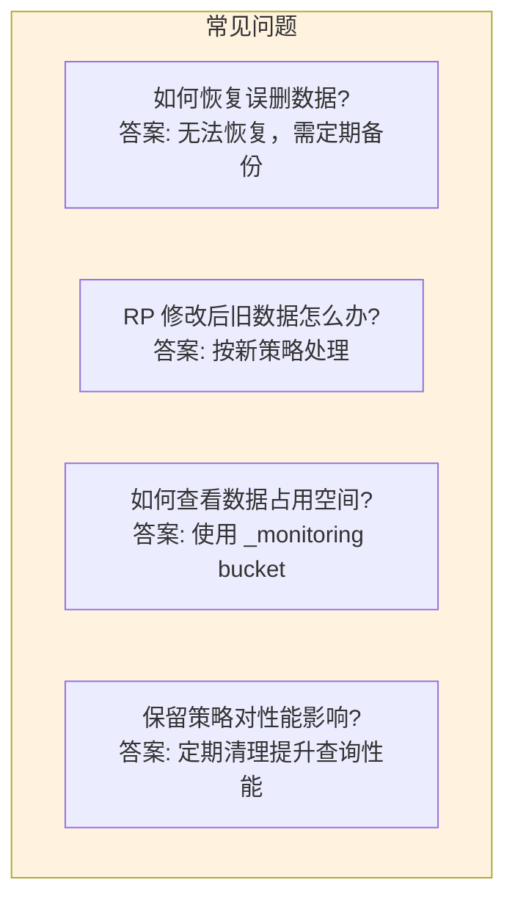

# InfluxDB 保留策略详解

## 保留策略概述

**保留策略（Retention Policy, RP）** 是 InfluxDB 的核心功能，用于自动管理数据的生命周期，控制数据的存储时间和副本数。



## 核心概念

### 保留策略三要素



| 属性 | 说明 | 示例 |
|------|------|------|
| **Name** | 策略名称 | `autogen`, `one_week`, `raw_data` |
| **Duration** | 数据保留时长 | `7d`, `30d`, `INF`（永不过期）|
| **Replication** | 副本因子 | `1`（单节点），集群中可 > 1 |
| **Default** | 是否为默认策略 | 一个 DB 只有一个默认 RP |

## InfluxDB 1.x 保留策略

### 管理命令

```sql
-- 查看保留策略
SHOW RETENTION POLICIES ON mydb

-- 创建保留策略
CREATE RETENTION POLICY one_week ON mydb 
    DURATION 7d 
    REPLICATION 1 
    DEFAULT

CREATE RETENTION POLICY thirty_days ON mydb 
    DURATION 30d 
    REPLICATION 1

CREATE RETENTION POLICY one_year ON mydb 
    DURATION 365d 
    REPLICATION 1

-- 修改保留策略
ALTER RETENTION POLICY one_week ON mydb DURATION 14d

-- 删除保留策略
DROP RETENTION POLICY thirty_days ON mydb
```

### 策略配置示例

```sql
-- 完整示例：监控数据分层存储

-- 1. 创建数据库
CREATE DATABASE monitoring

-- 2. 创建原始数据保留策略（7天）
CREATE RETENTION POLICY raw_data ON monitoring 
    DURATION 7d 
    REPLICATION 1 
    DEFAULT

-- 3. 创建聚合数据保留策略（30天）
CREATE RETENTION POLICY aggregated_5m ON monitoring 
    DURATION 30d 
    REPLICATION 1

-- 4. 创建长期归档策略（1年）
CREATE RETENTION POLICY archived_1h ON monitoring 
    DURATION 365d 
    REPLICATION 1

-- 查看结果
SHOW RETENTION POLICIES ON monitoring

-- 输出：
-- name              duration  shardGroupDuration  replicaN  default
-- ----              --------  ------------------  --------  -------
-- autogen           0s        168h0m0s            1         false
-- raw_data          168h0m0s  24h0m0s             1         true
-- aggregated_5m     720h0m0s  24h0m0s             1         false
-- archived_1h       8760h0m0s 168h0m0s            1         false
```



## InfluxDB 2.x 保留策略

### Bucket 级别的保留

在 InfluxDB 2.x 中，保留策略被简化为 **Bucket** 级别的配置：

```bash
# 创建带保留策略的 Bucket
influx bucket create \
    --name my-bucket \
    --retention 7d \
    --org my-org

# 创建永不过期的 Bucket
influx bucket create \
    --name infinite-bucket \
    --retention 0 \
    --org my-org

# 修改 Bucket 保留策略
influx bucket update \
    --id BUCKET_ID \
    --retention 30d \
    --org my-org

# 删除 Bucket
influx bucket delete \
    --id BUCKET_ID \
    --org my-org
```

### API 管理

```python
# Python 管理 Bucket 保留策略
from influxdb_client import InfluxDBClient, BucketRetentionRules

client = InfluxDBClient(
    url="http://localhost:8086",
    token="your-token",
    org="my-org"
)

buckets_api = client.buckets_api()

# 创建 7天保留策略的 Bucket
bucket = buckets_api.create_bucket(
    bucket_name="monitoring-7d",
    retention_rules=BucketRetentionRules(
        every_seconds=7 * 24 * 60 * 60  # 7天
    ),
    org="my-org"
)

# 修改保留策略
from influxdb_client.domain.bucket import Bucket
from influxdb_client.domain.retention_rule import RetentionRule

bucket = buckets_api.find_bucket_by_name("monitoring-7d")
bucket.retention_rules = [
    RetentionRule(every_seconds=30 * 24 * 60 * 60)  # 改为30天
]
buckets_api.update_bucket(bucket)

# 列出所有 Buckets
buckets = buckets_api.find_buckets()
for b in buckets.buckets:
    print(f"{b.name}: {b.retention_rules[0].every_seconds / 86400} days")
```

## 降采样（Downsampling）

### 什么是降采样

降采样是将高频数据聚合成低频数据的过程，减少存储空间的同时保留数据趋势。



**降采样的好处：**

| 指标 | 降采样前 | 降采样后 | 改善 |
|------|----------|----------|------|
| 数据点数量 | 8,640/天 | 288/天 (5m) | 96.7%↓ |
| 存储空间 | 100% | ~10% | 90%↓ |
| 查询速度 | 慢 | 快 | 10x+ |
| 数据精度 | 高 | 趋势保留 | 适合分析 |

### 使用连续查询（CQ）实现降采样

InfluxDB 1.x 中的连续查询：

```sql
-- 创建连续查询：每5分钟聚合一次，保存到另一个 RP
CREATE CONTINUOUS QUERY cq_5m ON monitoring
BEGIN
    SELECT mean(usage_user) AS usage_user,
           mean(usage_system) AS usage_system,
           max(usage_user) AS max_usage_user
    INTO monitoring.aggregated_5m.cpu
    FROM monitoring.raw_data.cpu
    GROUP BY time(5m), host, region
END

-- 创建每小时聚合的 CQ
CREATE CONTINUOUS QUERY cq_1h ON monitoring
BEGIN
    SELECT mean(usage_user) AS usage_user,
           mean(usage_system) AS usage_system
    INTO monitoring.archived_1h.cpu
    FROM monitoring.aggregated_5m.cpu
    GROUP BY time(1h), host, region
END

-- 查看连续查询
SHOW CONTINUOUS QUERIES

-- 删除连续查询
DROP CONTINUOUS QUERY cq_5m ON monitoring
```



### InfluxDB 2.x 使用 Task 实现降采样

```flux
// Task 定义：每5分钟执行降采样
option task = {
    name: "downsample-5m",
    every: 5m,
}

from(bucket: "raw-data")
    |> range(start: -task.every)
    |> filter(fn: (r) => r._measurement == "cpu")
    |> aggregateWindow(every: task.every, fn: mean)
    |> set(key: "_field", value: "usage_user_avg")
    |> to(bucket: "aggregated-5m")
```

```bash
# 创建降采样 Task
influx task create \
    --org my-org \
    --file downsample-5m.flux

# 列出所有 Tasks
influx task list --org my-org

# 查看 Task 执行历史
influx task log --task-id TASK_ID

# 删除 Task
influx task delete --id TASK_ID
```

### Python 创建 Task

```python
from influxdb_client import InfluxDBClient
from influxdb_client.domain.task import Task

client = InfluxDBClient(
    url="http://localhost:8086",
    token="your-token",
    org="my-org"
)

tasks_api = client.tasks_api()

# Task Flux 脚本
flux_script = '''
option task = {
    name: "downsample-cpu-5m",
    every: 5m,
}

from(bucket: "monitoring")
    |> range(start: -task.every)
    |> filter(fn: (r) => r._measurement == "cpu")
    |> filter(fn: (r) => r._field == "usage_user" or r._field == "usage_system")
    |> aggregateWindow(every: task.every, fn: mean)
    |> to(bucket: "monitoring-5m")
'''

# 创建 Task
task = Task(
    org_id="your-org-id",
    name="downsample-cpu-5m",
    flux=flux_script,
    every="5m"
)

created_task = tasks_api.create_task(task)
print(f"Task created: {created_task.id}")
```

## 存储优化策略

### 分层存储架构



### 成本对比



| 策略 | 存储量 | 成本/月 | 适用场景 |
|------|--------|---------|----------|
| 仅7天原始 | 100GB | $50 | 开发测试 |
| 7天原始 + 30天聚合 | 30GB | $20 | 生产监控 |
| 分层存储 | 50GB | $30 | 企业应用 |
| 全部永久 | 2TB+ | $500+ | 合规要求 |

## 实战配置

### 场景：微服务监控

```bash
#!/bin/bash
# setup-monitoring.sh

ORG="my-company"

# 1. 创建热数据 Bucket (实时监控)
influx bucket create \
    --name "hot-metrics" \
    --retention 7d \
    --org $ORG

# 2. 创建温数据 Bucket (趋势分析)
influx bucket create \
    --name "warm-metrics" \
    --retention 30d \
    --org $ORG

# 3. 创建冷数据 Bucket (长期存档)
influx bucket create \
    --name "cold-metrics" \
    --retention 365d \
    --org $ORG

echo "Buckets created!"
```

```flux
// hot-to-warm.flux - 降采样 Task
option task = {
    name: "hot-to-warm-downsample",
    every: 5m,
}

from(bucket: "hot-metrics")
    |> range(start: -10m)
    |> filter(fn: (r) => r._measurement =~ /^cpu|memory|disk$/)
    |> aggregateWindow(
        every: 5m,
        fn: mean,
        createEmpty: false
    )
    |> to(bucket: "warm-metrics")
```

```flux
// warm-to-cold.flux - 二次降采样
option task = {
    name: "warm-to-cold-downsample",
    every: 1h,
}

from(bucket: "warm-metrics")
    |> range(start: -2h)
    |> filter(fn: (r) => r._measurement =~ /^cpu|memory|disk$/)
    |> aggregateWindow(
        every: 1h,
        fn: mean,
        createEmpty: false
    )
    |> to(bucket: "cold-metrics")
```

### 场景：IoT 数据管理



```flux
// iot-downsample.flux
option task = {
    name: "iot-1m-rollup",
    every: 1m,
}

from(bucket: "iot-raw")
    |> range(start: -2m)
    |> filter(fn: (r) => r._measurement == "sensor_data")
    |> pivot(
        rowKey:["_time", "device_id"],
        columnKey: ["_field"],
        valueColumn: "_value"
    )
    |> group(columns: ["device_id"])
    |> aggregateWindow(
        every: 1m,
        fn: {
            temperature: mean,
            humidity: mean,
            pressure: mean
        }
    )
    |> to(bucket: "iot-1m")
```

## 监控与告警

### 存储使用监控

```flux
// 监控 Bucket 存储使用量
import "influxdata/influxdb/monitor"

from(bucket: "_monitoring")
    |> range(start: -1h)
    |> filter(fn: (r) => r._measurement == "storage_bucket_measurement_num")
    |> group(columns: ["bucket"])
    |> aggregateWindow(every: 5m, fn: last)
    |> monitor.check(
        crit: (r) => r._value > 100000000,  // 1亿点告警
        messageFn: (r) => "Bucket ${r.bucket} has ${r._value} points"
    )
```

### 过期预警

```python
# 检查即将过期的数据
from influxdb_client import InfluxDBClient
from datetime import datetime, timedelta

client = InfluxDBClient(
    url="http://localhost:8086",
    token="your-token"
)

query_api = client.query_api()

# 查询各 Bucket 的最早数据时间
query = '''
from(bucket: "{bucket}")
    |> range(start: -1y)
    |> first()
    |> keep(columns: ["_time"])
'''

buckets = ["hot-metrics", "warm-metrics", "cold-metrics"]
retention_days = [7, 30, 365]

for bucket, retention in zip(buckets, retention_days):
    try:
        tables = query_api.query(query.format(bucket=bucket))
        for table in tables:
            for record in table.records:
                oldest = record.get_time()
                expires = oldest + timedelta(days=retention)
                days_until_expiry = (expires - datetime.now()).days
                
                if days_until_expiry < 7:
                    print(f"⚠️ {bucket}: 数据将在 {days_until_expiry} 天后开始过期")
                else:
                    print(f"✅ {bucket}: 数据安全，还有 {days_until_expiry} 天")
    except Exception as e:
        print(f"❌ {bucket}: 查询失败 - {e}")
```

## 常见问题



### 问题 1：数据保留但想延长

```bash
# 方案：导出后再导入到新 Bucket
# 1. 导出即将过期的数据
influx query 'from(bucket: "old-bucket") |> range(start: -7d)' --raw > backup.json

# 2. 创建新 Bucket（更长保留）
influx bucket create --name "extended-bucket" --retention 90d

# 3. 重新导入（需要转换格式）
# 使用 Python/脚本处理 Line Protocol 重新写入
```

### 问题 2：误删数据恢复

```bash
# 方案：从备份恢复
# 1. 停止 InfluxDB
systemctl stop influxdb

# 2. 从备份恢复数据文件
cp -r /backup/engine /var/lib/influxdb2/

# 3. 重启
systemctl start influxdb

# ⚠️ 注意：定期备份是关键！
```

---

掌握保留策略后，下一篇将介绍认证与授权机制。
