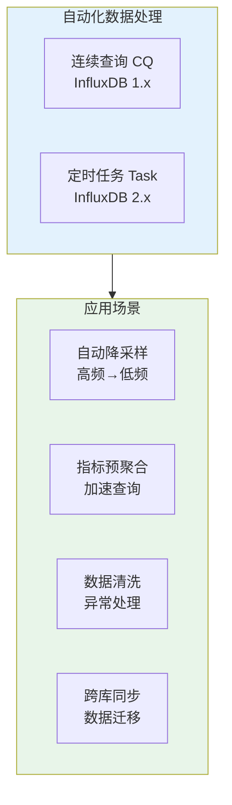
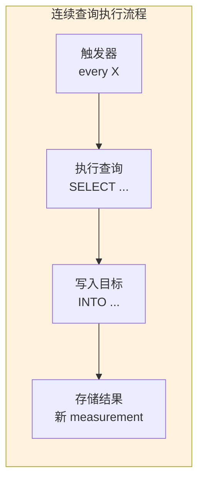
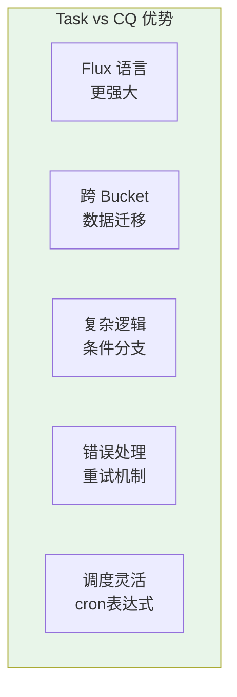
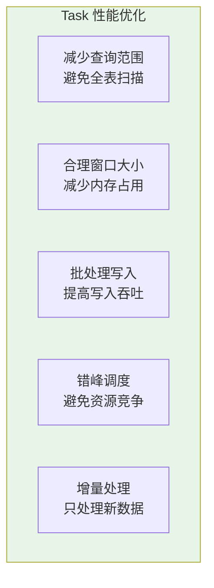

# InfluxDB 连续查询与任务调度

## 概述

**连续查询（Continuous Queries, CQ）** 和 **任务（Tasks）** 是 InfluxDB 中实现数据自动处理的核心机制，用于定时执行数据聚合、转换和迁移。



## InfluxDB 1.x 连续查询

### 基本概念



### 创建连续查询

```sql
-- 基本语法
CREATE CONTINUOUS QUERY cq_name ON database_name
BEGIN
    SELECT function(s)
    INTO new_measurement
    FROM original_measurement
    [WHERE conditions]
    GROUP BY time(interval)[, tag1, tag2, ...]
END

-- 示例 1：基础降采样
CREATE CONTINUOUS QUERY cq_5m ON monitoring
BEGIN
    SELECT mean(usage_user) AS usage_user
    INTO monitoring."7days".cpu_5m
    FROM monitoring."1day".cpu
    GROUP BY time(5m), host, region
END

-- 示例 2：多字段聚合
CREATE CONTINUOUS QUERY cq_cpu_1h ON monitoring
BEGIN
    SELECT 
        mean(usage_user) AS avg_user,
        max(usage_user) AS max_user,
        min(usage_user) AS min_user,
        sum(usage_system) AS total_system
    INTO monitoring."30days".cpu_1h
    FROM monitoring."7days".cpu
    GROUP BY time(1h), host
END

-- 示例 3：跨 measurement 聚合
CREATE CONTINUOUS QUERY cq_server_stats ON monitoring
BEGIN
    SELECT mean(usage_user) AS cpu_avg,
           mean(used_percent) AS mem_avg
    INTO monitoring."30days".server_summary
    FROM (
        SELECT usage_user FROM cpu
        UNION ALL
        SELECT used_percent FROM memory
    )
    GROUP BY time(5m), host
END
```

### 高级 CQ 配置

```sql
-- 1. RESAMPLE 配置 - 处理延迟数据
CREATE CONTINUOUS QUERY cq_resample ON monitoring
RESAMPLE EVERY 5m FOR 15m  -- 每5分钟执行，处理15分钟窗口
BEGIN
    SELECT mean(usage_user)
    INTO monitoring."7days".cpu_resampled
    FROM monitoring."1day".cpu
    GROUP BY time(5m), host
END

-- 2. 只填充空值（不重新计算已有数据）
CREATE CONTINUOUS QUERY cq_fill_only ON monitoring
BEGIN
    SELECT mean(usage_user)
    INTO monitoring."7days".cpu_filled
    FROM monitoring."1day".cpu
    GROUP BY time(5m), host
    fill(previous)
END

-- 3. 条件过滤的 CQ
CREATE CONTINUOUS QUERY cq_errors_only ON monitoring
BEGIN
    SELECT count(status) AS error_count
    INTO monitoring."30days".error_summary
    FROM monitoring."7days".http_logs
    WHERE status >= 500
    GROUP BY time(1h), service
END
```

```mermaid
gantt
    title RESAMPLE EVERY 5m FOR 15m 执行示意
    dateFormat HH:mm:ss
    axisFormat %H:%M
    
    section 时间窗口
    执行1 (10:00) :10:00:00, 10:05:00
    执行2 (10:05) :10:05:00, 10:10:00
    执行3 (10:10) :10:10:00, 10:15:00
    
    section 数据范围
    查询范围 (15m) :09:55:00, 10:10:00
```

### 管理连续查询

```sql
-- 查看所有 CQ
SHOW CONTINUOUS QUERIES

-- 删除 CQ
DROP CONTINUOUS QUERY cq_5m ON monitoring

-- 修改 CQ（先删除再重建）
DROP CONTINUOUS QUERY cq_cpu_1h ON monitoring

CREATE CONTINUOUS QUERY cq_cpu_1h ON monitoring
BEGIN
    SELECT mean(usage_user)
    INTO monitoring."30days".cpu_hourly
    FROM monitoring."7days".cpu
    GROUP BY time(1h), host
END
```

## InfluxDB 2.x 任务（Tasks）

### Task 优势



### 基础 Task 语法

```flux
// 基本结构
option task = {
    name: "task-name",           // 任务名称
    every: 1h,                   // 执行间隔
    offset: 5m                   // 延迟偏移（可选）
}

// 数据处理逻辑
from(bucket: "source-bucket")
    |> range(start: -task.every)
    |> filter(fn: (r) => r._measurement == "cpu")
    |> aggregateWindow(every: task.every, fn: mean)
    |> to(bucket: "target-bucket")
```

### 创建 Task

```bash
# 1. 从 Flux 文件创建
influx task create --file downsample.flux

# 2. 直接创建
cat << 'EOF' | influx task create -
option task = {name: "hourly-downsample", every: 1h}

from(bucket: "raw-data")
    |> range(start: -1h)
    |> filter(fn: (r) => r._measurement == "metrics")
    |> aggregateWindow(every: 1h, fn: mean)
    |> to(bucket: "hourly-data")
EOF

# 3. 使用 cron 表达式
influx task create --file nightly-report.flux
```

```flux
// nightly-report.flux - 每天凌晨2点执行
option task = {
    name: "nightly-report",
    cron: "0 2 * * *"  // cron 表达式
}

from(bucket: "monitoring")
    |> range(start: -1d)
    |> filter(fn: (r) => r._measurement == "sales")
    |> aggregateWindow(every: 1h, fn: sum)
    |> to(bucket: "daily-reports")
```

### Python 管理 Tasks

```python
from influxdb_client import InfluxDBClient
from influxdb_client.domain.task import Task
from influxdb_client.domain.task_status_type import TaskStatusType

client = InfluxDBClient(
    url="http://localhost:8086",
    token="your-token",
    org="my-org"
)

tasks_api = client.tasks_api()

# 创建降采样 Task
def create_downsample_task(
    name: str,
    source_bucket: str,
    target_bucket: str,
    measurement: str,
    interval: str = "5m",
    fn: str = "mean"
):
    flux_script = f'''
option task = {{
    name: "{name}",
    every: {interval}
}}

from(bucket: "{source_bucket}")
    |> range(start: -{interval})
    |> filter(fn: (r) => r._measurement == "{measurement}")
    |> aggregateWindow(every: {interval}, fn: {fn})
    |> to(bucket: "{target_bucket}")
'''
    
    task = Task(
        org_id="your-org-id",
        name=name,
        flux=flux_script,
        status=TaskStatusType.ACTIVE
    )
    
    created = tasks_api.create_task(task)
    print(f"Created task: {created.name} (ID: {created.id})")
    return created.id

# 创建多层降采样任务
def create_tiered_tasks():
    # Level 1: 1分钟 → 5分钟
    create_downsample_task(
        name="downsample-5m",
        source_bucket="raw-1m",
        target_bucket="aggregated-5m",
        measurement="metrics",
        interval="5m"
    )
    
    # Level 2: 5分钟 → 1小时
    create_downsample_task(
        name="downsample-1h",
        source_bucket="aggregated-5m",
        target_bucket="aggregated-1h",
        measurement="metrics",
        interval="1h"
    )
    
    # Level 3: 1小时 → 1天
    create_downsample_task(
        name="downsample-1d",
        source_bucket="aggregated-1h",
        target_bucket="archived-1d",
        measurement="metrics",
        interval="1d"
    )

# 列出所有 Tasks
def list_tasks():
    tasks = tasks_api.find_tasks()
    print("\n📋 Active Tasks:")
    for task in tasks.tasks:
        status = "🟢" if task.status == "active" else "🔴"
        print(f"{status} {task.name} ({task.every or task.cron})")

# 查看 Task 执行历史
def get_task_logs(task_id: str):
    logs = tasks_api.get_logs(task_id)
    print(f"\n📜 Task {task_id} Logs:")
    for log in logs.events:
        print(f"[{log.time}] {log.message}")

# 更新 Task
def update_task(task_id: str, new_interval: str):
    task = tasks_api.find_task_by_id(task_id)
    
    # 更新 Flux 脚本中的 interval
    old_flux = task.flux
    new_flux = old_flux.replace(
        f'every: {task.every}',
        f'every: {new_interval}'
    )
    
    task.every = new_interval
    task.flux = new_flux
    
    updated = tasks_api.update_task(task)
    print(f"Updated task: {updated.name}")

# 删除 Task
def delete_task(task_id: str):
    tasks_api.delete_task(task_id)
    print(f"Deleted task: {task_id}")

# 暂停/恢复 Task
def toggle_task(task_id: str, active: bool):
    task = tasks_api.find_task_by_id(task_id)
    task.status = TaskStatusType.ACTIVE if active else TaskStatusType.INACTIVE
    tasks_api.update_task(task)
    status = "resumed" if active else "paused"
    print(f"Task {task_id} {status}")
```

## 高级 Task 场景

### 1. 数据清洗任务

```flux
// data-cleansing.flux
option task = {
    name: "data-cleansing",
    every: 5m
}

from(bucket: "raw-sensors")
    |> range(start: -10m)
    |> filter(fn: (r) => r._measurement == "temperature")
    // 过滤异常值
    |> filter(fn: (r) => r._value > -50.0 and r._value < 100.0)
    // 填充缺失值
    |> fill(column: "_value", usePrevious: true)
    // 平滑处理（移动平均）
    |> movingAverage(n: 3)
    |> to(bucket: "clean-sensors")
```

### 2. 异常检测任务

```flux
// anomaly-detection.flux
option task = {
    name: "anomaly-detection",
    every: 1m
}

import "math"
import "influxdata/influxdb/monitor"

// 计算统计阈值
data = from(bucket: "metrics")
    |> range(start: -1h)
    |> filter(fn: (r) => r._measurement == "cpu")
    |> filter(fn: (r) => r._field == "usage_user")

stats = data
    |> reduce(
        identity: {sum: 0.0, count: 0, sumsq: 0.0},
        fn: (r, accumulator) => ({
            sum: accumulator.sum + r._value,
            count: accumulator.count + 1,
            sumsq: accumulator.sumsq + r._value * r._value
        })
    )
    |> map(fn: (r) => ({
        mean: r.sum / r.count,
        stddev: math.sqrt(r.sumsq / r.count - (r.sum / r.count) * (r.sum / r.count))
    }))

// 检测最新值是否异常
from(bucket: "metrics")
    |> range(start: -2m)
    |> filter(fn: (r) => r._measurement == "cpu")
    |> last()
    |> join(tables: {data: data, stats: stats}, on: ["host"])
    |> map(fn: (r) => ({
        r with
        z_score: (r._value_data - r.mean) / r.stddev,
        is_anomaly: if math.abs((r._value_data - r.mean) / r.stddev) > 3.0 
                    then true 
                    else false
    }))
    |> filter(fn: (r) => r.is_anomaly)
    |> to(bucket: "alerts")
```

### 3. 多数据源合并

```flux
// multi-source-merge.flux
option task = {
    name: "multi-source-merge",
    every: 5m
}

// 数据源 1: Prometheus
prometheus = from(bucket: "prometheus-bucket")
    |> range(start: -10m)
    |> filter(fn: (r) => r._measurement == "container_cpu")
    |> set(key: "source", value: "prometheus")

// 数据源 2: Telegraf
telegraf = from(bucket: "telegraf-bucket")
    |> range(start: -10m)
    |> filter(fn: (r) => r._measurement == "cpu")
    |> set(key: "source", value: "telegraf")

// 数据源 3: 应用埋点
application = from(bucket: "app-bucket")
    |> range(start: -10m)
    |> filter(fn: (r) => r._measurement == "custom_metrics")
    |> set(key: "source", value: "application")

// 合并所有数据源
union(tables: [prometheus, telegraf, application])
    |> group(columns: ["source", "host"])
    |> aggregateWindow(every: 5m, fn: mean)
    |> to(bucket: "unified-metrics")
```

### 4. 跨组织数据同步

```flux
// cross-org-sync.flux
option task = {
    name: "cross-org-sync",
    every: 15m
}

// 从生产组织读取（需要相应权限）
production_data = from(bucket: "production/metrics")
    |> range(start: -30m)
    |> filter(fn: (r) => r._measurement == "critical_metrics")

// 写入到分析组织
production_data
    |> set(key: "data_classification", value: "sensitive")
    |> to(bucket: "analytics/anonymized", org: "analytics-org")
```

## 任务监控与告警

### Task 执行监控

```python
# task-monitor.py
from influxdb_client import InfluxDBClient
import json
from datetime import datetime, timedelta

class TaskMonitor:
    def __init__(self, url, token, org):
        self.client = InfluxDBClient(url=url, token=token, org=org)
        self.tasks_api = self.client.tasks_api()
    
    def check_task_health(self):
        """检查所有 Task 健康状态"""
        tasks = self.tasks_api.find_tasks()
        health_report = []
        
        for task in tasks.tasks:
            # 获取最近执行记录
            try:
                runs = self.tasks_api.get_runs(task.id, limit=5)
                last_run = runs.runs[0] if runs.runs else None
                
                status = {
                    'task_name': task.name,
                    'task_id': task.id,
                    'status': task.status,
                    'last_run_status': last_run.status if last_run else 'unknown',
                    'last_run_time': last_run.scheduled_for if last_run else None,
                    'every': task.every,
                    'cron': task.cron
                }
                
                # 检查是否延迟执行
                if last_run:
                    scheduled = datetime.fromisoformat(last_run.scheduled_for.replace('Z', '+00:00'))
                    if last_run.finished_at:
                        finished = datetime.fromisoformat(last_run.finished_at.replace('Z', '+00:00'))
                        status['duration_sec'] = (finished - scheduled).total_seconds()
                
                health_report.append(status)
                
                # 告警条件
                if status['last_run_status'] == 'failed':
                    self.send_alert(f"Task {task.name} failed!")
                elif status.get('duration_sec', 0) > 300:
                    self.send_alert(f"Task {task.name} is slow ({status['duration_sec']}s)")
                    
            except Exception as e:
                print(f"Error checking task {task.name}: {e}")
        
        return health_report
    
    def send_alert(self, message):
        """发送告警（示例）"""
        print(f"🚨 ALERT: {message}")
        # 集成邮件/短信/钉钉等
    
    def generate_report(self):
        """生成 Task 执行报告"""
        report = self.check_task_health()
        
        print("\n" + "="*60)
        print("Task Health Report")
        print("="*60)
        
        for task in report:
            status_icon = "🟢" if task['last_run_status'] == 'success' else "🔴"
            print(f"{status_icon} {task['task_name']}")
            print(f"   Status: {task['status']}")
            print(f"   Schedule: {task.get('every') or task.get('cron')}")
            print(f"   Last Run: {task['last_run_status']} at {task['last_run_time']}")
            if 'duration_sec' in task:
                print(f"   Duration: {task['duration_sec']:.2f}s")
            print()
        
        return report

# 使用示例
monitor = TaskMonitor(
    url="http://localhost:8086",
    token="your-token",
    org="my-org"
)

monitor.generate_report()
```

### Task 失败重试策略

```flux
// retry-aware-task.flux
option task = {
    name: "reliable-downsample",
    every: 5m,
    retry: 3  // 失败重试3次
}

import "influxdata/influxdb/secrets"

// 获取上次成功执行时间
last_success = from(bucket: "_tasks")
    |> range(start: -1h)
    |> filter(fn: (r) => r._measurement == "runs")
    |> filter(fn: (r) => r.taskID == "${task.id}")
    |> filter(fn: (r) => r.status == "success")
    |> last()
    |> findRecord(fn: (key) => true, idx: 0)

// 使用上次成功时间作为起点
start_time = if exists last_success._time 
    then last_success._time 
    else -10m

from(bucket: "raw-data")
    |> range(start: time(v: start_time))
    |> filter(fn: (r) => r._measurement == "metrics")
    |> aggregateWindow(every: 5m, fn: mean)
    |> to(bucket: "downsampled")
```

## 性能优化

### Task 执行优化



```flux
// 优化前：全范围查询
from(bucket: "metrics")
    |> range(start: -7d)  // 范围太大！
    |> filter(fn: (r) => r._measurement == "cpu")
    |> aggregateWindow(every: 1h, fn: mean)

// 优化后：只查新数据
from(bucket: "metrics")
    |> range(start: -1h)  // 只处理最近数据
    |> filter(fn: (r) => r._measurement == "cpu")
    |> aggregateWindow(every: 1h, fn: mean)
```

### 调度策略

```bash
# 错峰调度示例
# Task 1: 每小时第 0 分钟
# Task 2: 每小时第 15 分钟
# Task 3: 每小时第 30 分钟
# Task 4: 每小时第 45 分钟

influx task create --file task-00.flux  # cron: "0 * * * *"
influx task create --file task-15.flux  # cron: "15 * * * *"
influx task create --file task-30.flux  # cron: "30 * * * *"
influx task create --file task-45.flux  # cron: "45 * * * *"
```

---

掌握连续查询和任务调度后，下一篇将介绍备份与恢复策略。
