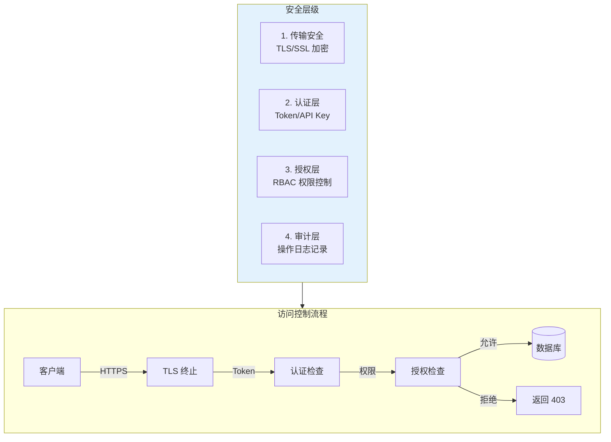
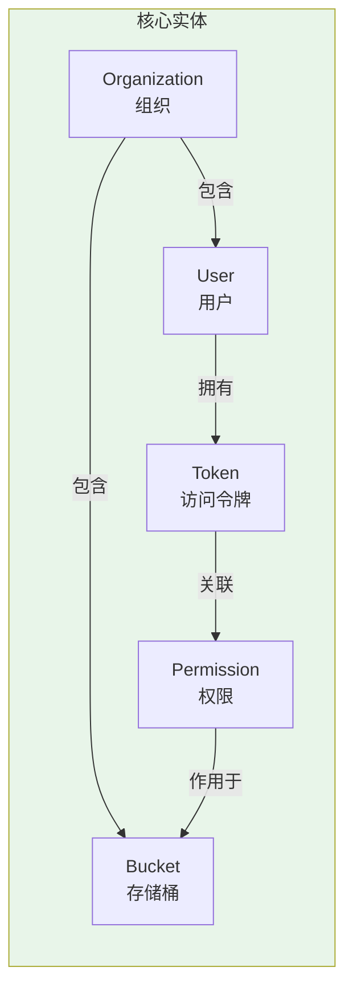
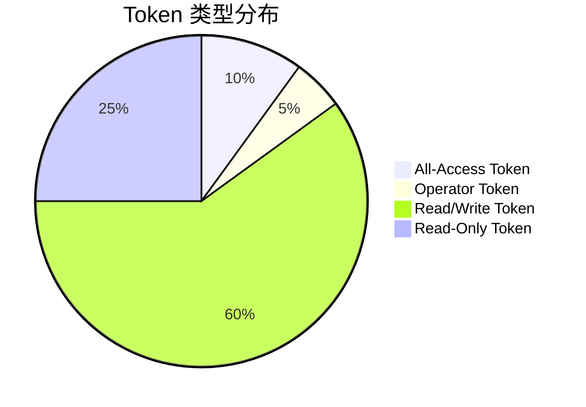
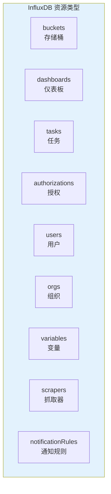
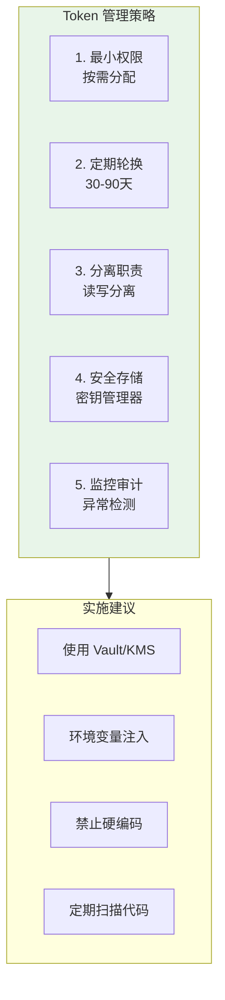
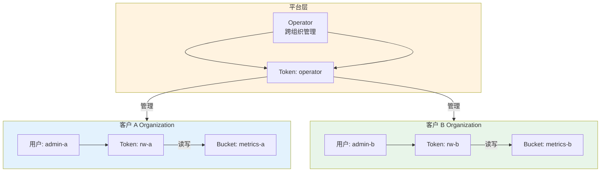

# InfluxDB 认证与授权指南

## 安全架构概览



## InfluxDB 2.x 安全模型

### 核心概念



| 实体 | 说明 | 作用 |
|------|------|------|
| **Organization** | 组织 | 资源隔离的顶层边界 |
| **User** | 用户 | 可以拥有多个 Token |
| **Token** | 访问令牌 | API 认证凭证 |
| **Bucket** | 存储桶 | 数据的实际存储 |
| **Permission** | 权限 | 定义对资源的操作权限 |

### Token 类型



| Token 类型 | 权限 | 适用场景 |
|------------|------|----------|
| **Operator Token** | 全权限 | 系统管理 |
| **All-Access Token** | 组织内全权限 | 管理员操作 |
| **Read/Write Token** | 读写特定 Bucket | 应用写入 |
| **Read-Only Token** | 只读特定 Bucket | 报表查询 |
| **Custom Token** | 自定义权限 | 特殊需求 |

## Token 管理

### CLI 管理 Token

```bash
# 列出所有 Token
influx auth list

# 创建 All-Access Token
influx auth create \
    --user admin \
    --all-access \
    --description "Admin Token"

# 创建只读 Token
influx auth create \
    --user app-reader \
    --read-buckets \
    --description "Read-only for dashboards"

# 创建读写特定 Bucket 的 Token
influx auth create \
    --user app-writer \
    --read-bucket BUCKET_ID \
    --write-bucket BUCKET_ID \
    --description "App write token"

# 创建带自定义权限的 Token
influx auth create \
    --user limited-user \
    --read-bucket MONITORING_BUCKET_ID \
    --write-bucket LOGS_BUCKET_ID \
    --read-dashboards \
    --description "Limited access token"

# 删除 Token
influx auth delete --id AUTH_ID

# 查看 Token 详情
influx auth describe --id AUTH_ID
```

### Python 管理 Token

```python
from influxdb_client import InfluxDBClient
from influxdb_client.domain.authorization import Authorization
from influxdb_client.domain.permission import Permission, PermissionResource

client = InfluxDBClient(
    url="http://localhost:8086",
    token="operator-token",
    org="my-org"
)

authorizations_api = client.authorizations_api()

# 创建读写权限
def create_rw_token(bucket_name, description):
    # 获取 Bucket ID
    buckets_api = client.buckets_api()
    bucket = buckets_api.find_bucket_by_name(bucket_name)
    
    # 构建权限
    read_resource = PermissionResource(
        type="buckets",
        id=bucket.id,
        org_id=client.org
    )
    write_resource = PermissionResource(
        type="buckets", 
        id=bucket.id,
        org_id=client.org
    )
    
    permissions = [
        Permission(action="read", resource=read_resource),
        Permission(action="write", resource=write_resource)
    ]
    
    # 创建 Token
    auth = Authorization(
        org_id=client.org,
        permissions=permissions,
        description=description
    )
    
    created = authorizations_api.create_authorization(auth)
    print(f"Token created: {created.token}")
    return created.token

# 创建只读 Token
def create_ro_token(bucket_name, description):
    buckets_api = client.buckets_api()
    bucket = buckets_api.find_bucket_by_name(bucket_name)
    
    read_resource = PermissionResource(
        type="buckets",
        id=bucket.id,
        org_id=client.org
    )
    
    permissions = [Permission(action="read", resource=read_resource)]
    
    auth = Authorization(
        org_id=client.org,
        permissions=permissions,
        description=description
    )
    
    created = authorizations_api.create_authorization(auth)
    print(f"Read-only token: {created.token}")
    return created.token

# 使用示例
rw_token = create_rw_token("monitoring", "App write access")
ro_token = create_ro_token("monitoring", "Grafana read access")

# 列出所有 Token
auths = authorizations_api.find_authorizations()
for auth in auths.authorizations:
    print(f"{auth.description}: {auth.status} (ID: {auth.id})")
```

## 权限模型

### 资源类型



### 权限操作

| 资源 | read | write | create | delete |
|------|------|-------|--------|--------|
| buckets | ✅ 读取数据 | ✅ 写入数据 | ✅ 创建 Bucket | ✅ 删除 Bucket |
| dashboards | ✅ 查看 | - | ✅ 创建 | ✅ 删除 |
| tasks | ✅ 查看 | ✅ 修改 | ✅ 创建 | ✅ 删除 |
| authorizations | ✅ 查看 | - | ✅ 创建 Token | ✅ 删除 Token |

### 权限配置示例

```bash
# 1. 创建应用写入权限（仅写入特定 bucket）
influx auth create \
    --user app-service \
    --write-bucket MONITORING_BUCKET \
    --description "App service - write only"

# 2. 创建报表读取权限（只读 + 查看 Dashboard）
influx auth create \
    --user report-reader \
    --read-bucket MONITORING_BUCKET \
    --read-dashboards \
    --description "Report service - read only"

# 3. 创建运维管理权限（除用户管理外）
influx auth create \
    --user ops-team \
    --read-buckets --write-buckets \
    --read-tasks --write-tasks \
    --read-dashboards --write-dashboards \
    --read-notificationRules --write-notificationRules \
    --description "Ops team - full resource access"
```

## TLS/SSL 配置

### 生成自签名证书

```bash
# 创建证书目录
mkdir -p /etc/influxdb/ssl
cd /etc/influxdb/ssl

# 生成私钥
openssl genrsa -out influxdb.key 2048

# 生成 CSR
openssl req -new -key influxdb.key -out influxdb.csr \
    -subj "/C=CN/ST=Beijing/L=Beijing/O=MyOrg/CN=influxdb.example.com"

# 生成自签名证书
openssl x509 -req -in influxdb.csr -signkey influxdb.key \
    -out influxdb.crt -days 365

# 合并为 PEM
openssl x509 -in influxdb.crt -noout -text
cat influxdb.crt influxdb.key > influxdb.pem

# 设置权限
chmod 600 influxdb.key influxdb.pem
chown influxdb:influxdb influxdb.*
```

### Docker TLS 配置

```yaml
# docker-compose.tls.yml
version: '3.8'

services:
  influxdb:
    image: influxdb:2.7
    container_name: influxdb-ssl
    restart: unless-stopped
    ports:
      - "8086:8086"
    environment:
      - DOCKER_INFLUXDB_INIT_MODE=setup
      - DOCKER_INFLUXDB_INIT_USERNAME=admin
      - DOCKER_INFLUXDB_INIT_PASSWORD=${ADMIN_PASSWORD}
      - DOCKER_INFLUXDB_INIT_ORG=my-org
      - DOCKER_INFLUXDB_INIT_BUCKET=default
      # TLS 配置
      - INFLUXDB_HTTP_HTTPS_ENABLED=true
      - INFLUXDB_HTTP_HTTPS_CERTIFICATE=/etc/ssl/influxdb.crt
      - INFLUXDB_HTTP_HTTPS_PRIVATE_KEY=/etc/ssl/influxdb.key
    volumes:
      - influxdb-data:/var/lib/influxdb2
      - ./ssl/influxdb.crt:/etc/ssl/influxdb.crt:ro
      - ./ssl/influxdb.key:/etc/ssl/influxdb.key:ro

volumes:
  influxdb-data:
```

### systemd 服务 TLS 配置

```bash
# /etc/default/influxdb2
INFLUXD_TLS_CERT=/etc/influxdb/ssl/influxdb.crt
INFLUXD_TLS_KEY=/etc/influxdb/ssl/influxdb.key
```

## 安全最佳实践

### Token 管理策略



### Token 命名规范

```bash
# 环境+用途+权限级别 命名格式
# [env]-[service]-[permission]-[date]

# 示例：
prod-api-rw-20240115     # 生产 API 读写
prod-grafana-ro-20240115 # 生产 Grafana 只读
dev-app-rw-20240115      # 开发环境应用读写
staging-test-rw-20240115 # 测试环境读写
```

### 安全清单

```markdown
## InfluxDB 安全部署清单

### 传输安全
- [ ] 启用 TLS/SSL
- [ ] 配置强加密套件
- [ ] 禁用不安全的 HTTP
- [ ] 证书定期更新

### 认证授权
- [ ] 禁用匿名访问
- [ ] 创建最小权限 Token
- [ ] 分离读写 Token
- [ ] 定期轮换 Token
- [ ] 删除未使用 Token

### 网络安全
- [ ] 防火墙限制访问
- [ ] 使用 VPC/私有网络
- [ ] 禁用公网访问（生产）
- [ ] 配置反向代理

### 审计监控
- [ ] 启用访问日志
- [ ] 配置异常告警
- [ ] 定期审计权限
- [ ] 备份安全配置
```

## 实战：多租户权限隔离

### 场景：SaaS 监控平台



### 自动化配置脚本

```python
#!/usr/bin/env python3
"""
InfluxDB 多租户权限初始化脚本
"""
import argparse
from influxdb_client import InfluxDBClient
from influxdb_client.domain.organization import Organization
from influxdb_client.domain.user import User
from influxdb_client.domain.authorization import Authorization
from influxdb_client.domain.permission import Permission, PermissionResource

class InfluxDBMultiTenant:
    def __init__(self, url, token):
        self.client = InfluxDBClient(url=url, token=token)
        self.orgs_api = self.client.organizations_api()
        self.users_api = self.client.users_api()
        self.buckets_api = self.client.buckets_api()
        self.auth_api = self.client.authorizations_api()
    
    def create_tenant(self, tenant_name, admin_email):
        """创建新租户（Organization）"""
        # 1. 创建 Organization
        org = Organization(name=tenant_name)
        created_org = self.orgs_api.create_organization(org)
        print(f"✅ Created organization: {tenant_name} (ID: {created_org.id})")
        
        # 2. 创建 Bucket
        bucket = self.buckets_api.create_bucket(
            bucket_name=f"{tenant_name}-metrics",
            org_id=created_org.id,
            retention_rules=[{"everySeconds": 7 * 24 * 60 * 60}]  # 7天
        )
        print(f"✅ Created bucket: {bucket.name}")
        
        # 3. 创建用户
        user = User(name=admin_email)
        created_user = self.users_api.create_user(user)
        print(f"✅ Created user: {admin_email}")
        
        # 4. 创建读写 Token
        read_resource = PermissionResource(
            type="buckets", id=bucket.id, org_id=created_org.id
        )
        permissions = [
            Permission(action="read", resource=read_resource),
            Permission(action="write", resource=read_resource)
        ]
        
        auth = Authorization(
            org_id=created_org.id,
            user_id=created_user.id,
            permissions=permissions,
            description=f"{tenant_name} admin access"
        )
        
        created_auth = self.auth_api.create_authorization(auth)
        print(f"✅ Created token: {created_auth.token}")
        
        return {
            'org_id': created_org.id,
            'bucket_id': bucket.id,
            'user_id': created_user.id,
            'token': created_auth.token
        }
    
    def create_service_account(self, org_id, bucket_ids, permissions_desc):
        """创建服务账号 Token"""
        permissions = []
        
        for bucket_id in bucket_ids:
            resource = PermissionResource(type="buckets", id=bucket_id, org_id=org_id)
            
            if 'read' in permissions_desc:
                permissions.append(Permission(action="read", resource=resource))
            if 'write' in permissions_desc:
                permissions.append(Permission(action="write", resource=resource))
        
        auth = Authorization(
            org_id=org_id,
            permissions=permissions,
            description=f"Service account - {permissions_desc}"
        )
        
        created = self.auth_api.create_authorization(auth)
        return created.token
    
    def revoke_all_user_tokens(self, user_id):
        """撤销用户所有 Token（离职场景）"""
        auths = self.auth_api.find_authorizations()
        revoked = 0
        
        for auth in auths.authorizations:
            if auth.user_id == user_id:
                self.auth_api.delete_authorization(auth.id)
                revoked += 1
                print(f"🚫 Revoked token: {auth.id}")
        
        print(f"✅ Total revoked: {revoked}")


def main():
    parser = argparse.ArgumentParser(description='InfluxDB Multi-Tenant Manager')
    parser.add_argument('--url', default='http://localhost:8086', help='InfluxDB URL')
    parser.add_argument('--token', required=True, help='Operator Token')
    parser.add_argument('--action', choices=['create-tenant', 'revoke-user'], required=True)
    parser.add_argument('--tenant-name', help='Tenant name')
    parser.add_argument('--admin-email', help='Admin email')
    parser.add_argument('--user-id', help='User ID to revoke')
    
    args = parser.parse_args()
    
    manager = InfluxDBMultiTenant(args.url, args.token)
    
    if args.action == 'create-tenant':
        result = manager.create_tenant(args.tenant_name, args.admin_email)
        print("\n📋 Tenant Configuration:")
        print(f"Token (save this!): {result['token']}")
        print(f"Org ID: {result['org_id']}")
        print(f"Bucket ID: {result['bucket_id']}")
    
    elif args.action == 'revoke-user':
        manager.revoke_all_user_tokens(args.user_id)


if __name__ == '__main__':
    main()
```

## 审计与监控

### 启用审计日志

```bash
# InfluxDB 2.x 配置审计日志
export INFLUXDB_HTTP_ACCESS_LOG_PATH=/var/log/influxdb/access.log
export INFLUXDB_HTTP_ACCESS_LOG_STATUS_FILTERS=4xx,5xx

# 或者配置文件方式
cat > /etc/influxdb/config.yml << EOF
http-access-log-path: /var/log/influxdb/access.log
http-access-log-status-filters: ["4xx", "5xx"]
EOF
```

### 异常访问检测

```flux
// 检测异常查询频率
import "influxdata/influxdb/monitor"

from(bucket: "_monitoring")
    |> range(start: -5m)
    |> filter(fn: (r) => r._measurement == "http_request")
    |> filter(fn: (r) => r._field == "request_count")
    |> group(columns: ["auth_id"])
    |> aggregateWindow(every: 1m, fn: sum)
    |> monitor.check(
        crit: (r) => r._value > 10000,  // 每分钟超过10000请求
        warn: (r) => r._value > 5000,
        messageFn: (r) => "High request rate from ${r.auth_id}: ${r._value}/min"
    )
```

---

掌握认证授权后，下一篇将介绍备份与恢复策略。
