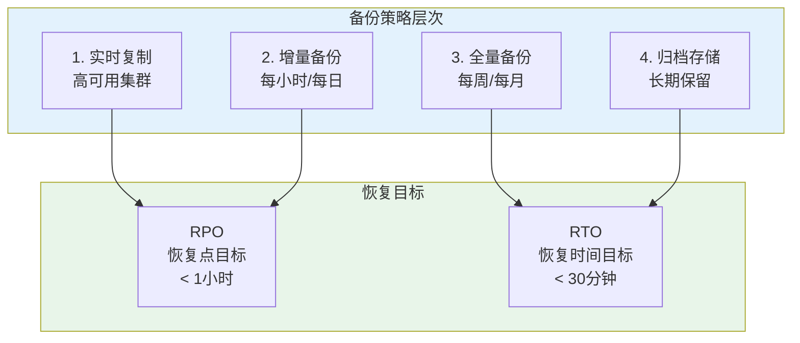
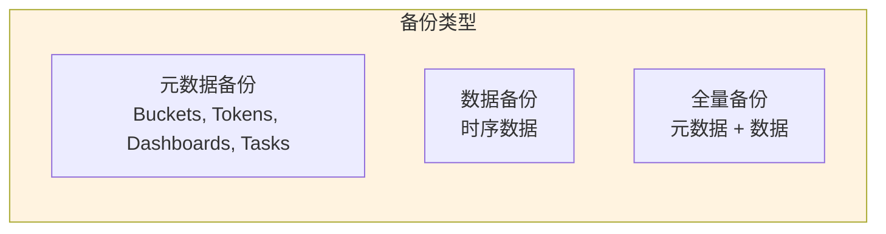
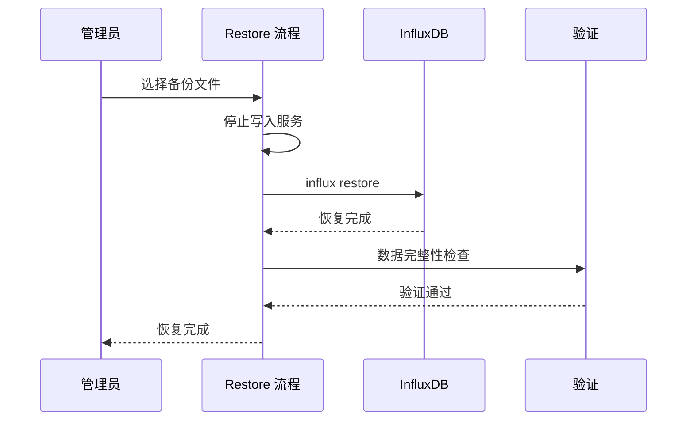
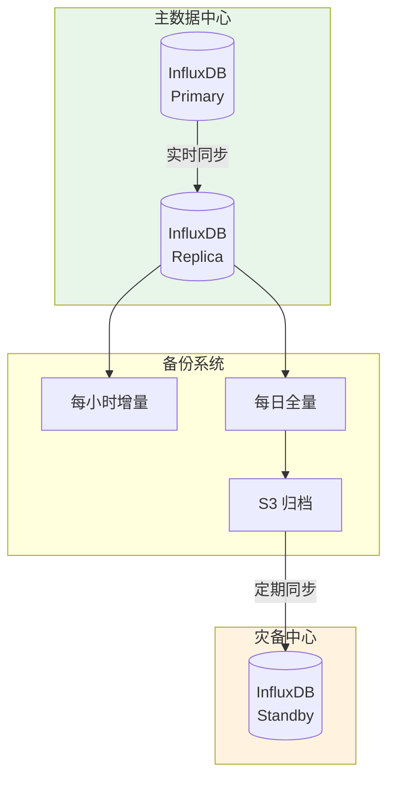
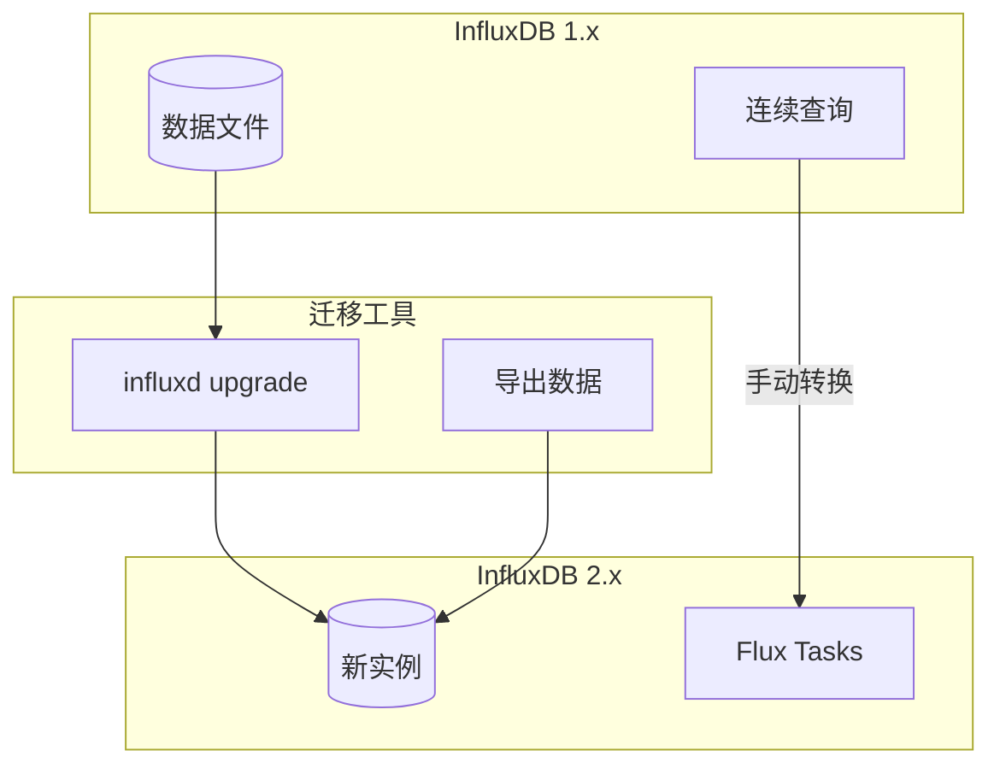

# InfluxDB 备份与恢复实战

## 备份策略概述



## InfluxDB 2.x 备份恢复

### 备份类型



| 备份类型 | 命令 | 内容 | 恢复速度 |
|----------|------|------|----------|
| **元数据** | `backup --bucket-id` | 仅 schema | 快 |
| **数据** | `backup` | 时序数据 | 中等 |
| **全量** | `backup` + 所有 buckets | 完整实例 | 慢 |

### CLI 备份操作

```bash
# 1. 全量备份（所有 buckets）
influx backup /backup/full-backup-$(date +%Y%m%d) \
    --org my-org \
    --token YOUR_OPERATOR_TOKEN

# 2. 备份指定 bucket
influx backup /backup/bucket-specific \
    --bucket my-bucket \
    --org my-org \
    --token YOUR_OPERATOR_TOKEN

# 3. 增量备份（从指定时间开始）
influx backup /backup/incremental \
    --bucket my-bucket \
    --start 2024-01-01T00:00:00Z \
    --stop 2024-01-02T00:00:00Z \
    --org my-org

# 4. 仅备份元数据
influx backup /backup/metadata-only \
    --bucket my-bucket \
    --org my-org \
    --skip-bucket-config  # 不包含 bucket 配置
```

### 自动化备份脚本

```bash
#!/bin/bash
# influxdb-backup.sh

set -e

# 配置
INFLUX_TOKEN="${INFLUX_TOKEN:-your-operator-token}"
INFLUX_ORG="${INFLUX_ORG:-my-org}"
BACKUP_BASE="/backup/influxdb"
RETENTION_DAYS=30
S3_BUCKET="s3://my-backup-bucket/influxdb"

# 创建备份目录
DATE=$(date +%Y%m%d_%H%M%S)
BACKUP_DIR="${BACKUP_BASE}/${DATE}"
mkdir -p "$BACKUP_DIR"

log() {
    echo "[$(date '+%Y-%m-%d %H:%M:%S')] $1"
}

# 执行备份
log "Starting InfluxDB backup..."
influx backup "$BACKUP_DIR" \
    --org "$INFLUX_ORG" \
    --token "$INFLUX_TOKEN" \
    2>> "$BACKUP_DIR/backup.log"

if [ $? -eq 0 ]; then
    log "Backup completed: $BACKUP_DIR"
    
    # 压缩备份
    log "Compressing backup..."
    tar -czf "${BACKUP_DIR}.tar.gz" -C "$BACKUP_BASE" "$DATE"
    rm -rf "$BACKUP_DIR"
    
    # 上传到 S3
    log "Uploading to S3..."
    aws s3 cp "${BACKUP_DIR}.tar.gz" "$S3_BUCKET/" \
        --storage-class STANDARD_IA
    
    # 删除本地压缩文件
    rm "${BACKUP_DIR}.tar.gz"
    
    # 清理旧备份（本地）
    log "Cleaning up local backups older than $RETENTION_DAYS days..."
    find "$BACKUP_BASE" -name "*.tar.gz" -mtime +$RETENTION_DAYS -delete
    
    # 清理 S3 旧备份
    log "Cleaning up S3 backups..."
    aws s3 ls "$S3_BUCKET/" | while read -r line; do
        file_date=$(echo "$line" | awk '{print $1}')
        file_name=$(echo "$line" | awk '{print $4}')
        
        # 解析日期并检查是否超过保留期
        file_timestamp=$(date -d "$file_date" +%s)
        cutoff_timestamp=$(date -d "$RETENTION_DAYS days ago" +%s)
        
        if [ "$file_timestamp" -lt "$cutoff_timestamp" ]; then
            log "Deleting old backup: $file_name"
            aws s3 rm "$S3_BUCKET/$file_name"
        fi
    done
    
    log "Backup process completed successfully!"
else
    log "Backup failed! Check logs at $BACKUP_DIR/backup.log"
    exit 1
fi
```

### Python 备份管理

```python
#!/usr/bin/env python3
"""
InfluxDB 备份管理工具
"""
import os
import subprocess
import json
from datetime import datetime, timedelta
from pathlib import Path
from typing import List, Optional
import boto3
from dataclasses import dataclass

@dataclass
class BackupConfig:
    influx_url: str = "http://localhost:8086"
    influx_token: str = ""
    influx_org: str = "my-org"
    backup_base_path: str = "/backup/influxdb"
    s3_bucket: str = ""
    retention_days: int = 30


class InfluxDBBackupManager:
    def __init__(self, config: BackupConfig):
        self.config = config
        self.s3_client = boto3.client('s3') if config.s3_bucket else None
        
    def create_backup(
        self, 
        backup_name: Optional[str] = None,
        bucket: Optional[str] = None,
        start_time: Optional[str] = None,
        end_time: Optional[str] = None
    ) -> str:
        """创建备份"""
        timestamp = datetime.now().strftime("%Y%m%d_%H%M%S")
        backup_name = backup_name or f"backup_{timestamp}"
        backup_path = Path(self.config.backup_base_path) / backup_name
        backup_path.mkdir(parents=True, exist_ok=True)
        
        # 构建备份命令
        cmd = [
            "influx", "backup", str(backup_path),
            "--org", self.config.influx_org,
            "--token", self.config.influx_token
        ]
        
        if bucket:
            cmd.extend(["--bucket", bucket])
        if start_time:
            cmd.extend(["--start", start_time])
        if end_time:
            cmd.extend(["--stop", end_time])
        
        # 执行备份
        print(f"🚀 Creating backup: {backup_name}")
        result = subprocess.run(cmd, capture_output=True, text=True)
        
        if result.returncode != 0:
            raise Exception(f"Backup failed: {result.stderr}")
        
        print(f"✅ Backup created: {backup_path}")
        
        # 创建备份清单
        manifest = {
            "backup_name": backup_name,
            "created_at": datetime.now().isoformat(),
            "bucket": bucket or "all",
            "start_time": start_time,
            "end_time": end_time,
            "path": str(backup_path)
        }
        
        manifest_path = backup_path / "manifest.json"
        with open(manifest_path, 'w') as f:
            json.dump(manifest, f, indent=2)
        
        return str(backup_path)
    
    def compress_backup(self, backup_path: str) -> str:
        """压缩备份"""
        compressed_path = f"{backup_path}.tar.gz"
        
        print(f"📦 Compressing backup...")
        subprocess.run(
            ["tar", "-czf", compressed_path, "-C", 
             self.config.backup_base_path, 
             Path(backup_path).name],
            check=True
        )
        
        print(f"✅ Compressed: {compressed_path}")
        return compressed_path
    
    def upload_to_s3(self, local_path: str) -> str:
        """上传到 S3"""
        if not self.s3_client or not self.config.s3_bucket:
            print("⚠️ S3 not configured, skipping upload")
            return local_path
        
        s3_key = f"influxdb/{Path(local_path).name}"
        
        print(f"☁️ Uploading to S3: {s3_key}")
        self.s3_client.upload_file(
            local_path,
            self.config.s3_bucket,
            s3_key,
            ExtraArgs={'StorageClass': 'STANDARD_IA'}
        )
        
        print(f"✅ Uploaded to s3://{self.config.s3_bucket}/{s3_key}")
        return s3_key
    
    def list_backups(self, include_remote: bool = True) -> List[dict]:
        """列出所有备份"""
        backups = []
        
        # 本地备份
        backup_dir = Path(self.config.backup_base_path)
        if backup_dir.exists():
            for item in backup_dir.iterdir():
                if item.suffix == '.gz' or item.is_dir():
                    backups.append({
                        "name": item.name,
                        "location": "local",
                        "path": str(item),
                        "size": item.stat().st_size if item.is_file() else None,
                        "modified": datetime.fromtimestamp(
                            item.stat().st_mtime
                        ).isoformat()
                    })
        
        # 远程备份
        if include_remote and self.s3_client:
            response = self.s3_client.list_objects_v2(
                Bucket=self.config.s3_bucket,
                Prefix="influxdb/"
            )
            
            for obj in response.get('Contents', []):
                backups.append({
                    "name": Path(obj['Key']).name,
                    "location": "s3",
                    "path": f"s3://{self.config.s3_bucket}/{obj['Key']}",
                    "size": obj['Size'],
                    "modified": obj['LastModified'].isoformat()
                })
        
        return backups
    
    def restore_backup(
        self, 
        backup_path: str,
        target_org: Optional[str] = None,
        target_bucket: Optional[str] = None
    ):
        """恢复备份"""
        # 如果是压缩文件，先解压
        if backup_path.endswith('.tar.gz'):
            print(f"📂 Extracting backup...")
            extract_dir = backup_path.replace('.tar.gz', '')
            subprocess.run(
                ["tar", "-xzf", backup_path, "-C", self.config.backup_base_path],
                check=True
            )
            backup_path = extract_dir
        
        # 执行恢复
        cmd = [
            "influx", "restore", backup_path,
            "--token", self.config.influx_token
        ]
        
        if target_org:
            cmd.extend(["--org", target_org])
        if target_bucket:
            cmd.extend(["--bucket", target_bucket])
        
        print(f"🔄 Restoring from: {backup_path}")
        result = subprocess.run(cmd, capture_output=True, text=True)
        
        if result.returncode != 0:
            raise Exception(f"Restore failed: {result.stderr}")
        
        print(f"✅ Restore completed!")
    
    def cleanup_old_backups(self):
        """清理过期备份"""
        cutoff_date = datetime.now() - timedelta(days=self.config.retention_days)
        
        # 清理本地备份
        backup_dir = Path(self.config.backup_base_path)
        if backup_dir.exists():
            for item in backup_dir.iterdir():
                modified = datetime.fromtimestamp(item.stat().st_mtime)
                if modified < cutoff_date:
                    print(f"🗑️ Deleting old backup: {item.name}")
                    if item.is_file():
                        item.unlink()
                    else:
                        import shutil
                        shutil.rmtree(item)
        
        # 清理 S3 备份
        if self.s3_client:
            response = self.s3_client.list_objects_v2(
                Bucket=self.config.s3_bucket,
                Prefix="influxdb/"
            )
            
            for obj in response.get('Contents', []):
                if obj['LastModified'].replace(tzinfo=None) < cutoff_date:
                    print(f"🗑️ Deleting from S3: {obj['Key']}")
                    self.s3_client.delete_object(
                        Bucket=self.config.s3_bucket,
                        Key=obj['Key']
                    )


# 使用示例
if __name__ == "__main__":
    config = BackupConfig(
        influx_token=os.getenv("INFLUX_TOKEN", "your-token"),
        influx_org="my-org",
        backup_base_path="/backup/influxdb",
        s3_bucket="my-backup-bucket",
        retention_days=30
    )
    
    manager = InfluxDBBackupManager(config)
    
    # 创建备份
    backup_path = manager.create_backup()
    
    # 压缩
    compressed = manager.compress_backup(backup_path)
    
    # 上传
    manager.upload_to_s3(compressed)
    
    # 清理旧备份
    manager.cleanup_old_backups()
```

## 恢复操作

### 恢复流程



### 恢复命令详解

```bash
# 1. 完整恢复（到新实例）
influx restore /backup/full-backup-20240124 \
    --token NEW_OPERATOR_TOKEN \
    --org-mapping old-org-id:new-org-id

# 2. 恢复到指定 bucket
influx restore /backup/bucket-backup \
    --bucket old-bucket-name \
    --new-bucket restored-bucket \
    --token OPERATOR_TOKEN

# 3. 强制恢复（覆盖现有数据）
influx restore /backup/backup-dir \
    --force \
    --token OPERATOR_TOKEN

# 4. 恢复到新的 organization
influx restore /backup/backup-dir \
    --org old-org \
    --new-org restored-org \
    --token OPERATOR_TOKEN
```

### 时间点恢复 (PITR)

```bash
#!/bin/bash
# point-in-time-recovery.sh

BACKUP_DIR="/backup/influxdb"
TARGET_TIME="$1"  # 格式: 2024-01-15T10:30:00Z

if [ -z "$TARGET_TIME" ]; then
    echo "Usage: $0 <ISO_TIMESTAMP>"
    exit 1
fi

# 找到最近的完整备份
LATEST_FULL=$(find "$BACKUP_DIR" -name "full-*" -type d | sort | tail -1)

echo "Using backup: $LATEST_FULL"

# 恢复完整备份
influx restore "$LATEST_FULL" --token "$INFLUX_TOKEN"

# 如果有增量备份在目标时间之后，需要重放
# 注意：InfluxDB 原生不支持增量恢复，需要自定义逻辑

# 方案：使用数据导出/导入实现 PITR
influx query '
from(bucket: "my-bucket")
    |> range(start: 2024-01-01T00:00:00Z, stop: ' "$TARGET_TIME" ')
    |> to(bucket: "recovery-bucket")
' --org my-org --token "$INFLUX_TOKEN"
```

## 灾难恢复策略

### 高可用架构



### 灾备演练脚本

```bash
#!/bin/bash
# disaster-recovery-drill.sh

set -e

echo "🚨 Starting Disaster Recovery Drill..."

# 1. 模拟主节点故障
echo "Step 1: Simulating primary failure..."
docker-compose stop influxdb-primary

# 2. 启动灾备实例
echo "Step 2: Activating DR instance..."
docker-compose up -d influxdb-dr

# 3. 从 S3 下载最新备份
echo "Step 3: Downloading latest backup from S3..."
LATEST_BACKUP=$(aws s3 ls s3://dr-backup/influxdb/ | sort | tail -1 | awk '{print $4}')
aws s3 cp "s3://dr-backup/influxdb/$LATEST_BACKUP" /tmp/

# 4. 恢复数据
echo "Step 4: Restoring data..."
tar -xzf "/tmp/$LATEST_BACKUP" -C /tmp/
BACKUP_DIR="/tmp/$(basename $LATEST_BACKUP .tar.gz)"
influx restore "$BACKUP_DIR" --token "$DR_INFLUX_TOKEN"

# 5. 验证数据完整性
echo "Step 5: Verifying data integrity..."
RECORD_COUNT=$(influx query 'from(bucket:"my-bucket") |> range(start:-1h) |> count()' --token "$DR_INFLUX_TOKEN" | tail -1)

if [ "$RECORD_COUNT" -gt 0 ]; then
    echo "✅ Data verification passed: $RECORD_COUNT records"
else
    echo "❌ Data verification failed!"
    exit 1
fi

# 6. 切换流量
echo "Step 6: Switching traffic to DR..."
# 更新 DNS/负载均衡器配置
# ...

echo "🎉 DR Drill completed successfully!"
```

## 跨版本迁移

### 1.x → 2.x 迁移



```bash
# 方法 1: 自动升级工具
influxd upgrade \
    --bolt-path ~/.influxdbv2/influxd.bolt \
    --engine-path ~/.influxdbv2/engine \
    --config-file /etc/influxdb/influxdb.conf \
    --username admin \
    --password admin123 \
    --org my-org \
    --bucket default \
    --retention 0 \
    --force

# 方法 2: 导出/导入 (推荐用于大容量)
# 1.x 导出
curl -G http://localhost:8086/query \
    --data-urlencode "db=mydb" \
    --data-urlencode "q=SELECT * FROM cpu" \
    -H "Accept: application/csv" > data.csv

# 转换为 Line Protocol
# 使用工具/脚本转换

# 2.x 导入
influx write \
    --bucket my-bucket \
    --file data.lp \
    --rate-limit 50000
```

### 迁移检查清单

```markdown
## 1.x → 2.x 迁移检查清单

### 迁移前
- [ ] 备份 1.x 数据
- [ ] 记录所有 CQ 配置
- [ ] 记录所有 RP 配置
- [ ] 导出用户权限
- [ ] 测试升级脚本

### 迁移中
- [ ] 停止写入
- [ ] 执行升级/导出
- [ ] 验证数据完整性
- [ ] 重建 CQ → Tasks
- [ ] 配置权限

### 迁移后
- [ ] 验证查询结果
- [ ] 测试写入性能
- [ ] 更新应用配置
- [ ] 监控日志错误
- [ ] 清理旧实例
```

## 备份验证

### 自动化验证

```python
#!/usr/bin/env python3
"""
备份验证工具
"""
import subprocess
import tempfile
import shutil
from influxdb_client import InfluxDBClient

class BackupVerifier:
    def __init__(self, backup_path: str):
        self.backup_path = backup_path
        self.temp_dir = None
        
    def __enter__(self):
        self.temp_dir = tempfile.mkdtemp(prefix="influx-verify-")
        return self
        
    def __exit__(self, exc_type, exc_val, exc_tb):
        if self.temp_dir and os.path.exists(self.temp_dir):
            shutil.rmtree(self.temp_dir)
    
    def verify_backup(self) -> dict:
        """验证备份完整性"""
        results = {
            "backup_path": self.backup_path,
            "status": "unknown",
            "checks": {}
        }
        
        # 1. 检查备份文件存在
        if not os.path.exists(self.backup_path):
            results["status"] = "failed"
            results["error"] = "Backup file not found"
            return results
        
        results["checks"]["exists"] = True
        
        # 2. 解压到临时目录
        try:
            if self.backup_path.endswith('.tar.gz'):
                subprocess.run(
                    ["tar", "-xzf", self.backup_path, "-C", self.temp_dir],
                    check=True
                )
                restore_dir = os.path.join(
                    self.temp_dir, 
                    os.path.basename(self.backup_path).replace('.tar.gz', '')
                )
            else:
                restore_dir = self.backup_path
            
            results["checks"]["extractable"] = True
        except subprocess.CalledProcessError as e:
            results["status"] = "failed"
            results["error"] = f"Failed to extract: {e}"
            return results
        
        # 3. 验证备份文件结构
        required_files = ["manifest.json"]
        for root, dirs, files in os.walk(restore_dir):
            for req in required_files:
                if req in files:
                    results["checks"]["manifest_present"] = True
                    break
        
        # 4. 尝试恢复到临时实例（可选）
        # 启动临时 InfluxDB 实例并恢复
        # ...
        
        results["status"] = "verified"
        return results

# 使用示例
with BackupVerifier("/backup/influxdb/backup_20240124.tar.gz") as verifier:
    result = verifier.verify_backup()
    print(json.dumps(result, indent=2))
```

---

掌握备份恢复后，下一篇将介绍监控与集成实战。
