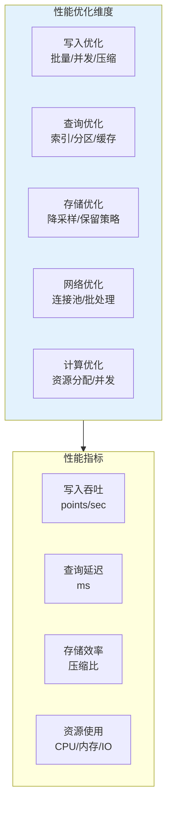
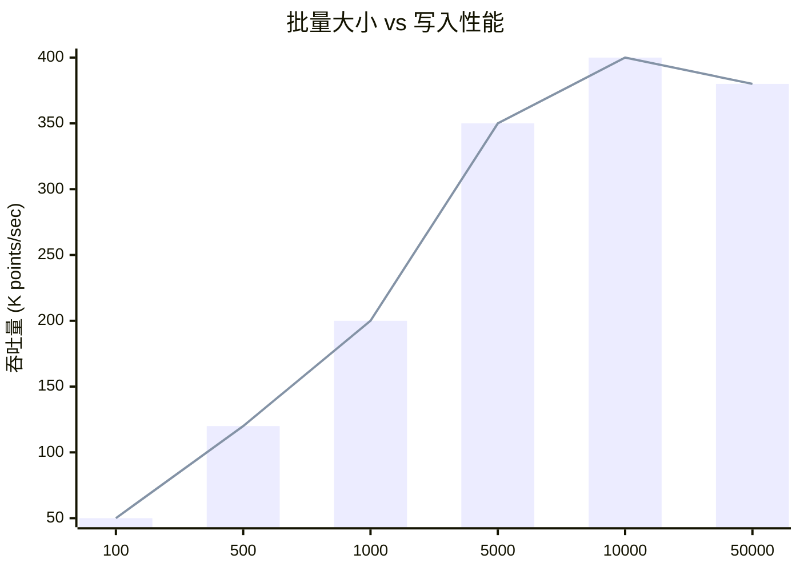
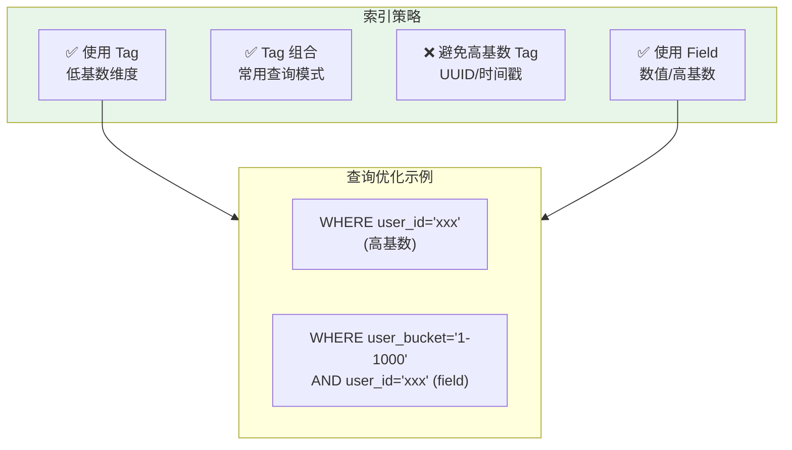
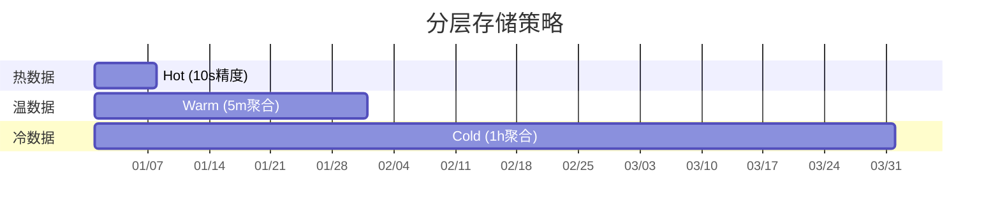
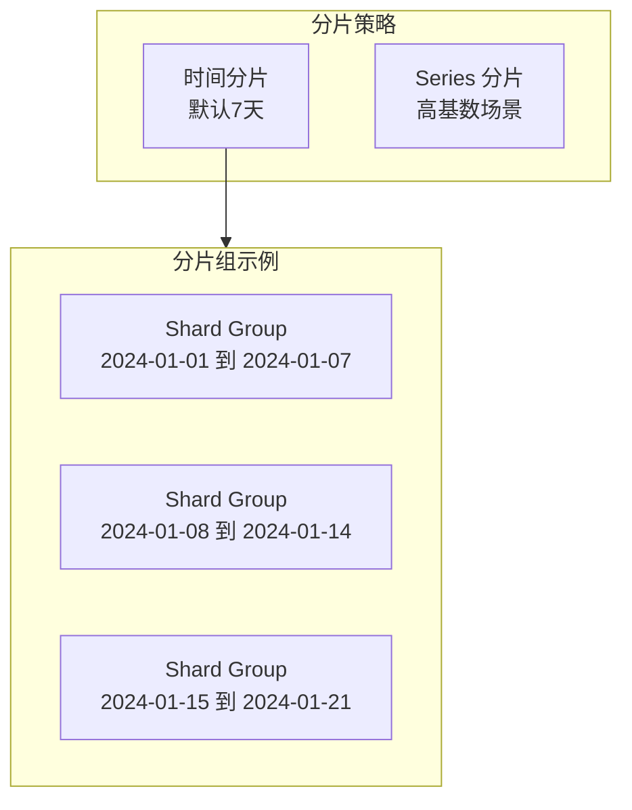
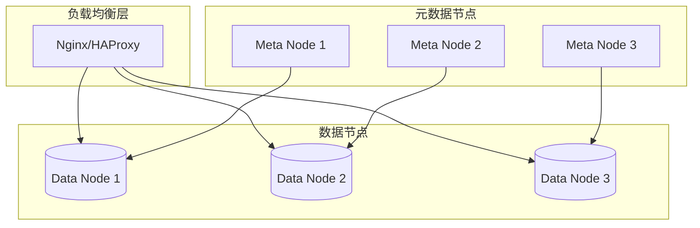

# InfluxDB 性能调优指南

## 性能优化体系



## 写入性能优化

### 批量写入策略



**最佳批量大小：**

| 场景 | 推荐批量 | 延迟要求 | 说明 |
|------|----------|----------|------|
| 实时写入 | 100-500 | < 100ms | 快速响应 |
| 平衡模式 | 1000-5000 | < 500ms | 推荐默认值 |
| 高吞吐 | 5000-10000 | < 1s | 批处理优先 |
| 离线导入 | 10000-50000 | < 5s | 最大吞吐 |

```python
# 优化写入示例
import time
from influxdb_client import InfluxDBClient
from influxdb_client.client.write_api import WriteOptions

# 配置优化写入
write_options = WriteOptions(
    batch_size=5000,           # 批量大小
    flush_interval=1000,       # 刷新间隔（毫秒）
    jitter_interval=0,         # 抖动间隔
    retry_interval=5000,       # 重试间隔
    max_retries=3,             # 最大重试次数
    max_retry_delay=125000,    # 最大重试延迟
    exponential_base=2         # 指数退避基数
)

client = InfluxDBClient(url="http://localhost:8086", token="token")
write_api = client.write_api(write_options=write_options)

# 批量写入数据点
points = []
for i in range(100000):
    point = Point("cpu") \
        .tag("host", f"server{i % 100:02d}") \
        .field("usage", 50.0 + i % 50) \
        .time(int(time.time() * 1e9) + i * 1000000)
    points.append(point)

# 异步批量写入
write_api.write(bucket="metrics", record=points)
write_api.close()
```

### 并发写入优化

```python
import asyncio
from concurrent.futures import ThreadPoolExecutor
import multiprocessing

class OptimizedInfluxWriter:
    def __init__(self, url, token, bucket, workers=None):
        self.url = url
        self.token = token
        self.bucket = bucket
        self.workers = workers or multiprocessing.cpu_count()
        self.executor = ThreadPoolExecutor(max_workers=self.workers)
    
    def parallel_write(self, points_batch):
        """并行批量写入"""
        # 将数据分成多个批次
        batch_size = len(points_batch) // self.workers
        batches = [
            points_batch[i:i + batch_size] 
            for i in range(0, len(points_batch), batch_size)
        ]
        
        # 并行执行
        futures = []
        for batch in batches:
            future = self.executor.submit(self._write_batch, batch)
            futures.append(future)
        
        # 等待所有完成
        results = [f.result() for f in futures]
        return all(results)
    
    def _write_batch(self, points):
        """单批次写入"""
        client = InfluxDBClient(url=self.url, token=self.token)
        try:
            write_api = client.write_api()
            write_api.write(bucket=self.bucket, record=points)
            return True
        except Exception as e:
            print(f"Write failed: {e}")
            return False
        finally:
            client.close()

# 性能测试
writer = OptimizedInfluxWriter(
    url="http://localhost:8086",
    token="your-token",
    bucket="metrics",
    workers=8
)

# 生成测试数据
test_points = generate_test_points(1000000)  # 100万点

# 测试吞吐量
start = time.time()
writer.parallel_write(test_points)
elapsed = time.time() - start

throughput = len(test_points) / elapsed
print(f"Throughput: {throughput:,.0f} points/sec")
```

### 压缩传输

```bash
# 启用 Gzip 压缩传输
curl -X POST http://localhost:8086/api/v2/write \
  --header "Authorization: Token YOUR_TOKEN" \
  --header "Content-Encoding: gzip" \
  --header "Content-Type: text/plain" \
  --data-binary @compressed_data.gz
```

```python
import gzip
import io

def compress_data(points):
    """压缩 Line Protocol 数据"""
    data = '\n'.join(points)
    buf = io.BytesIO()
    
    with gzip.GzipFile(fileobj=buf, mode='wb') as f:
        f.write(data.encode('utf-8'))
    
    return buf.getvalue()

# 使用压缩写入
compressed = compress_data(line_protocol_points)
headers = {
    "Authorization": f"Token {token}",
    "Content-Encoding": "gzip",
    "Content-Type": "text/plain"
}

response = requests.post(
    f"{url}/api/v2/write",
    headers=headers,
    params={"org": org, "bucket": bucket},
    data=compressed
)
```

## 查询性能优化

### 索引优化



**Schema 设计优化：**

```
❌ 不好的设计（高基数问题）
measurement: events
  tag: user_id (100万用户 = 100万 series)
  tag: session_id (1亿 sessions)
  field: event_type

✅ 优化后的设计
measurement: events
  tag: event_type (低基数: 50种类型)
  tag: user_bucket (哈希桶: 1000个桶)
  tag: time_bucket (小时: 24个)
  field: user_id (高基数改为 field)
  field: session_id
```

### 查询优化技巧

```flux
-- ❌ 低效查询：大范围扫描
from(bucket: "metrics")
    |> range(start: -30d)  -- 范围太大！
    |> filter(fn: (r) => r._measurement == "cpu")
    |> aggregateWindow(every: 1h, fn: mean)

-- ✅ 高效查询：限制时间范围
from(bucket: "metrics")
    |> range(start: -1h)   -- 只查需要的数据
    |> filter(fn: (r) => r._measurement == "cpu")
    |> filter(fn: (r) => r._field == "usage_user")  -- 指定 field
    |> filter(fn: (r) => r.host == "server01")      -- 先用 tag 过滤
    |> aggregateWindow(every: 5m, fn: mean)

-- ✅ 使用预聚合数据
from(bucket: "metrics-1h")  -- 查询聚合 bucket
    |> range(start: -30d)
    |> filter(fn: (r) => r._measurement == "cpu")
    -- 不需要再聚合！
```

### 分页与限制

```flux
-- 限制返回数量
from(bucket: "metrics")
    |> range(start: -1h)
    |> limit(n: 1000)  -- 只返回前1000条

-- 分页查询
from(bucket: "metrics")
    |> range(start: -1h)
    |> limit(n: 100, offset: 0)   -- 第1页
    
from(bucket: "metrics")
    |> range(start: -1h)
    |> limit(n: 100, offset: 100) -- 第2页
```

## 存储优化

### TSM 存储引擎调优

```yaml
# /etc/influxdb/config.yml
storage:
  # 内存缓存配置
  cache-max-memory-size: 2147483648  # 2GB，默认1GB
  cache-snapshot-memory-size: 26214400  # 25MB
  cache-snapshot-write-cold-duration: 10m
  
  # WAL 配置
  max-concurrent-compactions: 3
  compact-full-write-cold-duration: 4h
  
  # 索引配置
  max-index-log-file-size: 1048576  # 1MB
  series-id-set-cache-size: 100
  
  # 保留检查
  retention-check-interval: 30m
```

### 保留策略优化



```flux
// 自动降采样任务
option task = {name: "optimize-storage", every: 1h}

// 1小时前的数据：5分钟聚合
from(bucket: "metrics")
    |> range(start: -2h, stop: -1h)
    |> aggregateWindow(every: 5m, fn: mean)
    |> to(bucket: "metrics-5m")

// 1天前的数据：1小时聚合  
from(bucket: "metrics-5m")
    |> range(start: -2d, stop: -1d)
    |> aggregateWindow(every: 1h, fn: mean)
    |> to(bucket: "metrics-1h")
```

## 系统资源调优

### Linux 内核优化

```bash
# /etc/sysctl.conf

# 文件描述符
fs.file-max = 65536

# 内存优化
vm.swappiness = 10
vm.dirty_ratio = 40
vm.dirty_background_ratio = 10
vm.overcommit_memory = 1

# 网络优化
net.core.somaxconn = 65535
net.ipv4.tcp_max_syn_backlog = 65535
net.ipv4.tcp_tw_reuse = 1
net.ipv4.tcp_fin_timeout = 15
net.core.netdev_max_backlog = 65536

# InfluxDB 专用
net.ipv4.ip_local_port_range = 1024 65535
```

### 文件系统优化

```bash
# 使用 SSD + XFS 文件系统
mkfs.xfs -f /dev/nvme0n1

# 挂载选项
mount -t xfs -o noatime,nodiratime,logbufs=8,logbsize=256k /dev/nvme0n1 /var/lib/influxdb

# /etc/fstab
/dev/nvme0n1 /var/lib/influxdb xfs noatime,nodiratime,logbufs=8,logbsize=256k 0 0
```

### 资源限制配置

```bash
# /etc/security/limits.d/influxdb.conf
influxdb soft nofile 65536
influxdb hard nofile 65536
influxdb soft nproc 65536
influxdb hard nproc 65536

# /etc/systemd/system/influxdb.service.d/override.conf
[Service]
LimitNOFILE=65536
LimitNPROC=65536
MemoryLimit=16G
CPUQuota=400%
```

## 集群优化

### 分片策略



```sql
-- 创建自定义分片组持续时间
CREATE RETENTION POLICY one_week ON mydb
    DURATION 7d
    REPLICATION 1
    SHARD DURATION 1d  -- 每天一个分片
    DEFAULT
```

### 水平扩展架构



## 性能诊断

### 监控关键指标

```flux
// 监控 InfluxDB 自身指标
from(bucket: "_monitoring")
    |> range(start: -1h)
    |> filter(fn: (r) => r._measurement == "influxdb_http")
    |> filter(fn: (r) => r._field =~ /req_|queryReq/)
```

**关键监控指标：**

| 指标 | 健康阈值 | 说明 |
|------|----------|------|
| `http_request_duration_seconds` | < 100ms | HTTP 请求延迟 |
| `storage_compactions_active` | < 3 | 活跃压缩任务 |
| `storage_tsm_files_disk_bytes` | < 80% 磁盘 | TSM 文件大小 |
| `query_queue_duration_seconds` | < 1s | 查询队列等待 |
| `boltdb_reads_total` / `boltdb_writes_total` | 稳定 | 元数据操作 |

### 慢查询分析

```flux
// 查找慢查询
from(bucket: "_monitoring")
    |> range(start: -1h)
    |> filter(fn: (r) => r._measurement == "influxdb_query")
    |> filter(fn: (r) => r._field == "total_duration_seconds")
    |> filter(fn: (r) => r._value > 5.0)  // 超过5秒的查询
    |> sort(columns: ["_value"], desc: true)
    |> limit(n: 10)
```

### 性能诊断工具

```python
# 性能诊断脚本
import requests
import time
import statistics

class InfluxDBProfiler:
    def __init__(self, url, token, org):
        self.url = url
        self.token = token
        self.org = org
        self.headers = {
            "Authorization": f"Token {token}",
            "Content-Type": "application/vnd.flux"
        }
    
    def benchmark_write(self, num_points=10000, batch_size=1000):
        """写入性能测试"""
        # 生成测试数据
        points = []
        base_time = int(time.time() * 1e9)
        
        for i in range(num_points):
            point = f"benchmark,host=server{i%10} value={i} {base_time + i*1000000}"
            points.append(point)
        
        # 分批写入
        latencies = []
        for i in range(0, len(points), batch_size):
            batch = points[i:i+batch_size]
            data = '\n'.join(batch)
            
            start = time.time()
            response = requests.post(
                f"{self.url}/api/v2/write",
                headers=self.headers,
                params={"org": self.org, "bucket": "benchmark"},
                data=data
            )
            latency = (time.time() - start) * 1000
            latencies.append(latency)
            
            if response.status_code != 204:
                print(f"Write failed: {response.text}")
        
        return {
            "total_points": num_points,
            "batch_size": batch_size,
            "throughput": num_points / sum(latencies) * 1000,
            "avg_latency": statistics.mean(latencies),
            "p99_latency": sorted(latencies)[int(len(latencies)*0.99)],
            "max_latency": max(latencies)
        }
    
    def benchmark_query(self, query, iterations=10):
        """查询性能测试"""
        latencies = []
        
        for _ in range(iterations):
            start = time.time()
            response = requests.post(
                f"{self.url}/api/v2/query",
                headers=self.headers,
                params={"org": self.org},
                data=query
            )
            latency = (time.time() - start) * 1000
            latencies.append(latency)
        
        return {
            "iterations": iterations,
            "avg_latency": statistics.mean(latencies),
            "p95_latency": sorted(latencies)[int(len(latencies)*0.95)],
            "min_latency": min(latencies),
            "max_latency": max(latencies)
        }
    
    def check_series_cardinality(self):
        """检查 Series 基数"""
        query = '''
        from(bucket: "_monitoring")
            |> range(start: -1h)
            |> filter(fn: (r) => r._measurement == "storage_series_total")
            |> last()
        '''
        
        response = requests.post(
            f"{self.url}/api/v2/query",
            headers=self.headers,
            params={"org": self.org},
            data=query
        )
        
        return response.json()

# 运行诊断
profiler = InfluxDBProfiler(
    url="http://localhost:8086",
    token="your-token",
    org="my-org"
)

print("=== Write Performance ===")
write_stats = profiler.benchmark_write()
print(f"Throughput: {write_stats['throughput']:,.0f} points/sec")
print(f"Avg Latency: {write_stats['avg_latency']:.2f}ms")
print(f"P99 Latency: {write_stats['p99_latency']:.2f}ms")

print("\n=== Query Performance ===")
query = 'from(bucket:"metrics") |> range(start:-1h) |> limit(n:1000)'
query_stats = profiler.benchmark_query(query)
print(f"Avg Latency: {query_stats['avg_latency']:.2f}ms")
print(f"P95 Latency: {query_stats['p95_latency']:.2f}ms")
```

## 性能测试基准

### 推荐硬件配置

| 规模 | CPU | 内存 | 磁盘 | 网络 | 适用场景 |
|------|-----|------|------|------|----------|
| 小型 | 4核 | 8GB | SSD 100GB | 1Gbps | 测试环境 |
| 中型 | 8核 | 32GB | NVMe 500GB | 10Gbps | 生产环境 |
| 大型 | 16核 | 64GB | NVMe 2TB | 10Gbps | 大规模 |
| 超大型 | 32核+ | 128GB+ | 分布式 | 25Gbps+ | 海量数据 |

### 性能基准

```
写入性能基准：
- 单节点: 500,000+ points/sec
- 集群: 2,000,000+ points/sec

查询性能基准：
- 原始数据查询: < 100ms (1万点)
- 聚合查询: < 500ms (1亿点)
- 元数据查询: < 10ms

存储效率：
- 压缩比: 10:1 (典型时序数据)
- 存储开销: ~2 bytes/point
```

---

掌握性能调优后，下一篇将介绍 Telegraf 集成。
