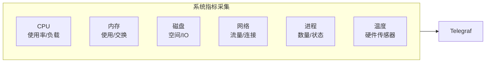
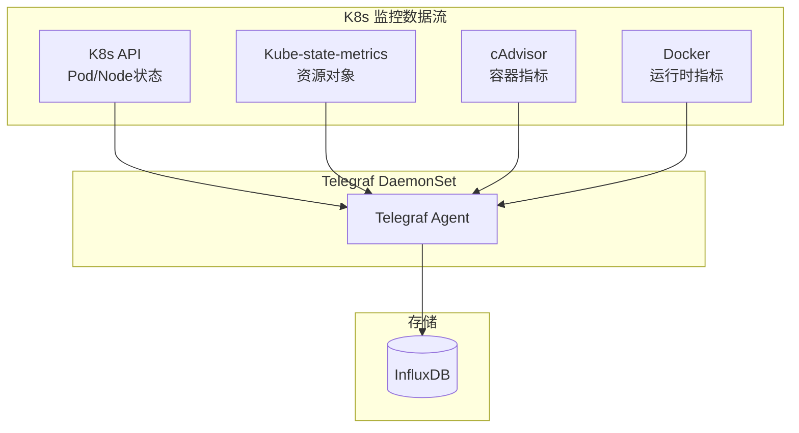
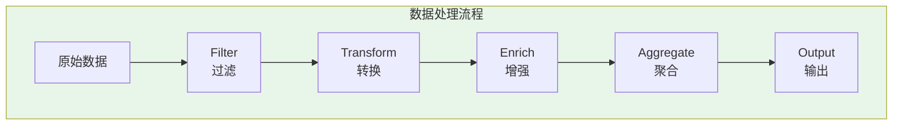
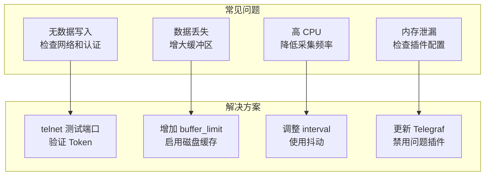

# Telegraf 与 InfluxDB 集成实战

## Telegraf 概述

Telegraf 是 InfluxData 开发的开源**数据采集代理**，用 Go 语言编写，性能高、资源占用低。

```mermaid
flowchart TB
    subgraph Inputs["输入插件 Inputs"]
        I1["系统指标\ncpu, mem, disk"]
        I2["服务监控\nnginx, mysql, redis"]
        I3"云服务商\nAWS, GCP, Azure"]
        I4["消息队列\nKafka, MQTT"]
        I5["自定义\nHTTP, Exec"]
    end
    
    subgraph Processing["处理 Processors"]
        P1["过滤 Filter"]
        P2["转换 Transform"]
        P3["聚合 Aggregate"]
        P4["装饰 Enrich"]
    end
    
    subgraph Outputs["输出插件 Outputs"]
        O1["InfluxDB"]
        O2["Prometheus"]
        O3["Kafka"]
        O4["文件"]
        O5["云服务"]
    end
    
    Inputs --> Telegraf[("Telegraf\nAgent")]
    Telegraf --> Processing
    Processing --> Outputs
    
    style Telegraf fill:#e3f2fd
```

## 安装部署

### 多平台安装

```bash
# Ubuntu/Debian
wget -q https://repos.influxdata.com/influxdata-archive.key | \
  gpg --dearmor | sudo tee /usr/share/keyrings/influxdb-archive-keyring.gpg > /dev/null

echo "deb [signed-by=/usr/share/keyrings/influxdb-archive-keyring.gpg] \
  https://repos.influxdata.com/debian stable main" | \
  sudo tee /etc/apt/sources.list.d/influxdb.list

sudo apt-get update
sudo apt-get install -y telegraf

# CentOS/RHEL
cat <<EOF | sudo tee /etc/yum.repos.d/influxdb.repo
[influxdb]
name = InfluxDB Repository
baseurl = https://repos.influxdata.com/rhel/\$releasever/\$basearch/stable
enabled = 1
gpgcheck = 1
gpgkey = https://repos.influxdata.com/influxdata-archive.key
EOF

sudo yum install -y telegraf

# macOS
brew install telegraf

# Docker
docker run -d \
  --name telegraf \
  --net host \
  -v /var/run/docker.sock:/var/run/docker.sock:ro \
  -v /etc/telegraf/telegraf.conf:/etc/telegraf/telegraf.conf:ro \
  telegraf:latest
```

### 配置结构

```toml
# /etc/telegraf/telegraf.conf

# 全局代理配置
[agent]
  interval = "10s"           # 采集间隔
  round_interval = true      # 对齐到整点
  metric_batch_size = 1000   # 批量大小
  metric_buffer_limit = 10000 # 缓冲区大小
  collection_jitter = "0s"   # 采集抖动
  flush_interval = "10s"     # 刷新间隔
  flush_jitter = "0s"        # 刷新抖动
  precision = ""             # 时间精度
  hostname = ""              # 主机名（空=自动）
  omit_hostname = false      # 是否省略主机名

# 输出插件
[[outputs.influxdb_v2]]
  urls = ["http://localhost:8086"]
  token = "your-influxdb-token"
  organization = "my-org"
  bucket = "metrics"

# 输入插件
[[inputs.cpu]]
  percpu = true
  totalcpu = true

[[inputs.mem]]
```

## 输入插件配置

### 系统监控



```toml
# system-metrics.conf

[[inputs.cpu]]
  percpu = true
  totalcpu = true
  collect_cpu_time = false
  report_active = true

[[inputs.mem]]

[[inputs.disk]]
  ignore_fs = ["tmpfs", "devtmpfs", "devfs", "iso9660", "overlay"]

[[inputs.diskio]]

[[inputs.net]]
  interfaces = ["eth*", "ens*", "enp*"]
  ignore_protocol_stats = false

[[inputs.processes]]

[[inputs.system]]

[[inputs.kernel]]

[[inputs.linux_sysctl_fs]]

# 硬件温度 (需要 sensors 命令)
[[inputs.sensors]]
```

### 服务监控

```toml
# services.conf

# Nginx
[[inputs.nginx]]
  urls = ["http://localhost/nginx_status"]
  response_timeout = "5s"

# MySQL
[[inputs.mysql]]
  servers = ["tcp(localhost:3306)/?tls=false"]
  metric_version = 2

# Redis
[[inputs.redis]]
  servers = ["tcp://localhost:6379"]

# PostgreSQL
[[inputs.postgresql]]
  address = "host=localhost user=postgres password=secret sslmode=disable"

# MongoDB
[[inputs.mongodb]]
  servers = ["mongodb://localhost:27017"]

# RabbitMQ
[[inputs.rabbitmq]]
  url = "http://localhost:15672"
  username = "admin"
  password = "admin"

# Elasticsearch
[[inputs.elasticsearch]]
  servers = ["http://localhost:9200"]
  local = true

# Kafka
[[inputs.kafka_consumer]]
  brokers = ["localhost:9092"]
  topics = ["metrics"]
  consumer_group = "telegraf"
```

### 云原生监控

```toml
# kubernetes.conf

# Kubernetes API 指标
[[inputs.kubernetes]]
  url = "https://$HOSTIP:10250"
  bearer_token = "/var/run/secrets/kubernetes.io/serviceaccount/token"
  insecure_skip_verify = true

# Kube-state-metrics
[[inputs.prometheus]]
  urls = ["http://kube-state-metrics.monitoring.svc:8080/metrics"]
  metric_version = 2
  kubernetes_services = ["kube-state-metrics"]

# cAdvisor
[[inputs.cadvisor]]
  url = "http://localhost:8080"

# Docker
[[inputs.docker]]
  endpoint = "unix:///var/run/docker.sock"
  gather_services = false
  container_name_include = []
  container_name_exclude = []
  timeout = "5s"
  perdevice = true
  total = true
```



## 输出插件配置

### InfluxDB 输出

```toml
# influxdb-output.conf

# InfluxDB 2.x
[[outputs.influxdb_v2]]
  urls = ["http://localhost:8086"]
  token = "your-token"
  organization = "my-org"
  bucket = "metrics"
  bucket_tag = ""
  exclude_bucket_tag = false
  timeout = "5s"
  
  # 内容编码
  content_encoding = "gzip"
  
  # 失败重试
  max_retries = 3
  
  # 批量配置
  metric_batch_size = 1000
  metric_buffer_limit = 10000
  flush_interval = "10s"
  flush_jitter = "5s"

# 多 Bucket 路由
[[outputs.influxdb_v2]]
  urls = ["http://localhost:8086"]
  token = "system-token"
  organization = "my-org"
  bucket = "system-metrics"
  namepass = ["cpu", "mem", "disk", "diskio", "net", "system"]

[[outputs.influxdb_v2]]
  urls = ["http://localhost:8086"]
  token = "app-token"
  organization = "my-org"
  bucket = "app-metrics"
  namepass = ["http_response", "nginx", "mysql"]
```

### 多输出配置

```toml
# multi-output.conf

# 主存储：InfluxDB
[[outputs.influxdb_v2]]
  urls = ["http://influxdb-primary:8086"]
  token = "${INFLUX_TOKEN}"
  organization = "my-org"
  bucket = "metrics"

# 备份存储：InfluxDB 从节点
[[outputs.influxdb_v2]]
  urls = ["http://influxdb-replica:8086"]
  token = "${INFLUX_TOKEN}"
  organization = "my-org"
  bucket = "metrics"

# 实时分析：Kafka
[[outputs.kafka]]
  brokers = ["kafka:9092"]
  topic = "metrics"
  data_format = "influx"

# 归档：文件
[[outputs.file]]
  files = ["/var/log/telegraf/metrics.out"]
  data_format = "json"
  rotation_max_size = "100MB"
  rotation_max_archives = 5
```

## 数据处理

### 过滤器

```toml
# filtering.conf

# 按名称过滤（只保留系统指标）
[[inputs.cpu]]
[[inputs.mem]]

[[processors.override]]
  namepass = ["cpu", "mem", "disk", "diskio", "net", "system"]

# 删除特定指标
[[processors.drop]]
  namepass = ["unwanted_metric"]

# 按标签过滤
[[processors.filter]]
  [[processors.filter.tags]]
    host = ["test-*", "localhost"]

# 按字段值过滤
[[processors.filter]]
  [[processors.filter.fields]]
    usage_idle = { gt = 99.0 }
```

### 转换器

```toml
# transformation.conf

# 重命名测量值
[[processors.rename]]
  [[processors.rename.replace]]
    measurement = "cpu"
    dest = "cpu_usage"

# 重命名标签
[[processors.rename]]
  [[processors.rename.replace]]
    tag = "host"
    dest = "hostname"

# 添加标签
[[processors.override]]
  [processors.override.tags]
    datacenter = "us-east-1"
    environment = "production"

# 添加字段
[[processors.converter]]
  [processors.converter.tags]
    string = ["cpu"]
  [processors.converter.fields]
    float = ["usage*"]

# 计算新字段
[[processors.starlark]]
  source = '''
def apply(metric):
    # 计算非空闲 CPU 使用率
    if "usage_idle" in metric.fields:
        metric.fields["usage_total"] = 100.0 - metric.fields["usage_idle"]
    return metric
'''
```

### 聚合器

```toml
# aggregation.conf

# 基本统计聚合
[[aggregators.basicstats]]
  period = "30s"
  drop_original = false
  stats = ["mean", "min", "max", "stdev", "s2"]

# 百分位数聚合
[[aggregators.percentile]]
  period = "30s"
  drop_original = false
  percentiles = [50.0, 95.0, 99.0]

# 直方图聚合
[[aggregators.histogram]]
  period = "30s"
  drop_original = false
  [[aggregators.histogram.config]]
    measurement_name = "cpu"
    buckets = [0.0, 50.0, 70.0, 85.0, 95.0, 100.0]

# 去重聚合
[[aggregators.final]]
  period = "5m"
  output_strategy = "last"
```



## 高级配置

### HTTP 输入插件

```toml
# http-input.conf

# 轮询 JSON API
[[inputs.http]]
  urls = [
    "http://api.example.com/metrics",
    "http://api2.example.com/status"
  ]
  method = "GET"
  timeout = "5s"
  data_format = "json"
  json_query = "data.metrics"
  json_string_fields = ["status", "version"]
  json_name_key = "metric_name"
  
  # 认证
  headers = {Authorization = "Bearer token123"}

# Webhook 接收
[[inputs.http_listener_v2]]
  service_address = ":8080"
  path = "/telegraf"
  data_format = "json"
  
# Prometheus 抓取
[[inputs.prometheus]]
  urls = ["http://localhost:9090/metrics"]
  metric_version = 2
  kubernetes_services = ["prometheus"]
```

### 自定义 Exec 插件

```toml
# exec-input.conf

[[inputs.exec]]
  commands = [
    "/usr/local/bin/custom-metrics.sh",
    "python3 /opt/scripts/app-metrics.py"
  ]
  timeout = "5s"
  data_format = "influx"
  interval = "60s"
```

```python
#!/usr/bin/env python3
# /opt/scripts/app-metrics.py
# 输出 Line Protocol 格式

import json
import time

metrics = {
    "custom_metric": {
        "host": "server01",
        "region": "us-west",
        "value": 42.0,
        "count": 100
    }
}

# 生成 Line Protocol
timestamp = int(time.time() * 1e9)
print(f"custom_app,host=server01,region=us-west value=42.0,count=100i {timestamp}")
```

## 生产配置示例

### 完整配置模板

```toml
# /etc/telegraf/telegraf.d/production.conf

[global_tags]
  datacenter = "us-east-1"
  environment = "production"
  role = "web-server"

[agent]
  interval = "10s"
  round_interval = true
  metric_batch_size = 1000
  metric_buffer_limit = 10000
  collection_jitter = "0s"
  flush_interval = "10s"
  flush_jitter = "5s"
  precision = ""
  debug = false
  quiet = false
  logfile = "/var/log/telegraf/telegraf.log"
  hostname = ""
  omit_hostname = false

# 系统监控
[[inputs.cpu]]
  percpu = true
  totalcpu = true

[[inputs.mem]]

[[inputs.disk]]
  ignore_fs = ["tmpfs", "devtmpfs"]

[[inputs.diskio]]

[[inputs.net]]

[[inputs.processes]]

[[inputs.system]]

# 应用监控
[[inputs.nginx]]
  urls = ["http://localhost/nginx_status"]

[[inputs.mysql]]
  servers = ["tcp(localhost:3306)/?tls=false"]

# 数据处理
[[processors.override]]
  [processors.override.tags]
    collected_by = "telegraf"

[[aggregators.basicstats]]
  period = "30s"
  drop_original = false
  stats = ["mean", "min", "max"]

# 输出到 InfluxDB
[[outputs.influxdb_v2]]
  urls = ["http://influxdb.monitoring.svc:8086"]
  token = "${INFLUX_TOKEN}"
  organization = "my-org"
  bucket = "production-metrics"
  content_encoding = "gzip"
```

### Kubernetes 部署

```yaml
# telegraf-daemonset.yaml
apiVersion: apps/v1
kind: DaemonSet
metadata:
  name: telegraf
  namespace: monitoring
spec:
  selector:
    matchLabels:
      name: telegraf
  template:
    metadata:
      labels:
        name: telegraf
    spec:
      containers:
      - name: telegraf
        image: telegraf:1.28-alpine
        env:
        - name: INFLUX_TOKEN
          valueFrom:
            secretKeyRef:
              name: influxdb-token
              key: token
        - name: HOSTNAME
          valueFrom:
            fieldRef:
              fieldPath: spec.nodeName
        - name: HOSTIP
          valueFrom:
            fieldRef:
              fieldPath: status.hostIP
        volumeMounts:
        - name: config
          mountPath: /etc/telegraf
        - name: docker-sock
          mountPath: /var/run/docker.sock
        - name: proc
          mountPath: /host/proc
          readOnly: true
        - name: sys
          mountPath: /host/sys
          readOnly: true
        resources:
          requests:
            memory: "128Mi"
            cpu: "100m"
          limits:
            memory: "512Mi"
            cpu: "500m"
      volumes:
      - name: config
        configMap:
          name: telegraf-config
      - name: docker-sock
        hostPath:
          path: /var/run/docker.sock
      - name: proc
        hostPath:
          path: /proc
      - name: sys
        hostPath:
          path: /sys
      serviceAccountName: telegraf
```

## 故障排查

### 调试模式

```bash
# 测试配置
telegraf --config /etc/telegraf/telegraf.conf --test

# 指定输入插件测试
telegraf --config /etc/telegraf/telegraf.conf --input-filter cpu:mem --test

# 调试模式运行
telegraf --config /etc/telegraf/telegraf.conf --debug

# 验证配置
telegraf --config /etc/telegraf/telegraf.conf --config-directory /etc/telegraf/telegraf.d --test
```

### 常见问题



---

掌握 Telegraf 集成后，下一篇将介绍 Grafana 可视化。
