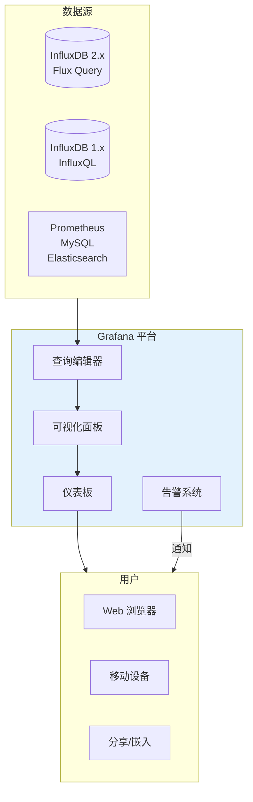
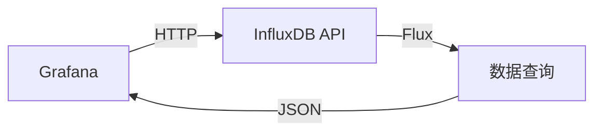
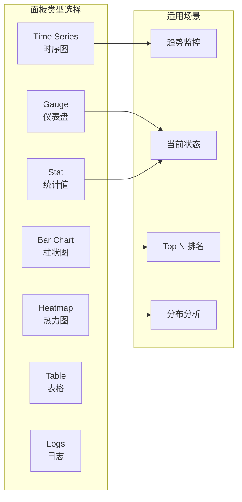
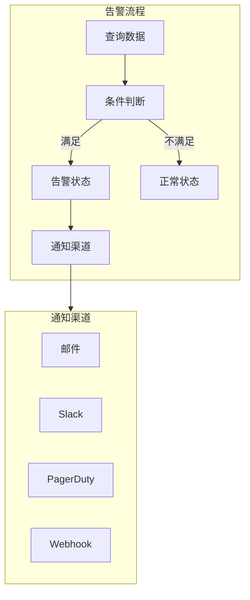
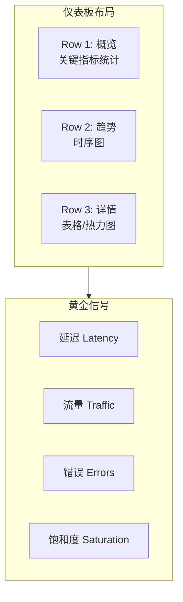
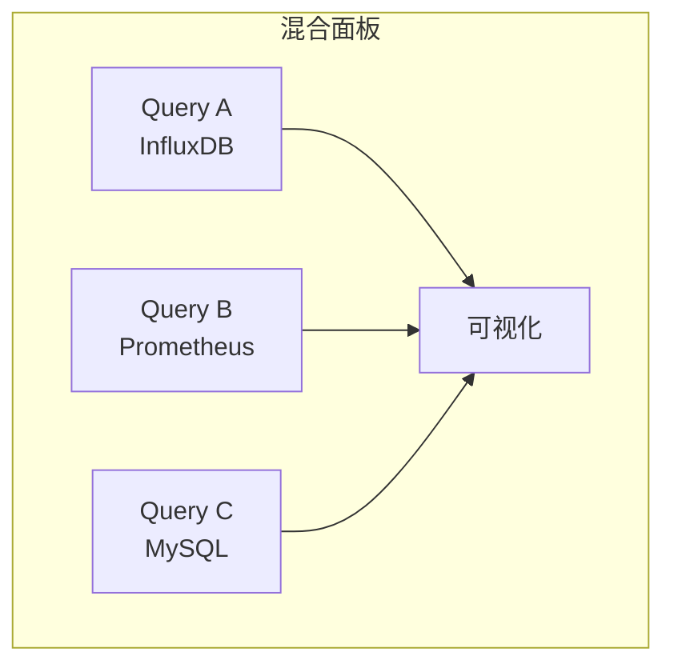

# Grafana 与 InfluxDB 可视化实战

## Grafana + InfluxDB 架构



## 数据源配置

### InfluxDB 2.x 数据源



**配置步骤：**

1. **访问 Grafana** → Configuration → Data Sources
2. **Add data source** → InfluxDB
3. **配置参数：**

| 参数 | 值 | 说明 |
|------|-----|------|
| Query Language | Flux | 使用 Flux 查询 |
| URL | http://influxdb:8086 | InfluxDB 地址 |
| Organization | my-org | 组织名称 |
| Token | your-token | All-Access Token |
| Default Bucket | metrics | 默认 Bucket |

### 连接测试

```flux
// 测试查询
from(bucket: "metrics")
    |> range(start: -1h)
    |> limit(n: 1)
```

## 查询编辑器

### Flux 查询模式


**基础查询示例：**

```flux
// CPU 使用率趋势
from(bucket: "system-metrics")
    |> range(start: v.timeRangeStart, stop: v.timeRangeStop)
    |> filter(fn: (r) => r._measurement == "cpu")
    |> filter(fn: (r) => r._field == "usage_user")
    |> aggregateWindow(every: v.windowPeriod, fn: mean)
    |> group(columns: ["host"])
```

### 模板变量

```flux
// 主机变量查询
import "influxdata/influxdb/schema"
schema.tagValues(bucket: "system-metrics", tag: "host")

// 使用变量
from(bucket: "system-metrics")
    |> range(start: v.timeRangeStart)
    |> filter(fn: (r) => r._measurement == "cpu")
    |> filter(fn: (r) => r.host =~ /^${host:regex}$/)
```

**变量配置：**

| 变量名 | 类型 | 查询 |
|--------|------|------|
| host | Query | `tagValues(bucket: "metrics", tag: "host")` |
| interval | Interval | `1m,5m,10m,30m,1h,6h,12h,1d` |
| datasource | Datasource | InfluxDB |

### 动态面板

```flux
// 多主机对比
from(bucket: "system-metrics")
    |> range(start: v.timeRangeStart)
    |> filter(fn: (r) => r._measurement == "cpu")
    |> filter(fn: (r) => r.host =~ /^${host:regex}$/)
    |> filter(fn: (r) => r._field == "usage_user")
    |> aggregateWindow(every: ${interval}, fn: mean)
```

## 可视化面板

### 常用面板类型



### 时序图配置

```json
{
  "type": "timeseries",
  "title": "CPU Usage by Host",
  "targets": [
    {
      "query": "from(bucket: \"metrics\")\n  |\u003e range(start: v.timeRangeStart)\n  |\u003e filter(fn: (r) =\u003e r._measurement == \"cpu\")\n  |\u003e filter(fn: (r) =\u003e r._field == \"usage_user\")\n  |\u003e aggregateWindow(every: v.windowPeriod, fn: mean)\n  |\u003e group(columns: [\"host\"])",
      "refId": "A"
    }
  ],
  "fieldConfig": {
    "defaults": {
      "unit": "percent",
      "min": 0,
      "max": 100,
      "thresholds": {
        "steps": [
          {"color": "green", "value": 0},
          {"color": "yellow", "value": 70},
          {"color": "red", "value": 85}
        ]
      }
    }
  },
  "options": {
    "legend": {"displayMode": "table", "placement": "right"},
    "tooltip": {"mode": "multi"}
  }
}
```

### 仪表盘面板

```json
{
  "type": "gauge",
  "title": "Current CPU Usage",
  "targets": [
    {
      "query": "from(bucket: \"metrics\")\n  |\u003e range(start: -1m)\n  |\u003e filter(fn: (r) =\u003e r._measurement == \"cpu\")\n  |\u003e filter(fn: (r) =\u003e r._field == \"usage_user\")\n  |\u003e last()",
      "refId": "A"
    }
  ],
  "fieldConfig": {
    "defaults": {
      "unit": "percent",
      "min": 0,
      "max": 100,
      "thresholds": {
        "mode": "absolute",
        "steps": [
          {"color": "green", "value": 0},
          {"color": "yellow", "value": 70},
          {"color": "red", "value": 85}
        ]
      },
      "custom": {
        "neutral": 0
      }
    }
  }
}
```

### 表格面板

```flux
// Top 10 CPU 消耗进程
topProcesses = from(bucket: "system-metrics")
    |> range(start: -5m)
    |> filter(fn: (r) => r._measurement == "procstat")
    |> filter(fn: (r) => r._field == "cpu_usage")
    |> group(columns: ["process_name"])
    |> mean()
    |> group()
    |> top(n: 10, columns: ["_value"])
```

## 告警配置

### 告警规则

```yaml
# 告警规则配置
groups:
  - name: system-alerts
    interval: 1m
    rules:
      - alert: HighCPUUsage
        expr: |
          from(bucket: "metrics")
            |> range(start: -5m)
            |> filter(fn: (r) => r._measurement == "cpu")
            |> filter(fn: (r) => r._field == "usage_user")
            |> aggregateWindow(every: 1m, fn: mean)
            |> filter(fn: (r) => r._value > 85)
        for: 5m
        labels:
          severity: warning
        annotations:
          summary: "High CPU usage on {{ $labels.host }}"
          description: "CPU usage is above 85% for 5 minutes"
```

### Grafana 告警



**告警条件配置：**

```flux
// 内存告警查询
from(bucket: "system-metrics")
    |> range(start: -5m)
    |> filter(fn: (r) => r._measurement == "mem")
    |> filter(fn: (r) => r._field == "used_percent")
    |> aggregateWindow(every: 1m, fn: mean)
    |> filter(fn: (r) => r._value > 90)
```

**告警设置：**

| 设置 | 值 |
|------|-----|
| Evaluate every | 1m |
| For | 5m |
| Condition | WHEN avg() OF query(A, 5m, now) IS ABOVE 90 |
| No Data State | OK |
| Error State | Alerting |

## 仪表板设计

### 布局原则



### 系统监控仪表板

```json
{
  "dashboard": {
    "title": "System Monitoring",
    "tags": ["influxdb", "system"],
    "timezone": "browser",
    "schemaVersion": 36,
    "refresh": "30s",
    "panels": [
      {
        "id": 1,
        "title": "CPU Usage",
        "type": "timeseries",
        "gridPos": {"h": 8, "w": 12, "x": 0, "y": 0},
        "targets": [{"query": "CPU Query"}]
      },
      {
        "id": 2,
        "title": "Memory Usage",
        "type": "timeseries",
        "gridPos": {"h": 8, "w": 12, "x": 12, "y": 0},
        "targets": [{"query": "Memory Query"}]
      },
      {
        "id": 3,
        "title": "Disk I/O",
        "type": "graph",
        "gridPos": {"h": 8, "w": 24, "x": 0, "y": 8},
        "targets": [{"query": "Disk Query"}]
      }
    ]
  }
}
```

### 应用监控仪表板

```flux
// APM 面板查询

// 请求量
from(bucket: "apm-metrics")
    |> range(start: v.timeRangeStart)
    |> filter(fn: (r) => r._measurement == "http_request")
    |> aggregateWindow(every: v.windowPeriod, fn: count)

// 平均响应时间
from(bucket: "apm-metrics")
    |> range(start: v.timeRangeStart)
    |> filter(fn: (r) => r._measurement == "http_request")
    |> filter(fn: (r) => r._field == "latency_ms")
    |> aggregateWindow(every: v.windowPeriod, fn: mean)

// 错误率
from(bucket: "apm-metrics")
    |> range(start: v.timeRangeStart)
    |> filter(fn: (r) => r._measurement == "http_request")
    |> filter(fn: (r) => r._field == "error")
    |> aggregateWindow(every: v.windowPeriod, fn: sum)
```

## 分享与协作

### 分享选项

| 方式 | 适用场景 | 安全性 |
|------|----------|--------|
| 快照分享 | 静态报告 | 高（只读）|
| 链接分享 | 临时查看 | 中（需登录）|
| 嵌入 iframe | 外部系统集成 | 低（公开）|
| 导出 JSON | 版本控制 | 高 |
| API 导出 | 自动化 | 高 |

### 快照分享

```bash
# 通过 API 创建快照
curl -X POST \
  http://grafana:3000/api/snapshots \
  -H 'Content-Type: application/json' \
  -d '{
    "dashboard": {...},
    "expires": 86400,
    "name": "System Report 2024-01-15"
  }'
```

### 嵌入外部系统

```html
<!-- 嵌入 iframe -->
<iframe
  src="http://grafana:3000/d-solo/dashboard-id/system-monitoring?orgId=1&panelId=1"
  width="800"
  height="400"
  frameborder="0">
</iframe>
```

## 高级功能

### 注释

```flux
// 部署事件注释
from(bucket: "events")
    |> range(start: v.timeRangeStart)
    |> filter(fn: (r) => r._measurement == "deployments")
    |> filter(fn: (r) => r._field == "version")
```

### 链接与跳转

```json
{
  "fieldConfig": {
    "defaults": {
      "links": [
        {
          "title": "View Details",
          "url": "/d/detail-dashboard?var-host=${__data.fields.host}"
        }
      ]
    }
  }
}
```

### 混合数据源



## 性能优化

### 查询优化

```flux
// ❌ 低效：全表扫描
from(bucket: "metrics")
    |> range(start: -30d)
    |> filter(fn: (r) => r._field == "value")

// ✅ 高效：限制时间范围
from(bucket: "metrics")
    |> range(start: v.timeRangeStart)
    |> filter(fn: (r) => r._measurement == "cpu")
    |> filter(fn: (r) => r._field == "usage_user")
    |> aggregateWindow(every: v.windowPeriod, fn: mean)
```

### 缓存配置

| 设置 | 推荐值 | 说明 |
|------|--------|------|
| Query timeout | 60s | 查询超时 |
| Concurrent queries | 10 | 并发限制 |
| Cache TTL | 5m | 缓存时间 |
| Max rows | 1000000 | 最大行数 |

---

至此，InfluxDB 完整教学文档已全部完成。14 篇文档涵盖了从入门到生产实践的所有方面。
