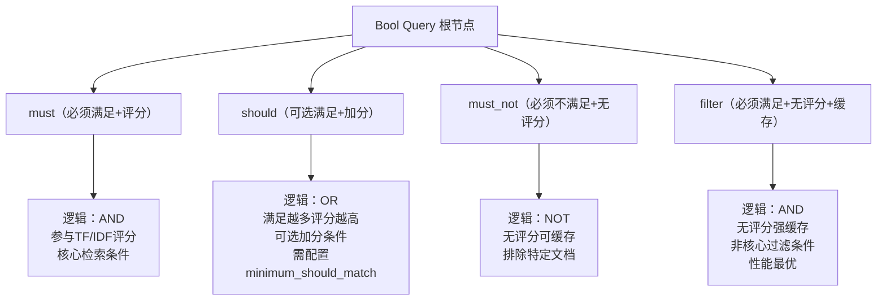
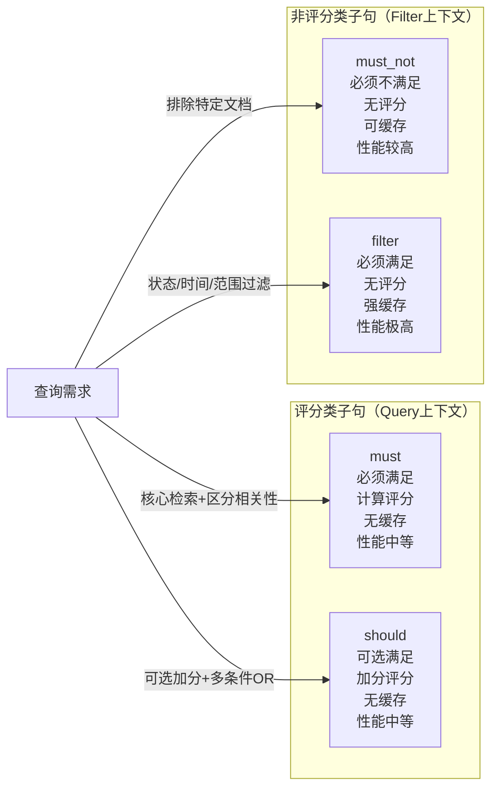
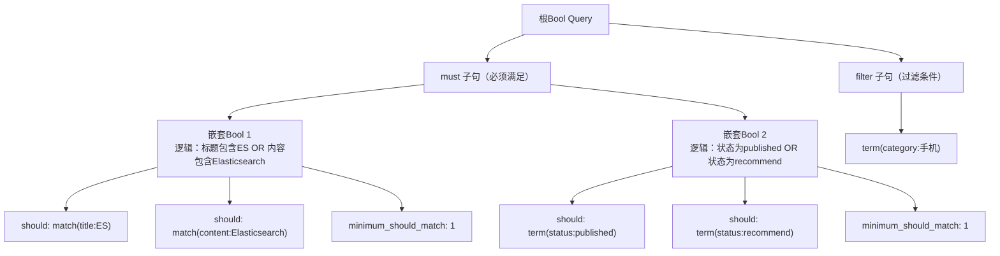
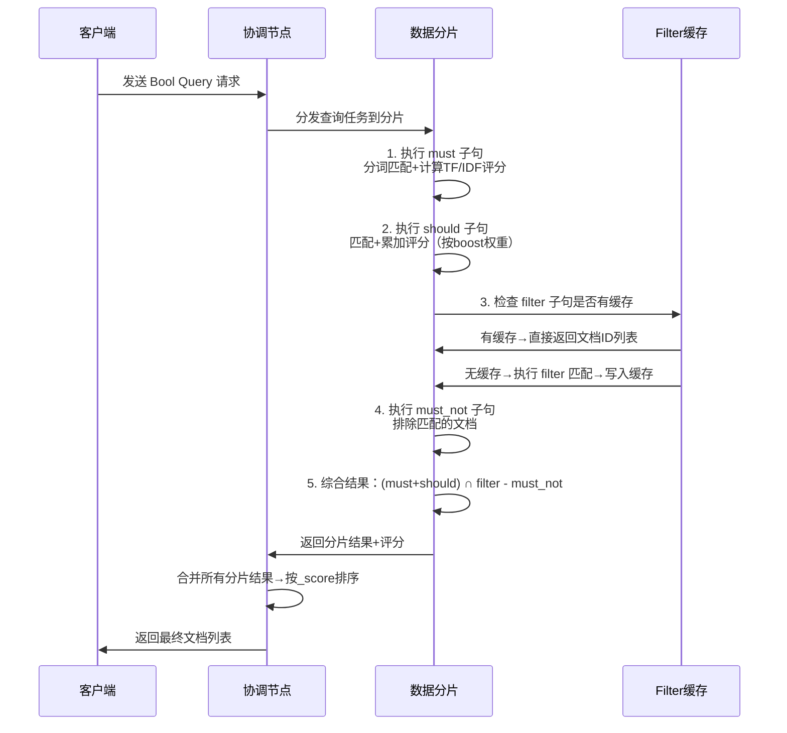

Bool Query 是 Elasticsearch 中最核心、最灵活的查询语法，能将多个基础查询（如 match、term、range 等）按逻辑组合，满足复杂的检索需求。

## 核心子句详解

Bool Query 有 4 个核心子句，每个子句对应不同的布尔逻辑，是掌握 Bool Query 的关键：

| 子句类型 | 逻辑含义 | 是否计算评分 | 是否可缓存 | 核心场景 |
|---------|---------|------------|-----------|---------|
| `must` | 必须满足（AND） | 是（TF/IDF） | 否 | 核心检索条件（如标题匹配关键词） |
| `should` | 可选满足（OR） | 是（满足越多评分越高） | 否 | 加分/可选条件（如包含指定标签） |
| `must_not` | 必须不满足（NOT） | 否（_score=0） | 是 | 排除条件（如排除已删除文档） |
| `filter` | 必须满足（AND） | 否（_score=0） | 是 | 过滤条件（如状态、时间范围） |



### must 子句

**逻辑等价于 AND**，文档必须满足该子句下的所有查询条件，只要有一个条件不满足，文档就会被过滤掉。

**评分特性**：

- 参与**相关性评分**（`_score`）：子句内的每个查询（如 match）会根据 TF/IDF 计算评分，最终汇总为文档的总评分
- 评分越高，文档在结果中的排序越靠前

**适用场景**：

仅用于**核心检索条件**（需要区分相关性的场景），比如：
- 全文检索（标题/内容包含指定关键词）
- 需计算评分的精准匹配（如关键词权重调整）

**示例**：

```json
{
  "query": {
    "bool": {
      "must": [
        {"match": {"title": "Elasticsearch"}},
        {"match": {"content": "性能优化"}}
      ]
    }
  }
}
```

**注意事项**：

- `must` 子句计算评分，性能低于 `filter`，**不适合纯过滤场景**（如状态、时间范围）
- 多个 `must` 子句是"且"关系，条件越多，匹配的文档越少

### should 子句

**逻辑等价于 OR**，文档满足该子句下的任意条件即可，是"加分项"而非必选项。

**评分特性**：

- 参与相关性评分：满足的 `should` 子句越多，文档的 `_score` 越高
- 单个 `should` 子句内的查询也会计算自身评分（如 `boost` 权重）

**关键规则**：

| 查询场景 | `should` 生效规则 |
|---------|-----------------|
| 只有 `should` 子句 | 默认至少满足 1 个（可通过 `minimum_should_match` 调整） |
| 有 `must`/`filter` 子句 | `should` 可全部不满足（仅作为加分项） |

**适用场景**：

- 可选的加分条件（如"包含指定标签的文档排名更靠前"）
- 多条件"或"逻辑（如"标题包含 ES 或 内容包含 Elasticsearch"）

**示例**：

```json
{
  "query": {
    "bool": {
      "must": [{"match": {"title": "ES 教程"}}],
      "should": [
        {"term": {"tag.keyword": "精品", "boost": 3.0}},
        {"match": {"content": "实战案例"}}
      ],
      "minimum_should_match": 1
    }
  }
}
```

**注意事项**：

- 用 `minimum_should_match` 强制 `should` 生效（如 `minimum_should_match: 2` 表示至少满足 2 个）
- 避免过多 `should` 子句（会增加评分计算开销）

### must_not 子句

**逻辑等价于 NOT**，文档必须完全不满足该子句下的所有条件，只要满足一个就会被排除。

**评分特性**：

- 不计算相关性评分（匹配的文档 `_score` 为 0）
- 结果可缓存（性能高于 `must`，但低于 `filter`，因为是"排除"逻辑）

**适用场景**：

- 排除特定文档（如"排除已删除的文档""排除库存为 0 的商品"）
- 过滤无效数据（如"排除作者为匿名的内容"）

**示例**：

```json
{
  "query": {
    "bool": {
      "must": [{"match": {"title": "ES 教程"}}],
      "must_not": [
        {"term": {"status.keyword": "deleted"}},
        {"range": {"publish_time": {"lt": "2020-01-01"}}}
      ]
    }
  }
}
```

**注意事项**：

- `must_not` 会遍历倒排索引排除文档，条件越多性能越低，尽量精简
- 不支持 `boost` 参数（无评分，权重无意义）
- 对 `text` 字段使用时，需用 `keyword` 子字段（如 `title.keyword`）

### filter 子句

**逻辑等价于 AND**，文档必须满足该子句下的所有条件，和 `must` 逻辑相同，但特性完全不同。

**核心特性（和 must 对比）**：

| 特性 | filter 子句 | must 子句 |
|-----|------------|-----------|
| 评分计算 | 不计算（_score=0） | 计算（TF/IDF） |
| 结果缓存 | 支持（ES 自动缓存过滤结果） | 不支持 |
| 性能 | 极高（无计算+缓存） | 中等（需计算评分） |
| 适用条件 | 非核心过滤条件（状态/时间） | 核心检索条件（全文匹配） |

**适用场景**：

所有**不需要区分相关性、仅需过滤**的条件，比如：
- 状态过滤（已发布/未发布）
- 时间范围过滤（近 7 天/2024 年发布）
- 数值范围过滤（价格 100-500 元、库存>0）
- 枚举值过滤（分类=手机、标签=爆款）

**示例**：

```json
{
  "query": {
    "bool": {
      "must": [{"match": {"title": "ES 教程"}}],
      "filter": [
        {"term": {"status.keyword": "published"}},
        {"range": {"price": {"gte": 100, "lte": 500}}},
        {"term": {"category.keyword": "技术"}}
      ]
    }
  }
}
```

**注意事项**：

- **性能最优实践**：优先将所有非评分条件放入 `filter`，仅保留核心检索条件在 `must`
- `filter` 子句的结果缓存是"分片级"的，相同条件在同一分片上会复用缓存
- 支持嵌套 Bool 查询（如 `filter` 内再包 Bool，实现复杂过滤逻辑）

## 基础语法结构

### 最简格式

```json
{
  "query": {
    "bool": {
      "must": [...],
      "should": [...],
      "must_not": [...],
      "filter": [...]
    }
  }
}
```

### 完整格式

```json
{
  "query": {
    "bool": {
      "must": [
        {"match": {"title": "ES 教程"}}
      ],
      "should": [
        {"match": {"content": "实战"}},
        {"term": {"tag.keyword": "精品"}}
      ],
      "minimum_should_match": 1,
      "must_not": [
        {"term": {"status.keyword": "deleted"}}
      ],
      "filter": [
        {"range": {"publish_time": {"gte": "2024-01-01"}}},
        {"term": {"category.keyword": "技术"}}
      ],
      "boost": 2.0
    }
  }
}
```

## 核心参数

### minimum_should_match

强制要求 `should` 子句的最小满足数量，支持**数字**或**百分比**：

- 数字：如 `1` → 至少满足 1 个 `should` 子句
- 百分比：如 `50%` → 至少满足 50% 的 `should` 子句（向下取整）

**适用场景**：当 `should` 子句较多时，控制文档的匹配门槛。

**示例**：

```json
{
  "query": {
    "bool": {
      "should": [
        {"match": {"content": "性能优化"}},
        {"match": {"content": "实战案例"}},
        {"match": {"content": "入门教程"}}
      ],
      "minimum_should_match": 2
    }
  }
}
```

### boost

提升整个 Bool Query 的评分权重，默认值为 `1.0`：

- 数值越大，该 Bool 查询的评分在总评分中的占比越高
- 适合多 Bool 查询嵌套时，调整不同 Bool 块的权重



## 实战场景

### 基础组合查询

**需求**：查询"标题包含 ES 教程、状态为已发布、发布时间≥2024 年、排除作者为匿名、可选包含'实战'标签"的文档。

```json
{
  "query": {
    "bool": {
      "must": [
        {"match": {"title": "ES 教程"}}
      ],
      "should": [
        {"term": {"tag.keyword": "实战"}}
      ],
      "must_not": [
        {"term": {"author.keyword": "匿名"}}
      ],
      "filter": [
        {"term": {"status.keyword": "published"}},
        {"range": {"publish_time": {"gte": "2024-01-01"}}}
      ]
    }
  },
  "size": 20,
  "_source": ["title", "author", "publish_time"]
}
```

### 嵌套 Bool Query

**需求**：查询"（标题包含 ES 或 内容包含 Elasticsearch）且（状态为已发布 或 状态为推荐）且 排除库存≤0 的商品"。

```json
{
  "query": {
    "bool": {
      "must": [
        {
          "bool": {
            "should": [
              {"match": {"title": "ES"}},
              {"match": {"content": "Elasticsearch"}}
            ],
            "minimum_should_match": 1
          }
        },
        {
          "bool": {
            "should": [
              {"term": {"status.keyword": "published"}},
              {"term": {"status.keyword": "recommend"}}
            ],
            "minimum_should_match": 1
          }
        }
      ],
      "must_not": [
        {"range": {"stock": {"lte": 0}}}
      ]
    }
  }
}
```



### 纯 Filter 查询

**需求**：仅过滤"分类为手机、价格在 1000-5000 元、库存>0"的商品（无核心检索，仅过滤）。

```json
{
  "query": {
    "bool": {
      "filter": [
        {"term": {"category.keyword": "手机"}},
        {"range": {"price": {"gte": 1000, "lte": 5000}}},
        {"range": {"stock": {"gt": 0}}}
      ]
    }
  }
}
```

## 核心原理

Bool Query 通过 **布尔逻辑（AND/OR/NOT）** 将多个子查询（称为"子句"）组合起来，最终判断文档是否符合整体条件：

1. 接收多个子句（must/should/must_not/filter），每个子句可包含任意基础查询（match/term/range 等）
2. 按子句类型的逻辑规则，分别判断文档是否满足每个子句
3. 综合所有子句的判断结果，确定文档是否符合整体条件
4. 对符合条件的文档，计算相关性评分（仅 Query 上下文的子句参与评分）

**核心特点**：

- 灵活组合：支持"必须满足""必须不满足""可选满足""过滤满足"四类逻辑
- 评分可控：区分"计算评分的子句"和"不计算评分的子句"，兼顾检索精准度和性能
- 兼容性强：可嵌套使用（Bool 内再包含 Bool），满足极复杂的查询逻辑

## 执行流程



## 性能优化

### 优先使用 filter 而非 must

- 对"不需要计算评分"的条件（如状态、时间、数值范围），全部放入 `filter` 子句
- `filter` 结果可缓存，后续相同条件查询无需重新计算，性能提升显著

### 减少 must 子句的数量

- `must` 子句参与评分，计算开销大，仅将"核心检索条件"（如全文匹配）放入 `must`
- 非核心条件优先放入 `filter`

### 合理使用 must_not

- `must_not` 会遍历倒排索引排除文档，条件越多性能越低
- 如需排除大量数据，建议在索引时做标记（如 `is_deleted: true`），仅用一个 `must_not` 条件排除

### 控制 should 子句的数量

- `should` 子句越多，评分计算越复杂
- 非必要的 `should` 条件可拆分为多个查询，或降低 `minimum_should_match` 阈值

## 常见避坑点

### should 子句的生效规则

- 若 Bool 查询中**只有 `should` 子句**，默认至少满足 1 个
- 若有 `must`/`filter` 子句，`should` 子句可全部不满足（仅加分），需通过 `minimum_should_match` 强制生效

### 嵌套 Bool 的评分逻辑

- 嵌套 Bool 内的 `must/should` 会计算评分，并汇总到外层 Bool 的总评分
- 嵌套 Bool 内的 `filter/must_not` 不计算评分，仅过滤文档

### boost 参数的作用范围

- `boost` 仅提升当前 Bool 块的评分，不影响子句内查询的 `boost`
- 如需调整子句的权重，应在子查询内设置 `boost`（如 `{"match": {"title": {"query": "ES", "boost": 3.0}}}`）

## 总结

Bool Query 是 ES 组合多条件的核心，通过 4 个子句实现复杂逻辑：

| 子句 | 特性 | 适用场景 |
|-----|------|---------|
| **must** | 必须满足 + 计算评分 | 仅用于核心全文检索 |
| **should** | 可选满足 + 加分评分 | 用于可选条件或"或"逻辑，需注意 `minimum_should_match` 规则 |
| **must_not** | 必须不满足 + 无评分 | 用于排除特定文档，条件越少性能越好 |
| **filter** | 必须满足 + 无评分 + 缓存 | 性能最优，优先用于所有非评分过滤条件 |

**核心口诀**：**评分用 must/should，过滤用 filter，排除用 must_not**

性能优化核心：优先用 `filter` 处理非评分条件，减少 `must`/`must_not` 子句数量；`should` 子句需注意生效规则，嵌套 Bool 可满足极复杂的查询逻辑，是生产环境中最常用的查询类型。
